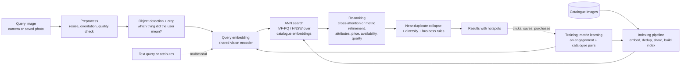
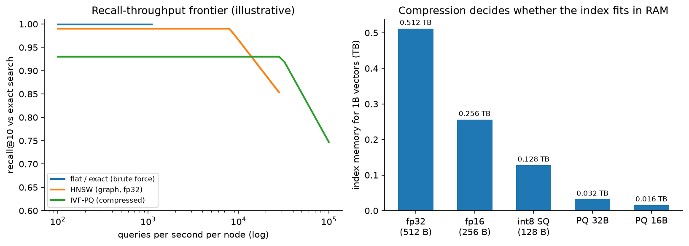

# Visual search & image retrieval

> **Why this matters / who asks it.** Pinterest (Lens, Shop the Look), Google (Lens),
> Amazon (StyleSnap), eBay, Alibaba, Shopify and every marketplace with a camera icon
> ask this question. The business problem is that a photograph carries an intent no
> keyword can express, and the company owns a catalogue of hundreds of millions of
> items that could satisfy it. The interviewer is looking for three things: whether
> you can choose and train an embedding model for the actual retrieval task,
> whether you know what a billion-vector index costs in memory and latency, and
> whether you understand that the hard part of "shop the look" is object detection
> and product matching rather than similarity search.

## TL;DR: the whiteboard in 60 seconds

- **Detection first.** A photo of a living room contains a sofa, a lamp and a rug.
  Detecting objects and letting the user pick one (or picking the salient one) turns
  an ambiguous query into a well-posed one. Pinterest's Lens and Shop the Look work
  this way.
- **One embedding space, many uses.** A single vision encoder serves search,
  recommendations and near-duplicate detection, which saves an index and keeps
  behaviour consistent across surfaces.
- **Metric learning with the right positives.** In-batch sampled softmax or a
  triplet loss over pairs that come from engagement (clicked or purchased after a
  visual query) and from catalogue structure (same product, different photo).
- **CLIP-style contrastive pretraining** gives zero-shot text-image alignment and a
  strong initialisation, then fine-tune on catalogue data for the product-matching
  task that pretraining does not cover.
- **ANN at a billion vectors is a memory problem before it is a latency problem.**
  fp32 at 128 dims costs 512 GB per billion; product quantisation to 32 bytes brings
  it to 32 GB and costs recall. Pick the point on that curve deliberately.
- **Near-duplicates dominate the catalogue.** The same product appears under twenty
  sellers with different crops. Collapse duplicates at index time and again at
  result time, or the top ten will be one item shown ten ways.
- **Index freshness** is an ingestion pipeline: new listings should be searchable in
  minutes, which means incremental inserts plus periodic full rebuilds.
- **Latency budget**: detection 30 ms, embedding 20 ms, ANN 20 ms, re-rank 30 ms,
  network and assembly the rest, inside a 500 ms perceived budget on mobile.
- **Evaluation**: recall@k against human-judged matches, exact-product accuracy for
  product matching, and online engagement (clicks, saves, purchases per visual
  search), with a human relevance audit as the guardrail.
- **Evidence**: Pinterest (visual search 2015, Lens and Shop the Look 2017 to 2019,
  unified visual embeddings 2021), eBay (visual search 2017), Alibaba (Pailitao,
  KDD 2018), Google Lens, and the ANN literature (FAISS, HNSW, ScaNN).

## 1. Requirements & scoping

**Functional.** Accept an image (camera capture, gallery photo, or a crop of an
existing page image), optionally with a text refinement ("in blue"), detect the
objects in it, and return ranked catalogue items that match the selected object, with
the detected regions shown as tappable hotspots. Support "more like this" from any
catalogue image, and support duplicate detection for the catalogue team.

**Non-functional, with the numbers to ask for.**

| Quantity | Ask the interviewer | A defensible assumption |
|---|---|---|
| Catalogue size | "How many indexable images? How many distinct products?" | 1B images, 300M distinct products |
| Query volume | "Visual searches per second at peak?" | 2k/s average, 10k/s peak |
| Latency | "Perceived budget on mobile, including upload?" | 500 ms after upload; 800 ms end to end on a mobile network |
| Freshness | "How fast must a new listing be visually searchable?" | Under 10 minutes |
| Image quality | "Camera photos, or catalogue photos, or both?" | Both, and camera photos are the hard case |
| Cost | "GPU budget for embedding the catalogue and serving queries?" | Catalogue embedding is a one-off plus incremental; query GPUs scale with QPS |
| Coverage | "Which verticals? Fashion, home, everything?" | Start with two verticals where the catalogue is dense |

**Success metrics.**

- Online: click-through and save rate on visual search results, purchases attributed
  to visual search, and the fraction of visual searches that produce any engagement
  (a proxy for "did we understand the photo at all").
- Guardrails: human-rated relevance on a sampled set, latency p99, the rate of
  empty or low-confidence results, and duplicate rate in the top ten.
- Offline: recall@k against an adjudicated match set, exact-product top-1 accuracy
  for the product-matching task, and detection AP for the object-detection stage.

**Questions a staff engineer asks.**

1. "Is the task *find this exact product* or *find things that look like this*?
   Exact matching and style similarity want different training pairs and different
   thresholds, and conflating them is the usual reason a visual search feels wrong."
2. "Who supplies the catalogue images, and are they clean studio shots? A
   studio-to-camera domain gap is the single largest source of error."
3. "Can the user pick the object, or must we choose? Picking wrongly on a busy photo
   looks worse than returning nothing."
4. "Do we have text alongside the image at query time? A hybrid query is much easier
   than a pure image query."
5. "What happens on a no-match? A grid of bad results is worse than an honest 'we
   could not find this'."

## 2. Data

**Sources.** The catalogue (product images, titles, attributes, category, price,
seller), user-generated images (pins, listings photos, reviews), query images from
the visual search itself, engagement logs joining a query image to the results shown
and to what the user clicked or bought, and human-adjudicated match sets.

**Labels.**

| Pair source | How it is made | Strength | Bias |
|---|---|---|---|
| Same-product, different photo | Catalogue structure (one SKU, several images) | Strong positive for exact matching | Only covers catalogue-quality images |
| Click or save after a visual query | Engagement logs | Plentiful, weakly positive | Position bias, and the user may click something merely pretty |
| Purchase after a visual query | Order logs | Strongest intent signal | Sparse, delayed |
| Human-adjudicated match | Paid raters on sampled queries | Clean evaluation data | Expensive, small |
| Augmented pair | Crop, colour jitter, re-compress, re-photograph | Free, teaches invariance | Synthetic gap to real camera photos |

**The domain gap.** The query photo is taken on a phone, in bad light, at an angle,
against a cluttered background. The catalogue photo is shot on white. A model trained
only on catalogue-to-catalogue pairs looks excellent offline and fails on the first
real query. Two fixes belong in the design: train with pairs that cross the domain
(user photos matched to catalogue items through purchase logs), and augment
aggressively toward the camera domain (perspective warps, motion blur, JPEG
artefacts, background compositing).

**Position and presentation bias.** Visual results are a grid, so the bias is
weaker than a single-column feed but still present, and the top-left cell gets
disproportionate attention. Log the grid position and either debias with a position
feature during training or run a small randomisation of the top row to estimate
propensities. The mechanics are in the
[feed chapter](01-recommendation-feed-ranking.md#35-position-bias).

**Catalogue hygiene.** Duplicate and near-duplicate images are the norm in a
marketplace. Before indexing, group images by perceptual hash and by embedding
similarity, pick a canonical image per product group, and store the group id in the
index payload so the serving path can collapse results.

**Privacy.** Query images are user content. Store them only with consent and only as
long as needed; strip EXIF location; run a safety classifier before any image enters
a training set; and treat photos containing people with extra care, since visual
search on faces is a different product with different rules.

## 3. Modelling

### 3.1 Baseline

A pretrained image classifier with the penultimate layer as the embedding, cosine
similarity, and a flat index over a few million catalogue images. It works well
enough to test demand and to collect the engagement data that the real model needs.
Its weakness is that classification features cluster by category, so a red dress and
a blue dress of the same cut sit far apart while two unrelated dresses sit close.

### 3.2 The embedding model

The training objective decides what "similar" means, so it is the decision to justify
first.

**Contrastive (sampled softmax / InfoNCE).** With a batch of $B$ pairs, embeddings
$u_i$ for the query image and $v_i$ for the positive catalogue image, both
$L_2$-normalised, and temperature $\tau$:

$$
\mathcal{L} = -\frac{1}{B}\sum_{i=1}^{B} \log
\frac{\exp(u_i^\top v_i / \tau)}{\sum_{j=1}^{B} \exp(u_i^\top v_j / \tau)} .
$$

Every other item in the batch is a negative, so large batches matter. The same
sampling-bias correction used in recommendation retrieval applies when items appear
at very different frequencies: subtract $\log q_j$ from the logits, as derived in the
[feed chapter](01-recommendation-feed-ranking.md#32-retrieval-the-two-tower-model-and-its-objective).

**Triplet / margin losses.** $\max(0, \|u - v^+\|^2 - \|u - v^-\|^2 + m)$, with
negatives mined for difficulty. Easier to control for exact-match tasks, harder to
scale, and sensitive to the mining schedule.

**Multi-task heads.** One trunk with several heads (category, attributes, exact
product id) plus the metric head. The auxiliary supervision stabilises training and
gives attribute features the re-ranker can use.

**CLIP-style pretraining** (Radford et al., "Learning Transferable Visual Models From
Natural Language Supervision", ICML 2021, [arXiv:2103.00020](https://arxiv.org/abs/2103.00020)) aligns images and text in
one space from web-scale pairs, which gives text-refined visual search almost for
free and a strong initialisation. Fine-tuning on catalogue pairs is still required,
since CLIP-style pretraining learns semantic similarity rather than
exact-product identity, and a visual search that returns "a sofa" when the user
photographed a specific sofa fails the product task. The contrastive machinery is
covered in [CLIP & contrastive learning](../part08-multimodal/03-clip-contrastive.md).

**Dimension and normalisation.** 128 to 512 dimensions is the usual range.
$L_2$-normalise so that inner product equals cosine, which lets the index use the
cheaper metric. Every extra dimension is a linear increase in index memory, so treat
the dimension as a budget decision measured by recall@k, not as a hyperparameter to
maximise.

### 3.3 Detection and the "which object" problem

A query photo rarely contains one thing. Pinterest's Lens work and Shop the Look
both frame this as detect-then-retrieve: run an object detector trained on the
verticals you sell, show the detected regions as hotspots, and retrieve for the
selected or most salient region. Three design notes:

- The detector's class set should match the shopping taxonomy, not COCO. "Throw
  pillow" and "area rug" matter; "person" is there only to be excluded.
- Salience matters when the user does not tap. Centre bias, area, and detector
  confidence combine into a simple ranker for which crop to use by default.
- For a whole-scene query ("complete this room"), the task changes from matching one
  object to composing a set, which is a different objective and a different
  evaluation.

### 3.4 Approximate nearest neighbour search

The index is where the cost lives. Three families, and the trade-offs you should be
able to state without notes:

| Family | How it works | Memory per vector | Strengths | Weaknesses |
|---|---|---|---|---|
| Flat (exact) | Brute-force scan | $4d$ bytes (fp32) | Perfect recall, trivial updates | Linear in corpus, only viable to a few million |
| IVF + PQ | Cluster into cells, scan a few cells, compress residuals into codes | 16 to 64 bytes | Smallest memory at billion scale, tunable | Recall loss from quantisation, training step needed |
| HNSW (graph) | Navigable small-world graph, greedy descent | $4d$ + graph links | Highest recall per query time | Memory hungry, deletions are awkward |

{ width="760" }

*Left: an illustrative recall-versus-throughput frontier. Graph indexes hold high
recall to high throughput and pay for it in memory; compressed IVF-PQ gives up some
recall and fits where a graph index would not. Right: index memory for one billion
128-dimensional vectors, which is the number that decides how many machines you need.*

Practical arithmetic to do out loud: one billion vectors at 128 dimensions in fp32 is
512 GB, which needs sharding across machines. The same billion at 32-byte PQ codes is
32 GB, which fits in one large host's memory with room for the coarse quantiser. That
difference decides the architecture, so measure the recall cost of the compression on
your own data before choosing. FAISS (Johnson, Douze & Jégou, "Billion-scale
similarity search with GPUs", [arXiv:1702.08734](https://arxiv.org/abs/1702.08734)) is the reference implementation for
the IVF-PQ family; HNSW comes from Malkov & Yashunin ([arXiv:1603.09320](https://arxiv.org/abs/1603.09320)); ScaNN
(Guo et al., ICML 2020, [arXiv:1908.10396](https://arxiv.org/abs/1908.10396)) adds anisotropic quantisation tuned for
inner-product search.

**Sharding and routing.** Partition by vertical or by a coarse cluster id so a query
touches a few shards. Replicate each shard for throughput and availability. Keep a
small in-memory cache of embeddings for the hottest products so the re-ranker does
not round-trip.

**Filtering.** Real queries have constraints (in stock, ships to this country, under
this price). Pre-filtering breaks the index structure; post-filtering can empty the
result set. The usual compromise is to over-retrieve by a factor of five to ten and
filter afterwards, with separate indexes for the big partitions (country, vertical)
where the filter is highly selective.

### 3.5 Re-ranking

ANN gives a coarse ordering by embedding distance. The re-ranker improves precision
on the top 100 to 500 using signals the embedding cannot carry:

- A stronger visual comparison: cross-attention over the query crop and the candidate
  image, or a local-feature geometric verification for exact-product matching (the
  classical approach still works well for rigid objects with texture).
- Attribute agreement (colour, pattern, material) predicted by auxiliary heads.
- Product quality, price sanity, seller trust, stock, and engagement priors.
- Near-duplicate collapse so the ten results are ten products.

### 3.6 Product matching and near-duplicate detection

Deduplication is a distinct problem from search, and the interviewer often pivots to
it. Two thresholds, two mechanisms:

- **Exact/near-exact copies** (same photo re-uploaded, re-cropped, re-compressed):
  perceptual hashing (pHash, or PDQ from the moderation world) is cheap, precise and
  explainable. Use it first.
- **Same product, different photo**: embedding similarity above a tuned threshold,
  verified by a pairwise classifier over image, title and attribute features. This is
  the same shape as the mini-mock in the
  [framework chapter](00-framework.md#9-a-worked-mini-mock-design-duplicate-listing-detection-for-a-marketplace).

Both feed a clustering step that assigns a canonical product id, which the index
payload carries so serving can collapse results in one pass.

### 3.7 Multimodal and text refinement

Once images and text share a space, the query can be a combination: the embedding of
the photo plus a text delta ("in green", "cheaper"). The simple version adds
normalised embeddings with a learned weight. The better version trains a small
composition network on triplets of (image, modifier text, target image), which is the
composed-image-retrieval setup. Keep the simple version as the launch path and the
composed model as the follow-up, since the training data for composition has to be
built.

### 3.8 Cold start

A new product gets an embedding the moment its image is processed, so visual search
has no cold-start problem in the recommendation sense. What it does have is a
*quality* cold start: no engagement priors for the re-ranker. Fall back to
category-level priors and seller reputation, and let the exploration slots in the
grid gather the first interactions.

## 4. Training & serving

**Indexing pipeline.** New or updated catalogue images land on a queue. A worker
runs safety classification, the detector (for catalogue images with multiple items),
the embedding model, and perceptual hashing, then writes the vector plus payload
(product id, group id, filters) to the index build service. Incremental inserts keep
freshness under ten minutes; a full rebuild runs weekly, or whenever the embedding
model changes.

**Model version and index version move together.** Changing the encoder invalidates
every vector in the index. The rollout is: embed the whole catalogue with the new
model into a parallel index, run both indexes in shadow, compare recall and
engagement on a sample, then switch. Budget for the cost of a full re-embedding when
proposing a model change, because at a billion images it is a real number (a billion
images at 2 ms of GPU time each is about 550 GPU-hours).

**Serving path and latency budget (500 ms perceived, after upload).**

| Stage | Budget | Notes |
|---|---|---|
| Decode, resize, quality check | 15 ms | reject blurry or tiny images early |
| Object detection | 30 ms | GPU, batched across concurrent requests |
| Query embedding | 20 ms | same GPU call as detection where possible |
| ANN search (fan-out to shards) | 25 ms | over-retrieve 5x for filtering |
| Filter, dedup, payload fetch | 25 ms | in-memory payloads |
| Re-rank top 300 | 40 ms | GPU for the cross-attention variant |
| Assembly, hotspot layout | 15 ms | |
| Network and headroom | rest | mobile upload dominates end-to-end time |

**On-device options.** Running detection on the phone cuts upload size (send the crop,
not the photo) and improves perceived latency on slow networks. The trade-off is a
second detector to maintain and a version-skew problem between app releases and
server models. A common compromise: on-device detection for the hotspot UI,
server-side detection as the source of truth for retrieval.

**Caching.** Cache embeddings for repeated queries (the same photo searched twice),
cache popular catalogue payloads, and cache whole result sets for "more like this"
from a catalogue image, since that query is deterministic until the index changes.

**Cost.** At 10k QPS peak with 50 ms of GPU per query, the serving fleet needs about
500 GPU-seconds per second, so a few hundred GPUs with batching and headroom. The
index fleet is memory-bound: a billion PQ-compressed vectors plus payloads across
replicated shards, which is a RAM bill rather than a GPU bill.

## 5. Evaluation & experimentation

**Offline.**

- Recall@k against an adjudicated match set, reported per vertical and per query
  type (camera photo versus catalogue image), because the camera-photo numbers are
  the ones that predict the product experience.
- Exact-product top-1 accuracy for the matching task, which is the metric that
  catches a model that has learned category similarity and nothing finer.
- Detection AP on the shopping taxonomy.
- ANN recall against brute force on a sample, measured after every index build. A
  quiet drop here looks exactly like a model regression and is much more common.
- Pitfalls: evaluating on catalogue-to-catalogue pairs only, evaluating recall
  against logged clicks (which only exist for what the old index returned), and
  reporting a single number across verticals where one vertical dominates volume.

**Online.** A/B on engagement per visual search, with human relevance audits as the
guardrail and latency as the second guardrail. Interleaving works well here because
the result set is a grid and attribution is per item. Watch the "no engagement at
all" rate, since that is where a broken detector shows up first.

**Monitoring.** Query image statistics (resolution, blur, dark frames), detector
confidence distribution, ANN recall on the canary sample, index size and staleness,
duplicate rate in the top ten, and per-vertical engagement. Retrain the encoder on a
slow cadence (monthly), retrain the re-ranker weekly, and rebuild the index whenever
either changes.

## 6. Trade-offs & alternatives

| Decision | Chosen | Alternative | When you'd flip |
|---|---|---|---|
| Query framing | Detect objects, retrieve per object | Whole-image retrieval | Single-object domains (a shoe on white) where detection adds latency for nothing |
| Encoder | CLIP-style pretrain, fine-tune on catalogue pairs | Train from scratch on catalogue data | Huge proprietary catalogue and a narrow domain, where pretraining transfers little |
| Loss | In-batch contrastive with large batches | Triplet with hard mining | Exact-product matching with few classes per batch, where explicit margins are easier to control |
| Index | IVF-PQ at billion scale | HNSW | Corpus under ~100M and memory is available; HNSW gives better recall per millisecond |
| Filtering | Over-retrieve then filter | Filtered ANN traversal | Very selective filters (country plus category), where separate indexes win |
| Dedup | Hash for exact, embedding plus classifier for near | Embedding only | Hashing is cheap and precise; skip it only if storage of hashes is a problem |
| Re-rank | Cross-attention on top 300 | Embedding distance only | Latency-critical surfaces, or when the embedding is already fine-tuned on the exact task |
| Detection | Server-side | On-device | Poor networks and large photos, where uploading a crop is a real win |
| Text refinement | Add a weighted text embedding | Train a composition model | Once you have modifier-labelled triplets, the composition model is better |

**Failure modes.**

- *Category collapse*: the model returns the right category and the wrong product.
  Detect with exact-product top-1, not recall@50.
- *Domain gap*: strong offline numbers, weak camera-photo performance. Detect by
  splitting every metric by query source.
- *Index and model version skew*: half the index embedded with the old encoder.
  Version the index, refuse mixed versions, and monitor a canary set.
- *Duplicate flooding*: one product occupying the grid. Collapse by group id and
  monitor the duplicate rate.
- *Safety*: a visual query returning unsafe or infringing items. Run classification
  at index time and filter at serving; see [content moderation](07-content-moderation.md).

## 7. How real companies did it: as mock interviews

### 7.1 Pinterest, "a camera search for a visual product"

**Interviewer prompt.** "Pinners save images of rooms and outfits. They want to find
and buy the individual objects in those images. Build visual search, and do it
without a research budget the size of a search engine's."

**Candidate walkthrough.** *Clarify*: the corpus is billions of pins, most queries
come from within the app, and the product is "find this object" rather than "find a
similar picture". *Metrics*: engagement with visual results, then purchases.
*Data*: pin images with rich metadata, plus click and save logs from the existing
surfaces. *Model*: a shared embedding from a deep network, reused across surfaces;
object detection to turn a scene into objects; a light re-ranker for precision.
*Serve*: distributed embedding and ANN infrastructure built on commodity parts, with
incremental indexing. *Evaluate*: offline relevance plus live A/B on engagement.

**What the sources say.** Jing et al., "Visual Search at Pinterest" (KDD 2015,
[arXiv:1505.07647](https://arxiv.org/abs/1505.07647)) describes building a visual search system with commodity components
and reports engagement gains from visual-similarity products. Zhai et al., "Visual
Discovery at Pinterest" (WWW 2017, [arXiv:1702.04680](https://arxiv.org/abs/1702.04680)) covers the move to object-level
search and the Lens product. Zhai et al., "Learning a Unified Embedding for Visual
Search at Pinterest" (KDD 2019, [arXiv:1908.01707](https://arxiv.org/abs/1908.01707)) reports replacing several
specialised embeddings with one multi-task embedding serving several products, which
simplified serving and improved metrics. Beal et al., "Billion-scale pretraining with
vision transformers for multi-task visual representations" (WACV 2022,
[arXiv:2108.05887](https://arxiv.org/abs/2108.05887)) describes their later transformer-based unified representation.

!!! tip "How to say it in the interview: one embedding, many surfaces"
    "I'd train one embedding and use it for visual search, related pins and
    deduplication, with task-specific heads on top of a shared trunk. The
    alternative is a separate model per surface, which lets each team tune its own
    objective. The cost of that is three indexes, three training pipelines, and
    inconsistent behaviour when the same pair of images is similar on one surface
    and not on another. Pinterest published this exact consolidation in 'Learning a
    Unified Embedding for Visual Search at Pinterest' at KDD 2019, where one
    multi-task embedding replaced several specialised ones and improved their
    metrics while simplifying serving. I'd flip back to a specialised model if one
    surface needed a very different notion of similarity, for example exact-product
    matching for legal takedowns, where I want a threshold I can defend rather than
    a shared representation."

!!! tip "How to say it in the interview: detect before you retrieve"
    "The first stage is an object detector, not the embedding. A photo of a living
    room has a sofa, a lamp and a rug in it, and retrieving on the whole image
    returns other living rooms, which is not what the user wants to buy. Pinterest
    described this shift to object-level search in 'Visual Discovery at Pinterest'
    (WWW 2017), where detected objects become the searchable units and the UI shows
    them as hotspots. The alternative is whole-image retrieval, which is cheaper by
    30 ms and is the right call for a single-object domain like sneakers on a white
    background. The trade-off is that a wrong crop is a visible failure: if we pick
    the lamp when the user meant the sofa, the results look broken even though
    retrieval worked. So I'd show the hotspots and let the user correct us, and pick
    the default crop by salience and detector confidence."

### 7.2 eBay, "a hundred million listings that change every day"

**Interviewer prompt.** "Our inventory turns over constantly and most listings are
photographed by sellers on phones. Build visual search on top of that, on a budget,
and keep it fresh."

**Candidate walkthrough.** *Clarify*: inventory churn is the defining constraint, so
indexing throughput matters more than index sophistication; images are low quality
and varied. *Metrics*: recall of the right item plus engagement. *Data*: listing
images with category and aspect metadata. *Model*: a category-aware embedding, with
category prediction narrowing the search space before the ANN step. *Serve*: a
distributed index rebuilt continuously as listings come and go, with binary or
compressed codes to keep memory in budget. *Evaluate*: offline retrieval metrics,
then A/B.

**What the source says.** Yang et al., "Visual Search at eBay" (KDD 2017,
[arXiv:1706.03154](https://arxiv.org/abs/1706.03154)) describes a deployed visual search system over a large, rapidly
changing inventory, including category recognition to constrain the search, binary
semantic-hash style representations for efficiency, and a scalable serving
infrastructure that handles inventory churn.

!!! tip "How to say it in the interview: use the taxonomy to shrink the search"
    "I'd predict the category from the query image and restrict the ANN search to
    that category's partition. eBay reported doing this in 'Visual Search at eBay'
    (KDD 2017), using category recognition to narrow the candidate set before visual
    matching over an inventory that turns over daily. The alternative is a single
    global index, which is simpler and avoids a hard failure when the category
    prediction is wrong. The trade-off is exactly that failure: if the classifier
    says 'shoes' and the user photographed a bag, we return nothing useful, so I'd
    search the top two or three predicted categories rather than one, and fall back
    to the global index when the category confidence is low. What I get in return is
    a smaller scan, better precision within category, and an index I can shard along
    a boundary that matches how listings arrive."

### 7.3 Alibaba, "visual search as a shopping product at scale"

**Interviewer prompt.** "Hundreds of millions of shoppers take photos of things they
want. Build the search behind it, with a catalogue in the billions, and keep the
per-query cost low enough to be free to the user."

**Candidate walkthrough.** *Clarify*: the query is a shopper's photo, the target is an
exact or near-exact product, and the scale forces a compressed index. *Metrics*:
conversion from visual search. *Data*: user click and purchase logs joined to query
images. *Model*: a detection step to localise the item (with a way to avoid expensive
box annotation), a deep embedding trained with user-behaviour-derived pairs, and a
re-ranking stage. *Serve*: a multi-level index with an engineering path for billions
of images. *Evaluate*: offline retrieval plus live conversion.

**What the source says.** Zhang et al., ["Visual Search at Alibaba"](https://dl.acm.org/doi/abs/10.1145/3219819.3219820) (KDD 2018)
describes Pailitao, their visual search product,
including a detection approach that avoids exhaustive box labelling, deep metric
learning on user-click data, and the engineering of a billion-scale index serving
hundreds of millions of users.

!!! tip "How to say it in the interview: train on behaviour, not on catalogue structure alone"
    "The pairs I'd train on come from behaviour: the user photographed something,
    saw a grid, and bought one item. That pair crosses the domain gap between a
    phone photo and a studio image, which catalogue-only pairs never do. Alibaba
    reported training their visual search embeddings on user-click data in 'Visual
    Search at Alibaba' ([KDD 2018](https://dl.acm.org/doi/abs/10.1145/3219819.3219820)), alongside a detection step designed to avoid
    exhaustive box annotation. The alternative, training only on same-product
    catalogue images, gives clean labels and a model that looks great offline and
    fails on the first real camera photo. The trade-off with behavioural pairs is
    noise: people click attractive items that are not matches, so I'd weight
    purchases above clicks, and keep a small human-adjudicated set purely for
    evaluation so the noise never contaminates the metric."

### 7.4 Google Lens, "the query is the world"

**Interviewer prompt.** "Point a camera at anything. Text, a plant, a product, a
landmark. Give the user something useful. How do you route that?"

**Candidate walkthrough.** *Clarify*: the query is unconstrained, so the first
decision is intent routing rather than retrieval. *Metrics*: usefulness per query
type, measured separately. *Model*: a classifier or a set of detectors that decides
whether this is text (route to OCR and translation), a product (route to shopping
retrieval), a plant or animal (fine-grained classification), a landmark
(location-aware retrieval), or something else. Each route is a different system with
a different index. *Serve*: on-device for the cheap paths and text detection,
server for the heavy retrieval. *Evaluate*: per-route metrics, since a single
aggregate number would hide the failure of any one route.

**What the sources say.** Google's product documentation and [Search blog posts](https://blog.google/products-and-platforms/products/search/visual-search-ai/)
describe Lens routing camera queries into modes including text recognition and
translation, shopping results, and identification of plants, animals and landmarks,
with on-device processing for some paths; Google's ["multisearch" announcement](https://blog.google/products-and-platforms/products/search/multisearch/)
describes combining an image with a text refinement in one query.

!!! tip "How to say it in the interview: routing is the architecture"
    "For an open-ended camera product the first model is a router, because the
    systems behind 'read this sign', 'buy this jacket' and 'name this plant' share
    almost nothing except the camera. Google Lens works this way, with separate
    modes for text, shopping, and identification of plants, animals and landmarks,
    and their [multisearch work](https://blog.google/products-and-platforms/products/search/multisearch/) adds a text refinement on top of an image query. The
    alternative is one universal embedding over everything, which sounds elegant and
    loses to specialised indexes on every individual task. The trade-off with
    routing is that a routing error is a total failure, so I'd allow multiple routes
    to fire and merge their results with a confidence-weighted blend rather than
    committing to one. For OCR specifically I'd hand off to the pipeline in the
    [OCR chapter](09-ocr-document-understanding.md) rather than treating text as an
    object class."

### 7.5 The index, "make a billion vectors fit"

**Interviewer prompt.** "You told me a billion 128-dimensional vectors. That's half a
terabyte in float32. What do you actually build?"

**Candidate walkthrough.** *Clarify*: recall target, latency target, update rate,
and whether the fleet is CPU or GPU. *Model*: inverted file with product
quantisation, trained coarse quantiser, residual codes at 32 bytes, refined by
re-ranking the top candidates with fuller-precision vectors fetched from a payload
store. *Serve*: shard by coarse cluster, replicate for throughput, incremental
inserts with periodic rebuilds. *Evaluate*: recall against brute force on a fixed
sample after every build.

**What the sources say.** Johnson, Douze & Jégou, "Billion-scale similarity search
with GPUs" ([arXiv:1702.08734](https://arxiv.org/abs/1702.08734)) describes the FAISS design and reports billion-scale
k-NN construction on GPUs. Jégou, Douze & Schmid, "Product Quantization for Nearest
Neighbor Search" (IEEE TPAMI 2011) is the original PQ method. Malkov & Yashunin,
"Efficient and robust approximate nearest neighbor search using Hierarchical
Navigable Small World graphs" ([arXiv:1603.09320](https://arxiv.org/abs/1603.09320)) is HNSW. Guo et al., "Accelerating
Large-Scale Inference with Anisotropic Vector Quantization" (ICML 2020,
[arXiv:1908.10396](https://arxiv.org/abs/1908.10396)) is ScaNN's quantisation tuned for inner product.

!!! tip "How to say it in the interview: pick the index from the memory budget"
    "I'd start from memory. A billion vectors at 128 dimensions in float32 is
    512 GB, which means sharding across machines before I've served a single query.
    Product quantisation to 32 bytes per vector brings that to 32 GB, which fits on
    one large host with the coarse quantiser, and the method comes straight from
    Jégou and colleagues' product quantisation work with FAISS as the reference
    implementation. The alternative is HNSW, which gives better recall at the same
    query time and stores full vectors plus graph links, so it costs several times
    the memory. My rule is: under about a hundred million vectors, HNSW and pay for
    the RAM; above that, IVF-PQ with a re-ranking pass over full-precision vectors
    for the top few hundred, which recovers most of the recall the compression cost.
    Either way I'd measure recall against brute force on a fixed sample after every
    index build, because a silent recall drop after a rebuild looks identical to a
    model regression and is far more common."

## 8. Staff-level follow-ups

!!! interview "The results look plausible but they are never the exact product. What is wrong?"
    The model has learned category and style similarity, and the training pairs
    never taught it identity. Check the exact-product top-1 metric; recall@50 will
    look fine while top-1 is poor. The fixes, in order: add same-product pairs
    (different photos of one SKU) as positives and other products in the same
    category as hard negatives, since the negative that teaches identity is the
    visually similar wrong item; add a re-ranking stage with geometric verification
    or cross-attention on the top candidates; and check whether the embedding
    dimension is too small to carry fine detail. If the catalogue has many
    genuinely identical-looking products from different sellers, the task may be
    underdetermined from the image alone, and the answer is to use title and
    attributes in the re-ranker.

!!! interview "How do you handle the gap between a camera photo and a catalogue photo?"
    Train across it. The pairs that matter are user photo to catalogue item, which
    you get from purchase logs after a visual query. Before you have those logs,
    simulate the gap with augmentation: perspective warp, motion blur, JPEG
    re-compression, colour temperature shifts, and compositing onto cluttered
    backgrounds. Report every metric split by query source, since an aggregate
    number dominated by catalogue-to-catalogue queries will hide the problem
    entirely. If the gap is still large, a domain-adaptation head or a separate
    query encoder sharing the item encoder's output space is worth trying, at the
    cost of a second model to keep aligned.

!!! interview "You want to change the embedding model. Walk me through the rollout."
    The index is derived from the model, so a model change is a full re-embedding.
    Plan it as: embed the catalogue with the new encoder into a parallel index
    (budget the GPU hours and say the number out loud), run both indexes in shadow
    on live queries, compare recall against a fixed adjudicated set and compare the
    result sets for drift, then A/B the new index on a traffic slice, then switch
    and keep the old index warm for rollback. The two ways this goes wrong: serving
    a query embedded with the new model against vectors embedded with the old one,
    which silently returns noise, so version the index and refuse mixed versions;
    and forgetting that downstream consumers (recommendations, dedup thresholds)
    were tuned against the old space, so their thresholds need refitting.

!!! interview "5x traffic spike on a shopping holiday. What happens?"
    Detection and embedding are GPU work that batches well, so raise the batch size
    and accept 20 ms more latency. ANN search degrades gracefully by reducing the
    number of probed cells, which trades recall for throughput, and that is the knob
    I would turn first because the recall cost is measurable. Cut the re-ranking
    depth from 300 to 100. Serve cached results for "more like this" queries, which
    are deterministic. The thing that does not scale in minutes is index memory, so
    the shard replicas must be provisioned ahead of a known peak.

!!! interview "The top ten is the same product ten times. Fix it."
    Group at index time. Cluster the catalogue by perceptual hash for exact copies
    and by embedding distance plus a title and attribute classifier for
    same-product-different-photo, assign a canonical group id, and store it in the
    index payload. At serving, keep the best-scoring item per group in the first
    pass, then allow a second item per group only below rank ten. Monitor the
    duplicate rate in the top ten as a launch guardrail, because a change to the
    encoder shifts the clustering thresholds and can reintroduce the problem
    silently.

!!! interview "How do you evaluate when you have no labels for a new vertical?"
    Start with pairs the catalogue gives you for free: multiple images of the same
    SKU form positives, and items in the same leaf category form hard negatives.
    That gives a proxy metric on day one. Then buy a small adjudicated set,
    a few thousand queries with rated matches, sampled to over-represent camera
    photos, and treat it as the golden set that no training data touches. Use active
    sampling for the rating budget: rate the queries where the candidate models
    disagree most, since those are the ones that carry information.

!!! interview "Would you run the detector on the device or on the server?"
    Both, for different jobs. On-device detection gives an immediate hotspot UI and
    lets the app upload a crop instead of a full photo, which on a slow mobile
    network saves more time than any server-side optimisation. Server-side detection
    is the source of truth for retrieval, because it can be updated without an app
    release and it runs the same model version as the training data. The cost of
    running both is a version-skew problem when the on-device boxes disagree with
    the server's, which users see as the hotspot moving after results load. I'd
    accept that and keep the on-device model deliberately conservative.

!!! interview "The interviewer says: now support 'find me this jacket but in green'."
    Two implementations, and I'd ship the simple one first. The simple one adds the
    text embedding to the image embedding with a learned weight, which works because
    a CLIP-style pretrained space aligns the two modalities, and it needs no new
    training data. The better one trains a composition network on triplets of
    (query image, modifier text, target image), which requires building that triplet
    set from catalogue attributes: take two products differing only in colour and
    generate the modifier from the attribute diff. The trade-off is data work
    against quality, and the honest ordering is to ship the additive version,
    measure how often the modifier is ignored, and use that to justify the triplet
    pipeline.

!!! interview "What breaks first at 10x catalogue size?"
    Index memory and rebuild time. At ten billion vectors, even PQ codes need many
    machines, so the query fan-out grows and tail latency with it; the fix is
    routing by category or coarse cluster so a query touches a few shards instead of
    all of them. Second is the embedding backlog: a catalogue that turns over daily
    at ten times the size needs ten times the embedding throughput, and that is a
    steady GPU cost people forget to budget. Third is deduplication, which is
    quadratic if done naively and needs blocking by hash or coarse cluster.

!!! interview "Where do foundation models change this design?"
    In the encoder and in the labels. A strong pretrained vision-language encoder
    replaces a from-scratch trunk and brings text alignment with it, so text
    refinement and zero-shot attribute extraction come along. A vision-language
    model can also generate attribute labels and synthetic captions for the
    catalogue at index time, which improves the re-ranker's features without human
    labelling. What stays out of the hot path is any per-candidate large-model call:
    at 10k QPS and 300 candidates, that arithmetic does not close, so the large
    model runs offline and its judgments are distilled into the ranker.

## 9. Scaling & evolution

- **Ten million images.** A pretrained encoder, a flat or HNSW index on one machine,
  whole-image retrieval, no re-ranker. Spend the effort on collecting query images
  and engagement logs, since those are what the next stage needs.
- **A hundred million.** Fine-tuned embedding on behavioural pairs, object detection
  in the query path, HNSW or IVF-PQ with sharding, a re-ranker, deduplication, and
  per-vertical metrics.
- **A billion and up.** Compressed index with routing, incremental indexing with
  minute-level freshness, a unified multi-task embedding serving several products, a
  re-embedding pipeline that can rebuild the catalogue on demand, and an adjudicated
  evaluation set per vertical.
- **Batch to real-time.** Freshness moves from nightly rebuilds to streaming inserts,
  and the evaluation moves with it: a canary sample re-checked after every
  incremental build, since incremental inserts degrade graph indexes over time.
- **Multimodal and generative.** Text refinement first, then composed retrieval, then
  generative product discovery where a model proposes complementary items ("complete
  this room"). Each step adds a new evaluation problem, and each should ship behind
  the same engagement guardrails as the base product.

## References

- Jing, Y. et al. "Visual Search at Pinterest." KDD 2015 ([arXiv:1505.07647](https://arxiv.org/abs/1505.07647)).
- Zhai, A. et al. "Visual Discovery at Pinterest." WWW 2017 ([arXiv:1702.04680](https://arxiv.org/abs/1702.04680)).
- Zhai, A. et al. "Learning a Unified Embedding for Visual Search at Pinterest." KDD 2019 ([arXiv:1908.01707](https://arxiv.org/abs/1908.01707)).
- Beal, J. et al. "Billion-scale pretraining with vision transformers for multi-task visual representations." WACV 2022 ([arXiv:2108.05887](https://arxiv.org/abs/2108.05887)).
- Yang, F. et al. "Visual Search at eBay." KDD 2017 ([arXiv:1706.03154](https://arxiv.org/abs/1706.03154)).
- Zhang, Y. et al. "Visual Search at Alibaba." KDD 2018 ([dl.acm.org](https://dl.acm.org/doi/abs/10.1145/3219819.3219820)).
- Radford, A. et al. "Learning Transferable Visual Models From Natural Language Supervision." ICML 2021 ([arXiv:2103.00020](https://arxiv.org/abs/2103.00020)).
- Johnson, J., Douze, M., Jégou, H. "Billion-scale similarity search with GPUs." 2017 ([arXiv:1702.08734](https://arxiv.org/abs/1702.08734)).
- Jégou, H., Douze, M., Schmid, C. "Product Quantization for Nearest Neighbor Search." IEEE TPAMI 2011.
- Malkov, Y., Yashunin, D. "Efficient and robust approximate nearest neighbor search using Hierarchical Navigable Small World graphs." 2016 ([arXiv:1603.09320](https://arxiv.org/abs/1603.09320)).
- Guo, R. et al. "Accelerating Large-Scale Inference with Anisotropic Vector Quantization" (ScaNN). ICML 2020 ([arXiv:1908.10396](https://arxiv.org/abs/1908.10396)).
- Google. "Go beyond the search box: Introducing multisearch" ([blog.google](https://blog.google/products-and-platforms/products/search/multisearch/)) and the Search blog post on visual search with Lens and multisearch ([blog.google](https://blog.google/products-and-platforms/products/search/visual-search-ai/)).
- Book cross-references: [CLIP & contrastive learning](../part08-multimodal/03-clip-contrastive.md), [retrieval & RAG](../part13-retrieval-eval-reliability/01-retrieval-and-rag.md), [OCR & document understanding](09-ocr-document-understanding.md), [content moderation](07-content-moderation.md).
