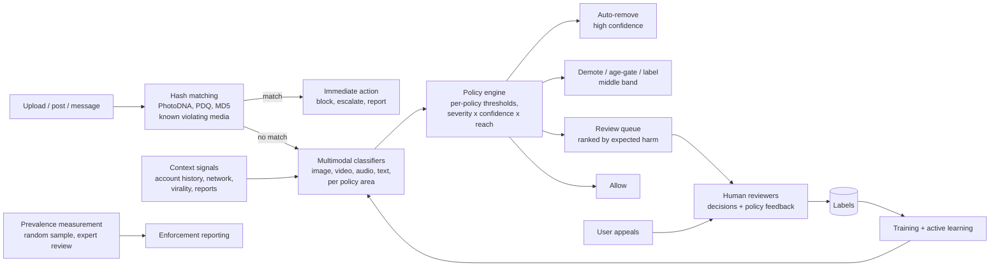
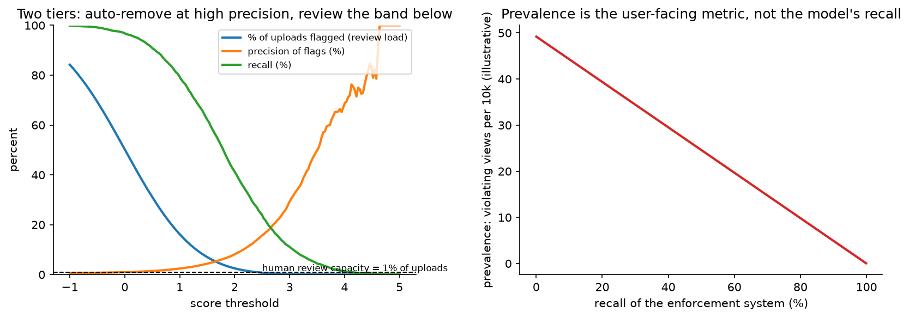

# Content moderation & trust

> **Why this matters / who asks it.** Meta, YouTube, TikTok, Roblox, Discord,
> Reddit, Twitch and every frontier lab with a consumer product run an integrity
> system, and they ask this question because it is where ML meets policy, human
> operations and regulation at once. The business problem is to keep violating
> content away from users at a scale where human review can touch a fraction of a
> percent of uploads, while wrongly removing so little that creators keep posting and
> regulators stay satisfied. Interviewers are checking whether you reason about
> precision and recall as an operations budget, whether you know that the real metric
> is prevalence and not model recall, and whether you have thought about
> adversaries who adapt to your classifier within hours.

## TL;DR: the whiteboard in 60 seconds

- **Enforcement has more than two actions.** Remove, demote, age-gate, label, limit
  reach, require review before distribution. The middle actions are what let you act
  on uncertain cases without paying the cost of a wrong removal.
- **Prevalence is the metric.** The user-facing number is how much violating content
  people actually see, estimated by sampling and expert review, not by the
  classifier's recall.
- **Human review is a fixed budget.** Reviewer capacity sets the threshold, so the
  queue must be ranked by expected harm (severity times probability times predicted
  reach) instead of by raw score.
- **Hash matching first.** Known violating media is matched exactly and cheaply with
  perceptual hashes (PDQ for images, PhotoDNA for known child sexual abuse material),
  which handles re-uploads without a model call.
- **Classifiers are multimodal and per policy.** Violence, nudity, hate, self-harm,
  spam and fraud have different taxonomies, different base rates and different costs,
  so they get different models and different thresholds.
- **Few-shot and LLM-based classifiers shorten the policy-to-enforcement loop** from
  months of labelling to days, which matters when a new harm type appears.
- **Adversaries adapt.** Text is obfuscated, images are perturbed, and coordinated
  networks rotate accounts. Behavioural and network signals catch what content
  classifiers miss.
- **Appeals are part of the loop**, both as a fairness mechanism and as a source of
  labels on the model's false positives.
- **Evidence**: Meta's Community Standards Enforcement Reports and integrity
  engineering posts (Whole Post Integrity Embeddings, Few-Shot Learner, the
  open-sourced PDQ/TMK hashing), YouTube's Community Guidelines enforcement reports,
  OpenAI's moderation work, and Meta's Llama Guard.

## 1. Requirements & scoping

**Functional.** Score every piece of user content against a policy taxonomy at
upload and continuously afterwards (policies and models change, content does not),
take graded enforcement actions, route uncertain and high-impact cases to human
reviewers with the context they need, handle appeals, and produce the numbers that
go into a public transparency report.

**Non-functional, with numbers to ask for.**

| Quantity | Ask the interviewer | A defensible assumption |
|---|---|---|
| Volume | "Uploads per second by media type?" | 100k posts/s at peak, of which 10k are images or video |
| Latency | "Must enforcement happen before the content is visible?" | Hash matching and text classifiers inline (under 100 ms); video classification asynchronous within minutes |
| Review capacity | "Reviewers and cases per reviewer-hour?" | 15k reviewers, 30 cases/hour, which is roughly 0.01% of uploads |
| Policy areas | "How many policies, and which are legally mandated?" | 10 to 20 areas, of which a few carry legal deadlines |
| Languages | "How many languages and markets?" | 50+ languages, with labelled data for 10 |
| Appeals | "Appeal volume and required turnaround?" | A few percent of removals, 24 to 48 hour SLA |
| Regulation | "Which regimes apply? Reporting obligations?" | Regional rules with statutory removal windows and audit requirements |

**Success metrics.**

- *North star*: prevalence, the fraction of views (not posts) that are of violating
  content, per policy area. Meta's Community Standards Enforcement Reports define and
  publish prevalence this way, alongside content actioned and the share found
  proactively.
- *Guardrails*: wrongful-removal rate (estimated by appeal overturns plus audited
  samples), creator complaints, reviewer volume and backlog, latency, and per-market
  disparity in enforcement rates.
- *Offline proxies*: precision and recall per policy at the operating threshold,
  AUPRC, and agreement with expert reviewers instead of with the crowd, since crowd
  labels on policy questions are noisy.

**Questions a staff engineer asks.**

1. "Which policies carry legal deadlines? Those get a separate, over-provisioned
   path, because a statutory window is not a tuning parameter."
2. "What is the cost asymmetry per policy? Wrongly removing a piece of satire and
   wrongly leaving up child sexual abuse material are not comparable errors, so they
   get different thresholds and different review paths."
3. "Do we measure prevalence today? If not, that is the first thing to build,
   because without it we cannot tell whether enforcement is working."
4. "Can we act on reach instead of on the post? Demoting borderline content is
   cheaper than removing it and is reversible."
5. "How fast does policy change? If a new policy area appears every month, the
   bottleneck is labelling, and the architecture should assume few-shot adaptation."

## 2. Data

**Sources.** The content itself (image, video, audio, text, and the composition of
all of them in one post), post context (caption, comments, hashtags, linked pages),
account signals (age, history of violations, verification, network position), user
reports, reviewer decisions, appeal outcomes, and external hash lists from industry
bodies.

**Labels.**

| Source | Volume | Quality | Bias |
|---|---|---|---|
| Reviewer decisions on queued content | Millions/day | Good, policy-trained | Only covers what was queued, which the model chose |
| User reports | Large | Noisy and adversarial (mass-reporting campaigns) | Reflects who reports, not what violates |
| Expert / policy-team adjudication | Small | Highest | Expensive, used for evaluation and disputes |
| Random-sample prevalence review | Small but unbiased | High | The only unbiased view of the whole corpus |
| Appeal overturns | Small | Labels on false positives specifically | Only from users who bother to appeal |
| Hash-list matches | Large | Exact | Only for known media |

**The selection-bias problem.** Reviewers see what the model sends them, so the
labelled set is drawn from the model's high-score region, and training on it alone
makes the model confident about what it already believes. The fix is a *random audit
stream*: a small uniformly sampled slice of all content reviewed by experts,
independent of the model's score. That stream is what gives an unbiased prevalence
estimate and an unbiased recall estimate, and it is the first thing to build.

**Label noise on policy questions.** Two trained reviewers disagree on borderline
cases at a rate that surprises people. Measure inter-reviewer agreement per policy,
use multiple reviews on the borderline band, and treat a policy with low agreement as
a policy problem before it is a modelling problem. When agreement is low, the model
cannot exceed it, and the right action is to sharpen the written policy.

**Adversarial drift.** Attackers test the classifier and iterate within hours: text
becomes leetspeak or embedded in images, images get imperceptible perturbations or
are re-encoded, videos get letterboxed and speed-shifted, and coordinated networks
rotate accounts and domains. Two consequences for the design: content signals alone
decay quickly, so behavioural and network features carry a large share of the load;
and the retraining cadence for adversarial policies (spam, scams, coordinated
inauthentic behaviour) is days, not months.

**Privacy and reviewer welfare.** Reviewer exposure to graphic content is a real
operational constraint that affects the design: blur-by-default interfaces,
pre-classification so reviewers know what they are about to see, rotation policies,
and automation targeted specifically at the most harmful categories so humans see
less of them. Mention it; it is part of the system.

## 3. Modelling

### 3.1 Baseline

Keyword lists, hash matching against known violating media, and user reports routed
to reviewers. This is where every platform starts, and hash matching stays forever
because it is exact, cheap and legally defensible.

### 3.2 Hash matching

For known violating media, the question is "have we seen this before", and a
perceptual hash answers it without a model. PDQ (images) and TMK+PDQF (video) were
open-sourced by Meta in 2019 for exactly this purpose; PhotoDNA is the long-standing
industry mechanism for known child sexual abuse material, used with hash lists
maintained by organisations such as NCMEC and IWF. Properties to state: matching is
robust to re-compression, resizing and small crops; it is not robust to substantial
edits; and it produces a decision with an audit trail, which some categories
require.

Design note: run hash matching before the classifiers. It removes the highest-severity
re-uploads at negligible cost and keeps them out of the model path and out of the
review queue.

### 3.3 Classifiers per policy

The taxonomy drives the architecture. Each policy area gets its own head or its own
model, because base rates differ by orders of magnitude, the costs differ, and the
thresholds have to be set independently. A shared multimodal trunk with per-policy
heads is the usual compromise: it amortises the expensive encoding of images and
video and lets each head be trained and thresholded on its own data.

**The input is a whole post.** An image that is fine alone becomes a violation under
a particular caption, and a benign caption becomes harassment when attached to a
particular photo. Meta's integrity work on Whole Post Integrity Embeddings (WPIE)
describes learning representations over the whole post, across modalities, instead of
scoring each modality separately. The alternative is to score each modality and
combine with a rule, which is simpler and misses exactly the cases that matter.

**Context features.** Account history (prior violations, age, verification), network
position (who shares this, do they form a cluster), and predicted reach. Two posts
with identical content and different authorship can carry very different expected
harm, and the policy engine needs that.

**Losses and imbalance.** Binary cross-entropy per policy, with positives weighted by
severity, and negatives down-sampled with the correction from the
[ads chapter](03-ads-ctr-prediction.md#35-negative-down-sampling-and-its-correction).
Calibration matters here because the policy engine compares probabilities across
policies to rank the review queue, so a miscalibrated hate-speech head steals
reviewer time from a well-calibrated violence head.

### 3.4 Few-shot and LLM-based moderation

New policies appear faster than labelled datasets can be built. Two mechanisms
address that:

- **Few-shot learners.** Meta described a "Few-Shot Learner" system in 2021 that
  works across modalities and languages and can act on new or evolving policy areas
  with far fewer labelled examples than a conventional classifier, by combining a
  large pretrained model with descriptions of the policy and a handful of examples.
- **LLM classification with a written policy in the prompt.** A capable model reads
  the policy text and the content and returns a judgment with a rationale. OpenAI has
  described using GPT-4 for content policy development and classification, where
  policy experts iterate on the written policy and the model applies it, shortening
  the loop from months to hours. Meta's Llama Guard ([arXiv:2312.06674](https://arxiv.org/abs/2312.06674)) is an
  openly available safeguard model that classifies prompts and responses against a
  configurable taxonomy.

Where they fit in the system: at 100k posts per second, an LLM cannot see everything.
Use it (a) to label training data for the small fast classifiers, (b) to adjudicate
the uncertain band that would otherwise go to humans, (c) to bootstrap a brand-new
policy on day one while labels accumulate, and (d) to draft the rationale a reviewer
reads. The fast per-policy classifiers still carry the volume.

### 3.5 The policy engine

The model produces probabilities; the policy engine turns them into actions. The
decision inputs are the score, the policy's severity tier, the predicted reach, the
account's history, and the legal regime. A workable formulation ranks by expected
harm:

$$
\text{expected harm} = P(\text{violation}) \times \text{severity} \times \mathbb{E}[\text{views}],
$$

and applies bands: auto-remove above a high-precision threshold, demote or age-gate
in the middle, queue for review where expected harm exceeds the value of a reviewer
minute, and allow below. The high-precision threshold is set per policy from the
audited precision at that score, not from a global constant.

{ width="760" }

*Left: as the threshold falls, flagged volume rises much faster than recall, and the
review-capacity line is what actually fixes the operating point, so the design is two
tiers: auto-remove where precision is high, review the band beneath it. Right:
prevalence (what users see) falls with system recall, and prevalence is the number
that gets reported.*

### 3.6 The review queue as a ranking problem

Reviewer capacity is fixed, so the queue is a ranking problem with a budget. Rank by
expected harm prevented per reviewer-minute, which means predicting both the
probability of violation and how long the case will take. Add:

- **Deduplication**: one decision on a viral post applies to every copy, so cluster
  by hash and embedding before queueing.
- **Specialisation**: route by policy and language to reviewers trained for them.
- **Freshness**: a post's harm accrues as it spreads, so a rapidly spreading
  borderline post outranks a static one with a higher score.
- **Sampling for measurement**: reserve a slice of reviewer time for the random audit
  stream, which produces the unbiased numbers.

### 3.7 Appeals

An appeal is a user asserting a false positive. It closes two loops: fairness for the
user, and a stream of labels concentrated exactly where the model is wrong. Track
overturn rate per policy and per model version as a quality signal. A rising overturn
rate after a model push is a rollback trigger.

## 4. Training & serving

**Serving.** Three tiers by cost and latency:

1. Inline (under 100 ms): hash matching, text classifiers, cheap image
   classifiers on the upload path. These can block publication.
2. Near-line (seconds to minutes): full video classification, whole-post multimodal
   models, network features that need a graph lookup. These act after publication,
   which is acceptable for most policies and unacceptable for a few, so the highest
   severity categories are pushed into tier 1 even at higher cost.
3. Offline (hours): re-scoring the corpus when a model or policy changes, proactive
   sweeps, and coordinated-behaviour detection over the graph.

The third tier is easy to forget and it is where much of the value is: a new model
applied to existing content finds violations that were uploaded before it existed.
Budget for periodic backfills.

**Training cadence.** Adversarial policies (spam, scams, impersonation) retrain daily
or weekly with the newest reviewer labels; stable policies (nudity) retrain monthly.
Active learning selects what to send for review: uncertainty sampling on the
borderline band, plus disagreement between the current model and a challenger, plus a
fixed random slice for measurement.

**Multilingual.** Train multilingual encoders and evaluate per language separately,
because an aggregate metric is dominated by English and hides that a market with
millions of users has a classifier that does not work. Translation of training data is
a stopgap that works better for some policies (spam) than others (hate speech, where
slurs and context are language-specific).

**Cost.** Video is the expensive modality: transcoding plus frame sampling plus a
video model. Sample frames adaptively (scene changes plus a fixed rate), and run the
heavy model only on clips where the cheap model or the context is suspicious. That
tiering is where the GPU budget is decided.

## 5. Evaluation & experimentation

**Offline.**

- Precision and recall per policy at the deployed threshold, computed on the random
  audit stream so that the recall number means something.
- Prevalence estimated from the audit stream with confidence intervals, per policy
  and per surface. State the estimator: sample uniformly by *view*, not by post, since
  prevalence is a view-weighted quantity.
- Agreement with expert reviewers, and inter-reviewer agreement as the ceiling.
- Per-language and per-market breakdowns, always.
- Pitfalls: measuring recall on queued content (which the model selected), reporting
  a single global threshold, and treating user reports as ground truth.

**Online.** A/B tests are constrained here: you cannot randomly leave violating
content up for a control group in the most severe categories. What you can do is
randomise the *enforcement action* in the middle band (demote versus label), randomise
the review-queue ranking (which is an operations change, not an exposure change), and
run shadow evaluation of a new classifier against the current one on live traffic with
human adjudication of the disagreements. For the severe categories, the launch
decision rests on audited precision and recall plus shadow analysis.

**Monitoring.** Flag-rate per policy per market (a sudden move means an attack or a
broken feature), score distributions, reviewer agreement with the model, appeal
overturn rate, queue backlog and age, prevalence trend, and hash-list match rate.
Retraining triggers: an overturn-rate breach, a new attack cluster, a policy change,
or a market launch.

## 6. Trade-offs & alternatives

| Decision | Chosen | Alternative | When you'd flip |
|---|---|---|---|
| Actions | Graded (remove, demote, age-gate, label) | Binary remove/allow | Legally mandated categories where only removal satisfies the obligation |
| Known media | Hash matching before classifiers | Classifiers only | Never; hashing is cheaper and exact for re-uploads |
| Model structure | Shared multimodal trunk, per-policy heads | One model per policy end to end | A policy with a very different input (audio-only) or a legal need for an isolated, auditable model |
| Post representation | Whole-post multimodal embedding | Per-modality scores combined by rule | Simple policies (nudity) where one modality decides |
| New policies | Few-shot / LLM classification to bootstrap | Wait for labelled data | Stable policy with plenty of labels, where a small supervised model is cheaper and faster |
| LLM usage | Offline labelling, uncertain-band adjudication | LLM inline on all content | Low-volume, high-stakes surfaces (enterprise, kids' products) where per-item cost is acceptable |
| Queue ranking | Expected harm per reviewer-minute | Score order | Never score order alone; it ignores reach and severity |
| Threshold | Per policy from audited precision | Global threshold | Never; base rates differ by orders of magnitude |
| Measurement | Random audit stream | Metrics from the review queue | Never; queue metrics cannot estimate recall or prevalence |

**Failure modes.**

- *A classifier drifts and over-removes a category*: appeal overturn rate and
  creator complaints spike before any offline metric moves. Alert on overturns.
- *Adversarial evasion*: flag rate falls while user reports rise. That divergence is
  the signature, and it is why both are monitored together.
- *Mass false reporting campaign*: report volume on a target spikes without
  corresponding classifier scores. Rate-limit reports per reporter and weight by
  reporter reliability.
- *Language gap*: a market where enforcement rates are far below the global average.
  Per-market dashboards catch it; aggregate metrics never will.
- *Review queue collapse* during an event: backlog grows, harmful content lives
  longer. Pre-plan a severity-ordered shedding policy and surge capacity.
- *Policy and model drift apart*: the written policy changes, the model does not.
  Version the policy alongside the model and require re-evaluation on a policy change.

## 7. How real companies did it: as mock interviews

### 7.1 Meta, "measure what people actually see"

**Interviewer prompt.** "We remove millions of pieces of content a quarter. How do we
know whether that is working, and what do we report publicly?"

**Candidate walkthrough.** *Clarify*: "content removed" is an activity metric, not an
outcome, and it goes up both when enforcement improves and when violations increase.
*Metrics*: prevalence, estimated by sampling views and having trained reviewers
adjudicate them, plus content actioned and the proactive rate (the share found before
a user reported it). *Data*: a random audit stream sampled by view. *Model*: the
classifiers do not change; what changes is the measurement system next to them.
*Evaluate*: publish prevalence with its methodology, per policy area, per quarter.

**What the source says.** Meta's Community Standards Enforcement Report defines and
publishes prevalence (the estimated percentage of views that were of violating
content), content actioned, proactive rate and appeals/restorations, with published
methodology describing sampling and reviewer adjudication.

!!! tip "How to say it in the interview: prevalence over removals"
    "The number I'd put at the top of the dashboard is prevalence: of all the views
    on this surface, what share were of violating content. Meta publishes exactly
    this in their Community Standards Enforcement Report, estimated by sampling
    views and having trained reviewers adjudicate the sample, alongside content
    actioned and the proactive rate. The alternative, reporting how much content we
    removed, is what most teams start with, and it is ambiguous by construction:
    removals go up when the classifier improves and also when an attack starts, so
    the number cannot tell you which happened. The cost of prevalence is that it
    needs a random audit stream and expert reviewer time spent on content that is
    almost all fine, which feels wasteful to an operations manager. I'd defend that
    budget on the grounds that it is the only unbiased estimate of recall we will
    ever have, since every other label we collect comes from content the model
    already flagged."

### 7.2 Meta, "the post is the unit, not the image"

**Interviewer prompt.** "Our image classifier says this photo is fine and our text
classifier says this caption is fine, but the post is harassment. Why did we miss it,
and what do you change?"

**Candidate walkthrough.** *Clarify*: the violation lives in the combination, so
per-modality scoring cannot see it. *Model*: a whole-post representation that encodes
image, text and context together and is trained against post-level labels, with
per-policy heads on top. *Data*: reviewer labels are already post-level, so the
labels exist; the architecture was the gap. *Serve*: one multimodal encoding per
post, shared across policies, which also cuts cost compared to running several
single-modality models. *Evaluate*: precision and recall on the combination cases
specifically, since aggregate metrics will barely move.

**What the source says.** Meta's integrity engineering posts describe Whole Post
Integrity Embeddings, a multimodal approach that learns a representation of the entire
post across modalities for integrity classification, motivated by cases where the
meaning emerges from the combination.

!!! tip "How to say it in the interview: encode the whole post"
    "I'd encode the whole post, image plus caption plus context, into one
    representation and put per-policy heads on it, instead of scoring each modality
    and combining with a rule. Meta described this as Whole Post Integrity
    Embeddings in their integrity engineering work, and the motivation is the case
    we are looking at: a photo that is fine and a caption that is fine which
    together are harassment. The alternative is per-modality classifiers with a
    combination rule, which is easier to debug and cheaper to retrain one piece at a
    time. The trade-off is that a joint encoder is harder to attribute: when it
    fires you cannot say which modality caused it, which reviewers and appeals
    processes dislike. I'd keep the per-modality scores as features alongside the
    joint one so reviewers still get an explanation."

### 7.3 Meta, "a new policy on Monday, enforcement on Friday"

**Interviewer prompt.** "Policy just defined a new violation type. Historically we
need three months to collect labels and train a classifier. The harm is happening
now. What do you do?"

**Candidate walkthrough.** *Clarify*: how precise the policy text is, and whether a
handful of examples exist. *Model*: a large pretrained multimodal model that takes
the policy description plus a few labelled examples and generalises, used to act on
the highest-confidence cases and to rank a review queue immediately. *Data*: reviewer
decisions from that queue become the labelled set for a conventional classifier,
which takes over as volume allows. *Serve*: run the few-shot model on a sampled or
targeted slice, since it is expensive, and expand coverage as the fast classifier
matures. *Evaluate*: audited precision before any automated action.

**What the source says.** Meta described a Few-Shot Learner system (2021) that works
across modalities and languages and can act on new or evolving policy areas with far
fewer labelled examples than traditional classifiers, by learning from policy
descriptions and small numbers of examples.

!!! tip "How to say it in the interview: bootstrap with few-shot, hand off to a fast model"
    "On day one I'd run a few-shot model that takes the written policy and a handful
    of examples, use it to rank a review queue, and auto-action only the band where
    audited precision is high enough. Meta published a Few-Shot Learner for this in
    2021, working across modalities and languages on new or evolving policies with
    far fewer labels than a conventional classifier needs. The alternative is to
    wait for a labelled dataset, which is the honest three-month answer and leaves
    the harm running. The trade-off is cost and latency: the few-shot model is far
    too expensive to run on every upload, so it covers a targeted slice while the
    reviewer decisions it generates train a small fast classifier that takes over
    the volume. I'd set the handover criterion in advance, something like the fast
    model matching the few-shot model's precision on the audit stream."

### 7.4 Meta, "share the hashes, not the content"

**Interviewer prompt.** "The same violating video is re-uploaded thousands of times,
across platforms. We cannot share the content. How do we stop the re-uploads?"

**Candidate walkthrough.** *Clarify*: for known media the question is identity, not
classification. *Model*: perceptual hashing that is stable under re-compression,
resizing and minor edits, with a distance threshold tuned for precision. *Serve*:
hash on upload, look up against the list, act immediately. *Data*: hash lists shared
with industry bodies, so no content crosses organisational boundaries. *Evaluate*:
match precision (a false match removes innocent content) and robustness to common
transformations.

**What the source says.** Meta open-sourced PDQ (image hashing) and TMK+PDQF (video
hashing) in 2019 for sharing signals about violating content, and the industry uses
hash-sharing mechanisms such as PhotoDNA with lists maintained by child-safety
organisations.

!!! tip "How to say it in the interview: hashing before classification"
    "Before any classifier runs, I'd match against a hash list of known violating
    media. Meta open-sourced PDQ for images and TMK+PDQF for video in 2019 for
    exactly this, and the mechanism lets organisations share hashes without sharing
    the content. The alternative is to rely on the classifier to catch re-uploads,
    which works and costs a model call per upload and produces a probabilistic
    decision where an exact one is available. For the most severe categories a hash
    match also gives an audit trail, which a classifier score does not. The
    trade-off is that hashing only catches near-identical media: a crop past the
    threshold or a substantial re-edit slips through, so hashing is the first stage
    and never the only one. I'd tune the distance threshold for precision, because
    a false hash match removes content with no model uncertainty to hide behind."

### 7.5 OpenAI, "let the model read the policy"

**Interviewer prompt.** "Our policy team writes long, careful policy documents.
Turning one into a classifier takes months of labelling, and by the time it ships the
policy has changed. Shorten that loop."

**Candidate walkthrough.** *Clarify*: the bottleneck is translating policy text into
labelled examples. *Model*: give the policy text and the content to a capable language
model and ask for a judgment plus a rationale; have policy experts read disagreements
between the model and their own labels, then refine the policy text instead of the
model. Iterate until agreement is high, then use the model to label at scale.
*Serve*: distil into a cheap classifier for volume. *Evaluate*: agreement with expert
labels, and the time from policy change to deployed enforcement.

**What the source says.** OpenAI described using GPT-4 for content policy development
and content moderation (2023), where policy experts iterate with the model on policy
text and labelled examples, reducing the time to develop and deploy a new content
policy from months to hours, and they have published a moderation endpoint and model.

!!! tip "How to say it in the interview: the policy is the prompt"
    "I'd treat the written policy as the model's input instead of as instructions to
    labellers. OpenAI published this workflow in 2023: give GPT-4 the policy text and
    content, compare its judgments against expert labels, and when they disagree,
    fix the ambiguity in the policy instead of the model. They report cutting policy
    development and deployment from months to hours. The alternative is the classic
    pipeline, where a policy becomes labelling guidelines, guidelines become labels,
    and labels become a classifier, with every ambiguity in the policy silently
    resolved differently by each labeller. The trade-off is cost, so the large model
    is a labeller and an adjudicator, not the thing running on every upload; I'd
    distil it into a small classifier for volume and keep the large model for the
    uncertain band and for new policies."

### 7.6 Meta, "a safeguard model you can configure"

**Interviewer prompt.** "We are shipping a generative feature. We need to classify
both what users ask and what the model says, against our own taxonomy, and we want to
run it ourselves."

**Candidate walkthrough.** *Clarify*: two classification points (input and output),
one taxonomy, and a preference for self-hosting. *Model*: an instruction-tuned
safeguard model that takes the taxonomy in the prompt and classifies prompts and
responses against it, fine-tuned on safety data. *Serve*: inline with generation,
which is affordable because the generative feature is already paying for a model call.
*Evaluate*: per-category precision and recall on held-out safety benchmarks plus
red-team data.

**What the source says.** Inan et al., "Llama Guard: LLM-based Input-Output Safeguard
for Human-AI Conversations" (2023, [arXiv:2312.06674](https://arxiv.org/abs/2312.06674)) describes an openly available
safeguard model that classifies prompts and responses against a configurable safety
taxonomy, with reported performance on existing benchmarks.

!!! tip "How to say it in the interview: guard the input and the output"
    "For a generative feature I'd classify both sides, the user's prompt and the
    model's response, against one taxonomy. Llama Guard, published by Meta in 2023,
    is built for this: an input-output safeguard model that takes a configurable
    taxonomy and classifies both. The alternative is to rely on the generation
    model's own refusals, which conflates capability with policy and gives you no
    lever when policy changes. The trade-off is latency and cost, since a guard call
    on each side adds to every request, so for a high-volume product I'd run the
    input guard inline and the output guard on a sampled basis plus on anything the
    input guard found borderline. That also connects to the assistant design in the
    [LLM chapter](08-llm-product-rag-assistant.md), where the guardrail budget is
    part of the latency table."

## 8. Staff-level follow-ups

!!! interview "Your classifier has 95% precision and 60% recall. Is that good?"
    It depends entirely on the policy and on what the number was measured against.
    First: was recall measured on the random audit stream or on the review queue? If
    it is the queue, the number is meaningless, because the queue only contains what
    the model already scored highly. Second: what is the severity? For a category
    where leaving content up causes irreversible harm, 60% recall is a failure and I
    would trade precision for it, moving the middle band to demotion plus review
    rather than allow. For a low-severity category where a wrongful removal costs a
    creator their livelihood, 95% precision may be too low for auto-removal, and the
    action should be demotion with review. The numbers alone do not decide; the
    action bands do.

!!! interview "How do you set the threshold?"
    Per policy, from audited precision at each score band, and against reviewer
    capacity. I would compute, from the audit stream, precision as a function of
    score for each policy, and place the auto-remove line where audited precision
    meets the bar the policy owner accepts for irreversible action. Then the review
    band extends downward until the flagged volume equals reviewer capacity, ranked
    by expected harm instead of by score. Everything below gets demotion or nothing.
    What I would not do is pick a global threshold or an F1-optimal one, because the
    costs are asymmetric and differ by two orders of magnitude across policies.

!!! interview "An attacker perturbs images so your classifier misses them. What do you do?"
    Content-only defence loses this race, so I would shift weight to signals the
    attacker cannot cheaply change. Account signals (age, history, verification),
    network signals (does this account cluster with known bad actors, do the same
    assets appear across accounts), distribution signals (unnatural sharing patterns),
    and hash matching against the originals. On the model side: adversarial training
    and augmentation with the transformations we see in the wild, plus an ensemble so
    a single perturbation does not fool everything. And measurement: the signature of
    successful evasion is flag rate falling while user reports rise, so I would alert
    on that divergence instead of on either metric alone.

!!! interview "The review queue is backed up 48 hours during a news event. What do you do?"
    Shed by expected harm, not first-in-first-out. Raise the auto-action thresholds
    for the highest-severity policies so more is handled without humans, accepting
    a known precision cost that I would quantify from the audit data. Demote the
    middle band instead of queueing it, which is reversible and costs nothing in
    reviewer time. Deduplicate aggressively, since during an event much of the queue
    is copies of the same few items. Pull reviewers from low-severity policies onto
    high-severity ones. Afterwards, re-score the backlog offline with the full models
    and act retroactively, which is the tier-three path in the serving design.

!!! interview "How do you measure prevalence when violating content is 0.1% of uploads?"
    Sample by view instead of by post, because prevalence is view-weighted and a
    post with a million views matters a million times more than one with none. Then
    the sample size follows from the confidence interval you need: estimating a 0.1%
    rate to within a relative 20% needs on the order of $10^5$ sampled views per
    policy per period, which is a real reviewer cost and is why prevalence is
    reported quarterly rather than daily. Stratify the sample by surface and by
    predicted score to reduce variance, and use importance weighting to correct back
    to the unstratified estimate; that cuts the reviewer cost substantially for the
    same interval width.

!!! interview "Should an LLM make the final removal decision?"
    Not for irreversible actions on ambiguous policies. I would use it for labelling,
    for adjudicating the uncertain band ahead of a human, for drafting the rationale
    a reviewer reads, and for bootstrapping a new policy. The reasons to keep the
    final call elsewhere: cost at volume, the difficulty of auditing a free-text
    rationale at scale, prompt-injection risk when the content itself is the input,
    and the regulatory expectation that a contestable decision has a documented,
    reproducible basis. Where I would let it decide alone: low-severity, reversible
    actions like demotion, where the cost of error is small and the volume is
    manageable.

!!! interview "How do you handle a market with 40 million users and no labelled data?"
    Multilingual encoders get you a starting model, and translation of training data
    works better for policies about behaviour (spam, scams) than for policies about
    language (hate speech, harassment), where the slurs and the context are local.
    The fastest path to real coverage: hire or contract reviewers who speak the
    language and understand the context, run an active-learning loop that sends them
    the most uncertain content, and use a few-shot or LLM classifier to bootstrap
    while labels accumulate. Report enforcement rates for that market separately from
    day one, because the aggregate number will look fine while the market is
    unprotected.

!!! interview "A creator says you wrongly removed their video and they have a large following. What does your system owe them?"
    An appeal path with a defined SLA, a human review that is independent of the
    original decision, and a reason that maps to a specific policy clause rather
    than a category name. From the system's side, appeals are also measurement: I
    would track overturn rate per policy and per model version, and treat a rise
    after a model push as a rollback trigger, since it is the fastest available
    signal of a precision regression. For high-reach accounts specifically, I would
    route borderline removals to review before action rather than after, because the
    cost of a wrong removal scales with reach and the volume of such accounts is
    small enough to afford.

!!! interview "What breaks first at 10x volume?"
    Human review, and it breaks non-linearly because hiring and training reviewers
    takes months. The mitigations are automation of the highest-volume, most
    clear-cut categories, better queue ranking, and aggressive deduplication, in that
    order. Second is the video pipeline, where transcoding and frame sampling
    dominate the GPU bill. Third is the offline re-scoring tier, which grows with the
    corpus rather than with the upload rate, so a full backfill goes from hours to
    days and needs incremental scheduling.

!!! interview "Give me the one metric you would show the board."
    Prevalence per policy area, plotted over quarters, with wrongful-removal rate
    next to it on the same chart. One without the other is easy to move in the wrong
    way: prevalence alone is minimised by removing everything, and wrongful removals
    alone are minimised by removing nothing. The pair shows whether the system is
    getting better rather than just getting more aggressive.

## 9. Scaling & evolution

- **Small platform.** Hash matching, keyword lists, user reports, and a small review
  team. Build the random audit stream early even when it feels premature, because it
  is what every later metric depends on.
- **Mid-scale.** Per-policy supervised classifiers on a shared multimodal trunk,
  a policy engine with graded actions, a ranked review queue, appeals, per-market
  metrics, and active learning.
- **Large scale.** Whole-post multimodal models, network and behavioural detection for
  coordinated activity, few-shot adaptation for new policies, offline re-scoring
  sweeps, published prevalence with a documented methodology, and reviewer tooling
  that treats reviewer welfare as a design constraint.
- **Batch to real-time.** The direction is to move severe categories from near-line to
  inline, which costs latency on the upload path and prevents exposure. Decide which
  policies deserve that cost per policy, not globally.
- **LLM-augmented.** Labelling and policy iteration first, then adjudication of the
  uncertain band, then guard models for generative features. The fast per-policy
  classifiers remain the thing that sees every upload, with the large models training
  and supervising them.

## References

- Meta. "Community Standards Enforcement Report" and its published methodology (prevalence, content actioned, proactive rate, appeals and restorations).
- Meta AI. "Here's how we're using AI to help detect misinformation" and related integrity engineering posts describing Whole Post Integrity Embeddings (WPIE).
- Meta AI. "Harmful content can evolve quickly. Our new AI system adapts to tackle it" (Few-Shot Learner), December 2021.
- Meta Engineering. "Open-sourcing photo- and video-matching technology to make the internet safer" (PDQ and TMK+PDQF), August 2019.
- Microsoft. PhotoDNA documentation; NCMEC and IWF hash-list programmes.
- OpenAI. "Using GPT-4 for content moderation", August 2023; OpenAI moderation endpoint documentation.
- Inan, H. et al. "Llama Guard: LLM-based Input-Output Safeguard for Human-AI Conversations." 2023 ([arXiv:2312.06674](https://arxiv.org/abs/2312.06674)).
- Markov, T. et al. "A Holistic Approach to Undesired Content Detection in the Real World." AAAI 2023 ([arXiv:2208.03274](https://arxiv.org/abs/2208.03274)).
- YouTube. "Community Guidelines enforcement" transparency reports.
- Book cross-references: [fraud & anomaly detection](04-fraud-anomaly-detection.md), [LLM assistant with RAG](08-llm-product-rag-assistant.md), [visual search](06-visual-search-image-retrieval.md), [safety & failure modes](../part15-interpretability-safety/02-safety-failure-modes.md).
