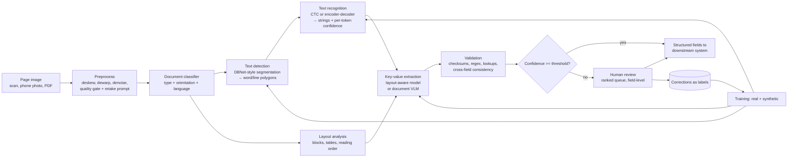
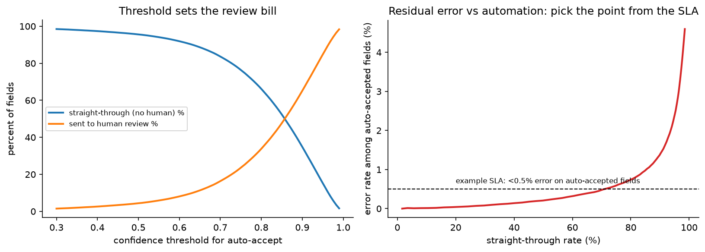
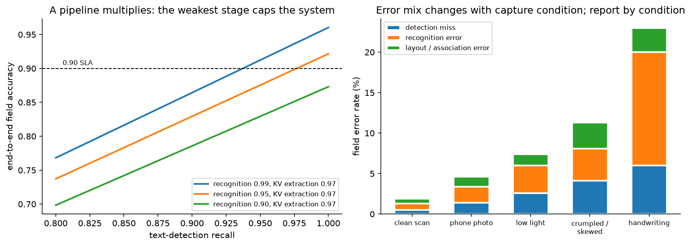

# OCR & document understanding

> **Why this matters / who asks it.** Amazon (Textract), Google (Document AI,
> Lens), Microsoft (Azure Document Intelligence), Apple (Live Text), and every
> fintech, insurer, logistics and marketplace company that verifies identity or
> processes invoices asks this question. The business problem is to turn a
> photographed or scanned page into structured fields a downstream system can act on,
> at an accuracy where the automated path is cheaper than a human typing it. The
> interviewer is looking for whether you understand that a pipeline multiplies its
> stage accuracies, whether you can choose between a staged pipeline and an
> end-to-end document model with a real argument, and whether you treat the human
> review queue as part of the system rather than as an admission of failure.

## TL;DR: the whiteboard in 60 seconds

- **The pipeline multiplies.** End-to-end field accuracy is roughly detection recall
  times recognition accuracy times extraction accuracy, so 0.97 at each of three
  stages is 0.91 overall. Know which stage is your ceiling before optimising.
- **Detection plus recognition, or one model.** A two-stage pipeline is debuggable,
  retrainable per stage, and gives you word boxes for free. A document VLM reads the
  page directly, which removes the error cascade and removes your ability to
  attribute an error.
- **Layout is the information.** A receipt's total is identified by where it sits, so
  key-value extraction uses 2D position as a first-class input (LayoutLM-style) or a
  model that sees the pixels.
- **Synthetic data does most of the heavy lifting** for recognition: render text in
  thousands of fonts over realistic backgrounds with realistic degradations, then
  fine-tune on a small real set. The domain gap is the thing to measure.
- **Confidence drives automation.** Per-field calibrated confidence sets the
  straight-through rate, and the threshold comes from the cost of a wrong field, not
  from a model metric.
- **Validation is cheap accuracy.** Checksums (IBAN, Luhn, MRZ check digits), regexes,
  arithmetic consistency (line items summing to the total), and database lookups
  catch errors the model cannot see.
- **Report CER and WER for recognition and field-level F1 or exact match for
  extraction**, and report them by capture condition, because a single average hides
  the phone-photo failures.
- **Mobile versus server** is a real fork: on-device gives privacy and works offline
  at a tight compute budget, server gives the large model and easy updates.
- **Multilingual** means script-aware detection, a recognition head per script family
  or a unified large vocabulary, and evaluation per script.
- **Evidence**: Google Document AI and Cloud Vision docs, Amazon Textract docs,
  Microsoft Azure Document Intelligence docs and TrOCR/LayoutLM research, Apple's
  Live Text documentation, and the Donut, LayoutLMv3, DBNet and CRNN literature.

## 1. Requirements & scoping

**Functional.** Accept an image or PDF, return the text with positions and the
structured fields the business needs (for an invoice: vendor, date, total, tax, line
items; for an ID: name, date of birth, document number, expiry, MRZ), each with a
confidence and a provenance box on the page. Route low-confidence extractions to a
human. Support the document types and languages the market requires.

**Non-functional, with numbers to ask for.**

| Quantity | Ask the interviewer | A defensible assumption |
|---|---|---|
| Volume | "Documents per day, peak per second?" | 2M pages/day, 100 pages/s peak |
| Latency | "Interactive or batch? Budget per page?" | Interactive capture: under 1 s on device; server pipeline: under 5 s per page |
| Accuracy target | "What field accuracy does the business need, and on which fields?" | 99%+ on identity fields, 95%+ on invoice line items |
| Automation target | "What straight-through rate justifies the project?" | 70 to 90% of documents fully automated |
| Review capacity | "Reviewers and seconds per field?" | 200 reviewers, 10 s per field |
| Document types | "How many templates? Do new ones appear?" | 50 known types plus a long tail of unseen layouts |
| Languages / scripts | "Which markets?" | Latin plus two non-Latin scripts at launch |
| Deployment | "On device, in our cloud, or a vendor API?" | Cloud, with on-device capture assistance |
| Compliance | "PII handling, retention, residency?" | Identity documents: encrypted, short retention, regional storage |

**Success metrics.**

- *North star*: cost per processed document, which combines automation rate and the
  cost of human review, plus the downstream error cost of a wrong field that got
  through.
- *Guardrails*: field-level error rate among auto-accepted fields (the number that
  must not rise), review queue backlog, latency, and per-condition and per-language
  breakdowns.
- *Offline proxies*: character error rate (CER) and word error rate (WER) for
  recognition, detection precision and recall at an IoU threshold, field-level exact
  match and F1 for extraction, and end-to-end document-level accuracy (all required
  fields correct), which is the metric the business actually feels.

**Questions a staff engineer asks.**

1. "Which fields matter, and what does each wrong field cost? A wrong invoice total
   is a payment error; a wrong middle initial is noise."
2. "Are the documents templated or arbitrary? Templated documents can be solved with
   anchors and rules far more cheaply than with a learned extractor."
3. "Who captures the image? If it is our own app, I can fix half the problem in the
   camera with a quality gate and a retake prompt."
4. "Is there a human in the loop today? Their corrections are my training data and my
   evaluation set."
5. "Can we verify fields against an external source? A database lookup beats any
   model."

## 2. Data

**Sources.** Production documents (the only realistic distribution), vendor or public
datasets for pretraining, synthetic renderings, and human corrections from the review
queue.

**Labels.** Three levels, with different costs:

| Level | What it is | Cost | Where it comes from |
|---|---|---|---|
| Text with boxes | Every word, its polygon, its transcription | High | Vendor labelling; synthetic data gives it free |
| Field values | The structured output only | Low | The review queue produces it as a by-product |
| Field values with provenance | Value plus which box it came from | Medium | Reviewers clicking the source box; worth the extra second |

The practical insight: the review queue is a labelling pipeline that the business is
already paying for. Design the reviewer UI so corrections are captured as structured
labels with provenance, and the training set grows for free and in the right
distribution.

**Synthetic data.** For recognition, synthetic rendering is the default training
source: sample text from realistic corpora (names, addresses, amounts in the right
formats), render in thousands of fonts, composite over document and photo
backgrounds, then apply degradations that match the capture channel: JPEG artefacts,
motion blur, defocus, uneven lighting and shadows, perspective warp, paper texture,
crumple, print dithering, low resolution. The Donut authors shipped a synthetic
document generator (SynthDoG) alongside the model for exactly this reason.

Two cautions to state. First, synthetic-only models fail on real degradations you did
not simulate, so measure the gap on a real held-out set and let that gap drive which
augmentations to add. Second, synthetic text distributions matter: if your generator
never produces a date in the format the market uses, the model never learns it.

**Biases and gaps.**

- *Capture-channel bias*: the training set is scans, production is phone photos.
  Split every metric by capture condition.
- *Selection bias in review labels*: reviewers only see low-confidence documents, so
  corrections over-represent hard cases. That is good for training and wrong for
  measuring accuracy, which needs a random audit sample.
- *Language and script imbalance*: a model trained mostly on English degrades on
  scripts with different glyph density, diacritics, or right-to-left order.
- *Name and address diversity*: recognition models trained on Western names fail on
  others; this is a fairness issue with direct customer impact in identity
  verification.

**Privacy.** Identity documents and invoices are among the most sensitive data a
company holds. Encrypt at rest and in transit, restrict access, keep short retention
for images (often shorter than for the extracted fields), redact in logs, and be
careful about training on production images, since consent for processing is not
consent for training. On-device processing removes most of this problem, which is one
of its main arguments.

## 3. Modelling

### 3.1 Baseline

An off-the-shelf OCR engine plus regular expressions and positional anchors per
template. For templated documents this is genuinely competitive, it ships in a week,
and it is the control arm for everything that follows. It fails when layouts vary,
when a vendor changes their invoice, or when the document is photographed at an angle.

### 3.2 Preprocessing and the capture loop

The cheapest accuracy in the whole system is at capture. A quality gate on the device
(blur estimate, glare detection, document-in-frame check, resolution floor) that asks
the user to retake removes a large share of downstream failures, and it costs a small
classifier. After capture: detect the document quadrilateral, dewarp to a
rectangle, deskew, normalise contrast, and upscale if resolution is marginal.

Do not skip this in the interview. Candidates who jump to the recognition model
without mentioning dewarping have usually not shipped an OCR product.

### 3.3 Text detection

Find where the text is. Two families:

- **Segmentation-based** (the production default for arbitrary shapes): predict a
  text/no-text probability map plus a threshold map and binarise. DBNet (Liao et al.,
  "Real-time Scene Text Detection with Differentiable Binarization", AAAI 2020,
  [arXiv:1911.08947](https://arxiv.org/abs/1911.08947)) makes the binarisation step differentiable so the network learns
  its own thresholds, which simplifies post-processing; the paper reports 82.8
  F-measure at 62 FPS on MSRA-TD500 with a ResNet-18 backbone. Segmentation handles
  curved and rotated text naturally.
- **Regression-based**: predict boxes or quadrilaterals directly (EAST-style).
  Simpler and faster, weaker on curved text and on dense small text.

Output granularity is a design choice: word boxes are convenient for key-value
association; line boxes are better for recognition (more context for the language
model inside the recogniser). Many systems produce lines and split into words
afterwards.

### 3.4 Text recognition

Given a cropped line, produce the string. Two families, and the trade-off is worth
stating precisely:

**CTC-based** (CNN or CNN plus RNN encoder, CTC loss). The network emits a per-frame
distribution over characters plus a blank symbol, and CTC marginalises over all
alignments that collapse to the target:

$$
p(y \mid x) = \sum_{\pi \in \mathcal{B}^{-1}(y)} \prod_{t=1}^{T} p(\pi_t \mid x),
$$

where $\mathcal{B}$ removes blanks and merges repeats. It needs no alignment labels,
decodes in one pass (fast, parallel), and is robust. Its weakness is limited context:
the conditional independence between time steps means it cannot model long-range
language structure without an external language model. CRNN (Shi, Bai & Yao, IEEE
TPAMI 2017, [arXiv:1507.05717](https://arxiv.org/abs/1507.05717)) is the canonical architecture.

**Attention encoder-decoder** (including transformer recognisers). Autoregressive
decoding over characters or word pieces, so the decoder is a language model
conditioned on the image. Better on hard images and on languages with complex
structure, and it produces well-formed strings more often. Costs: sequential decoding
(slower), and a failure mode where the decoder hallucinates plausible text that is
not on the page, which is far more dangerous than a CTC model outputting garbage,
because it looks right. TrOCR (Li et al., [arXiv:2109.10282](https://arxiv.org/abs/2109.10282)) is a transformer
encoder-decoder recogniser initialised from pretrained image and text transformers,
and the paper reports state-of-the-art results on printed, handwritten and scene text
at the time.

For a production system with a latency budget, the common answer is CTC for the
high-volume path and an attention model for the hard cases, routed by the CTC model's
confidence.

**Confidence.** Both families give a per-character or per-token probability. Aggregate
to a field-level confidence (minimum or mean over characters, or a small calibration
model over several features), and calibrate it against observed correctness, because
raw softmax scores are over-confident. The calibration methods are in
[uncertainty & reliability](../part13-retrieval-eval-reliability/03-uncertainty-reliability.md).

### 3.5 Layout analysis and key-value extraction

Knowing the characters is not knowing the invoice total. Three approaches:

**Rules and anchors.** Find the label text ("Total"), take the value to its right or
below. Works for templates, brittle otherwise, and still the right answer for a small
set of high-volume known formats.

**Layout-aware sequence models.** Feed the tokens in reading order with their 2D
coordinates as additional embeddings and tag each token (BIO tagging over field
types). LayoutLM and its successors formalised this; LayoutLMv3 (Huang et al.,
"LayoutLMv3: Pre-training for Document AI with Unified Text and Image Masking",
ACM Multimedia 2022, [arXiv:2204.08387](https://arxiv.org/abs/2204.08387)) unifies text and image masking objectives and
adds a word-patch alignment objective, giving one pretrained model for both
text-centric and image-centric document tasks. These models need OCR output as input,
so they inherit its errors.

**Document VLMs (OCR-free).** A vision encoder reads the page image and a decoder
generates the structured output directly, usually as a JSON-like string. Donut (Kim
et al., "OCR-free Document Understanding Transformer", ECCV 2022, [arXiv:2111.15664](https://arxiv.org/abs/2111.15664))
introduced this framing, motivated by the cost of OCR engines, their inflexibility
across languages and document types, and OCR error propagation. Modern document
VLMs follow the same shape at larger scale.

The comparison to give:

| | Pipeline (detect, recognise, extract) | Document VLM |
|---|---|---|
| Error attribution | Per stage, so you know what to fix | One model, a wrong field has no locus |
| Provenance | Boxes for every value, free | Needs a separate grounding mechanism to show the user where a value came from |
| Adaptation | Retrain one stage | Retrain everything |
| New document type | Extraction head only | Fine-tune the whole model |
| Latency | Several models, parallelisable | One forward pass, autoregressive decode |
| Failure mode | Garbage text, visible | Fluent hallucination, invisible |
| Data need | Box labels expensive, synthetic helps | Field labels only, which the review queue produces |

The staff answer is usually a hybrid: run the pipeline for text and provenance, run a
VLM for extraction on the documents where layout is unusual, and use the pipeline's
text as a grounding check on the VLM's output so a hallucinated total can be caught by
searching for it on the page.

### 3.6 Validation

Cheap, deterministic, and it catches errors no model will:

- **Check digits**: MRZ check digits on passports, Luhn on card numbers, IBAN
  checksums, ISBN. A failed check digit is a definite error, which is stronger
  evidence than any confidence score.
- **Format and range**: dates that parse and fall in a plausible range, amounts with
  the right currency and scale.
- **Cross-field consistency**: line items summing to the subtotal, subtotal plus tax
  equalling the total, expiry after issue.
- **External lookups**: vendor name against the supplier master, address against a
  postal database, document number against an issuing authority where available.

Fold these into the confidence used for routing: a field that fails validation goes
to review regardless of model confidence, and a field that passes a check digit can
be auto-accepted at a lower model confidence.

### 3.7 Human in the loop

The review queue is a designed subsystem:

- **Field-level, not document-level.** Send the three uncertain fields, not the whole
  document, which cuts reviewer time by an order of magnitude.
- **Show provenance.** The crop of the page where the value came from, so the
  reviewer verifies rather than re-reads.
- **Rank the queue** by expected cost saved: probability of error times the cost of
  that error, divided by expected review time.
- **Capture corrections as labels**, with the box, so they feed training.
- **Measure reviewers**: inter-reviewer agreement and error rate on golden documents
  seeded into the queue, because reviewer error becomes label noise.

{ width="760" }

*Left: the confidence threshold moves work between the automated path and the review
queue, which is the cost lever. Right: the residual error among auto-accepted fields
rises steeply as automation approaches 100%, so the SLA on auto-accepted error picks
the operating point.*

### 3.8 Where the accuracy budget goes

{ width="780" }

*Left: with three stages in series, the end-to-end field accuracy is the product, so
detection recall below 0.95 makes a 0.90 SLA unreachable no matter how good the
recogniser is. Right (illustrative): the mix of error types shifts with capture
condition, which is why the error budget is tracked per condition rather than in
aggregate.*

## 4. Training & serving

**Training.** Detection and recognition are trained mostly on synthetic data with
real fine-tuning; the extraction model is trained on field labels from the review
queue. Cadence: recognition monthly or when a new script or font family appears,
extraction weekly (it sees the most distribution change as new vendors and templates
arrive), detection rarely once it is good.

**Active learning.** Prioritise labelling where the model is uncertain, where
validation failed, and where two models disagree (for instance the CTC recogniser and
the attention recogniser, or the pipeline and the VLM). Disagreement is a much better
sampling signal than raw uncertainty because it finds systematic errors rather than
inherently ambiguous glyphs.

**Serving.**

| Stage | Server budget | On-device budget |
|---|---|---|
| Quality gate and dewarp | 30 ms | 20 ms, every frame in the viewfinder |
| Document classification | 20 ms | 10 ms |
| Detection | 120 ms (GPU, batched) | 60 ms (NPU, quantised) |
| Recognition (all lines) | 200 ms | 150 ms |
| Layout and extraction | 300 ms | usually server |
| Validation and lookups | 100 ms | server |
| Total | ~0.8 s per page | ~250 ms for text overlay |

On-device recognition runs quantised and distilled models on the phone's neural
accelerator; the [quantization chapter](../part06-llm-training/05-quantization.md)
covers the mechanics. The practical constraints are model size (app bundle limits),
memory, thermal throttling during a long scan session, and the fact that model
updates ship with app releases unless you build a model-download mechanism.

**Batch processing.** Most document pipelines are batch, which changes the
engineering: throughput per GPU-hour matters more than latency, so batch aggressively,
sort pages by size to reduce padding waste, and checkpoint so a failure does not
reprocess a million pages.

**Cost.** At 2M pages/day with 0.5 GPU-seconds per page, that is about 1M GPU-seconds
per day, roughly 12 GPUs running continuously, which is small next to the review cost:
at 20% of documents needing review and 30 seconds each, that is 400k reviewer-seconds
per day, over 100 reviewer-hours. The automation rate is the dominant cost term, which
is why the confidence threshold gets so much attention.

## 5. Evaluation & experimentation

**Offline.**

- *Recognition*: CER and WER. CER is the edit distance between predicted and
  reference strings divided by reference length. Report both, since a system can have
  low CER and high WER (one wrong character per word) which downstream systems feel as
  total failure.
- *Detection*: precision and recall at an IoU threshold, plus a "text missed"
  count weighted by whether the missed text was in a field of interest.
- *Extraction*: field-level exact match and F1 per field type, and **document-level
  all-fields-correct**, which is the metric the business experiences and which is
  brutally lower than the per-field average.
- *Per-condition and per-language breakdowns*, always. An aggregate CER dominated by
  clean scans hides that phone photos in one market are failing.
- *Calibration* of confidence against observed correctness, since the threshold
  policy depends on it.
- *Pitfalls*: evaluating on the same synthetic distribution you trained on;
  evaluating on documents that came from the review queue (which are the hard ones);
  measuring CER on the whole page when only five fields matter; and ignoring reading
  order, which can be correct character-wise and useless structurally.

**Online.** A/B on straight-through rate with auto-accepted error rate as the
guardrail, measured by seeding a random audit sample of auto-accepted documents into
the review queue. That audit stream is the only unbiased estimate of the error you are
letting through, and it should be budgeted from day one.

**Monitoring.** Per-document-type volume and confidence distributions, straight-through
rate, review backlog, validation failure rates per rule, per-language CER on a
canary set, and the rate of documents rejected at the quality gate (a jump means a
capture UX regression or a new device with a different camera). Retrain when a new
document type appears in volume, when a language's canary CER drifts, or when the
review correction rate for a field rises.

## 6. Trade-offs & alternatives

| Decision | Chosen | Alternative | When you'd flip |
|---|---|---|---|
| Architecture | Staged pipeline with a VLM for hard layouts | Pure document VLM | Field labels are plentiful, provenance is not required, and layouts are highly varied |
| Recognition | CTC for volume, attention model for hard cases | Attention everywhere | Latency is generous and hallucination risk is acceptable |
| Detection | Segmentation (DBNet-style) | Box regression | Text is always axis-aligned and dense (forms, tables), where regression is faster |
| Extraction | Layout-aware tagging model | Rules and anchors | A small set of stable, high-volume templates, where rules are cheaper and auditable |
| Training data | Synthetic first, real fine-tune | Real data only | A domain synthetic rendering cannot capture (handwriting styles, historical documents) |
| Confidence | Calibrated per field, plus validation rules | Raw model score | Never raw; the routing policy depends on calibration |
| Review | Field-level with provenance | Document-level re-keying | Legacy operations where re-keying is already the process; migrate quickly |
| Deployment | Server pipeline, on-device capture assistance | Fully on-device | Privacy or offline requirements, at the cost of model size and update latency |
| Multilingual | One detector, script-routed recognisers | One unified recogniser | Small script set with shared glyphs; a unified model is simpler to operate |

**Failure modes.**

- *Fluent hallucination from the decoder*: the model outputs a plausible total that is
  not on the page. Detect by grounding (search the recognised text for the extracted
  value) and by validation rules. This is the strongest argument for keeping a
  pipeline path alongside a VLM.
- *A vendor changes their invoice template*: extraction accuracy for that vendor
  collapses while the aggregate barely moves. Monitor per-vendor and per-type.
- *A new phone camera*: different colour processing or aggressive denoising changes
  the input distribution. Monitor per-device-model CER on a canary set.
- *Reading-order failures on multi-column pages*: text is correct, structure is wrong,
  and extraction silently associates the wrong label with the wrong value.
- *Confidence drift after a model update*: the thresholds were tuned for the old
  score distribution, so the straight-through rate jumps or collapses. Recalibrate
  with every model push and treat the threshold as part of the model artefact.
- *Review queue starvation or flood*: both are symptoms of confidence drift, and both
  show up in the operations dashboard before they show up in an offline metric.

## 7. How real companies did it: as mock interviews

### 7.1 Amazon Textract, "beyond raw text"

**Interviewer prompt.** "Customers send us scanned forms and invoices. Plain OCR gives
them a wall of text they still have to parse. What does the product need to return,
and what does that imply for the models?"

**Candidate walkthrough.** *Clarify*: the useful output is structured, so the system
must return key-value pairs, tables and form fields with confidence and positions, not
just characters. *Metrics*: field-level accuracy and the share of documents that need
no human touch. *Data*: a wide variety of customer document types, so the model must
generalise past templates. *Model*: text detection and recognition, plus models for
form key-value association and table structure, plus specialised extractors for common
document classes (identity documents, invoices, receipts) where the fields are known.
*Serve*: both synchronous per-page and asynchronous batch APIs, since customers have
both interactive and bulk workloads. *Evaluate*: per-field accuracy with confidence
scores exposed so customers can set their own review thresholds, plus a human-review
integration.

**What the sources say.** AWS documentation for [Amazon Textract](https://docs.aws.amazon.com/textract/latest/dg/what-is.html) describes [extraction
of printed text, handwriting, forms (key-value pairs), tables and structured data
from documents](https://docs.aws.amazon.com/textract/latest/dg/how-it-works-analyzing.html), with confidence scores for extracted items, specialised APIs for
analysing identity documents, invoices and receipts, synchronous and asynchronous
operations, and integration with Amazon Augmented AI (A2I) for human review of
low-confidence results.

!!! tip "How to say it in the interview: return structure and confidence, not text"
    "The output contract is the design decision I'd make first. I'd return key-value
    pairs, table cells and field values with a confidence and a bounding box for
    each, instead of a text blob. [Amazon Textract's API](https://docs.aws.amazon.com/textract/latest/dg/how-it-works-analyzing.html) is built this way: forms,
    tables, and specialised extraction for invoices and identity documents, each with
    confidence scores, plus a documented path to route low-confidence results to
    human review through Augmented AI. The alternative, returning text and letting
    the customer parse it, is much less work for us and pushes the hard part onto
    every customer, who then writes worse regexes than we would. The trade-off is
    that structured output commits us to a schema per document type and to
    maintaining extractors as templates change. I'd accept that, because the
    confidence-plus-provenance contract is what lets a customer automate at all: it
    is the input to their threshold policy and their review queue."

### 7.2 Google Document AI, "processors per document type"

**Interviewer prompt.** "We serve many industries with very different documents:
lending, insurance, procurement. Do we build one model or many, and how do customers
handle a document type we have never seen?"

**Candidate walkthrough.** *Clarify*: there is a head of common document types
(invoices, receipts, IDs, tax forms) and an unbounded tail of customer-specific
forms. *Model*: pretrained specialised extractors for the head, plus a general
form-parsing capability and a way for customers to train a custom extractor on their
own labelled documents for the tail. *Data*: for custom extractors, the customer
labels a modest number of documents, which means the underlying model must be
pretrained enough to fine-tune from few examples. *Serve*: a processor abstraction so
each document type is a versioned endpoint. *Evaluate*: per-processor field accuracy,
with human review for low confidence.

**What the sources say.** Google Cloud's [Document AI documentation](https://docs.cloud.google.com/document-ai/docs/overview) describes
[processors for document parsing](https://docs.cloud.google.com/document-ai/docs/processors-list) including specialised processors for document types
such as invoices, receipts and identity documents, a general form parser, custom
extractor training on customer-labelled documents, confidence scores on extracted
entities, and a human-in-the-loop review capability.

!!! tip "How to say it in the interview: head with specialists, tail with fine-tuning"
    "I'd split the problem into a head and a tail. The head is document types we see
    constantly, invoices, receipts, IDs, and each gets a specialised extractor tuned
    for its schema. The tail is every customer's own form, and that gets a general
    parser plus a path to fine-tune a custom extractor from a modest number of
    labelled examples. Google's [Document AI](https://docs.cloud.google.com/document-ai/docs/overview) is organised exactly this way, with
    specialised processors, a general form parser and custom extractor training. The
    alternative is one universal model, which is a cleaner story and loses to a
    specialist on the high-volume types where the schema is known and the accuracy
    bar is highest. The trade-off is operational: many processors means many
    versioned artefacts to evaluate and keep from regressing, so I'd want one
    evaluation harness that runs every processor against its own golden set on every
    backbone change."

### 7.3 Microsoft, "read the line with a pretrained transformer"

**Interviewer prompt.** "Our recognition model is a CNN plus CTC. It struggles on
handwriting and on degraded scans. What would you replace it with, and what do you
give up?"

**Candidate walkthrough.** *Clarify*: the latency budget and whether the workload is
batch. *Model*: an encoder-decoder recogniser where the image encoder and the text
decoder are both initialised from large pretrained models, trained on large-scale
synthetic text and fine-tuned on human-labelled data. *Data*: synthetic first, real
fine-tuning. *Serve*: autoregressive decoding costs more than CTC, so route by
difficulty. *Evaluate*: CER and WER on printed, handwritten and scene text
separately, because they are different distributions.

**What the source says.** Li et al., "TrOCR: Transformer-based Optical Character
Recognition with Pre-trained Models" ([arXiv:2109.10282](https://arxiv.org/abs/2109.10282)) describes an end-to-end text
recognition model with no convolutional layers, built from pretrained image and text
transformers, pretrained on large-scale synthetic data and fine-tuned on
human-labelled datasets, and reports outperforming the prior state of the art on
printed, handwritten and scene text recognition.

!!! tip "How to say it in the interview: attention decoder for hard lines, CTC for volume"
    "I'd keep CTC on the high-volume path and route hard lines to a transformer
    encoder-decoder recogniser. TrOCR, published by Microsoft in 2021, is the
    reference point: an encoder-decoder built from pretrained image and text
    transformers, trained on large-scale synthetic data and fine-tuned on human
    labels, reported to beat the prior state of the art on printed, handwritten and
    scene text. The reason I would not put it everywhere is decoding cost and a
    specific failure mode: an autoregressive decoder with a language model inside it
    will produce fluent text that is not on the page, which is far more dangerous
    than CTC producing obvious garbage, because a plausible wrong total gets
    auto-accepted. So the routing rule is CTC first, escalate on low confidence, and
    always ground the final value by checking it appears in the detected text."

### 7.4 Clova / Donut, "skip OCR entirely"

**Interviewer prompt.** "Our pipeline has three models and the errors compound. A
missed word in detection is an empty field downstream. Is there a design that removes
the cascade?"

**Candidate walkthrough.** *Clarify*: do we need provenance boxes for the user, and
do we have field-level labels. *Model*: an image encoder and a text decoder trained to
emit the structured output directly from the page image, with no OCR stage.
*Data*: field labels only, which the review queue already produces, plus a synthetic
document generator to pretrain the reading ability. *Serve*: one model, autoregressive
decode over the output structure. *Evaluate*: field accuracy and document-level exact
match, plus a check for hallucinated values.

**What the source says.** Kim et al., "OCR-free Document Understanding Transformer"
(ECCV 2022, [arXiv:2111.15664](https://arxiv.org/abs/2111.15664)) introduces Donut, motivated by the computational cost of
OCR engines, their inflexibility across languages and document types, and OCR error
propagation, and releases a synthetic document generator (SynthDoG) used for
pretraining.

!!! tip "How to say it in the interview: OCR-free, with a grounding check"
    "If the cascade is the problem, the OCR-free design addresses it directly: one
    encoder-decoder that reads the page and emits the structured fields, which is
    what Donut proposed at ECCV 2022, citing OCR cost, language inflexibility and
    error propagation as the motivation, along with a synthetic document generator
    for pretraining. The alternative, my staged pipeline, gives me error attribution
    and a box for every value, which the reviewer UI and the audit trail both need.
    The trade-off that decides it for me in a financial setting is the failure mode:
    a generative decoder can emit a total that never appeared on the page, and it
    will look completely normal. So my design keeps the pipeline for text and
    provenance, uses the OCR-free model for extraction on unusual layouts, and
    verifies every extracted value by searching for it in the recognised text. If it
    is not on the page, it goes to review."

### 7.5 Apple Live Text, "OCR as an interface, on the device"

**Interviewer prompt.** "We want text in photos and the camera viewfinder to be
selectable, in real time, with no server. What does that constrain?"

**Candidate walkthrough.** *Clarify*: the product is interaction rather than
extraction, so latency and responsiveness dominate and the accuracy bar is "good
enough to select and copy". *Metrics*: perceived latency, and recognition accuracy on
the scripts supported. *Model*: compact detection and recognition models running on
the device's neural accelerator, quantised, with the detector running on viewfinder
frames at a reduced rate and recognition only on regions the user interacts with.
*Serve*: entirely on device, so privacy is structural and the feature works offline;
model updates ship with OS releases. *Evaluate*: per-language accuracy and battery and
thermal behaviour during extended use.

**What the sources say.** Apple's platform documentation describes [Live Text](https://support.apple.com/guide/iphone/live-text-interact-content-a-photo-video-iph37fdd714b/16.0/ios/16.0) as
recognising text in images and the camera view on device, supporting selection, copy,
translation and lookup, with a documented list of supported languages, and Apple's
developer frameworks (the Vision framework's [text recognition](https://developer.apple.com/documentation/vision/vnrecognizetextrequest)) expose on-device text
recognition with fast and accurate recognition levels.

!!! tip "How to say it in the interview: on-device changes the metric, not just the model"
    "For a camera-overlay feature I'd run everything on device, which Apple does for
    [Live Text](https://support.apple.com/guide/iphone/live-text-interact-content-a-photo-video-iph37fdd714b/16.0/ios/16.0): recognition happens locally, so it works offline and the image never
    leaves the phone. That changes what I optimise. The metric stops being field
    accuracy and becomes perceived latency and stability of the overlay, because text
    boxes that jitter between frames feel broken even when every character is right.
    So I'd run detection at a reduced frame rate with temporal smoothing across
    frames, and run recognition only on regions the user touches. The alternative,
    sending frames to a server, gives a bigger model and easy updates, and it costs
    privacy, offline capability and round-trip latency that no model improvement can
    recover. The trade-off I'd flag is update cadence: on-device models ship with OS
    or app releases, so a language gap takes months to fix unless we build a model
    download path."

### 7.6 Identity verification, "the fields must be right"

**Interviewer prompt.** "We verify identity documents for account opening. A wrong
date of birth is a compliance failure and a blocked customer. How do you get the last
few percent?"

**Candidate walkthrough.** *Clarify*: high cost per error in both directions, strong
structure in the documents (MRZ, fixed fields), and an existing manual review process.
*Metrics*: field error rate on auto-accepted documents, plus straight-through rate and
time to decision. *Data*: real documents (heavily restricted), synthetic documents
generated from templates, and review corrections. *Model*: pipeline OCR with an MRZ
parser as a second, independent read of the same fields; cross-check the MRZ against
the visual zone, and the check digits against both. *Serve*: capture assistance in the
app (the single largest accuracy lever), server-side extraction, human review for
mismatches. *Evaluate*: audit sample of auto-accepted documents, per-country and
per-document-type breakdowns.

**What the sources say.** The [ICAO 9303 standard](https://www.icao.int/publications/doc-series/doc-9303) specifies the machine-readable zone
format and its check-digit scheme for travel documents, which gives an independent
verification path for the same fields printed in the visual zone; cloud providers'
identity-document APIs (including Amazon Textract's identity document analysis and
Google Document AI's identity processors) expose these fields with confidence scores.

!!! tip "How to say it in the interview: two independent reads beat one better model"
    "For identity documents, the accuracy lever I'd reach for before any model change
    is redundancy: read the same fields twice by independent means and compare. The
    machine-readable zone under [ICAO 9303](https://www.icao.int/publications/doc-series/doc-9303) encodes name, document number, date of
    birth and expiry with check digits, so I can parse the MRZ, parse the visual
    zone, verify the check digits, and only auto-accept when all three agree. That
    turns a confidence estimate into something much closer to a proof. The
    alternative is pushing the recogniser's accuracy higher, which has diminishing
    returns exactly where the documents are worn or photographed badly. The trade-off
    is that documents without an MRZ, many national ID cards and driving licences,
    do not get this redundancy, so for those I'd fall back to a lower auto-accept
    threshold and a higher review rate, and I'd report the straight-through rate per
    document type so nobody averages the two together."

## 8. Staff-level follow-ups

!!! interview "Your field accuracy is 91% and the business wants 97%. Where do you look?"
    Decompose before optimising. Take a sample of failures and attribute each to a
    stage: was the text detected, was it recognised correctly, was the right box
    associated with the right field. That triage usually shows the budget is not
    where people assume. If detection recall is 0.95, the ceiling is 0.95 no matter
    what the recogniser does, and the fix is dewarping, resolution, or a detector
    trained on your capture conditions. If recognition is the gap, look at whether it
    concentrates in one font, one language or one capture condition, because that
    points at a data gap rather than a modelling one. If association is the gap, the
    fix is layout, and a layout-aware extraction model is the answer. I'd also check
    how much of the remaining 9% validation rules could catch for free, since check
    digits and arithmetic consistency are the cheapest accuracy in the system.

!!! interview "Pipeline or end-to-end document model? Commit."
    Hybrid, and I'd commit to that with the reason. The pipeline gives me two things a
    single generative model does not: error attribution, so I know which stage to fix,
    and a bounding box for every value, which the reviewer UI and the audit trail
    need. The document VLM gives me robustness on layouts I have never seen and it
    trains on field labels alone, which the review queue produces for free. So:
    pipeline for text and provenance, VLM for extraction where layout is unusual, and
    the pipeline's recognised text used to verify the VLM's outputs. If the
    interviewer forces a single choice, I'd take the pipeline for a
    financial or identity workload where provenance and attribution are required, and
    the VLM for a document-understanding product with varied layouts and no audit
    requirement.

!!! interview "How do you set the auto-accept threshold?"
    From the cost of a wrong field and the cost of a review, per field type. For each
    field, plot the error rate among auto-accepted values as a function of the
    threshold using a held-out set with correct labels, then find the threshold where
    the marginal error cost equals the marginal review cost. High-cost fields (an
    amount, a date of birth) get conservative thresholds; low-cost fields get
    aggressive ones. Two details that matter: the confidence must be calibrated, or
    the curve is meaningless, and the threshold is part of the model artefact, so it
    is recalibrated with every model push. I would also override the threshold with
    validation: a failed check digit routes to review at any confidence, and a passed
    check digit can auto-accept at a lower one.

!!! interview "How much synthetic data, and how do you know it is working?"
    Most of the recognition training set, and the way to know is to hold out real data
    and watch the gap. Train on synthetic only, measure CER on a real held-out set,
    then add real fine-tuning data and watch how much the gap closes per thousand real
    examples. That curve tells you whether to buy more labels or to improve the
    generator. When the gap is large, inspect the failures for the degradation you
    forgot to simulate, which in my experience is usually lighting: shadows, glare
    from a phone flash, and the aggressive denoising in modern phone cameras that
    smears thin strokes. Also check the text distribution, since a generator that
    never produces the date format or the name distribution of your market teaches the
    model a prior that is wrong.

!!! interview "The same document processed twice gives different answers. Why, and does it matter?"
    It matters a lot, because customers notice and because it makes debugging
    impossible. Causes, in order of likelihood: nondeterministic batching in the
    serving stack combined with a non-deterministic kernel, an autoregressive decoder
    with sampling enabled (set it to greedy), preprocessing that depends on image
    metadata handled differently by two code paths, and genuinely borderline
    confidences flipping across the threshold. The last one is the interesting case:
    if a field sits at the threshold, small numerical differences change the routing
    decision, so I'd add hysteresis for reprocessed documents and log the confidence
    so the flip is visible rather than mysterious.

!!! interview "You need to support a new language next quarter. What does that take?"
    Four things, in order. Detection usually transfers, since text is text, but verify
    on real samples for scripts with very different glyph density or with connected
    scripts. Recognition needs a new character set and a new synthetic corpus, which
    means sourcing realistic text (names, addresses and number formats for that
    market) and fonts, which is often the long pole. Extraction needs the label
    vocabulary in that language, so "Total" has to be recognised in its local forms, or
    the model has to learn positional cues instead. Evaluation needs a real labelled
    set in that language, with native-speaker reviewers, and it needs its own metric
    line in the dashboard from day one, because otherwise the aggregate will hide it.
    I'd also check reading order for right-to-left and vertical scripts, since that
    silently breaks field association.

!!! interview "Would you use a general-purpose VLM instead of all this?"
    For prototyping, yes, and I'd say so. A strong general VLM given a page and a
    schema will extract fields surprisingly well with no training, which is an
    excellent way to establish a baseline and to generate labels for a smaller model.
    For production at two million pages a day, the cost per page and the latency do not
    close, and the failure mode is fluent invention. So the design I'd propose is: use
    the large VLM offline to label training data and to handle the long tail of rare
    document types, distil it into the specialised pipeline that handles volume, and
    keep the grounding check on every extracted value. That is the same
    teacher-student pattern as in the [AV perception chapter](05-perception-system-av.md),
    for the same reason.

!!! interview "A customer says your OCR is biased against their users' names. How do you respond?"
    Measure it first, per name origin and per script, using a constructed evaluation
    set rather than production traffic (which is already filtered by who succeeded).
    The usual mechanism is training data: synthetic corpora built from Western name
    lists teach the recogniser a prior that penalises unfamiliar character sequences,
    and the attention decoder's internal language model then "corrects" a correct
    reading into a familiar name. That last failure is the worst kind, because the
    output is confident and wrong. Fixes: broaden the synthetic name corpus, reduce
    the decoder's language-model influence for name fields (or use the CTC path for
    them), and set name-field thresholds from the per-group error rates rather than
    the aggregate. Then report the per-group metrics publicly inside the company so
    the gap cannot be averaged away.

!!! interview "What breaks first at 10x volume?"
    Human review, the same as in moderation and fraud, because it scales with people
    rather than machines. That forces the automation rate up, which forces the
    confidence work and the validation rules, which is where I would put engineering
    effort long before the GPUs. Second is the storage and retention pipeline for
    images, which at ten times the volume runs into both cost and compliance limits.
    Third is the batch scheduler: at ten times the pages, a full reprocessing run
    after a model change goes from overnight to days, so reprocessing needs to become
    incremental and prioritised rather than a full sweep.

!!! interview "Give me the one metric you would show the business."
    Cost per processed document, split into compute and review, with the auto-accepted
    error rate plotted next to it. One without the other is easy to move the wrong
    way: cost falls beautifully if you auto-accept everything, and the error rate is
    perfect if you review everything. The pair shows whether the system is actually
    getting better.

## 9. Scaling & evolution

- **First version.** An off-the-shelf OCR engine, template rules, and human review of
  everything with the corrections captured as labels. The goal is to learn the
  document distribution and to build the label pipeline.
- **Production.** Own detection and recognition models trained on synthetic plus real
  data, a layout-aware extraction model, calibrated confidence, validation rules,
  field-level review with provenance, and per-type metrics.
- **Scale.** Per-document-type specialists for the head, a general extractor for the
  tail, active learning driven by disagreement, an audit stream for unbiased error
  measurement, on-device capture assistance, and per-language canaries.
- **Batch to real-time.** Interactive capture (Live Text-style overlays, instant field
  extraction while the user holds the camera) needs a quantised on-device model and
  temporal smoothing, and it turns the accuracy problem into a responsiveness problem.
- **Pipelines to document VLMs.** The direction of travel is a single model reading the
  page, and the blockers are provenance, hallucination and cost. The staged path is:
  use the VLM offline as a labeller and for the rare-layout tail, distil into the
  serving models, and keep the grounding check until the hallucination rate on your
  own audit set is low enough to drop it.

## References

- Liao, M. et al. "Real-time Scene Text Detection with Differentiable Binarization." AAAI 2020 ([arXiv:1911.08947](https://arxiv.org/abs/1911.08947)).
- Shi, B., Bai, X., Yao, C. "An End-to-End Trainable Neural Network for Image-based Sequence Recognition and Its Application to Scene Text Recognition" (CRNN). IEEE TPAMI 2017 ([arXiv:1507.05717](https://arxiv.org/abs/1507.05717)).
- Graves, A. et al. "Connectionist Temporal Classification: Labelling Unsegmented Sequence Data with Recurrent Neural Networks." ICML 2006.
- Li, M. et al. "TrOCR: Transformer-based Optical Character Recognition with Pre-trained Models." 2021 ([arXiv:2109.10282](https://arxiv.org/abs/2109.10282)).
- Kim, G. et al. "OCR-free Document Understanding Transformer" (Donut). ECCV 2022 ([arXiv:2111.15664](https://arxiv.org/abs/2111.15664)).
- Huang, Y. et al. "LayoutLMv3: Pre-training for Document AI with Unified Text and Image Masking." ACM Multimedia 2022 ([arXiv:2204.08387](https://arxiv.org/abs/2204.08387)).
- Xu, Y. et al. "LayoutLM: Pre-training of Text and Layout for Document Image Understanding." KDD 2020 ([arXiv:1912.13318](https://arxiv.org/abs/1912.13318)).
- Amazon Web Services. "Amazon Textract" developer documentation (forms, tables, identity documents, invoices and receipts, confidence scores, Augmented A2I human review) ([docs.aws.amazon.com](https://docs.aws.amazon.com/textract/latest/dg/what-is.html), [analysing documents](https://docs.aws.amazon.com/textract/latest/dg/how-it-works-analyzing.html)).
- Google Cloud. "Document AI" documentation (specialised processors, form parser, custom extractor training, human-in-the-loop review) ([overview](https://docs.cloud.google.com/document-ai/docs/overview), [processor list](https://docs.cloud.google.com/document-ai/docs/processors-list)).
- Microsoft. "Azure AI Document Intelligence" documentation, including the page on interpreting model accuracy and confidence scores ([learn.microsoft.com](https://learn.microsoft.com/en-us/azure/ai-services/document-intelligence/concept/accuracy-confidence?view=doc-intel-4.0.0)).
- Apple. Live Text user-guide documentation ([support.apple.com](https://support.apple.com/guide/iphone/live-text-interact-content-a-photo-video-iph37fdd714b/16.0/ios/16.0)) and the Vision framework's `VNRecognizeTextRequest` ([developer.apple.com](https://developer.apple.com/documentation/vision/vnrecognizetextrequest)).
- ICAO. "Doc 9303, Machine Readable Travel Documents" (MRZ format and check digits) ([icao.int](https://www.icao.int/publications/doc-series/doc-9303)).
- Book cross-references: [detection](../part04-vision/04-detection.md), [VLM architecture](../part08-multimodal/04-vlm-architecture.md), [quantization](../part06-llm-training/05-quantization.md), [uncertainty & reliability](../part13-retrieval-eval-reliability/03-uncertainty-reliability.md), [weak supervision & auto-labeling](../part10-self-supervised/03-weak-supervision-and-auto-labeling.md), [AV perception (teacher-student)](05-perception-system-av.md), [LLM assistant with RAG (document ingestion)](08-llm-product-rag-assistant.md).
