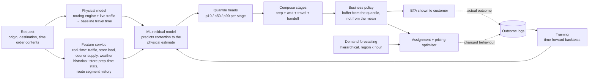
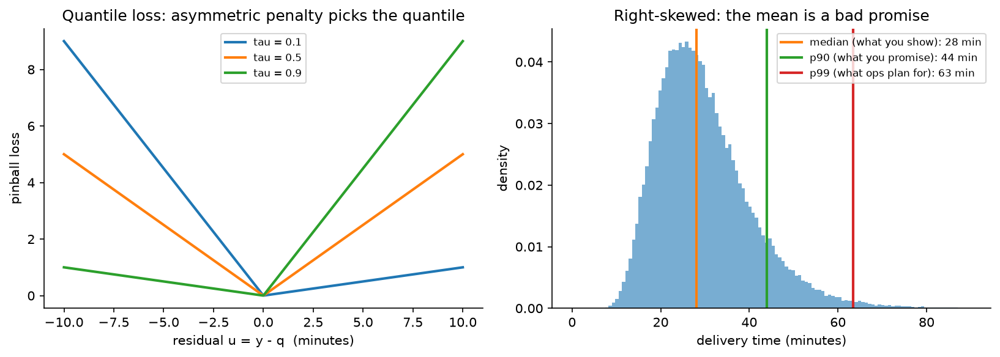

# Forecasting & ETA

> **Why this matters / who asks it.** Uber, Lyft, DoorDash, Instacart, Amazon,
> Grab and every logistics or marketplace company runs forecasting as a core system,
> and they ask this question in two flavours: "predict the arrival time of this
> specific delivery" and "forecast demand for every region and hour next week". Both
> are business-critical in the same way: the number is shown to a customer, used to
> make a promise, and consumed by an optimiser that decides where to put supply. The
> interviewer is checking whether you know that the mean is the wrong prediction,
> whether you can backtest without leaking the future, and whether you understand
> that your forecast changes the thing you are forecasting.

## TL;DR: the whiteboard in 60 seconds

- **Predict the residual on top of a physical model.** A routing engine already
  knows the road network and live traffic; the model learns what it systematically
  gets wrong. Uber's DeepETA is built exactly this way.
- **Predict a distribution, not a point.** Delivery times are right-skewed, so the
  mean sits above the median and below the tail. Quantile (pinball) loss gives p10,
  p50 and p90 directly.
- **The displayed number is a business decision.** Show a quantile, not the
  prediction: the cost of being late is not the cost of being early, and the buffer
  encodes that asymmetry.
- **Decompose the journey into stages** (prep, wait, travel, handoff), because each
  has different drivers and different variance, and because the optimiser needs the
  stages separately.
- **Backtest forward in time, always.** Random splits leak tomorrow's traffic into
  today's training set and produce a model that looks excellent and fails on Monday.
- **Features must be as-of the prediction moment.** Point-in-time correctness is the
  most common source of a too-good backtest in forecasting.
- **Hierarchical forecasts must reconcile**: region forecasts should sum to the
  city forecast, and reconciliation methods make that true without throwing away the
  detail.
- **Feedback loops are real.** A longer displayed ETA changes whether the customer
  orders, and an assignment optimiser fed by your forecast changes the supply that
  determines the actual time.
- **Latency matters more than you expect.** ETA is called on every search, every map
  refresh and every assignment decision, which makes it one of the highest-QPS models
  in the company.
- **Evidence**: Uber DeepETA (2022), DoorDash ETA posts (2021 onward), Amazon's
  DeepAR (2017), Google Maps and DeepMind's graph-network work on ETAs, and the
  hierarchical forecasting literature.

## 1. Requirements & scoping

**Functional.** Two systems that share infrastructure. (a) *ETA*: given a specific
trip or order, return the expected arrival time with uncertainty, updated as the
trip progresses. (b) *Demand and supply forecasting*: given a region and a horizon,
forecast orders, couriers, and their imbalance, at the granularity the optimiser
consumes.

**Non-functional, with numbers to ask for.**

| Quantity | Ask the interviewer | A defensible assumption |
|---|---|---|
| QPS | "How often is ETA called per order?" | Dozens of calls per order across search, checkout, assignment and tracking, so tens of thousands of QPS |
| Latency | "Budget per ETA call?" | Under 50 ms p99, because it sits inside other services' budgets |
| Horizon | "ETA horizon and forecast horizon?" | ETA: 10 to 90 minutes. Forecast: next hour to next 2 weeks |
| Granularity | "Forecast by what unit?" | Hexagonal region times 15 minutes for operations; city times day for planning |
| Accuracy target | "What do we optimise: mean error or late rate?" | Late rate at a promised quantile, plus median absolute error |
| Freshness | "How fresh are traffic and store-load features?" | Seconds for traffic, minutes for store load |
| Coverage | "How many cities, and how different are they?" | Hundreds, with very different road networks and behaviour |

**Success metrics.**

- *North star*: on-time rate against the promise shown to the customer, together with
  the size of the buffer used to achieve it. Either alone is gameable: promise two
  hours and you are always on time.
- *Guardrails*: order conversion (a long ETA suppresses orders), courier utilisation,
  support contacts about lateness, and the optimiser's own objective (delivery cost
  per order).
- *Offline proxies*: median and mean absolute error, quantile loss at the operating
  quantiles, calibration of the predicted quantiles (does p90 actually contain 90% of
  outcomes), and error by segment: city, hour, distance band, and the tail.

**Questions a staff engineer asks.**

1. "Is the ETA a promise or an estimate? A promise needs a quantile and a buffer
   policy; an estimate needs the median."
2. "What consumes this number? A customer display and an assignment optimiser want
   different things, and the optimiser usually wants the distribution."
3. "How late is 'late' in business terms? Refund thresholds and support costs define
   the asymmetry I optimise against."
4. "Do we already have a routing engine? If so, my model predicts its residual rather
   than starting from coordinates."
5. "Does the ETA we show change behaviour? If yes, my training labels come from a
   world my own model shaped, and I need that in the design."

## 2. Data

**Sources.** Historical trips and orders with timestamps for every stage, GPS traces,
the road network and the routing engine's outputs, live traffic, store and restaurant
operational data (prep times, current load, staffing), courier state (location,
current assignments, shift), weather, events and holidays, and the displayed ETA
itself, which is a feature of the world you created.

**Labels.** The outcome timestamp, which is mostly clean but has traps:

- *Stage attribution*: the courier marks "picked up" late, so prep time looks longer
  and travel time shorter. GPS geofence events are more reliable than app taps, and
  the design should say which is the source of truth.
- *Censoring*: cancelled orders have no completion time, and they are not missing at
  random; they cancel because they were slow. Dropping them biases the model
  optimistic.
- *Multi-stop trips*: batched deliveries where one order waits for another need
  careful attribution or the model learns that the second order is inherently slow.

**Feedback loops, which are the subtle part.** The ETA you display changes behaviour in
at least three ways: a long ETA suppresses the order (so the training data
under-represents conditions where you predicted badly), the ETA feeds the assignment
optimiser which changes which courier is sent, and couriers adjust their behaviour to
the displayed time. The consequence for design: the model is trained on data generated
under its own policy, and offline improvements do not translate mechanically. Mitigate
with holdout regions or randomised buffer experiments, and treat the online test as
the arbiter.

**Features.**

| Family | Examples | Freshness |
|---|---|---|
| Physical | Routing engine estimate, distance, number of turns, road classes on the path | Seconds |
| Real-time traffic | Segment speeds, incidents | Seconds to minutes |
| Spatial | Origin and destination cells, their historical residuals, airport or campus flags | Batch, with online lookup |
| Store or merchant | Historical prep-time distribution, current open orders, staffing, menu complexity | Minutes |
| Courier and marketplace | Supply-demand ratio in the region, current assignment queue depth | Seconds |
| Temporal | Hour of week, holiday calendar, local events, weather | Batch plus live weather |
| Order | Item count, special handling, payment type | Request time |

**Spatial features need care.** Latitude and longitude as raw numbers are nearly
useless to a tree or an MLP; geohash or hexagonal cell embeddings at several
resolutions are the usual encoding, learned jointly with the task, so that "this
particular apartment complex takes four extra minutes" becomes learnable.

**Point-in-time correctness.** Every historical feature must be the value that was
known at prediction time: the store's average prep time computed over data up to that
moment, the traffic as observed then, the supply ratio then. Computing a store's
average prep time over the full history, including the future, is the single most
common leak in this domain, and it produces a backtest that cannot be reproduced
online. The mechanics are in the
[platform chapter](12-ml-platform-feature-store-monitoring.md).

## 3. Modelling

### 3.1 Baselines

Two, and both are worth naming. The routing engine alone (distance over expected
speed, summed along the path) is the physical baseline. A historical average by
(origin cell, destination cell, hour of week) is the statistical baseline. Both are
cheap, and a good ML model must beat their combination, not just one of them.

### 3.2 Residual learning on top of a physical model

The routing engine encodes the road network, turn restrictions and live traffic. A
neural network starting from raw coordinates would have to relearn all of that from
trip data, which it will do badly. Predicting the *residual* between the routing
estimate and the observed outcome leaves the model with the part it can learn:
systematic biases by location, time, merchant, courier and order type.

$$
\widehat{\text{ETA}} = \text{routing}(o, d, t) + f_\theta(x),
$$

where $f_\theta$ predicts the correction. Uber's DeepETA post describes exactly this
hybrid design, using machine learning to predict the residual between the routing
engine's ETA and the observed outcome, which they call ETA post-processing.

Two extra benefits to mention. The physical model gives a sane answer when the ML
model fails or times out, which is a real fallback. And the residual is a much
better-conditioned target than the absolute time: it is roughly zero-centred, has
much smaller variance, and does not require the model to learn that longer distances
take longer.

### 3.3 Stage decomposition

For a delivery, the total time is the sum of stages with different drivers:

$$
T = T_{\text{assign}} + T_{\text{to store}} + T_{\text{prep wait}} + T_{\text{pickup}} + T_{\text{to customer}} + T_{\text{handoff}}.
$$

Model the stages separately and compose. The reasons: each stage has different
features (prep depends on the merchant, travel on traffic), the optimiser needs the
stages separately to decide when to dispatch a courier, and a stage-level error is
diagnosable while a total-time error is not. The cost is that summing quantiles is
not the quantile of the sum, so composing uncertainty requires either a simulation
over the stage distributions or a model of their correlation. Say that out loud; it
is a favourite follow-up.

### 3.4 Quantile regression and why the mean is wrong

Travel and delivery times are right-skewed: a delivery can be much later than
expected, and only a little earlier. The mean of a skewed distribution is a poor
promise, because it is exceeded more often than half the time in the direction that
hurts.

Train with the pinball (quantile) loss. For a target quantile $\tau$ and prediction
$q$:

$$
L_\tau(y, q) = \max\bigl(\tau (y - q),\; (\tau - 1)(y - q)\bigr),
$$

which penalises under-prediction with weight $\tau$ and over-prediction with weight
$1 - \tau$. Minimising it yields the $\tau$-quantile of the conditional distribution.
Predict several quantiles with separate heads on a shared trunk, and enforce
monotonicity (p10 below p50 below p90) either by construction (predict p50 and
non-negative offsets) or by sorting at inference.

{ width="760" }

*Left: the quantile loss is an asymmetric penalty whose slope ratio picks the
quantile. Right (illustrative): a right-skewed delivery-time distribution where the
median, the p90 and the p99 are far apart, which is why the number you display, the
number you promise and the number operations plan against are three different numbers.*

**The buffer is policy, not modelling.** Displaying p50 means being late half the
time. Displaying p90 means a long, conversion-killing estimate. The displayed value
comes from a policy that trades lateness cost against conversion, and it should be
chosen by experiment, with the model supplying a calibrated distribution.

### 3.5 Model families

- **Gradient-boosted trees** on engineered features are the strong default for the
  residual: fast to train, robust, good with heterogeneous tabular features, and they
  support quantile loss directly. Weak on high-cardinality categorical features
  (millions of merchants, millions of cells) and on sequences.
- **Neural networks with embeddings** handle the high-cardinality spatial and merchant
  features, which is where they earn their place. Uber's DeepETA post reports that an
  encoder-decoder architecture with self-attention over the feature set gave them the
  best accuracy among the architectures they tried, under a hard latency constraint.
- **Graph networks** over the road network, where segments are nodes and the model
  propagates congestion along the graph. DeepMind and Google described using graph
  neural networks over route "supersegments" to improve ETA accuracy in Google Maps,
  reporting improvements in several cities.
- **Sequence models over the trip so far**, updating the ETA as the trip progresses,
  which turns a one-shot prediction into a filtering problem.

For the interview: GBDT residual model as the baseline that ships, a neural model with
embeddings when merchant and location cardinality dominates, and graph structure when
you own the road network and congestion propagation matters.

### 3.6 Demand forecasting and hierarchy

The other half of the chapter. Forecast orders and courier supply per region per
time bucket, for horizons from an hour (dispatch) to weeks (recruitment).

**Global models over many series.** Fitting a separate ARIMA per region wastes the
structure shared across regions. A single model trained across all series, with the
series identity as an embedding, learns shared seasonality and transfers to sparse
series. DeepAR (Salinas, Flunkert & Gasthaus, [arXiv:1704.04110](https://arxiv.org/abs/1704.04110)) is the canonical
version: an autoregressive recurrent network trained on many related time series
producing probabilistic forecasts, handling widely varying scales through rescaling,
with the paper reporting around 15% accuracy improvement over the state of the art at
the time on several real-world datasets.

**Hierarchy and reconciliation.** Forecasts exist at several levels (hexagon, city,
country; product, category, total) and the business needs them to be consistent.
Forecasting each level independently produces incoherent numbers. Reconciliation
projects the independent forecasts onto the space of coherent ones; MinT (Wickramasuriya,
Athanasopoulos & Hyndman, JASA 2019) computes the reconciliation that minimises the
trace of the forecast error covariance, and it dominates naive bottom-up or top-down
approaches because it uses information from every level.

**Seasonality, holidays and events.** Multiple seasonalities (hour of day, day of
week, month), holiday effects that move (Ramadan, Easter), one-off events (a stadium
concert), and weather. Encode them as features instead of post-hoc adjustments, so
the model can learn interactions (rain on a Friday evening is not rain plus Friday).

**Marketplace effects.** The forecast feeds an optimiser that changes pricing and
incentives, which changes demand. A forecast of "demand" is really a forecast of
demand *under the policy you are about to run*, which is a counterfactual problem.
Practical handling: forecast the exogenous part (weather, events, seasonality) and
model the policy response separately, or include the planned policy variables as
features so the forecast is explicitly conditional.

### 3.7 Long-tail events

Aggregate error metrics are dominated by the common case, while customer complaints
come from the tail: the order that took three times the estimate. DoorDash's
engineering writing on improving ETA accuracy for long-tail events describes a
combination of real-time features, historical features designed to capture sparse
patterns around tail events, and a custom loss function that targets accuracy when
large deviations occur. The general principle: if you want tail accuracy, put it in
the loss (quantile loss at a high $\tau$, or an asymmetric cost), because a squared
error objective will always trade the tail away.

## 4. Training & serving

**Training pipeline.** Outcome logs joined to point-in-time features, split by time,
trained with quantile losses, validated on a held-out future window, and gated on
per-segment metrics before release. Retrain cadence: daily or weekly for the ETA
residual model (traffic patterns and merchant behaviour drift), plus a fast path when
a city's error jumps. Demand models retrain daily with a rolling window.

**Backtesting properly.** The protocol to describe:

1. Split by time, never at random.
2. Use rolling-origin evaluation: train on data up to $t$, predict $[t, t + h]$,
   advance $t$, repeat. That gives a distribution of errors across periods instead of
   one number from one lucky window.
3. Respect the label delay: at prediction time you do not know the outcomes of trips
   still in flight, so the features cannot include them.
4. Re-run feature computation as-of the prediction timestamp, instead of joining the
   current value of an aggregate.
5. Evaluate on the same segments the business cares about, since a global improvement
   that regresses one city is a launch blocker.

**Serving.** ETA is called constantly, so the model is one of the highest-QPS services
in the company, and Uber's DeepETA post says theirs is the highest-QPS model at Uber.
That drives the architecture: a tight latency budget (a few milliseconds of model
time), feature fetching that is mostly precomputed and cached, integer-quantised or
small models, and heavy use of batching where the caller allows it.

| Stage | Budget |
|---|---|
| Routing engine call (often cached per origin-destination pair) | 20 ms |
| Feature fetch (real-time and precomputed) | 10 ms |
| Model inference | 5 ms |
| Composition, buffer policy, response | 5 ms |
| Headroom | 10 ms |

**Fallbacks.** If the ML model times out, serve the routing estimate plus a static
correction. If the routing engine fails, serve a historical average by cell pair and
hour. Neither is good, and both are far better than failing, because a missing ETA
blocks checkout.

**Cost.** The model is small and the QPS is enormous, so cost is dominated by the
number of calls, and hardly at all by model size. Caching at the (origin cell, destination
cell, time bucket) level for the search-time estimates, where precision matters less,
cuts most of it; the checkout and assignment calls get the full path.

## 5. Evaluation & experimentation

**Offline.**

- Median and mean absolute error, and quantile loss at the operating quantiles.
- **Calibration of the quantiles**: does the p90 prediction actually contain 90% of
  outcomes, per segment. A miscalibrated p90 makes the buffer policy meaningless.
- Error by segment: city, hour of week, distance band, merchant type, and by
  prediction magnitude (long trips fail differently).
- Tail metrics: the rate of outcomes exceeding the prediction by more than 10 minutes,
  which is the number customer support feels.
- Pitfalls: random splits (leak), joining aggregates computed over the full history
  (leak), dropping cancelled orders (optimistic bias), and reporting a single global
  MAE that hides a broken city.

**Online.** A/B on the on-time rate and the buffer size together, with conversion and
courier utilisation as guardrails. Two complications specific to this domain:

- **Interference.** The assignment optimiser is shared, so a treatment that predicts
  differently changes which couriers are assigned and therefore the control group's
  outcomes. Randomise by region and time (switchback) instead of by user, which is
  the design covered in the
  [experimentation chapter](11-notifications-uplift-experimentation.md).
- **The forecast changes the outcome.** Showing a longer ETA can make the delivery
  genuinely later (the courier paces to the estimate) or earlier (the customer is
  ready). Measure the actual duration as well as the error, or you will optimise a
  metric you are moving by definition.

**Monitoring.** Prediction and residual distributions per city, quantile calibration
drift, feature staleness and null rates (a stale traffic feed looks like a model
regression), fallback rate, and the gap between predicted and actual on-time rate.
Retrain triggers: a city's calibration drifting past a threshold, a road-network or
routing-engine update, a new market launch, or a seasonal regime change.

## 6. Trade-offs & alternatives

| Decision | Chosen | Alternative | When you'd flip |
|---|---|---|---|
| Target | Residual on a physical model | End-to-end time from raw inputs | No routing engine available, or the physical model is unavailable in a market |
| Output | Quantiles (p10, p50, p90) | Point estimate | Downstream consumer genuinely wants one number and owns its own buffer |
| Loss | Pinball at operating quantiles | Squared error | Symmetric costs and a roughly symmetric distribution, which is rare here |
| Structure | Stage decomposition | Single total-time model | Simple trips with one stage, or when stage timestamps are unreliable |
| Model | GBDT residual, neural for high-cardinality features | Deep model everywhere | Merchant and location cardinality is low; GBDT is cheaper to train and serve |
| Road network | Features from the routing engine | Graph neural network over segments | You own the network and congestion propagation is the dominant error source |
| Demand forecasting | One global model across series | Per-series classical models | Few series with long clean histories and strong individual structure |
| Hierarchy | Reconciled forecasts (MinT-style) | Bottom-up summation | Very few levels, or when only one level is consumed |
| Displayed value | Policy-chosen quantile plus buffer | The model's point prediction | Never; the display is a business decision with an asymmetric cost |
| Experiment unit | Region-time switchback | User-level A/B | No shared optimiser and no spillover, which is uncommon in a marketplace |

**Failure modes.**

- *A stale traffic feed*: predictions drift optimistic across a whole city at once.
  Detect on feature freshness, not on model error, because model error takes hours to
  accumulate.
- *A new merchant with no history*: prep-time features are missing and the model falls
  back to a category prior that is wrong. Monitor new-entity volume and their error.
- *Road network change or a routing engine update*: the residual model was trained
  against the old physical model, so its corrections are now wrong. Version the
  physical model as an input to the ML model and retrain when it changes.
- *Seasonal regime shift*: a model trained on summer data is wrong in December.
  Rolling-origin backtests across seasons reveal it; a single holdout window will not.
- *Buffer creep*: each team adds a safety margin, and the customer sees an estimate
  20 minutes too long. Audit the end-to-end buffer as one number owned by one team.

## 7. How real companies did it: as mock interviews

### 7.1 Uber, "the highest-QPS model in the company"

**Interviewer prompt.** "We already have a routing engine that uses map data and live
traffic, and its ETAs are systematically wrong in ways riders notice. Fix the accuracy
without breaking a latency budget that sits inside every other service."

**Candidate walkthrough.** *Clarify*: the routing engine stays, so the ML problem is
the correction; latency is severe because ETA is called everywhere; the model must
serve globally across very different cities. *Metrics*: error against observed
arrival, by segment. *Data*: origin, destination, request time, real-time traffic,
and the nature of the request, such as whether it is a rideshare pickup or a delivery
dropoff. *Model*: predict the residual between the routing engine's estimate and the
observed outcome, with an architecture chosen under the latency constraint. *Serve*:
a very high QPS prediction service with a hard latency ceiling and a fallback to the
routing estimate. *Evaluate*: offline error by segment, then online.

**What the source says.** Uber's engineering post "DeepETA: How Uber Predicts Arrival
Times Using Deep Learning" (February 2022) describes a routing engine that predicts
ETA as a sum of segment traversal times along the best path, an ML model that predicts
the residual between that estimate and the observed outcome (which they call ETA post
processing), features including origin, destination, request time, real-time traffic
and request type, an encoder-decoder architecture with self-attention selected for
accuracy under their latency constraints, and the statement that this is the
highest-QPS model at Uber.

!!! tip "How to say it in the interview: learn the residual, keep the physics"
    "I'd keep the routing engine and train the model to predict its residual, instead
    of learning arrival time end to end from coordinates. Uber published this design
    as DeepETA in 2022: the routing engine sums segment traversal times along the
    best path using map data and live traffic, and the ML model predicts the
    difference between that and what actually happened. The alternative, an
    end-to-end model from raw inputs, would have to rediscover the road network and
    turn restrictions from trip data, which it does badly and expensively. The
    residual target is also much better conditioned, roughly zero-centred with small
    variance, so a smaller model hits the accuracy bar. Uber describe this as their
    highest-QPS model, so a smaller model is worth real money. The extra benefit I'd point out is
    the fallback: if the ML service times out, the routing estimate is still a
    serviceable answer, which a pure end-to-end model does not give me."

### 7.2 DoorDash, "the complaints come from the tail"

**Interviewer prompt.** "Our average ETA error looks fine and our customers are
unhappy. The complaints are about the deliveries that run far over. What do you
change?"

**Candidate walkthrough.** *Clarify*: the metric being optimised (mean error) is not
the metric being felt (large deviations); the delivery has multiple stages with
different variance. *Metrics*: rate of large over-runs, plus quantile calibration.
*Data*: real-time signals about store load and courier supply that predict congestion,
plus historical features that capture sparse patterns for particular stores and time
windows. *Model*: keep the structure, change the loss to penalise large deviations,
and add the features that carry tail signal. *Serve*: same path. *Evaluate*: tail
metrics explicitly, not just MAE.

**What the source says.** DoorDash's engineering post "Improving ETA Prediction
Accuracy for Long-tail Events" (April 2021) describes a three-part approach: adding
real-time features to the model, using historical features that help the model learn
sparse patterns around tail events, and a custom loss function that optimises for
accuracy when large deviations occur. Their later engineering writing describes
multi-task models and probabilistic forecasts for ETAs.

!!! tip "How to say it in the interview: put the tail in the loss"
    "If the complaints are about large over-runs, I'd change the loss before I change
    the architecture. Squared error spends its capacity on the middle of the
    distribution and will happily trade away the tail, so I'd move to quantile loss
    at a high tau, or an explicitly asymmetric cost that matches what a late delivery
    costs us in refunds and support contacts. DoorDash described exactly this in
    their 2021 post on long-tail ETA accuracy: real-time features, historical
    features aimed at sparse tail patterns, and a custom loss targeting large
    deviations. The alternative is to keep the loss and add a bigger buffer, which
    fixes the on-time rate and costs conversion on every single order, including the
    ones that were never at risk. The trade-off with a tail-weighted loss is that
    median accuracy degrades slightly, so I'd report median error and tail rate side
    by side and let the product decide the trade, instead of hiding it in a single
    number."

### 7.3 Amazon, "thousands of series, and you need the distribution"

**Interviewer prompt.** "We forecast demand for millions of products across many
warehouses. Most products have short, sparse histories. Fitting a model per series
does not work. What do you build?"

**Candidate walkthrough.** *Clarify*: the consumer is an inventory optimiser that
needs quantiles, not point forecasts, because safety stock is a quantile decision;
scales vary by orders of magnitude across products. *Metrics*: quantile loss at the
service levels the business uses. *Data*: many related series with covariates
(promotions, price, seasonality). *Model*: one global autoregressive model trained
across all series, with per-series embeddings, rescaling to handle scale variation,
and a probabilistic output so the optimiser gets a distribution. *Serve*: batch
forecasts on a schedule. *Evaluate*: quantile loss and calibration, backtested
rolling-origin.

**What the source says.** Salinas, Flunkert & Gasthaus, "DeepAR: Probabilistic
Forecasting with Autoregressive Recurrent Networks" ([arXiv:1704.04110](https://arxiv.org/abs/1704.04110)) describes
training a single autoregressive recurrent model on a large number of related time
series to produce probabilistic forecasts, handling widely varying scales through
rescaling and velocity-based sampling, learning seasonality and growing uncertainty
from the data, and reports accuracy improvements of around 15% over the state of the
art on several real-world datasets.

!!! tip "How to say it in the interview: one global model, probabilistic output"
    "For many sparse related series I'd train one global model across all of them
    with a series embedding, and I'd make the output a distribution. DeepAR is the
    reference: one autoregressive recurrent model trained across many related series,
    rescaled to cope with scales that differ by orders of magnitude, producing
    probabilistic forecasts, with reported accuracy gains of around 15% over the
    prior state of the art. The alternative is a classical model per series, which is
    interpretable and works well when a series has a long clean history, and which
    starves on the thousands of products with six weeks of sparse data. The reason
    I insist on the probabilistic output: the consumer is an inventory optimiser
    choosing safety stock, and safety stock is a quantile decision, so a
    point forecast forces the optimiser to invent its own uncertainty model from
    nothing."

### 7.4 Google Maps, "the road network is a graph"

**Interviewer prompt.** "Our ETAs are computed from segment speeds, and they miss the
way congestion propagates: a jam two kilometres ahead will affect this segment in
five minutes. How would you capture that?"

**Candidate walkthrough.** *Clarify*: the structure we are failing to use is the
connectivity of the road network over time. *Model*: represent the route as a graph of
connected segments and run a graph neural network so that information propagates
between adjacent segments, predicting travel time over the composed route instead of
summing independent segment estimates. *Data*: historical and live traffic over the
network. *Serve*: precompute over commonly travelled groupings of segments to keep
query-time cost bounded. *Evaluate*: ETA accuracy per city, since road networks and
traffic behaviour differ.

**What the sources say.** DeepMind and Google published a description of using graph
neural networks to improve ETA predictions in Google Maps, operating over
"supersegments" (sequences of adjacent road segments) so the model can account for
connectivity, and reported improvements in real-time ETA accuracy across a number of
cities.

!!! tip "How to say it in the interview: graph structure when you own the network"
    "If congestion propagation is the dominant error source, I'd model the route as a
    graph instead of a sum of independent segments. DeepMind and Google described
    doing this for Google Maps, using graph neural networks over supersegments,
    sequences of adjacent road segments, and reported improved real-time ETA accuracy
    across a number of cities. The alternative, my segment-sum baseline with traffic
    features, is far cheaper and cannot express 'this segment will be slow in five
    minutes because of what is happening downstream'. The trade-off is serving cost
    and complexity: a graph model over a live network is expensive at query time,
    which is why they precompute over supersegments instead of running the graph per
    request. I'd only take this on if I owned the road network data, and I'd check
    first whether my residual model with downstream-traffic features already captures
    most of it, because it often does at a fraction of the cost."

### 7.5 The marketplace, "your forecast changes the future"

**Interviewer prompt.** "Our demand forecast feeds surge pricing and courier
incentives. When we forecast high demand, we raise pricing, and demand falls. Our
forecast is then wrong, and we retrain on that. What is going on and how do you fix
it?"

**Candidate walkthrough.** *Clarify*: the forecast is an input to a policy that
changes the outcome, so "demand" is not exogenous. *Metrics*: forecast error
conditional on the policy, plus the optimiser's own objective. *Model*: separate the
exogenous drivers (weather, events, seasonality, trend) from the policy response, and
make the forecast explicitly conditional on the planned policy variables, so it
answers "demand if we price like this". *Data*: policy variables logged as features;
randomised or switchback experiments to identify the response. *Evaluate*: backtest
conditionally, and use switchback experiments to estimate the policy response rather
than reading it off observational data.

**What the sources say.** The switchback experimental design used to handle exactly
this kind of interference in marketplaces is described in DoorDash's engineering
writing on switchback testing and in the causal-inference literature on experiments
under interference; the design details are covered in the
[experimentation chapter](11-notifications-uplift-experimentation.md).

!!! tip "How to say it in the interview: forecast conditionally, identify the response experimentally"
    "The forecast has become a self-fulfilling input, so I'd stop forecasting
    'demand' and start forecasting 'demand given the policy we are about to run'.
    Concretely: the model takes the planned pricing and incentive variables as
    features, so its output is explicitly conditional, and the exogenous part
    (weather, events, seasonality) is modelled separately. The part that cannot come
    from observational data is the policy response itself, because historically we
    only priced high when we predicted high demand, so price and demand are
    confounded. That has to come from randomisation, and in a marketplace the unit
    has to be region-time instead of user, because supply is shared. DoorDash has
    written about switchback experiments for this reason. The trade-off is that
    switchbacks are noisy and need long run times, so I'd use them to estimate the
    response curve occasionally instead of continuously."

## 8. Staff-level follow-ups

!!! interview "Your offline MAE improved by 8% and the on-time rate did not move. Why?"
    Several possibilities, and I'd check them in order. First, the displayed ETA is a
    quantile plus a buffer, so improving the median does nothing to the on-time rate
    unless the buffer policy is re-tuned against the new distribution; the fix is to
    re-optimise the buffer jointly with the model. Second, the improvement may be
    concentrated where it does not matter, for example short trips that were already
    on time, so I'd decompose the gain by distance band and by whether the order was
    at risk. Third, leakage: an 8% offline gain that vanishes online is the classic
    signature of a feature computed with information not available at prediction time.
    Fourth, the feedback loop: a better ETA changes assignment decisions, which
    changes the actual durations, so the outcome distribution moved under me.

!!! interview "Why not just predict the mean and add a constant buffer?"
    Because the right buffer is not constant. The spread of the outcome distribution
    varies enormously by context: a short trip on a quiet Tuesday has a few minutes of
    spread, a long trip through a city centre on Friday evening with a busy merchant
    has thirty. A constant buffer is simultaneously too small in the high-variance
    case, which is where the complaints come from, and too large in the low-variance
    case, which costs conversion on every one of those orders. Predicting quantiles
    gives me a context-dependent spread, so the buffer adapts. The extra cost is
    calibration work: a p90 that is not really a p90 is worse than a constant buffer,
    because it gives false confidence to the policy layer.

!!! interview "How do you compose stage-level uncertainty into a total?"
    Not by adding quantiles, because the p90 of a sum is not the sum of the p90s
    unless the stages are perfectly correlated. Three options. Simulate: sample from
    each stage's predicted distribution and take quantiles of the sum, which handles
    arbitrary shapes and needs a correlation model. Model the total directly with its
    own quantile heads, using the stage predictions as features, which sidesteps the
    composition problem and loses the stage-level interpretability the optimiser
    wants. Or assume a parametric family per stage (log-normal is a decent fit for
    travel times) and compose analytically with an estimated correlation. In practice
    I'd predict stages for the optimiser and a separate total-time model for the
    displayed number, and reconcile the two so they do not contradict each other
    visibly.

!!! interview "Walk me through a backtest that will not lie to me."
    Time-ordered splits with rolling origins: train on everything up to $t$, evaluate
    on $[t, t+h]$, roll forward, and report the distribution of errors over many
    origins rather than one number. Every feature recomputed as-of the prediction
    timestamp, which in practice means the feature store has to support point-in-time
    joins rather than the training job joining current aggregate tables. Trips still
    in flight at $t$ contribute no label and no features derived from their outcome.
    Cancelled orders handled explicitly rather than dropped, since they cancel for
    reasons correlated with lateness. And evaluation across at least a full seasonal
    cycle, or you will discover in December that the model only knows summer. The
    test I'd run to catch a leak: shuffle the timestamps and confirm performance
    collapses; if it does not, something in the pipeline is reading the future.

!!! interview "A city launches next month with no historical data. What do you do?"
    Start with the physical model, which needs only map data, plus a residual model
    trained on similar cities with the city identity held out, so the model must
    generalise from city-level attributes (density, road type mix, average speeds)
    rather than memorise. Add a conservative buffer initially, and shrink it as data
    accumulates, with the shrink schedule tied to measured calibration rather than to
    the calendar. Instrument heavily from day one: the first weeks of a new market are
    when the residual distribution is most informative, and transfer from the wrong
    donor city is the failure I'd watch for, so I'd compare the new city's residual
    distribution to the donors weekly.

!!! interview "5x demand spike from a storm. What happens to your system?"
    Two distinct problems. The forecast is wrong because storms are rare in the
    training data, which argues for weather as an explicit feature and for a
    fallback that widens the predicted distribution when the feature values are
    outside the training range, rather than confidently predicting the usual. The ETA
    model degrades because supply-demand ratios go outside anything it has seen, and
    the model extrapolates badly; monotonic constraints on the supply features help
    here, since more demand per courier must not decrease the predicted time. The
    serving system itself is fine, since it is a small model at high QPS. The
    operational answer is to widen buffers automatically when features are
    out-of-distribution, which is a detectable condition, and to say so in the product
    rather than silently promising times we cannot hit.

!!! interview "Which should feed the optimiser: the point estimate or the distribution?"
    The distribution, when the optimiser can use it. Assignment decisions are
    fundamentally about risk: sending a courier who will probably be quick but might
    be very slow is different from sending one who is reliably medium, and only the
    distribution can express that. Practically the optimiser usually wants a few
    quantiles rather than a full distribution, so I'd expose p10, p50 and p90 per
    stage. The cost is that the optimiser's problem gets harder and slower, so I'd
    negotiate: give it the distribution for the decisions where risk matters
    (assignment, batching) and the median for the ones where it does not (display
    ordering).

!!! interview "What breaks first at 10x volume?"
    The feature service, because ETA is called dozens of times per order and each call
    fans out to real-time features. The fixes are caching at coarse granularity for
    the low-stakes calls (search-time estimates), and pushing precomputed features
    close to the model. Second is the training data volume, which forces sampling
    strategies that preserve the tail, since uniform down-sampling throws away exactly
    the rare events the tail-weighted loss needs. The model itself scales fine; it is
    small by design because of the latency budget.

!!! interview "Give me the metric you would show the operations leadership."
    On-time rate against the promise, plotted with the average buffer on the same
    chart, segmented by city. Either alone is easy to move in a way that helps nobody:
    on-time rate goes to 100% by promising two hours, and the buffer goes to zero by
    being late constantly. The pair shows whether the forecast is genuinely getting
    sharper. Underneath it I'd keep quantile calibration per city as the health
    metric, because when calibration drifts, both headline numbers stop meaning what
    people think they mean.

## 9. Scaling & evolution

- **One city.** The routing engine plus a historical-average correction by cell pair
  and hour. Log everything with stage timestamps, because that logging is what makes
  the next version possible.
- **Several cities.** A GBDT residual model with point-in-time features, quantile
  heads, a buffer policy chosen by experiment, and rolling-origin backtests. Demand
  forecasting with one global model across regions.
- **Global.** Neural residual models with high-cardinality spatial and merchant
  embeddings, stage decomposition feeding an optimiser, tail-weighted losses,
  per-city calibration monitoring, switchback experimentation, and hierarchical
  reconciled demand forecasts.
- **Batch to real-time.** ETAs updated continuously during the trip using the observed
  progress so far, which turns the model into a filter; demand forecasts refreshed
  every few minutes for dispatch rather than hourly for planning.
- **Single model to jointly optimised.** The end state couples forecasting, pricing and
  assignment: the forecast is conditional on the policy, the policy is chosen against
  the forecast distribution, and the whole loop is evaluated with switchbacks. That
  coupling is where the remaining value is, and it is also where the evaluation
  difficulty moves from modelling to causal inference.

## References

- Uber Engineering. "DeepETA: How Uber Predicts Arrival Times Using Deep Learning." February 2022.
- DoorDash Engineering. "Improving ETA Prediction Accuracy for Long-tail Events." April 2021; and subsequent DoorDash posts on multi-task models and probabilistic forecasts for ETAs.
- Salinas, D., Flunkert, V., Gasthaus, J. "DeepAR: Probabilistic Forecasting with Autoregressive Recurrent Networks." 2017 ([arXiv:1704.04110](https://arxiv.org/abs/1704.04110)); published in the International Journal of Forecasting, 2020.
- DeepMind and Google. "Traffic prediction with advanced Graph Neural Networks" (graph neural networks over supersegments for Google Maps ETAs), 2020.
- Wickramasuriya, S. L., Athanasopoulos, G., Hyndman, R. J. "Optimal Forecast Reconciliation for Hierarchical and Grouped Time Series Through Trace Minimization." JASA 2019.
- Hyndman, R. J., Athanasopoulos, G. "Forecasting: Principles and Practice." Online textbook (hierarchical forecasting, backtesting, evaluation).
- Koenker, R., Bassett, G. "Regression Quantiles." Econometrica 1978.
- Book cross-references: [notifications, uplift & experimentation (switchbacks)](11-notifications-uplift-experimentation.md), [ML platform & point-in-time features](12-ml-platform-feature-store-monitoring.md), [uncertainty & reliability](../part13-retrieval-eval-reliability/03-uncertainty-reliability.md).
