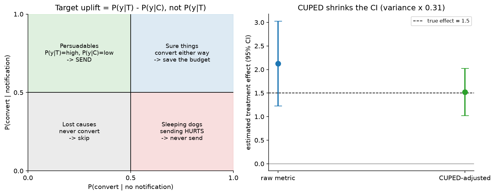

# Notifications, uplift & experimentation

> **Why this matters / who asks it.** Pinterest, Meta, Duolingo, LinkedIn, DoorDash,
> Booking and Netflix all run this system, and the question comes in two halves that
> belong together: "decide which users to notify about what, and when" and "prove
> that it helped". The business problem is that notifications are a shared, exhaustible
> resource. Each one can bring a user back or push them to disable notifications
> permanently, and the second effect is invisible in a click-through metric. The
> interviewer is checking whether you model the *incremental* effect of sending rather
> than the probability of a click, whether you can design an experiment when users
> interfere with each other, and whether you know how to detect a small effect without
> waiting six months.

## TL;DR: the whiteboard in 60 seconds

```mermaid
flowchart LR
  TRIG[Candidate triggers<br/>new content, social events,<br/>reminders, lifecycle] --> CAND[Candidate generation<br/>per user, per channel]
  CAND --> UPL[Uplift model<br/>tau(x) = P(y|send) - P(y|no send)<br/>per user, per notification type]
  FAT[User state<br/>recent volume, fatigue,<br/>time since last open,<br/>channel preferences] --> UPL
  UPL --> BUDG[Budgeted policy<br/>weekly volume budget per user<br/>+ knapsack over uplift]
  BUDG --> TIME[Send-time model<br/>when is this user reachable]
  TIME --> CH[Channel choice<br/>push / email / in-app]
  CH --> SEND[Send]
  SEND --> OUT[Outcomes<br/>open, session, next-day return,<br/>disable, uninstall]
  OUT --> LT[Long-term holdout<br/>no notifications for months]
  OUT --> EXP[Experimentation platform<br/>A/B, switchbacks, CUPED,<br/>sequential testing]
  EXP --> UPL
  LT --> EXP
```

- **Model uplift, not response.** $\tau(x) = P(y \mid \text{send}) - P(y \mid \text{no
  send})$. A user who would have opened the app anyway generates a click and no value.
- **Four quadrants.** Persuadables (send), sure things (do not bother), lost causes
  (do not bother), and sleeping dogs (sending actively hurts, so never send).
- **Budget per user, then allocate.** A weekly volume budget per user, filled by
  choosing the highest-uplift notifications, which is a knapsack rather than a
  threshold. Pinterest's published system does exactly this.
- **The cost of a notification is not zero and not constant.** Fatigue is cumulative,
  and the worst outcome (disabling notifications or uninstalling) removes the channel
  forever, so it must be in the objective with a large negative weight.
- **Randomised holdouts are the only source of uplift labels.** You cannot learn a
  treatment effect from observational send logs, because sending was never random.
- **Long-term holdouts** (a population that receives nothing for months) measure what
  a two-week test cannot: whether notifications build or erode the habit.
- **Interference breaks user-level A/B** whenever users affect each other (social
  notifications, shared marketplaces). Switchbacks and cluster randomisation are the
  answers.
- **CUPED** uses pre-experiment data to cut metric variance, which shortens tests
  substantially for the same power.
- **Sequential testing** lets you peek without inflating the false-positive rate, and
  "peeking with fixed-horizon p-values" is the most common experimentation bug at
  every company.
- **Evidence**: Pinterest's notification volume control system (KDD 2018) and their
  later notification work, CUPED (WSDM 2013), Netflix, Booking and Microsoft
  experimentation writing, DoorDash switchback testing, and the uplift-modelling
  literature.

## 1. Requirements & scoping

**Functional.** For each user, decide what to send, on which channel, at what time,
subject to a volume budget and to policy constraints. Support many notification types
(social, content, lifecycle, transactional) with different value and different
urgency. Provide the experimentation machinery to evaluate any change to any of that.

**Non-functional, with numbers to ask for.**

| Quantity | Ask the interviewer | A defensible assumption |
|---|---|---|
| Users and volume | "MAU, and notifications sent per user per week?" | 300M MAU, 5 to 10 notifications per user per week |
| Channels | "Push, email, in-app, SMS? Different opt-in rates?" | All four, with push opt-in around half on one major platform |
| Latency | "Real-time triggers or batch scheduling?" | Both: social events in seconds, content digests scheduled daily |
| Decision volume | "Candidates evaluated per user per day?" | Hundreds of candidates per user per day, scored in batch |
| Experiment scale | "Concurrent experiments and minimum detectable effect?" | Hundreds of concurrent tests, MDE around 0.5% on engagement |
| Constraints | "Regulatory limits on messaging? Quiet hours?" | Quiet hours by timezone, per-channel consent, unsubscribe honoured everywhere |

**Success metrics.**

- *North star*: incremental sessions or incremental retained users, measured against a
  holdout. Not opens, not click-through rate, because both are maximised by sending to
  people who were coming back anyway.
- *Guardrails*: notification disable rate, uninstall rate, unsubscribe rate, complaint
  rate (email spam reports), and total volume per user. These are the costs that a
  click-based objective cannot see.
- *Offline proxies*: uplift model quality (Qini or uplift curves, which are the
  ranking metrics for treatment effects), calibration of the predicted uplift, and
  send-time model accuracy.

**Questions a staff engineer asks.**

1. "What do we count as success, an open or a session that would not have happened?
   The second is harder to measure and is the only one worth optimising."
2. "Do we have a permanent holdout today? If not, that is the first thing I would
   build, because without it none of these numbers mean anything."
3. "What fraction of users have already disabled notifications? That is the accumulated
   cost of past over-sending, and it bounds the upside."
4. "Are notifications social? If user A's action triggers user B's notification, my
   experiment units are not independent."
5. "What is the minimum effect worth shipping? That sets the sample size, and it
   decides whether we need variance reduction to run the test at all."

## 2. Data

**Sources.** Notification send logs (what was sent, when, through which channel,
under which experiment), delivery and open events, in-app activity, the content that
triggered each candidate, user state (tenure, activity level, timezone, device,
notification settings history), and the settings-change events that record a user
turning notifications off.

**Labels for uplift.** The fundamental problem of causal inference: for a given user
you observe either the outcome with a notification or the outcome without one, never
both. The label for uplift is therefore a population quantity, estimated by comparing
randomised groups.

This has a hard consequence for the design. **The uplift model can only be trained on
randomised data.** Send logs from the existing policy are useless for this purpose,
because the policy chose whom to send to based on predicted response, so the treated
and untreated populations differ systematically. The practical requirement: a
permanent randomised holdout, typically a few percent of users or a random subset of
eligible sends, whose treatment assignment is independent of the model. That holdout
is both the training data for uplift and the measurement instrument.

**Outcome definitions and their windows.** Open within an hour, session within a day,
retention over a week, and the negative outcomes (disable, unsubscribe, uninstall)
which are rare, delayed and irreversible. The negative outcomes are the ones that
matter most and are hardest to attribute, since a user who disables notifications does
so after an accumulation, not after one message. Model the cumulative exposure, not the
single send.

**Biases.**

- *Selection*: who has notifications enabled is itself an outcome of past policy, so
  the population you can send to is the survivors. Improvements measured on survivors
  overstate the effect on the full population.
- *Novelty and primacy*: a new notification type gets attention because it is new, and
  the effect decays. Two-week tests over-estimate durable value.
- *Attribution*: a user who opens the app five minutes after a notification may have
  been opening it anyway. Only the holdout separates the two.
- *Channel confounding*: push opt-in correlates with engagement, so comparing push
  performance to email performance across users compares different people.

**Features.** User state (activity recency and frequency, tenure, historical response
rate by type and channel, time since last notification, cumulative volume this week),
content features (topic, recency, social connection strength to the actor), context
(day of week, local time, device), and interaction features between user state and
content type. For send-time optimisation, the per-user distribution of historical
app-open times is the dominant feature.

## 3. Modelling

### 3.1 Baselines

Rules: send everything, with a global frequency cap. Then a response model that
predicts $P(\text{open} \mid \text{send})$ and sends above a threshold. The response
model is a real improvement over rules, and it has a specific failure that motivates
everything below: it concentrates sends on the users most likely to open, who are
disproportionately the users who would have returned anyway.

### 3.2 Uplift modelling

Define the individual treatment effect under the potential-outcomes framework: for
treatment $T \in \{0, 1\}$ and outcome $Y$,

$$
\tau(x) = \mathbb{E}[Y(1) - Y(0) \mid X = x],
$$

which is what you want to rank by. Estimators, in the order to present them:

**Two-model (T-learner).** Fit $\mu_1(x) = \mathbb{E}[Y \mid X=x, T=1]$ on the treated
and $\mu_0(x)$ on the control, and take $\hat\tau = \mu_1 - \mu_0$. Simple, uses any
model, and it fails when the two models have independent errors of the same magnitude
as the effect, which is the normal case, because uplift is usually much smaller than
the baseline response.

**Single model with treatment as a feature (S-learner).** Fit one model on pooled data
with $T$ as an input, and take the difference of predictions with $T=1$ and $T=0$.
Shares statistical strength, and it can shrink the effect to zero if regularisation
decides the treatment feature is unimportant.

**Class transformation.** With balanced randomisation ($P(T=1) = 1/2$), define
$Z = Y T + (1 - Y)(1 - T)$ (that is, $Z=1$ when a treated user responded or an
untreated user did not). Then $\tau(x) = 2 P(Z = 1 \mid x) - 1$, so a single standard
classifier on $Z$ estimates uplift directly. Elegant, and it needs the balanced design.

**X-learner and doubly robust learners.** The X-learner (Künzel et al., PNAS 2019)
imputes the individual effect for each observation using the other group's model, then
regresses those imputed effects on $x$, with a propensity-weighted combination. It
performs better than the T-learner when the treated and control groups are very
different in size, which is the usual situation when the holdout is small.
Doubly robust and causal-forest approaches (Wager & Athey, JASA 2018; Athey, Tibshirani
& Wager, Annals of Statistics 2019) give valid inference and confidence intervals on
the estimated effects.

{ width="760" }

*Left: the four quadrants. Ranking by $P(y \mid \text{send})$ sends to the top half,
which includes the sure things (wasted) and risks the sleeping dogs (harmful). Ranking
by uplift sends to the left-top quadrant only. Right: CUPED on a simulated test, where
adjusting the metric by a pre-experiment covariate shrinks the confidence interval
without biasing the estimate.*

**Sleeping dogs are real.** For notifications the harmful quadrant is not hypothetical:
users who would have returned on their own, but who receive an ill-timed message and
disable notifications, have strongly negative uplift on the long-run outcome. A model
that only estimates a positive effect cannot represent them, which is the strongest
argument for uplift over response modelling.

**Evaluating uplift offline.** You cannot compute per-user accuracy, because the
individual effect is unobservable. Use the **Qini curve** or uplift curve: order the
randomised population by predicted uplift, and at each depth compute the difference in
outcome rate between treated and control among the top-$k$ ranked users, scaled by
group size. A model with no signal gives the diagonal; a good model bows above it. The
area between the curve and the diagonal (the Qini coefficient) is the summary number.

### 3.3 The budgeted policy

Uplift per candidate is not the decision; the decision is which subset to send under a
budget. Two coupled problems:

**The budget itself.** How many notifications should this user receive this week? This
is a per-user quantity: a heavy user tolerates and benefits from more than a dormant
one, and the optimal number depends on their state. Pinterest's published system treats
notification budgeting as computing an optimal weekly volume per user with a model,
then filling that budget.

**Filling the budget.** Given a budget $b_u$ and candidates with predicted uplift
$\tau_{u,i}$ and cost $c_i$, choose the subset maximising total uplift subject to the
budget, which is a knapsack. In practice a greedy fill by uplift per unit cost is
close enough, with constraints layered on: no two notifications of the same type in a
day, quiet hours, channel-specific caps, and a minimum uplift floor below which
sending is never worth the fatigue.

The objective should net out the fatigue cost explicitly:

$$
\text{value}(u, S) = \sum_{i \in S} \tau_{u,i} \;-\; \lambda\, \text{fatigue}(u, |S|),
$$

where the fatigue term is superlinear in volume and $\lambda$ is calibrated against
the measured disable rate. Without that term the optimiser will spend the entire
budget every week on every user.

### 3.4 Send-time and channel

**Send time.** Model the per-user probability of being reachable and receptive by time
of day and day of week, from their historical app-open pattern, and schedule inside
the highest-probability window that respects quiet hours. The gain is usually a
meaningful relative improvement in open rate and is one of the cheapest wins in the
system, since it requires no new content.

**Channel.** Push is immediate and expensive in fatigue terms, email is tolerant of
volume and slow, in-app is free but only reaches users who already came back. Model
the uplift per channel rather than assuming a global ordering, and respect that
disabling push is an irreversible loss while ignoring an email is not.

### 3.5 Long-term effects

Two weeks of A/B measures the immediate response and misses habit formation and
erosion. Two instruments:

- **Long-term holdout**: a population that receives no notifications (or a fixed
  reduced set) for months, refreshed rarely. It measures the total causal contribution
  of the whole notification system, which is the number leadership actually wants, and
  it is the only way to detect slow erosion.
- **Surrogate metrics**: short-term measurements that predict the long-term outcome,
  validated by regressing long-run retention on short-run signals across past
  experiments. Useful, and only as trustworthy as that validation.

## 4. Training & serving

**Pipeline.** Randomised holdout sends generate the training data for the uplift
models; response models train on all sends; the budget model trains on the outcome of
volume experiments. Retrain weekly. The important architectural point is that the
randomisation infrastructure is upstream of the models, not a feature of the
experiment platform bolted on later.

**Serving.** Mostly batch with a real-time path:

| Path | Cadence | Work |
|---|---|---|
| Batch candidate scoring | Daily or hourly | Score all candidates for all eligible users, solve the budget allocation, schedule sends |
| Real-time triggers | Seconds | Social events that must arrive promptly, scored against the remaining budget |
| Delivery | Continuous | Per-channel delivery with retry, quiet-hour enforcement, and per-user rate limiting as a final safety net |

The final rate limiter deserves a mention as a defensive design: whatever the models
decide, a hard cap per user per day prevents a bug in the allocator from sending a
hundred notifications to somebody, which is the kind of incident that costs a
permanent channel.

**Cost.** The scoring is large batch work (hundreds of candidates times hundreds of
millions of users), which is a data-processing problem rather than a serving one.
Delivery costs money per message on some channels (SMS especially), which belongs in
the knapsack's cost term.

## 5. Evaluation & experimentation

This section is the second half of the chapter's subject, and it generalises to every
other chapter in this part.

### 5.1 The A/B basics, stated precisely

Randomise at the right unit, pre-register the metric, compute the required sample
size, and do not stop early on a fixed-horizon test. The sample size for detecting a
relative effect $\delta$ on a metric with coefficient of variation $c$ at 80% power
and 5% significance is approximately $n \approx 16 c^2 / \delta^2$ per arm, which for
sessions per user (with $c$ around 2 to 3) and a 1% effect means millions of users per
arm.

### 5.2 Variance reduction with CUPED

Metric variance is what makes tests slow. CUPED (Deng, Xu, Kohavi & Walker,
"Improving the Sensitivity of Online Controlled Experiments by Utilizing Pre-Experiment
Data", WSDM 2013) uses a pre-experiment covariate $X$ (typically the same metric
measured before the experiment) to build an adjusted metric:

$$
Y^{\text{cuped}} = Y - \theta\,(X - \bar X), \qquad
\theta = \frac{\operatorname{Cov}(Y, X)}{\operatorname{Var}(X)},
$$

which is unbiased because $X$ is pre-treatment (so its mean is equal in expectation
across arms) and has variance $\operatorname{Var}(Y)(1 - \rho^2)$ where $\rho$ is the
correlation between $Y$ and $X$. With $\rho = 0.7$ the variance halves, which halves
the required sample size or the required runtime. The method is practical and easy to
implement, which is why it is now standard across the industry.

Two conditions to state: the covariate must be strictly pre-treatment (using a
during-experiment covariate reintroduces bias), and the gain is entirely determined by
$\rho$, so choosing the covariate well is the whole game. For users with no
pre-experiment data (new users), $\theta$ adjustment does nothing, so stratify them
separately.

### 5.3 Interference and switchbacks

User-level randomisation assumes one user's treatment does not affect another's
outcome (SUTVA). Notifications break it whenever they are social: if I am in treatment
and get notified about your post, I comment, and you get a notification about my
comment even though you are in control. Marketplaces break it through shared supply.

Remedies, in order of increasing cost:

- **Cluster randomisation**: randomise connected components of the social graph, or
  geographic regions. Reduces interference at the cost of a much smaller effective
  sample size (the unit is now the cluster, so the variance is driven by cluster count).
- **Switchback (time-based) randomisation**: assign the whole region or market to
  treatment or control in alternating time windows. Standard for marketplaces where
  supply is shared, and used at DoorDash and Lyft for pricing and dispatch changes. The
  costs are carry-over effects between windows (handled with burn-in periods that are
  discarded) and heavy temporal correlation, which must be in the variance estimate.
- **Ego-cluster or graph-cluster designs**: randomise a user together with their
  immediate neighbourhood, which captures most first-order spillover.

Whichever you choose, say what it does and does not measure. A switchback measures the
total market effect including equilibrium response; a user-level test measures the
direct effect on the individual and mismeasures the total.

### 5.4 Sequential testing and peeking

Computing a fixed-horizon p-value repeatedly and stopping when it crosses 0.05 inflates
the false-positive rate badly, and it is the single most common experimentation error
in industry. Two correct alternatives: group-sequential designs with spending functions
(pre-specified interim analyses with adjusted boundaries), and always-valid inference
based on sequential probability ratios or confidence sequences, which provide
anytime-valid p-values so any stopping rule is safe. Companies including Optimizely and
Netflix have published on always-valid approaches for exactly this reason. The practical
system requirement: the experiment dashboard must show anytime-valid intervals, because
if it shows fixed-horizon p-values, people will peek regardless of policy.

### 5.5 What else the platform needs

- **Sample ratio mismatch checks.** If the assignment is 50/50 and the observed split
  is 50.4/49.6 with millions of users, something is broken and every result from that
  test is suspect. This is the highest-value automated check in an experiment platform.
- **Layered or overlapping experiments** so hundreds of tests run concurrently without
  colliding, with orthogonal randomisation across layers.
- **Pre-registration** of the primary metric and the analysis, so that the fifteenth
  metric that happened to move is reported as exploratory.
- **Guardrail metrics** applied automatically to every experiment, including latency,
  crash rate, and the notification disable rate here.
- **Heterogeneous effect analysis**, with the caveat that slicing by twenty segments
  guarantees a significant one by chance, so correction or a pre-registered slice list
  is required.

## 6. Trade-offs & alternatives

| Decision | Chosen | Alternative | When you'd flip |
|---|---|---|---|
| Target | Uplift | Response probability | Transactional notifications where the send is obligatory, so uplift is irrelevant |
| Uplift estimator | X-learner or causal forest on randomised data | T-learner | Balanced groups and plenty of data, where the T-learner is simpler and adequate |
| Policy | Per-user budget filled by knapsack | Global threshold on uplift | Very homogeneous users, or when the budget model cannot be trained |
| Fatigue | Explicit cost term calibrated to disable rate | Frequency cap only | A cap is the safety net; it should exist regardless |
| Holdout | Permanent randomised holdout, plus a long-term holdout | Occasional experiments | Never skip the permanent holdout; it is the training data and the measurement |
| Experiment unit | User, unless there is interference | Always user-level | Social or marketplace effects, where clusters or switchbacks are required |
| Variance reduction | CUPED with a pre-period covariate | Larger sample | New products with no pre-period data; stratification instead |
| Stopping | Always-valid sequential inference | Fixed horizon | Fixed horizon is fine if nobody peeks, which is not a real condition |
| Long-term | Long-term holdout | Surrogate metrics validated against it | Surrogates only after validation against the holdout |

**Failure modes.**

- *Optimising opens*: the system sends to users who were returning anyway, the metric
  improves, and incremental sessions do not move. The holdout is the detector.
- *Fatigue accumulation*: each experiment looks positive, and the disable rate climbs
  slowly across quarters. Detect with a long-term holdout and with disable rate as a
  standing guardrail on every experiment.
- *Interference invalidating results*: social notifications leak treatment into control
  and shrink the measured effect toward zero, so genuinely good changes look flat.
  Detect by comparing a user-level test to a cluster-level one on the same change.
- *Peeking*: a stream of false positives that fail to replicate. Fix in the platform,
  not in the process documentation.
- *Sample ratio mismatch*: a broken assignment or a logging bug. Automated check on
  every experiment.
- *Novelty effects*: the two-week win decays. Re-measure at four and eight weeks for
  anything that changes user habits.

## 7. How real companies did it: as mock interviews

### 7.1 Pinterest, "how many is the right number"

**Interviewer prompt.** "We send hundreds of millions of notifications a week. Some
users get too many and turn them off. Some get too few and never come back. Decide the
volume per user, not just the ranking."

**Candidate walkthrough.** *Clarify*: the decision is a budget per user per week, not
a per-message threshold, because the cost of a message depends on how many others that
user already received. *Metrics*: site engagement and notification click-through,
with volume itself as an explicit control variable. *Data*: send logs, engagement,
and notification setting changes; randomised variation in volume to learn the response.
*Model*: predict, for each user, the volume that maximises their long-run engagement,
then fill that budget with the highest-value candidates. *Serve*: batch decision per
user per week with real-time adjustment. *Evaluate*: online experiments comparing the
budgeting system to the previous ML approach.

**What the source says.** Gupta et al., "Notification Volume Control and Optimization
System at Pinterest" (KDD 2018) describes their deployed system for controlling
notification volume per user; the associated Pinterest engineering writing describes
notification budgeting as computing an optimal number of weekly notifications per
person with a trained model, and reports that the system deployed in mid-2017 reduced
notification volume while improving notification click-through and site engagement
compared with their previous machine learning approach.

!!! tip "How to say it in the interview: budget per user, then fill it"
    "I'd make the primary decision a weekly volume budget per user, and only then
    decide what fills it. Pinterest published this design at KDD 2018 as their
    notification volume control and optimisation system, and their engineering posts
    describe training a model to pick the optimal number of weekly notifications per
    person. They report that the deployed system reduced volume and improved both
    notification click-through and site engagement compared with their previous ML
    approach, which is the counterintuitive result worth quoting: sending less made
    the metrics better. The alternative is a global threshold on predicted value per
    message, which is simpler and treats every user's tolerance as identical. The
    trade-off is that a budget model needs randomised variation in volume to learn
    the response curve, so I'd need a holdout that receives more and less than the
    policy would choose, which costs some engagement in the short run."

### 7.2 Microsoft, "make the test finish this week"

**Interviewer prompt.** "Our engagement metric is so noisy that a 1% effect needs six
weeks. We cannot iterate at that speed. Without changing the metric, make the tests
faster."

**Candidate walkthrough.** *Clarify*: we cannot reduce the effect size we care about
or increase the user base, so the only lever is variance. *Model*: adjust the metric
using pre-experiment data, which is correlated with the outcome and independent of the
treatment by construction. *Evaluate*: verify unbiasedness on A/A tests and measure the
realised variance reduction, which is determined by the correlation between the
pre-period and in-period metric.

**What the source says.** Deng, Xu, Kohavi & Walker, "Improving the Sensitivity of
Online Controlled Experiments by Utilizing Pre-Experiment Data" (WSDM 2013) introduces
CUPED, which uses pre-experiment data to reduce metric variability and improve
sensitivity, and describes it as applicable to a wide variety of key business metrics
and practical to implement.

!!! tip "How to say it in the interview: CUPED before more traffic"
    "Before asking for more traffic I'd apply CUPED, from the Microsoft WSDM 2013
    paper: subtract theta times the centred pre-experiment covariate from the metric,
    where theta is the covariance over the variance. It stays unbiased because the
    covariate is pre-treatment, and the variance drops by one minus rho squared, so a
    correlation of 0.7 between the pre-period and in-period metric halves the variance
    and halves the runtime. The alternative is to run longer or ramp to more users,
    which costs calendar time and exposure. The trade-off is that all of the benefit
    comes from rho, so picking the covariate matters more than the method: the same
    metric measured over the prior two weeks is usually the best one, and users with
    no pre-period, which means new users, get no benefit at all, so I'd stratify them
    out rather than let them dilute the adjustment."

### 7.3 DoorDash, "the units are not independent"

**Interviewer prompt.** "We want to test a dispatch change. Couriers are shared between
treatment and control, so a change that assigns couriers faster in treatment starves
control. How do you run this experiment?"

**Candidate walkthrough.** *Clarify*: the interference is through a shared resource, so
no user-level or order-level randomisation can be valid. *Design*: randomise time
windows within a region, so the whole market runs one policy at a time, alternating.
Discard a burn-in period after each switch to let the system reach steady state.
*Analysis*: the unit of analysis is the region-window, so the effective sample size is
the number of windows, and the variance estimate must account for temporal correlation.
*Evaluate*: the measured effect is the total market effect including the equilibrium
response, which is the quantity the business wants for a dispatch change.

**What the sources say.** DoorDash's engineering writing on switchback testing
describes using time-based randomisation within regions to handle network effects in
their marketplace, including the treatment of carry-over between windows; the general
statistical treatment of experiments under interference is covered in the
causal-inference literature.

!!! tip "How to say it in the interview: switchbacks buy validity and cost power"
    "For a dispatch or pricing change I'd run a switchback: randomise time windows
    within each region so the whole market runs one policy at a time, with a burn-in
    after each switch that I throw away. DoorDash has written about using exactly this
    design for marketplace changes where couriers are shared and a user-level or
    order-level split would contaminate both arms. The alternative, order-level
    randomisation, gives me huge sample size and measures the wrong estimand: the
    treatment's effect partly comes from how it reallocates a shared resource, and
    splitting orders hides that. The trade-off is power. My unit of analysis becomes
    the region-window, so instead of millions of orders I have a few hundred windows,
    and the variance calculation has to handle temporal correlation. In practice that
    means switchback tests run for weeks and detect much larger effects, so I'd use
    them for changes that genuinely have marketplace spillover and stay with user-level
    tests for everything else."

### 7.4 Netflix and the industry, "stop peeking wrong"

**Interviewer prompt.** "Our teams watch the dashboard every day and ship when the
p-value crosses 0.05. Tell me what is wrong and what you would build."

**Candidate walkthrough.** *Clarify*: the p-value is computed for a fixed sample size,
and evaluating it repeatedly means the probability of crossing the threshold at some
point far exceeds the nominal rate. *Fix*: either pre-specify interim analyses with
group-sequential boundaries that spend the error budget, or use always-valid inference
so that the reported interval is correct under any stopping rule. *Serve*: the change
belongs in the platform's dashboard, not in a process rule, because people will look at
whatever the dashboard shows. *Evaluate*: run A/A tests through the new machinery and
confirm the false-positive rate matches the nominal level.

**What the sources say.** The group-sequential literature (Pocock; O'Brien and Fleming;
Lan and DeMets spending functions) gives the classical solution, and industry work on
always-valid inference and confidence sequences for continuous monitoring has been
published by Optimizely (Johari, Pekelis and Walsh on always-valid inference) and
discussed in Netflix's experimentation writing on sequential testing.

!!! tip "How to say it in the interview: fix the dashboard, not the policy"
    "The problem is that a fixed-horizon p-value is only valid if you look once, and
    everyone looks every day, so the real false-positive rate is several times the
    nominal five percent. I'd fix it in the platform by reporting always-valid
    confidence sequences instead, which stay correct under any stopping rule, and
    that line of work is published, including Optimizely's always-valid inference and
    Netflix's writing on sequential testing. The classical alternative is a
    group-sequential design with pre-specified interim looks and spending functions,
    which is tighter statistically and requires people to commit to a look schedule in
    advance. I'd choose always-valid for an industrial platform precisely because it
    survives contact with how people actually behave. The cost is honest: anytime-valid
    intervals are wider at any fixed sample size, so a team that genuinely would look
    once pays a power penalty."

### 7.5 The holdout, "what is the whole system worth"

**Interviewer prompt.** "Every notification experiment we run is positive. Our
notification volume has tripled in two years. Is the system actually creating value?"

**Candidate walkthrough.** *Clarify*: a sequence of positive local tests does not imply
a positive total effect, because each test measures a marginal change against a
background that keeps growing, and the cumulative cost (fatigue, disables) is slow and
never attributed to any one test. *Design*: a long-term holdout, a randomly chosen
population that receives no notifications for months, refreshed rarely, with the
difference in retention and sessions measured against the treated population.
*Metrics*: incremental sessions and retained users attributable to the whole system,
plus the disable rate trajectory. *Evaluate*: report the holdout gap quarterly, and use
it to validate any short-term surrogate metric before trusting that surrogate.

**What the sources say.** Long-term holdouts and the limits of short-horizon
experiments are discussed in the experimentation literature, including Kohavi, Tang and
Xu's "Trustworthy Online Controlled Experiments" (2020), which covers long-term effects,
novelty and primacy, and the practice of holdback groups; Netflix and other companies
have written about measuring long-term member value rather than short-term engagement.

!!! tip "How to say it in the interview: a permanent holdout is the only honest number"
    "I'd keep a permanent holdout that receives no notifications for months and report
    the gap as the value of the whole system. A run of positive two-week experiments
    does not add up to a positive system, because each test measures a marginal change
    against a background that is itself growing, and the cumulative cost shows up as a
    slowly rising disable rate that no individual test is ever charged for. Kohavi,
    Tang and Xu's book on trustworthy online controlled experiments covers exactly
    this, including holdback groups, novelty effects and long-term measurement. The
    alternative is to trust short-term surrogates, which is fine once they have been
    validated against the holdout and not before. The cost is real: the holdout users
    get a worse product for months and we forgo their engagement, so I'd keep it small,
    make it a stable random sample so it is not resampled into uselessness, and treat
    the number it produces as the one leadership sees."

## 8. Staff-level follow-ups

!!! interview "Your notification model has 0.8 AUC on predicting opens. Why is that not enough?"
    Because predicting opens and predicting incremental value are different problems,
    and the model with the higher AUC is usually the one that has learned to identify
    users who were coming back anyway. Those users open the notification, the
    click-through metric improves, and nothing changes in their behaviour. What I want
    is the treatment effect, which is a difference between two counterfactual worlds
    and cannot be scored with AUC on observational data at all. So the evaluation has
    to change alongside the model: a Qini curve computed on a randomised holdout,
    which ranks by predicted uplift and measures the treated-versus-control gap at each
    depth. It is a much noisier metric than AUC, which is the honest cost of measuring
    the right thing.

!!! interview "How do you get training data for an uplift model?"
    From randomisation, and only from randomisation. The existing send logs cannot
    support it, because the current policy decided whom to send to on the basis of
    predicted response, so the treated and untreated populations differ in exactly the
    way that would confound the estimate. I would carve out a permanent randomised
    stream: a small percentage of eligible send opportunities where the decision is a
    coin flip independent of any model. That stream is simultaneously the training set
    for uplift, the evaluation set for the Qini curve, and the measurement instrument
    for the system's total value. The cost is some lost engagement on the randomised
    slice, and I'd size it from the precision I need on the uplift estimate rather than
    picking a round number.

!!! interview "What is a sleeping dog and why should I care?"
    A user with negative uplift: they would have come back on their own, and the
    notification makes them less likely to, usually because it annoys them into
    disabling notifications or uninstalling. They matter because a response model
    cannot represent them at all. Ranking by $P(\text{open})$ or $P(\text{return})$
    produces a non-negative score for everyone, so the model's only mistake is wasting
    a send, whereas the real cost is losing a channel permanently. Uplift modelling
    makes the harm expressible, and the corresponding operational change is that the
    policy has a floor: below a threshold uplift, do not send, even if the budget is
    unspent.

!!! interview "You want to test a change to social notifications. Users are connected. What do you do?"
    A user-level A/B is invalid here, because a treated user's activity generates
    notifications for control users, so treatment leaks and the measured effect is
    biased toward zero. The options are cluster randomisation on the social graph
    (assign connected components, which contains most first-order spillover at the cost
    of far fewer effective units and clusters of wildly varying size), ego-cluster
    designs that randomise a user with their immediate neighbourhood, or a switchback
    if the effect is market-level rather than graph-level. I'd also run the user-level
    test in parallel: the gap between the user-level and cluster-level estimates is
    itself a measurement of how much interference there is, which tells me whether to
    keep paying for cluster designs on this class of change.

!!! interview "The test has been running two weeks and the p-value is 0.04. Ship?"
    Only if two weeks was the pre-registered horizon and this is the pre-registered
    primary metric. If the team has been watching daily and this is the day it crossed,
    then the nominal 0.04 is not the real error rate, and the honest response is either
    to run the pre-planned duration or to re-analyse with an anytime-valid method. I
    would also check the mechanics before the statistics: sample ratio mismatch,
    whether the effect is stable across days or driven by one spike, whether guardrails
    moved, and whether the effect is concentrated in a segment in a way that suggests a
    bug. For a notification change specifically, I would want at least four weeks
    regardless of significance, because novelty effects decay and the disable-rate cost
    accumulates slowly.

!!! interview "Two teams each measured a 2% win. Total engagement moved 1%. Explain."
    Several mechanisms, and they are worth distinguishing. Overlap: both changes affect
    the same users through the same channel, so their effects are not additive, which
    is the usual answer. Interference between the concurrent tests if they were not
    orthogonally randomised across layers. Regression to the mean, if both were
    launched on the strength of a lucky significant result and neither effect was as
    large as measured. Novelty decay on one or both. And a measurement boundary issue:
    each team measured its own metric on its own population, while total engagement is
    a different aggregate over a different denominator. The systematic fix is a
    holdback: keep a population that receives none of the quarter's launches and
    measure the total, which is the only way to reconcile the sum of the parts with the
    whole.

!!! interview "How would you decide the volume budget without running a volume experiment?"
    I would not, and I'd say so. The response of a user's long-run engagement to
    notification volume is a causal curve, and observational data cannot identify it
    because volume was assigned by a policy correlated with engagement. The minimum
    viable experiment is a randomised volume assignment across a few levels for a
    sample of users, run long enough to see the disable-rate response, which is slower
    than the engagement response. If the cost of that is unacceptable, the fallback is
    a bandit over volume levels per user segment, which learns the curve gradually
    while limiting the exposure of any one user to a bad level, at the cost of much
    slower learning and a harder analysis.

!!! interview "What breaks first at 10x users?"
    The batch scoring job, because it is users times candidates and both grow. The fix
    is candidate pruning before scoring, since most candidates fall below the uplift
    floor on cheap features alone. Second is the experimentation platform: at ten times the users you
    run far more concurrent experiments, which forces proper layering, and the analysis
    jobs over larger metric tables become the slow step in the iteration loop. Third,
    and least expected, is the holdout: as the number of holdouts multiplies (a
    permanent uplift holdout, a long-term system holdout, per-team holdbacks), the
    fraction of users receiving a degraded product grows, and somebody has to own the
    total holdout budget as a single number.

!!! interview "Give me the one number you would show leadership."
    Incremental sessions per user from the long-term holdout, with the notification
    disable rate on the same chart. The holdout number is the system's actual
    contribution rather than the sum of its experiments, and the disable rate is the
    balance of the account it is drawing on. If the first is flat and the second is
    rising, the system is spending a permanent asset to buy nothing, and that is the
    conversation worth having.

## 9. Scaling & evolution

- **Early product.** Rules, a global frequency cap, a response model, and one thing
  that matters more than any of them: a permanent randomised holdout, built before it
  seems necessary, because retrofitting one costs a quarter of lost measurement.
- **Growth stage.** Uplift modelling on the randomised stream, per-user volume budgets,
  send-time optimisation, an experiment platform with sample-ratio checks, CUPED and
  standard guardrails.
- **Scale.** Knapsack allocation across channels with an explicit fatigue cost,
  cluster and switchback designs where interference exists, always-valid sequential
  inference in the dashboard, long-term holdouts, and surrogate metrics validated
  against them.
- **Batch to real-time.** Triggered notifications scored in seconds against the
  remaining budget, which requires the budget state to be online and consistent, and
  makes the final rate limiter load-bearing.
- **From notifications to a policy over all touchpoints.** The same machinery (uplift,
  budget, fatigue, holdout) applies to emails, in-app messages, promotions and
  discounts. The end state is one contact policy per user across every channel, with a
  single budget, because the user experiences them as one stream even when the company
  organises them as four teams.

## References

- Gupta, B. et al. "Notification Volume Control and Optimization System at Pinterest." KDD 2018.
- Pinterest Engineering. "User state-based notification volume optimization" and subsequent posts on their notification system and relevance.
- Deng, A., Xu, Y., Kohavi, R., Walker, T. "Improving the Sensitivity of Online Controlled Experiments by Utilizing Pre-Experiment Data" (CUPED). WSDM 2013.
- Kohavi, R., Tang, D., Xu, Y. "Trustworthy Online Controlled Experiments: A Practical Guide to A/B Testing." Cambridge University Press, 2020.
- Künzel, S. R. et al. "Metalearners for estimating heterogeneous treatment effects using machine learning." PNAS 2019 (arXiv:1706.03461).
- Wager, S., Athey, S. "Estimation and Inference of Heterogeneous Treatment Effects using Random Forests." JASA 2018 (arXiv:1510.04342).
- Athey, S., Tibshirani, J., Wager, S. "Generalized Random Forests." Annals of Statistics 2019 (arXiv:1610.01271).
- Radcliffe, N. J., Surry, P. D. "Real-World Uplift Modelling with Significance-Based Uplift Trees." Stochastic Solutions white paper, 2011.
- Johari, R., Pekelis, L., Walsh, D. J. "Always Valid Inference: Bringing Sequential Analysis to A/B Testing." 2015 (arXiv:1512.04922).
- Lan, K. K. G., DeMets, D. L. "Discrete Sequential Boundaries for Clinical Trials." Biometrika 1983.
- DoorDash Engineering. Posts on switchback testing for marketplace experiments.
- Ugander, J. et al. "Graph Cluster Randomization: Network Exposure to Multiple Universes." KDD 2013.
- Book cross-references: [forecasting & ETA (switchbacks in marketplaces)](10-forecasting-eta.md), [feed ranking (long-term holdouts)](01-recommendation-feed-ranking.md), [evaluation](../part13-retrieval-eval-reliability/02-evaluation.md).
