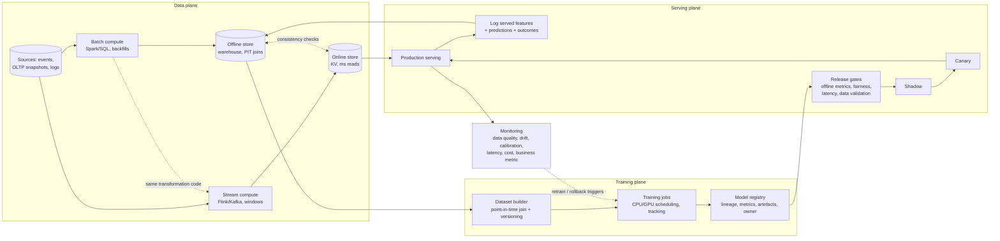
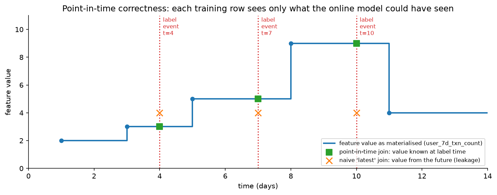

# ML platform, feature store & monitoring

> **Why this matters / who asks it.** Uber, Airbnb, Netflix, Meta, Spotify, Stripe,
> LinkedIn and DoorDash all built one, and they ask about it because at a certain
> size the bottleneck stops being any single model and becomes the time from idea to
> a model serving traffic safely. The business problem is leverage: a platform that
> lets fifty teams ship models without fifty bespoke pipelines, without a new
> training-serving skew bug per team, and without an outage every time somebody
> pushes a model. The interviewer is checking whether you can name point-in-time
> correctness and say why it is hard, whether you understand that monitoring an ML
> system is different from monitoring a service, and whether you know what to
> centralise and what to leave to teams.

## TL;DR: the whiteboard in 60 seconds

- **The feature store's real job is consistency.** One definition, computed once,
  available for training (historically, point-in-time correct) and for serving (now,
  in milliseconds). Two code paths for one feature is the most expensive bug in
  applied ML.
- **Point-in-time correctness** means each training row sees only values that existed
  before its label event. Getting it wrong produces a backtest that cannot be
  reproduced online.
- **Log the features you served.** Recomputing features at training time from raw
  sources reintroduces skew; logging what the model actually saw removes a whole
  class of bugs.
- **The registry is the system of record**: every model version with its data version,
  code version, metrics, owner and deployment state, so every production prediction
  is traceable to a training run.
- **CI/CD for models is not CI/CD for code.** The tests are data tests and metric
  gates, and the release path is shadow, canary, ramp, with an automatic rollback.
- **Monitor four layers**: infrastructure, data quality, model behaviour (prediction
  distribution, calibration), and business outcome. Most incidents are visible in
  layer two long before layer four.
- **Drift is a trigger for investigation.** Input drift with stable performance is
  normal; the retraining decision comes from measured performance or from a
  scheduled cadence.
- **Cost and scheduling become platform problems** once GPUs are shared: quotas,
  preemption, queueing, and a chargeback model that makes teams see their spend.
- **LLMOps adds prompt and context versioning, eval gates, judge validation, and
  per-request cost tracking**, on top of the same skeleton.
- **Evidence**: Uber Michelangelo and Palette, Airbnb Chronon (formerly Zipline),
  Netflix Metaflow, Meta FBLearner Flow, Google TFX and the Rules of ML, Spotify's
  and Stripe's platform writing, and the technical-debt literature.

## 1. Requirements & scoping

**Functional.** Let a team define a feature once and use it in training and serving;
build a training dataset with correct historical values; train at scale on shared
compute; register, evaluate and promote a model through environments; serve it with
low latency and a rollback path; monitor everything; and reproduce any production
prediction after the fact.

**Non-functional, with numbers to ask for.**

| Quantity | Ask the interviewer | A defensible assumption |
|---|---|---|
| Teams and models | "How many teams, how many models in production?" | 40 teams, 500 models, 50 retrained weekly |
| Serving scale | "Peak predictions per second across all models?" | Millions per second aggregate, with a long tail of low-QPS models |
| Feature reads | "Features per prediction, and the online store's p99?" | 200 features per request, p99 under 10 ms |
| Training scale | "Largest dataset and largest model?" | 10 TB datasets; models from GBDT to multi-GPU deep nets |
| Latency budgets | "Tightest serving SLA on the platform?" | 10 ms for the fraud and ads paths |
| Compliance | "Audit requirements? Model risk governance? Data residency?" | Yes for credit and identity; lineage and approvals required |
| Cost | "Is compute charged back to teams?" | It should be, and usually it is not yet |

**Success metrics.** Platform metrics are about leverage and reliability:

- *North star*: time from idea to a model serving production traffic, and the number
  of models a team can maintain per engineer.
- *Guardrails*: production incidents attributable to the platform, rollback time,
  training-serving skew incidents, and platform cost per prediction.
- *Operational*: online store p99, feature freshness lag, training job success rate
  and queue time, and the fraction of models with monitoring configured (which is the
  honest measure of whether the platform is being used properly).

**Questions a staff engineer asks.**

1. "What is the most painful thing teams do today? A platform built without that
   answer becomes a system nobody adopts."
2. "Are the models mostly batch scoring or online? Online serving forces the feature
   store; batch scoring does not."
3. "Do we need reproducibility for audit, or only for debugging? Audit changes the
   retention and lineage requirements substantially."
4. "Who owns a model in production at 3am? Platform ownership and model ownership are
   different, and the on-call boundary has to be explicit."
5. "How much heterogeneity do we support? Every framework we allow is a serving
   runtime we maintain."

## 2. Data: the feature platform

### 2.1 The problem it solves

A team writes a feature (a user's 7-day transaction count) twice: once in SQL for the
training pipeline, once in application code for the serving path. The definitions
drift. Window boundaries differ, timezone handling differs, a null becomes a zero in
one and a mean in the other, and the model degrades in a way that no offline metric
shows. This is training-serving skew, and it is the single most common source of the
"great offline, flat online" result that this part keeps returning to.

Uber's [Michelangelo](https://www.uber.com/us/en/blog/michelangelo-machine-learning-platform/) [Palette](https://www.uber.com/us/en/blog/palette-meta-store-journey/) is built explicitly around this: a centralised feature
store organised by entities and feature groups, with an offline store for historical
data and an online store for low-latency retrieval, and a transformation framework
that executes the same feature logic in offline pipelines and online serving. Airbnb's
[Chronon](https://medium.com/airbnb-engineering/chronon-airbnbs-ml-feature-platform-is-now-open-source-d9c4dba859e8) (open-sourced in 2024, originally named Zipline) is described the same way: a
platform where practitioners define feature transformations once and apply them
consistently in offline batch backfills and low-latency online serving.

### 2.2 Point-in-time correctness

A training row is a (entity, label timestamp, label) triple. The features joined to it
must be the values that were *knowable* at that timestamp. Joining the current value
of an aggregate leaks the future.

{ width="720" }

*The feature's value changes over time. A point-in-time join picks, for each label
event, the last value written before that event. A naive join against the current
table gives every training row the same future value, which makes the backtest look
excellent and the production model look broken.*

Two subtleties beyond the basic as-of join:

- **Availability lag versus event time.** A value computed at 02:00 from data up to
  01:00 is not available to a model serving at 01:30. The correct join uses the time
  the value *became available online*, not the time the underlying event happened. A
  feature store that stores only event timestamps will still produce leakage.
- **Label leakage through the entity.** Joining a merchant-level aggregate that
  includes the very transaction being labelled is a self-referential leak that survives
  a correct temporal join. Exclude the labelled event from its own aggregates.

The test that catches most of these: shuffle the label timestamps and confirm model
performance collapses to chance. If it does not, something in the pipeline is reading
the future.

### 2.3 Batch, streaming and request-time features

| Type | Computed | Freshness | Example | Cost |
|---|---|---|---|---|
| Batch | Scheduled jobs over the warehouse | Hours to a day | User's 90-day spend, merchant category stats | Cheap per feature, expensive to backfill |
| Streaming | Continuous windows over the event bus | Seconds | Transactions in the last 60 seconds, session actions | Expensive to operate, essential for fraud and real-time ranking |
| Request-time | Computed in the serving path from the request | Immediate | Distance between two coordinates, ratios of other features | Free, but must be replicated exactly in training |
| On-demand from another service | Fetched at request time | Whatever that service provides | Live inventory, current price | Adds a dependency and a latency tail |

Palette supports batch (Hive/Spark), near-real-time (Flink streaming) and external
"bring your own" features from microservices, which is the shape most platforms
converge on. The design question to raise in an interview: request-time and
streaming features are where skew hides, because they are the ones whose training-time
reconstruction is hardest, and logging served values is the reliable fix.

### 2.4 Storage and serving

Two stores with one logical definition: a warehouse or lake for history (columnar,
partitioned by time, supporting as-of joins over billions of rows) and a key-value
store for online reads (single-digit millisecond p99, high fan-out per request).
Materialisation moves values from the first to the second on a schedule or from the
stream. Practical concerns to name: fan-out (200 feature reads per prediction times
tens of thousands of QPS is a serious read load, so features are grouped into rows
that are fetched together), TTLs and backfills, and schema evolution when a feature's
definition changes (version the feature instead of mutating it, so old models keep
working).

### 2.5 Data quality and validation

Every feature has expectations: type, range, null rate, cardinality, and a
distribution. Validate them at ingestion and at serving. Google's TFX data-validation
work (Breck et al., ["Data Validation for Machine Learning", MLSys 2019](https://proceedings.mlsys.org/paper_files/paper/2019/hash/928f1160e52192e3e0017fb63ab65391-Abstract.html)) describes
schema-based validation of training and serving data to catch errors early, and the
practical value is that most model incidents start as data incidents that a schema
check catches in minutes, long before they surface as accuracy regressions.

## 3. Training, tracking and the registry

**Training orchestration.** A workflow system runs dataset build, training, evaluation
and registration as a versioned DAG. Two philosophies, both defensible: a
workflow-first platform where the pipeline is the unit ([FBLearner Flow](https://engineering.fb.com/2016/05/09/core-infra/introducing-fblearner-flow-facebook-s-ai-backbone/), [TFX](https://research.google/pubs/tfx-a-tensorflow-based-production-scale-machine-learning-platform/)), and a
library-first platform where the data scientist writes Python and the platform handles
infrastructure ([Netflix's Metaflow](https://netflixtechblog.com/open-sourcing-metaflow-a-human-centric-framework-for-data-science-fa72e04a5d9), which is explicitly designed to let scientists work
in familiar code while the platform manages compute, data and versioning). The
library-first approach wins adoption where the users are researchers; the
workflow-first approach wins governance where the users are many teams shipping to
production.

**Experiment tracking.** Every run records its parameters, code version, dataset
version, environment, metrics and artefacts. The requirement that makes it worth
building instead of buying: it must be automatic, because tracking that depends on
discipline is tracking that is missing exactly when you need it.

**The model registry** holds each model version with:

- Lineage: which dataset version, which feature definitions and versions, which code
  commit, which training run.
- Evaluation: metrics on standard slices, fairness metrics where applicable, and the
  comparison against the incumbent.
- Operational metadata: owner, on-call, serving runtime, resource profile, expected
  QPS.
- State: staging, shadow, canary, production, retired, with the history of transitions.

The registry is what makes "why did this prediction happen" answerable. Combined with
logged served features and logged predictions, you can reconstruct any decision, which
is required in regulated domains and useful everywhere.

**Reproducibility.** Deterministic seeds, pinned environments, immutable dataset
versions, and content-addressed artefacts. Exact bit-level reproducibility on GPU is
often impractical; what you need is the ability to retrain and get a model within a
tolerance, and to explain any difference.

## 4. Serving, CI/CD and release

**Serving runtimes.** Support a small number deliberately: a tree-model runtime, a
general tensor runtime, and a Python fallback for the long tail of odd models. Each
runtime is a surface to maintain, optimise and secure. Standard formats help;
per-team custom serving does not scale.

**The release path.**

1. **Offline gates**: metrics on standard slices against the incumbent, plus data
   validation on the training set, plus latency and memory benchmarks on the target
   hardware. Automatic, and blocking.
2. **Shadow**: the new model runs on live traffic without its predictions being used.
   Compare score distributions, latency, and disagreement with the incumbent. This
   catches skew, which offline evaluation cannot.
3. **Canary**: a small traffic slice uses the new model, with automatic rollback on
   guardrail breach.
4. **Ramp** with monitoring at each step, then full traffic, keeping the previous
   version warm for rollback.

Two things to emphasise. Shadow mode is where training-serving skew appears, because
it is the first time the model sees production features through the production path;
a systematic offset between shadow and offline scores is a skew bug, not a model
property. And rollback must be tested regularly, because a rollback path that has
never been exercised is a rollback path that does not work.

**Model-specific CI.** Beyond unit tests: schema tests on input data, invariance tests
(a prediction should not change when an irrelevant field changes), directional tests
(risk should increase with velocity), performance tests on a golden set, and a
behavioural regression suite of cases the model previously got wrong. Breck et al.'s
["ML Test Score" (IEEE Big Data 2017)](https://research.google/pubs/the-ml-test-score-a-rubric-for-ml-production-readiness-and-technical-debt-reduction/) is a usable checklist for what to test in features,
model development, infrastructure and monitoring.

## 5. Monitoring

Four layers. The discipline is to monitor all of them, since teams usually watch
only the first and the last.

**Layer 1: infrastructure.** Latency percentiles per model, error rates, throughput,
resource saturation, and the online store's read latency and availability. Standard
service monitoring, and it catches the failures that page someone.

**Layer 2: data quality.** Per-feature null rate, range violations, cardinality
changes, freshness lag, and the rate of defaults substituted for missing features.
Most ML incidents are data incidents, and this layer detects them in minutes. The
single highest-value alarm on a mature platform is "the null rate for feature X jumped
from 0.1% to 40%", because that fires before any accuracy metric moves.

**Layer 3: model behaviour.**

- *Prediction distribution*: the mean and quantiles of the score, per segment. A shift
  without a corresponding input shift means something broke.
- *Input drift*: population stability index or a distributional distance per feature
  against the training distribution. Treat it as a trigger for investigation.
- *Calibration*: predicted versus observed rates, wherever labels arrive. This is the
  earliest true-quality signal in ads, fraud and ranking.
- *Feature attribution drift*: a change in which features drive predictions, which
  catches a subtler class of breakage than marginal drift.

**Layer 4: outcome.** The business metric, and the model's contribution to it, which
usually needs an experiment or a holdout, which a dashboard cannot give you.

**Drift and retraining triggers.** Distinguish covariate shift (inputs move, the
relationship holds) from concept drift (the relationship itself changes). Covariate
shift with stable measured performance is not a reason to retrain. The practical
trigger policy: retrain on a schedule set by how fast the domain moves; retrain early
on a measured performance or calibration breach; and treat drift alarms as
investigation triggers instead of as automatic retraining, because automatic
retraining on a drift alarm is how a data bug gets baked into a model.

**Label delay** shapes everything here. Where labels arrive in seconds (clicks) you can
monitor accuracy directly. Where they take months (chargebacks, churn), you monitor
proxies and calibration on matured windows, and the monitoring design has to make that
lag explicit instead of plotting an accuracy number that silently refers to last
quarter.

## 6. Cost, scheduling and organisation

**GPU scheduling.** Once GPUs are shared, the platform needs quotas per team, a
queueing policy, preemption for low-priority jobs, gang scheduling for distributed
training (a job needing 8 GPUs must get all 8 or none), and bin-packing for
inference. Utilisation is the number to watch: a cluster at 30% utilisation with
teams complaining about queue times usually has a fragmentation problem, and adding
capacity will not fix it.

**Cost attribution.** Charge back training and serving cost to teams and show it in
the same dashboard as their model metrics. Behaviour changes when a team can see that
their hourly retraining costs more than the revenue the model's last improvement
generated. Without chargeback, the platform team is the only one with an incentive to
care, and they are the ones least able to decide what to cut.

**Build versus buy.** Managed feature stores, experiment trackers and serving stacks
exist (Feast and Tecton in the feature-store space, several vendors elsewhere). The
honest decision rule: buy where your requirements are ordinary, build where your
requirements are load-bearing and unusual. For most companies the feature store's
*integration* with their existing event bus and warehouse is the hard part, which is
why open-source projects like [Chronon](https://medium.com/airbnb-engineering/chronon-airbnbs-ml-feature-platform-is-now-open-source-d9c4dba859e8) (Airbnb, with Stripe as a co-maintainer) get
adopted and extended instead of used as-is.

**What to centralise.** Centralise the things where inconsistency is expensive:
feature definitions, the registry, the release path, monitoring, and the serving
runtimes. Leave modelling, evaluation criteria and retraining policy to teams, because
those are domain decisions and a platform that dictates them will be routed around.

## 7. LLMOps: what changes

The skeleton is the same, and five things are new:

- **Prompts and context are artefacts.** They are versioned, reviewed and rolled back
  like code, and a prompt change is a model change for release purposes.
- **Evaluation gates are the release gate.** A regression suite of prompts with a
  validated judge (see the [LLM assistant chapter](08-llm-product-rag-assistant.md))
  blocks promotion, and the judge's agreement with humans is itself monitored.
- **The model is often a vendor's** and it changes underneath you. Pin versions where
  the provider allows it, run the regression suite on every provider update, and keep
  a fallback provider for the paths where availability matters.
- **Cost per request is variable** and depends on context length, so cost monitoring
  moves from a monthly finance question to a per-request metric with alerts.
- **Retrieval indexes are stateful dependencies** with their own freshness, quality and
  version, so they need the same lineage treatment as a feature store: which index
  version served this answer.

Observability also changes shape: you log the prompt, the retrieved context, the
generation and the guardrail outcomes, which is a lot of text with privacy
implications, so sampling and redaction policies are part of the design.

## 8. Trade-offs & alternatives

| Decision | Chosen | Alternative | When you'd flip |
|---|---|---|---|
| Feature computation | One definition compiled to batch and streaming | Separate pipelines per environment | Only batch scoring, where the online store is unnecessary |
| Training features | Log served features | Recompute from raw sources | Historical backfill for a new feature, where you must recompute; validate against logged values |
| Platform style | Library-first (Metaflow-like) for researchers | Workflow-first (TFX-like) for governance | Many teams shipping regulated models, where enforced structure is worth the friction |
| Serving | A few supported runtimes | Any framework a team wants | Early, small organisation where flexibility beats consistency |
| Release | Shadow, canary, ramp with auto-rollback | Direct deploy with monitoring | Low-stakes internal models; never for revenue or safety paths |
| Retraining | Scheduled plus performance-triggered | Automatic on drift alarm | Never automatic on drift alone; it bakes in data bugs |
| Monitoring | All four layers | Business metric only | Never; the business metric moves too late to be an alarm |
| Feature store | Build on your own event bus and warehouse | Buy a managed one | Ordinary requirements and a small team; buying is usually right at that size |
| Cost | Chargeback to teams | Central budget | Very small organisation where the platform team can see everything |

**Failure modes.**

- *Skew introduced by a "harmless" refactor*: a feature's null handling changes in one
  path. Detect with shadow-mode score comparison and with online-offline consistency
  checks that sample requests and recompute.
- *A silent upstream schema change*: an integer becomes a string, the parser coerces,
  every prediction shifts. Schema validation at ingestion.
- *Backfill that leaks*: a new feature backfilled with current values, so the retrained
  model looks better and fails online. Enforce point-in-time semantics in the backfill
  tool instead of trusting the author.
- *Registry drift*: what is serving is not what the registry says. Have serving report
  its own model version, and alarm on disagreement.
- *Monitoring configured for 60% of models*: the rest fail silently. Make monitoring a
  requirement for promotion instead of a follow-up task.
- *A shared GPU cluster where one team's job starves everyone*: quotas and preemption,
  plus visibility into queue times per team.

## 9. How real companies did it: as mock interviews

### 9.1 Uber, "the same feature, offline and online"

**Interviewer prompt.** "Our teams keep shipping models that perform worse in
production than in the notebook, and every investigation finds a feature computed
differently in the two places. Build the thing that stops this."

**Candidate walkthrough.** *Clarify*: the requirement is one definition with two
materialisations, and the hard part is that offline needs historically correct values
while online needs millisecond reads. *Metrics*: skew incidents, and online store p99.
*Data*: features organised by entity, sourced from batch jobs, streams, and existing
services. *Model*: no model; the deliverable is the transformation framework that runs
the same logic in the Spark pipeline and the serving path, plus the dual store.
*Serve*: offline store for training joins, online key-value store for serving, kept in
sync. *Evaluate*: consistency checks that sample production requests, recompute the
features offline, and compare.

**What the sources say.** Uber's engineering writing on [Michelangelo](https://www.uber.com/us/en/blog/michelangelo-machine-learning-platform/) and [Palette](https://www.uber.com/us/en/blog/palette-meta-store-journey/)
describes a centralised feature store organised by entities and feature groups, with
offline storage for historical data and a low-latency online store, three ways to
create features (batch via Hive and Spark, near-real-time via Flink streaming, and
external features from microservices), and a transformer framework that executes the
same feature transformation logic in offline pipelines and online serving to guarantee
training-serving consistency.

!!! tip "How to say it in the interview: one definition, two materialisations"
    "The feature platform's contract is that a feature is defined once and the platform
    produces both materialisations: the historical values for training and the current
    value for serving. Uber's [Michelangelo Palette](https://www.uber.com/us/en/blog/palette-meta-store-journey/) is built this way, with an offline
    store and an online store behind one definition, and a transformer framework that
    runs the same transformation logic in the offline Spark pipeline and in the serving
    path. The alternative is what most teams have: a SQL query for training and
    application code for serving, which is faster to write and drifts within a quarter,
    usually on null handling or window boundaries. The trade-off is expressiveness. A
    single definition has to compile to both Spark and a streaming engine, so the
    feature language is constrained, and teams will occasionally want something it
    cannot express. I'd take that constraint, and provide a logged-served-features
    escape hatch for the genuinely odd cases so they are still reproducible."

### 9.2 Airbnb, "define it once, backfill it correctly"

**Interviewer prompt.** "A data scientist wants a new feature. Today they write a
pipeline, wait a week for a backfill, discover the backfill leaked future data, and
start again. Fix the loop."

**Candidate walkthrough.** *Clarify*: the pain is the iteration cycle on features, and
the correctness trap is the backfill. *Model*: a declarative feature definition from
which the platform generates both the streaming computation and the batch backfill,
with point-in-time semantics built into the backfill rather than left to the author.
*Serve*: low-latency online serving from the same definition. *Evaluate*: time to a
usable feature, and the absence of leakage in generated backfills.

**What the sources say.** Airbnb's engineering blog post announcing that [Chronon,
their ML feature platform, is now open source](https://medium.com/airbnb-engineering/chronon-airbnbs-ml-feature-platform-is-now-open-source-d9c4dba859e8) (2024) describes a platform that
transforms raw data into ML-ready features, handling batch and streaming compute,
low-latency serving, and observability, and lets practitioners define transformations
once and apply them consistently in offline backfills and online serving; the project
was originally called Zipline, and Stripe is described as an early adopter and
co-maintainer.

!!! tip "How to say it in the interview: put point-in-time semantics in the tool"
    "The backfill is where correctness gets lost, so I'd make point-in-time semantics
    a property of the platform rather than something each author has to implement.
    Airbnb's [Chronon](https://medium.com/airbnb-engineering/chronon-airbnbs-ml-feature-platform-is-now-open-source-d9c4dba859e8), which they open-sourced in 2024 and which was originally Zipline,
    is built around defining a transformation once and getting both the offline
    backfill and the low-latency online serving from it. The alternative is a library
    of helper functions and a code-review culture, which works until the first tired
    engineer joins against a current-value table and produces a backtest everyone
    believes. The trade-off is that the platform now owns a hard distributed-computing
    problem, correctly reconstructing historical feature values over billions of rows,
    and that is genuinely expensive to build. Which is why I'd adopt an existing
    implementation rather than write one, and spend my team's time on the integration
    with our own event bus and warehouse, which is the part nobody can do for us."

### 9.3 Netflix, "let scientists write Python"

**Interviewer prompt.** "Our data scientists are productive in notebooks and lost in
our infrastructure. Every production hand-off is a rewrite. What would you build?"

**Candidate walkthrough.** *Clarify*: the constraint is human, so the platform's job is
to meet scientists where they are and add infrastructure underneath. *Model*: a Python
library where a workflow is a class with steps, and the platform provides versioning,
data access, dependency management and the ability to move a step to a large machine or
to the cloud without changing the code. *Serve*: the same artefacts run in production
scheduling. *Evaluate*: how often a prototype becomes production without a rewrite.

**What the sources say.** Netflix's technology blog describes [Metaflow as a
human-centric framework](https://netflixtechblog.com/open-sourcing-metaflow-a-human-centric-framework-for-data-science-fa72e04a5d9) for data science, designed so that scientists write ordinary
Python while the framework handles infrastructure concerns including versioning,
data access, compute scaling and deployment; it was open-sourced in 2019.

!!! tip "How to say it in the interview: adoption is a platform metric"
    "I'd optimise the platform for adoption, which means meeting scientists in Python
    rather than in a workflow DSL. Netflix built [Metaflow](https://netflixtechblog.com/open-sourcing-metaflow-a-human-centric-framework-for-data-science-fa72e04a5d9) on that premise: scientists
    write normal Python and the framework supplies versioning, data access, scaling to
    bigger machines and deployment. The alternative is a workflow-first platform like
    TFX or FBLearner, where the pipeline is the unit and the structure is enforced,
    which buys governance and standardisation and costs you the researchers, who will
    prototype outside it and hand you something to rewrite. The trade-off I'd name is
    that library-first platforms make it easy to write a production pipeline that
    nobody reviewed, so I'd pair it with mandatory release gates in the registry: you
    can build however you like, and you cannot reach production traffic without passing
    the same offline gates, shadow run and monitoring configuration as everyone else."

### 9.4 Google, "test the data, not just the model"

**Interviewer prompt.** "Our model degraded for three weeks before anyone noticed, and
the cause was an upstream field that started arriving empty. How would that have been
caught on day one?"

**Candidate walkthrough.** *Clarify*: the failure was a data failure with a slow
accuracy signal, so the detection has to be on the data rather than on the metric.
*Model*: a schema per feature (types, ranges, expected null rates, cardinality,
distribution), inferred from a healthy window and then enforced; validate the training
data and the serving data against it and alarm on violations. *Serve*: validation in
the ingestion path and sampled validation at serving. *Evaluate*: time to detection
for injected data faults, which is a testable property.

**What the sources say.** Breck et al., ["Data Validation for Machine Learning"](https://proceedings.mlsys.org/paper_files/paper/2019/hash/928f1160e52192e3e0017fb63ab65391-Abstract.html) (MLSys
2019) describes a data-validation system deployed at Google as part of TFX, based on
inferring and enforcing a schema over the data feeding ML pipelines, catching errors
in training and serving data before they degrade models. Google's ["Rules of Machine
Learning"](https://developers.google.com/machine-learning/guides/rules-of-ml) (Zinkevich) makes the related operational point about logging the features
used at serving time and training on them.

!!! tip "How to say it in the interview: a schema per feature, enforced both sides"
    "The fastest detector for this class of failure is a data schema, not a model
    metric. I'd infer a schema per feature from a healthy window, types, ranges, null
    rates and cardinality, then enforce it on both the training data and a sample of
    serving traffic, and alarm on violations. Google described exactly this system in
    'Data Validation for Machine Learning' at [MLSys 2019](https://proceedings.mlsys.org/paper_files/paper/2019/hash/928f1160e52192e3e0017fb63ab65391-Abstract.html), deployed as part of TFX to
    catch data errors before they degrade models. The alternative is monitoring
    accuracy, which is what we do today and which is why it took three weeks: accuracy
    moves slowly, it is confounded by seasonality, and in many domains the labels
    arrive too late to be an alarm at all. The cost of schemas is maintenance, since
    legitimate changes trigger alerts, so I'd version the schema and make updating it
    part of the normal change process rather than something an on-call engineer
    silences at 3am."

### 9.5 The technical-debt view, "what this platform is actually preventing"

**Interviewer prompt.** "Convince me a platform team is worth the headcount. The
product teams say they can ship models fine on their own."

**Candidate walkthrough.** *Clarify*: the cost of not having one is not visible as a
line item; it shows up as incidents, as duplicated pipelines, and as the slow
accumulation of systems nobody can change. *Argument*: name the specific debts,
entanglement where changing one feature changes everything downstream, undeclared
consumers reading a model's outputs, feedback loops where a model's predictions become
its own training data, pipeline jungles, and configuration debt, then map each to a
platform capability that contains it. *Evaluate*: incident counts, time to ship, and
the number of models a team maintains per engineer.

**What the source says.** Sculley et al., ["Hidden Technical Debt in Machine Learning
Systems"](https://papers.nips.cc/paper/5656-hidden-technical-debt-in-machine-learning-systems) (NeurIPS 2015) catalogues these failure patterns, including entanglement
("changing anything changes everything"), correction cascades, undeclared consumers,
data dependencies, feedback loops, pipeline jungles and configuration debt, and argues
that the ML code is a small fraction of a real production ML system.

!!! tip "How to say it in the interview: name the debt the platform prevents"
    "I'd make the case in the language of the [2015 'Hidden Technical Debt in Machine
    Learning Systems' paper](https://papers.nips.cc/paper/5656-hidden-technical-debt-in-machine-learning-systems), because it names the failures precisely: entanglement,
    undeclared consumers, hidden feedback loops, pipeline jungles, configuration debt,
    and the observation that the model code is a small fraction of the real system.
    Each of those maps to a platform capability. Undeclared consumers are contained by
    a registry with lineage and by an access-controlled prediction API. Feedback loops
    are contained by holdout traffic and logged policy versions. Pipeline jungles are
    contained by one dataset builder. The alternative, letting each team build their
    own, is genuinely faster for the first two teams and becomes forty incompatible
    pipelines by the tenth. The trade-off I'd be honest about is that a platform built
    before the pain is a platform nobody adopts, so I'd build it on the back of the two
    or three capabilities teams are already asking for and let it grow from there."

## 10. Staff-level follow-ups

!!! interview "Define point-in-time correctness and tell me how you would catch a violation."
    Every training row's features must be the values that were available online at that
    row's label timestamp, which means joining on the time the value became *available*
    rather than the time the underlying event happened. Violations come from three
    places: joining a current-value table, using an aggregate that includes the labelled
    event itself, and ignoring computation lag so a feature computed at 02:00 is
    attributed to 01:30. To catch them: shuffle label timestamps and confirm performance
    collapses; compare a model trained on logged served features against one trained on
    recomputed features, since a large gap points at leakage in the recomputation; and
    inspect the top features for any whose importance is implausibly high, which is how
    leaks usually announce themselves.

!!! interview "Should every team use the feature store?"
    Every team with an online model, yes, because that is where skew lives. Teams doing
    pure batch scoring get less value, since they can compute features in the same job
    that scores, and forcing them through the platform adds friction for a problem they
    do not have. What I would require of everyone regardless is the registry, the
    release gates and the monitoring, because those protect the company rather than the
    team. The general principle I'd state: mandate the things whose absence hurts
    others, and make optional the things whose absence only hurts you.

!!! interview "Drift alarms are firing. Do you retrain?"
    Not on the alarm alone. First I'd check whether the drift is in the input
    distribution or in the relationship between inputs and outcome, because covariate
    shift with stable measured performance is a normal consequence of the business
    growing and retraining on it gains nothing. Then I'd check whether it is a data bug
    masquerading as drift, which is far more common: a schema change, a new client
    version, a broken upstream service. Retraining on a data bug bakes it in and makes
    the next investigation much harder. My policy is: retrain on a schedule set by how
    fast the domain moves, retrain early when measured performance or calibration
    degrades, and treat drift as an investigation trigger with a human in the loop.

!!! interview "A model in production is making bad predictions. Walk me through the debug."
    In order of speed. First, is it serving the model we think it is: compare the
    version reported by the serving process against the registry. Second, are the
    features right: take a sampled production request, look at the logged served
    features, and compare against the offline recomputation for the same entity and
    time. A systematic difference is skew and is the most likely cause. Third, has the
    input distribution moved: per-feature drift and null rates against the training
    window. Fourth, is the model itself wrong: score a golden set through the
    production path and compare with the offline evaluation. Fifth, has the world
    changed: check calibration on whatever labels have matured. The order matters
    because the first three are minutes of work and cover most incidents, while the last
    two are hours.

!!! interview "How do you handle a feature whose definition needs to change?"
    Version it rather than mutating it. Create v2 alongside v1, backfill v2 with
    point-in-time semantics, let models migrate by retraining against v2 explicitly,
    and retire v1 when no registered model depends on it, which the registry can tell
    you. Mutating a feature in place changes the inputs of every model consuming it
    without retraining any of them, and the effect is a slow, unattributable
    degradation across several teams at once. The cost of versioning is storage and a
    migration each team has to schedule, which is exactly the friction that makes people
    want to mutate in place, so the platform has to make migration cheap.

!!! interview "Shadow mode says the new model's scores are systematically 8% higher than offline. What is going on?"
    That is a skew signature, and shadow mode caught it doing its job. The likely
    causes, in order: a feature computed differently in the serving path (defaults for
    missing values are the classic, where offline has the true value and online
    substitutes a mean), a feature that is stale online because its materialisation lags
    (the model sees an older value than the training row did), a preprocessing
    difference such as a different normalisation constant baked into the training
    pipeline, or a genuinely different traffic mix between the offline evaluation set
    and live traffic, which is not a bug but does invalidate the comparison. I'd diff
    the logged served features against the offline features for the same requests, which
    localises it in one query.

!!! interview "How would you decide what to build versus buy?"
    Buy where the requirement is ordinary and build where it is load-bearing and
    unusual. Experiment tracking and model serving are ordinary for most companies.
    The feature platform is the interesting case: the abstractions are ordinary and the
    integration with your event bus, warehouse and identity model is specific, which is
    why adopting an open-source implementation like Chronon or Feast and investing in
    the integration usually beats both buying a black box and writing one from scratch.
    I'd also weigh the exit cost: anything that ends up holding the definitions of every
    feature in the company is something you will not migrate off easily, so I'd prefer
    an open format there even at some feature cost.

!!! interview "What breaks first as the platform grows from 50 to 500 models?"
    Ownership. At 50 models a platform team can know them all; at 500 nobody does, and
    the failure is models with no owner, no monitoring and no retraining, quietly
    serving stale predictions. The fixes are organisational and enforced by the
    platform: an owner and on-call rotation required for promotion, monitoring required
    for promotion, and automatic retirement of models with no traffic. Technically, the
    next thing to break is the online store's fan-out, since 500 models times 200
    features per prediction is a serious read load, which pushes you toward feature
    grouping and caching. Third is the cost line, which is when chargeback stops being
    optional.

!!! interview "What does this platform look like if half the models become LLM-based?"
    The skeleton holds and five things change. Prompts and retrieval context become
    versioned artefacts in the registry, so a prompt change goes through the same
    release path as a weight change. The release gate becomes an evaluation suite with
    a validated judge, and the judge's human agreement is itself a monitored metric.
    The model may belong to a vendor and change underneath you, so version pinning,
    regression runs on provider updates and a fallback provider become platform
    features. Cost becomes per-request and context-length dependent, so it needs
    alerting rather than a monthly report. And retrieval indexes become stateful
    dependencies with lineage, because "which index version produced this answer" is the
    LLM equivalent of "which feature version produced this prediction".

!!! interview "Give me the platform metric you would report to engineering leadership."
    Time from a working model in a notebook to that model serving production traffic
    with monitoring configured, measured as a distribution across teams rather than an
    average, alongside the count of production incidents attributable to the platform.
    The first is the leverage the platform exists to provide, and reporting the
    distribution rather than the mean exposes the teams the platform is failing. The
    second is the tax, and a platform that improves the first while quietly raising the
    second is not actually helping.

## 11. Scaling & evolution

- **One team, a few models.** No platform. A shared repository with a convention for
  training scripts, a place to store artefacts, and the discipline of logging served
  features. That last habit is what makes everything later possible.
- **Several teams.** The registry and the release path first, because inconsistent
  deployment causes incidents that cross team boundaries. Then a dataset builder with
  point-in-time joins, then monitoring as a requirement for promotion.
- **Many teams, online models.** The feature platform with dual stores and one
  definition, shared serving runtimes, data validation, drift monitoring, and shared
  GPU scheduling with quotas. This is where the platform becomes a product with its own
  roadmap and its own users.
- **Batch to real-time.** Streaming feature computation is the biggest step, because it
  adds an operational surface (a stream processor with state, watermarks and
  reprocessing) that is harder to run than any batch job. Introduce it for the models
  that need seconds of freshness, not for everything.
- **Predictive to generative.** The platform extends rather than being replaced:
  prompts and indexes join features and weights as versioned artefacts, evaluation
  suites join metric gates, and per-request cost joins the monitoring stack. Uber's own
  writing describes [Michelangelo extending from predictive to generative AI workloads](https://www.uber.com/us/en/blog/from-predictive-to-generative-ai/)
  along these lines, which is the pattern to expect.

## References

- Uber Engineering. "Meet Michelangelo: Uber's Machine Learning Platform" ([uber.com](https://www.uber.com/us/en/blog/michelangelo-machine-learning-platform/)); "Palette Meta Store Journey" ([uber.com](https://www.uber.com/us/en/blog/palette-meta-store-journey/)) and the recorded talk "Michelangelo Palette: A Feature Engineering Platform at Uber" ([infoq.com](https://www.infoq.com/presentations/michelangelo-palette-uber/)); "From Predictive to Generative: How Michelangelo Accelerates Uber's AI Journey" ([uber.com](https://www.uber.com/us/en/blog/from-predictive-to-generative-ai/)).
- Airbnb Engineering. "Chronon, Airbnb's ML Feature Platform, Is Now Open Source." 2024, the project was originally named Zipline ([medium.com/airbnb-engineering](https://medium.com/airbnb-engineering/chronon-airbnbs-ml-feature-platform-is-now-open-source-d9c4dba859e8)).
- Netflix Technology Blog. "Open-Sourcing Metaflow, a Human-Centric Framework for Data Science." 2019 ([netflixtechblog.com](https://netflixtechblog.com/open-sourcing-metaflow-a-human-centric-framework-for-data-science-fa72e04a5d9)).
- Meta Engineering. "Introducing FBLearner Flow: Facebook's AI backbone." 2016 ([engineering.fb.com](https://engineering.fb.com/2016/05/09/core-infra/introducing-fblearner-flow-facebook-s-ai-backbone/)).
- Baylor, D. et al. "TFX: A TensorFlow-Based Production-Scale Machine Learning Platform." KDD 2017 ([research.google](https://research.google/pubs/tfx-a-tensorflow-based-production-scale-machine-learning-platform/)).
- Breck, E. et al. "Data Validation for Machine Learning." MLSys 2019 ([proceedings.mlsys.org](https://proceedings.mlsys.org/paper_files/paper/2019/hash/928f1160e52192e3e0017fb63ab65391-Abstract.html)).
- Breck, E. et al. "The ML Test Score: A Rubric for ML Production Readiness and Technical Debt Reduction." IEEE Big Data 2017 ([research.google](https://research.google/pubs/the-ml-test-score-a-rubric-for-ml-production-readiness-and-technical-debt-reduction/)).
- Sculley, D. et al. "Hidden Technical Debt in Machine Learning Systems." NeurIPS 2015 ([papers.nips.cc](https://papers.nips.cc/paper/5656-hidden-technical-debt-in-machine-learning-systems)).
- Zinkevich, M. "Rules of Machine Learning: Best Practices for ML Engineering." Google Developers guide ([developers.google.com](https://developers.google.com/machine-learning/guides/rules-of-ml)).
- Feast and Tecton documentation (open-source and managed feature stores).
- Book cross-references: [distributed training](../part14-systems/01-distributed-training.md), [training systems](../part14-systems/02-training-systems.md), [inference systems](../part14-systems/03-inference-systems.md), [evaluation](../part13-retrieval-eval-reliability/02-evaluation.md), [LLM assistant with RAG](08-llm-product-rag-assistant.md), [fraud & anomaly detection](04-fraud-anomaly-detection.md), [forecasting & ETA](10-forecasting-eta.md).
