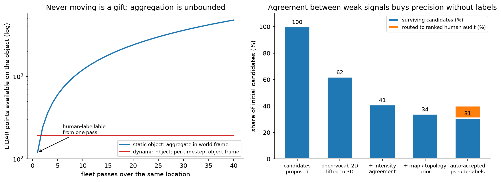
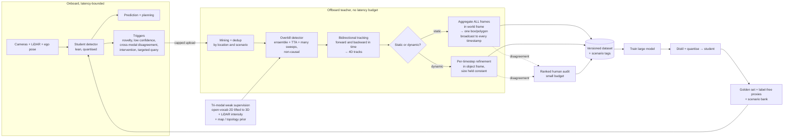
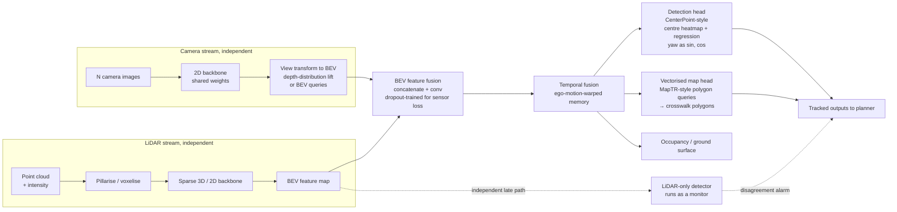

# Novel-object 3D detection from unlabeled fleet data

> **Why this matters / who asks it.** This is the perception design question at Waymo,
> Zoox, Nuro, Aurora, Wayve and the companies staffed by their alumni, and it is
> usually phrased as a specific, slightly awkward request: "we need to detect
> crosswalks (or construction cones, or emergency vehicles, or road debris). We have
> petabytes of multi-camera and LiDAR fleet data and no labels for this class. Design
> the system." The business problem is that a planner cannot yield to something the
> perception stack does not represent, and every new class costs a labelling programme
> the company cannot afford to repeat. The interviewer is testing one thing above all
> others: whether you accept the task as stated, or whether you notice that the task
> as stated is the wrong one.

## TL;DR: the whiteboard in 60 seconds

- **Open with the reframe.** A crosswalk is static and planar. The 7-DOF box
  $(x, y, z, l, w, h, \theta)$ collapses to a 5-DOF planar polygon on the ground plane,
  and because the object never moves, aggregating many fleet passes over the same
  location gives a nearly perfect offline teacher. Design the general 3D detector
  properly, then show the crosswalk falling out as the all-static special case.
- **Objective is asymmetric-cost detection.** Never miss a vulnerable road user or a
  crosswalk the planner must yield to; never flood the planner with phantoms that
  cause phantom braking. Per-class recall floors at a fixed operating precision, not
  an aggregate mAP.
- **The offboard auto-labelling teacher is the answer**, not the onboard model. A
  non-causal overkill detector with ensembling, test-time augmentation and many
  aggregated sweeps, then bidirectional tracking into 4D tracks, then a static or
  dynamic fork. Waymo's 3DAL and the CTRL track-centric follow-up are the published
  lineage.
- **Size belongs to the object, pose belongs to the moment.** Static objects aggregate
  across every frame in the world frame and get one box broadcast to all timestamps.
  Dynamic objects are refined per timestep in the object's own frame with size held
  constant.
- **Bootstrap a zero-label class with three weak signals**: open-vocabulary 2D
  detection lifted to 3D through calibration and LiDAR frustum association, LiDAR
  intensity (retroreflective paint returns high intensity, so stripes survive faded
  paint and dusk), and map or junction-topology priors. Accept on agreement, route
  disagreement to a ranked human audit.
- **Pretrain the LiDAR backbone for free** with image-to-LiDAR cross-modal
  distillation from a frozen 2D foundation model (SLidR, Seal, ScaLR).
- **Model**: PointPillars with a CenterPoint head as the baseline, BEVFusion
  feature-level fusion in BEV as the production choice, plus a MapTR-style vectorised
  head for the crosswalk polygon. Regress yaw as $(\sin\theta, \cos\theta)$, never a
  raw angle.
- **Keep the camera stream independent of LiDAR** so a sensor dropout degrades the
  system instead of breaking it.
- **Do not evaluate on labels from the generator you trained on.** Build a small human
  golden set labelled by a different process, and use label-free proxies
  (cross-pass consistency, cross-modal agreement, temporal churn) on the unlabeled
  fleet.
- **Deploy by distillation**: lean pillar-backbone student, INT8 with
  quantisation-aware training, BN folding, structured pruning, and a check that INT8
  did not move the vulnerable-road-user recall below its floor.

## 1. The reframe, and why it is the whole answer

Deliver this in the first 90 seconds, before any architecture.

A general 3D object is parametrised by seven degrees of freedom: centre $(x, y, z)$,
extent $(l, w, h)$, and heading $\theta$ about the vertical axis. That
parametrisation carries assumptions: the object has a meaningful extent in all three
dimensions, a canonical heading, and a pose that changes over time.

A crosswalk satisfies none of them in a useful way. It lies flat on the road surface,
so its height is the paint thickness and its $z$ is determined by the ground plane it
sits on. It never moves, so its pose is a constant of the world instead of a state to
track. Its shape is better described by a polygon than a box, because crosswalks are
quadrilaterals in the common case and irregular at skewed junctions. So the estimand
collapses:

$$
\underbrace{(x, y, z, l, w, h, \theta)}_{\text{7-DOF box}}
\;\longrightarrow\;
\underbrace{(x, y, l, w, \theta) \;\text{on}\; z = g(x,y)}_{\text{5-DOF planar polygon}},
$$

where $g$ is the ground surface, which the stack already estimates. Two consequences
follow immediately, and each one changes the design.

**Consequence one: the label problem mostly disappears.** A static object can be
observed from every pass any vehicle ever made through that intersection. Ten passes
give ten times the points, from ten viewpoints, at ten lighting conditions, with ten
independent chances for the paint to be unoccluded by a vehicle. Offline, with the
whole log and no latency constraint, reconstructing that geometry is close to a
solved problem. The teacher is nearly perfect, so the student's ceiling is set by the
onboard sensing instead of by label quality.

**Consequence two: the metric changes.** IoU between two thin planar polygons is
dominated by boundary error along the short axis, so a box-IoU metric punishes a
detection that is correct for planning purposes. The planner needs the crossing region
and its extent across the road; a few centimetres of boundary error along the
direction of travel is irrelevant. So evaluation moves to polygon IoU in the ground
plane with class-appropriate thresholds, plus a planning-relevant measure such as
whether the stop line the planner derives lands in the right place.

{ width="780" }

*Left: point count available on a static object grows linearly with fleet passes,
because every pass adds observations in a shared world frame. A dynamic object is
bounded by what one pass sees in its own frame. That difference is why static classes
can be auto-labelled to near-human quality and dynamic classes cannot. Right
(illustrative): agreement between independent weak signals removes most false
candidates without any labels, and the residual disagreement is what humans should
look at.*

!!! tip "How to say it in the interview: the opening reframe"
    "Before I design a detector, I want to say what kind of object this is, because it
    changes the whole design. A crosswalk is static and it is planar. That means the
    usual seven-degree-of-freedom box is the wrong parametrisation: height is paint
    thickness, z is determined by the ground surface we already estimate, and the
    shape is a polygon, not a box. So the estimand is a five-degree-of-freedom
    planar polygon on the ground plane. And because it never moves, I can aggregate
    every fleet pass over that intersection into one reconstruction, which gives me an
    offline teacher that is close to perfect. So my plan is to design the general 3D
    detection system first, with the auto-labelling data engine at its centre, and
    then show you the crosswalk falling out of it as the all-static special case. If I
    just built a crosswalk box detector, I would be solving a harder problem than the
    one you have and I would not be able to reuse any of it for the next class you ask
    me for."

**Why this separates staff from senior.** A senior candidate designs a good detector
for the task as stated. A staff candidate notices that the task as stated over-specifies
the geometry and under-uses the data, redefines the estimand, and in doing so turns an
unlabelled-data problem into a reconstruction problem the team can actually solve.
The reframe is also a generalisation: everything static (lane markings, stop lines,
signs, poles, kerbs) inherits it, so you have designed a class of systems instead of
one detector.

## 2. Interview pacing

A 45-minute round, timed. Announce it at the start.

| Minutes | Phase | What to do |
|---|---|---|
| 0 to 7 | Problem framing | The reframe above, the asymmetric-cost objective, the scoping questions, the numbers you assume |
| 7 to 10 | High-level design | Draw diagram one (the data-engine loop), then diagram two (the BEV fusion stack), each incrementally |
| 10 to 20 | Data and features | Auto-labelling teacher, static or dynamic fork, tri-modal weak supervision, self-supervised pretraining |
| 20 to 30 | Modelling | Baseline to production architecture, the map head, losses, yaw parametrisation |
| 30 to 37 | Inference and evaluation | Distillation, quantisation, the latency budget, and the evaluation trap |
| 37 to 45 | Deep dives | Continual learning, distribution shift, long-tail classes, and whatever the interviewer pulls on |

## 3. Requirements & scoping

**Functional.** Detect and localise instances of one or more classes in 3D from the
onboard sensor suite, at the planner's cycle rate, with a representation the planner
consumes: 7-DOF boxes with velocity and uncertainty for dynamic agents, planar
polygons for ground-plane classes, and a confidence the planner can threshold.
Offline, produce labels for those classes at a quality that can train the onboard
model.

**Non-functional, with numbers to ask for.**

| Quantity | Ask the interviewer | A defensible assumption |
|---|---|---|
| Sensors | "Cameras only, or camera plus LiDAR? Same suite on the whole fleet?" | 8 cameras plus a 64-beam LiDAR on the production vehicle; a subset with denser LiDAR |
| Cycle rate and latency | "Planner cycle and the perception slice of the budget?" | 10 Hz, with perception owning 40 to 50 ms of a 100 ms sensor-to-actuation budget |
| Onboard compute | "TOPS, memory bandwidth, and what else shares the SoC?" | A few hundred INT8 TOPS shared with prediction, planning and other heads |
| Range | "Detection range required, per class?" | 150 m for vehicles, 80 m for VRUs, 50 m for ground-plane markings the planner acts on |
| Fleet data | "Vehicles, daily distance, upload bandwidth, how much is retained?" | Thousands of vehicles, petabytes retained, a bandwidth-capped trigger-driven upload |
| Labels | "Any labels for this class? Human labelling budget?" | Zero for the new class; a small audit budget measured in thousands of frames |
| Timeline | "When does this have to be on the road?" | One quarter to a first onboard model, which rules out a labelling programme |

**Success metrics, and the objective stated as asymmetric cost.** The business
objective is not mAP. It is: never miss an instance the planner must react to, and
never invent one that makes the vehicle brake for nothing. Those two errors have
different costs and the costs differ by class, so the metric suite is:

- **Per-class recall at a fixed operating precision**, reported by range bucket and by
  condition. For vulnerable road users the recall floor is a release gate; for a
  crosswalk the floor is "the crossing regions the planner must yield at".
- **False-positive rate expressed in planner terms**: phantom braking events per
  thousand kilometres, because a false positive only matters when it changes
  behaviour.
- **Localisation error in the dimension that matters**: lateral position and extent
  across the road for a crosswalk, longitudinal position and velocity for a vehicle.
- **Stability**: detection flicker between frames, which the planner feels as jerk.

State plainly that a single aggregate mAP is the wrong summary, because it averages
over classes with a hundredfold difference in cost and over ranges where performance
differs by a factor of three.

**Questions a staff engineer asks.**

1. "What does the planner do with this output? If it derives a stop line, I care about
   the polygon's edge nearest the vehicle far more than about IoU."
2. "Is the class static? That single bit decides whether fleet aggregation gives me a
   free teacher or whether I need per-timestep refinement."
3. "Do we have a map for these areas, and is it trustworthy? A map is a strong prior
   and a dangerous one when the world changes."
4. "What is our audit budget in frames? That sets how much of the pipeline can rely on
   human verification."
5. "Which sensors are on the production vehicle versus the data-collection fleet? A
   sensor that exists only offline becomes an auto-labelling instrument."

## 4. Architecture: two diagrams, drawn incrementally

### 4.1 Diagram one: the data-engine loop

Narrate the draw order. Start with the vehicle box on the left and say "this is what
ships". Then draw the upload arrow and say "this is bandwidth-limited, so triggers
decide what we see". Then the offboard teacher in the middle, and say "this is where
the intelligence lives, and it has no latency budget". Then the dataset and training,
then the arrow back to the vehicle, and say "the loop is the product; the model is one
box in it".

### 4.2 Diagram two: the onboard BEV fusion stack

Narrate this one as three columns. "Left is per-sensor encoding, and note that the
camera column does not touch the LiDAR column." Then "middle is the shared BEV space,
which is where they meet". Then "right is the heads, and the map head is the one that
gives me the crosswalk polygon directly".

## 5. Data: the auto-labelling teacher

This is the heart of the answer, and it deserves the largest block of the round.

### 5.1 The asymmetry that makes it work

The onboard model is causal (it may only use the past), latency-bounded, and runs on a
fixed SoC. The offline teacher has none of those constraints. It can look forwards in
time, run an ensemble with test-time augmentation, accumulate dozens of LiDAR sweeps,
and take ten seconds per frame. It is solving a much easier problem, which is why its
output is usable as supervision rather than being the student grading its own work.

Waymo's 3DAL (Qi et al., "Offboard 3D Object Detection from Point Cloud Sequences",
CVPR 2021, [arXiv:2103.05073](https://arxiv.org/abs/2103.05073)) formalises this as an offboard pipeline: a multi-frame
detector over point cloud sequences, followed by object-centric refinement models that
exploit the temporal points. They report that on the Waymo Open Dataset test set 3DAL
achieves the best results among LiDAR-only methods for vehicles, outperforming some
camera-LiDAR fusion methods on the L1 metric.

### 5.2 Stage one: the overkill detector

Non-causal by construction. Concretely:

- **Many aggregated sweeps.** Transform $K$ LiDAR sweeps into a common frame using
  ego-motion. For static geometry this is pure gain: the point density on the ground
  plane rises linearly with $K$, and faint paint returns accumulate above the noise
  floor. For dynamic objects, naive aggregation smears them, which is precisely why
  the pipeline forks in stage three.
- **Ensembling and test-time augmentation.** Several architectures, several random
  seeds, flips and rotations, fused by weighted box fusion. Offline, an ensemble that
  costs 20x inference is free.
- **A deliberately low score threshold.** The teacher optimises recall; precision is
  recovered by the temporal and cross-signal agreement downstream. A candidate the
  detector never proposes can never be recovered; a false candidate can be killed by
  three later stages.

### 5.3 Stage two: bidirectional tracking into 4D tracks

Track the detections both forwards and backwards in time. A human annotator does the
same thing: find the frames where the object is unambiguous, then propagate the
identity into the frames where it is occluded or distant. CTRL (Fan et al., "Once
Detected, Never Lost: Surpassing Human Performance in Offline LiDAR Based 3D Object
Detection", ICCV 2023 oral, [arXiv:2304.12315](https://arxiv.org/abs/2304.12315)) makes this the organising principle:
they observe that experienced human annotators work from a track-centric perspective,
labelling objects with clear shapes first and then using temporal coherence to infer
the annotations of obscure objects, and they build a bidirectional tracking module and
a track-centric learning module on that observation. The paper's claim is that the
resulting auto-labels surpass human-level annotating accuracy.

The output of this stage is a set of 4D tracks: object identity, and a trajectory of
poses through the log, including frames where the per-frame detector saw nothing.

### 5.4 Stage three: the static or dynamic fork

Classify each track as static or dynamic (displacement over the track's lifetime,
with a threshold that accounts for localisation noise), then treat them differently.
The principle to state out loud, because it is the memorable line of the whole design:

> **Size is a property of the object. Pose is a property of the moment.**

**Static branch.** Transform every point from every frame of every pass into the world
frame and accumulate. You now have a dense reconstruction of the object from many
viewpoints. Fit one box or one polygon to it, and broadcast that single geometry to
every timestamp in every log where the object is visible. The benefits compound: a
parked car seen from the front in one pass and the side in another gets correct extent
from neither pass alone; a faded crosswalk seen at dusk in one pass and at noon in
another gets its geometry from the union.

**Dynamic branch.** Aggregation in the world frame destroys the object, so transform
the points into the *object's own frame* using the track's pose at each timestep, and
accumulate there. That gives a dense object model from which extent is estimated once,
then held constant across the track, while pose is refined per timestep against the
per-frame points. Holding size constant is both physically correct (cars do not change
length) and a strong regulariser that fixes the classic failure of per-frame detectors
shrinking a box when the object is distant and sparse.

### 5.5 Bootstrapping a class with zero labels: tri-modal weak supervision

The teacher above needs an initial detector for the class, which does not exist. Three
independent weak signals, and the point is that they fail differently:

**Signal one: open-vocabulary 2D detection lifted to 3D.** Run an open-vocabulary
detector on the camera images with the class described in text. Grounding DINO (Liu et
al., [arXiv:2303.05499](https://arxiv.org/abs/2303.05499)) detects arbitrary objects from category names or referring
expressions; Detic and OWL-ViT are alternatives with different trade-offs. The 2D
boxes or masks are lifted to 3D by projecting the LiDAR points into the image through
the calibrated extrinsics and intrinsics, keeping the points that fall inside the
mask, and fitting geometry to that frustum-associated point set. This is the same
sequential fusion idea as PointPainting (Vora et al., "PointPainting: Sequential Fusion
for 3D Object Detection", CVPR 2020, [arXiv:1911.10150](https://arxiv.org/abs/1911.10150)), where LiDAR points are painted
with image semantics. Fails when: the class is not in the foundation model's
vocabulary in a useful way, the object is at a distance where camera resolution is
insufficient, or calibration is off.

**Signal two: LiDAR intensity.** Road-marking paint is retroreflective, so painted
stripes return markedly higher intensity than the surrounding asphalt. A simple
intensity-plus-geometry heuristic on the ground-plane points (points within a few
centimetres of the fitted ground surface, intensity above a locally adaptive
threshold, clustered into stripe-like components with consistent spacing and
orientation) proposes crosswalk candidates with no learning at all. Fails when: paint
is genuinely worn away, the surface is wet (specular reflection), or the surface is
concrete instead of asphalt, so the contrast collapses. The virtue of this signal is
that it works at dusk and at night, when the camera signal is weakest, which is
exactly the complementarity you want.

**Signal three: map and junction-topology priors.** Crosswalks occur at junctions, at
specific positions relative to stop lines and kerb ramps, and perpendicular to the
direction of travel of the lane they cross. A prior derived from the road graph
proposes where a crosswalk *should* be, which converts a detection problem into a
verification problem in the common case. Fails when: the map is stale, the junction is
unusual, or the crossing is mid-block.

**Combination.** Accept a candidate when signals agree, and route disagreement to a
ranked human audit queue. Agreement between independent modalities is much stronger
evidence than a high score from any one of them, because their failure modes are
uncorrelated: the camera fails at night where intensity works, intensity fails on worn
paint where the camera still sees the residual pattern, and the map prior fails at
unusual junctions where both sensors work. The audit queue is ranked by expected
information (disagreement magnitude times how often the location is driven), which is
how a budget of a few thousand frames buys most of the available value.

!!! tip "How to say it in the interview: tri-modal bootstrapping"
    "For a class with zero labels I would not start a labelling programme. I would
    build three weak signals that fail in different ways and take their agreement.
    First, an open-vocabulary 2D detector like Grounding DINO on the camera images,
    lifted to 3D by associating the LiDAR points that project inside the mask, which
    is the same sequential fusion idea as PointPainting from CVPR 2020. Second, LiDAR
    intensity: road paint is retroreflective, so stripes stand out from asphalt in the
    intensity channel even when the paint is faded or it is dusk, which is precisely
    where the camera signal is weakest. Third, the junction topology from our road
    graph, which tells me where a crosswalk should be, turning detection into
    verification. I auto-accept where they agree and send the disagreements to a
    ranked audit queue. The alternative is to label a few thousand frames by hand and
    train a supervised detector, which is what most teams do and which costs a quarter
    and produces a detector for exactly one class. The trade-off with my approach is
    that agreement can be correlated in a way I did not anticipate, for instance if
    calibration error affects both the lifted 2D boxes and the intensity clustering,
    so I keep a human golden set labelled by a completely different process as the
    check."

### 5.6 Self-supervised LiDAR pretraining

The 3D backbone should not start from random weights when there are petabytes of
unlabelled, calibrated, synchronised camera-LiDAR pairs sitting in storage.
Image-to-LiDAR cross-modal distillation uses a frozen 2D foundation backbone as the
teacher and trains the 3D backbone to match its features at corresponding locations,
with no annotations of either modality.

SLidR (Sautier et al., "Image-to-Lidar Self-Supervised Distillation for Autonomous
Driving Data", CVPR 2022, [arXiv:2203.16258](https://arxiv.org/abs/2203.16258)) introduced the superpixel-based version:
pool 3D point features and 2D pixel features over visually similar regions and train
the 3D network to match the pooled pairs. Seal (Liu et al., "Segment Any Point Cloud
Sequences by Distilling Vision Foundation Models", NeurIPS 2023, [arXiv:2306.09347](https://arxiv.org/abs/2306.09347))
distils vision foundation models into point clouds with spatial and temporal
consistency regularisation, and reports 45.0% mIoU on nuScenes after linear probing.
ScaLR (Puy et al., "Three Pillars improving Vision Foundation Model Distillation for
Lidar", CVPR 2024, [arXiv:2310.17504](https://arxiv.org/abs/2310.17504)) studies the 3D backbone, the 2D backbone and the
pretraining dataset as the three levers, and reports that scaling both backbones and
pretraining on diverse datasets substantially narrows the gap to fully supervised 3D
features while improving robustness to domain gaps and perturbations.

The practical argument for the interview: this pretraining consumes data you already
have and cannot otherwise use, it improves the low-label regime that a new class lives
in, and ScaLR's finding about diverse pretraining data is directly relevant to a fleet
operating in several cities. Cross-link to
[self-supervised learning](../part10-self-supervised/01-self-supervised-learning.md)
and [weak supervision & auto-labeling](../part10-self-supervised/03-weak-supervision-and-auto-labeling.md).

### 5.7 Triggers and what the fleet uploads

Bandwidth caps what you see, so triggers are a first-class part of the data design.
For a new class specifically: a targeted query trigger ("upload clips where the
open-vocabulary detector fires on this text prompt", "upload clips at junctions where
the map says crosswalk and the onboard model disagrees"), plus the standing triggers
(novelty, low confidence, cross-modal disagreement, driver intervention). Add
location-based deduplication, because a hundred passes over the same intersection is
one training location and a hundred uploads.

Keep a small uniformly random upload stream alongside the triggered one, so that
prevalence and recall can be estimated on an unbiased sample. Without it, every rate
you compute is conditioned on the triggers.

## 6. Modelling

### 6.1 Baseline: PointPillars with a CenterPoint head

Start here and say why. PointPillars (Lang et al., CVPR 2019, [arXiv:1812.05784](https://arxiv.org/abs/1812.05784))
discretises the point cloud into vertical pillars, encodes each pillar with a small
PointNet, scatters the result into a 2D pseudo-image, and runs a standard 2D
convolutional backbone. That last step is the reason it ships: 2D convolution is the
best-optimised operator on every accelerator, so the pillar approach turns 3D
detection into something the hardware is already good at.

CenterPoint (Yin, Zhou & Krähenbühl, "Center-based 3D Object Detection and Tracking",
CVPR 2021, [arXiv:2006.11275](https://arxiv.org/abs/2006.11275)) replaces anchor boxes with a centre heatmap: detect
object centres as keypoints, regress size, orientation and velocity from the centre
feature, and optionally refine in a second stage. It removes anchor design and the
axis-alignment problem that anchors have with rotated boxes, and the paper reports
state-of-the-art results on nuScenes (65.5 NDS, 63.8 AMOTA for a single model) and
first place among LiDAR-only submissions on the Waymo Open Dataset at the time.

### 6.2 Production: BEV feature-level fusion

BEV is the right shared space, for three reasons worth stating explicitly:

1. **Objects do not overlap in BEV.** Two cars occupy disjoint ground area, unlike in
   the image plane where occlusion is the norm. That makes the assignment problem
   easier and the representation denser in information.
2. **Scale is roughly constant with range.** A car is the same number of metres at
   10 m and at 100 m, so a convolutional backbone with a fixed receptive field is
   well-matched, unlike in the image plane where apparent size varies by an order of
   magnitude.
3. **It is the frame the planner works in.** No coordinate transform between
   perception's output and the consumer's input, and no ambiguity about what a
   detection means.

The fusion spectrum, with the decision:

| Level | Example | What it buys | What it costs |
|---|---|---|---|
| Early (input) | PointPainting: paint points with image semantics before the 3D backbone | Simple, strong gains from semantics | Calibration-brittle; a small extrinsic error corrupts every painted point; tightly couples the two sensors |
| Feature (BEV) | BEVFusion: encode each modality independently, fuse the BEV feature maps | Best accuracy; each stream keeps its own strengths; the camera stream does not depend on LiDAR | Needs training data that covers sensor dropout; harder to attribute an error to a modality |
| Late (object) | Independent detectors per modality, fused at track level | Independently validatable paths, which a safety case likes; graceful under sensor loss | Cannot combine sub-threshold evidence; association errors |

**Recommendation: feature-level fusion for the main path, plus an independent
LiDAR-only detector running as a monitor.** BEVFusion (Liu et al., ICRA 2023,
[arXiv:2205.13542](https://arxiv.org/abs/2205.13542)) unifies camera and LiDAR features in a shared BEV space, and its
architectural property that matters most here is that the camera stream is computed
independently of LiDAR, so the loss of one sensor degrades the system instead of
breaking it. Train with modality dropout so the network has seen inputs with a missing
or degraded stream. The late-fusion monitor gives the safety case an independent path
and gives monitoring a disagreement signal that needs no labels.

!!! tip "How to say it in the interview: why feature-level fusion, and the independence property"
    "I would fuse at the feature level in BEV, with an independent LiDAR-only detector
    running alongside as a monitor. BEVFusion, from ICRA 2023, unifies camera and
    LiDAR features in a shared bird's-eye-view space, and the property I care about is
    that the camera branch is computed independently of the LiDAR branch, so if the
    LiDAR degrades in spray or the camera is blinded by sun, the system loses accuracy
    instead of falling over. The alternative at the early end is PointPainting, which
    paints points with image semantics before the 3D backbone. It is simpler and it
    works, and it makes the LiDAR path depend on the camera path and on the extrinsic
    calibration being right, so a millimetre of drift corrupts every painted point.
    The alternative at the late end is object-level fusion, which buys independent
    validation for a safety case and cannot combine evidence that is below threshold in
    both modalities, which is exactly the distant pedestrian case I care most about. So
    my design takes feature fusion for accuracy and keeps a late-fusion path as a
    monitor, and I train with modality dropout so the fused model has actually seen a
    missing sensor."

### 6.3 Heads, losses and the parametrisation details

**Detection head (CenterPoint-style).** A centre heatmap per class trained with a
Gaussian-focal loss, plus regression heads for sub-voxel centre offset, $\log$ extent,
velocity, and heading. Regression losses are L1 or smooth-L1 on the positive locations
only.

**Yaw as $(\sin\theta, \cos\theta)$, never a raw angle.** A raw angle regression has a
discontinuity at the wrap-around: $359^\circ$ and $1^\circ$ are two degrees apart in
the world and 358 apart in the loss, so gradients near the wrap are enormous and
wrong. Predicting the unit vector $(\sin\theta, \cos\theta)$ and recovering
$\theta = \operatorname{atan2}(\hat s, \hat c)$ is continuous everywhere. For classes
with $\pi$-symmetry (a crosswalk polygon has no front or back) use $(\sin 2\theta,
\cos 2\theta)$ so the representation respects the symmetry, otherwise the network is
penalised for a flip that means nothing.

**Vectorised map head for the crosswalk.** Predict the polygon directly, instead of
segmenting the crosswalk as pixels in a BEV raster and post-processing the raster
into a polygon. MapTR (Liao et al., "MapTR: Structured Modeling and Learning for Online
Vectorized HD Map Construction", ICLR 2023 spotlight) models each map element as a
point set with a group of equivalent permutations, which they introduce because a
polygon has no canonical starting vertex or winding direction and a naive ordered-point
loss punishes the network for choosing a different but equivalent ordering. They pair
it with hierarchical query embedding and hierarchical bipartite matching. For the
crosswalk head this is the right machinery: output is a vectorised polygon, the
permutation-equivalent loss handles the symmetry, and the planner gets the geometry it
wants without a raster-to-vector post-process that will need hand-tuned thresholds.

**Ground-plane constraint.** Predict the polygon in the ground plane and take $z$ from
the estimated ground surface instead of regressing it. It removes a degree of freedom
that carries no information and prevents the physically absurd output of a floating
crosswalk.

!!! tip "How to say it in the interview: the map head and the permutation problem"
    "For the crosswalk I would use a vectorised map head instead of a BEV segmentation
    mask with post-processing. MapTR, from ICLR 2023, models each map element as a point
    set with a group of equivalent permutations. Here is what that buys: a polygon
    has no canonical first vertex and no canonical winding
    direction, so if I train with an ordered-point loss, the network gets punished for
    producing the same polygon starting at a different corner. Their permutation
    equivalent modelling and bipartite matching removes that. The alternative,
    segmenting crosswalk pixels in BEV and vectorising afterwards, is easier to
    implement and pushes the hard part into a post-process with hand-tuned thresholds
    that will not transfer between cities. The trade-off is that a query-based polygon
    head has a fixed budget of queries and can miss a junction with many crossings, so
    I would size the query set from the data and monitor the rate at which it
    saturates."

### 6.4 Training the student on teacher labels

The dataset is auto-labelled, so treat label noise explicitly: weight samples by the
teacher's agreement, use soft targets from the teacher's heatmap instead of hard
boxes where the teacher was uncertain, and keep training on the known classes
alongside the new one so the model does not lose them. Standard augmentation applies
(global rotation and scaling, ground-truth paste, point dropout), with one caution:
ground-truth paste of a static ground-plane class has to respect the ground surface,
or you teach the model that crosswalks float.

## 7. Inference, deployment and the latency budget

**Distillation.** The production model is a lean student, not the teacher. Distil the
large fused model into a pillar-backbone student, using the teacher's heatmaps and
intermediate BEV features as targets rather than only the hard labels; feature-level
distillation matters more here than logit distillation because the BEV feature map is
where the geometry lives.

**Quantisation.** INT8 with quantisation-aware training where the accuracy budget is
tight, post-training quantisation with a good calibration set where it is not. Fold
batch normalisation into the preceding convolution before quantising, since a folded
BN changes the weight distribution and quantising before folding leaves accuracy on
the table. Structured pruning (whole channels or blocks) rather than unstructured,
because unstructured sparsity rarely translates into speed on an automotive
accelerator. The mechanics are in
[quantization](../part06-llm-training/05-quantization.md).

**The gate that must not be skipped.** After quantisation, re-measure per-class recall
by range, and specifically confirm that vulnerable-road-user recall at the operating
precision has not dropped below its floor. Quantisation degrades small, distant,
few-point objects first, which are exactly the safety-critical detections, and an
aggregate mAP that moves by 0.3 points can hide a 4-point drop in pedestrian recall
beyond 60 m.

**Latency budget** (illustrative, within a ~45 ms perception slice):

| Stage | Budget |
|---|---|
| LiDAR pillarisation and scatter | 6 ms |
| Camera backbone (all cameras, batched) | 14 ms |
| View transform to BEV | 5 ms |
| BEV fusion and temporal memory | 6 ms |
| Heads (detection, map, occupancy) | 8 ms |
| Tracking and output assembly | 6 ms |

Say what happens on overrun: reuse the previous cycle's output with dead-reckoned ego
motion, drop the map head (which is static and tolerates a lower rate) before dropping
the detection head, and escalate to a degraded mode if it persists. Multi-rate
scheduling is the honest way to fit: the crosswalk polygon does not need 10 Hz, since
the object has not moved since the last cycle, so running the map head at 2 Hz frees a
third of its budget.

## 8. Evaluation: the hardest part

### 8.1 The trap, stated plainly

If you train the student on labels produced by the teacher and then evaluate the
student against labels produced by that same teacher, you measure agreement, not
accuracy. The errors are correlated by construction: wherever the teacher is
systematically wrong (a marking style it does not recognise, a geometry it
mis-parametrises), the student learns that error, and the evaluation confirms it.
The number goes up and the vehicle does not get better.

Two fixes, and they address different halves of the problem:

**Fix the measurement: an independent human golden set.** A few thousand frames
labelled by a *different process* than the one that produces training labels: different
annotators, different tooling, different guidelines, and crucially sampled
independently of the triggers that select training data. It is small, it is expensive,
and it is the only unbiased number in the system. Never let it enter training, and
re-audit it when the class definition changes.

**Fix the labels: teacher diversity and disagreement-targeted audits.** Use several
teachers built on different signals (LiDAR-only, camera-only, map-prior-driven) and
treat their disagreement as a map of where the labels are suspect. Route the top
disagreements to human audit, which spends a small budget on the frames that carry the
most information. Diversity in the teacher ensemble is what keeps the errors from being
common-mode.

### 8.2 Label-free proxies on the unlabeled fleet

The golden set is small. To measure quality across the whole fleet, use proxies that
need no labels:

- **Cross-pass consistency and flake rate.** For a static class, the same location
  driven on different days must produce the same geometry. Disagreement between passes
  over one intersection is a direct, label-free error signal, and the flake rate (the
  fraction of passes where the detection appears and disappears) is a stability metric
  the planner cares about.
- **Cross-modal agreement.** The rate at which the LiDAR-only monitor and the fused
  model disagree, tracked over time and by region. A rise means something changed in
  one modality.
- **Temporal churn.** Within a single log, how often a detection flickers on and off
  for an object that cannot have moved. Pure noise, measurable without labels.
- **Geometric plausibility.** Crosswalks perpendicular to their lane, within the
  junction, with stripe spacing in the legal range. Violations are near-certain errors.

These proxies do not tell you absolute accuracy, and they detect regressions and
regional degradation far faster than any human-labelled set, which is why they belong
in monitoring rather than in the release gate.

### 8.3 Which metric definition: Waymo or nuScenes

Report both, and know why they differ.

**[Waymo Open Dataset](https://waymo.com/open/data/perception/)** uses 3D IoU-based matching with thresholds of 0.7 for vehicles
and 0.5 for pedestrians and cyclists, and extends AP into **APH**, which weights
average precision by heading accuracy so that a detection with a reversed heading is
penalised. Metrics are broken into difficulty levels (L1 and L2), where L2 includes
objects with very few points.

**nuScenes** matches by **BEV centre distance** with thresholds of 0.5, 1, 2 and 4 m
instead of IoU, and combines mAP with five true-positive error metrics (translation,
scale, orientation, velocity, attribute) into the **NDS**, defined as a weighted
combination of mAP and the complements of those errors.

The reason to report both: IoU matching is strict about extent and is the right
measure for a planner that reasons about occupancy, while centre-distance matching is
more forgiving of extent error and more informative for classes where box overlap is
ill-defined, which is precisely the thin planar case this chapter is about. For the
crosswalk specifically, the primary metric should be polygon IoU in the ground plane
with a threshold set from planning tolerance, with centre-distance as a secondary and
a planner-facing measure (does the derived stop line land within X cm) as the number
that decides a release.

!!! tip "How to say it in the interview: never grade yourself with your own labels"
    "The evaluation is where this design is most likely to fool us, so let me be
    explicit. If I train the student on teacher labels and then score the student
    against teacher labels, I am measuring agreement between two models whose errors
    are correlated by construction, and the number will improve while the car does
    not. I fix the measurement with a small human golden set labelled by a different
    process, different annotators, different tooling, sampled independently of the
    triggers that select training data, and never used for training. And I fix the
    labels separately, with a diverse teacher ensemble whose disagreements point at
    where the labels are suspect, audited by humans on a budget. For scale, I use
    label-free proxies across the fleet: cross-pass consistency for static classes,
    since the same intersection on two days must give the same polygon, plus
    cross-modal agreement and temporal churn. On metric definitions I would report
    both families. Waymo's is IoU-based with APH weighting by heading accuracy;
    nuScenes matches by centre distance and rolls translation, scale, orientation,
    velocity and attribute errors into NDS. For a thin planar object IoU is dominated
    by boundary error along the short axis, so I would make polygon IoU in the ground
    plane the primary and keep centre distance as the secondary, with a
    planner-facing check on where the derived stop line lands."

### 8.4 The release gate

No regression on the scenario bank; golden-set per-class recall at the operating
precision within tolerance, by range and condition; quantised-model recall floor for
vulnerable road users met on the target SoC; label-free proxies stable in shadow mode;
latency p99.9 within budget at temperature. The gate is a checklist because that is how
it exists in practice, and the same structure as the
[AV perception chapter](05-perception-system-av.md).

## 9. How real companies did it: as mock interviews

### 9.1 Waymo, "label the fleet with the fleet"

**Interviewer prompt.** "We have far more driving logs than we can label, and our
human annotators are the bottleneck on every model we want to train. Build something
that labels 3D objects better than a human can, offline."

**Candidate walkthrough.** *Clarify*: offline means no latency budget, no causality
constraint, and access to the whole log including its future. *Metrics*: agreement
with careful human labels, and the downstream quality of a model trained on the output.
*Data*: point cloud sequences with ego pose. *Model*: a multi-frame detector over the
sequence, then object tracking, then object-centric refinement models that use all the
temporal points on each object, with static and dynamic objects handled differently.
*Serve*: a batch pipeline, not a vehicle. *Evaluate*: detection metrics on a public
benchmark, and then the labels' usefulness as training data.

**What the source says.** Qi et al., "Offboard 3D Object Detection from Point Cloud
Sequences" (CVPR 2021, [arXiv:2103.05073](https://arxiv.org/abs/2103.05073)) describes the 3D Auto Labeling (3DAL)
pipeline: multi-frame object detection over point cloud sequences followed by
object-centric refinement models that exploit the temporal points, and reports that on
the Waymo Open Dataset test set it achieves the best results among LiDAR-only methods
for vehicles, outperforming some camera-LiDAR fusion methods on the L1 metric.

!!! tip "How to say it in the interview: the teacher is a different problem"
    "The model that labels should not be the model that drives. Offline I can look
    forwards in time, run an ensemble with test-time augmentation, and accumulate
    dozens of sweeps, so the teacher is solving a much easier problem than the student
    and its output is real supervision instead of self-confirmation. Waymo published
    this as 3DAL at CVPR 2021: multi-frame detection over point cloud sequences, then
    object-centric refinement using the temporal points, and they report the best
    LiDAR-only results on their test set for vehicles. The alternative is to train the
    student on human labels, which is the honest baseline and which costs a labelling
    programme per class and caps out at human consistency. The trade-off I would name
    is that the teacher's systematic errors become the student's, so the teacher buys
    me scale and does not buy me an unbiased evaluation, which is why the golden set is
    separately funded."

### 9.2 The track-centric turn, "label the way annotators do"

**Interviewer prompt.** "Our auto-labeller is good on close, dense objects and bad on
distant or occluded ones, which is exactly where we need it. How would you change it?"

**Candidate walkthrough.** *Clarify*: the difficulty is per frame, not per object, and
the same object is usually easy in some other frame. *Model*: reorganise the pipeline
around tracks instead of frames: detect, then track bidirectionally so identity
propagates into the frames where the per-frame evidence is weak, then learn at the
track level. *Data*: the same logs, used differently. *Evaluate*: compare against
careful human annotation, per range and per occlusion level, since that is where the
gain should appear.

**What the source says.** Fan et al., "Once Detected, Never Lost: Surpassing Human
Performance in Offline LiDAR Based 3D Object Detection" (ICCV 2023, oral,
[arXiv:2304.12315](https://arxiv.org/abs/2304.12315)) observes that experienced human annotators work from a track-centric
perspective, labelling objects with clear shapes first and then using temporal
coherence to infer annotations for obscure objects, and builds a system (CTRL) with a
bidirectional tracking module and a track-centric learning module on that principle,
reporting that it surpasses human-level annotating accuracy.

!!! tip "How to say it in the interview: copy the annotator's algorithm"
    "The fix is to stop treating frames as independent. CTRL, at ICCV 2023, made this
    the organising idea: they observed that human annotators label the frames where an
    object is unambiguous and then propagate backwards and forwards using temporal
    coherence, and they built bidirectional tracking and track-centric learning to do
    the same, reporting auto-labels that surpass human-level accuracy. The alternative
    is to keep improving the per-frame detector, which improves the frames that were
    already easy. The cost of going track-centric is that a tracking failure is now a
    systematic labelling error spread over many frames instead of one bad box, so
    track fragmentation and identity switches become label-quality metrics I have to
    monitor, not just perception metrics."

### 9.3 Valeo and the distillation line, "use the unlabelled petabytes"

**Interviewer prompt.** "We have petabytes of synchronised camera and LiDAR data and no
annotations. Is any of it useful before we label anything?"

**Candidate walkthrough.** *Clarify*: the data is calibrated and synchronised, which
means every LiDAR point has a corresponding image pixel, and that correspondence is
supervision without annotation. *Model*: freeze a strong 2D backbone, project points
into the image, and train the 3D backbone to match the 2D features at corresponding
locations, pooled over visually coherent regions so the matching is not
pixel-noise-driven. *Evaluate*: linear probing and low-label fine-tuning on a 3D
task, which is the regime a new class lives in.

**What the sources say.** Sautier et al. (SLidR, CVPR 2022, [arXiv:2203.16258](https://arxiv.org/abs/2203.16258))
introduce superpixel-based pooling of 3D point features and 2D pixel features and train
the 3D network to match them, with no annotations in either modality. Liu et al. (Seal,
NeurIPS 2023, [arXiv:2306.09347](https://arxiv.org/abs/2306.09347)) distil vision foundation models into point cloud
sequences with spatial and temporal consistency, reporting 45.0% mIoU on nuScenes after
linear probing. Puy et al. (ScaLR, CVPR 2024, [arXiv:2310.17504](https://arxiv.org/abs/2310.17504)) study the 3D backbone,
the 2D backbone and the pretraining dataset, and report that scaling both backbones and
pretraining on diverse datasets substantially narrows the gap to fully supervised 3D
features and improves robustness to domain gaps.

!!! tip "How to say it in the interview: pretraining you already paid for"
    "Before any labels exist, I would pretrain the 3D backbone by distilling a frozen
    2D foundation model through the calibration. Every LiDAR point projects into a
    pixel, so the correspondence is free supervision. SLidR at CVPR 2022 pools point and
    pixel features over superpixels and trains the 3D network to match them with no
    annotations; Seal at NeurIPS 2023 extends it to foundation models with temporal
    consistency and reports 45% mIoU on nuScenes from linear probing alone; and ScaLR at
    CVPR 2024 reports that scaling the backbones and diversifying the pretraining data
    narrows the gap to fully supervised features and improves robustness to domain
    shift. The alternative is random initialisation or supervised pretraining on a
    public dataset, which is smaller than our own fleet data and drawn from a different
    distribution. The trade-off is compute: this is a large pretraining run that
    produces no directly shippable artefact, so I would justify it on the low-label
    fine-tuning curve, which is exactly the regime a brand-new class sits in."

## 10. Trade-offs & alternatives

| Decision | Chosen | Alternative | When you'd flip |
|---|---|---|---|
| Estimand | 5-DOF planar polygon for static ground classes | 7-DOF box for everything | The class has real 3D extent (a barrier, a cone); then the box is correct |
| Label source | Offboard auto-labelling teacher | Human labelling programme | A genuinely novel sensor or class where no teacher signal exists; bootstrap with humans, then switch |
| Teacher design | Non-causal, ensembled, bidirectionally tracked, static/dynamic fork | A bigger single-frame model | Never; the temporal and multi-pass information is free and dominant |
| Bootstrapping | Tri-modal agreement (open-vocab 2D, intensity, map prior) | One strong signal with a threshold | One signal is enough only when it is near-perfect, which it is not for a new class |
| Pretraining | Image-to-LiDAR cross-modal distillation | Supervised pretraining on another dataset | A large in-domain labelled dataset exists, which is the situation this chapter assumes away |
| Fusion | Feature-level in BEV plus a late-fusion monitor | Early (PointPainting) | Extremely constrained compute where painting is the cheapest way to get semantics into the 3D branch |
| Detection head | Centre-based (CenterPoint) | Anchor-based | Legacy pipeline already tuned on anchors, or a class with a strongly bimodal size distribution |
| Map output | Vectorised polygon head (MapTR-style) | BEV segmentation plus vectorisation | Prototyping, where a raster head is faster to get working |
| Yaw | $(\sin, \cos)$, doubled for $\pi$-symmetric classes | Raw angle regression | Never |
| Deployment | Distil and quantise to a pillar student | Ship the fused teacher | Never on a fixed SoC; the teacher's job is labelling |
| Evaluation | Independent golden set plus label-free proxies | Held-out teacher labels | Never as the primary; teacher-label holdouts are useful only for tracking training progress |

**Failure modes.**

- *Teacher bias baked into the student*: invisible on teacher-labelled evaluation, and
  the reason the golden set exists.
- *Calibration drift corrupting the 2D-to-3D lift*: the bootstrapping stage silently
  degrades. Monitor reprojection error against static structure.
- *Map prior overpowering perception*: the pipeline confirms crosswalks where the map
  says they are and misses new ones. Measure recall specifically on crossings absent
  from the map.
- *Wet road collapsing the intensity signal*: a whole weather condition where one of
  three signals is dead. Report metrics by condition, and do not let the three signals
  be weighted by a constant.
- *Query saturation in the map head*: junctions with more crossings than queries.
  Monitor the saturation rate.
- *Static assumption violated*: temporary crossings at construction sites move. Detect
  by cross-pass disagreement at a location, and treat persistent disagreement as a
  change-detection event rather than as noise.

## 11. Staff-level follow-ups

!!! interview "How do you do continual learning without catastrophic forgetting?"
    Four mechanisms, and I would use them together. Freeze the shared backbone and add
    per-class adapters or a new head, so the representation that all classes depend on
    does not move. Keep an EMA teacher of the previous model and distil its predictions
    for the old classes while training the new one, which supplies a soft target
    everywhere the old model was confident. Maintain a replay buffer of old-class
    examples, sampled to preserve the hard cases rather than uniformly. And, the part
    people forget, keep pseudo-labelling the *known* classes during continual training:
    the new data has no labels for old classes, so without pseudo-labels every frame
    of new data is teaching the model that there are no vehicles in it. Then measure
    per-class metrics before and after on the golden set, since a global metric will
    hide a five-point drop on cyclists.

!!! interview "Your crosswalk detector was trained in the US. Now we launch in Europe."
    The marking standards differ. The US [MUTCD](https://mutcd.fhwa.dot.gov/) recognises several patterns, including
    transverse (two parallel lines perpendicular to traffic), continental (longitudinal
    bars only), ladder (transverse boundary lines plus longitudinal bars), dashed and
    bar pairs. The European zebra is longitudinal bars with no transverse boundary,
    which is close to the continental pattern but with different bar widths and
    spacing conventions. So a model that learned "crosswalk means two transverse lines
    with bars between them" fails on a zebra, and a model that learned specific stripe
    spacing fails on the next country. My response is to prefer signals that are
    invariant to the paint pattern: the geometric relationship to the junction and the
    lane it crosses, the kerb ramps at each end, the stop line's position, and pedestrian
    trajectories observed crossing there, which is a behavioural signal the fleet
    collects for free. Then I would retrain with the new region's data mined by the
    same tri-modal bootstrap, and I would report per-region metrics permanently, because
    an aggregate number dominated by the launch market will hide a broken new one. Faded
    paint is the same problem in miniature: the intensity signal degrades gracefully as
    paint wears, so I would make sure the model is not depending on high contrast by
    augmenting with simulated wear.

!!! interview "How do you handle genuinely rare objects, where the fleet sees one a month?"
    Accept that per-class supervised learning does not work at that frequency and lean
    on three other things. First, class-agnostic geometry: an occupancy or free-space
    output does not need to know what the object is to stop the vehicle driving into
    it, which is the safety floor for anything the taxonomy misses. Second, open-vocabulary
    detection as a standing trigger rather than as a detector, so the fleet mines
    examples continuously against text prompts and the dataset accumulates even when the
    model cannot yet detect the class. Third, simulation and synthesis for geometries the
    fleet will not supply quickly, with the honest caveat that synthetic appearance
    transfers worse than synthetic geometry. And I would make the release criterion for
    such a class explicit: if I cannot demonstrate recall on a golden set with enough
    instances to have a meaningful confidence interval, the class does not get an
    auto-braking response, it gets routed into the conservative geometric path.

!!! interview "Critique AIDE. Would you build that?"
    Not as described, and it is worth saying exactly why, because the paper is close to
    this question. AIDE (Liang et al., "AIDE: An Automatic Data Engine for Object
    Detection in Autonomous Driving", CVPR 2024) proposes using vision-language and
    large language models to build an automatic data engine with an Issue Finder that
    identifies novel categories using a dense captioning model, a Data Feeder, a Model
    Updater and a Verification step. The loop structure is right and I would keep it.
    Four objections to the specifics. First, it is box-centric: the geometry it
    produces is 2D boxes, and box geometry is the wrong parametrisation for
    ground-plane stuff like crosswalks and lane markings, which is the reframe I opened
    with. Second, it ignores LiDAR entirely, so it throws away the intensity channel
    that makes retroreflective paint detectable at night and the direct geometry that
    makes a 3D box well-posed. Third, it has a single-frame worldview, which discards
    the multi-pass redundancy that makes static objects nearly free to label: the whole
    point of my design is that the same intersection observed forty times is a
    reconstruction problem, not a detection problem. Fourth, its thresholds are
    hand-set, and hand-set thresholds do not transfer across cities, weather or sensor
    revisions, which is exactly where a data engine has to work. Several of its
    components are also superseded by the offboard auto-labelling line, 3DAL and CTRL,
    which solve the labelling half far better. So: keep the loop, replace the labeller.

!!! interview "Why bidirectional tracking rather than a better per-frame detector?"
    Because the information is in the sequence and a per-frame detector cannot access
    it. An object that is twelve points at 80 m is unidentifiable in that frame and
    unambiguous three seconds later at 20 m, and the identity connecting the two is what
    lets me put a confident label on the distant frame. That is how human annotators
    work, and CTRL at ICCV 2023 built their system on that observation explicitly, with
    a bidirectional tracking module and track-centric learning, reporting auto-labels
    that surpass human annotating accuracy. A better per-frame detector improves the
    easy frames and cannot recover the hard ones. The cost of the track-centric approach
    is that a tracking error is now a systematic labelling error propagated across many
    frames rather than a single bad box, so I would monitor track-level metrics,
    fragmentation and identity switches, as label-quality indicators.

!!! interview "Walk me through the static and dynamic fork once more, precisely."
    Classify each track by its displacement over its lifetime against a threshold that
    accounts for localisation noise. For a static track, transform every point from
    every frame and every pass into the world frame, accumulate, fit one geometry, and
    broadcast that geometry to every timestamp the object appears in. The gain is
    unbounded in the number of passes, and the object's pose is a constant so there is
    nothing to refine per frame. For a dynamic track, world-frame aggregation smears the
    object into a streak, so I transform the points into the object's own frame using
    the track pose at each timestep and accumulate there. That gives me a dense object
    model, from which I estimate extent once and hold it fixed across the track, while
    refining pose per timestep against that frame's points. The principle is that size
    is a property of the object and pose is a property of the moment. Holding size
    constant is physically correct and it fixes the standard per-frame failure where a
    box shrinks as the object gets sparse at range.

!!! interview "What if we have no LiDAR on the production vehicle?"
    Then LiDAR becomes an offline instrument rather than a runtime sensor, which
    changes the deployment but not the data engine. I would keep LiDAR on a
    data-collection subset of the fleet and use it in the teacher, so the auto-labels
    are LiDAR-quality, and train a camera-only student against those labels. That is a
    strong setup: the student is supervised by geometry it cannot itself measure, which
    is the cross-modal distillation idea applied to labels rather than to features.
    What changes onboard: depth is now estimated rather than measured, so range accuracy
    degrades with distance and the metric must be reported by range bucket even more
    carefully; the intensity signal disappears, so the crosswalk bootstrap loses one of
    its three legs and I would weight the map prior and the camera signal accordingly;
    and the sensor-dropout story changes, since there is no second modality to fall back
    on, which argues for a redundant camera path rather than a redundant modality.

!!! interview "How much human labelling do you actually need?"
    Much less than a labelling programme, and more than zero. Three specific budgets.
    The golden set, a few thousand frames, labelled by an independent process, which is
    non-negotiable because it is the only unbiased measurement. The disagreement audit
    queue, ranked by expected information, which is where most of the ongoing budget
    goes and which is what keeps the teacher honest. And an initial adjudication budget
    to settle the class definition, because half the disagreement in a new class is
    people meaning different things by it, for example whether a faded unmarked crossing
    at a junction counts. I would spend the definition budget first, because label noise
    from an ambiguous definition is a ceiling nothing downstream can lift.

!!! interview "The onboard model is 3 points better on the golden set but phantom braking went up. What happened?"
    A precision regression concentrated in the operating region the planner acts on,
    hidden by a metric that averages over confidence. I would look at the score
    distribution of the new false positives: if they cluster just above the planner's
    threshold, the model became better calibrated in the middle and worse at the top,
    which an AP number will not show. Then I would check whether the new false positives
    are a specific class of thing, road stains, tar strips, shadows at low sun, which is
    the usual answer for ground-plane classes and points at a training-data gap rather
    than at a modelling error. The fix is usually hard-negative mining of exactly those
    patterns from the fleet, which the trigger system can go and get, plus a precision
    floor added to the release gate so that a recall-improving change cannot ship
    without holding precision at the planner's operating point.

!!! interview "How do you know your triggers are not biasing the whole system?"
    They are, by design, and the question is whether I can quantify it. The uniformly
    random upload stream is the instrument: it is small, it costs bandwidth that buys no
    training data, and it is the only sample from which prevalence and unconditional
    recall can be estimated. With it, I can compute how much the triggered distribution
    differs from the fleet distribution and reweight when I need an unbiased number.
    Without it, every rate I report is conditioned on the triggers and I have no way to
    detect that a trigger has quietly stopped firing for a whole category, which is a
    failure that looks like "the problem went away".

## 12. Staff versus senior: the signal checklist

What the interviewer is marking, and what each level typically does.

| Signal | Senior answer | Staff answer |
|---|---|---|
| Framing | Designs a detector for the class as stated | Redefines the estimand (5-DOF planar polygon), then derives the special case from a general system |
| Objective | Optimises mAP | States asymmetric costs, per-class recall floors at fixed precision, and phantom braking as a first-order metric |
| Labels | Proposes a labelling programme or naive pseudo-labelling | Designs the offboard teacher: non-causal, ensembled, bidirectionally tracked, with the static/dynamic fork |
| Unlabelled data | Mentions self-supervision generically | Names cross-modal image-to-LiDAR distillation and what it buys in the low-label regime |
| Bootstrapping | One weak signal plus a threshold | Three signals with uncorrelated failure modes, accepted on agreement, disagreement audited |
| Architecture | Picks a well-known detector | Argues BEV from first principles, places the fusion level deliberately, and preserves sensor independence |
| Details | Regresses yaw as an angle | Regresses $(\sin, \cos)$, doubles the angle for symmetric classes, constrains $z$ to the ground surface |
| Evaluation | Holds out teacher labels | Identifies the correlated-error trap, builds an independent golden set, and adds label-free fleet proxies |
| Metrics | Quotes mAP | Contrasts Waymo IoU/APH with nuScenes centre-distance/NDS and picks per class with a reason |
| Deployment | "We'd quantise it" | Distils, quantises with QAT, folds BN, prunes structurally, and re-checks the VRU recall floor after INT8 |
| Evolution | Retrains on new data | Plans continual learning with frozen backbone, adapters, EMA distillation, replay, and pseudo-labelling of old classes |

## 13. Scaling & evolution

- **One class, one city.** Tri-modal bootstrap, offboard teacher, a few thousand
  audited frames, a distilled student, and a golden set. The deliverable that outlasts
  the class is the loop.
- **Many classes.** The teacher becomes an ensemble with per-class specialists; the
  student becomes multi-head over a shared BEV trunk; continual learning becomes a
  standing process rather than a project. Per-class golden sets and per-class release
  gates.
- **Many cities.** Per-region metrics permanently, region-aware pretraining data
  (ScaLR's finding that diverse pretraining data improves robustness applies directly),
  and change detection against the map as a first-class subsystem.
- **Camera-only production fleet.** LiDAR moves entirely into the teacher, and the
  student is supervised by geometry it cannot measure. Range-resolved metrics become the
  release gate.
- **Toward foundation models.** The direction is a single pretrained 3D backbone,
  distilled from 2D foundation models on all fleet data, fine-tuned per class with small
  heads, with open-vocabulary detection as the standing trigger that keeps finding the
  classes nobody has thought to name yet. The onboard model stays small, quantised and
  deterministic, and the large models live offline where they belong.

## References

- Qi, C. R. et al. "Offboard 3D Object Detection from Point Cloud Sequences" (3DAL). CVPR 2021 ([arXiv:2103.05073](https://arxiv.org/abs/2103.05073)).
- Fan, L. et al. "Once Detected, Never Lost: Surpassing Human Performance in Offline LiDAR Based 3D Object Detection" (CTRL). ICCV 2023, oral ([arXiv:2304.12315](https://arxiv.org/abs/2304.12315)).
- Lang, A. H. et al. "PointPillars: Fast Encoders for Object Detection from Point Clouds." CVPR 2019 ([arXiv:1812.05784](https://arxiv.org/abs/1812.05784)).
- Yin, T., Zhou, X., Krähenbühl, P. "Center-based 3D Object Detection and Tracking" (CenterPoint). CVPR 2021 ([arXiv:2006.11275](https://arxiv.org/abs/2006.11275)).
- Liu, Z. et al. "BEVFusion: Multi-Task Multi-Sensor Fusion with Unified Bird's-Eye View Representation." ICRA 2023 ([arXiv:2205.13542](https://arxiv.org/abs/2205.13542)).
- Vora, S. et al. "PointPainting: Sequential Fusion for 3D Object Detection." CVPR 2020 ([arXiv:1911.10150](https://arxiv.org/abs/1911.10150)).
- Liao, B. et al. "MapTR: Structured Modeling and Learning for Online Vectorized HD Map Construction." ICLR 2023, spotlight ([arXiv:2208.14437](https://arxiv.org/abs/2208.14437)).
- Sautier, C. et al. "Image-to-Lidar Self-Supervised Distillation for Autonomous Driving Data" (SLidR). CVPR 2022 ([arXiv:2203.16258](https://arxiv.org/abs/2203.16258)).
- Liu, Y. et al. "Segment Any Point Cloud Sequences by Distilling Vision Foundation Models" (Seal). NeurIPS 2023 ([arXiv:2306.09347](https://arxiv.org/abs/2306.09347)).
- Puy, G. et al. "Three Pillars improving Vision Foundation Model Distillation for Lidar" (ScaLR). CVPR 2024 ([arXiv:2310.17504](https://arxiv.org/abs/2310.17504)).
- Liu, S. et al. "Grounding DINO: Marrying DINO with Grounded Pre-Training for Open-Set Object Detection." 2023 ([arXiv:2303.05499](https://arxiv.org/abs/2303.05499)).
- Liang, M. et al. "AIDE: An Automatic Data Engine for Object Detection in Autonomous Driving." CVPR 2024.
- Sun, P. et al. "Scalability in Perception for Autonomous Driving: Waymo Open Dataset." CVPR 2020 ([arXiv:1912.04838](https://arxiv.org/abs/1912.04838)); dataset and metric definitions at [waymo.com/open](https://waymo.com/open/data/perception/). Waymo Open Dataset metrics: 3D IoU matching, AP and APH, difficulty levels L1 and L2.
- Caesar, H. et al. "nuScenes: A Multimodal Dataset for Autonomous Driving." CVPR 2020 ([arXiv:1903.11027](https://arxiv.org/abs/1903.11027)). nuScenes metrics: centre-distance matching, mAP, TP error metrics and NDS.
- US Department of Transportation, Federal Highway Administration. "Manual on Uniform Traffic Control Devices" (MUTCD), crosswalk marking patterns ([mutcd.fhwa.dot.gov](https://mutcd.fhwa.dot.gov/)).
- Book cross-references: [multi-camera & BEV](../part11-perception-autonomy/02-multi-camera-bev.md), [sensor fusion](../part11-perception-autonomy/03-sensor-fusion.md), [tracking](../part11-perception-autonomy/04-tracking.md), [occupancy & temporal perception](../part11-perception-autonomy/05-occupancy-temporal.md), [perception foundation models](../part11-perception-autonomy/01-perception-foundation-models.md), [self-supervised learning](../part10-self-supervised/01-self-supervised-learning.md), [weak supervision & auto-labeling](../part10-self-supervised/03-weak-supervision-and-auto-labeling.md), [quantization](../part06-llm-training/05-quantization.md), [AV perception system design](05-perception-system-av.md).
