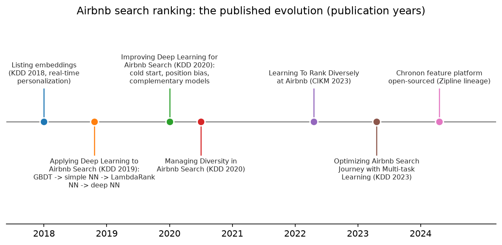
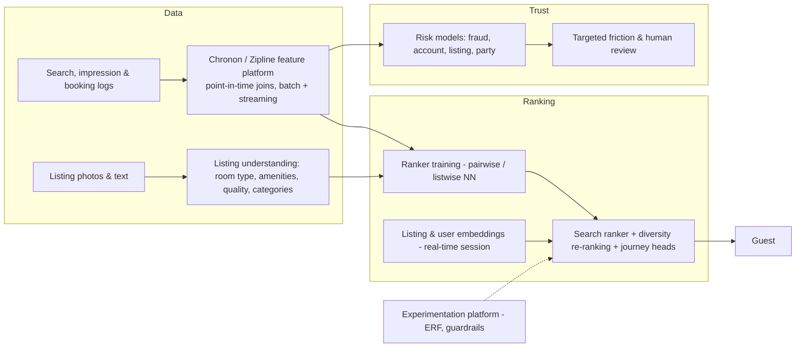

# Airbnb (search ranking journey, Zipline/Chronon, experimentation, trust & safety, listing photo understanding)

> **Why this matters at staff level.** Airbnb has published the most honest multi-year account of applying deep learning to a search-ranking problem (including what failed) and it built the feature platform (Zipline, now open-sourced as Chronon) that other companies copied. Interviewers for search, trust and platform roles expect you to know that journey, to reason about two-sided marketplace ranking (guest and host), and to connect listing photos and text to ranking, categories and trust. Strong signal is telling the story *with the trade-offs* and knowing which lessons transfer.

!!! warning "Sources in this chapter"
    Claims are tied to public Airbnb papers and Airbnb Tech Blog posts, cited by exact title, venue and year in [Sources](#sources). URLs are omitted where they could not be verified in the build environment (STYLE.md §4). Anything not in a public source is marked **inference**.

## 1. The business in one paragraph

Airbnb is a two-sided marketplace for stays and experiences: guests search with dates, location and guests; hosts list homes with photos, text, amenities and prices. Revenue is a service fee on bookings, so the defining ML problem is search ranking that maximises bookings while respecting host acceptance, quality, diversity and long-term trust; behind it sit listing understanding (photos, amenities, categories), pricing guidance, trust and safety (fraud, fake listings, parties, payment risk), customer-support ML, and the experimentation and feature platforms that let a company of Airbnb's size iterate safely.

{ width="720" }

*Figure: the published evolution of Airbnb search ranking, by publication year, from listing embeddings and the first neural rankers (2018–2019), through the second-generation deep-learning paper and diversity work (2020), to diverse and journey-aware ranking (2022–2023) and the open-sourcing of the Chronon feature platform (2024).*

## 2. The ML problems that define the company

| Problem | Why it is hard | Public evidence |
|---|---|---|
| Search ranking | Two-sided objective, sparse bookings, position bias, cold-start listings, per-query diversity; a booking is a rare and expensive label | "Applying Deep Learning to Airbnb Search" (KDD 2019); "Improving Deep Learning for Airbnb Search" (KDD 2020); "Optimizing Airbnb Search Journey with Multi-task Learning" (KDD 2023) |
| Personalisation with embeddings | Real-time session context; listings are unique (no repeated item like a song) | "Real-time Personalization using Embeddings for Search Ranking at Airbnb" (KDD 2018) |
| Diversity | Top results collapse to similar listings; guests want a spread of price and type | "Managing Diversity in Airbnb Search" (KDD 2020); "Learning To Rank Diversely At Airbnb" (CIKM 2023) |
| Feature platform | Point-in-time correct features for training and consistent online features | "Zipline: Airbnb's Machine Learning Data Management Platform" (Strata 2018); "Chronon, Airbnb's ML Feature Platform, Is Now Open Source" (Airbnb Tech Blog, 2024) |
| Experimentation | Bookings are rare and delayed; guardrails for hosts | "Experiments at Airbnb" (2014); Airbnb posts on the Experiment Reporting Framework (2014) and on scaling it (2017) |
| Trust and safety | Payment fraud, account takeovers, fake listings, parties; targeted friction instead of blanket blocking | "Architecting a Machine Learning System for Risk" (2014); "Fighting Financial Fraud with Targeted Friction" (2018); Airbnb newsroom on anti-party technology (2022) |
| Listing photo understanding | Room classification, amenity detection, photo quality; hosts upload unstructured photos | "Categorizing Listing Photos at Airbnb" (2018); "Amenity Detection and Beyond: New Frontiers of Computer Vision at Airbnb" (2019); "WIDeText: A Multimodal Deep Learning Framework" (2020) |
| Categories | Browsing by category ("Amazing pools") requires ML plus human review | "Building Airbnb Categories with ML and Human-in-the-Loop" (2022) |

## 3. The stack as publicly described

*What is public:* Zipline/Chronon as the feature platform with backfills and point-in-time correctness (2018 talk; 2024 open-source post); neural rankers trained pairwise on booked vs not-booked listings with the architecture evolution in the 2019 and 2020 papers; listing embeddings trained on click sessions for real-time personalisation (KDD 2018); diversity re-ranking (2020, 2023); multi-task journey heads (2023); risk models with targeted friction (2014, 2018); photo classification, amenity detection and multimodal listing models (2018–2020); categories built with ML plus human review (2023). *Inference:* the current production ranker architecture beyond the latest paper, and how listing-understanding outputs enter the ranker as features, are not fully published.

## 4. Deep dives

### 4.1 Applying deep learning to search: what worked, what failed (KDD 2019)

**The problem.** Airbnb's ranker was a gradient-boosted decision tree ensemble on hand-engineered features; after years of feature work, gains had flattened. Moving to neural networks was the obvious step, and the paper is the story of why the obvious step was hard.

**The approach.** The paper walks through the sequence: a simple single-hidden-layer NN on the same features (neutral online), then a LambdaRank NN using pairwise booked-vs-not-booked loss (gains), then a "decision tree / factorisation machine NN" combining GBDT and FM outputs as features, and finally a deep NN trained on much more data with expanded features, which delivered the improvements. Failed ideas, reported explicitly: using listing IDs as features (overfit, because listings can only be booked so many times), multi-task learning of bookings and long views (views did not transfer), and others. Feature engineering lessons: normalise features to well-behaved distributions (log transforms; the paper's "spread" discussion), position-bias handling in training data, and the importance of feature *distribution* checks. The evaluation discussion contrasts NDCG offline against booking gains online and emphasises hyperparameter and initialisation details.

**Math link.** Pairwise loss for booked $b$ vs not-booked $n$: $\ell = \log(1 + e^{-(s_b - s_n)})$, logistic on the score difference; see [search ranking design](../part17-ml-system-design/02-search-ranking.md) and [trees & ensembles](../part02-classical/03-trees-and-ensembles.md) for the GBDT baseline.

**The trade-off.** The team chose incremental replacement with strict online validation over a big-bang rewrite; the alternative (a deep model from day one) would have produced the same failures without the diagnosis.

**Outcome.** The paper reports the deep NN beating GBDT on bookings; the value for an interview is the *diagnostic method* (distribution checks, ID overfitting, why multi-task failed then).

!!! tip "How to say it in the interview"
    "If I were replacing a tuned gradient-boosted ranker with a neural one, I'd follow the sequence in Airbnb's KDD 2019 paper on applying deep learning to search: start with a simple network on the same features to establish parity, move to a pairwise LambdaRank-style loss on booked-versus-not-booked pairs, and only then scale the network and the data. That paper's reported failures drive two of my decisions: I wouldn't use raw listing IDs as features, because each listing is booked only a limited number of times and the ID embedding overfit, and I wouldn't assume multi-task learning helps by default, because their booking-plus-views multitask attempt did not transfer. I'd reject a big-bang rewrite in favour of incremental replacement with online validation at each step. The trade-off is time, but every step produces a diagnosis. Evaluation: NDCG offline as a filter, then bookings in an A/B, since the paper is explicit that offline NDCG and online bookings did not always agree."

### 4.2 Improving deep learning for search (KDD 2020): cold start, position bias, complementary models

**The problem.** With the deep ranker in place, the next gains came from problems the first paper left open: new listings with no history, position bias in logged data, and the fact that a single big model was not the best use of capacity.

**The approach.** The 2020 paper describes (a) a treatment for cold-start listings that predicts engagement features for new listings from similar listings so the ranker does not penalise missing history; (b) modelling position bias by including position as a training feature and dropping it at serving, with dropout on the position feature to limit dependence; (c) complementary models trained to cover where the main model is weak, combined at serving; and (d) reasoning about hyper-parameter and architecture sweeps against the booking objective. It also reports what did *not* work, such as some "learning to rank with more elaborate losses" attempts.

**Math link.** Position-as-feature debiasing assumes $P(\text{book} \mid \text{listing}, \text{pos}) = f(\text{listing}) \cdot g(\text{pos})$ approximately separable in logit space; see [evaluation](../part13-retrieval-eval-reliability/02-evaluation.md).

!!! tip "How to say it in the interview"
    "For the second generation of a search ranker I'd address three issues Airbnb's KDD 2020 paper identified. First, cold start: impute engagement features for new listings from similar listings so the ranker doesn't punish the absence of history, which the paper reports improved new-listing bookings. Second, position bias: include position as a feature during training with dropout on it, and set it to a constant at serving, so the model learns relevance separately from placement. Third, complementary models that specialise where the main model is weak, combined at serving. I'd reject inverse-propensity weighting as the first tool because it needs a position-click model that is itself biased; position-as-feature is cheaper and Airbnb reported it worked. The trade-off is that the separability assumption is approximate, so I'd validate it with a small randomised-position experiment. Evaluation: new-listing booking share and overall bookings in A/B."

### 4.3 Listing embeddings for real-time personalisation (KDD 2018)

**The problem.** Personalise search within a session: a guest who clicked three modern lofts in Paris should see more like them now, not after a nightly job.

**The approach.** Train listing embeddings word2vec-style on click sessions (a session is a "sentence" of listings), with modifications: the booked listing is treated as a *global context* so every listing in the session is pulled toward what was eventually booked, negatives are sampled from the same market to make the geometry meaningful locally, and cold-start listings get embeddings from nearby similar listings. Separately, user-type and listing-type embeddings are trained on booking sessions for long-term personalisation across sparse booking histories. Similarity features computed from these embeddings in real time became ranking features and a similar-listings recommender.

**Math link.** Skip-gram with negative sampling plus the booked-listing global-context term $\log \sigma(v_b^\top v_l)$; see [tokenization](../part05-sequence-transformers/06-tokenization.md) for the sequence-of-tokens framing and [retrieval](../part13-retrieval-eval-reliability/01-retrieval-and-rag.md).

!!! tip "How to say it in the interview"
    "For in-session personalisation I'd train listing embeddings on click sessions with the two modifications from Airbnb's KDD 2018 paper: treat the booked listing as global context so the whole session is pulled toward the booking, and sample negatives within the same market so distances mean something locally. Then I'd compute similarity between the listings the guest just clicked and each candidate as a real-time ranking feature. I'd reject collaborative filtering on listing IDs (every listing is unique and bookings are sparse) which is why the paper also builds user-type and listing-type embeddings for the long-term signal. The trade-off is that embeddings drift with the market, so retrain on a schedule. Evaluation: offline ranking of the eventual booking among clicked listings, then A/B on bookings, which is how the paper validated it."

### 4.4 Diversity as a ranking objective (KDD 2020, CIKM 2023)

**The problem.** A pointwise ranker returns the top-N similar listings, but a guest comparing options wants a spread; Airbnb's whole-page perspective says the value of a listing depends on what is around it.

**The approach.** The 2020 paper describes re-ranking with a model that scores a listing conditioned on the listings above it (a listwise, context-aware second stage). The 2023 CIKM paper "Learning To Rank Diversely" derives diversity from the objective itself (it formalises the booking probability of a *set* and trains the ranker so that its top results cover distinct guest preferences) and reports booking gains and a change in the price distribution of top results.

**Math link.** Listwise context: $s_i = f(x_i, \{x_j\}_{j<i})$; see [feed ranking](../part17-ml-system-design/01-recommendation-feed-ranking.md) for slate-aware ranking.

!!! tip "How to say it in the interview"
    "I'd treat diversity as part of the ranking objective rather than a post-hoc rule, following Airbnb's CIKM 2023 paper on learning to rank diversely, which derives it from the probability that a guest books *something* on the page, and its KDD 2020 diversity paper that conditions each listing's score on the listings above it. The decision is a second-stage context-aware re-ranker, because a pointwise model cannot see the page. I'd reject maximal marginal relevance heuristics as the primary mechanism; they need a hand-tuned similarity and trade-off weight. The trade-off is serving cost for a sequential re-ranker, bounded by only re-ranking the top page. Evaluation: bookings and the spread of price and listing type in top results, which the 2023 paper reports moved."

### 4.5 Zipline and Chronon: the feature platform

**The problem.** Ranking features are aggregates over event streams (bookings in last 30 days, views last week); computing them consistently for training (point-in-time, no leakage) and serving (fresh) is the classic feature-store problem.

**The approach.** Zipline (Strata 2018) introduced declarative feature definitions with automatic backfills that produce point-in-time correct training sets and online serving of the same features; Chronon (open-sourced 2024) is the evolved system: GroupBy aggregations over batch and streaming sources, Joins that assemble training sets with precise temporal semantics, and online fetch with low latency, plus lineage. The post positions Chronon as the answer to training/serving skew and to the cost of ad hoc backfills.

!!! tip "How to say it in the interview"
    "For features I'd adopt the Chronon model Airbnb open-sourced in 2024, whose lineage is the Zipline platform they presented in 2018: declare aggregations over event sources once, let the platform backfill point-in-time correct training sets and serve the same aggregations online. The decision is declarative aggregations with temporal semantics, because the dominant bug class in ranking is leakage and skew, and the platform removes both by construction. I'd reject per-model feature pipelines. The trade-off is platform complexity and a learning curve, which the post acknowledges. Evaluation: skew incidents, backfill time and feature freshness."

### 4.6 Trust: risk models and targeted friction; listing photos

**What is public.** The 2014 post describes a risk architecture with real-time scoring and model training pipelines for fraud; the 2018 post argues for *targeted friction* (adding verification steps (e.g., micro-deposits, additional checks) only for high-risk transactions, tuned by expected loss) instead of blanket blocking, and describes the evaluation as a trade-off between fraud losses and good-user friction. Airbnb's 2022 anti-party technology post describes ML that considers signals like booking lead time and trip length to block high-risk reservations in some markets. On photos: the 2018 post trains a room-type classifier on listing photos to organise galleries; the 2019 amenity-detection post trains object detectors for amenities using a mix of in-house and open data (with detail on annotation strategy and using Detectron-style tooling); WIDeText (2020) fuses wide, deep, text and image inputs for listing classification tasks; the 2022 categories post combines ML candidate generation with human review to build browse categories.

!!! tip "How to say it in the interview"
    "For trust I'd follow the principle in Airbnb's 2018 post on targeted friction: rather than block or allow, add verification steps proportional to risk, tuned by the expected fraud loss against the cost of friction to good users. For listing understanding I'd build the pipeline Airbnb has described across 2018 to 2022: a room-type classifier to organise photos, amenity detectors trained with a deliberate annotation strategy, a multimodal model combining text, image and structured fields, and categories built from ML candidates with human review. The decision I'd defend is human review on anything guest-facing that claims a fact about a home, because a wrong 'has pool' label is a trust failure. I'd reject fully automated categorisation. Evaluation: precision of amenity labels on audits, plus booking and cancellation rates for listings whose labels changed."

## 5. Likely interview questions

!!! interview "1. Design Airbnb search ranking."
    **Sketch.** Retrieval by geography/dates/filters, pointwise neural ranker with pairwise loss, real-time embedding features, position-bias treatment, cold-start imputation, diversity re-ranking, host-side guardrails. Cross-link: [search ranking](../part17-ml-system-design/02-search-ranking.md).

    !!! tip "How to say it in the interview"
        "I'd filter by availability and geography, then rank with a neural model trained pairwise on booked-versus-not-booked listings as in Airbnb's KDD 2019 paper, add session embedding features from the KDD 2018 work, handle position bias and cold start as in the KDD 2020 paper, and re-rank for diversity following the 2020 and 2023 papers. I'd reject a single pointwise model without a page-aware stage. The trade-off is pipeline complexity, justified by the booking gains each paper reports. Evaluation: NDCG offline, bookings in A/B, with host acceptance and cancellations as guardrails."

!!! interview "2. Bookings are rare and take days to confirm. How do you run experiments?"
    **Sketch.** Long-running tests, variance reduction, guardrails, early indicators (requests, clicks) validated against bookings; Airbnb's experimentation posts. Cross-link: [experimentation](../part17-ml-system-design/11-notifications-uplift-experimentation.md).

    !!! tip "How to say it in the interview"
        "Airbnb's 2014 'Experiments at Airbnb' post explains that bookings lag searches by days and that stopping early on a noisy metric misleads, so I'd fix the duration in advance, use variance reduction, and track leading indicators that I've validated against bookings. I'd reject peeking. Evaluation: pre-registered metrics with guardrails for hosts."

!!! interview "3. Why did listing IDs as features fail, and what would you do instead?"
    **Sketch.** Sparse, capped labels per listing lead to overfitting; use content features, embeddings from sessions, and neighbourhood imputation.

    !!! tip "How to say it in the interview"
        "Airbnb's KDD 2019 paper reports that ID embeddings overfit because each listing can only be booked a limited number of times, unlike a song streamed millions of times. I'd replace IDs with content features and with session-trained listing embeddings from the KDD 2018 work, plus cold-start imputation from similar listings. The trade-off is losing listing-specific memorisation, which the data cannot support anyway. Evaluation: the train-test gap the paper used to diagnose the problem."

!!! interview "4. Implement pairwise ranking loss with booked-vs-not-booked pairs (coding)."
    **Sketch.** Score both, logistic loss on the difference, shapes $(P,)$; batch construction per search; test that swapping the pair flips the gradient.

    !!! tip "How to say it in the interview"
        "For each search I'd pair the booked listing with each non-booked impressed listing, score both with the shared network, and apply logistic loss on the score difference, the pairwise formulation Airbnb's 2019 paper used with its LambdaRank-style network. I'd test symmetry and check the gradient with finite differences."

!!! interview "5. Classify and organise a host's 40 uploaded photos."
    **Sketch.** Room-type classifier, quality scoring, duplicate detection, cover-photo selection; human override. Cross-link: [CNN architectures](../part04-vision/03-cnn-architectures.md).

    !!! tip "How to say it in the interview"
        "I'd run a room-type classifier as Airbnb described in its 2018 photo categorisation post, add a quality model and near-duplicate detection, and propose a cover photo the host can override. I'd reject forcing automatic reordering. Evaluation: classifier accuracy per room type and host acceptance rate of suggestions."

!!! interview "6. Detect amenities from photos so filters are accurate."
    **Sketch.** Object detection over an amenity taxonomy, annotation strategy, in-house plus open data, confidence-gated attribute setting, host confirmation. Cross-link: [detection](../part04-vision/04-detection.md).

    !!! tip "How to say it in the interview"
        "I'd follow Airbnb's 2019 amenity-detection post: define a taxonomy, annotate with a mix of in-house and open datasets, train detectors, and only set a listing attribute when confidence is high or the host confirms. I'd reject setting attributes silently. Evaluation: precision on audits and downstream filter accuracy."

!!! interview "7. A fraudster is booking with stolen cards. Design the response."
    **Sketch.** Risk scoring, targeted friction (verification steps) by expected loss, human review, chargeback labels, feedback loops. Cross-link: [fraud & anomaly detection](../part17-ml-system-design/04-fraud-anomaly-detection.md).

    !!! tip "How to say it in the interview"
        "I'd score risk and add verification friction proportional to expected loss, following Airbnb's 2018 targeted-friction post, rather than blocking; blocked good guests cost bookings and trust. I'd reject a single hard threshold. Evaluation: fraud loss versus friction rate on good users."

!!! interview "8. Build 'Amazing pools' as a browsable category."
    **Sketch.** ML candidate generation from photos, text and amenities, human review, quality thresholds; 2022 categories post.

    !!! tip "How to say it in the interview"
        "I'd generate candidates with multimodal listing models (photos, descriptions, amenities) and route them to human review with quality thresholds, which is the human-in-the-loop process Airbnb's 2022 categories post describes. I'd reject fully automated inclusion. Evaluation: reviewer precision and category engagement."

!!! interview "9. How do you keep training features point-in-time correct?"
    **Sketch.** Chronon-style joins with event-time semantics, backfills, lineage; testing for leakage.

    !!! tip "How to say it in the interview"
        "I'd use a platform with temporal join semantics, as Chronon provides, so each training row sees only features computed from events before the label time. I'd reject snapshot joins. Evaluation: leakage tests that inject future events and check features don't change."

!!! interview "10. Should the ranker optimise for guests or hosts?"
    **Sketch.** Both: booking probability includes host acceptance; guardrails on host outcomes; journey-aware multi-task (KDD 2023).

    !!! tip "How to say it in the interview"
        "Both, because a booking needs a host to accept; Airbnb's KDD 2023 journey paper models multiple stages of the search-to-booking funnel with multi-task heads, and I'd include host-side outcomes as guardrails. I'd reject guest-only optimisation. Evaluation: bookings with acceptance and cancellation guardrails."

!!! interview "11. Recommend similar listings when a guest's first choice is unavailable."
    **Sketch.** Listing embeddings (KDD 2018), market-local neighbours, availability filtering.

    !!! tip "How to say it in the interview"
        "I'd use the session-trained listing embeddings from Airbnb's KDD 2018 paper to find nearest neighbours within the market and filter by availability; the paper describes exactly this similar-listings application. Evaluation: click-through and booking from the carousel."

## 6. What to bring from your background

* **Listing photo understanding** is your problem: room classification, amenity detection, quality and duplicate detection, cover-photo selection; bring annotation-strategy and detection-at-scale experience, and the discipline of confidence-gated, human-reviewed attributes.
* **Document and identity verification** for hosts and guests overlaps with your OCR background; Airbnb publishes little detail, so frame it as inference grounded in the trust posts.
* **ML systems**: Chronon and the experimentation platform are where systems experience shines; know point-in-time joins and skew.

## Sources

* Haldar et al., "Applying Deep Learning To Airbnb Search", KDD 2019. [arXiv:1810.09591](https://arxiv.org/abs/1810.09591) · [ACM DL](https://dl.acm.org/doi/10.1145/3292500.3330658) · [Airbnb Tech Blog version](https://medium.com/airbnb-engineering/applying-deep-learning-to-airbnb-search-7ebd7230891f)
* Haldar et al., "Improving Deep Learning for Airbnb Search", KDD 2020. [arXiv:2002.05515](https://arxiv.org/abs/2002.05515)
* Grbovic & Cheng, "Real-time Personalization using Embeddings for Search Ranking at Airbnb", KDD 2018. [Airbnb Tech Blog version](https://medium.com/airbnb-engineering/listing-embeddings-for-similar-listing-recommendations-and-real-time-personalization-in-search-601172f7603e)
* Abdool et al., "Managing Diversity in Airbnb Search", KDD 2020. [arXiv:2004.02621](https://arxiv.org/abs/2004.02621) · [ACM DL](https://dl.acm.org/doi/10.1145/3394486.3403345)
* Haldar et al., "Learning To Rank Diversely At Airbnb", CIKM 2023. [arXiv:2210.07774](https://arxiv.org/abs/2210.07774) · [ACM DL](https://dl.acm.org/doi/10.1145/3583780.3614692) · [Airbnb Tech Blog version](https://medium.com/airbnb-engineering/learning-to-rank-diversely-add6b1929621)
* Tan et al., "Optimizing Airbnb Search Journey with Multi-task Learning", KDD 2023. [arXiv:2305.18431](https://arxiv.org/abs/2305.18431) · [ACM DL](https://dl.acm.org/doi/10.1145/3580305.3599881)
* Simha & Zanoyan, "Zipline: Airbnb's Machine Learning Data Management Platform", Strata Data Conference 2018 ([conference listing](https://conferences.oreilly.com/strata/strata-ny-2018/public/schedule/detail/68114.html), [Databricks session](https://www.databricks.com/session/zipline-airbnbs-machine-learning-data-management-platform)); Zanoyan, "Chronon, Airbnb's ML Feature Platform, Is Now Open Source", Airbnb Tech Blog, April 2024 ([medium.com/airbnb-engineering](https://medium.com/airbnb-engineering/chronon-airbnbs-ml-feature-platform-is-now-open-source-d9c4dba859e8), project at [chronon.ai](https://chronon.ai/)).
* Airbnb Tech Blog, "Experiments at Airbnb", 2014 ([medium.com/airbnb-engineering](https://medium.com/airbnb-engineering/experiments-at-airbnb-e2db3abf39e7)); Moss, "Experiment Reporting Framework", 2014 ([medium.com/airbnb-engineering](https://medium.com/airbnb-engineering/experiment-reporting-framework-4e3fcd29e6c0)); Parks, "Scaling Airbnb's Experimentation Platform", 2017 ([medium.com/airbnb-engineering](https://medium.com/airbnb-engineering/https-medium-com-jonathan-parks-scaling-erf-23fd17c91166)); Pettingill, "4 Principles for Making Experimentation Count", 2017 ([medium.com/airbnb-engineering](https://medium.com/airbnb-engineering/4-principles-for-making-experimentation-count-7a5f1a5268a)).
* Airbnb Tech Blog, "Architecting a Machine Learning System for Risk", 2014 ([medium.com/airbnb-engineering](https://medium.com/airbnb-engineering/architecting-a-machine-learning-system-for-risk-941abbba5a60)); Press, "Fighting Financial Fraud with Targeted Friction", 2018 ([medium.com/airbnb-engineering](https://medium.com/airbnb-engineering/fighting-financial-fraud-with-targeted-friction-82d950d8900e)); Airbnb Newsroom, "New anti-party technology in the US and Canada", August 2022 ([news.airbnb.com](https://news.airbnb.com/airbnb-introduces-new-anti-party-technology-in-us-and-canada)).
* Airbnb Tech Blog on listing photo understanding: "Categorizing Listing Photos at Airbnb", 2018 (cited by title; the post's URL was not confirmed in search results); Yao, "Amenity Detection and Beyond, New Frontiers of Computer Vision at Airbnb", 2019 ([medium.com/airbnb-engineering](https://medium.com/airbnb-engineering/amenity-detection-and-beyond-new-frontiers-of-computer-vision-at-airbnb-144a4441b72e)); Zhang, "WIDeText: A Multimodal Deep Learning Framework", 2020 ([medium.com/airbnb-engineering](https://medium.com/airbnb-engineering/widetext-a-multimodal-deep-learning-framework-31ce2565880c)); Cao, "When a Picture Is Worth More Than Words", 2022 ([medium.com/airbnb-engineering](https://medium.com/airbnb-engineering/when-a-picture-is-worth-more-than-words-17718860dcc2)); Grbovic, "Building Airbnb Categories with ML and Human-in-the-Loop", 2023 ([airbnb.tech](https://airbnb.tech/ai-ml/building-airbnb-categories-with-ml-and-human-in-the-loop/)).
