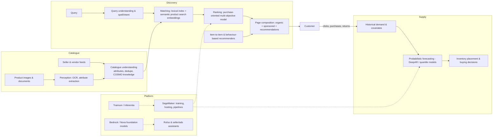

# Amazon (product search, recommendations, Ads, Alexa, Textract/Rekognition/Go, forecasting, SageMaker & Bedrock)

> **Why this matters at staff level.** Amazon is not one ML company but several: a retail search-and-recommendation business, an advertising business, a supply chain that runs on probabilistic forecasts, a devices business (Alexa, Echo, Go), and AWS, which sells the ML platform itself. Interviews are organised by Leadership Principles but graded on whether you can take a concrete Amazon problem ("a customer types *wireless earbuds under $50*", "we must forecast demand for two million SKUs", "extract totals from ten million invoices") and design a system with explicit trade-offs, a working-backwards framing, and a measurable customer outcome.

!!! warning "Sources in this chapter"
    Claims are tied to public Amazon/AWS papers, Amazon Science posts and product documentation, cited by exact title, venue and year in [Sources](#sources). URLs are omitted where they could not be verified in the build environment (STYLE.md §4); search the exact title. Anything not in a public source is marked **inference**.

## 1. The business in one paragraph

Amazon's retail business converts intent into purchases: a customer arrives with a query or a browse intent, search retrieves and ranks from a catalogue of hundreds of millions of products, recommendations fill the rest of the page, sponsored products insert paid placements into the same surfaces, and the supply chain must already have placed the inventory near the customer, which requires forecasting demand for every product in every region weeks ahead. Devices add speech and vision (Alexa's wake word, ASR and NLU; Amazon Go's "Just Walk Out" sensor fusion; Rekognition and Textract as externalised perception services), and AWS turns all of this infrastructure into a product line: SageMaker for training and deployment, Bedrock for hosted foundation models, Trainium and Inferentia for silicon, and Amazon's own Nova model family. The unifying interview theme is *cost per customer outcome at catalogue scale*.

## 2. The ML problems that define the company

| Problem | Why it is hard | Public evidence |
|---|---|---|
| Product search | Queries are short and ambiguous; the catalogue is enormous and constantly changing; relevance must trade off against purchase probability, price, delivery speed and seller quality | "Semantic Product Search" (KDD 2019); "Amazon Search: The Joy of Ranking Products" (SIGIR 2016 industry talk) |
| Recommendations | Hundreds of millions of items, extreme sparsity, purchases (not clicks) as the valuable label, repeat-purchase dynamics | Linden, Smith & York, "Amazon.com Recommendations: Item-to-Item Collaborative Filtering" (IEEE Internet Computing 2003); Smith & Linden, "Two Decades of Recommender Systems at Amazon.com" (IEEE Internet Computing 2017) |
| Product knowledge | Catalogue metadata is noisy and seller-supplied; "commonsense" relations (what goes with what, what a query implies) are missing | "COSMO: A Large-Scale E-commerce Common Sense Knowledge Generation and Serving System at Amazon" (SIGMOD 2024) |
| Demand forecasting | Millions of intermittent, seasonal, cold-start series; the decision needs a *distribution*, not a point estimate | "DeepAR: Probabilistic Forecasting with Autoregressive Recurrent Networks" (International Journal of Forecasting 2020); "A Multi-Horizon Quantile Recurrent Forecaster" (2017); "GluonTS" (JMLR 2020) |
| Advertising | Sponsored placements compete with organic results for the same slot; auction pricing needs calibrated probabilities | Amazon Ads product documentation; auction and ranking details largely unpublished (**inference**) |
| Speech and assistants | Wake word on-device, large-vocabulary ASR, NLU across thousands of skills, now LLM-based assistants | Alexa Science publications; "AlexaTM 20B: Few-Shot Learning Using a Large-Scale Multilingual Seq2Seq Model" (2022); Amazon's Rufus shopping assistant (2024) |
| Perception as a service | OCR and document extraction across arbitrary layouts; face and object recognition with fairness and policy constraints | Amazon Textract documentation (forms, tables, queries, Analyze Lending); Amazon Rekognition documentation; Amazon Go "Just Walk Out" (Amazon Science posts) |
| ML platform and silicon | Externalising training/serving as products; cost per token and per inference | Amazon SageMaker documentation; "Elastic Machine Learning Algorithms in Amazon SageMaker" (SIGMOD 2020); AWS Trainium and Inferentia documentation; Amazon Bedrock documentation; Amazon Nova model family (2024) |

## 3. The stack as publicly described

*What is public:* semantic (embedding-based) retrieval alongside lexical matching in product search (KDD 2019); item-to-item collaborative filtering as the historical recommendation backbone and its evolution (2003, 2017 papers); COSMO as a knowledge-generation and serving system feeding search (SIGMOD 2024); probabilistic forecasting with DeepAR-style autoregressive and quantile models, productised in SageMaker and open-sourced in GluonTS; SageMaker, Bedrock, Trainium/Inferentia and Nova as AWS products; Textract and Rekognition as externalised perception APIs. *Inference:* the exact ranking objective in retail search today, the ads auction mechanics, and how catalogue perception outputs are consumed by ranking are not published in detail; the diagram shows the standard shape.

## 4. Deep dives

### 4.1 Semantic product search: embeddings next to the inverted index

**The problem.** Lexical retrieval (an inverted index over product text) fails on the queries customers actually type: synonyms ("sneakers" vs "running shoes"), implicit attributes ("gifts for a 5 year old boy"), misspellings, and queries whose matching products never use the query's words. But pure embedding retrieval loses exact-match precision on brands, model numbers and sizes, where being wrong is worse than returning nothing.

**The approach.** Amazon's KDD 2019 "Semantic Product Search" paper describes a two-tower neural model that embeds queries and products into a shared space, trained on customer engagement (purchases, clicks, impressions) with a loss that distinguishes *purchased*, *clicked* and *impressed-but-not-engaged* products instead of treating all non-purchases as equal negatives. The paper reports several practical findings: a hinge-style loss with separate margins for the different negative types, character trigram-based tokenisation to handle misspellings and unseen tokens, and average pooling as a strong, cheap aggregation. The embeddings are indexed for approximate nearest-neighbour retrieval and the results are *merged* with the lexical index instead of replacing it, with a downstream ranker scoring the union.

**Math link.** Two-tower scoring $s(q, p) = \cos(f_\theta(q), g_\phi(p))$ with a margin loss over graded negatives; see [CLIP & contrastive learning](../part08-multimodal/03-clip-contrastive.md) for the shared-space geometry, [retrieval & RAG](../part13-retrieval-eval-reliability/01-retrieval-and-rag.md) for ANN, and [search ranking design](../part17-ml-system-design/02-search-ranking.md) for the hybrid architecture.

**The trade-off they chose.** Hybrid retrieval costs a second index and a merge step, but keeps lexical precision on exact identifiers while gaining recall on vague queries. The rejected alternative (replacing the inverted index with embeddings) would have improved tail recall at the cost of head-query precision, which on a commerce site is measured directly in lost purchases.

**Outcome.** The paper reports recall improvements over lexical baselines on Amazon search data; quote the paper's tables, not remembered numbers.

!!! tip "How to say it in the interview"
    "For product search I'd add semantic retrieval alongside the inverted index instead of replacing it, which is exactly the architecture Amazon describes in its KDD 2019 'Semantic Product Search' paper. My reasoning is asymmetric failure: lexical retrieval is precise on brands and model numbers but silent on 'gift for a five year old', and embedding retrieval is the opposite, so I'd run both and let a downstream ranker score the union. Two specific decisions I'd take from that paper: train with graded negatives (purchased, clicked, and impressed-but-ignored are three different signals, and collapsing them into one negative class throws away the strongest supervision e-commerce offers) and use character trigrams in the tokenizer so misspellings and unseen brand names still embed sensibly. I'd reject a pure dense retriever because a customer searching a specific part number who gets 'similar' parts has been actively harmed. The trade-off is a second index to build, refresh and merge, which costs infrastructure but is bounded. For evaluation I'd measure recall of eventually-purchased products at fixed candidate-set size offline, then run an A/B on purchases and on the rate of searches that end with no click, because that null-result rate is where semantic retrieval should show up first."

### 4.2 Item-to-item collaborative filtering: the algorithm that scaled by moving the work offline

**The problem.** In 2003 Amazon needed recommendations for tens of millions of customers and millions of items, in under a second, on a page that was already latency-constrained. User-based collaborative filtering (find similar customers, recommend what they bought) scales with the number of *customers*, which is the worst possible scaling for Amazon.

**The approach.** Linden, Smith and York inverted the computation: precompute, offline, an item-to-item similarity table (for each product, the products most often co-purchased, with cosine similarity over the customer vectors, normalised to damp popular items), then at request time look up the items similar to the things in the customer's history and aggregate. Online cost becomes independent of catalogue and customer-base size; it depends only on the length of the customer's history. The 2017 retrospective, "Two Decades of Recommender Systems at Amazon.com", explains what the original paper under-emphasised: that the algorithm's real advantage was *quality per unit of latency* on sparse data, that co-purchase similarity needs careful normalisation to avoid recommending batteries and bestsellers to everyone, and that the later systems added temporal dynamics (what you bought *recently*, and in what order) and learned the aggregation instead of averaging similarities.

**Math link.** Cosine similarity between item columns of the sparse customer-item matrix, $\text{sim}(i,j) = \frac{\langle c_i, c_j\rangle}{\|c_i\|\|c_j\|}$; see [KNN & K-means](../part02-classical/04-knn-kmeans.md) and [feed ranking](../part17-ml-system-design/01-recommendation-feed-ranking.md).

**The trade-off.** Precomputation buys latency independence at the cost of freshness: the similarity table is as old as its last build, so new products and shifting trends lag. The 2017 paper is candid that this became the main limitation and that subsequent systems moved toward learned models with behavioural sequences.

!!! tip "How to say it in the interview"
    "I'd use this as a lesson in choosing what to precompute. Amazon's 2003 item-to-item collaborative filtering paper moved the expensive similarity computation offline so that online cost scaled with the length of a single customer's history, independent of the size of the customer base, which is why it served an enormous catalogue in milliseconds. The design decision I'd carry forward is to normalise the co-occurrence similarity aggressively, because without it the recommender degenerates into recommending bestsellers and consumables to everyone. The 2017 retrospective 'Two Decades of Recommender Systems at Amazon.com' names exactly that problem. I'd reject user-based collaborative filtering for the scaling reason the original paper gives. Where I'd depart from the 2003 design is freshness and sequence: the 2017 paper says the later systems added temporal dynamics, so I'd learn the aggregation over a customer's recent behaviour instead of averaging static similarities. Evaluation is purchases per session from the recommendation slots, with a repeat-purchase-aware holdout so the model gets no credit for consumables the customer would have re-ordered anyway."

### 4.3 Probabilistic forecasting: DeepAR and why the distribution is the product

**The problem.** Amazon must decide how many units of each product to hold in each fulfilment centre. That decision is an inventory optimisation with asymmetric costs (a stockout loses a sale and a customer's trust, excess inventory costs capital and space) so the input it needs is not "expected demand" but the *distribution* of demand, especially its upper quantiles. The series are also brutal: millions of them, most intermittent (many zero days), heavily seasonal, with new products having no history at all.

**The approach.** DeepAR ([arXiv:1704.04110](https://arxiv.org/abs/1704.04110)) trains a *single global* autoregressive recurrent model across all time series instead of one model per series. Each series is encoded by an RNN conditioned on its own history and covariates plus a learned embedding of the series itself; the model outputs the parameters of a likelihood (Gaussian for real-valued, negative binomial for count data), and forecasts are produced by ancestral sampling (roll the RNN forward, sample, feed back) yielding sample paths from which any quantile can be read. Scale handling matters: DeepAR divides each series by a scale factor and weights the sampling of training windows by scale, because the magnitudes span orders of magnitude. The related quantile approach (the Multi-Horizon Quantile Recurrent Forecaster) skips the likelihood and directly predicts multiple quantiles at multiple horizons with the pinball loss, which avoids specifying a distribution family. GluonTS packages these models; SageMaker exposed DeepAR as a built-in algorithm.

**Math link.** Negative binomial likelihood for count data with mean $\mu$ and shape $\alpha$: $\text{Var} = \mu + \alpha\mu^2$, which lets variance grow with demand, the property intermittent retail demand needs. Pinball loss $\ell_\tau(y,\hat y) = \max(\tau(y-\hat y), (\tau-1)(y-\hat y))$; see [forecasting & ETA design](../part17-ml-system-design/10-forecasting-eta.md), [probability](../part01-math/03-probability.md), and [RNN, LSTM, GRU](../part05-sequence-transformers/01-rnn-lstm-gru.md).

**The trade-off.** A global model shares statistical strength across series (which is what makes cold-start and intermittent series tractable) but assumes the series are related enough for sharing to help, and it requires scale normalisation to keep the loss from being dominated by high-volume products. The alternative, classical per-series models (ARIMA, exponential smoothing), needs no sharing and is interpretable, but cannot exploit a new product's similarity to existing ones and cannot condition on rich covariates.

!!! tip "How to say it in the interview"
    "For demand forecasting I'd train one global model across all series instead of a model per SKU, which is the core argument of Amazon's DeepAR paper: cross-series learning is what makes cold-start and intermittent products forecastable at all, because a new product has no history but plenty of analogues. I'd predict a distribution, not a point (DeepAR does this with a likelihood head and ancestral sampling, and the quantile-forecaster line of work does it directly with the pinball loss) because the downstream inventory decision is asymmetric, so what the buyer actually needs is the ninetieth percentile, not the mean. I'd reject per-series ARIMA as the primary system for exactly the cold-start reason, while keeping a classical baseline because it is a useful sanity check on the long-established high-volume series. The trade-off DeepAR forces on you is scale: demand spans orders of magnitude, and the paper handles that by dividing each series by a scale factor and weighting training-window sampling by scale, which I'd implement rather than rediscover. For evaluation I'd use weighted quantile loss over a rolling backtest, and I'd check calibration explicitly. If the ninetieth percentile is exceeded far more or less than ten percent of the time, the inventory policy built on it is wrong regardless of the point accuracy."

### 4.4 Textract and document understanding as a product

**The problem.** Enterprises have documents (invoices, receipts, lending packets, identity documents, forms) and want structured fields out of them. Unlike a research OCR benchmark, a product must handle arbitrary layouts it has never seen, tables that span pages, checkboxes, handwriting, and scans of scans, and it must report confidence so customers can route low-confidence extractions to humans.

**What is public.** Amazon Textract's documentation describes distinct capabilities layered on a common OCR base: raw text detection with geometry; *forms* extraction returning key-value pairs; *tables* extraction returning cell structure; *Queries*, where the customer asks a natural-language question of the document ("what is the invoice total?") and receives the answer with the supporting text location; *signatures* detection; and specialised analyzers (expense/invoice, identity documents, and Analyze Lending for mortgage packets). Every returned block carries a confidence score and a bounding geometry. The model architectures are not published; treat the capability list as the public evidence and any architecture description as **inference**.

**How to reason about it.** The interesting design question, and the one interviewers ask, is the split between the general OCR engine and the specialised parsers: a single end-to-end model per document type does not scale to the space of enterprise documents, but a purely generic OCR forces every customer to write their own field logic. Textract's public shape (generic OCR plus layout primitives (forms, tables) plus a query interface plus a small number of high-value verticals) is a sensible resolution, and it is the shape you should be able to defend. See [OCR & document understanding](../part17-ml-system-design/09-ocr-document-understanding.md).

!!! tip "How to say it in the interview"
    "I'd design document extraction in three layers, which is the shape Amazon Textract exposes publicly. The base layer is generic OCR that returns text with geometry and confidence for every word and line. The second layer is layout structure (key-value pairs for forms, cell topology for tables, checkbox and signature detection) because these primitives generalise across almost all business documents and save every customer from writing geometry heuristics. The third layer is a query interface, where the customer asks 'what is the total?' and gets an answer grounded in a specific text location, which Textract offers as Queries; that is what makes the product usable on layouts nobody trained on. Only above that would I build vertical parsers, and only where the volume justifies it, which is how Textract's expense, identity-document and lending analyzers are positioned. I'd reject a single end-to-end document-to-JSON model as the primary offering, because the space of enterprise documents is unbounded and an unexplained extraction is unusable in a regulated workflow, and the grounding to a bounding box is what makes it auditable. The trade-off is that layers cost latency and that the generic layer will underperform a bespoke model on any single document type. Evaluation is field-level precision and recall per document family with calibrated confidence, and the operational metric I actually care about is the share of documents that clear the confidence threshold without human review at a fixed field accuracy."

### 4.5 Amazon Go: sensor fusion where the label is the receipt

**The problem.** "Just Walk Out" removes the checkout: the store must determine, from sensors alone, which items each shopper takes and keeps. Errors are directly monetary and directly visible to the customer, and the environment is adversarial-adjacent (items put back in the wrong place, crowded aisles, shoppers handing items to each other).

**What is public.** Amazon describes Just Walk Out as a fusion of overhead cameras, computer vision (detection and tracking of people and items), and weight sensors on shelves, with deep learning models associating item take/return events with shopper identities, and it has published Amazon Science posts on the vision and sensor-fusion challenges, including work on tracking people through occlusion and on synthetic data for training. The technology has been externalised to third-party retailers. Specific model architectures and accuracy rates are not public, do not quote error rates.

**Math link.** [Tracking](../part11-perception-autonomy/04-tracking.md), [sensor fusion](../part11-perception-autonomy/03-sensor-fusion.md), [detection](../part04-vision/04-detection.md).

!!! tip "How to say it in the interview"
    "For a checkout-free store I'd treat it as multi-object tracking and association, with a second sensing modality as the arbiter. That is how Amazon publicly describes Just Walk Out: overhead cameras plus weight sensing on the shelves. The decision I'd defend is the redundancy. Vision alone has to resolve occlusion, identical-looking products, and shoppers handing items to each other. A shelf weight change gives an independent signal of how many units left a location, even when no camera can see which hand took them. I'd reject RFID on every item. It solves identification, and it puts a cost on every unit of inventory in the store. The price of the sensor approach is calibration: weight sensors drift and misplaced items poison the shelf model, so I'd run a per-shelf reconciliation process. For evaluation the metric that counts is receipt accuracy per trip, and I'd track the share of trips that need human review, because a store that is accurate only because people check the baskets has not solved the problem."

### 4.6 The platform and the model layer: SageMaker, Bedrock, Nova, Trainium

**What is public.** SageMaker provides managed training, hosted endpoints, batch transform, pipelines and a feature store, with built-in algorithms (DeepAR among them) and a documented distributed-training story; the SIGMOD 2020 paper on elastic ML algorithms in SageMaker describes designing built-in algorithms for streaming, out-of-core, distributed operation so that a customer's data size does not dictate the algorithm. Bedrock hosts foundation models from several providers plus Amazon's own Nova family behind one API, with retrieval-augmented generation, agents, guardrails and evaluation features documented. Trainium and Inferentia are AWS's training and inference accelerators, positioned on cost per unit of work; the Neuron SDK compiles models to them.

**Why it matters in interviews.** For AWS roles the question is usually "design a multi-tenant ML service", where the real content is isolation, cost attribution, cold-start of endpoints, and the fact that customers' models are opaque to you. See [inference systems](../part14-systems/03-inference-systems.md) and [ML platform design](../part17-ml-system-design/12-ml-platform-feature-store-monitoring.md).

!!! tip "How to say it in the interview"
    "If I were designing a hosted ML service I'd start from the constraint that the SIGMOD 2020 SageMaker paper makes explicit: the algorithms must be streaming and out-of-core, because a managed service cannot assume the customer's data fits in memory or that they will choose the right instance. That pushes toward single-pass, distributed-by-default implementations even when a batch algorithm would be more accurate on small data. For the model layer, Bedrock's public shape (many models behind one API with guardrails, retrieval and evaluation as first-class features) is the right answer for enterprises, because the hard part of shipping an LLM feature is not the model, it is the guardrails and the eval harness. I'd reject exposing raw model endpoints only. On silicon, Trainium and Inferentia are a cost-per-inference argument, so I'd choose them when the workload is stable enough to justify a compile step through the Neuron SDK and stay on GPUs when the model architecture is still moving. Evaluation for the platform is customer-facing: time from data to a deployed endpoint, p99 endpoint latency, and cost per thousand inferences."

## 5. Likely interview questions

!!! interview "1. Design Amazon product search for the query 'wireless earbuds under $50'."
    **Sketch.** Query understanding (intent, attribute and price-constraint extraction), hybrid retrieval (lexical + semantic embeddings), filtering on hard constraints, multi-objective ranking (purchase probability, relevance, delivery speed, price, seller quality), page composition with sponsored slots. Evaluate with human relevance judgements plus purchase-based online metrics. Cross-links: [search ranking](../part17-ml-system-design/02-search-ranking.md), [retrieval](../part13-retrieval-eval-reliability/01-retrieval-and-rag.md).

    !!! tip "How to say it in the interview"
        "The first thing I'd do is separate the hard constraint from the soft intent: 'under $50' is a filter, not a ranking signal, and getting that wrong means showing a $200 product to someone who told you their budget. So my pipeline is query understanding first, then hybrid retrieval (the inverted index plus the semantic embedding retrieval described in Amazon's KDD 2019 Semantic Product Search paper) then constraint filtering, then ranking. For ranking I'd predict purchase, not click, because the 2017 'Two Decades of Recommender Systems at Amazon.com' retrospective is explicit that the valuable signal in commerce is the purchase, and clicks over-reward attractive images. I'd reject a single relevance score: delivery speed and seller quality change whether a relevant item is actually a good result. The trade-off is that a multi-objective score needs weights, which I'd tune through experiments instead of baking them in. Evaluation: offline recall of purchased items in the candidate set, human relevance ratings on the top slots, then an A/B on purchases per search with the null-result rate as a guardrail."

!!! interview "2. How do you train retrieval when you have purchases, clicks and impressions?"
    **Sketch.** Graded relevance with different margins; purchases as strongest positives, clicks as weak positives, impressed-unengaged as hard negatives, random products as easy negatives; position and presentation bias corrections.

    !!! tip "How to say it in the interview"
        "I'd treat these as graded signals instead of a binary label, which is one of the specific contributions of Amazon's KDD 2019 Semantic Product Search paper: it trains with a loss that distinguishes purchased, clicked and impressed-but-not-engaged products. The reasoning is that an impressed-but-ignored product is a *hard* negative (the system already thought it was relevant and the customer disagreed) while a random catalogue item is an easy negative that teaches almost nothing after the first epoch. I'd use both, because training only on hard negatives destabilises the embedding space. I'd reject treating every non-purchase as a negative, since that labels products the customer never saw. The trade-off is that impression-derived negatives inherit the old system's biases, so I'd mix in randomly sampled negatives and periodically check that the model has not just learned to reproduce the incumbent ranker. Evaluation is recall of the eventually purchased item at fixed candidate-set size."

!!! interview "3. Forecast demand for a product launched last week."
    **Sketch.** Global model with item embeddings and metadata covariates, cold-start via category/brand/price analogues, probabilistic output, hierarchical reconciliation to category totals, frequent re-forecasting as data arrives. Cross-link: [forecasting & ETA](../part17-ml-system-design/10-forecasting-eta.md).

    !!! tip "How to say it in the interview"
        "A one-week-old product has essentially no history, so the only way to forecast it is by borrowing from similar products, which is precisely the argument for the global model in Amazon's DeepAR paper: one model across all series, conditioned on covariates and a learned series embedding, so a new item inherits the seasonal and level patterns of its analogues through its metadata. I'd initialise from category, brand and price-band covariates and let the series embedding take over as data arrives, and I'd re-forecast daily because the posterior tightens fast in the first weeks. I'd reject a per-series model, which has literally nothing to fit. The trade-off is that a bad analogue gives a confidently wrong forecast, so I'd widen the predictive distribution for young series rather than pretend to precision. Evaluation: weighted quantile loss restricted to the new-product cohort, and calibration of the upper quantiles specifically, because the buying decision lives there."

!!! interview "4. Implement the pinball loss and explain why inventory wants quantiles (coding)."
    **Sketch.** `loss = max(tau * (y - yhat), (tau - 1) * (y - yhat))`, averaged; minimising it yields the $\tau$-quantile; newsvendor: optimal stock level is the quantile at the critical ratio $c_u/(c_u + c_o)$ of underage to total cost.

    !!! tip "How to say it in the interview"
        "The pinball loss charges $\tau$ per unit of under-prediction and $1-\tau$ per unit of over-prediction, so its minimiser is the $\tau$-quantile of the predictive distribution, three lines of code and no distributional assumption, which is why the multi-horizon quantile forecaster line of Amazon's work uses it instead of a likelihood. Inventory needs that because of the newsvendor result: the optimal stock level is the quantile at the ratio of stockout cost to the sum of stockout and holding costs, so if a stockout costs four times as much as holding a unit, I want the eightieth percentile, and a model trained on squared error doesn't produce it. I'd test the implementation by fitting a constant to skewed samples and checking the fitted value matches the empirical quantile at several taus."

!!! interview "5. Extract line items and totals from ten million supplier invoices."
    **Sketch.** Generic OCR with geometry → table and key-value structure → field normalisation and validation (arithmetic checks: line items must sum to subtotal) → confidence-gated human review → feedback loop into per-vendor templates. Cross-link: [OCR design](../part17-ml-system-design/09-ocr-document-understanding.md).

    !!! tip "How to say it in the interview"
        "I'd build it as layers over generic OCR with geometry, which is how Textract's public capability set is organised: text, then table structure, then key-value pairs, then a query interface for the fields that layout primitives don't capture. The decision I'd emphasise is validation as a first-class stage: invoices are arithmetically constrained, so line items must sum to the subtotal and tax must reconcile, and that check catches OCR errors no confidence score will. I'd reject asking a model for a JSON blob with no grounding, because when the total is wrong in an accounts-payable pipeline someone has to find out why, and a bounding box is the answer. The trade-off is that per-vendor templates are more accurate but don't generalise, so I'd learn them automatically for the heaviest vendors and keep the generic path for the tail. Evaluation: field-level precision and recall, and the straight-through-processing rate (the share of invoices needing no human touch at a fixed field accuracy) which is the number the business actually pays for."

!!! interview "6. Design the recommendations on a product detail page."
    **Sketch.** Multiple modules with different intents (substitutes: "similar items"; complements: "frequently bought together"; continuation: "customers also viewed"), each with its own candidate source and objective; avoid recommending the item just purchased; diversity and price-band spread.

    !!! tip "How to say it in the interview"
        "The detail page needs at least two different recommenders because it serves two different intents: substitutes for a customer still comparing, and complements for a customer who has decided. Co-purchase similarity in the style of Amazon's 2003 item-to-item paper gives complements naturally, but it needs the normalisation that paper describes or it collapses into recommending batteries and bestsellers. For substitutes I'd use catalogue and embedding similarity rather than co-purchase, since two products that are perfect substitutes are rarely bought together. I'd reject a single blended module: the 2017 retrospective's point about purchase-aware recommendations applies here, recommending a second washing machine to someone who just bought one is the canonical failure. Evaluation is attributed purchases per module with a post-purchase suppression rule, plus return rate as a guardrail, because a recommendation that drives a return is worse than no recommendation."

!!! interview "7. A seller uploads a product with wrong or missing attributes. Fix the catalogue."
    **Sketch.** Multimodal attribute extraction from title, description and images; OCR of packaging text; cross-listing consistency; confidence-gated auto-correction with seller notification; knowledge-graph relations (COSMO) for implied attributes. Cross-link: [OCR design](../part17-ml-system-design/09-ocr-document-understanding.md), [VLM architecture](../part08-multimodal/04-vlm-architecture.md).

    !!! tip "How to say it in the interview"
        "I'd extract attributes from every modality the seller gave me, title and bullet text, structured fields, and the product images, where packaging text is often the only place the true specification appears, which is where OCR earns its place. Then I'd reconcile against other listings of the same product and against category-level priors. Amazon's SIGMOD 2024 COSMO paper is relevant here: it generates and serves commonsense e-commerce knowledge, which is exactly what lets you infer that a product described as a 'yoga mat' implies attributes the seller never entered. My decision is confidence-gated auto-correction with seller notification rather than silent edits, because a wrong auto-correction on a seller's listing is a trust and liability problem. The trade-off is that the review queue grows with catalogue size, so the threshold has to be tuned against reviewer capacity. Evaluation: attribute precision on audited samples and downstream filter and search accuracy for the corrected attributes."

!!! interview "8. Design the wake-word system for an Echo device."
    **Sketch.** Always-on small on-device model at low power, cascaded with a larger on-device verifier, then cloud verification of the full utterance; false-accept vs false-reject trade-off; personalisation to the household. Cross-link: [inference systems](../part14-systems/03-inference-systems.md).

    !!! tip "How to say it in the interview"
        "I'd build a cascade, because the power budget for an always-listening model is tiny and the accuracy budget is not. A very small model runs continuously on-device at low power with a threshold tuned for high recall, a larger on-device model re-scores its triggers, and the cloud verifies the full utterance before anything is acted on, Amazon's published Alexa science work describes exactly this multi-stage structure for wake-word detection. The decision is to place the strict precision gate last, because a false reject means the device ignored its owner, which is far more visible than a fraction of a second of wasted compute. I'd reject a single medium-sized model: it is simultaneously too expensive to run continuously and too weak to be the final arbiter. The trade-off is that cloud verification adds latency and requires sending audio, so the second stage must be good enough to keep false triggers rare. Evaluation: false accepts per hour of ambient audio and false rejects per thousand intentional wakes, measured separately per acoustic environment."

!!! interview "9. Build a shopping assistant that answers 'is this jacket warm enough for Chicago in January?'"
    **Sketch.** RAG over product attributes, reviews and Q&A; grounding and citation; refusal when the catalogue does not support an answer; latency and cost via a smaller model with retrieval. Cross-link: [LLM assistant with RAG](../part17-ml-system-design/08-llm-product-rag-assistant.md), [evaluation](../part13-retrieval-eval-reliability/02-evaluation.md).

    !!! tip "How to say it in the interview"
        "This is a retrieval problem wearing a generation costume: the answer lives in the product's fill weight and material, and in reviews from customers in cold climates. So I'd retrieve from attributes, reviews and community Q&A, then generate an answer that cites the specific evidence, which is the shape Amazon's Rufus shopping assistant is publicly described as having. The decision I'd defend is mandatory grounding with refusal: if the catalogue doesn't say the fill weight, the assistant should say it doesn't know rather than infer warmth from the product image, because a confident wrong answer about warmth generates a return and a lost customer. I'd reject fine-tuning product knowledge into the model weights, since the catalogue changes hourly. The trade-off is that retrieval-grounded answers are more conservative and sometimes less satisfying. Evaluation: human-rated answer accuracy against the cited evidence, hallucination rate, and downstream return rate for purchases that followed an assistant conversation."

!!! interview "10. Your ranking model improves clicks but increases returns. What do you do?"
    **Sketch.** Returns are a delayed negative label; add them to the objective with the right sign and delay handling; segment by category; check whether the model learned to promote misleading imagery or too-good-to-be-true prices.

    !!! tip "How to say it in the interview"
        "A return is a delayed, expensive negative label, and a click-optimised ranker will happily learn to promote items whose images oversell them. I'd first segment the regression by category and by seller to find where the returns concentrate, because this is usually a small set of listings rather than a broad shift. Then I'd add returns to the training objective with their proper sign and a delay-aware attribution window, which means accepting that the freshest training data has incomplete return labels. I'd reject shipping and monitoring, because returns take weeks to materialise and by then the model has trained on its own biased data. The trade-off is a slower feedback loop on the return signal, which I'd partially mitigate with early proxies like review sentiment. Evaluation: net purchases after returns, not gross purchases, as the primary metric."

!!! interview "11. Design a multi-tenant model-hosting service."
    **Sketch.** Per-tenant isolation, autoscaling with cold-start mitigation, request batching across tenants only where isolation permits, cost attribution, model versioning and shadow deployment, GPU sharing vs dedicated. Cross-link: [inference systems](../part14-systems/03-inference-systems.md).

    !!! tip "How to say it in the interview"
        "The defining constraint is that tenant models are opaque to me, so I cannot optimise inside them, I can only optimise placement, batching and scaling. I'd offer both dedicated endpoints for predictable high-volume workloads and a serverless tier that trades cold-start latency for cost, which is the shape SageMaker exposes. The SIGMOD 2020 paper on SageMaker's built-in algorithms makes the related point for training: design for streaming and out-of-core because you cannot assume the customer sized their instance correctly. I'd reject cross-tenant batching by default on isolation grounds, and enable it only within a tenant. The trade-off is utilisation: strict isolation leaves accelerators idle, which is why the serverless tier exists. Evaluation: p99 latency including cold starts, utilisation, and cost per thousand inferences."

!!! interview "12. Pick between Trainium/Inferentia and GPUs for a production workload."
    **Sketch.** Stability of the architecture, compiler support via Neuron, cost per unit work, migration effort, availability. Cross-link: [hardware, memory & roofline](../part14-systems/04-hardware-memory-roofline.md).

    !!! tip "How to say it in the interview"
        "I'd decide on architectural stability. AWS positions Trainium and Inferentia on cost per unit of work, and the Neuron SDK compiles models ahead of time, so the economics are good when the model architecture is frozen and the volume is high, and poor when researchers are changing custom kernels weekly. So: inference for a stable production model goes to Inferentia; an active research loop stays on GPUs. I'd reject a blanket migration on cost alone, because engineering time spent chasing compiler support for an unsupported operator can easily exceed the savings. The trade-off is vendor flexibility. Evaluation: cost per thousand inferences at matched p99 latency and quality, measured on the real model rather than a benchmark."

!!! interview "13. How would you evaluate a change to search ranking before an A/B?"
    **Sketch.** Offline: recall of purchased items, NDCG against human relevance judgements, counterfactual estimates with logged propensities; interleaving for sensitivity; guardrails for sponsored revenue and seller diversity.

    !!! tip "How to say it in the interview"
        "I'd use a ladder. First, offline recall of the eventually-purchased product and NDCG against human relevance judgements, which catch gross regressions cheaply. Second, an interleaving test, because ranking effects are small relative to session-level variance and interleaving is a paired comparison. Only then an A/B on purchases. I'd reject shipping on offline metrics alone (Amazon's own published experience across search and recommendations is that offline and online metrics diverge) and equally reject going straight to A/B, because the throughput of ranking experiments matters. The trade-off is that interleaving measures preference between rankers, not the absolute business effect, so it filters rather than decides."

## 6. What to bring from your background

* **OCR and document understanding map onto Amazon Textract directly.** Textract's public capability list (text with geometry, forms, tables, Queries, signatures, and vertical analyzers for expenses, identity documents and lending) is a product built out of exactly the pipeline stages you have shipped. Be ready to discuss layout modelling, table structure recovery, handwriting, multi-page documents, confidence calibration, and the straight-through-processing rate as the business metric. The same skills apply internally to catalogue ingestion: packaging text in product images is frequently the only source of the true specification.
* **Detection and perception at scale** map to Amazon Go's vision and sensor fusion, to Rekognition, and to catalogue image understanding (attribute extraction, image quality, policy violations). Emphasise throughput per image, tracking through occlusion, and evaluation on sampled audits rather than fixed benchmarks.
* **ML systems experience** is the common language for SageMaker, Bedrock and the internal serving stacks: talk about feature freshness, skew, p99 latency, cost per inference and multi-tenant isolation.
* **Working backwards.** Amazon's interview loop is behavioural as much as technical. Frame every design as a customer outcome first (the customer gets the right product, the accurate receipt, the in-stock item), then the metric, then the system, and have STAR-format stories ready that show ownership of a system end to end, including the failure you caught in production.

## Sources

**Search and recommendations**

* Nigam et al., "Semantic Product Search", KDD 2019 (arXiv 1907.00937).
* Sorokina & Cantu-Paz, "Amazon Search: The Joy of Ranking Products", SIGIR 2016 (industry track).
* Linden, Smith & York, "Amazon.com Recommendations: Item-to-Item Collaborative Filtering", IEEE Internet Computing, 2003.
* Smith & Linden, "Two Decades of Recommender Systems at Amazon.com", IEEE Internet Computing, 2017.
* Yu et al., "COSMO: A Large-Scale E-commerce Common Sense Knowledge Generation and Serving System at Amazon", SIGMOD 2024.

**Forecasting**

* Salinas, Flunkert, Gasthaus & Januschowski, "DeepAR: Probabilistic Forecasting with Autoregressive Recurrent Networks", International Journal of Forecasting, 2020. [arXiv:1704.04110](https://arxiv.org/abs/1704.04110)
* Wen et al., "A Multi-Horizon Quantile Recurrent Forecaster", 2017 (arXiv 1711.11053).
* Alexandrov et al., "GluonTS: Probabilistic and Neural Time Series Modeling in Python", JMLR, 2020.

**Speech, assistants and foundation models**

* Soltau et al. / Alexa Science publications on wake-word detection and on-device ASR (Amazon Science).
* Soltan et al., "AlexaTM 20B: Few-Shot Learning Using a Large-Scale Multilingual Seq2Seq Model", 2022 (arXiv 2208.01448).
* Amazon, Rufus shopping assistant announcements and Amazon Science posts, 2024.
* Amazon Nova family of foundation models, announced at AWS re:Invent 2024; Amazon Bedrock documentation.

**Perception products**

* Amazon Textract documentation (text and geometry, forms, tables, Queries, signatures, Analyze Expense, Analyze ID, Analyze Lending).
* Amazon Rekognition documentation.
* Amazon, "Just Walk Out" technology; Amazon Science posts on Amazon Go computer vision and sensor fusion.

**Platform and silicon**

* Liberty et al., "Elastic Machine Learning Algorithms in Amazon SageMaker", SIGMOD 2020.
* Amazon SageMaker documentation (training, endpoints, pipelines, Feature Store, built-in DeepAR algorithm).
* AWS Trainium and Inferentia documentation; AWS Neuron SDK documentation.
