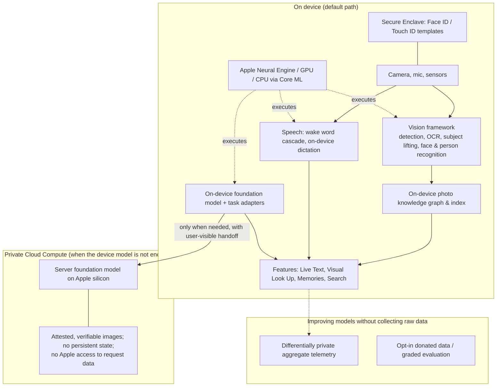

# Apple (on-device ML, Neural Engine & Core ML, Live Text & Visual Look Up, Face ID & Photos, Apple Intelligence, privacy-preserving ML)

> **Why this matters at staff level.** Apple's ML interviews are constrained-optimisation interviews. Nearly every question reduces to: make this work on a device with a fixed power and memory budget, without sending the user's data anywhere, at a quality level users will not complain about, and if you must use a server, prove it cannot see what it is processing. Strong signal is treating privacy and the hardware budget as *requirements that shape the architecture*, not as a compliance checkbox bolted on at the end, and grounding that in what Apple has actually published on its Machine Learning Research site and in its Platform Security guide.

!!! warning "Sources in this chapter"
    Claims are tied to public Apple Machine Learning Research articles, Apple Security Research posts, the Apple Platform Security guide, WWDC sessions and developer documentation, cited by exact title and year in [Sources](#sources). URLs are omitted where they could not be verified in the build environment (STYLE.md §4); search the exact title. Anything not in a public source is marked **inference**.

## 1. The business in one paragraph

Apple sells hardware, and increasingly the services attached to it, so its ML exists to make devices feel capable and trustworthy, and not to rank ads. That single fact determines the entire stack: models run on-device wherever possible because on-device inference is free (the customer already bought the silicon), private by construction, and available offline; when a model is too large for the device, Apple's answer is Private Cloud Compute, a server tier designed so that Apple itself cannot access the data it processes and whose software is independently verifiable. The ML surface area is enormous and mostly invisible: Face ID and photo understanding, Live Text and Visual Look Up (OCR and visual search built into the camera and the photo library), Siri and the Apple Intelligence foundation models, keyboard and handwriting, health signals, and the Core ML / Neural Engine substrate that third-party developers build on. The differentiating engineering problem is not "can the model do it" but "can it do it in 30 milliseconds, in a few hundred megabytes, without warming the phone, on a photo library the server never sees".

## 2. The ML problems that define the company

| Problem | Why it is hard | Public evidence |
|---|---|---|
| On-device vision | Always-available OCR, subject lifting, scene and face understanding across an entire photo library, on battery | "An On-device Deep Neural Network for Face Detection" (Apple ML Journal, 2017); "Recognizing People in Photos Through Private On-Device Machine Learning" (Apple ML Research, 2021); "On-device Panoptic Segmentation for Camera Using Transformers" (2021); Live Text and Visual Look Up product documentation |
| Neural Engine efficiency | A model that is fast on a GPU can be slow on the ANE; memory layout and op choice dominate | "Deploying Transformers on the Apple Neural Engine" (Apple ML Research, 2022); Core ML Tools documentation |
| Biometric authentication | False-accept rates must be extremely low, spoofing is adversarial, and the template can never leave the device | Apple Platform Security guide (Face ID / Touch ID security); "About Face ID advanced technology" (Apple Support) |
| Speech and Siri | Wake word at near-zero power, speaker personalisation, on-device dictation, synthesis quality | "Hey Siri: An On-device DNN-powered Voice Trigger for Apple's Personal Assistant" (2017); "Personalized Hey Siri" (2018); "Deep Learning for Siri's Voice" (2017) |
| Foundation models on a phone | A useful LLM in a phone's memory budget, with adapters for many features, plus a private server tier for the hard cases | "Apple Intelligence Foundation Language Models" (2024, [arXiv:2407.21075](https://arxiv.org/abs/2407.21075)) and the 2025 update; "Private Cloud Compute: A new frontier for AI privacy in the cloud" (Apple Security Research, 2024) |
| Multimodal research | Vision-language models that could run in Apple's constraints | "MM1: Methods, Analysis & Insights from Multimodal LLM Pre-training" (2024, [arXiv 2403.09611](https://arxiv.org/abs/2403.09611)); "Ferret-UI: Grounded Mobile UI Understanding with Multimodal LLMs" (2024); "OpenELM" (2024) |
| Learning without collecting data | Improving models from usage without a central log of what users did | "Learning with Privacy at Scale" (Apple ML Journal, 2017); "Understanding Aggregate Trends for Apple Intelligence Using Differential Privacy" (Apple ML Research, 2025) |
| Developer platform | Third-party models must run well on the same silicon | Core ML, Vision, Natural Language and Create ML documentation; WWDC sessions on Core ML performance and on the Vision framework |

## 3. The stack as publicly described

*What is public:* Core ML dispatching across the Neural Engine, GPU and CPU; the Vision framework's on-device detection, recognition and text capabilities; Face ID templates protected by the Secure Enclave and never leaving the device (Platform Security guide); the on-device foundation model with task-specific adapters plus a server model, described in the Apple Intelligence foundation models report; Private Cloud Compute's design goals (stateless computation, no privileged runtime access, verifiable and attested software images, and independent inspection) described in Apple's 2024 Security Research post; differential privacy for aggregate telemetry (2017 and 2025 articles). *Inference:* the specific routing policy between the on-device and server model for any given feature, and the architectures behind Live Text and Visual Look Up, are not published in detail.

## 4. Deep dives

### 4.1 Live Text and Visual Look Up: OCR and visual search as a system feature

**The problem.** Apple's decision was not to build an OCR app but to make *all text in every image* selectable everywhere in the operating system, in Photos, in the live camera preview, in Quick Look, in screenshots, across many languages and writing systems. That changes the engineering requirements completely: the recogniser must run on a phone, fast enough to feel instantaneous in a live camera view, cheaply enough to index an entire photo library in the background without draining the battery, and accurately enough on hard real-world text (curved, low-contrast, handwritten, rotated) that users stop thinking about it. Visual Look Up adds the retrieval half: recognise that the photo contains a specific plant, landmark, artwork or breed of dog, and surface information about it.

**What is public.** Live Text and Visual Look Up are documented as product features with published language and category support, and the developer-facing half is exposed through the Vision framework: text recognition with a fast and an accurate path, language selection, document and rectangle detection, subject lifting (segmenting the foreground object from an image with a tap), and animal/object recognition requests. Apple's ML Research site has published on the on-device pieces this composition rests on (face detection on-device (2017), on-device panoptic segmentation with transformers for the camera (2021), and person recognition in Photos with on-device private learning (2021)) and on how to make transformer models actually fast on the Neural Engine (2022). The specific Live Text recogniser architecture is not published; the pipeline below is **inference** from standard practice plus what the Vision framework exposes.

**Inferred pipeline.** Text detection (region proposals over the image, typically at multiple scales) → orientation and script identification → recognition per region (a sequence model with CTC or attention decoding) → language modelling and lexicon correction → grouping into lines, paragraphs and semantic entities (phone numbers, addresses, dates, tracking numbers) so the OS can offer actions. The two-mode design the Vision framework exposes (a fast path and an accurate path) is the interesting public detail: a live camera preview cannot afford the accurate path at 30 frames per second, but a still photo indexed in the background can.

**Math link.** [OCR & document understanding](../part17-ml-system-design/09-ocr-document-understanding.md), [detection](../part04-vision/04-detection.md), [segmentation](../part04-vision/05-segmentation.md), [RNN, LSTM, GRU](../part05-sequence-transformers/01-rnn-lstm-gru.md) for CTC decoding.

**The trade-off.** Running everything on-device forecloses the largest models and makes every new language a size-budget negotiation, but it buys three things Apple treats as non-negotiable: the feature works in airplane mode, the photo never leaves the device, and there is no per-use server cost, so the feature can be free and unlimited. The rejected alternative (a cloud OCR service) would be more accurate per unit of engineering effort and is what most competitors shipped first.

!!! tip "How to say it in the interview"
    "I'd design Live Text as a two-speed on-device pipeline, because the feature has two different consumers. The live camera preview needs a detection and recognition pass that fits in a frame budget. The photo library needs an accurate pass that runs opportunistically while the device is charging. Apple's Vision framework exposes that split publicly as a fast versus accurate recognition level, so I'd build to it. Architecturally: detect text regions, identify script and orientation, recognise each region with a sequence model, then group the recognised text into semantic entities like addresses, phone numbers and tracking numbers, so the system can offer an action instead of selectable characters. I should flag that the recogniser architecture is my inference. Apple has published on on-device face detection, on-device panoptic segmentation for the camera, and on deploying transformers to the Neural Engine, but not on Live Text's internals. The decision I'd defend hardest is staying on-device. The feature works offline, the photo never leaves the phone, and there is no per-use cost, so it can be unlimited. Apple's 2022 Neural Engine article is what makes that practical: you co-design the memory layout for the ANE instead of porting a server model. The trade-off is model size per language, which I'd handle with downloadable language packs. Evaluation: word error rate per script on real-world photos (street signs and receipts, not clean document scans), frame time on the oldest supported device, and energy per indexed photo."

### 4.2 The Neural Engine: why the architecture must be co-designed with the hardware

**The problem.** A model that is fast on a datacentre GPU can be embarrassingly slow on the Apple Neural Engine, and the reason is not FLOPs. The ANE is optimised for particular tensor layouts and operation shapes, and a naive port pays enormous costs in memory movement and in ops that fall back to CPU or GPU.

**The approach.** Apple's 2022 article "Deploying Transformers on the Apple Neural Engine" is unusually concrete about this. It describes rewriting a reference transformer implementation so that it maps well onto the ANE: choosing a data layout in which the channel dimension is arranged to suit the hardware's preferred format instead of the standard "last dimension is features" convention, replacing linear layers with equivalent convolutions that match that layout, splitting attention into chunked operations that avoid materialising large intermediate tensors, and being careful about normalisation and softmax placement. The article's framing is that the *mathematics is unchanged* (the rewritten model computes the same function) but the realised latency and peak memory change dramatically. Apple released reference code alongside it.

**Math link.** The equivalence is the point: a linear layer $y = xW + b$ over a channel-last tensor is the same function as a $1\times1$ convolution over a channel-first tensor with the weights transposed. See [convolutions](../part04-vision/02-convolutions.md), [efficient attention & KV cache](../part06-llm-training/04-efficient-attention-kv-cache.md), and [hardware, memory & roofline](../part14-systems/04-hardware-memory-roofline.md).

**The trade-off.** Hardware-specific rewriting yields large speedups but produces a model that is no longer the reference implementation, which complicates maintenance and portability. Apple accepts this because the deployment target is fixed and the gain is the difference between a shippable feature and an unshippable one.

!!! tip "How to say it in the interview"
    "My starting assumption is that porting a server model to the Neural Engine unchanged will be slow, and that the fix is a rewrite that preserves the function while changing the memory layout. Apple's 2022 article on deploying transformers to the Apple Neural Engine is explicit about this: they restructure the tensor layout to match what the hardware prefers, express linear layers as equivalent convolutions in that layout, and chunk the attention computation so large intermediates are never materialised, the maths is identical and the latency and peak memory are not. So my process would be: profile first to find where time actually goes, check which operations are falling back off the ANE, and then restructure those, before reaching for quantisation. I'd reject shrinking the model as the opening move, because you can easily give up accuracy to fix a problem that was really a layout problem. The trade-off is that the deployed model diverges from the reference implementation, so I'd keep a numerical equivalence test between the two in CI. Evaluation: latency and peak memory on the oldest supported device, energy per inference, and an output-parity check against the reference to a fixed tolerance."

### 4.3 Apple Intelligence: a small on-device model with adapters, plus a private server tier

**The problem.** Apple wanted generative features (writing tools, summarisation, image playground, a more capable Siri) across a device fleet with a few gigabytes of usable memory, without sending user content to a server that Apple or anyone else could inspect, and without shipping a separate multi-billion-parameter model for every feature.

**The approach (per Apple's 2024 foundation models report and its 2025 update).** Two models: an on-device model in the few-billion-parameter range, and a larger server model. The on-device model is specialised per feature not by fine-tuning separate copies but by *adapters*, small sets of additional weights, loaded on demand and swapped at runtime, layered on a single shared base model, so the memory cost of supporting many features is one base model plus a handful of megabytes per feature. The report describes the efficiency work needed to fit the base model: low-bit weight quantisation with a mixed strategy across layers, and techniques to recover the quality lost to quantisation; it also describes grouped-query attention and KV-cache handling for on-device decoding, and the training and post-training recipe including human evaluation of the adapters on their specific tasks. The server model runs on Apple silicon inside Private Cloud Compute (see below). The report is also explicit about Responsible AI principles governing the data and the evaluation.

**Math link.** Adapters and low-rank updates in [fine-tuning & LoRA](../part06-llm-training/06-fine-tuning-lora.md); quantisation trade-offs in [quantization](../part06-llm-training/05-quantization.md); GQA and KV cache in [efficient attention & KV cache](../part06-llm-training/04-efficient-attention-kv-cache.md) and [large-model architecture](../part06-llm-training/03-large-model-architecture.md).

**The trade-off.** Adapters over a shared base give many specialised behaviours for almost no marginal memory, but they constrain each feature to what the shared base can support: a task that needs genuinely different capabilities from the base model cannot be reached by an adapter. The rejected alternative (one fine-tuned model per feature) gives better per-task quality and is unshippable on a phone.

!!! tip "How to say it in the interview"
    "For on-device generative features I'd ship one base model with per-feature adapters rather than a fine-tuned model per feature, which is the architecture Apple describes in its 2024 Apple Intelligence Foundation Language Models report. The reason is memory arithmetic: on a phone you can afford one base model resident, and adapters cost megabytes rather than gigabytes, so supporting a dozen features becomes feasible. I'd pair that with aggressive low-bit quantisation using a mixed per-layer strategy plus quality-recovery techniques, which the same report describes, and grouped-query attention to keep the KV cache small during decoding. I'd reject a single general instruction-tuned model prompted differently per feature, because prompting alone doesn't reliably hit the quality bar for a narrow task like summarising a notification, and adapters do. The trade-off is a ceiling: an adapter cannot give the base model a capability it fundamentally lacks, which is exactly why there is a server model for the hard requests. Evaluation should be per-adapter and human-graded on that adapter's real task, the report evaluates the adapters on their specific tasks instead of reporting only general benchmarks, and that is the right instinct, because a summarisation adapter that wins on a benchmark and drops the key fact from a notification has failed."

### 4.4 Private Cloud Compute: what it means to prove a server cannot see your data

**The problem.** Some requests are too big for the phone. The ordinary industry answer (send it to a server and promise to behave) is exactly the answer Apple's positioning does not allow, because a promise is not verifiable and a server operator with privileged access can always be compelled or compromised.

**The approach (per Apple's 2024 Security Research post).** Private Cloud Compute is presented as a set of design requirements and the mechanisms that enforce them: computation on user data is *stateless*, with data used only to serve the request and not retained afterward; there is no privileged runtime access, meaning Apple site reliability staff have no mechanism to reach user data on a PCC node even during incidents; the nodes run cryptographically attested software images, and the device *verifies the attestation before sending data*, so a node running unapproved software cannot receive requests; the software images are published for inspection by independent security researchers; and the design targets non-targetability, so an attacker cannot steer a specific user's request to a compromised node. Hardware roots of trust on Apple silicon underpin the attestation chain.

**Why it is an ML design constraint, not just a security one.** Statelessness rules out server-side personalisation state and conventional per-user caches; no-privileged-access rules out the usual production debugging workflow of inspecting failing requests; verifiable images mean model updates are a release process, not a hot config push. Those constraints shape how you build the feature.

!!! tip "How to say it in the interview"
    "I'd treat the server tier's privacy guarantees as functional requirements. Apple's 2024 Private Cloud Compute post sets out the properties: stateless computation on user data, no privileged runtime access even for Apple's own operators, cryptographic attestation that the device verifies *before* it sends anything, publicly inspectable software images, and non-targetability so an attacker cannot route a chosen user to a compromised node. Each of those changes the ML design. Statelessness means I cannot keep server-side personalisation, so any personalisation must ride along in the request or stay on device. No privileged access means I cannot debug by looking at failing production requests, so I need synthetic and donated evaluation sets and aggregate-only telemetry. Verifiable images mean I cannot hot-patch a prompt, so model and prompt changes go through a release. I'd reject the standard 'encrypt in transit and at rest and trust the operator' design, because it is not verifiable by the user, which is the entire point of the architecture. The trade-off is velocity and cost (this is a slower and more expensive way to run inference) and the compensating decision is to route only what genuinely needs the server model, keeping the on-device path as the default. Evaluation: the share of requests served on-device, quality parity between the two paths on the same prompts, and attestation failure rates as an operational metric."

### 4.5 Face ID, Photos and perception that never leaves the device

**The problem.** Face ID must authenticate the owner with a very low false-accept rate, resist presentation attacks including sophisticated masks, adapt to the user's appearance changing over time, and do all of it with a template that never leaves the device. Photos must recognise the same people across a library of tens of thousands of images (including as children grow and adults age) and must do so without a server ever seeing the faces.

**What is public.** The Apple Platform Security guide describes Face ID's use of the TrueDepth camera to produce a depth map and infrared image, neural networks that transform them into a mathematical representation compared against enrolled data, the storage of that data encrypted and protected by the Secure Enclave, the anti-spoofing network trained against masks and other attack media, and the fact that the representation never leaves the device or is backed up. Apple's support documentation gives the published false-accept probability for a random person; quote it from the source, never from memory. On the Photos side, Apple's 2021 ML Research article "Recognizing People in Photos Through Private On-Device Machine Learning" describes combining face and upper-body embeddings (because faces are often small, turned away or occluded in real photos) and clustering them on-device, with the user's own naming of clusters acting as supervision that stays local. Apple's 2017 article on on-device face detection is the earlier account of getting a deep detector to run within the memory and power budget, including the decision to move from a classical detector to a deep one only once it could run on-device.

**Math link.** [Detection](../part04-vision/04-detection.md), [CLIP & contrastive learning](../part08-multimodal/03-clip-contrastive.md) for embedding spaces, [KNN & K-means](../part02-classical/04-knn-kmeans.md) for clustering.

!!! tip "How to say it in the interview"
    "For person recognition in a photo library I wouldn't rely on face embeddings alone, because Apple's 2021 article on recognising people in photos makes the point that in real family photos the face is frequently small, profile, occluded or turned away, and they combine face embeddings with upper-body embeddings to cover those cases. I'd cluster the embeddings on-device and use the user's own naming of clusters as the supervision signal, which keeps the labels (the most sensitive part) on the phone. For authentication the design is different and stricter: Apple's Platform Security guide describes depth plus infrared capture, a neural network mapping that to a representation compared against enrolled data in the Secure Enclave, and a separate anti-spoofing network trained specifically against masks and attack media. The decision I'd defend is that liveness is a distinct model with its own adversarial training set, not a confidence threshold on the matcher, because a matcher tuned to be strict enough to reject a good mask would reject the legitimate owner in poor lighting. The trade-off is two models and two evaluation regimes. Evaluation: false-accept rate against random impostors, a separate presentation-attack detection rate against a red-team set of physical attacks, and false-reject rate across lighting, glasses and appearance changes, reported separately, because a single accuracy number hides the failure that matters."

### 4.6 Learning without collecting: differential privacy and opt-in data

**The problem.** Apple wants to know which new words users type, which emoji are trending, which Safari sites break, and how Apple Intelligence features perform in the wild, without building a database of what individuals did.

**The approach.** The 2017 article "Learning with Privacy at Scale" describes Apple's local differential privacy deployment: data is privatised *on the device* before it is sent, using sketch-based algorithms (a count-mean sketch and a Hadamard variant) that add noise and hash into a compact representation, with a per-user, per-use-case privacy budget; the server aggregates many noisy reports to estimate population-level counts and can never confidently attribute a value to an individual. The 2025 article extends this framing to Apple Intelligence, describing using differentially private aggregate signals (including comparisons against synthetic data) to understand how features are used and to improve them without collecting user content.

**Math link.** $\varepsilon$-local differential privacy: a randomiser $R$ satisfies $\frac{P(R(x)=y)}{P(R(x')=y)} \le e^{\varepsilon}$ for all inputs $x, x'$; the estimation error from aggregating $n$ noisy reports falls as $O(\sqrt{n})$, which is why this only works for population-scale questions. See [statistics](../part01-math/04-statistics.md) and [safety & failure modes](../part15-interpretability-safety/02-safety-failure-modes.md).

!!! tip "How to say it in the interview"
    "If I need to learn from usage without collecting content, I'd privatise on the device before transmission rather than collecting raw data and anonymising it later, which is the local differential privacy design Apple describes in its 2017 'Learning with Privacy at Scale' article, sketch-based randomisers with a per-user privacy budget, aggregated server-side to estimate population counts. The key property is that the guarantee holds even if the server is compromised, because the raw value never left the phone. I'd reject server-side anonymisation, which fails exactly when you most need it. The trade-off is brutal and worth stating plainly: the noise means you can only answer population-scale questions, so this tells me which emoji is trending but never why a specific user's summarisation looked wrong. That is why Apple's 2025 article on understanding aggregate trends for Apple Intelligence pairs DP signals with synthetic data comparisons, and why I'd also run an opt-in donated-data programme and graded human evaluation for the questions DP cannot answer. Evaluation: estimation error against a known-truth holdout at the chosen epsilon, and an explicit budget ledger per use case."

## 5. Likely interview questions

!!! interview "1. Design Live Text: select any text in any photo, on-device."
    **Sketch.** Two-speed pipeline (live camera vs. background library indexing), detection → script/orientation → recognition → lexicon correction → semantic entity grouping for actions; language packs on demand; ANE-friendly architecture. Cross-link: [OCR design](../part17-ml-system-design/09-ocr-document-understanding.md).

    !!! tip "How to say it in the interview"
        "I'd build two paths over shared models: a frame-budget path for the live camera and an accurate path that indexes the library opportunistically while charging, which mirrors the fast-versus-accurate recognition levels Apple's Vision framework exposes publicly. Beyond recognition I'd invest in grouping text into actionable entities (addresses, phone numbers, tracking numbers) because that is what turns OCR into a feature. I'd reject a cloud recogniser: the feature has to work offline and cost nothing per use. The trade-off is per-language model size, handled with on-demand language packs. Evaluation: word error rate per script on in-the-wild photos, frame time on the oldest supported device, and energy per indexed photo."

!!! interview "2. A transformer runs at 200 ms on the Neural Engine and you need 30 ms. What do you do, in order?"
    **Sketch.** Profile first; find ops falling back off the ANE; fix tensor layout and express linears as 1×1 convs; chunk attention to avoid large intermediates; only then quantise; only then shrink. Cross-link: [hardware & roofline](../part14-systems/04-hardware-memory-roofline.md), [quantization](../part06-llm-training/05-quantization.md).

    !!! tip "How to say it in the interview"
        "Profile before touching the model. In my experience, and in what Apple's 2022 article on deploying transformers to the Neural Engine documents, most of the gap is memory movement and unsupported ops falling back to CPU, not arithmetic. So step one is finding the fallbacks; step two is restructuring the tensor layout to the format the hardware prefers and expressing linear layers as equivalent 1×1 convolutions in that layout; step three is chunking attention so large intermediates are never materialised. Only after that would I quantise, and only after that would I reduce capacity. I'd reject starting with quantisation, because you can trade away accuracy to fix a problem that was never numerical. The trade-off is a model that no longer matches the reference implementation, so I'd keep an equivalence test in CI. Evaluation: latency and peak memory on the oldest supported device, plus output parity to a tolerance."

!!! interview "3. Design the routing between the on-device model and the server model."
    **Sketch.** Default on-device; escalate on task complexity, context length, or low on-device confidence; user-visible; measure quality parity; respect that PCC is stateless so no server-side personalisation. Cross-link: [inference systems](../part14-systems/03-inference-systems.md), [uncertainty & reliability](../part13-retrieval-eval-reliability/03-uncertainty-reliability.md).

    !!! tip "How to say it in the interview"
        "On-device is the default and the server is the exception, because on-device is free, private, offline-capable and instant. I'd escalate on measurable triggers (context length beyond what the device can hold, task classes where the adapter is known to underperform, or a calibrated low-confidence signal) rather than on a vague notion of difficulty. Apple's Private Cloud Compute design means the server is stateless with no privileged access, so any personalisation has to travel with the request or stay local, and I'd design the prompt contract accordingly. I'd reject routing by default to the server for quality, since it makes the feature fail offline and costs money per use. The trade-off is that a conservative router leaves quality on the table. Evaluation: share of requests served on-device, quality parity between paths on matched prompts, and user-visible latency at both tiers."

!!! interview "4. How would you add a new language to on-device OCR?"
    **Sketch.** Script support in detection, recognition head and lexicon, synthetic and real data collection, on-demand model download, evaluation per script; shared encoder with per-script heads to bound size.

    !!! tip "How to say it in the interview"
        "I'd share the detector and the visual encoder across scripts and add a per-script recognition head and lexicon, because that bounds the marginal size per language to something a downloadable pack can carry. Data is the hard part: I'd generate synthetic text in the target script over realistic backgrounds and pair it with a smaller set of real annotated photos, since real in-the-wild data is what calibrates the failure modes. I'd reject one full model per language on device-size grounds. The trade-off is negative transfer between scripts in the shared encoder, which I'd monitor per script rather than in aggregate. Evaluation: word error rate per script on real photos, and a regression check that adding the new script did not degrade existing ones."

!!! interview "5. Implement an adapter that specialises a base model for summarisation (coding-ish)."
    **Sketch.** Low-rank update $W' = W + BA$ with $B \in \R^{d\times r}$, $A \in \R^{r\times k}$, $r \ll d$; freeze base; train on task data; swap adapters at runtime; memory accounting. Cross-link: [fine-tuning & LoRA](../part06-llm-training/06-fine-tuning-lora.md).

    !!! tip "How to say it in the interview"
        "I'd freeze the base weights and learn a low-rank update per adapted projection, so the trainable and shippable parameters are the two small factor matrices rather than the full weight. That is the structure that makes Apple's per-feature adapter approach in the Apple Intelligence foundation models report affordable: one resident base model, megabytes per feature, swapped at runtime. I'd train on the specific task's data with human-graded evaluation for that task. I'd reject full fine-tuning per feature purely on memory. The test I'd write is that with the adapter zeroed the model reproduces the base model's outputs exactly, which catches wiring errors immediately."

!!! interview "6. Recognise the same person across a 50,000-photo library, on-device."
    **Sketch.** Face + upper-body embeddings, clustering with user naming as supervision, incremental indexing while charging, appearance drift over years. Cross-link: [KNN & K-means](../part02-classical/04-knn-kmeans.md).

    !!! tip "How to say it in the interview"
        "I'd embed both faces and upper bodies, because Apple's 2021 article on recognising people in photos points out that real photos frequently show people turned away or partially occluded, and upper-body appearance carries identity within an event even when the face doesn't. Then cluster on-device and treat the user naming a cluster as the label. I'd reject requiring the user to tag many photos up front. The hard trade-off is drift: a child's face changes over years, so I'd link clusters across time using co-occurrence and the user's confirmations rather than raw embedding distance. Evaluation: clustering purity and the number of user corrections required per thousand photos, plus indexing energy."

!!! interview "7. How do you evaluate a generative feature when you cannot look at user data?"
    **Sketch.** Synthetic and donated evaluation sets, human graders on representative tasks, DP aggregate telemetry for usage trends, red-teaming, per-adapter task evaluation.

    !!! tip "How to say it in the interview"
        "I'd build the evaluation out of data I'm allowed to hold: curated and synthetic prompt sets that mirror the real task distribution, opt-in donated examples, and human graders scoring against task-specific rubrics. Apple's foundation models report evaluates adapters on their own tasks with human evaluation, which is the right instinct because a benchmark win doesn't tell you whether the summary kept the important fact. For the population-level questions I'd use differentially private aggregate telemetry, as Apple's 2017 and 2025 articles describe, while being honest that DP tells me *what* is happening and never *why* for any individual. I'd reject sampling production requests for review. The trade-off is slower diagnosis of rare failures, which I'd partly offset with a user-initiated feedback mechanism that donates the specific case with consent."

!!! interview "8. Design the wake-word path for 'Hey Siri'."
    **Sketch.** Always-on tiny detector on a low-power processor, larger on-device verifier, speaker personalisation, then full request handling; asymmetric error costs. Cross-link: [inference systems](../part14-systems/03-inference-systems.md).

    !!! tip "How to say it in the interview"
        "A cascade: a very small always-on detector running on a low-power processor with a recall-biased threshold, then a larger on-device model to verify, then speaker-specific verification, which is the structure Apple's 2017 'Hey Siri' article and its 2018 'Personalized Hey Siri' follow-up describe, including enrolling the user's voice to reduce triggers from other people. The decision is asymmetric thresholds: a missed wake is immediately visible to the user, a false trigger is embarrassing and privacy-relevant, so I'd put the strict gate late in the cascade where compute is affordable. I'd reject a single medium model as simultaneously too costly to run always-on and too weak to arbitrate. Evaluation: false accepts per hour of ambient audio and false rejects per thousand intentional wakes, reported per acoustic environment, plus the power draw of the always-on stage."

!!! interview "9. Estimate whether a model fits the device budget."
    **Sketch.** Parameters × bits/param for weights, KV cache = $2 \times L \times H_{kv} \times d_{head} \times T \times$ bytes, activations, plus the OS and app budget; quantisation and GQA as levers. Cross-link: [efficient attention & KV cache](../part06-llm-training/04-efficient-attention-kv-cache.md), [quantization](../part06-llm-training/05-quantization.md).

    !!! tip "How to say it in the interview"
        "I'd do the arithmetic out loud: weights are parameters times bits per parameter, so a three-billion-parameter model at four bits is roughly 1.5 gigabytes before overheads; the KV cache is two (keys and values) times layers, times key-value heads, times head dimension, times sequence length, times bytes per element, which is why grouped-query attention matters so much on device; and then activations and the fact that the OS and foreground app also need memory. Apple's foundation models report describes low-bit quantisation with a mixed strategy and quality-recovery techniques precisely because this budget is the binding constraint. I'd reject quoting parameter count alone as 'the size'. The trade-off is quality lost to quantisation, which I'd measure per task rather than on perplexity alone."

!!! interview "10. A feature needs user history for personalisation, but the server is stateless. Design it."
    **Sketch.** Keep state on-device; send only the minimal derived context with the request; on-device retrieval selecting what to send; no server-side profile. Cross-link: [retrieval & RAG](../part13-retrieval-eval-reliability/01-retrieval-and-rag.md).

    !!! tip "How to say it in the interview"
        "The personalisation state stays on the device and the device decides what minimal context to attach to a server request, effectively on-device retrieval selecting the few relevant items rather than a server-side user profile. That is forced by the stateless-computation property Apple describes for Private Cloud Compute: the server keeps nothing after the request, so a server-side profile is not available by design. I'd reject shipping a user embedding to the server for caching, since that recreates the profile the architecture exists to avoid. The trade-off is larger requests and the need for a good on-device selector; a bad selector silently degrades quality. Evaluation: quality with and without the attached context on a held-out set, and the size of the context actually sent."

!!! interview "11. Ship a Vision-framework-based feature for third-party developers. What API guarantees matter?"
    **Sketch.** Stable request/observation model, confidence scores, device-tier performance expectations, on-device guarantee, graceful degradation on older hardware.

    !!! tip "How to say it in the interview"
        "The API contract matters more than the model. Developers need stable request and observation types, confidence scores they can threshold, and a documented statement that processing is on-device, because many of them are building for regulated customers who must answer that question. I'd also publish realistic performance expectations per device tier, since a feature that is smooth on the newest device and unusable on a four-year-old one will be shipped anyway and will damage trust. I'd reject exposing raw model outputs that I cannot keep stable across OS releases. Evaluation: API adoption, and crash and timeout rates on the oldest supported hardware."

!!! interview "12. Justify on-device to a product manager who wants the bigger cloud model."
    **Sketch.** Offline availability, latency, zero marginal cost, privacy as a product attribute; the escape hatch is PCC for genuinely hard requests; quantify with the share of requests each tier can serve.

    !!! tip "How to say it in the interview"
        "I'd make it concrete rather than philosophical. On-device means the feature works on a plane, responds without a round trip, costs nothing per use so it can be unlimited, and doesn't create a data-handling obligation, and Apple's whole architecture, from the Neural Engine work to the Apple Intelligence adapter design, exists to make that viable. Then I'd show the measurement: what share of real requests the on-device model serves at acceptable quality. If that share is high, the cloud model is an escape hatch for the tail, and Private Cloud Compute exists precisely so that tail can be served without giving up the privacy property. I'd reject the framing that it is a binary choice. The trade-off is engineering effort, which is real and which I'd size honestly."

## 6. What to bring from your background

* **OCR and text detection map onto Live Text and the Vision framework directly.** This is the most concrete bridge from your background to Apple: multi-script text detection and recognition, curved and low-contrast text, document rectification, handwriting, and the grouping of recognised text into semantic entities. What Apple will probe beyond the model is the budget: frame time in a live camera preview, energy per photo when indexing a library in the background, model size per language, and accuracy on the oldest supported device. Prepare a story where you cut latency or size by an order of magnitude without losing accuracy, and be ready to say exactly where the wins came from.
* **Detection and segmentation** map onto subject lifting, panoptic segmentation for the camera pipeline, face and person detection in Photos, and scene understanding, all of which Apple has published on for the on-device case. Emphasise small-model design, quantisation-aware training, and evaluation on real-world rather than benchmark imagery.
* **ML systems** translate into the Core ML / ANE deployment story: profiling, operator coverage, memory layout, model conversion and numerical parity testing. Apple's 2022 transformers-on-ANE article is the shared vocabulary; use it.
* **Privacy-aware design** is the differentiator. If you have ever built a system that had to learn from usage without retaining raw data (sampling, aggregation, on-device processing, consented donation) lead with it, and connect it explicitly to local differential privacy and to the stateless-server constraint.

## Sources

**On-device vision and perception**

* Apple Machine Learning Research, "An On-device Deep Neural Network for Face Detection", Apple ML Journal, 2017.
* Apple Machine Learning Research, "Recognizing People in Photos Through Private On-Device Machine Learning", 2021.
* Apple Machine Learning Research, "On-device Panoptic Segmentation for Camera Using Transformers", 2021.
* Apple developer documentation: the Vision framework (text recognition requests and recognition levels, document and rectangle detection, subject lifting, animal and object recognition); Live Text and Visual Look Up feature documentation and supported languages/categories.

**Hardware and deployment**

* Apple Machine Learning Research, "Deploying Transformers on the Apple Neural Engine", 2022 (with reference implementation).
* Apple developer documentation: Core ML, Core ML Tools, and WWDC sessions on Core ML performance and model conversion.

**Foundation models and private serving**

* Apple, "Apple Intelligence Foundation Language Models", 2024. [arXiv:2407.21075](https://arxiv.org/abs/2407.21075) · and the 2025 technical report update.
* Apple Security Research, "Private Cloud Compute: A new frontier for AI privacy in the cloud", 2024.
* McKinzie et al., "MM1: Methods, Analysis & Insights from Multimodal LLM Pre-training", 2024 ([arXiv 2403.09611](https://arxiv.org/abs/2403.09611)).
* You et al., "Ferret-UI: Grounded Mobile UI Understanding with Multimodal LLMs", 2024.
* Mehta et al., "OpenELM: An Efficient Language Model Family with Open Training and Inference Framework", 2024.

**Biometrics and security**

* Apple Platform Security guide (Face ID and Touch ID security; Secure Enclave).
* Apple Support, "About Face ID advanced technology".

**Speech**

* Apple Machine Learning Research, "Hey Siri: An On-device DNN-powered Voice Trigger for Apple's Personal Assistant", 2017; "Personalized Hey Siri", 2018; "Deep Learning for Siri's Voice: On-device Deep Mixture Density Networks for Hybrid Unit Selection Synthesis", 2017.

**Privacy-preserving learning**

* Apple Machine Learning Research, "Learning with Privacy at Scale", Apple ML Journal, 2017.
* Apple Machine Learning Research, "Understanding Aggregate Trends for Apple Intelligence Using Differential Privacy", 2025.
