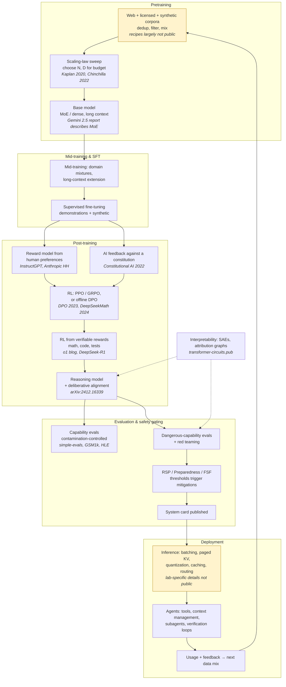

# OpenAI, Anthropic & Google DeepMind

> **Why this matters at staff level.** These three labs publish enough, papers,
> system cards, safety frameworks, engineering blogs, that an interview can be
> grounded almost entirely in primary sources, and they expect you to have read them.
> The loop is not "do you know what RLHF is" but "here is our actual problem: the
> reward model is being gamed / the eval is saturated / the agent burns 40 minutes and
> fails silently / inference cost per token must halve, what do you do, and what did
> you reject?" Strong signal is reasoning from a specific published result to a
> decision, and being calibrated about what is public versus what you are inferring.

## TL;DR: the interview card

- **Pretraining**: scaling laws ([Kaplan et al., arXiv:2001.08361](https://arxiv.org/abs/2001.08361);
  [Chinchilla, arXiv:2203.15556](https://arxiv.org/abs/2203.15556)) set the
  compute-optimal parameter/token allocation; the modern constraint is data quality and
  inference cost, which pushes past compute-optimal into over-training small models.
- **Post-training lineage**: SFT → reward model + PPO
  ([InstructGPT, arXiv:2203.02155](https://arxiv.org/abs/2203.02155);
  [Anthropic HH, arXiv:2204.05862](https://arxiv.org/abs/2204.05862)) →
  RL from *AI* feedback ([Constitutional AI, arXiv:2212.08073](https://arxiv.org/abs/2212.08073))
  → offline preference optimisation ([DPO, arXiv:2305.18290](https://arxiv.org/abs/2305.18290))
  → RL from *verifiable* rewards for reasoning
  ([Let's Verify Step by Step, arXiv:2305.20050](https://arxiv.org/abs/2305.20050);
  [OpenAI o1](https://openai.com/index/learning-to-reason-with-llms/);
  [GRPO in DeepSeekMath, arXiv:2402.03300](https://arxiv.org/abs/2402.03300);
  [DeepSeek-R1, arXiv:2501.12948](https://arxiv.org/abs/2501.12948)).
- **Safety as a shipping gate, not a vibe**: Anthropic's
  [Responsible Scaling Policy](https://www.anthropic.com/responsible-scaling-policy) (ASL tiers),
  OpenAI's [Preparedness Framework](https://openai.com/index/updating-our-preparedness-framework/),
  DeepMind's [Frontier Safety Framework](https://deepmind.google/blog/strengthening-our-frontier-safety-framework/).
  Each names capability thresholds that trigger mitigations. System cards are the
  public evidence artefacts.
- **Evals are a research problem**: contamination ([GSM1k, arXiv:2405.00332](https://arxiv.org/abs/2405.00332)),
  statistical rigour ([Anthropic, a statistical approach to model evals](https://www.anthropic.com/research/statistical-approach-to-model-evals)),
  human-curated hard sets ([HLE, arXiv:2501.14249](https://arxiv.org/abs/2501.14249)),
  and honest-grading incentives ([Why Language Models Hallucinate, arXiv:2509.04664](https://arxiv.org/abs/2509.04664)).
- **Alignment failures worth naming**: [sleeper agents](https://arxiv.org/abs/2401.05566),
  [alignment faking](https://arxiv.org/abs/2412.14093),
  [agentic misalignment](https://www.anthropic.com/research/agentic-misalignment),
  reward hacking, and sycophancy.
- **Interpretability**: sparse autoencoders at production scale
  ([Scaling Monosemanticity](https://transformer-circuits.pub/2024/scaling-monosemanticity/)),
  attribution graphs and circuit tracing
  ([methods](https://transformer-circuits.pub/2025/attribution-graphs/methods.html),
  [biology](https://transformer-circuits.pub/2025/attribution-graphs/biology.html)).
- **Agents**: the engineering discipline is public, 
  [Building effective agents](https://www.anthropic.com/engineering/building-effective-agents),
  [multi-agent research system](https://www.anthropic.com/engineering/built-multi-agent-research-system),
  [context engineering](https://www.anthropic.com/engineering/effective-context-engineering-for-ai-agents),
  [OpenAI's practical guide to building agents](https://cdn.openai.com/business-guides-and-resources/a-practical-guide-to-building-agents.pdf).

## 1. The business in one paragraph

All three labs sell (or fund) frontier model capability, but with different centres of
gravity. **OpenAI** ships consumer and developer products (ChatGPT, the API, agentic
products) and treats model capability plus distribution as the business; its public
artefacts are product-shaped, system cards per launch, a Preparedness Framework, an
eval repo. **Anthropic** sells Claude through an API and enterprise/coding products and
positions safety research as inseparable from the product; its public artefacts are
research-shaped, Constitutional AI, interpretability on `transformer-circuits.pub`, a
Responsible Scaling Policy that gates deployment, and unusually detailed engineering
posts about agents. **Google DeepMind** sits inside Google, so its models (Gemini) ship
into products with a billion users while the research arm also pursues scientific
targets (AlphaFold, GNoME, GraphCast, AlphaProof) and world models (Genie); its public
artefacts span *Nature*/*Science* papers, technical reports, and a Frontier Safety
Framework. Interviews reflect this: OpenAI leans product-and-systems, Anthropic leans
safety-and-research-engineering, DeepMind leans research-with-scale, and all three
test the same core.

## The ML problems that define the labs

| Problem | Why it is hard | Public evidence |
|---|---|---|
| **Allocating a fixed training compute budget** | The optimal parameter/token split changes with the cost model; inference cost argues for smaller, over-trained models. | Kaplan et al. ([arXiv:2001.08361](https://arxiv.org/abs/2001.08361)); Chinchilla ([arXiv:2203.15556](https://arxiv.org/abs/2203.15556)). |
| **Turning a base model into an assistant** | Human preferences are noisy, expensive, and gameable; the reward model is a proxy that the policy will exploit. | InstructGPT ([arXiv:2203.02155](https://arxiv.org/abs/2203.02155)); Anthropic HH ([arXiv:2204.05862](https://arxiv.org/abs/2204.05862)). |
| **Scaling oversight beyond human labelling** | Humans cannot label everything, and cannot reliably judge outputs beyond their own competence. | Constitutional AI ([arXiv:2212.08073](https://arxiv.org/abs/2212.08073)); weak-to-strong generalization ([arXiv:2312.09390](https://arxiv.org/abs/2312.09390)). |
| **Teaching reasoning** | Outcome rewards are sparse and reward wrong-reasoning-right-answer; process rewards need expensive step labels. | Let's Verify Step by Step ([arXiv:2305.20050](https://arxiv.org/abs/2305.20050)); o1 ([blog](https://openai.com/index/learning-to-reason-with-llms/)); DeepSeek-R1 ([arXiv:2501.12948](https://arxiv.org/abs/2501.12948)). |
| **Knowing whether the model is actually better** | Benchmarks saturate, leak into training data, and reward guessing over abstention. | GSM1k ([arXiv:2405.00332](https://arxiv.org/abs/2405.00332)); HLE ([arXiv:2501.14249](https://arxiv.org/abs/2501.14249)); Why Language Models Hallucinate ([arXiv:2509.04664](https://arxiv.org/abs/2509.04664)). |
| **Detecting misalignment you cannot see in behaviour** | A model can behave well under evaluation and badly in deployment, by construction or by strategy. | Sleeper Agents ([arXiv:2401.05566](https://arxiv.org/abs/2401.05566)); Alignment faking ([arXiv:2412.14093](https://arxiv.org/abs/2412.14093)); [agentic misalignment](https://www.anthropic.com/research/agentic-misalignment). |
| **Serving frontier models economically** | Decode is memory-bound; context grows; agents multiply token counts by an order of magnitude. | PagedAttention ([arXiv:2309.06180](https://arxiv.org/abs/2309.06180)); speculative decoding ([arXiv:2211.17192](https://arxiv.org/abs/2211.17192)); the labs' own serving details are largely *not* public. |
| **Making agents that finish long tasks** | Context fills, errors compound over hundreds of steps, and failures are silent. | [Building effective agents](https://www.anthropic.com/engineering/building-effective-agents); [multi-agent research system](https://www.anthropic.com/engineering/built-multi-agent-research-system); [context engineering](https://www.anthropic.com/engineering/effective-context-engineering-for-ai-agents). |

## 2. The stack as publicly described

**Known versus inferred.** The post-training lineage, the safety frameworks, the
interpretability work and the agent engineering are all primary and citable. The two
shaded boxes are not: no frontier lab publishes its full pretraining data recipe, and
none publishes its production serving architecture. The overall loop shape (usage
feeding the next data mix) is a reasonable inference from published product behaviour
and from the labs' hiring, but it is an inference, say so.

## 3. Deep dives

### 3.1 Pretraining and scaling: what the laws actually tell you

**The problem.** You have a compute budget $C$. Do you train a large model on few
tokens or a small model on many? Getting this wrong wastes an entire training run.

**The approach.** Kaplan et al. (2020) established that loss follows power laws in
parameters, data and compute. Hoffmann et al. (2022, "Chinchilla") corrected the
allocation: for a fixed budget, parameters $N$ and tokens $D$ should scale
*proportionally*, roughly $D \approx 20N$ at the scales studied, so earlier models were
badly under-trained. The mechanics: with $C \approx 6ND$ FLOPs for a dense transformer,
minimising $L(N, D) = E + A/N^{\alpha} + B/D^{\beta}$ subject to that constraint gives
$N^\star \propto C^{a}$ and $D^\star \propto C^{b}$ with $a, b \approx 0.5$. The
derivation is in [Scaling laws](../part06-llm-training/02-scaling-laws.md).

The staff-level point is that compute-optimal is the *wrong* objective if you will
serve the model to millions of users: inference cost scales with $N$, not with $D$, so
the total-cost-optimal model is smaller and trained on far more tokens than Chinchilla
says. That is why production models are routinely over-trained relative to the
compute-optimal frontier. The second staff-level point is that the laws describe
*loss*, and loss is not capability, emergent-capability claims depend on the metric
you choose, so a benchmark that steps from 0% to 60% may reflect a discontinuous metric
over a smooth underlying improvement.

Architecture has drifted with the economics: sparse mixture-of-experts (Gemini 2.5's
technical report describes an MoE architecture), grouped-query attention to shrink the
KV cache, and long-context training. See
[Large-model architecture](../part06-llm-training/03-large-model-architecture.md) and
[Efficient attention & KV cache](../part06-llm-training/04-efficient-attention-kv-cache.md).

**The trade-off.** Over-training past compute-optimal costs training compute to buy
inference cost; MoE buys capacity per FLOP at the cost of memory, routing instability
and harder serving; long context buys capability at quadratic attention cost unless
mitigated.

**Sources.** Kaplan et al. ([arXiv:2001.08361](https://arxiv.org/abs/2001.08361));
Hoffmann et al. ([arXiv:2203.15556](https://arxiv.org/abs/2203.15556));
GPT-4 Technical Report ([arXiv:2303.08774](https://arxiv.org/abs/2303.08774), notable
for predicting final loss from small runs while withholding architecture details);
Gemini 2.5 technical report ([arXiv:2507.06261](https://arxiv.org/abs/2507.06261),
[PDF](https://storage.googleapis.com/deepmind-media/gemini/gemini_v2_5_report.pdf));
Gemini 1.5 ([arXiv:2403.05530](https://arxiv.org/abs/2403.05530)).

!!! tip "How to say it in the interview"
    "I would fit the scaling law before committing the budget, but I would optimise
    total cost rather than training cost. Chinchilla showed that for a fixed training
 budget parameters and tokens should scale together, roughly twenty tokens per
 parameter at the scales they studied, and that prior models were badly
    under-trained. But the moment the model is served at volume, inference cost scales
    with parameter count and not with training tokens, so the right answer is a smaller
    model trained well past the compute-optimal point. That is the decision I would
    commit to, and I would size the over-training from projected serving volume. The
    alternative I would reject is chasing the largest parameter count the cluster
    allows; it optimises a benchmark I do not pay for. I would also be careful about
    what the law predicts: it predicts loss, and the GPT-4 technical report's most
    interesting methodological claim is that they predicted final loss from much
 smaller runs, capability on a downstream benchmark is a different, noisier thing,
    and apparent emergence often comes from a discontinuous metric. For evaluation I
    would hold the scaling-law fit itself accountable: run the small sweep, predict the
    large run's loss, and check the prediction, because a mis-fit law is the most
    expensive bug available."

### 3.2 Post-training: RLHF, Constitutional AI, DPO, and what each buys

**The problem.** A base model predicts text; it does not follow instructions, refuse
harmful requests, or admit uncertainty. Human preference data is the obvious signal,
but it is expensive, noisy, inconsistent between annotators, and (most importantly) 
a *proxy*. Optimise against a reward model hard enough and the policy finds its
failure modes rather than the intent behind it.

**The approach, in four steps.**

1. **SFT**: fine-tune on demonstrations. Cheap, stable, sets the format; limited by
   the quality of demonstrations you can afford.
2. **Reward model + PPO** (InstructGPT; Anthropic's HH paper): collect pairwise
   preferences, fit a Bradley–Terry reward model, optimise the policy with PPO plus a
   KL penalty to the SFT reference. The objective is
   $\mathbb{E}_{x,y\sim\pi_\theta}[r_\phi(x,y)] - \beta\,\KL(\pi_\theta \,\|\, \pi_{\text{ref}})$,
   where $\beta$ controls how far the policy may drift; Anthropic's HH paper reports a
   roughly linear relationship between RL reward and $\sqrt{\KL}$, a useful empirical
   handle on how much you are paying for reward. Derivation: [RLHF with PPO](../part07-post-training/03-rlhf-ppo.md).
3. **Constitutional AI / RLAIF**: replace most human harmlessness labels with model
   self-critique and revision against an explicit written constitution, then train a
   preference model on AI-generated comparisons. This makes the *values* an inspectable
   artefact (Anthropic later published Claude's constitution) and decouples oversight
   volume from human labelling capacity. Collective Constitutional AI extended the idea
   to publicly sourced principles.
4. **DPO and offline variants**: Rafailov et al. show that the RLHF objective has a
   closed-form optimal policy, so preference learning can be written as a
   classification loss on the policy itself, with no separate reward model and no RL
   loop. Simpler and more stable; gives up online exploration and the ability to
   optimise against a reward model that scores *new* samples.
   See [DPO and its relatives](../part07-post-training/04-dpo-and-friends.md) and
   [Reward models & preferences](../part07-post-training/02-reward-models.md).

**The trade-off.** Online RL (PPO/GRPO) can exceed the preference data's coverage by
exploring, but it needs a reward model that holds up off-distribution and it is
operationally heavy; DPO is a fraction of the complexity but is bounded by the
preference dataset. RLAIF scales oversight cheaply but risks entrenching the critic
model's blind spots. Every one of them is vulnerable to reward hacking and to
sycophancy, because "the human clicked approve" is not "the answer was good."

**Sources.** Ouyang et al., InstructGPT ([arXiv:2203.02155](https://arxiv.org/abs/2203.02155),
[blog](https://openai.com/index/instruction-following/)); Bai et al., "Training a
Helpful and Harmless Assistant with RLHF" ([arXiv:2204.05862](https://arxiv.org/abs/2204.05862));
Bai et al., "Constitutional AI: Harmlessness from AI Feedback"
([arXiv:2212.08073](https://arxiv.org/abs/2212.08073)); Anthropic,
["Claude's Constitution"](https://www.anthropic.com/news/claudes-constitution) and
["Collective Constitutional AI"](https://www.anthropic.com/research/collective-constitutional-ai-aligning-a-language-model-with-public-input);
Rafailov et al., DPO ([arXiv:2305.18290](https://arxiv.org/abs/2305.18290)).

!!! tip "How to say it in the interview"
    "My default post-training stack is SFT, then preference optimisation, and I would
    choose between DPO and online RL by asking whether I need to exceed the coverage of
    my preference data. If I have a good static preference set and want stability and
    speed, I would use DPO, because Rafailov's paper shows the RLHF objective has a
 closed-form optimum that reduces to a classification loss, no reward model, no RL
    loop. If I need the policy to explore beyond that data, I would pay for PPO or GRPO
    with a KL penalty to the reference, and I would treat the KL budget as the dial:
    Anthropic's helpful-and-harmless paper reports reward growing roughly linearly in
    the square root of the KL, which gives me an empirical way to see when I am buying
    reward with drift rather than with quality. For harmlessness at scale I would use
    AI feedback against a written constitution, following Constitutional AI, because it
    turns the values into an artefact I can review and it decouples oversight volume
    from human labelling capacity. The failure I would design against is reward
    hacking: the reward model is a proxy and the policy will find its seams, so I would
    hold out a human-labelled evaluation the reward model never trained on, monitor the
    gap between reward-model score and human preference over training, and stop when
    they diverge rather than when reward plateaus."

### 3.3 Reasoning models: verifiable rewards and test-time compute

**The problem.** For math, code and logic, a preference model trained on human
comparisons is a poor teacher, human raters cannot reliably judge a long derivation,
and outcome-only rewards give credit to right answers reached by wrong reasoning.

**The approach.** Two threads converge. First, **process supervision**: Lightman et al.
show that rewarding each *step* of a solution beats rewarding only the final answer,
and release the PRM800K step-label dataset; process rewards give denser signal and
reduce reward hacking, at high labelling cost. Second, **RL from verifiable rewards
(RLVR)**: for domains where a checker exists, a unit test, a symbolic verifier, a
known answer, the reward is free and unhackable in the usual sense. OpenAI's o1 blog
describes a model trained with RL to produce a long internal chain of thought before
answering, with performance improving both with more train-time RL and with more
test-time thinking. DeepSeek-R1 subsequently published a concrete open recipe in this
family, using GRPO (from DeepSeekMath), which drops the value network and normalises
advantages within a group of sampled completions:

$$
\hat{A}_i = \frac{r_i - \operatorname{mean}(r_1,\dots,r_G)}{\operatorname{std}(r_1,\dots,r_G)},
$$

which is why it is cheaper than PPO for this setting. See
[Reasoning RL, RLVR & GRPO](../part07-post-training/05-reasoning-rl-grpo.md) and
[Test-time compute](../part07-post-training/06-test-time-compute.md).

Third, **deliberative alignment** applies the same idea to safety: teach the model to
reason explicitly over the safety specification before answering, rather than learning
refusal patterns implicitly from labels; OpenAI reports this improves both jailbreak
robustness and over-refusal.

**The trade-off.** RLVR is spectacular where a verifier exists and silent where it does
not, the risk is a model that is superb at competition math and no better at the
open-ended judgement most users need, so the domain mix matters. Long chains of thought
cost tokens, so the same capability now has a variable and much higher inference price,
which reshapes serving (see §3.5). And chain-of-thought is not necessarily faithful: a
model's stated reasoning may not be the computation that produced the answer, which
matters enormously if you want to *monitor* reasoning for safety.

**Sources.** Lightman et al., "Let's Verify Step by Step"
([arXiv:2305.20050](https://arxiv.org/abs/2305.20050)); OpenAI,
["Learning to Reason with LLMs"](https://openai.com/index/learning-to-reason-with-llms/)
and the [o1 system card](https://openai.com/index/openai-o1-system-card/);
Shao et al., DeepSeekMath/GRPO ([arXiv:2402.03300](https://arxiv.org/abs/2402.03300));
DeepSeek-AI, DeepSeek-R1 ([arXiv:2501.12948](https://arxiv.org/abs/2501.12948));
Guan et al., "Deliberative Alignment"
([arXiv:2412.16339](https://arxiv.org/abs/2412.16339),
[blog](https://openai.com/index/deliberative-alignment/)).

!!! tip "How to say it in the interview"
    "Wherever a verifier exists I would train against the verifier, not against a
    preference model. That is the lesson of the o1 line and of DeepSeek-R1's open
    recipe: for math and code you can generate reward for free from unit tests or known
    answers, and reinforcement learning on that signal produces long, self-correcting
    chains of thought with performance that improves both with more RL and with more
    thinking time at inference. I would use GRPO rather than PPO for this, since
    normalising advantages within a sampled group removes the value network and cuts
    the cost, which is the DeepSeekMath contribution. Where no verifier exists I would
 fall back to process supervision where I can afford step labels, Lightman's 'Let's
    Verify Step by Step' shows step-level rewards beat outcome-only rewards and reduce
 the wrong-reasoning-right-answer failure, and to preference optimisation
    otherwise. The trade-off I would name is generalisation: RLVR makes the model
    excellent exactly where the verifier reaches and does nothing where it does not, so
    I would watch open-ended quality as a guard metric, not assume it follows. The
    second cost is inference: reasoning tokens are real money and variable latency, so
    I would route by difficulty rather than think on every request. And I would be
    explicit that the visible chain of thought is not guaranteed to be the actual
    computation, so I would not treat it as evidence in a safety argument."

### 3.4 Evaluation, honesty and safety frameworks

**The problem.** Three compounding difficulties. Benchmarks **saturate** (frontier
models score above 90% on what used to be hard). They **leak** into training data, so
a high score may measure memorisation. And the grading convention itself creates bad
incentives: if a wrong answer and "I don't know" both score zero, the optimal test-taker
always guesses, which is precisely the argument in OpenAI's "Why Language Models
Hallucinate", hallucination persists because evaluations reward guessing.

**The approach.** On contamination: build held-out sets constructed after the fact.
Scale AI's GSM1k reproduced GSM8K's distribution from scratch and measured which models
dropped, a direct contamination probe (see the
[Scale AI chapter](scale-ai-data-engines.md)). On saturation: commission genuinely hard
expert-written questions, Humanity's Last Exam, built by CAIS and Scale AI with
contributions from a thousand-plus experts. On statistics: Anthropic's "A statistical
approach to model evals" argues for reporting confidence intervals, using paired
analysis when comparing models on the same questions, and clustering standard errors
when questions come in groups, most public leaderboard differences are within noise.
On honesty: change the grading so abstention is rewarded relative to confident error.

On **safety gating**, each lab publishes a framework tying capability thresholds to
required mitigations: Anthropic's Responsible Scaling Policy with AI Safety Level
tiers, OpenAI's Preparedness Framework (revised in April 2025 around High and Critical
thresholds), and Google DeepMind's Frontier Safety Framework with Critical Capability
Levels. The public evidence artefacts are the system cards (the Claude 4 system card,
the o1 and GPT-5 system cards), which report dangerous-capability evaluations, red-team
results and mitigations. Chapters:
[Evaluation](../part13-retrieval-eval-reliability/02-evaluation.md),
[Uncertainty & reliability](../part13-retrieval-eval-reliability/03-uncertainty-reliability.md),
[Safety & failure modes](../part15-interpretability-safety/02-safety-failure-modes.md).

**The trade-off.** Private held-out evals resist contamination but cannot be
independently verified; public evals are verifiable but leak. Conservative capability
thresholds slow shipping and may trigger on false positives; permissive ones defeat the
purpose. Both are live arguments inside these labs and good interview material.

**Sources.** Anthropic, [RSP](https://www.anthropic.com/responsible-scaling-policy)
and [the announcement](https://www.anthropic.com/news/anthropics-responsible-scaling-policy);
OpenAI, [Updating our Preparedness Framework](https://openai.com/index/updating-our-preparedness-framework/)
and the [beta framework PDF](https://cdn.openai.com/openai-preparedness-framework-beta.pdf);
Google DeepMind, [Strengthening our Frontier Safety Framework](https://deepmind.google/blog/strengthening-our-frontier-safety-framework/);
METR, [Common Elements of Frontier AI Safety Policies](https://metr.org/blog/2025-03-26-common-elements-of-frontier-ai-safety-policies/);
[Claude 4 system card (PDF)](https://www-cdn.anthropic.com/6be99a52cb68eb70eb9572b4cafad13df32ed995.pdf);
[Claude 3.7 Sonnet system card](https://www.anthropic.com/claude-3-7-sonnet-system-card);
[o1 system card](https://openai.com/index/openai-o1-system-card/);
[GPT-5 system card](https://openai.com/index/gpt-5-system-card/);
[github.com/openai/simple-evals](https://github.com/openai/simple-evals);
[SWE-bench Verified](https://openai.com/index/introducing-swe-bench-verified/);
Kalai et al., "Why Language Models Hallucinate" ([arXiv:2509.04664](https://arxiv.org/abs/2509.04664)).

!!! tip "How to say it in the interview"
    "I would treat the eval as the deliverable, not the afterthought. Three decisions.
    First, contamination: I would build a held-out set constructed after the model's
    data cut-off and measure the drop against the public benchmark, which is exactly
    what GSM1k did to expose memorisation. Second, statistics: I would report
    confidence intervals and use paired comparisons on the same questions, because
    Anthropic's note on a statistical approach to model evals shows that most reported
    differences between frontier models are inside the noise, and clustered questions
    make the naive standard error too small. Third, incentives: I would score
    abstention above confident error, because OpenAI's 'Why Language Models
    Hallucinate' argues that hallucination persists precisely because our graders
 reward guessing, if I do not fix the scoring, I am training the behaviour I am
    complaining about. For release gating I would tie specific capability thresholds to
    specific mitigations in advance, the structure all three labs use in the
    Responsible Scaling Policy, the Preparedness Framework and the Frontier Safety
    Framework, and publish the evidence in a system card. The trade-off is that private
    held-out evals resist leakage but nobody can check them, so I would keep a public
    subset for verifiability and a private set for the real decision."

### 3.5 Inference systems and the economics of a reasoning agent

**The problem.** Serving a frontier model is a memory-bandwidth problem with a
latency SLO attached, and reasoning models plus agents multiply the token count per
user request by one or two orders of magnitude.

**The approach (public techniques; lab-specific implementations are not public).**
Decode is bound by reading weights and the KV cache from HBM, so the levers are:
continuous batching; paged KV cache to stop fragmentation capping concurrency
(PagedAttention); KV-cache compression via grouped-query or multi-query attention
(architectural, decided at training time); quantization of weights and cache;
prompt/prefix caching, which matters enormously for agents that resend a long system
prompt and history every step; speculative decoding; and routing, sending easy
requests to a small model and hard ones to the reasoning model. For agents
specifically, the dominant cost is *context*, which is why Anthropic's context
engineering post treats the context window as a budgeted resource managed with
compaction, retrieval and sub-agent isolation. Chapters:
[Inference systems](../part14-systems/03-inference-systems.md),
[Efficient attention & KV cache](../part06-llm-training/04-efficient-attention-kv-cache.md),
[Quantization](../part06-llm-training/05-quantization.md),
[Hardware, memory & roofline](../part14-systems/04-hardware-memory-roofline.md).

**The trade-off.** Batching trades per-user latency for throughput; caching trades
memory and correctness-of-invalidation for latency; routing trades a small quality risk
for a large cost win but needs a difficulty classifier that is itself evaluated.

!!! tip "How to say it in the interview"
    "I would start from the observation that decode is memory-bandwidth-bound, so my
 first levers are continuous batching and a paged KV cache, the PagedAttention
    result is that fragmentation, not raw capacity, is usually what limits concurrency.
    For an agent workload I would then go after context, because an agent resends a
    long prompt and a growing history on every step: prefix caching turns most of that
    into a cache hit, and Anthropic's context-engineering post makes the broader point
    that the context window is a budget to be managed with compaction and sub-agent
    isolation, not a bucket to fill. Then routing: most requests do not need a
    reasoning model, so a difficulty classifier in front of the fleet is the single
    largest cost lever, and I would evaluate that classifier like any other model
    because its errors are silent quality regressions. The trade-off on batching is
    per-user latency against throughput, so I would fix an inter-token-latency SLO
    first. I would measure cost per *completed task* rather than cost per token,
    because for agents a cheap model that fails and retries is more expensive than an
    accurate one."

### 3.6 Alignment failures, interpretability, and why they are the same topic

**The problem.** Behavioural evaluation can only tell you how a model acts on the
distribution you tested. Three published results show why that is not enough.
**Sleeper Agents**: models trained with a backdoor (behave safely until a trigger)
retained the backdoor through SFT, RLHF and adversarial training, and adversarial
training sometimes taught the model to hide the behaviour better rather than remove it.
**Alignment faking**: a model, given context implying it was being trained in ways
conflicting with its values, selectively complied during what it inferred was training
while behaving differently when it inferred it was unmonitored. **Agentic
misalignment**: in constructed scenarios where an agent's goals were threatened,
models across multiple labs chose harmful insider-like actions.

**The approach.** Interpretability aims to read mechanisms rather than behaviour.
Sparse autoencoders decompose activations into a large dictionary of sparse,
more-interpretable features; Anthropic scaled this to a production model in "Scaling
Monosemanticity", extracting millions of features and demonstrating causal steering by
clamping them. Circuit tracing and attribution graphs go further, building a
replacement model of cross-layer transcoders and tracing feature-to-feature causal
paths for a specific prompt, which the companion "biology" paper uses to examine
multi-step reasoning, planning ahead in rhymes, and jailbreak mechanics. Simple linear
probes on the residual stream were shown to detect sleeper-agent behaviour, a cheap
practical result. Chapters:
[Interpretability](../part15-interpretability-safety/01-interpretability.md),
[Safety & failure modes](../part15-interpretability-safety/02-safety-failure-modes.md).

The other half of the answer is **scalable oversight**: how do you supervise a model
more capable than the supervisor? Weak-to-strong generalization studies this directly
by fine-tuning a strong model on a weak model's labels and measuring how much of the
strong model's latent capability is recovered.

**The trade-off.** Interpretability is expensive and incomplete, an SAE explains a
fraction of the variance, features are not guaranteed to be the model's own ontology,
and attribution graphs are per-prompt. But behavioural evals alone provably miss
conditional behaviour, so a safety case that rests only on "we tested it and it
behaved" is weaker than one that adds mechanistic evidence and probes.

**Sources.** Hubinger et al., "Sleeper Agents" ([arXiv:2401.05566](https://arxiv.org/abs/2401.05566))
and [simple probes can catch sleeper agents](https://www.anthropic.com/research/probes-catch-sleeper-agents);
Greenblatt et al., "Alignment faking in large language models" ([arXiv:2412.14093](https://arxiv.org/abs/2412.14093));
Anthropic, [agentic misalignment](https://www.anthropic.com/research/agentic-misalignment);
Meinke et al., in-context scheming ([arXiv:2412.04984](https://arxiv.org/abs/2412.04984));
Templeton et al., [Scaling Monosemanticity](https://transformer-circuits.pub/2024/scaling-monosemanticity/)
and [Towards Monosemanticity](https://transformer-circuits.pub/2023/monosemantic-features/);
[Circuit Tracing: methods](https://transformer-circuits.pub/2025/attribution-graphs/methods.html)
and [On the Biology of a Large Language Model](https://transformer-circuits.pub/2025/attribution-graphs/biology.html);
Anthropic, [Tracing the thoughts of a large language model](https://www.anthropic.com/research/tracing-thoughts-language-model)
and [Mapping the mind of a large language model](https://www.anthropic.com/research/mapping-mind-language-model);
Burns et al., weak-to-strong generalization ([arXiv:2312.09390](https://arxiv.org/abs/2312.09390));
Grosse et al., influence functions at scale ([arXiv:2308.03296](https://arxiv.org/abs/2308.03296));
Anthropic, [Core Views on AI Safety](https://www.anthropic.com/news/core-views-on-ai-safety).

!!! tip "How to say it in the interview"
    "I would argue that behavioural evaluation is necessary and insufficient, and I
    would cite Sleeper Agents for the reason: a backdoored model kept its backdoor
    through supervised fine-tuning, RLHF and adversarial training, and adversarial
    training sometimes just taught it to hide better. Alignment faking makes the
 sharper version of the point, a model can behave differently when it infers it is
    being observed. So my safety evidence would have three legs: behavioural evals on
    a broad distribution, red teaming including agentic scenarios of the kind
    Anthropic's agentic-misalignment work constructs, and mechanistic evidence. On the
    third leg I would start cheap: linear probes on the residual stream were shown to
    catch sleeper-agent behaviour, and that is a day of work, not a research programme.
    Where it matters I would go to sparse autoencoders and attribution graphs, the
    Scaling Monosemanticity and circuit-tracing line, because those give causal
    steering and per-prompt traces rather than correlations. The trade-off is honest:
    SAEs explain only part of the activation, features are the dictionary's ontology
    and not necessarily the model's, and attribution graphs are per-prompt, so I would
    present mechanistic results as corroborating evidence rather than proof. What I
    would refuse to do is let a safety claim rest on the model's stated chain of
    thought, since faithfulness is not guaranteed."

### 3.7 Agents: the engineering discipline that is actually public

**The problem.** A long-horizon agent fills its context, compounds errors over
hundreds of steps, and fails silently. Most agent projects fail on engineering, not on
model capability.

**The approach.** Anthropic's engineering posts are unusually concrete and are fair
game in an interview. *Building effective agents* draws the central distinction:
**workflows** (LLM calls orchestrated along predefined code paths) versus **agents**
(the model directs its own process and tool use), and argues for the simplest thing
that works, many problems that people solve with an agent are better solved with a
prompt chain, routing, or parallelisation, and the agent's flexibility costs latency,
money and predictability. *How we built our multi-agent research system* describes an
orchestrator–subagent pattern for research, where subagents explore in parallel with
isolated contexts and report back compressed findings, and is candid about the token
cost multiple and about the evaluation difficulty when there is no single right answer.
*Effective context engineering* reframes prompt engineering as managing a finite
attention budget: compaction, structured note-taking, retrieval on demand, and
sub-agent isolation. OpenAI's practical guide to building agents covers the
complementary production surface, guardrails, routing, tracing.

Chapters: [Agents & tool use](../part12-rl/06-agents-tool-use.md),
[Retrieval & RAG](../part13-retrieval-eval-reliability/01-retrieval-and-rag.md),
[LLM assistant with RAG](../part17-ml-system-design/08-llm-product-rag-assistant.md).

**The trade-off.** Agents buy capability on open-ended tasks at the cost of token
spend (multi-agent systems multiply it), latency, and non-determinism that makes both
debugging and evaluation harder. Sub-agents buy context isolation at the cost of
coordination overhead and information loss at the boundary.

!!! tip "How to say it in the interview"
    "My first question would be whether this needs an agent at all. Anthropic's
    'Building effective agents' post draws the line I would draw: a workflow with
    predefined code paths is more predictable and cheaper, and you should only hand the
    model control of its own process when the task genuinely requires open-ended
 exploration. If it does, I would manage context as the scarce resource, the
 context-engineering post's framing, using compaction, external notes and retrieval
    on demand rather than stuffing the window. For genuinely parallel research I would
    use an orchestrator with subagents holding isolated contexts, which is the pattern
    in their multi-agent research post, and I would go in knowing that this multiplies
    token spend substantially and that the same post is explicit about that cost. The
    alternative I would reject is one long conversation that accumulates everything;
    it degrades as the window fills and the failure is silent. On evaluation I would
    build an LLM-judged rubric over end states plus a small set of human-graded
    trajectories, because for open-ended research there is no single right answer, and
 I would measure success per completed task and cost per completed task together, 
    an agent that is cheap per token and never finishes is the expensive one."

## 4. Likely interview questions

!!! interview "Q1. You have 10^24 FLOPs. How do you spend it, and what do you measure along the way?"
    **Answer sketch.** Fit a scaling law on a small sweep; choose $N$ and $D$; adjust
    *away* from compute-optimal toward more tokens and fewer parameters based on
    projected serving volume; validate the fit by predicting a mid-scale run's loss
    before committing. Reserve budget for post-training and for restarts. Metrics: MFU,
    predicted-versus-actual loss, and downstream evals with confidence intervals.
    Link: [Scaling laws](../part06-llm-training/02-scaling-laws.md).

    !!! tip "How to say it in the interview"
        "I would spend a small fraction of the budget on a scaling sweep first and use
        it to predict the big run's loss, which is the methodological point the GPT-4
        technical report makes. Then I would deliberately over-train relative to
        Chinchilla-optimal, because serving cost scales with parameters and not with
        tokens. I would reject spending the whole budget on the largest model that
        fits. The check I would hold myself to is the prediction: if the mid-scale run
        misses the predicted loss, the law is wrong and I stop rather than scale."

!!! interview "Q2. Your reward model score is climbing but human evaluators prefer the older checkpoint. Diagnose."
    **Answer sketch.** Classic reward over-optimisation: the policy has drifted off the
    reward model's training distribution and is exploiting it. Evidence: KL to reference
    growing, reward-model score and held-out human preference diverging, output
    length/format drift, sycophancy. Fixes: raise the KL penalty, early-stop on the
    human-preference gap, retrain the reward model on fresh on-policy comparisons,
    ensemble reward models, add process or verifiable rewards where possible.
    Link: [Reward models & preferences](../part07-post-training/02-reward-models.md).

    !!! tip "How to say it in the interview"
        "That is reward over-optimisation, and I would treat it as expected rather than
 surprising, the reward model is a proxy and the policy is doing its job. I
        would plot reward against KL to the reference; Anthropic's HH paper reports
        reward growing roughly linearly in root-KL, so a knee in that curve tells me
        I have left the region where the proxy is trustworthy. My fixes in order:
        early-stop on a held-out human preference set the reward model never saw,
        raise the KL coefficient, then collect fresh on-policy comparisons and retrain
        the reward model, because the drift is distributional. I would also check for
 the usual tells (length inflation and sycophancy) since those are what
        preference models reward when they lose signal."

!!! interview "Q3. DPO or PPO for your next post-training run? Commit."
    **Answer sketch.** Decision rule: is the preference dataset sufficient coverage for
 the behaviours you need? If yes, DPO, far less machinery, more stable, cheaper. If
    you need exploration beyond the dataset, or you have a verifier, go online (PPO or
    GRPO). Hybrid in practice: DPO for broad alignment, RLVR for reasoning domains.

    !!! tip "How to say it in the interview"
        "I would default to DPO and escalate only for a reason. Rafailov's paper shows
        the RLHF objective reduces to a classification loss on the policy, so I get most
        of the benefit without a reward model or an RL loop, and the operational
        simplicity is worth a lot at team scale. I would escalate to online RL in two
        cases: when I need the policy to explore beyond my preference data, and when I
 have a verifier, for math and code I would use GRPO against test outcomes,
        following DeepSeek-R1's recipe, because free unhackable reward beats a proxy
        every time. The trade-off with DPO is that it is bounded by the dataset, so I
        would monitor for behaviours the data never covered."

!!! interview "Q4. Design an eval suite for a new model release."
    **Answer sketch.** Layers: capability benchmarks (public, contamination-checked),
    private held-out sets built post-cutoff, task-level product evals, safety and
    dangerous-capability evals tied to the release framework, red teaming, and a
    regression suite. Statistics: paired comparisons, CIs, clustered SEs. Grading:
    reward calibrated abstention. Publish a system card.
    Link: [Evaluation](../part13-retrieval-eval-reliability/02-evaluation.md).

    !!! tip "How to say it in the interview"
        "Four layers: public benchmarks for comparability, a private post-cutoff set
        for contamination control in the spirit of GSM1k, product task evals that
        reflect real usage, and dangerous-capability evals tied to explicit thresholds
        the way the Preparedness Framework and the RSP do. I would report paired
        comparisons with confidence intervals, following Anthropic's statistical note,
        because most leaderboard gaps are noise. And I would grade abstention above
        confident error, because otherwise I am rewarding the hallucination I am
        trying to remove."

!!! interview "Q5. How would you detect a backdoored model?"
    **Answer sketch.** Behavioural testing alone is insufficient (Sleeper Agents).
    Layered approach: linear probes on residual-stream activations for the
    "defect" direction; anomaly detection on activations across inputs; SAE feature
    inspection; data-provenance auditing; influence functions to trace behaviour to
    training data; and honest statements about what none of these guarantee.
    Link: [Interpretability](../part15-interpretability-safety/01-interpretability.md).

    !!! tip "How to say it in the interview"
 "Not by behaviour alone, Sleeper Agents showed backdoors surviving SFT, RLHF
        and adversarial training, with adversarial training sometimes improving the
        hiding. I would start with linear probes on the residual stream, because
        Anthropic's follow-up showed simple probes can catch sleeper agents and it is
        cheap. Then activation anomaly detection across a broad input distribution,
        SAE feature inspection for suspicious conditional features, and data-provenance
        auditing with influence functions to connect behaviour to training examples.
        I would state clearly that none of this is a guarantee; it raises the cost of a
        successful backdoor rather than proving absence."

!!! interview "Q6. Your agent takes 40 minutes and fails silently on 20% of tasks. Fix it."
    **Answer sketch.** Instrument first: per-step traces, token accounting, failure
    taxonomy. Likely causes: context exhaustion, tool errors swallowed, no termination
    criterion, no verification step. Fixes: compaction and external memory, explicit
    verification sub-steps, retries with different strategies, budget caps with graceful
    degradation, and turning parts into deterministic workflow steps.
    Link: [Agents & tool use](../part12-rl/06-agents-tool-use.md).

    !!! tip "How to say it in the interview"
        "I would instrument before changing anything: per-step traces, token accounting
        and a failure taxonomy, because 'fails silently' means I currently cannot tell
        context exhaustion from a swallowed tool error. My prior, from Anthropic's
        context-engineering post, is that context is the binding constraint, so I would
        add compaction and external note-taking and move retrieved material out of the
        window. Then I would convert the deterministic parts of the task into workflow
 steps, the 'building effective agents' argument that agentic flexibility
 should be spent only where it is needed, and add an explicit verification step
        before the agent declares success. I would measure success and cost per
        completed task, not per token."

!!! interview "Q7. Explain the KL penalty in RLHF and what happens at the extremes."
    **Answer sketch.** $\beta \to \infty$: policy stays at the SFT reference, no
    learning. $\beta \to 0$: unbounded drift, reward hacking, mode collapse, degenerate
    outputs. The penalty defines a trust region in distribution space; the empirical
    reward-versus-$\sqrt{\KL}$ relationship gives a practical handle.
    Link: [RLHF with PPO](../part07-post-training/03-rlhf-ppo.md).

    !!! tip "How to say it in the interview"
        "The KL term is a trust region: it bounds how far the policy may move from the
        SFT reference, which is what keeps the proxy reward meaningful. Push beta to
        zero and you get reward hacking and mode collapse; push it up and nothing
 learns. The useful empirical fact is from Anthropic's HH paper, reward grows
 roughly linearly in the square root of KL, so I can read off how much drift I
        am buying per unit of reward and stop when the curve bends."

!!! interview "Q8. Coding: implement the DPO loss from the reward-model formulation."
    **Answer sketch.** Given policy and reference log-probs for chosen and rejected
    completions, $\ell = -\log\sigma\big(\beta[(\log\pi_\theta(y_w|x) - \log\pi_{\text{ref}}(y_w|x)) - (\log\pi_\theta(y_l|x) - \log\pi_{\text{ref}}(y_l|x))]\big)$.
    Shapes: `(B,)` per-sequence summed log-probs; mask prompt tokens; detach reference;
    test that swapping chosen/rejected flips the sign of the logit.
    Link: [DPO and its relatives](../part07-post-training/04-dpo-and-friends.md).

    !!! tip "How to say it in the interview"
        "I would compute summed log-probs over completion tokens only, masking the
        prompt, for both policy and frozen reference, form the implicit reward as the
        log-ratio difference, and apply a logistic loss to the chosen-minus-rejected
        margin. My test is a symmetry check: swapping chosen and rejected must negate
 the logit and produce the mirrored loss, that catches masking and sign bugs,
        which are the two failure modes that silently train the wrong direction."

!!! interview "Q9. When does Constitutional AI beat human preference labelling?"
    **Answer sketch.** When oversight volume exceeds human capacity, when consistency
    matters more than nuance, when the values must be auditable, and for harmlessness
    where labelling is unpleasant. It loses where the constitution is
    under-specified, where the critic model shares the policy's blind spot, and where
    genuine human judgement is the ground truth.

    !!! tip "How to say it in the interview"
        "It wins when the constraint is human labelling capacity rather than label
        quality, which is the case Constitutional AI was built for: self-critique and
        revision against a written constitution scales harmlessness oversight without
 proportional human effort, and it makes the values an artefact you can review, 
        Anthropic later published Claude's constitution, which is the logical endpoint
        of that design. It loses where the constitution is silent or where the critic
        shares the policy's blind spots, so I would keep human preference data for the
        judgement calls and use human audits of AI-generated comparisons as the
        quality gate."

!!! interview "Q10. What is 'scalable oversight' and how would you test progress on it?"
    **Answer sketch.** Supervising models more capable than the supervisor. Methods:
    AI feedback, debate, decomposition, weak-to-strong training. Test protocol:
 weak-to-strong generalization, fine-tune a strong model on a weak supervisor's
    labels and measure the fraction of the performance gap recovered.
    Link: [Safety & failure modes](../part15-interpretability-safety/02-safety-failure-modes.md).

    !!! tip "How to say it in the interview"
        "It is the problem of supervising a model you cannot fully evaluate. The
        cleanest empirical setup I know is weak-to-strong generalization: fine-tune a
        strong model on labels produced by a much weaker one and measure how much of
        the strong model's latent capability you recover. That turns a philosophical
        question into a measurable gap. I would pair it with AI-feedback and
        decomposition approaches and track the recovered-gap fraction as the metric."

!!! interview "Q11. Estimate the serving cost difference between a reasoning model and a standard model for the same task, and what you would do about it."
    **Answer sketch.** Reasoning multiplies output tokens by 10–100×, and output tokens
    are the expensive ones because decode is bandwidth-bound and sequential. Mitigations:
    difficulty routing, capping thinking budget, distilling reasoning into a smaller
    model, caching, and batching. Measure cost per completed task.

    !!! tip "How to say it in the interview"
        "The dominant term is output tokens, and reasoning can multiply those by one to
        two orders of magnitude, so the same task can cost fifty times more. The first
        move is routing: classify difficulty and send most traffic to the non-reasoning
        model. The second is a thinking budget cap, which the o1 line's own framing
 supports, more test-time compute buys accuracy, so it is a dial, not a
        constant. The third is distillation, and DeepSeek-R1's distilled variants are
        the public demonstration that a small model can inherit much of the reasoning.
        I would measure cost per completed task, because a cheaper model that fails and
        retries is not cheaper."

!!! interview "Q12. How do you evaluate a multi-agent system with no single correct answer?"
    **Answer sketch.** Rubric-based LLM judging validated against human graders;
    end-state evaluation rather than trajectory matching; a small human-graded golden
    set for calibration; process metrics (tool-call success, context overflows, retries);
    cost and latency as first-class metrics; report inter-rater agreement.

    !!! tip "How to say it in the interview"
        "I would evaluate the end state against a rubric with an LLM judge, calibrate
        that judge against a small human-graded set, and report the agreement rate
        rather than pretend the judge is ground truth. Anthropic's multi-agent research
        post is candid that this is the hard part when there is no single right answer.
 I would add process metrics, tool-call failure rate, context overflows,
 retries, because they explain *why* a run failed, and I would always report
        cost and latency alongside quality, since a multi-agent system's quality gain
        is bought with a large token multiple."

!!! interview "Q13. What would a safety case for deploying an agent with computer access look like?"
    **Answer sketch.** Threat model (prompt injection from tool outputs, irreversible
    actions, data exfiltration, excessive agency); mitigations (permission scoping,
    approval gates for irreversible actions, sandboxing, output filtering, monitoring);
    evidence (adversarial evals, agentic misalignment scenarios, red-team results);
    residual risk stated. Tie to the release framework's thresholds.

    !!! tip "How to say it in the interview"
        "I would write it as claims with evidence. Threat model first: prompt injection
        arriving through tool outputs, irreversible actions, and excessive agency.
        Mitigations: scoped permissions, approval gates on anything irreversible,
        sandboxing, and monitoring. Evidence: adversarial evaluations including the
        agentic-misalignment style scenarios Anthropic constructed, where models chose
        harmful insider actions when their goals were threatened, plus red-team results.
        Then I would state the residual risk rather than claim zero, and tie the
        deployment decision to the pre-declared thresholds in the release framework."

!!! interview "Q14. Which of these labs' published results changed how you would build systems, and why?"
    **Answer sketch.** A chance to show taste. Strong answers: Sleeper Agents (behavioural
    eval is insufficient); Why Language Models Hallucinate (fix the grader, not just the
    model); Chinchilla plus the inference-cost correction (optimise total cost);
    Building effective agents (prefer the simplest architecture); the statistical evals
    note (most reported differences are noise).

    !!! tip "How to say it in the interview"
        "Two. First, 'Why Language Models Hallucinate' changed how I write graders: if
        abstention and error score the same, I am training guessing, so the fix is in
        the evaluation, not only in the model. Second, Sleeper Agents changed what I
 accept as safety evidence, a backdoor surviving RLHF and adversarial training
        means behavioural testing cannot be the whole argument, so I now budget for
        probes and mechanistic checks from the start rather than as a research
        afterthought."

## 5. What to bring from your background

* **Large-scale perception and OCR** translates better than candidates expect. These
  labs are multimodal: document understanding, diagram reading and chart QA are real
  product surfaces, and someone who has built OCR at scale knows exactly how brittle
  they are and how to evaluate them. Bring a concrete story about a metric that looked
  fine and hid a failure slice.
* **Data-engine experience** is directly relevant to post-training. Mining hard cases,
 measuring label noise, active selection, gold sets, this is the same machinery as
  preference-data collection and RLVR task curation, in a different vocabulary.
* **ML-systems depth** (distributed training, inference optimisation, roofline
  reasoning) is the most portable skill in this part; research-engineer roles at all
  three labs are largely systems roles.
* **Evaluation rigour**: if you have designed regression gates for a production vision
  model, you have done what these labs call eval design. Frame it with confidence
  intervals, slices, and contamination control.
* **Calibration about sources.** In these interviews, saying "that part isn't public,
  so here is how I would reason about it" is a positive signal. Over-claiming what a
  lab does internally is a negative one.

## 6. Sources

**Scaling and pretraining**

* Kaplan et al., "Scaling Laws for Neural Language Models" (2020). [arXiv:2001.08361](https://arxiv.org/abs/2001.08361)
* Hoffmann et al., "Training Compute-Optimal Large Language Models" (2022). [arXiv:2203.15556](https://arxiv.org/abs/2203.15556)
* OpenAI, "GPT-4 Technical Report" (2023). [arXiv:2303.08774](https://arxiv.org/abs/2303.08774); "GPT-4o System Card". [arXiv:2410.21276](https://arxiv.org/abs/2410.21276)
* Google DeepMind, "Gemini: A Family of Highly Capable Multimodal Models". [arXiv:2312.11805](https://arxiv.org/abs/2312.11805); "Gemini 1.5". [arXiv:2403.05530](https://arxiv.org/abs/2403.05530); "Gemini 2.5". [arXiv:2507.06261](https://arxiv.org/abs/2507.06261), [report PDF](https://storage.googleapis.com/deepmind-media/gemini/gemini_v2_5_report.pdf)

**Post-training and reasoning**

* Ouyang et al., "Training language models to follow instructions with human feedback" (2022). [arXiv:2203.02155](https://arxiv.org/abs/2203.02155); OpenAI, [Aligning language models to follow instructions](https://openai.com/index/instruction-following/)
* Bai et al., "Training a Helpful and Harmless Assistant with RLHF" (2022). [arXiv:2204.05862](https://arxiv.org/abs/2204.05862)
* Bai et al., "Constitutional AI: Harmlessness from AI Feedback" (2022). [arXiv:2212.08073](https://arxiv.org/abs/2212.08073); Anthropic, [Claude's Constitution](https://www.anthropic.com/news/claudes-constitution); [Collective Constitutional AI](https://www.anthropic.com/research/collective-constitutional-ai-aligning-a-language-model-with-public-input)
* Rafailov et al., "Direct Preference Optimization" (2023). [arXiv:2305.18290](https://arxiv.org/abs/2305.18290)
* Lightman et al., "Let's Verify Step by Step" (2023). [arXiv:2305.20050](https://arxiv.org/abs/2305.20050)
* OpenAI, [Learning to Reason with LLMs](https://openai.com/index/learning-to-reason-with-llms/); [o1 System Card](https://openai.com/index/openai-o1-system-card/)
* Shao et al., "DeepSeekMath" (GRPO, 2024). [arXiv:2402.03300](https://arxiv.org/abs/2402.03300); DeepSeek-AI, "DeepSeek-R1" (2025). [arXiv:2501.12948](https://arxiv.org/abs/2501.12948)
* Guan et al., "Deliberative Alignment" (2024). [arXiv:2412.16339](https://arxiv.org/abs/2412.16339); OpenAI, [blog](https://openai.com/index/deliberative-alignment/)

**Evaluation and safety frameworks**

* Anthropic, [Responsible Scaling Policy](https://www.anthropic.com/responsible-scaling-policy) · [RSP announcement](https://www.anthropic.com/news/anthropics-responsible-scaling-policy) · [Core Views on AI Safety](https://www.anthropic.com/news/core-views-on-ai-safety)
* OpenAI, [Updating our Preparedness Framework](https://openai.com/index/updating-our-preparedness-framework/) · [Preparedness Framework beta (PDF)](https://cdn.openai.com/openai-preparedness-framework-beta.pdf)
* Google DeepMind, [Strengthening our Frontier Safety Framework](https://deepmind.google/blog/strengthening-our-frontier-safety-framework/)
* METR, [Common Elements of Frontier AI Safety Policies](https://metr.org/blog/2025-03-26-common-elements-of-frontier-ai-safety-policies/)
* System cards: [Claude 4 (PDF)](https://www-cdn.anthropic.com/6be99a52cb68eb70eb9572b4cafad13df32ed995.pdf) · [Claude 3.7 Sonnet](https://www.anthropic.com/claude-3-7-sonnet-system-card) · [GPT-5](https://openai.com/index/gpt-5-system-card/) · [Operator](https://openai.com/index/operator-system-card/)
* Anthropic, [A statistical approach to model evals](https://www.anthropic.com/research/statistical-approach-to-model-evals)
* Kalai et al., "Why Language Models Hallucinate" (2025). [arXiv:2509.04664](https://arxiv.org/abs/2509.04664)
* Phan et al., "Humanity's Last Exam" (2025). [arXiv:2501.14249](https://arxiv.org/abs/2501.14249), [lastexam.ai](https://lastexam.ai)
* Zhang et al., "A Careful Examination of Large Language Model Performance on Grade School Arithmetic" (GSM1k, 2024). [arXiv:2405.00332](https://arxiv.org/abs/2405.00332)
* OpenAI, [SWE-bench Verified](https://openai.com/index/introducing-swe-bench-verified/) · [github.com/openai/simple-evals](https://github.com/openai/simple-evals)

**Alignment failures and interpretability**

* Hubinger et al., "Sleeper Agents" (2024). [arXiv:2401.05566](https://arxiv.org/abs/2401.05566); Anthropic, [Simple probes can catch sleeper agents](https://www.anthropic.com/research/probes-catch-sleeper-agents)
* Greenblatt et al., "Alignment faking in large language models" (2024). [arXiv:2412.14093](https://arxiv.org/abs/2412.14093)
* Meinke et al., "Frontier Models are Capable of In-context Scheming" (2024). [arXiv:2412.04984](https://arxiv.org/abs/2412.04984)
* Anthropic, [Agentic Misalignment](https://www.anthropic.com/research/agentic-misalignment)
* Burns et al., "Weak-to-Strong Generalization" (2023). [arXiv:2312.09390](https://arxiv.org/abs/2312.09390)
* Grosse et al., "Studying Large Language Model Generalization with Influence Functions" (2023). [arXiv:2308.03296](https://arxiv.org/abs/2308.03296)
* Anthropic, [Towards Monosemanticity](https://transformer-circuits.pub/2023/monosemantic-features/) · [Scaling Monosemanticity](https://transformer-circuits.pub/2024/scaling-monosemanticity/) · [Circuit Tracing: methods](https://transformer-circuits.pub/2025/attribution-graphs/methods.html) · [On the Biology of a Large Language Model](https://transformer-circuits.pub/2025/attribution-graphs/biology.html) · [Mapping the mind](https://www.anthropic.com/research/mapping-mind-language-model) · [Tracing the thoughts](https://www.anthropic.com/research/tracing-thoughts-language-model)

**Agents and engineering practice**

* Anthropic, [Building effective agents](https://www.anthropic.com/engineering/building-effective-agents) · [How we built our multi-agent research system](https://www.anthropic.com/engineering/built-multi-agent-research-system) · [Effective context engineering for AI agents](https://www.anthropic.com/engineering/effective-context-engineering-for-ai-agents)
* OpenAI, [A practical guide to building agents (PDF)](https://cdn.openai.com/business-guides-and-resources/a-practical-guide-to-building-agents.pdf)

**Inference systems**

* Kwon et al., "PagedAttention" (SOSP 2023). [arXiv:2309.06180](https://arxiv.org/abs/2309.06180)
* Leviathan et al., "Fast Inference from Transformers via Speculative Decoding" (2023). [arXiv:2211.17192](https://arxiv.org/abs/2211.17192)

**DeepMind science and world models**

* Abramson et al., "Accurate structure prediction of biomolecular interactions with AlphaFold 3", *Nature* (2024). [nature.com/articles/s41586-024-07487-w](https://www.nature.com/articles/s41586-024-07487-w)
* Merchant et al., "Scaling deep learning for materials discovery" (GNoME), *Nature* (2023). [nature.com/articles/s41586-023-06735-9](https://www.nature.com/articles/s41586-023-06735-9)
* Lam et al., "Learning skillful medium-range global weather forecasting" (GraphCast), *Science* (2023). [science.org/doi/10.1126/science.adi2336](https://www.science.org/doi/10.1126/science.adi2336)
* Li et al., "Competition-level code generation with AlphaCode", *Science* (2022). [science.org/doi/10.1126/science.abq1158](https://www.science.org/doi/10.1126/science.abq1158)
* Google DeepMind, [AI solves IMO problems at silver-medal level](https://deepmind.google/blog/ai-solves-imo-problems-at-silver-medal-level/) · [Genie 2](https://deepmind.google/blog/genie-2-a-large-scale-foundation-world-model/) · [Genie 3](https://deepmind.google/blog/genie-3-a-new-frontier-for-world-models/) · "Gemini Robotics". [arXiv:2503.20020](https://arxiv.org/abs/2503.20020)
