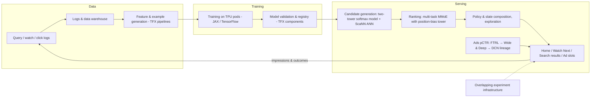
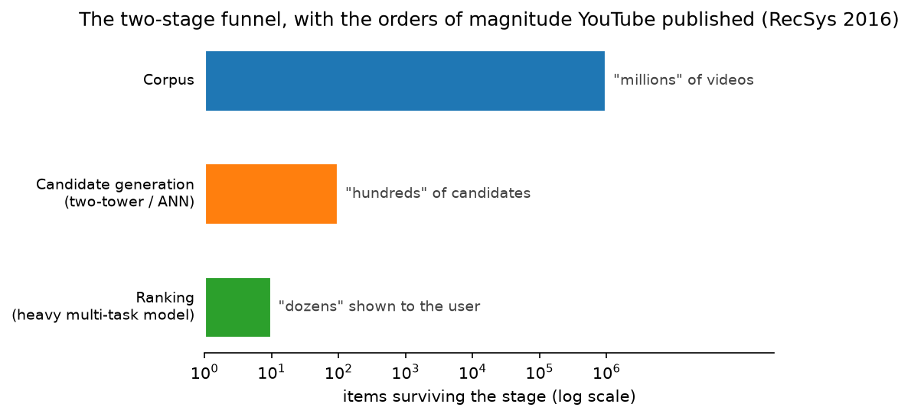

# Google & YouTube (Search, YouTube recommendations, Ads, Lens/Photos/Document AI, Gemini, TPUs)

> **Why this matters at staff level.** Google's interviews reward candidates who can connect a product problem (a query, a watch session, an ad slot, a photo) to the published system that serves it (the YouTube two-stage DNN recommender, the REINFORCE recommender with off-policy correction, Wide & Deep and DCN for CTR, BERT/MUM in Search, ScaNN for retrieval) and who can reason about TPU-era systems cost. Strong signal is citing the specific paper, naming the trade-off it encodes, and proposing an evaluation that Google's own experimentation culture would accept.

!!! warning "Sources in this chapter"
    Claims are tied to public Google/YouTube/DeepMind papers, blog posts and docs, cited by exact title, venue and year in [Sources](#sources), with a link to the primary source wherever that link could be verified (STYLE.md §4). Where a source carries no link, search the exact title. Anything not in a public source is marked **inference**.

## 1. The business in one paragraph

Alphabet's revenue is dominated by advertising on Search and YouTube, so the defining ML systems are ranking systems that must satisfy a user intent well enough to keep them coming back while pricing and placing ads precisely: web search ranking (RankBrain, BERT, MUM, and now Gemini-era generative features), YouTube's recommendation funnel (candidate generation plus ranking, with RL-based exploration research), and ads click/conversion prediction (the FTRL, Wide & Deep and DCN lineage). Around these sit perception products at consumer scale (Lens, Photos, Translate's camera mode, Document AI in Cloud) and the infrastructure that makes it all affordable: TPUs, TFX/Vertex, ScaNN and the internal experimentation platform. Google DeepMind supplies Gemini, the multimodal foundation model now embedded in Search (AI Overviews), Workspace, Android and Cloud.

## 2. The ML problems that define the company

| Problem | Why it is hard | Public evidence |
|---|---|---|
| Web search ranking | Ambiguous, long-tail queries; relevance is not clicks; hundreds of signals; spam is adversarial | "Understanding searches better than ever before" (Google, 2019, BERT in Search); "MUM: A new AI milestone for understanding information" (2021); "How AI powers great search results" (2022) |
| YouTube recommendation | Corpus of "millions" (now far more), fresh uploads, watch-time objective, surrogate-metric risk, feedback loops | "Deep Neural Networks for YouTube Recommendations" (RecSys 2016); "Recommending What Video to Watch Next: A Multitask Ranking System" (RecSys 2019); "Top-K Off-Policy Correction for a REINFORCE Recommender System" (WSDM 2019) |
| Ads CTR / CVR | Calibration for auctions, sparse high-cardinality features, online learning at extreme QPS | "Ad Click Prediction: a View from the Trenches" (KDD 2013, FTRL); "Wide & Deep Learning for Recommender Systems" (2016); "DCN V2" (WWW 2021) |
| Large-corpus retrieval | Billions of items; softmax over the corpus is intractable; ANN must be accurate at low latency | "Sampling-Bias-Corrected Neural Modeling for Large Corpus Item Recommendations" (RecSys 2019); "Mixed Negative Sampling…" (WWW 2020); "ScaNN: Accelerating Large-Scale Inference with Anisotropic Vector Quantization" (ICML 2020) |
| Consumer perception | OCR and visual search in the wild (Lens), on-device Photos features, document extraction in Cloud | Google Lens product; "Towards End-to-End Unified Scene Text Detection and Layout Analysis" (CVPR 2022); "FormNet" (ACL 2022); "Pix2Struct" (2022); "ScreenAI" (2024); Document AI docs |
| Foundation models | Multimodal from the start, long context, serving cost at Search scale | "Gemini: A Family of Highly Capable Multimodal Models" (2023); "Gemini 1.5" report (2024) |
| Infrastructure | Custom accelerators, production ML platform, experimentation at scale, technical debt | "In-Datacenter Performance Analysis of a Tensor Processing Unit" (ISCA 2017); "TPU v4" (ISCA 2023); "TFX" (KDD 2017); "Overlapping Experiment Infrastructure" (KDD 2010); "Hidden Technical Debt in Machine Learning Systems" (NeurIPS 2015); "Rules of Machine Learning" |

## 3. The stack as publicly described

*What is public:* TFX as the production platform (KDD 2017); TPUs for training and serving (ISCA 2017, 2023); the two-stage YouTube funnel with a softmax-trained candidate model and a separate ranker (RecSys 2016), its later multi-task MMoE ranker with a shallow position-bias tower (RecSys 2019), the two-tower retrieval with sampling-bias correction (RecSys 2019) and ScaNN; the FTRL → Wide & Deep → DCN lineage for CTR; the layered experiment infrastructure (KDD 2010). *Inference:* which surfaces currently use which model generation, and the interaction between the recommender and the REINFORCE policy in production, are not fully disclosed; the WSDM 2019 paper describes live experiments, not the permanent topology.

## 4. Deep dives

### 4.1 The YouTube DNN recommender (2016): the funnel that everyone copied

**The problem.** Recommend from a corpus of millions of videos, with a highly non-stationary catalogue, sparse explicit feedback and the need to optimise for watch time rather than clicks.

**The approach.** [Covington, Adams and Sargin](https://doi.org/10.1145/2959100.2959190) split the system into *candidate generation* (an extreme multi-class classification where the "class" is the next watched video, trained with sampled softmax over watch histories, search tokens and demographics, and served by nearest-neighbour search on the learned video embeddings) and *ranking*, a deep network over hundreds of features scoring the few hundred candidates, trained with weighted logistic regression where positives are weighted by watch time so the odds approximate expected watch time. Two engineering findings made the paper famous: the "example age" feature to counter the model's bias toward stale content, and the choice of *held-out next-watch* labels (predict the future watch, not a random one) to avoid leaking future information.

{ width="640" }

*Figure: the only funnel sizes YouTube put in print. The RecSys 2016 paper describes candidate generation cutting a corpus of "millions" of videos down to "hundreds", and ranking selecting the "dozens" a user sees. The bars are drawn at those orders of magnitude and labelled with the paper's own words, because the paper gives no exact counts.*

**Math link.** Weighted logistic regression: with positive weight $w = $ watch time, the learned odds are $\frac{\sum_i w_i}{N - k}$, which for small click rates approximates $\E[\text{watch time}]$; see [logistic regression](../part02-classical/02-logistic-softmax-regression.md) and [feed ranking](../part17-ml-system-design/01-recommendation-feed-ranking.md).

**The trade-off.** Two stages allow a cheap, embedding-based first stage and an expensive feature-rich second stage; the cost is that the ranker never sees candidates the generator missed, so generator recall becomes a first-class metric.

**Outcome.** The paper reports offline improvements in the surrogate metrics and successful A/B tests; the structure became the default for industry.

!!! tip "How to say it in the interview"
    "I'd structure YouTube-style recommendation as the two-stage system in Covington et al.'s RecSys 2016 paper: a candidate generator trained as a sampled-softmax classifier over next-watch labels, served by nearest-neighbour search, and a separate ranker trained with watch-time-weighted logistic regression so the score approximates expected watch time. Two decisions from that paper I'd repeat: include an 'example age' feature so the model doesn't systematically prefer old videos, and build training labels as held-out *future* watches, because random held-out labels leak the future and inflate offline metrics. I'd reject a single end-to-end model over the whole corpus, the softmax over millions of items is not servable. The trade-off is that the ranker can only reorder what the generator found, so I'd track generator recall as its own metric. Online, I'd evaluate on watch time and a retention holdout, not click-through rate."

### 4.2 Multitask ranking with MMoE and a position-bias tower (RecSys 2019)

**The problem.** Ranking must predict several conflicting outcomes (click, watch time, likes, dismissals) that share features but not optima, and clicks are corrupted by position bias.

**The approach.** ["Recommending What Video to Watch Next"](https://dl.acm.org/doi/10.1145/3298689.3346997) uses a Multi-gate Mixture-of-Experts ([MMoE, KDD 2018](https://dl.acm.org/doi/10.1145/3219819.3220007)) trunk: several expert networks with per-task softmax gates, so each task chooses its own mixture. Engagement and satisfaction heads are combined by a weighted formula tuned via experiments. A *shallow tower* takes position and device features and produces a logit that is added to the main logit during training and dropped at serving, learning the bias without polluting the relevance model.

**Math link.** MMoE output for task $k$: $f_k(x) = h_k\!\left(\sum_{e} g^{(k)}_e(x)\, E_e(x)\right)$ with gates $g^{(k)} = \softmax(W_k x)$; see [large-model architecture (MoE)](../part06-llm-training/03-large-model-architecture.md) and [evaluation](../part13-retrieval-eval-reliability/02-evaluation.md) for position-bias handling.

**The trade-off.** Soft parameter sharing (MMoE) is more expensive than a shared bottom but resolves task conflict; the shallow tower assumes position bias is additive in logit space, which is an approximation the paper accepts for cheapness.

!!! tip "How to say it in the interview"
    "For the ranking stage I'd use a multi-task model with a Mixture-of-Experts trunk and per-task gates, as YouTube's RecSys 2019 paper does, because engagement and satisfaction objectives conflict and a hard-shared bottom lets one dominate. I'd model position bias with a separate shallow tower whose logit is added in training and removed at serving, which the same paper shows is a cheap way to debias without inverse-propensity weighting. I'd reject training on raw clicks without a bias treatment; the model would learn 'position one is good'. The trade-off is the additive-logit assumption, so I'd validate it with randomised-position traffic on a small slice. Evaluation: per-task AUC offline, then the combined objective online, with satisfaction survey responses as the check that engagement is not being gamed."

### 4.3 REINFORCE with top-K off-policy correction (WSDM 2019)

**The problem.** A recommender is a policy: it changes what users see, so training on logs collected by the previous policy is biased, and myopic click prediction ignores long-term value.

**The approach.** Chen et al. ([arXiv:1812.02353](https://arxiv.org/abs/1812.02353)) treat the recommender as a policy $\pi_\theta(a \mid s)$ over a huge action space, trained with REINFORCE on logged data from a behaviour policy $\beta$, using importance weighting $\frac{\pi_\theta(a\mid s)}{\beta(a\mid s)}$ corrected for the fact that the system recommends *K* items at once (the top-K correction multiplies the gradient by $\lambda_K = K(1-\pi_\theta)^{K-1}$). The behaviour policy is estimated with a separate head on the same network. Live experiments on YouTube showed the corrected policy improved long-term metrics; the paper is explicit that off-policy correction was necessary to get gains.

**Math link.** Policy gradient and importance sampling are derived in [policy gradients & PPO](../part12-rl/04-policy-gradients-ppo.md); the top-K correction is the derivative of $1-(1-\pi)^K$.

**The trade-off.** RL gives credit for long-term engagement and exploration but is high-variance and hard to evaluate offline; the paper controls variance with weight capping and Boltzmann exploration in the served policy.

!!! tip "How to say it in the interview"
    "If asked to optimise long-term engagement rather than the next click, I'd frame the recommender as a policy and train it with REINFORCE from logged data, following Google's WSDM 2019 paper on top-K off-policy correction. Two things in that paper drive my design: importance weights against an estimated behaviour policy, because the logs come from the old recommender and are biased, and the top-K correction, because the policy serves a slate rather than one item and the naive gradient is wrong. I'd reject on-policy RL on live traffic, the exploration cost on a product with billions of sessions is unacceptable. The trade-off is variance, so I'd cap the importance weights and serve with a Boltzmann exploration layer as the paper does. Evaluation cannot be purely offline; I'd use a live experiment on a long-horizon metric with a click-model baseline, which is exactly how the paper validated it."

### 4.4 Ads CTR: FTRL → Wide & Deep → DCN

**The problem.** Predict clicks for billions of ad-query pairs with extremely sparse categorical features, under strict memory and latency budgets, while keeping predictions calibrated for the auction.

**The approach.** ["Ad Click Prediction: a View from the Trenches"](https://research.google/pubs/ad-click-prediction-a-view-from-the-trenches/) (KDD 2013) describes FTRL-Proximal online logistic regression with per-coordinate learning rates and L1 sparsity, plus practical tricks (probabilistic feature inclusion, calibration layers, and memory-saving quantisation). "Wide & Deep" ([arXiv:1606.07792](https://arxiv.org/abs/1606.07792), 2016) keeps a linear "wide" component for memorisation of cross features alongside a deep component for generalisation, deployed on Google Play. "Deep & Cross Network" (ADKDD 2017, [arXiv:1708.05123](https://arxiv.org/abs/1708.05123)) and DCN V2 (WWW 2021, [arXiv:2008.13535](https://arxiv.org/abs/2008.13535)) replace hand-crafted crosses with explicit polynomial feature crossing layers; DCN V2 reports production learnings for web-scale ranking, including low-rank mixture-of-experts cross layers to cut cost.

**Math link.** Cross layer: $x_{l+1} = x_0 \odot (W_l x_l + b_l) + x_l$, degree-$l+1$ polynomial in the input; see [ads CTR design](../part17-ml-system-design/03-ads-ctr-prediction.md) and [optimization](../part01-math/06-optimization.md) for FTRL.

**The trade-off.** Linear models with online updates are cheap and calibrated but blind to unseen crosses; deep crosses generalise but cost latency; DCN V2's low-rank crosses were explicitly chosen to keep serving cost bounded.

!!! tip "How to say it in the interview"
    "For ads CTR I'd explain the lineage Google published and pick a point on it deliberately. The 2013 FTRL paper solved the sparse online-learning problem with per-coordinate learning rates and L1 sparsity, and it insists on calibration because the score enters an auction; I'd keep that calibration layer regardless of the model. Wide & Deep in 2016 added a deep component to generalise beyond memorised crosses, and DCN V2 in 2021 replaced hand-built crosses with explicit cross layers, reporting production learnings and low-rank variants to control cost. My decision for a new system would be a DCN V2-style model with an online-updated calibration head, and I'd reject a pure DNN without explicit crossing, because DCN V2's ablations show explicit low-degree crosses are more parameter-efficient. The trade-off is inference cost, which I'd bound with the paper's low-rank mixture cross layers. Evaluation: log-loss and calibration by slice offline, revenue and advertiser outcomes online."

### 4.5 Search understanding: BERT and MUM, and what the interview really asks

**What is public.** Google's [2019 post on BERT in Search](https://blog.google/products/search/search-language-understanding-bert/) said BERT models were applied to a substantial fraction of English queries to better understand prepositions and word order; the [2021 MUM post](https://blog.google/products/search/introducing-mum/) described a multitask, multilingual, multimodal model intended to understand complex information needs across languages and modalities; the 2022 post ["How AI powers great search results"](https://blog.google/products/search/how-ai-powers-great-search-results/) lists RankBrain, neural matching, BERT and MUM as distinct systems. AI Overviews (2024) apply Gemini-era generation on top of retrieval. Details of the ranking function are not public; treat any account of "how Google ranks" as inference.

**How to reason about it.** A search-ranking design at Google is graded on separating retrieval (lexical + semantic), first-stage scoring, learned re-ranking with a cross-encoder, and the quality/spam/freshness layers, and on evaluating with human relevance ratings and interleaving rather than clicks alone, see [search ranking design](../part17-ml-system-design/02-search-ranking.md).

!!! tip "How to say it in the interview"
    "I'd be careful to separate what Google has published from what is inferred. Public posts say BERT was applied to a large share of English queries in 2019 to capture word order and prepositions, MUM in 2021 was built as a multilingual, multimodal, multitask model for complex needs, and the 2022 post lists RankBrain, neural matching, BERT and MUM as distinct components, so I'd design search understanding as a stack of systems rather than a single model. My proposal would be lexical plus dense retrieval, a cheap first-stage scorer, and a cross-encoder re-ranker over the top few hundred, with quality and freshness layers kept separate so they can be audited. I'd reject replacing the whole ranker with an LLM, since latency and auditability rule it out at Search scale; using generation on top of retrieval, as AI Overviews does, is the tractable version. Evaluation is human relevance ratings and interleaving, with clicks as a secondary signal because they are position-biased."

### 4.6 Perception at consumer scale: Lens, Photos and Document AI

**What is public.** Google Lens performs OCR, translation, visual search and product lookup from the camera; Google Research's [CVPR 2022 paper on unified scene-text detection and layout analysis](https://arxiv.org/abs/2203.15143) describes a single model that detects text and groups it into lines and paragraphs, a design that fits Lens-style scene text. FormNet ([ACL 2022](https://aclanthology.org/2022.acl-long.260/)) and Pix2Struct (2022, [arXiv:2210.03347](https://arxiv.org/abs/2210.03347)) are Google's document-understanding models, FormNet adds structural encoding to sequence models for forms, Pix2Struct pretrains a pixel-to-text model on screenshot parsing. ScreenAI (2024, [arXiv:2402.04615](https://arxiv.org/abs/2402.04615)) extends this to UI understanding. Cloud Document AI offers OCR, form and specialised parsers. Photos ships on-device features (search, Magic Eraser); the on-device models are not detailed. PaLI (2022, [arXiv:2209.06794](https://arxiv.org/abs/2209.06794)) and Gemini give Lens multimodal question answering (product-level fact; internals are **inference**).

**Why it matters.** Perception roles at Google ask you to design OCR or document extraction that works across scripts, on-device and at Cloud scale; the published papers show the preference for unified end-to-end models over multi-stage pipelines when data allows.

!!! tip "How to say it in the interview"
    "For Lens-style scene text I'd propose a unified detection-plus-layout model rather than a chain of separate detector, recogniser and line-grouper, because Google's CVPR 2022 paper argues a single model that detects text and infers its layout is both more accurate and simpler to maintain. For documents I'd separate form-like inputs, where FormNet-style structural encoding of token neighbourhoods matters, from screenshots and UIs, where a pixel-to-text model like Pix2Struct removes the OCR dependency entirely. I'd reject a pure pixel-to-text model for long dense documents (the output sequence is too long and latency suffers) and instead use OCR tokens with layout embeddings there. The trade-off is one model per document family versus a single general model; I'd start with two and merge when a multimodal model matches both. Evaluation: character and word error rate by script, field-level F1 for extraction, and on-device latency for the Lens path."

## 5. Likely interview questions

!!! interview "1. Design YouTube's 'Watch Next' recommendations."
    **Sketch.** Two-stage funnel (RecSys 2016), MMoE ranker with engagement and satisfaction heads plus position-bias tower (RecSys 2019), two-tower retrieval with log-Q correction and ScaNN, freshness via example age; evaluation on watch time, satisfaction surveys, retention. Cross-link: [feed ranking](../part17-ml-system-design/01-recommendation-feed-ranking.md).

    !!! tip "How to say it in the interview"
        "I'd build the two-stage system from YouTube's RecSys 2016 paper, upgrade the candidate generator to a two-tower model with sampling-bias correction as in Google's RecSys 2019 paper, and use the multitask MMoE ranker with a shallow position-bias tower from the 2019 'Watch Next' paper. My key decision is separating engagement heads from satisfaction heads and combining them with tuned weights, because optimising watch time alone produces clickbait, which is why YouTube added satisfaction objectives. I'd reject a single-objective ranker. The trade-off is model cost, so the ranker only scores a few hundred candidates. Evaluation: generator recall offline, then watch time with survey-based satisfaction and a long-term retention holdout online."

!!! interview "2. Your offline AUC improved 1% but the A/B is flat. Why, and what next?"
    **Sketch.** Offline metrics use logged (biased) impressions; the new model may reorder within the same candidate set; label leakage; surrogate mismatch. Check funnel recall, position bias, and whether the metric is the north star; run interleaving for sensitivity.

    !!! tip "How to say it in the interview"
        "The likeliest cause is that offline AUC is computed on impressions selected by the old policy, so the gain is on a biased slice, Google's WSDM 2019 REINFORCE paper is explicit that logs from the behaviour policy mislead naive training and evaluation. I'd check three things: whether the candidate set is the bottleneck, whether the offline label leaked future information as the 2016 YouTube paper warns, and whether AUC is even the right surrogate for the online objective. My next step is an interleaving test to get sensitivity, and an inverse-propensity-weighted offline evaluation. I wouldn't keep iterating on offline AUC; I'd fix the evaluation first."

!!! interview "3. Implement sampled softmax with log-Q correction for candidate generation (coding)."
    **Sketch.** Logits over sampled negatives, subtract $\log Q(j)$, cross-entropy on the positive; shapes $(B, 1+n_{neg})$. Cross-link: [retrieval & RAG](../part13-retrieval-eval-reliability/01-retrieval-and-rag.md).

    !!! tip "How to say it in the interview"
        "I'd build a logits tensor of shape batch by one-plus-negatives, where negatives come from the batch and from a uniform sample, subtract the log sampling probability of each item, and apply cross-entropy with index zero as the target. The correction is the one in Google's RecSys 2019 sampling-bias paper; without it in-batch negatives punish popular items. Mixing uniform negatives is Google's 2020 mixed negative sampling result, which fixes the opposite problem of never seeing tail items as negatives. I'd test by verifying that with uniform Q the loss equals plain sampled softmax and that gradients match autograd on a tiny example."

!!! interview "4. How would you build the ANN index for a corpus of two billion videos?"
    **Sketch.** Quantisation-based search (ScaNN's anisotropic quantisation prioritises the parallel component of the error, which is the component that reorders inner-product results), partition + rescore, sharding, freshness path for new uploads, recall@k at latency budget. Cross-link: [visual search & image retrieval](../part17-ml-system-design/06-visual-search-image-retrieval.md).

    !!! tip "How to say it in the interview"
        "I'd use a partitioned, quantised index with re-scoring, and specifically the anisotropic quantisation from Google's ScaNN paper (ICML 2020), because for maximum-inner-product search the error component parallel to the query vector is what changes rankings, and ScaNN's loss penalises it more. I'd shard by partition across machines and keep a small fresh index for uploads in the last hour that is merged periodically; the fresh-tier design is my inference. I'd reject brute force on GPUs at this corpus size for cost, and graph indexes alone for their memory footprint at billions of vectors. The trade-off is recall versus latency, which I'd tune by the number of partitions probed. Evaluation is recall@100 against exact search at the p99 latency budget."

!!! interview "5. Design the experimentation system for a change that touches Search ranking."
    **Sketch.** Layered/overlapping experiments (KDD 2010) so many tests share traffic; guardrail metrics; human rater evaluation and interleaving before A/B; long-term holdbacks. Cross-link: [notifications, uplift & experimentation](../part17-ml-system-design/11-notifications-uplift-experimentation.md).

    !!! tip "How to say it in the interview"
        "I'd run experiments in layers, the design Google described in its 2010 overlapping-experiment-infrastructure paper, so that ranking, UI and ads experiments can share traffic without confounding. Before an A/B I'd use human relevance ratings and interleaving, since interleaving is far more sensitive for ranking changes. I'd reject one-experiment-at-a-time traffic allocation; it doesn't scale to the number of concurrent changes. The trade-off in layering is that interactions between layers must be assumed independent, so I'd keep a small unlayered slice to detect violations. Evaluation includes long-term holdbacks, because ranking changes can trade short-term clicks for long-term trust."

!!! interview "6. Detect and read text in a street-scene photo on a phone (Lens)."
    **Sketch.** Unified detector + layout model, lightweight recogniser, script identification, on-device vs cloud split, evaluate CER/WER by script and latency. Cross-link: [OCR design](../part17-ml-system-design/09-ocr-document-understanding.md), [detection](../part04-vision/04-detection.md).

    !!! tip "How to say it in the interview"
        "I'd run a compact text detector on-device to find regions and decide whether to recognise locally or in the cloud, then a recogniser that handles multiple scripts with a script-ID head, and finally a layout stage that groups words into lines and paragraphs, Google's CVPR 2022 unified detection-and-layout paper argues for doing detection and layout in one model, which I'd adopt for the cloud path. I'd reject a monolithic cloud-only pipeline because Lens must work offline for translation. The trade-off is model size versus accuracy on-device, so I'd distil and quantise and measure accuracy loss by script. Evaluation: word error rate per script, end-to-end latency, and translation task success."

!!! interview "7. Extract fields from millions of heterogeneous invoices (Document AI)."
    **Sketch.** OCR + layout-aware encoder (FormNet-style) for token-level extraction; pixel-to-text (Pix2Struct) for screenshot-like inputs; human-in-the-loop for low confidence; field-level F1 with calibrated confidence. Cross-link: [OCR design](../part17-ml-system-design/09-ocr-document-understanding.md).

    !!! tip "How to say it in the interview"
        "I'd use OCR followed by a layout-aware sequence model with structural encoding of token neighbourhoods, which is the FormNet design Google published at ACL 2022 for forms, and I'd treat pixel-to-text models like Pix2Struct as the option for screenshot-like inputs where OCR is brittle. The decision is to keep OCR explicit for dense invoices, because field extraction needs precise character-level grounding and error attribution. The alternative, generating fields with a VLM end to end, is attractive but harder to audit and calibrate; I'd keep it as a second opinion. Trade-off: two model families to maintain. Evaluation is field-level F1 with confidence calibration so low-confidence fields route to humans."

!!! interview "8. Why does YouTube weight positives by watch time instead of predicting watch time directly?"
    **Sketch.** Regression on watch time is heavy-tailed and hard to optimise; weighted logistic regression makes odds approximate expected watch time cheaply and stays a classifier for serving. Cross-link: [logistic regression](../part02-classical/02-logistic-softmax-regression.md).

    !!! tip "How to say it in the interview"
        "YouTube's 2016 paper trains the ranker as a logistic regression where each positive is weighted by watch time, because the resulting odds approximate expected watch time when click rates are small, while direct regression on a heavy-tailed target is unstable. I'd make the same choice for a first system and revisit it with a multi-task model that predicts watch time with a robust loss once the pipeline is stable. The trade-off is the small-click-rate approximation, which I'd check by comparing implied and realised watch time by bucket."

!!! interview "9. A Gemini-based feature in Search must answer within a strict latency budget. How do you serve it?"
    **Sketch.** Retrieval first, then a distilled model for most traffic, speculative decoding, prefix caching, TPU serving with batching; evaluate with human-rated quality and latency percentiles. Cross-link: [inference systems](../part14-systems/03-inference-systems.md), [LLM assistant with RAG](../part17-ml-system-design/08-llm-product-rag-assistant.md).

    !!! tip "How to say it in the interview"
        "I'd ground the answer in retrieved results first, then generate with a model sized for the latency budget (a distilled variant of the larger model) and use prefix caching for the shared prompt and speculative decoding to cut decode latency. Google's Gemini reports describe a family of sizes precisely so that serving cost can be matched to the surface, and AI Overviews is a retrieval-then-generate product; the specific serving choices here are my inferences. I'd reject running the largest model on every query. Evaluation is human-rated accuracy against the retrieved sources, hallucination rate, and p99 latency."

!!! interview "10. How would you use TPUs efficiently for a recommendation model with huge embedding tables?"
    **Sketch.** Embedding tables sharded across TPU HBM with dedicated embedding lookup support, dense layers on the matrix units; batch size to saturate; roofline reasoning. Cross-link: [hardware, memory & roofline](../part14-systems/04-hardware-memory-roofline.md).

    !!! tip "How to say it in the interview"
        "I'd shard the embedding tables across the pod's HBM and use the hardware's embedding-lookup support, keeping the dense MLPs on the matrix units; Google's TPU v4 paper describes a dedicated path for embeddings because recommendation lookups are bandwidth-bound. I'd reject packing the tables on host memory for training, since lookups over PCIe would dominate. The trade-off is HBM capacity, so I'd quantise cold tables. Evaluation is achieved memory bandwidth against roofline and step time at fixed quality."

!!! interview "11. Design content moderation for uploads at YouTube scale."
    **Sketch.** Fingerprint matching (Content ID-like) for known material, then classifiers per policy, human review by confidence; measure prevalence via sampling (YouTube's violative view rate). Cross-link: [content moderation](../part17-ml-system-design/07-content-moderation.md).

    !!! tip "How to say it in the interview"
        "I'd layer a hash and fingerprint match for known violating material, which is the cheap and precise first line, in front of multimodal classifiers per policy, with human review above a confidence band. YouTube publicly reports a violative view rate estimated by sampling, and I'd make that my north-star metric rather than classifier accuracy. I'd reject training one generic 'bad content' classifier because policies differ in cost of error. The trade-off is reviewer volume, tuned through the confidence thresholds. Evaluation is prevalence plus appeal-overturn rate as the precision check."

!!! interview "12. What does 'hidden technical debt' look like in a ranking system, and how do you prevent it?"
    **Sketch.** Entanglement (CACE), undeclared consumers, feedback loops, pipeline jungles, configuration debt; prevention via feature ownership, data validation (TFX), monitoring. Cross-link: [ML platform & monitoring](../part17-ml-system-design/12-ml-platform-feature-store-monitoring.md).

    !!! tip "How to say it in the interview"
        "Google's NeurIPS 2015 paper on hidden technical debt names the failure modes I'd guard against: changing anything changes everything, undeclared consumers of model outputs, hidden feedback loops between the ranker and its training data, and pipeline jungles. My prevention plan is the one TFX encodes (schema-based data validation, versioned features, and model validation gates) plus explicit ownership of features and a rule that no downstream system consumes a score without registering. I'd reject 'move fast and fix later' for ranking because feedback loops make debt compound. Evaluation is operational: skew alerts, time to root-cause an incident, and the number of undocumented consumers found in audits."

## 6. What to bring from your background

* **OCR and document understanding**: Lens, Translate camera, Photos and Cloud Document AI are exactly your problem space; talk about multi-script recognition, layout modelling, extraction F1 and on-device constraints, and be ready to compare OCR-then-encode against pixel-to-text.
* **Detection at scale**: YouTube thumbnails and video frames, Shopping images, Maps imagery, emphasise data pipelines, hard-negative mining and evaluation by slice.
* **ML systems**: Google expects TFX-style rigour (data validation, model validation, skew detection) and fluency with roofline arguments for TPUs.
* **Recsys literacy**: know the 2016, 2019 (both) and WSDM 2019 YouTube papers cold; they are cited in interviews across Google.

## Sources

**YouTube and recommendation**

* Covington, Adams, Sargin, "Deep Neural Networks for YouTube Recommendations", RecSys 2016. [doi:10.1145/2959100.2959190](https://doi.org/10.1145/2959100.2959190)
* Zhao et al., "Recommending What Video to Watch Next: A Multitask Ranking System", RecSys 2019. [ACM DL](https://dl.acm.org/doi/10.1145/3298689.3346997)
* Ma et al., "Modeling Task Relationships in Multi-task Learning with Multi-gate Mixture-of-Experts", KDD 2018. [ACM DL](https://dl.acm.org/doi/10.1145/3219819.3220007)
* Chen et al., "Top-K Off-Policy Correction for a REINFORCE Recommender System", WSDM 2019. [arXiv:1812.02353](https://arxiv.org/abs/1812.02353)
* Yi et al., "Sampling-Bias-Corrected Neural Modeling for Large Corpus Item Recommendations", RecSys 2019. [ACM DL](https://dl.acm.org/doi/10.1145/3298689.3346996) · [research.google](https://research.google/pubs/sampling-bias-corrected-neural-modeling-for-large-corpus-item-recommendations/)
* Yang et al., "Mixed Negative Sampling for Learning Two-tower Neural Networks in Recommendations", WWW 2020 companion. [ACM DL](https://dl.acm.org/doi/10.1145/3366424.3386195)
* Guo et al., "Accelerating Large-Scale Inference with Anisotropic Vector Quantization", ICML 2020 (the paper behind the ScaNN library). [arXiv:1908.10396](https://arxiv.org/abs/1908.10396) · [PMLR](https://proceedings.mlr.press/v119/guo20h.html) · [research.google blog](https://research.google/blog/announcing-scann-efficient-vector-similarity-search/)
* Ie et al., "SlateQ: A Tractable Decomposition for Reinforcement Learning with Recommendation Sets", IJCAI 2019. [ijcai.org](https://www.ijcai.org/proceedings/2019/360)

**Ads**

* McMahan et al., "Ad Click Prediction: a View from the Trenches", KDD 2013. [research.google](https://research.google/pubs/ad-click-prediction-a-view-from-the-trenches/) · [ACM DL](https://dl.acm.org/doi/10.1145/2487575.2488200)
* Cheng et al., "Wide & Deep Learning for Recommender Systems", 2016. [arXiv:1606.07792](https://arxiv.org/abs/1606.07792)
* Wang et al., "Deep & Cross Network for Ad Click Predictions", ADKDD 2017. [arXiv:1708.05123](https://arxiv.org/abs/1708.05123) · Wang et al., "DCN V2: Improved Deep & Cross Network and Practical Lessons for Web-scale Learning to Rank Systems", WWW 2021. [arXiv:2008.13535](https://arxiv.org/abs/2008.13535)

**Search and foundation models**

* Google, "Understanding searches better than ever before", 2019 ([blog.google](https://blog.google/products/search/search-language-understanding-bert/)); "MUM: A new AI milestone for understanding information", 2021 ([blog.google](https://blog.google/products/search/introducing-mum/)); "How AI powers great search results", 2022 ([blog.google](https://blog.google/products/search/how-ai-powers-great-search-results/)).
* Devlin et al., "BERT: Pre-training of Deep Bidirectional Transformers for Language Understanding", NAACL 2019. [arXiv:1810.04805](https://arxiv.org/abs/1810.04805) · [ACL Anthology](https://aclanthology.org/N19-1423/)
* Gemini Team, "Gemini: A Family of Highly Capable Multimodal Models", 2023. [arXiv:2312.11805](https://arxiv.org/abs/2312.11805) · "Gemini 1.5: Unlocking multimodal understanding across millions of tokens of context", 2024. [arXiv:2403.05530](https://arxiv.org/abs/2403.05530)

**Perception and documents**

* Long et al., "Towards End-to-End Unified Scene Text Detection and Layout Analysis", CVPR 2022. [arXiv:2203.15143](https://arxiv.org/abs/2203.15143) · [CVF Open Access](https://openaccess.thecvf.com/content/CVPR2022/html/Long_Towards_End-to-End_Unified_Scene_Text_Detection_and_Layout_Analysis_CVPR_2022_paper.html)
* Lee et al., "FormNet: Structural Encoding beyond Sequential Modeling in Form Document Information Extraction", ACL 2022. [ACL Anthology](https://aclanthology.org/2022.acl-long.260/) · [arXiv:2203.08411](https://arxiv.org/abs/2203.08411)
* Lee et al., "Pix2Struct: Screenshot Parsing as Pretraining for Visual Language Understanding", 2022. [arXiv:2210.03347](https://arxiv.org/abs/2210.03347) · Baechler et al., "ScreenAI: A Vision-Language Model for UI and Infographics Understanding", 2024. [arXiv:2402.04615](https://arxiv.org/abs/2402.04615)
* Chen et al., "PaLI: A Jointly-Scaled Multilingual Language-Image Model", 2022 (ICLR 2023). [arXiv:2209.06794](https://arxiv.org/abs/2209.06794)
* Google Cloud Document AI documentation ([cloud.google.com/document-ai](https://cloud.google.com/document-ai), [overview](https://docs.cloud.google.com/document-ai/docs/overview)); Google Lens ([lens.google](https://lens.google), [blog.google on Lens shopping results](https://blog.google/products-and-platforms/products/shopping/visual-search-lens-shopping/)).

**Infrastructure and practice**

* Jouppi et al., "In-Datacenter Performance Analysis of a Tensor Processing Unit", ISCA 2017. [arXiv:1704.04760](https://arxiv.org/abs/1704.04760) · Jouppi et al., "TPU v4: An Optically Reconfigurable Supercomputer for Machine Learning with Hardware Support for Embeddings", ISCA 2023. [arXiv:2304.01433](https://arxiv.org/abs/2304.01433)
* Baylor et al., "TFX: A TensorFlow-Based Production-Scale Machine Learning Platform", KDD 2017. [ACM DL](https://dl.acm.org/doi/10.1145/3097983.3098021) · [research.google](https://research.google/pubs/tfx-a-tensorflow-based-production-scale-machine-learning-platform/)
* Tang et al., "Overlapping Experiment Infrastructure: More, Better, Faster Experimentation", KDD 2010. [research.google](https://research.google/pubs/overlapping-experiment-infrastructure-more-better-faster-experimentation/) · [ACM DL](https://dl.acm.org/doi/10.1145/1835804.1835810)
* Sculley et al., "Hidden Technical Debt in Machine Learning Systems", NeurIPS 2015. [papers.nips.cc](https://papers.nips.cc/paper/5656-hidden-technical-debt-in-machine-learning-systems)
* Zinkevich, "Rules of Machine Learning: Best Practices for ML Engineering", Google Developers. [developers.google.com](https://developers.google.com/machine-learning/guides/rules-of-ml)
