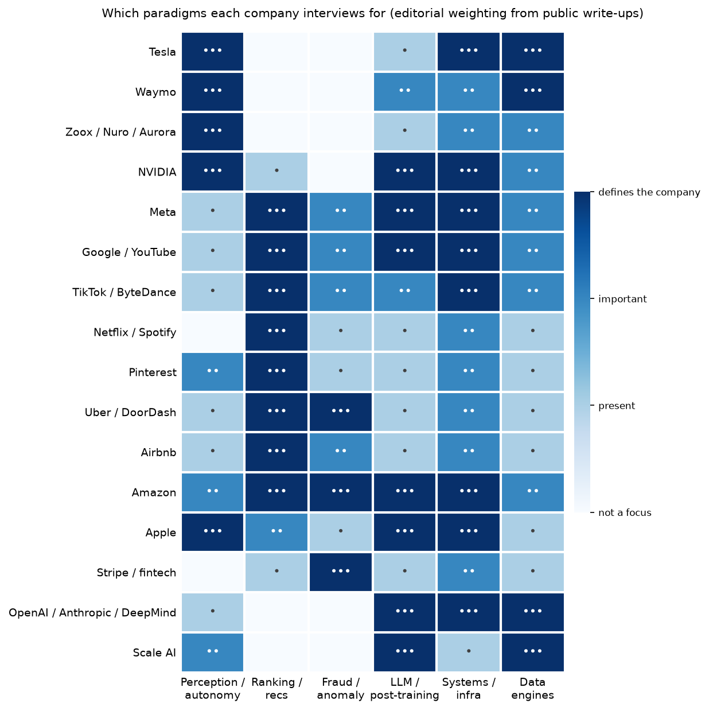
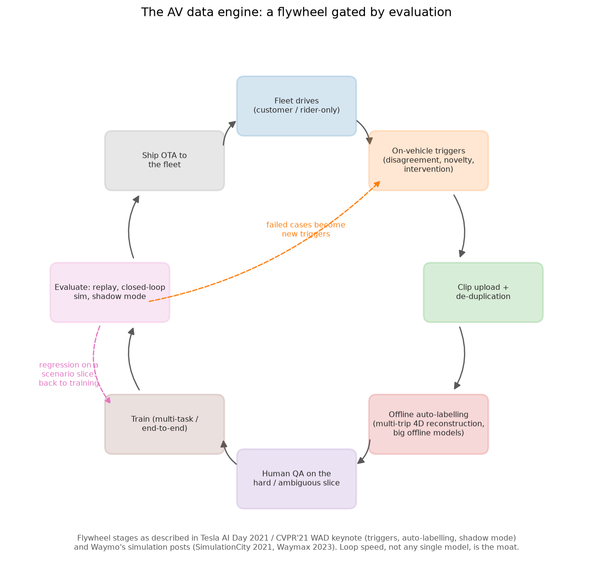
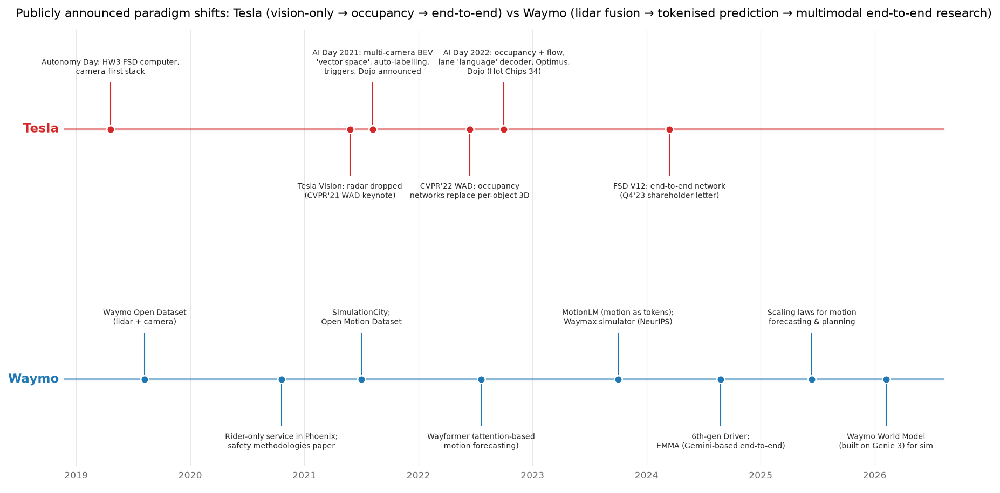

# Part XVIII: Company deep dives

> **Why this matters at staff level.** Staff interviews at these companies are not
> abstract. The system-design prompt is their own product ("design the perception
> stack for a rider-only robotaxi", "design the RLHF data pipeline for our next model"),
> the ML-depth questions follow the choices their engineering blogs already describe,
> and the strongest signal is a candidate who can say *why* the company chose what it
> chose, what it rejected, and how it measures the result. This part personalises
> Part XVII to sixteen companies using only their public write-ups.

## How to use the deep dives

Each company page has the same six sections, so you can read one in forty minutes the
night before a loop:

1. **The business in one paragraph** and **the ML problems that define the company**
   (problem → why it is hard → public evidence).
2. **The stack as publicly described**: a mermaid diagram assembled from talks, papers
   and blog posts, with what is *known* separated from what is *inferred*.
3. **Deep dives**: three to six mini-chapters on paradigms the company owns, each with
   the problem, the approach (linked to the technique chapter that derives the math),
   the trade-off they chose versus the alternative, the sources, and a boxed
   *"How to say it in the interview"* script.
4. **Likely interview questions** (10–15) phrased as their business problem, each with a
   staff-level answer sketch and a script that cites the public source behind the
   rationale.
5. **What to bring from your background**: how large-scale perception / OCR / detection
   plus ML-systems experience maps onto their problems.
6. **Sources**: verified links grouped by type. Where a link could not be verified we
   give the title, venue and year instead.

Two rules the pages follow, and that you should follow in the room: **never attribute
a design choice to a company without a public source**, and **mark inferences as
inferences** ("the AI Day talk implies…"). Interviewers at these companies know what
is public and what is not; confident claims about their internals are a red flag.

The scripts use a fixed shape borrowed from Hello Interview: *decision → rejected
alternative → trade-off → how I would evaluate it*, in the first person, six to
twelve sentences, with a named paper, talk or blog post carrying the rationale.

## Companies × paradigms

{ width="640" }

The heatmap is an editorial weighting of what each company's public engineering
write-ups emphasise (••• defines the company, •• important, • present). Read down a
column to see who else interviews for the paradigm you are strongest in; read across a
row to see which chapters a given loop will draw on.

| Company | Perception / autonomy | Ranking / recs | Fraud / anomaly | LLM / post-training | Systems / infra | Data engines |
|---|:-:|:-:|:-:|:-:|:-:|:-:|
| [Tesla](tesla.md) | ••• | | | • | ••• | ••• |
| [Waymo](waymo.md) | ••• | | | •• | •• | ••• |
| [Zoox, Nuro, Aurora](zoox-nuro-aurora.md) | ••• | | | • | •• | •• |
| [NVIDIA](nvidia.md) | ••• | • | | ••• | ••• | •• |
| [Meta](meta.md) | • | ••• | •• | ••• | ••• | •• |
| [Google & YouTube](google-youtube.md) | • | ••• | •• | ••• | ••• | •• |
| [TikTok / ByteDance](tiktok-bytedance.md) | • | ••• | •• | •• | ••• | •• |
| [Netflix & Spotify](netflix-spotify.md) | | ••• | • | • | •• | • |
| [Pinterest](pinterest.md) | •• | ••• | • | • | •• | • |
| [Uber & DoorDash](uber-doordash.md) | • | ••• | ••• | • | •• | • |
| [Airbnb](airbnb.md) | • | ••• | •• | • | •• | • |
| [Amazon](amazon.md) | •• | ••• | ••• | ••• | ••• | •• |
| [Apple](apple.md) | ••• | •• | • | ••• | ••• | • |
| [Stripe & fintech](stripe-fintech.md) | | • | ••• | • | •• | • |
| [OpenAI, Anthropic & DeepMind](frontier-labs.md) | • | | | ••• | ••• | ••• |
| [Scale AI & data engines](scale-ai-data-engines.md) | •• | | | ••• | • | ••• |

## Which Part XVII chapters to master for each company

The system-design round is graded on the [framework](../part17-ml-system-design/00-framework.md):
requirements, trade-offs, a committed decision, and the reasoning. The table names the
two or three Part XVII chapters whose *structure* you should be able to reproduce cold
for each company, plus the technique parts they lean on.

| Company | Part XVII chapters to master | Technique parts that carry the depth round |
|---|---|---|
| Tesla | [AV perception](../part17-ml-system-design/05-perception-system-av.md), [ML platform & monitoring](../part17-ml-system-design/12-ml-platform-feature-store-monitoring.md) | [XI Perception & autonomy](../part11-perception-autonomy/index.md), [X Weak supervision & auto-labelling](../part10-self-supervised/03-weak-supervision-and-auto-labeling.md), [XIV Systems](../part14-systems/index.md), [XII Imitation learning](../part12-rl/05-imitation-learning.md) |
| Waymo | [AV perception](../part17-ml-system-design/05-perception-system-av.md), [Evaluation](../part13-retrieval-eval-reliability/02-evaluation.md) (treat as a design chapter), [ML platform](../part17-ml-system-design/12-ml-platform-feature-store-monitoring.md) | [XI Sensor fusion](../part11-perception-autonomy/03-sensor-fusion.md), [XI Prediction & planning](../part11-perception-autonomy/06-prediction-planning.md), [XI World models](../part11-perception-autonomy/07-world-models.md), [VIII VLM architecture](../part08-multimodal/04-vlm-architecture.md), [XIII Uncertainty & reliability](../part13-retrieval-eval-reliability/03-uncertainty-reliability.md) |
| Zoox, Nuro, Aurora | [AV perception](../part17-ml-system-design/05-perception-system-av.md), [Forecasting & ETA](../part17-ml-system-design/10-forecasting-eta.md) (for fleet ops) | [XI Sensor fusion](../part11-perception-autonomy/03-sensor-fusion.md), [XI Tracking](../part11-perception-autonomy/04-tracking.md), [XII Imitation learning](../part12-rl/05-imitation-learning.md), [XV Safety & failure modes](../part15-interpretability-safety/02-safety-failure-modes.md) |
| NVIDIA | [AV perception](../part17-ml-system-design/05-perception-system-av.md), [LLM assistant with RAG](../part17-ml-system-design/08-llm-product-rag-assistant.md) (for inference-serving roles), [ML platform](../part17-ml-system-design/12-ml-platform-feature-store-monitoring.md) | [XIV Hardware, memory & roofline](../part14-systems/04-hardware-memory-roofline.md), [XIV Inference systems](../part14-systems/03-inference-systems.md), [VI Quantization](../part06-llm-training/05-quantization.md), [IX Diffusion](../part09-generative/03-diffusion.md), [XI World models](../part11-perception-autonomy/07-world-models.md) |
| Meta, Google/YouTube, TikTok | [Feed ranking](../part17-ml-system-design/01-recommendation-feed-ranking.md), [Ads CTR](../part17-ml-system-design/03-ads-ctr-prediction.md), [Content moderation](../part17-ml-system-design/07-content-moderation.md) | [II Classical ML](../part02-classical/index.md), [XIII Retrieval](../part13-retrieval-eval-reliability/01-retrieval-and-rag.md), [XIV Systems](../part14-systems/index.md), [VII Post-training](../part07-post-training/index.md) |
| Netflix, Spotify, Pinterest | [Feed ranking](../part17-ml-system-design/01-recommendation-feed-ranking.md), [Visual search](../part17-ml-system-design/06-visual-search-image-retrieval.md), [Notifications & experimentation](../part17-ml-system-design/11-notifications-uplift-experimentation.md) | [VIII CLIP & contrastive](../part08-multimodal/03-clip-contrastive.md), [XIII Retrieval](../part13-retrieval-eval-reliability/01-retrieval-and-rag.md), [I Statistics](../part01-math/04-statistics.md) |
| Uber, DoorDash, Airbnb | [Forecasting & ETA](../part17-ml-system-design/10-forecasting-eta.md), [Search ranking](../part17-ml-system-design/02-search-ranking.md), [Fraud](../part17-ml-system-design/04-fraud-anomaly-detection.md) | [II Trees & ensembles](../part02-classical/03-trees-and-ensembles.md), [XIII Uncertainty](../part13-retrieval-eval-reliability/03-uncertainty-reliability.md), [XVII Experimentation](../part17-ml-system-design/11-notifications-uplift-experimentation.md) |
| Amazon | [Search ranking](../part17-ml-system-design/02-search-ranking.md), [Fraud](../part17-ml-system-design/04-fraud-anomaly-detection.md), [OCR & document understanding](../part17-ml-system-design/09-ocr-document-understanding.md), [LLM assistant](../part17-ml-system-design/08-llm-product-rag-assistant.md) | [IV Detection](../part04-vision/04-detection.md), [XIII Retrieval](../part13-retrieval-eval-reliability/01-retrieval-and-rag.md), [XIV Inference systems](../part14-systems/03-inference-systems.md) |
| Apple | [Visual search](../part17-ml-system-design/06-visual-search-image-retrieval.md), [OCR & document understanding](../part17-ml-system-design/09-ocr-document-understanding.md), [LLM assistant](../part17-ml-system-design/08-llm-product-rag-assistant.md) | [VI Quantization](../part06-llm-training/05-quantization.md), [VI Fine-tuning & LoRA](../part06-llm-training/06-fine-tuning-lora.md), [IV Vision](../part04-vision/index.md) |
| Stripe & fintech | [Fraud & anomaly](../part17-ml-system-design/04-fraud-anomaly-detection.md), [ML platform](../part17-ml-system-design/12-ml-platform-feature-store-monitoring.md) | [II Classical ML](../part02-classical/index.md), [XIII Uncertainty](../part13-retrieval-eval-reliability/03-uncertainty-reliability.md), [I Statistics](../part01-math/04-statistics.md) |
| OpenAI, Anthropic, DeepMind | [LLM assistant with RAG](../part17-ml-system-design/08-llm-product-rag-assistant.md), [ML platform](../part17-ml-system-design/12-ml-platform-feature-store-monitoring.md), [Content moderation](../part17-ml-system-design/07-content-moderation.md) (as safety classifiers) | [VI LLM training](../part06-llm-training/index.md), [VII Post-training](../part07-post-training/index.md), [XIV Systems](../part14-systems/index.md), [XV Interpretability & safety](../part15-interpretability-safety/index.md), [XIII Evaluation](../part13-retrieval-eval-reliability/02-evaluation.md) |
| Scale AI & data engines | [ML platform](../part17-ml-system-design/12-ml-platform-feature-store-monitoring.md), [AV perception](../part17-ml-system-design/05-perception-system-av.md) (the labelling half), [LLM assistant](../part17-ml-system-design/08-llm-product-rag-assistant.md) (the eval half) | [X Weak supervision & auto-labelling](../part10-self-supervised/03-weak-supervision-and-auto-labeling.md), [VII Reward models](../part07-post-training/02-reward-models.md), [XIII Evaluation](../part13-retrieval-eval-reliability/02-evaluation.md) |

## The pages

**Autonomy, robotics, hardware and frontier labs**

* [Tesla (Autopilot / FSD / Optimus)](tesla.md). vision-only multi-camera BEV → occupancy → end-to-end FSD V12; the data engine; Dojo; Optimus.
* [Waymo](waymo.md). lidar-centric fusion, Wayformer / MotionLM prediction, Waymax and closed-loop evaluation, EMMA, the safety framework and rider-only metrics.
* [Zoox, Nuro, Aurora & robotaxi peers](zoox-nuro-aurora.md). a purpose-built bidirectional vehicle, a licensable AI-first driver, and a verifiable-AI trucking stack.
* [NVIDIA (DRIVE, Cosmos, Isaac)](nvidia.md). DRIVE platform, Hydra-MDP, Cosmos world foundation models, GR00T, TensorRT-LLM / Dynamo, training infra.
* [OpenAI, Anthropic & DeepMind](frontier-labs.md). pretraining and scaling, post-training (RLHF / Constitutional AI / RLVR / reasoning), evals and safety frameworks, inference, multimodal, agents.
* [Scale AI & data engines](scale-ai-data-engines.md). the data-engine business, RLHF data, SEAL evaluations, AV labelling and auto-labelling, label cost/quality trade-offs.

**Consumer, marketplace and fintech** (written by the other author of this part)

* [Meta (Feed, Reels, Ads, FAIR)](meta.md)
* [Google & YouTube](google-youtube.md)
* [TikTok / ByteDance](tiktok-bytedance.md)
* [Netflix & Spotify](netflix-spotify.md)
* [Pinterest](pinterest.md)
* [Uber & DoorDash](uber-doordash.md)
* [Airbnb](airbnb.md)
* [Amazon](amazon.md)
* [Apple](apple.md)
* [Stripe & fintech fraud](stripe-fintech.md)

## Two figures that recur across the autonomy pages

{ width="640" }

The flywheel above is the shape behind every AV page: fleet → triggers → upload →
offline auto-labelling → human QA on the hard slice → training → evaluation → OTA.
Look at the two dashed chords: evaluation feeds *backwards* into both triggers and
training, which is why a company's evaluation stack determines its iteration speed.

{ width="720" }

The timeline shows that the two best-documented AV programmes moved in the same
direction (more learned structure, fewer hand-written interfaces) from opposite
starting points: Tesla from cameras and fleet scale, Waymo from lidar and a safety
case. In an interview, being able to place a question on this timeline ("that was the
occupancy era; V12 changed the interface") is itself a signal.
