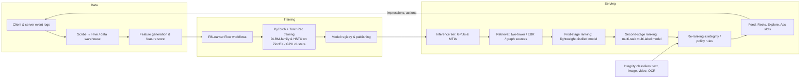

# Meta (Feed, Reels, Ads, Integrity, FAIR, Reality Labs)

> **Why this matters at staff level.** Meta interviews for ranking, ads, integrity and Reality Labs roles are graded on whether you can reason about *their* funnel: billions of candidates, a strict per-request compute budget, multi-task objectives that trade engagement against integrity and advertiser value, and models that must retrain continuously. Strong signal is naming the published design (DLRM, the Instagram Explore funnel, HSTU, Few-Shot Learner, SAM/DINOv2), saying what trade-off it encodes, and committing to a decision with an evaluation plan.

!!! warning "Sources in this chapter"
    Every claim below is tied to a public Meta paper, engineering post or talk, cited by exact title, venue and year in [Sources](#sources). URLs are omitted where they could not be verified in the build environment (STYLE.md §4); search the exact title. Anything not in a public source is marked **inference**.

## 1. The business in one paragraph

Meta monetises attention across Facebook, Instagram, WhatsApp, Messenger and Threads almost entirely through ads, so its two core ML systems are the content-ranking stack (Feed, Reels, Stories, Explore, Search, notifications) that earns the attention and the ads stack (retrieval, pCTR/pCVR, auction, pacing, measurement) that sells it. Both sit on a shared substrate (PyTorch, FBLearner, feature stores, embedding-heavy recommendation models on custom hardware (ZionEX, MTIA)) and both are policed by integrity systems that must remove harmful content in every language and modality at feed speed. FAIR and GenAI produce the foundation models (Llama, SAM, DINOv2, SeamlessM4T, Chameleon) that increasingly flow into product, and Reality Labs builds the always-on perception stack for Ray-Ban Meta glasses, Quest and the Orion AR prototype, where egocentric video, on-device latency and privacy constrain everything.

## 2. The ML problems that define the company

| Problem | Why it is hard | Public evidence |
|---|---|---|
| Feed / Reels / Explore ranking | Billions of candidates, ms latency, many correlated engagement labels, fast-drifting content (Reels), fairness of exposure to creators | "Scaling the Instagram Explore recommendations system" (Meta Engineering, 2023); "Powered by AI: Instagram's Explore recommender system" (Meta AI, 2019); HSTU paper (ICML 2024) |
| Ads ranking | pCTR/pCVR calibration feeds a real auction; conversion labels are delayed and increasingly missing after iOS ATT; advertiser value ≠ user value | "Practical Lessons from Predicting Clicks on Ads at Facebook" (ADKDD 2014); Meta Engineering's 2024 post on sequence learning for personalized ads recommendations; Meta's 2023 post on the "Lattice" ads model architecture |
| Embedding models at scale | Terabyte embedding tables; training is memory- and communication-bound, not FLOP-bound | DLRM (arXiv 1906.00091, 2019); "Software-Hardware Co-design for Fast and Scalable Training of Deep Learning Recommendation Models" (ISCA 2022, ZionEX); TorchRec |
| Integrity / moderation | Adversarial, multilingual, multimodal; policy changes faster than labelled data can be collected; precision at enormous volume | "Harmful content can evolve quickly. Our new AI system adapts to tackle it" (Meta AI, 2021, Few-Shot Learner); "Rosetta: Understanding text in images and videos with machine learning" (Facebook Engineering, 2018); Community Standards Enforcement Reports |
| Search | Personalised social search: retrieval must respect the social graph and typo-heavy, short queries | "Embedding-based Retrieval in Facebook Search" (KDD 2020); "Que2Search" (KDD 2021) |
| Foundation models | Open-weight LLM at frontier scale; segmentation and self-supervised vision backbones that ship into product | "The Llama 3 Herd of Models" (2024); "Segment Anything" (ICCV 2023); "SAM 2" (2024); "DINOv2" (2023) |
| Reality Labs perception | Egocentric, always-on cameras; thermal and battery budgets; privacy; hand/eye tracking; scene understanding for AR | "Ego4D" (CVPR 2022); Project Aria (research glasses); Ray-Ban Meta multimodal "look and ask" (2024); Orion AR prototype (Connect 2024) |
| ML infrastructure | Thousands of models retrained continuously; feature freshness; inference on custom silicon | "Introducing FBLearner Flow" (2016); "MTIA v1" (2023) and next-generation MTIA (2024); PyTorch (NeurIPS 2019) |

## 3. The stack as publicly described

*What is public:* Scribe/Hive as the logging and warehouse layer; FBLearner Flow as the workflow platform (2016 post); PyTorch, TorchRec and DLRM as the model substrate; ZionEX as the training platform for DLRM (ISCA 2022); MTIA as an inference accelerator for ranking (2023/2024 posts); the four-stage Explore funnel (retrieval, first-stage ranking, second-stage ranking, final re-ranking) with a two-tower retrieval model and a distilled lightweight first-stage ranker (2023 Explore post); integrity classifiers applied before content is shown. *Inference:* the exact registry/publish mechanism and which models run on MTIA versus GPU at any moment are not disclosed; the diagram draws the common shape.

## 4. Deep dives

### 4.1 DLRM → HSTU: how Meta's recommender models scaled

**The problem.** Recommendation models are dominated by sparse categorical features (user IDs, post IDs, page IDs) that must be embedded; the dense MLP part is small. That makes them memory- and bandwidth-bound rather than FLOP-bound, and it makes naïve "scale the transformer" recipes fail.

**The approach.** DLRM (2019) fixed the template: embedding tables for sparse features, a bottom MLP for dense features, explicit pairwise feature interactions (dot products between embeddings), and a top MLP producing $p(\text{click})$. Training is a hybrid of model parallelism for the embedding tables (sharded across devices) and data parallelism for the MLPs, connected by an all-to-all exchange of embedding lookups. The ISCA 2022 paper on ZionEX describes the co-designed training platform for trillion-parameter-scale DLRMs, where the communication pattern is the design constraint. HSTU ("Actions Speak Louder than Words", ICML 2024) reframed ranking and retrieval as *generative* sequential transduction over a user's action sequence: a modified attention block (pointwise, no softmax normalisation, with relative time/position bias) that scales to long sequences and reports scaling behaviour with compute in a way DLRM-style models do not, plus an inference algorithm (M-FALCON) that amortises attention across candidates. The paper reports online metric wins on Meta surfaces and deployment at trillion-parameter scale.

**Math link.** The feature-interaction layer computes $z_{ij} = \langle e_i, e_j \rangle$ for embeddings $e_i \in \R^{d}$, a factorization-machine term; see [attention mathematics](../part05-sequence-transformers/03-attention-mathematics.md) for the HSTU-style sequence encoder, and [distributed training](../part14-systems/01-distributed-training.md) for the all-to-all pattern.

**The trade-off they chose.** DLRM's explicit interactions and sharded tables cost communication but keep memory feasible for billions of IDs; the alternative (hashing IDs into small tables) collides and degrades quality (see [TikTok/ByteDance](tiktok-bytedance.md) on collisionless tables). HSTU trades the cheap DLRM forward pass for a sequence model whose cost grows with history length, justified by better scaling with compute.

**Outcome.** DLRM became the MLPerf recommendation benchmark and the open reference for the industry; HSTU reports substantial online improvements and is described as deployed on multiple surfaces (ICML 2024 paper). Exact metric values are in the paper; do not quote them from memory.

!!! tip "How to say it in the interview"
    "If you asked me to design the ranking model for a Meta-scale feed I'd start from the DLRM template (sharded embedding tables, dense MLP, explicit feature interactions) because Meta's 2019 DLRM paper and its ISCA 2022 ZionEX paper show the bottleneck is embedding memory and all-to-all communication, not FLOPs. I'd reject a hashed small-table design: collisions on user and item IDs silently degrade quality, which is exactly what ByteDance's Monolith paper documents. The trade-off I accept is communication cost, so I'd co-locate tables by access frequency and quantise cold rows. Then I'd run a second track evaluating a sequential generative ranker, because Meta's HSTU paper (ICML 2024) reports that reframing ranking as sequence transduction scales with compute where DLRM-style models plateau. I'd gate the migration on offline NE/AUC parity at matched serving cost, then an online A/B on the surface's north-star metric with integrity guardrails. The thing I wouldn't do is claim HSTU's published gains for our surface. those numbers are theirs, and I'd measure our own."

### 4.2 The Instagram Explore funnel: retrieval, distillation, multi-task ranking

**The problem.** Explore recommends unconnected content: no social-graph prior, billions of candidates, mostly fresh Reels. Meta's 2023 post describes a four-stage funnel and explains why each stage exists.

**The approach (as published).** Retrieval uses several sources, including *two-tower* neural networks (a user tower and an item tower trained so that the dot product predicts engagement) with the item tower's embeddings indexed for ANN search, plus "user interactions history" sources that expand from things the user recently engaged with. The first-stage ranker is deliberately lightweight: a two-tower model *distilled* from the heavier second-stage model so it can score thousands of candidates cheaply and stay aligned with the final ranker. The second-stage ranker is a multi-task multi-label (MTML) neural network predicting several engagement events (the post lists actions such as like, save, share and see-less); an *expected value* formula combines the predicted probabilities with per-action weights into a single score. A final re-ranking stage applies business and integrity rules (diversity, de-duplication, "see less"/integrity filters). The 2019 "Powered by AI" post describes the earlier system: account embeddings ("ig2vec", trained word2vec-style on account-interaction sequences) for retrieval and a distilled lightweight ranker before the heavy model.

**Math link.** Two-tower retrieval is [in-batch contrastive learning](../part08-multimodal/03-clip-contrastive.md) with sampling-bias correction; the value model is $\text{score} = \sum_k w_k\, p_k(\text{action}_k \mid u, i)$; see [feed ranking design](../part17-ml-system-design/01-recommendation-feed-ranking.md).

**The trade-off.** Distilling the first-stage ranker from the second-stage keeps the funnel consistent (candidates the heavy model would like are not discarded early) at the cost of retraining the light model whenever the heavy one moves. The alternative (a heuristic first stage) is cheaper but leaks good candidates.

**Outcome.** The post presents the architecture and not metric deltas; treat its value as design evidence.

!!! tip "How to say it in the interview"
    "For unconnected-content recommendation I'd build the funnel Instagram describes in its 2023 Explore post: multi-source retrieval led by a two-tower model with ANN over item embeddings, a lightweight first-stage ranker distilled from the second-stage model, a multi-task multi-label second stage, and a rules-based re-ranker for diversity and integrity. The decision I'd defend hardest is distillation for the first stage: the alternative, a hand-tuned heuristic filter, is cheaper to maintain but discards candidates the final ranker would have loved, and the Explore post says explicitly that the light model is trained to mimic the heavy one. The trade-off is operational (every heavy-model retrain forces a light-model retrain) so I'd automate that in the training DAG. I'd combine the multi-task outputs with an explicit expected-value formula so product can tune weights without retraining, as the post describes. For evaluation I'd measure recall@k of the funnel against the heavy model's top list offline, then A/B on time spent and 'see less' rate together. The inference I'd flag as mine is the sizing of each stage. Meta has not published the exact candidate counts."

### 4.3 Ads: from GBDT + logistic regression to sequence learning

**The problem.** Ads ranking predicts $p(\text{click})$ and $p(\text{conversion})$ whose *calibration* matters, because they multiply a bid in an auction. Conversion labels arrive late (hours to days) and, since iOS App Tracking Transparency, are often missing or aggregated.

**The approach.** The ADKDD 2014 paper ("Practical Lessons from Predicting Clicks on Ads at Facebook") is the canonical account of the earlier stack: boosted decision trees used as a feature transformer whose leaf indices feed an online-learned logistic regression, with the finding that feature freshness and data freshness matter more than model tweaks, plus negative down-sampling with re-calibration. A decade later, Meta's 2024 "Sequence learning" post describes the modern direction: replacing hand-engineered features with event sequences of user behaviour consumed by transformer-style encoders, with custom attention modules and serving optimisations to hit ads latency budgets. The 2023 "Lattice" post describes a large multi-surface, multi-objective ads architecture intended to consolidate many separate models.

**Math link.** Calibration under down-sampling: if negatives are sampled at rate $w$, the corrected probability is $q = p / (p + (1-p)/w)$, derive it from Bayes' rule; see [ads CTR design](../part17-ml-system-design/03-ads-ctr-prediction.md) and [evaluation](../part13-retrieval-eval-reliability/02-evaluation.md) for normalised entropy.

**The trade-off.** Sequence models drop years of feature engineering for a learned representation and better scaling, at the cost of serving complexity and long-sequence latency; Meta's post describes engineering the model around that constraint instead of accepting a smaller model.

**Outcome.** Public posts report improvements qualitatively; the 2014 paper's quantitative findings (freshness beats model tweaks) remain the most quotable.

!!! tip "How to say it in the interview"
    "For ads pCTR I'd anchor on two Meta publications. The 2014 ADKDD paper taught the field that data freshness and feature freshness beat model cleverness, and that negative down-sampling has to be undone with an explicit re-calibration, because the score goes into an auction. So my first two decisions are an online or near-online training loop and a calibration layer, with normalised entropy as the offline metric. Then I'd move the representation from hand-built features to user event sequences, which Meta's 2024 'Sequence learning' engineering post describes as its current direction. That scales with data rather than with feature-engineering headcount. I'd reject keeping the GBDT-plus-LR stack as the primary model, because its features age and it cannot represent long behaviour. The cost is latency: sequence encoders over long histories are expensive at ads QPS, so I'd cache the user-side encoding and run only the cross-attention with candidates at request time. That split is my inference, not Meta's published detail. For evaluation, NE and calibration by slice offline, then revenue and advertiser outcomes in an A/B with a holdback for long-run effects."

### 4.4 Integrity: Few-Shot Learner, OCR-in-images and the moderation funnel

**The problem.** Harmful content is adversarial and policy-defined; a new policy (say, a new type of misinformation) cannot wait months for a labelled dataset. Text is often inside images and videos; content is multilingual.

**The approach.** Meta's 2018 "Rosetta" post describes a large-scale OCR system (Faster R-CNN-style text detection plus a CTC-trained recognition model) used to extract text from images and video frames for policy classification and search, which is a direct analogue of a production OCR pipeline (see [OCR & document understanding](../part17-ml-system-design/09-ocr-document-understanding.md)). The 2021 Few-Shot Learner post describes a multimodal model pretrained on general text (and, per the post, integrity data), fine-tuned with policy text as input so that a *new policy can be enforced with few or zero labelled examples*, with the policy description conditioning the classifier. Earlier posts describe "Whole Post Integrity Embeddings" combining text, image and comment signals. Enforcement is reported in the quarterly Community Standards Enforcement Report (prevalence, proactive rate, appeals).

**The trade-off.** A single policy-conditioned model generalises across violation types faster than one classifier per violation, but is harder to calibrate per policy and to explain to reviewers; Meta keeps humans in the loop and reports prevalence as the outcome metric, not classifier accuracy.

**Outcome.** The Few-Shot Learner post reports it helped reduce prevalence of some harm types; specific numbers are in the post.

!!! tip "How to say it in the interview"
    "If asked to build moderation for a new harm type I'd design for the fact that the policy changes faster than the labels, which is the argument in Meta's 2021 Few-Shot Learner post: condition one multimodal classifier on the policy text and fine-tune with few examples, instead of training a bespoke classifier per policy. I'd still keep a high-precision per-policy model in front of automated removals, because a general model is harder to calibrate per harm type and enforcement mistakes are costly. For text inside images I'd run an OCR stage feeding the text classifier, as Meta's 2018 Rosetta post describes, since a large fraction of policy-relevant text is in memes and screenshots. The trade-off I accept is compute: OCR and multimodal encoders on every upload is expensive, so I'd gate the heavy models by cheap first-pass signals. My evaluation metric would be prevalence (the share of views that hit violating content) measured by sampling, as in Meta's Community Standards Enforcement Reports, and I would treat classifier AUC as a diagnostic. The routing-by-cheap-signals detail is my inference; Meta's posts describe the models, not the gating."

### 4.5 SAM, DINOv2 and egocentric perception for Reality Labs

**The problem.** Reality Labs needs perception that works on always-on wearable cameras (Ray-Ban Meta glasses, Quest passthrough, Orion), from a first-person viewpoint, under tight thermal and privacy budgets. FAIR's vision foundation models supply the backbones.

**The approach.** "Segment Anything" (ICCV 2023) introduced a promptable segmentation model trained with a data engine (model-assisted annotation in loops) on a billion-mask dataset; SAM 2 (2024) extended it to video with a streaming memory. DINOv2 (2023) showed that self-supervised ViTs trained on a curated 142M-image dataset yield features that transfer without fine-tuning to depth, segmentation and retrieval. Ego4D (CVPR 2022) and Project Aria provide the egocentric data and the research glasses; Aria's public documentation describes multi-camera rigs with eye tracking and IMU. The Ray-Ban Meta glasses' multimodal assistant ("look and ask", 2024) sends camera frames to a Llama-based model, the product level is public; the on-device/cloud split of the pipeline is not fully disclosed (**inference**: a lightweight on-device capture/pre-processing step and cloud VLM inference, consistent with the glasses' compute).

**Math link.** [Perception foundation models](../part11-perception-autonomy/01-perception-foundation-models.md), [ViTs](../part08-multimodal/01-vision-transformers.md), [self-supervised learning](../part10-self-supervised/01-self-supervised-learning.md), [segmentation](../part04-vision/05-segmentation.md).

**The trade-off.** SAM's data engine trades annotation cost for a loop in which the model labels most masks; DINOv2 trades supervised label quality for scale and a careful curation pipeline. Both choices favour general backbones over task-specific models, which is exactly the bet an AR platform needs.

!!! tip "How to say it in the interview"
    "For scene understanding on smart glasses I'd build on general backbones instead of per-task detectors, because Meta's DINOv2 paper shows self-supervised ViT features transfer to depth, segmentation and retrieval without fine-tuning, and SAM shows a promptable segmenter trained through a model-in-the-loop data engine generalises to unseen domains. The decision that matters is the data engine: I'd put annotators in a loop with the current model, as the Segment Anything paper describes, instead of buying dense labels up front, because egocentric data is idiosyncratic and label costs dominate. The alternative (fine-tuning a closed detector per object class) I'd reject because AR queries are open-vocabulary. The trade-off is compute on a thermally limited device, so I'd run a small distilled encoder on-device for gating and tracking and reserve the large model for cloud queries; that split is my inference, since Meta has not published the glasses' pipeline. I'd evaluate on Ego4D-style egocentric benchmarks plus on-device latency and power, and treat privacy filters as a hard gate, not as a metric to optimise."

### 4.6 Infrastructure: FBLearner, PyTorch, ZionEX, MTIA

**What is public.** FBLearner Flow (2016) is the workflow engine: reusable pipeline operators, experiment management, a model repository; the post reports it being used by a large fraction of engineers. PyTorch (NeurIPS 2019) is the framework; TorchRec is the open-source sharded-embedding library. ZionEX (ISCA 2022) is the training platform for DLRM with a dedicated high-bandwidth network for all-to-all. MTIA (2023, 2024 posts) is Meta's in-house inference accelerator designed for ranking and recommendation workloads, with the second generation reporting higher compute and memory bandwidth targeted at those models.

**Why it matters in interviews.** Meta expects candidates to know that recommendation inference is bound by embedding lookups and memory bandwidth, so an accelerator built for dense matmuls alone is a poor fit, which is the rationale the MTIA posts give for custom silicon.

!!! tip "How to say it in the interview"
    "When asked how I'd serve thousands of ranking models, I'd start from what Meta has published: FBLearner Flow as a workflow and model-registry layer, PyTorch and TorchRec for sharded embeddings, ZionEX for training with a dedicated all-to-all fabric, and MTIA for inference. The design principle those posts share is that recommendation is memory-bandwidth-bound, so my serving tier would be sized by embedding-lookup throughput, not FLOPs, and I'd put hot embedding rows in accelerator memory with a tiered cache behind them. I'd reject a general GPU-only fleet as the long-term answer for the same reason Meta's MTIA posts give, utilisation is poor when the work is lookups. The trade-off is capex and a second software stack, which only pays at Meta's volume; at a smaller company I'd stay on GPUs. Evaluation is p99 latency and cost per thousand inferences at fixed model quality, with continuous retraining verified by feature-freshness monitors, as the 2014 ads paper argued freshness is the dominant lever."

## 5. Likely interview questions

!!! interview "1. Design the ranking system for Reels."
    **Model answer sketch.** Requirements: unconnected content, short-form video, heavy freshness, integrity constraints. Funnel: multi-source retrieval (two-tower with ANN, recent-engagement expansion, creator graph), distilled first-stage ranker, MTML second stage predicting watch, like, share, follow, see-less, hide; expected-value scoring; re-ranker for diversity, creator fairness, integrity. Training on logged impressions with position features; freshness via near-real-time features and frequent retrains. Evaluation: offline AUC/NE per task, funnel recall vs the heavy ranker, online A/B on time spent, retention holdouts. Cross-links: [feed ranking](../part17-ml-system-design/01-recommendation-feed-ranking.md), [video models](../part08-multimodal/06-video-models.md).

    !!! tip "How to say it in the interview"
        "I'd design Reels ranking as the four-stage funnel Instagram published for Explore in 2023: retrieval, a distilled light ranker, a multi-task heavy ranker and a rules re-ranker. My key decision is to predict several actions and combine them with explicit weights, because a single 'engagement' label hides the see-less and hide signals that protect long-term retention. I'd reject training only on watch time: for short video it rewards baiting. The trade-off is that multi-task heads compete, so I'd monitor per-task NE and use task weighting rather than hoping for free transfer. For freshness I'd follow the 2014 Facebook ads paper's evidence that data freshness dominates and retrain frequently with near-real-time features. Evaluation: funnel recall offline, then an A/B with time spent as the primary metric and see-less and integrity prevalence as guardrails. Exact stage sizes would be my choice, since Meta has not published them."

!!! interview "2. How would you build candidate retrieval for Explore with no social graph?"
    **Sketch.** Two-tower model trained on engagement pairs with in-batch negatives and sampling-bias correction (log-Q), item embeddings in an ANN index, user tower computed per request; complementary sources (co-engagement expansion, ig2vec-style account embeddings from the 2019 post). Evaluate recall@k against held-out engagements and downstream funnel recall.

    !!! tip "How to say it in the interview"
        "Without a social graph I'd retrieve by learned similarity, following the two-tower design Instagram's 2023 post describes, with in-batch negatives corrected for popularity bias as in Google's 2019 sampling-bias-corrected paper. I'd add a second source built from the user's recent engagements (expand from those items to their neighbours) because two-tower models under-serve niche interests, which the 2019 Explore post addressed with account embeddings. I'd reject a single retrieval source: diversity of sources is cheap insurance. The trade-off is index freshness: new Reels need embeddings within minutes, so the item tower must run near-real-time on upload. Evaluation is recall@k on held-out positives and the share of final-ranked items each source contributed."

!!! interview "3. Your ads pCTR model's calibration drifts after a product change. Diagnose and fix."
    **Sketch.** Check label pipeline (delayed conversions), negative sampling ratio, feature freshness, a train/serve skew; measure calibration by slice; add an isotonic or Platt layer retrained hourly; long term, ensure the online learning loop ingests the new distribution. Cross-link: [uncertainty & reliability](../part13-retrieval-eval-reliability/03-uncertainty-reliability.md).

    !!! tip "How to say it in the interview"
        "I'd first split calibration by slice (surface, country, advertiser vertical) because a global calibration number hides where the drift is. Given Meta's 2014 ads paper, my first suspects are data freshness and the negative down-sampling correction: if the sampling rate changed, the re-calibration constant is wrong, and if the training data lag grew, the model is stale. I'd apply a quick fix (a per-slice calibration layer retrained frequently) and a durable fix, restoring the online training loop's freshness. I'd reject retraining a bigger model, because a mis-calibrated better ranker still misprices the auction. Evaluation is calibration error and normalised entropy by slice, then revenue and advertiser cost-per-action in an A/B."

!!! interview "4. Explain why DLRM is memory-bound and how you would shard it across 128 GPUs."
    **Sketch.** Embedding tables dominate parameters; lookups are gather ops; shard tables by row or by table across devices (model parallel), replicate MLPs (data parallel), all-to-all to route pooled embeddings; balance shards by access frequency; use the ISCA 2022 ZionEX description. Cross-link: [distributed training](../part14-systems/01-distributed-training.md).

    !!! tip "How to say it in the interview"
        "DLRM's parameters live almost entirely in embedding tables, and a forward pass gathers a handful of rows per feature, so per Meta's 2019 DLRM paper and the ISCA 2022 ZionEX paper the workload is bound by memory capacity and all-to-all bandwidth. I'd shard the tables across the 128 GPUs (table-wise for small tables, row-wise for the giant ID tables) replicate the MLPs, and exchange pooled embeddings with an all-to-all before the interaction layer, exactly the hybrid parallelism DLRM describes. I'd reject pure data parallelism because no single GPU holds the tables, and I'd reject hashing them down for the collision reasons ByteDance's Monolith paper documents. The trade-off is that all-to-all becomes the critical path, so I'd balance shards by access frequency and overlap communication with the dense compute. I'd evaluate with step time and communication share, and verify no quality loss versus a single-node reference."

!!! interview "5. Build a system to detect text-based policy violations inside images."
    **Sketch.** OCR (detection + recognition, Rosetta-style) → text classifier; multilingual encoder; joint image-text model for context; human review queue; evaluate by prevalence and reviewer agreement. Cross-link: [OCR design](../part17-ml-system-design/09-ocr-document-understanding.md), [content moderation](../part17-ml-system-design/07-content-moderation.md).

    !!! tip "How to say it in the interview"
        "I'd build the pipeline Meta's 2018 Rosetta post describes: a detector for text regions, a CTC-trained recogniser, then classification of the extracted text. I'd go one step further and fuse the OCR text with image features in a multimodal classifier, because memes carry their meaning in the image and the text together, which is the argument in Meta's Whole Post Integrity Embeddings work. I'd reject running a heavy VLM on every upload on cost grounds, and gate it instead by OCR confidence and cheap text-classifier scores. That gating is my design, not Meta's published one. The hard part is recall on adversarial text: stylised fonts, rotation, text laid over busy backgrounds. So I'd augment training with those distortions and measure recall on an adversarial slice rather than in aggregate. Deployment keeps a human-review queue, with automated action only above a precision threshold. Evaluation is prevalence of violating text-in-image content measured by sampling, matching the methodology in the Community Standards Enforcement Reports."

!!! interview "6. A/B results show +2% time spent but +5% 'see less' feedback. Ship?"
    **Sketch.** No, not as is: negative feedback is a leading indicator of retention loss; examine which slices generated it; re-weight the see-less head in the value model; use a longer holdout to measure retention. Cross-link: [notifications, uplift & experimentation](../part17-ml-system-design/11-notifications-uplift-experimentation.md).

    !!! tip "How to say it in the interview"
        "I wouldn't ship. The Explore post lists 'see less' as an action the value model explicitly predicts and penalises, which tells you Meta treats negative feedback as a first-class objective, not a footnote. I'd look at where the see-less lift comes from (often a small set of aggressive content types) and raise that head's weight in the expected-value formula, then re-run. The alternative, shipping and watching retention, risks a slow-burn loss that a two-week test cannot see. I'd evaluate with a long-term holdout for retention and require see-less neutrality as a guardrail."

!!! interview "7. How would you scale a ranking model with compute? What would you try after 'make the MLP bigger' stops working?"
    **Sketch.** Move to sequence modelling of user actions (HSTU), longer histories, target-aware attention; measure scaling curves at fixed serving cost; use M-FALCON-style candidate batching to amortise inference.

    !!! tip "How to say it in the interview"
        "When widening the MLP plateaus, I'd change the input representation, leaving the head alone: Meta's HSTU paper (ICML 2024) reports that DLRM-style models don't scale with compute the way a sequential transducer over the user's action history does. My decision would be to build a sequence encoder over raw actions with target-aware attention, and to batch candidates through the encoder at inference the way the paper's M-FALCON algorithm does so that longer histories don't blow the latency budget. I'd reject adding more hand-crafted features, because that is headcount-bound, not compute-bound. The trade-off is serving cost and a large retraining migration, so I'd prove a scaling curve offline at matched cost first. Evaluation is NE versus compute, then an online test."

!!! interview "8. Implement in-batch negatives with log-Q correction for a two-tower model."
    **Sketch (coding).** Logits $S = U I^\top / \tau$ with $U, I \in \R^{B\times d}$; subtract $\log q_j$ (item sampling probability) from each column; cross-entropy with the diagonal as targets; report shapes. Cross-link: [CLIP & contrastive learning](../part08-multimodal/03-clip-contrastive.md).

    !!! tip "How to say it in the interview"
        "I'd compute the $B\times B$ similarity matrix between user and item embeddings, divide by a temperature, and subtract $\log q_j$ from every column, where $q_j$ is the item's in-batch sampling frequency estimated with a streaming counter, that is the correction in Google's RecSys 2019 sampling-bias paper and the standard way two-tower retrieval is trained at Meta-scale surfaces. Without it the model learns to demote popular items because they appear as negatives often. I'd take the softmax cross-entropy along rows with the diagonal as the positive. The trade-off is batch composition: bigger batches give harder negatives but need more memory, so I'd add mixed negatives from a uniform sample as in Google's 2020 mixed-negative-sampling paper. I'd test it by checking the loss reduces to plain contrastive loss when $q$ is uniform."

!!! interview "9. Design the perception pipeline for a 'what am I looking at?' feature on Ray-Ban Meta glasses."
    **Sketch.** Capture → on-device pre-processing and privacy filtering → cloud VLM (Llama-based) with retrieval for entities → response; latency budget dominated by upload and VLM decode; evaluate on egocentric benchmarks (Ego4D-style) and human-rated answers. Cross-link: [VLM architecture](../part08-multimodal/04-vlm-architecture.md), [LLM assistant with RAG](../part17-ml-system-design/08-llm-product-rag-assistant.md).

    !!! tip "How to say it in the interview"
        "I'd split the feature into an on-device capture and gating stage and a cloud multimodal-LLM stage, which is consistent with the product Meta shipped in 2024 (the glasses send a frame to a Llama-based assistant) though the exact split is my inference. On device I'd run a small encoder to reject unusable frames and apply privacy filters, because sending every frame is a battery and trust cost. In the cloud I'd use a VLM with a retrieval step for named entities, since pure generation hallucinates specifics. I'd reject a fully on-device VLM today on thermal grounds. Evaluation is human-rated answer quality on egocentric imagery, round-trip latency, and a refusal-rate guardrail for sensitive scenes."

!!! interview "10. How do you train a segmentation model when you cannot afford to label a billion masks?"
    **Sketch.** Data engine: assisted-manual → semi-automatic → fully automatic stages, as in Segment Anything; verify with human QA samples; measure downstream zero-shot transfer.

    !!! tip "How to say it in the interview"
        "I'd run a data engine, following the Segment Anything paper: first annotators correct the model's masks, then the model proposes masks and humans fill gaps, then the model labels automatically with confidence and stability filters. The decision is to invest in the loop rather than in a labelling contract, because the paper shows the automatic stage produced the bulk of its billion masks. The alternative, fully manual labelling, doesn't reach the scale that makes the model promptable and general. The trade-off is quality control: automatic masks need filtering, so I'd sample and audit each batch and track mask-level IoU against human masks. Evaluation is zero-shot transfer to held-out datasets, which is how the paper justified the approach."

!!! interview "11. Design the feature platform for thousands of continuously retrained models."
    **Sketch.** Shared feature definitions with offline/online parity, point-in-time correctness, freshness SLAs, lineage; FBLearner-style workflow engine; monitoring of feature distributions. Cross-link: [ML platform & feature store](../part17-ml-system-design/12-ml-platform-feature-store-monitoring.md).

    !!! tip "How to say it in the interview"
        "I'd centralise feature definitions so training and serving read the same code, and I'd make point-in-time correctness a property of the store, because train/serve skew is the classic silent failure. Meta's FBLearner Flow post from 2016 describes reusable operators and a model repository shared across teams, and I'd copy that shape: workflows as code, experiments tracked, models registered with lineage. The choice I'd defend is a freshness SLA per feature group, since the 2014 ads paper showed freshness dominates accuracy. I'd reject letting each team own its pipeline end-to-end; it is faster at first and unmaintainable at thousands of models. Evaluation is skew alerts, feature freshness, and time-to-deploy for a new model."

!!! interview "12. Why did Meta build its own inference chip instead of buying GPUs?"
    **Sketch.** Recommendation inference is lookup- and bandwidth-heavy; GPUs are underutilised; custom silicon can put memory bandwidth and sparse ops first; MTIA posts describe this rationale. Cross-link: [hardware, memory & roofline](../part14-systems/04-hardware-memory-roofline.md).

    !!! tip "How to say it in the interview"
        "The published rationale in Meta's MTIA posts is that ranking inference is dominated by embedding lookups and small dense layers, which sit far below a GPU's roofline, so a chip with more memory bandwidth per dollar and hardware for sparse ops wins on cost per inference. I'd frame it as an arithmetic-intensity argument: the workload is bandwidth-bound, so buying FLOPs is wasteful. I'd reject custom silicon at anything but Meta's scale, because the software stack cost only amortises over enormous volume. The trade-off is flexibility, a chip tuned for today's DLRM may fit sequence models less well, which is why the second-generation MTIA raised compute. Evaluation is cost per inference at fixed latency and quality."

## 6. What to bring from your background

* **Large-scale detection and OCR** maps directly to integrity (Rosetta-style text-in-image, meme classification), to Marketplace listing understanding, and to Reality Labs scene understanding. Emphasise your experience with detection at scale, adversarial and low-quality inputs, and evaluating with sampled prevalence rather than dataset accuracy.
* **Data engines** (model-assisted labelling loops) are how SAM was built and how integrity keeps up with policy; describe any loop you built where the model labelled most of the data and humans audited.
* **ML systems**: recommendation serving is memory-bound; if you have shipped embedding-heavy or high-QPS services, talk about batching, caching, sharding and skew monitoring in Meta's vocabulary (funnel stages, NE, prevalence).
* **Multimodal**: a perception background plus VLM literacy (Llama 3 vision, SAM 2 video) is exactly what Ray-Ban Meta and Quest teams need.

## Sources

**Ranking and recommendation**

* Naumov et al., "Deep Learning Recommendation Model for Personalization and Recommendation Systems", arXiv 1906.00091, 2019.
* Zhai et al., "Actions Speak Louder than Words: Trillion-Parameter Sequential Transducers for Generative Recommendations", ICML 2024 (arXiv 2402.17152).
* Meta Engineering, "Scaling the Instagram Explore recommendations system", August 2023.
* Meta AI, "Powered by AI: Instagram's Explore recommender system", 2019.
* Mudigere et al., "Software-Hardware Co-design for Fast and Scalable Training of Deep Learning Recommendation Models", ISCA 2022 (arXiv 2104.05158).
* Huang et al., "Embedding-based Retrieval in Facebook Search", KDD 2020 (arXiv 2006.11632).
* Liu et al., "Que2Search: Fast and Accurate Query and Document Understanding for Search at Facebook", KDD 2021.
* Zhang et al., "Wukong: Towards a Scaling Law for Large-Scale Recommendation", 2024 (arXiv 2403.02545).

**Ads**

* He et al., "Practical Lessons from Predicting Clicks on Ads at Facebook", ADKDD 2014.
* Meta Engineering, post on sequence learning for personalized ads recommendations, 2024.
* Meta Engineering, post introducing the "Lattice" ads model architecture, 2023.

**Integrity**

* Facebook Engineering, "Rosetta: Understanding text in images and videos with machine learning", 2018.
* Meta AI, "Harmful content can evolve quickly. Our new AI system adapts to tackle it" (Few-Shot Learner), December 2021.
* Meta, Community Standards Enforcement Reports (quarterly).

**Foundation models and perception**

* Kirillov et al., "Segment Anything", ICCV 2023 (arXiv 2304.02643); Ravi et al., "SAM 2: Segment Anything in Images and Videos", 2024 (arXiv 2408.00714).
* Oquab et al., "DINOv2: Learning Robust Visual Features without Supervision", 2023 (arXiv 2304.07193).
* Llama Team, "The Llama 3 Herd of Models", 2024 (arXiv 2407.21783).
* Grauman et al., "Ego4D: Around the World in 3,000 Hours of Egocentric Video", CVPR 2022.
* Meta Reality Labs, Project Aria documentation; Meta Connect 2024 (Orion prototype; Ray-Ban Meta multimodal AI).

**Infrastructure**

* Facebook Engineering, "Introducing FBLearner Flow: Facebook's AI backbone", 2016.
* Paszke et al., "PyTorch: An Imperative Style, High-Performance Deep Learning Library", NeurIPS 2019.
* Meta Engineering, "MTIA v1: Meta's first-generation AI inference accelerator", 2023; "Our next-generation Meta Training and Inference Accelerator", 2024.
* TorchRec (open-source library for sharded embeddings), Meta, 2022.
