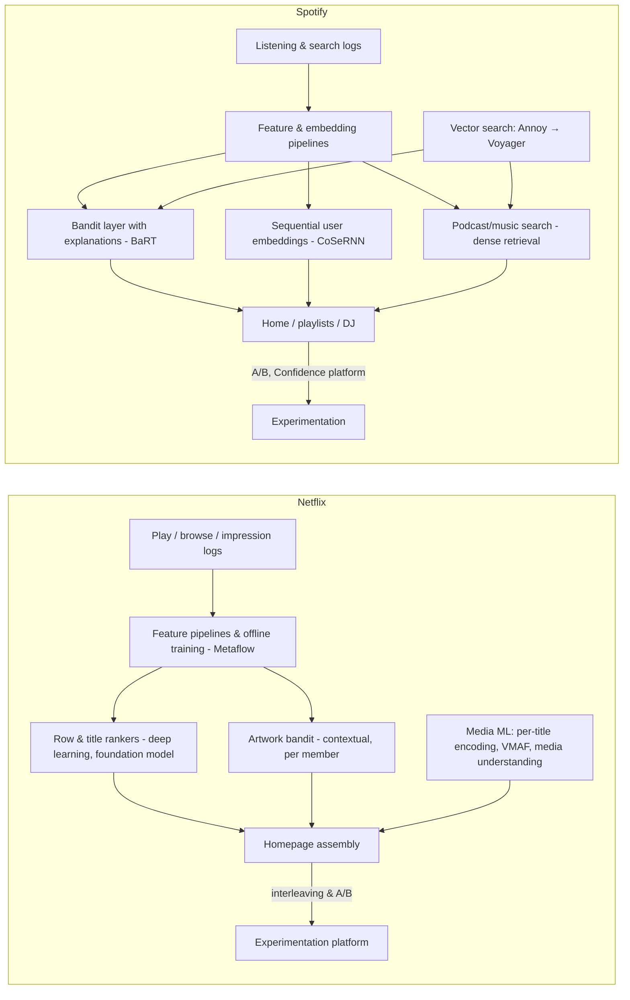
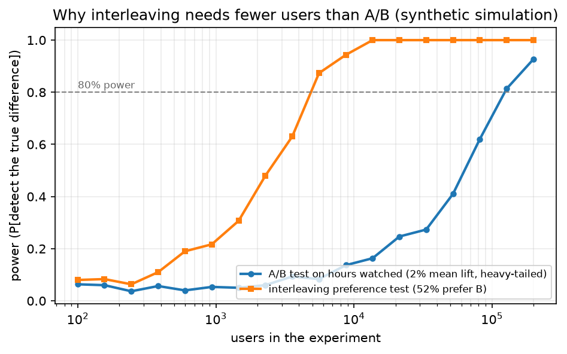

# Netflix & Spotify (recommendations, artwork personalisation, interleaving, encoding ML; bandits, podcasts, vector search)

> **Why this matters at staff level.** Netflix and Spotify are subscription businesses, so their recommenders optimise retention rather than ad impressions, and both have published unusually candid accounts of *how they decide*: Netflix on interleaving, contextual bandits for artwork and calibrated recommendations; Spotify on bandits with explanations, sequential user embeddings, natural-language podcast search and its own ANN libraries (Annoy, Voyager). Interviewers expect you to reason about surrogate metrics, exploration, and experiment sensitivity as first-class design decisions.

!!! warning "Sources in this chapter"
    Claims are tied to public Netflix Tech Blog posts, Spotify Research/Engineering posts and papers, cited by exact title, venue and year in [Sources](#sources). URLs are omitted where they could not be verified in the build environment (STYLE.md §4). Anything not in a public source is marked **inference**.

## 1. The business in one paragraph

Netflix sells a subscription to a catalogue; its recommender's job is to make each member find something worth watching quickly, because the public account of the business ("The Netflix Recommender System: Algorithms, Business Value, and Innovation", 2016) frames personalisation as retention and thus as saved subscriber-acquisition cost. The stack spans row and title ranking on the homepage, artwork selection per member, search, and a media-ML layer (per-title encoding optimisation, VMAF perceptual quality, media understanding for production). Spotify sells a music and podcast subscription plus an ad-supported tier; its defining systems are Home and playlist personalisation (Discover Weekly, Daily Mixes, the AI DJ), bandit-driven recommendation with explanations, search across music and spoken-word audio, and a vector-search lineage (Annoy → Voyager) that grew out of its retrieval needs. Both companies run large experimentation platforms and treat the choice of metric as an ML problem.

## 2. The ML problems that define the company

| Problem | Why it is hard | Public evidence |
|---|---|---|
| Netflix homepage ranking | Rows and titles must be chosen jointly; surrogate metrics (plays) vs retention; catalogue is small but member states are rich | Gomez-Uribe & Hunt (ACM TMIS 2016); "Deep Learning for Recommender Systems: A Netflix Case Study" (AI Magazine 2021); "Netflix's Foundation Model for Personalized Recommendation" (Netflix Tech Blog, 2025) |
| Artwork personalisation | Choose an image per member per title under a bandit feedback loop with no offline ground truth | ["Artwork Personalization at Netflix"](https://netflixtechblog.com/artwork-personalization-c589f074ad76) (Netflix Tech Blog, 2017) |
| Experiment sensitivity | A/B on retention needs huge samples; ranking changes are subtle | "Innovating Faster on Personalization Algorithms at Netflix Using Interleaving" (2017); Netflix experimentation blog series (2021) |
| Calibration and diversity | Recommendations drift to a member's majority interest | "Calibrated Recommendations" (Steck, RecSys 2018) |
| Video encoding | Bits vs perceptual quality per title, per shot | "Per-Title Encode Optimization" (2015); "Dynamic optimizer" (2018); "Toward A Practical Perceptual Video Quality Metric" (VMAF, 2016) |
| Spotify Home and playlists | Sequential, contextual (time of day, device), long-tail catalogue, artist fairness | "Contextual and Sequential User Embeddings for Large-Scale Music Recommendation" (RecSys 2020); "The Rise (and Lessons Learned) of ML Models to Personalize Content on Home" (Spotify Engineering, 2021) |
| Bandits with explanations | Exploration must be explainable ("because you listened to…") | "Explore, Exploit, Explain: Personalizing Explainable Recommendations with Bandits" (RecSys 2018) |
| Podcast search | Spoken-word content, natural-language queries, sparse interaction data | "Introducing Natural Language Search for Podcast Episodes" (Spotify Engineering, 2022) |
| Vector search | ANN at catalogue scale with small memory footprint | Annoy (open source, 2013); Voyager (open source, 2023) |
| Diversity and long-term effects | Algorithmic recommendations reduce consumption diversity | "Algorithmic Effects on the Diversity of Consumption on Spotify" (WWW 2020) |

## 3. The stack as publicly described

*What is public:* Netflix's use of Metaflow for data-science workflows (open-sourced 2019); deep-learning rankers (AI Magazine 2021) and, in 2025, a transformer-based foundation model for personalisation trained on member interaction sequences; the contextual bandit for artwork (2017); interleaving as a pre-A/B stage (2017); per-title and shot-level encoding optimisation with VMAF as the objective (2015–2018). Spotify's BaRT bandit with explanations (RecSys 2018); CoSeRNN sequential embeddings (RecSys 2020); natural-language podcast search built on dense retrieval (2022); Annoy and Voyager as open-source ANN libraries. *Inference:* how these components are wired at request time, and the current production ranker on either side, are not fully published.

## 4. Deep dives

### 4.1 Netflix: interleaving as the sensitivity engine

**The problem.** Ranking changes are small effects on noisy retention-adjacent metrics; a member-level A/B needs enormous samples and weeks. Netflix wanted to test more ranker variants per quarter.

**The approach.** The [2017 post on interleaving](https://netflixtechblog.com/interleaving-in-online-experiments-at-netflix-a04ee392ec55) describes a two-stage process: first, an interleaving experiment where each member sees a *blended* list mixing the outputs of rankers A and B (team-draft style, alternating picks) and the winner is decided by which ranker's items the member played more; second, a traditional A/B on the surviving candidate to measure member-level metrics. Interleaving is a paired, within-member comparison, so the between-member variance that dominates A/B tests cancels; the post reports that interleaving identified the better algorithm with far fewer members than the A/B test needed (the post quantifies this; treat it as their number, not a universal law).

{ width="640" }

*Figure: a synthetic simulation of the argument. On a heavy-tailed engagement metric (per-user hours, lognormal), a between-user A/B test needs orders of magnitude more users to reach 80% power than a paired interleaving preference test with the same underlying effect. Numbers are ours, not Netflix's.*

**Math link.** A/B variance $\propto \sigma^2_{\text{between}}/n$; interleaving's statistic is a binomial on per-member preferences with variance $\le 1/(4n)$. See [statistics](../part01-math/04-statistics.md) and [experimentation](../part17-ml-system-design/11-notifications-uplift-experimentation.md).

**The trade-off.** Interleaving measures *preference between rankers*, not the absolute member-level effect on retention, so it cannot replace the A/B; it is a filter that raises the hit rate of what you send to A/B.

!!! tip "How to say it in the interview"
    "To evaluate ranker candidates I'd run a two-stage funnel, following Netflix's 2017 Tech Blog post on interleaving: first interleave A and B in a blended list per member and count which ranker's titles get played, then send only the winner to a member-level A/B on retention. The decision is justified by variance: interleaving is a paired comparison so the between-member variance that dominates an A/B on hours watched cancels, and Netflix reported needing far fewer members to pick the better algorithm. I'd reject relying on interleaving alone, because it measures preference, not the absolute retention effect, and it can be gamed by rankers that win plays without winning satisfaction. The trade-off is engineering a blended-list serving path and attribution logic. Evaluation of the method itself: agreement between interleaving winners and later A/B winners over a season of experiments, which is how the post validates it."

### 4.2 Netflix: contextual bandits for artwork

**The problem.** Each title has several candidate images; the best one differs by member (genre affinity, favourite actors) and there is no offline label, a member sees one image, and you learn only whether they played.

**The approach.** The 2017 post frames artwork selection as a contextual bandit: context is member features, arms are the images, reward is play after impression. Exploration is needed to learn each image's value; the post explains offline evaluation via *replay* (score only logged rounds where the logged action matches the policy's choice) and the danger of *attribution* (does the play belong to the artwork or to the ranking?), plus incrementality concerns (playing anyway vs. because of the image).

**Math link.** Replay estimator: $\hat V(\pi) = \frac{\sum_t \mathbb{1}[\pi(x_t) = a_t]\, r_t}{\sum_t \mathbb{1}[\pi(x_t) = a_t]}$ under uniform logging; see [uncertainty & reliability](../part13-retrieval-eval-reliability/03-uncertainty-reliability.md) for confidence-driven exploration and [MDPs & Bellman](../part12-rl/01-mdp-bellman.md) for the bandit as a one-step MDP.

**The trade-off.** Exploration costs plays in the short term; the alternative, picking the globally best image, forgoes personalisation. Netflix's post accepts exploration and controls its cost with a small explore fraction and offline replay before online tests.

!!! tip "How to say it in the interview"
    "I'd model artwork selection as a contextual bandit, exactly as Netflix's 2017 Tech Blog post does: context is the member's affinities, arms are the candidate images, reward is a play following the impression. The decision is to accept explicit exploration, because the alternative of a single best image per title leaves personalisation on the table and gives no counterfactual data. I'd evaluate offline with replay on uniformly logged exploration traffic, since replay is unbiased only when logging is randomised (a point the post makes) and then online with a randomised control. The trade-off is that exploration costs plays and that attribution is ambiguous when the ranker also changed, so I'd freeze the ranking during the artwork test. My inference beyond the post is the choice of a Thompson-sampling policy; Netflix describes the framing, not the exact algorithm."

### 4.3 Netflix: from rankers to a personalisation foundation model

**What is public.** The 2021 AI Magazine case study explains why deep learning was slow to beat well-tuned classical models at Netflix and what finally worked (sequence models over interaction histories, careful feature and label design). The 2025 Tech Blog post describes a transformer-based foundation model trained on members' interaction sequences with multi-token-style objectives, sparse and dense features per event, and a plan to replace many bespoke models with fine-tuned heads on a shared representation. Calibrated Recommendations (RecSys 2018) is the diversity mechanism that re-ranks so the genre distribution of recommendations matches the member's history.

**Math link.** Calibration objective: $\text{argmax}_I\;(1-\lambda)\, s(I) - \lambda\, \KL(p \,\|\, q(I))$ where $p$ is the member's genre distribution and $q(I)$ the recommended list's; greedy submodular optimisation. See [information theory](../part01-math/05-information-theory.md) and [feed ranking](../part17-ml-system-design/01-recommendation-feed-ranking.md).

!!! tip "How to say it in the interview"
    "I'd consolidate Netflix-style personalisation on one sequence model over member interactions and hang task heads off it, which is the direction Netflix's 2025 post on its recommendation foundation model describes, and which its 2021 AI Magazine case study prepares by explaining that sequence modelling of histories was what finally made deep learning win there. I'd reject a dozen bespoke rankers because they duplicate feature engineering and drift apart. The trade-off is a single point of failure and a heavy retrain, so I'd version the backbone and let heads fine-tune between backbone releases. For diversity I'd add Steck's calibrated re-ranking from RecSys 2018, trading a little predicted engagement for a genre mix that matches the member. Evaluation: offline next-item metrics per head, interleaving, then an A/B on retention."

### 4.4 Netflix: encoding is an ML problem

**What is public.** Per-title encoding (2015) replaced a fixed bitrate ladder with a per-title ladder chosen by measuring rate-quality curves; the dynamic optimizer (2018) pushes this to shot level, choosing encoding parameters per shot to maximise VMAF per bit; VMAF (2016) is a learned perceptual quality metric fusing elementary metrics with a regressor trained on human ratings. This is the media-ML side of Netflix and a natural fit for candidates from perception.

!!! tip "How to say it in the interview"
    "For streaming quality I'd treat the bitrate ladder as an optimisation against a perceptual metric rather than a fixed table: Netflix's 2015 per-title post shows titles differ enormously in complexity, its 2018 dynamic optimizer post moves the decision to shot level, and VMAF gives a learned quality objective trained on human ratings. The decision is to spend encode compute to save delivery bits, which is the right trade at Netflix's scale and wrong for a small catalogue. I'd reject PSNR as the objective because it correlates poorly with perception, which is the reason VMAF exists. Evaluation: VMAF per bit and rebuffer rate in an A/B by network class."

### 4.5 Spotify: bandits with explanations and sequential embeddings

**The problem.** Home recommends shelves and items; exploration is needed, but Spotify wanted every recommendation to carry an explanation ("because you listened to X"), and the explanation itself affects the response.

**The approach.** BaRT (RecSys 2018) is a contextual bandit whose action is a *(item, explanation)* pair; the reward model is trained with counterfactual data collected under a logging policy and evaluated offline with inverse-propensity scoring. CoSeRNN (RecSys 2020) learns contextual, sequential user embeddings (an RNN over a member's session sequence conditioned on context (time, device)) to predict the next session's preference, feeding retrieval and ranking. The 2021 Home posts describe the evolution to multi-stage models and lessons about offline/online metric gaps.

**Math link.** IPS estimator $\hat V = \frac{1}{n}\sum_i \frac{\pi(a_i \mid x_i)}{\pi_0(a_i \mid x_i)} r_i$; see [policy gradients](../part12-rl/04-policy-gradients-ppo.md) for the same importance-weighting idea.

!!! tip "How to say it in the interview"
    "For Spotify-style Home I'd make the bandit's action the pair of item and explanation, the design in Spotify's RecSys 2018 'Explore, Exploit, Explain' paper, because the explanation changes user response and an unexplained exploration looks like a mistake to the listener. I'd train the reward model on logged data with a known propensity and evaluate with inverse-propensity scoring, as that paper does. For the user representation I'd use a sequential, context-conditioned embedding as in Spotify's RecSys 2020 CoSeRNN paper, because morning commute and Friday night are different users. I'd reject a static user vector. The trade-off is exploration cost, which I'd bound with an epsilon budget per shelf. Evaluation: offline IPS estimate, then an A/B on consumption and long-term diversity, which Spotify's WWW 2020 paper shows is a real risk of algorithmic recommendations."

### 4.6 Spotify: podcast search and the ANN lineage

**What is public.** The 2022 post describes natural-language search for podcast episodes using a dense retrieval model (a multilingual sentence encoder fine-tuned on query-episode pairs, with synthetic queries to bootstrap) and ANN over episode vectors, layered on top of lexical search. Annoy (2013) is Spotify's tree-based ANN with memory-mapped indexes; Voyager (2023) is its HNSW-based successor. 

!!! tip "How to say it in the interview"
    "For podcast search I'd add dense retrieval next to lexical search, as Spotify's 2022 engineering post on natural-language episode search describes: a multilingual encoder fine-tuned on query-episode pairs, bootstrapped with synthetic queries because spoken-word interaction data is sparse, and served with an ANN index. I'd reject replacing lexical search (exact titles and names still need it) and merge the two lists. For the index I'd use an HNSW library like Spotify's Voyager rather than tree-based Annoy, because graph indexes give better recall at the same latency, while noting Annoy's memory-mapped design was the right choice when the constraint was RAM. Evaluation: recall@k against exact search, and click-through and 'no result' rate by query type online."

## 5. Likely interview questions

!!! interview "1. Design the Netflix homepage: rows and titles."
    **Sketch.** Two-level ranking (rows, then titles within rows), shared member representation, diversity via calibration, artwork bandit, interleaving then A/B. Cross-link: [feed ranking](../part17-ml-system-design/01-recommendation-feed-ranking.md).

    !!! tip "How to say it in the interview"
        "I'd rank rows and titles with heads on a shared sequence representation of the member, the direction Netflix's 2025 foundation-model post describes, re-rank for calibration so the genre mix matches the member per Steck's RecSys 2018 paper, and choose artwork with the 2017 contextual bandit. I'd reject a single flat list; rows carry explanations and let the member navigate. The trade-off is that row selection and title selection interact, so I'd evaluate the page as a whole with interleaving before a retention A/B. Metrics: plays from the page, time to play, and retention."

!!! interview "2. Your ranker A/B shows +0.3% plays but is not significant after four weeks. What do you do?"
    **Sketch.** Use interleaving to get a preference readout; variance reduction (CUPED-style); check whether plays is the right surrogate; longer or larger test.

    !!! tip "How to say it in the interview"
        "I'd stop treating the A/B as the only instrument. Netflix's 2017 interleaving post exists precisely because ranking effects are too small for member-level tests, so I'd run an interleaving comparison to get a sensitive preference readout, and apply pre-period variance reduction to the A/B. I'd also question the surrogate: plays may not track retention. I'd reject extending the test indefinitely. The decision rule is: ship if interleaving prefers B and the A/B guardrails are neutral; otherwise iterate."

!!! interview "3. Implement replay evaluation for a bandit policy (coding)."
    **Sketch.** Given logs $(x_t, a_t, r_t)$ under uniform random logging, average $r_t$ over rounds where $\pi(x_t) = a_t$; discuss bias under non-uniform logging and IPS.

    !!! tip "How to say it in the interview"
        "I'd filter the logged rounds to those where my policy chooses the same arm as the logged action and average their rewards; under uniform logging this replay estimator is unbiased, which Netflix's artwork post relies on for offline evaluation. If logging was not uniform I'd weight by inverse propensity as in Spotify's RecSys 2018 bandit paper. I'd reject evaluating on the greedy logged policy alone, no counterfactuals. The trade-off is data efficiency: replay discards most rounds, so I'd size the exploration slice accordingly."

!!! interview "4. Choose a bitrate ladder for a new film."
    **Sketch.** Encode at several resolutions and QPs, measure VMAF, take the convex hull, per-shot optimisation; compute vs delivery savings. Cross-link: [image representation & signal processing](../part04-vision/01-image-representation.md).

    !!! tip "How to say it in the interview"
        "I'd encode the title across resolutions and quality settings, measure VMAF, and pick the convex hull of rate-quality points as the ladder, which is Netflix's 2015 per-title method; then move to shot-level parameters as in the 2018 dynamic optimizer post if the catalogue justifies the compute. I'd reject a fixed ladder because animation and action need different bits. Evaluation is VMAF per bit and rebuffering online."

!!! interview "5. Build Discover Weekly for a new market with little listening data."
    **Sketch.** Content and audio embeddings for cold items, collaborative signals from global users, exploration via bandits, artist-fairness guardrails. Cross-link: [CLIP & contrastive learning](../part08-multimodal/03-clip-contrastive.md) for audio-text embeddings.

    !!! tip "How to say it in the interview"
        "With sparse local data I'd lean on content embeddings (audio and text) to place new-market tracks near global ones, use a bandit to explore locally, and constrain for artist exposure. Spotify's WWW 2020 diversity paper shows recommendation can narrow consumption, so I'd set diversity as a guardrail from day one. I'd reject pure collaborative filtering because the interaction matrix is nearly empty. Evaluation: saves and repeat listens, with diversity tracked."

!!! interview "6. Design search that handles 'that podcast about the guy who faked his death'."
    **Sketch.** Dense retrieval over episode descriptions and transcripts, synthetic query generation, hybrid with lexical, re-ranker. Cross-link: [search ranking](../part17-ml-system-design/02-search-ranking.md).

    !!! tip "How to say it in the interview"
        "That query has no title words, so I'd route it to dense retrieval over episode text and transcripts, the approach Spotify described in its 2022 natural-language podcast search post, including synthetic queries to train the encoder. I'd keep lexical search in parallel and merge. I'd reject transcript-only indexing without descriptions; both help. Evaluation: success rate on natural-language queries and latency."

!!! interview "7. How would you reduce popularity bias without hurting engagement?"
    **Sketch.** Calibrated re-ranking, exposure constraints, log-Q corrections in retrieval, measure long-term diversity. 

    !!! tip "How to say it in the interview"
        "I'd apply calibrated re-ranking so each member's list matches their own interest distribution, as Steck's RecSys 2018 paper does, and correct popularity bias in retrieval training with sampling corrections. The trade-off is a small engagement cost, which the calibration paper quantifies as modest. I'd reject hard exposure quotas as a first step; they are blunt. Evaluation: engagement and the diversity measures Spotify used in its WWW 2020 study."

!!! interview "8. Why did Spotify write Annoy, and when would you use HNSW instead?"
    **Sketch.** Memory-mapped tree indexes shareable across processes; HNSW for better recall-latency at higher memory; Voyager as Spotify's current choice.

    !!! tip "How to say it in the interview"
        "Annoy solved a specific constraint: a static index that many processes could memory-map and share, with tiny RAM per process. When recall at low latency matters more than memory, a graph index like HNSW wins, which is why Spotify moved to Voyager. I'd use Annoy-style trees only for very memory-constrained static catalogues. Evaluation is recall versus queries per second at fixed memory."

!!! interview "9. Understand a film's content for production and personalisation (media ML)."
    **Sketch.** Shot detection, scene understanding, match cutting, character recognition; embeddings feeding artwork and search; Netflix's media understanding platform posts. Cross-link: [video models](../part08-multimodal/06-video-models.md).

    !!! tip "How to say it in the interview"
        "I'd build a media-understanding platform that runs shot and scene detection, character and face grouping, and clip embeddings once per title and serves them to many consumers, Netflix has described such a platform and specific applications like match cutting in its Tech Blog. I'd reject per-application video models because they duplicate expensive decoding. Evaluation is per-task accuracy plus reuse across teams."

!!! interview "10. What surrogate metric would you optimise, and how would you validate it?"
    **Sketch.** Choose a metric predictive of retention (e.g., meaningful plays), validate by correlating experiment-level lifts with long-term holdout effects.

    !!! tip "How to say it in the interview"
        "I'd pick a surrogate (a play of meaningful duration) and validate it by checking that experiment-level lifts in the surrogate predict long-term retention lifts in holdouts, which is the discipline Netflix's experimentation blog series describes. I'd reject optimising raw clicks. The trade-off is that surrogates decay as the ranker learns to game them, so I'd re-validate periodically."

## 6. What to bring from your background

* **Perception for media**: Netflix's encoding and media-understanding work (VMAF, shot-level optimisation, match cutting) is the natural home for video-perception experience; talk about perceptual metrics and video pipelines.
* **Evaluation rigour**: both companies grade on experimental design; bring examples of surrogate-metric validation, paired comparisons, and off-policy evaluation from your own work.
* **Retrieval systems**: Spotify's ANN lineage and dense podcast search reward ML-systems experience with embedding indexes at scale.

## Sources

**Netflix**

* Gomez-Uribe & Hunt, "The Netflix Recommender System: Algorithms, Business Value, and Innovation", ACM Transactions on Management Information Systems, 2016.
* Netflix Tech Blog, "Artwork Personalization at Netflix", December 2017. [netflixtechblog.com](https://netflixtechblog.com/artwork-personalization-c589f074ad76)
* Netflix Tech Blog, "Innovating Faster on Personalization Algorithms at Netflix Using Interleaving", November 2017. [netflixtechblog.com](https://netflixtechblog.com/interleaving-in-online-experiments-at-netflix-a04ee392ec55)
* Steck et al., "Deep Learning for Recommender Systems: A Netflix Case Study", AI Magazine, 2021.
* Steck, "Calibrated Recommendations", RecSys 2018.
* Netflix Tech Blog, "Netflix's Foundation Model for Personalized Recommendation", 2025.
* Netflix Tech Blog, "Per-Title Encode Optimization", December 2015; "Dynamic optimizer, a perceptual video encoding optimization framework", 2018; "Toward A Practical Perceptual Video Quality Metric" (VMAF), 2016.
* Netflix Tech Blog, "Open-Sourcing Metaflow, a Human-Centric Framework for Data Science", 2019.
* Netflix Tech Blog experimentation series ("Decision Making at Netflix", 2021); "Match Cutting at Netflix", 2022; posts on the media understanding platform, 2023.

**Spotify**

* McInerney et al., "Explore, Exploit, Explain: Personalizing Explainable Recommendations with Bandits", RecSys 2018.
* Hansen et al., "Contextual and Sequential User Embeddings for Large-Scale Music Recommendation", RecSys 2020.
* Anderson et al., "Algorithmic Effects on the Diversity of Consumption on Spotify", WWW 2020.
* Spotify Engineering, "The Rise (and Lessons Learned) of ML Models to Personalize Content on Home", Parts I and II, 2021.
* Spotify Engineering, "Introducing Natural Language Search for Podcast Episodes", 2022.
* Bernhardsson, Annoy (Approximate Nearest Neighbors Oh Yeah), open source, 2013; Spotify, Voyager, open source, 2023.
* Spotify Engineering, posts on the Confidence experimentation platform, 2023–2024.
