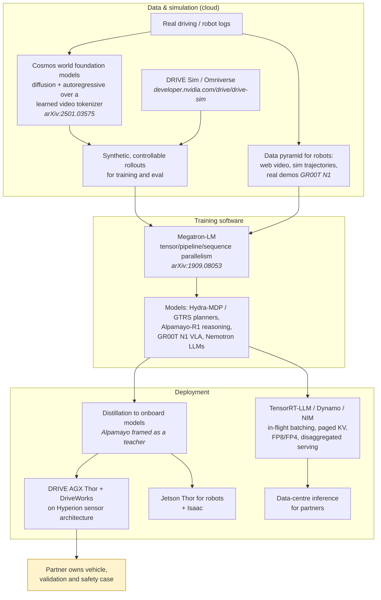

# NVIDIA (DRIVE, Cosmos, Isaac)

> **Why this matters at staff level.** NVIDIA is the only company in this part that
> sells to every other company in this part. That shapes its interviews: you are asked
> about *platforms*, not products, a driving stack partners can adopt (DRIVE), world
> foundation models other people fine-tune (Cosmos), a robot foundation model with an
> open checkpoint (GR00T), and the inference and training systems (TensorRT-LLM,
> Dynamo, Megatron-LM) that everyone else's models run on. Strong signal is being able
> to reason about the *whole* stack, roofline on a GPU, a planner's trajectory
> vocabulary, a diffusion world model's tokenizer, and about why a platform decision
> differs from a product decision.

## TL;DR: the interview card

- **Four ML businesses**: automotive (DRIVE Hyperion/AGX Thor, DriveWorks, DRIVE Sim),
  robotics (Isaac, GR00T), world models (Cosmos), and the training/inference software
  everyone else uses (Megatron-LM, TensorRT-LLM, Dynamo, NIM).
- **Hydra-MDP** ([arXiv:2406.06978](https://arxiv.org/abs/2406.06978), winner of the
  CVPR 2024 End-to-End Driving at Scale challenge): end-to-end planning as *scoring a
  fixed trajectory vocabulary*, with multiple teachers (human trajectory + rule-based
  simulation metrics) distilled into parallel heads. Its successor GTRS
  ([arXiv:2506.06664](https://arxiv.org/abs/2506.06664)) won the 2025 challenge.
- **Cosmos** ([arXiv:2501.03575](https://arxiv.org/abs/2501.03575)): "world foundation
 models" for Physical AI, a diffusion family and an autoregressive family over a
  learned video tokenizer, pre-trained on large video corpora and *designed to be
  post-trained* by developers into driving or robot world models. Open weights and
  code ([github.com/nvidia-cosmos](https://github.com/nvidia-cosmos/cosmos-predict1)).
- **GR00T N1** ([arXiv:2503.14734](https://arxiv.org/abs/2503.14734),
  [github.com/NVIDIA/Isaac-GR00T](https://github.com/NVIDIA/Isaac-GR00T)): an open
 vision-language-action foundation model for humanoids with a dual-system design, a
  VLM "System 2" for reasoning and a diffusion-transformer "System 1" for
 high-frequency action, trained on a *data pyramid* of web video, synthetic
  trajectories and real robot demonstrations.
- **Alpamayo-R1** ([arXiv:2511.00088](https://arxiv.org/abs/2511.00088)): reasoning-plus-action
  for long-tail driving, released as a teacher model for distillation.
- **Inference**: TensorRT-LLM and Dynamo are the reference points for in-flight
  batching, paged KV cache, quantization (FP8/FP4) and disaggregated prefill/decode.
- **Training**: Megatron-LM ([arXiv:1909.08053](https://arxiv.org/abs/1909.08053)) is
  where tensor parallelism was popularised; Nemotron-4 340B
  ([arXiv:2406.11704](https://arxiv.org/abs/2406.11704)) is NVIDIA's own model family,
  notable for a synthetic-data-generation pipeline and an open reward model.
- **The platform trade-off** runs through every answer: generality (partners, many
  vehicles, many robots) versus the specialisation a single-product company can afford.

## 1. The business in one paragraph

NVIDIA sells accelerated computing: GPUs and the software stack that makes them
useful. Its ML organisations exist to (a) create demand for that compute by making
new workloads tractable, and (b) sell platforms into industries that do not want to
build a full stack themselves. In automotive that is DRIVE, an on-vehicle computer
(AGX Thor), a reference sensor architecture (Hyperion), middleware (DriveWorks),
simulation (DRIVE Sim / Omniverse), and increasingly the models themselves (Hydra-MDP,
Alpamayo). In robotics it is Isaac and the GR00T foundation models. Across both sits
Cosmos, a family of world foundation models meant to generate the training and
evaluation data that Physical AI needs. And underneath everything is the systems
software, Megatron-LM for training, TensorRT-LLM and Dynamo for inference, NIM for
packaging, which is why an NVIDIA interview can swing from a BEV detector to a
roofline analysis to a KV-cache eviction policy in one loop.

## The ML problems that define the company

| Problem | Why it is hard | Public evidence |
|---|---|---|
| **End-to-end planning that a partner can validate** | A black-box policy is unsellable to an OEM with a safety department; but modular stacks cap performance. | Hydra-MDP ([arXiv:2406.06978](https://arxiv.org/abs/2406.06978)); GTRS ([arXiv:2506.06664](https://arxiv.org/abs/2506.06664)); NVIDIA CVPR 2024 research blog. |
| **Generating physically plausible worlds** | Video generators hallucinate physics; Physical AI needs controllable, action-conditioned, 3D-consistent rollouts. | Cosmos ([arXiv:2501.03575](https://arxiv.org/abs/2501.03575)); Cosmos project page and open repos. |
| **Robot foundation models across embodiments** | Robot data is scarce, heterogeneous in action space, and expensive; web video has no actions. | GR00T N1 ([arXiv:2503.14734](https://arxiv.org/abs/2503.14734)); the GR00T whitepaper; the open X-embodiment sim dataset. |
| **Long-tail driving that needs reasoning** | Rare scenarios need an explanation of the scene, which a trajectory regressor has no way to produce, and reasoning models are too slow for the car. | Alpamayo-R1 ([arXiv:2511.00088](https://arxiv.org/abs/2511.00088)); released as a teacher for distillation. |
| **Serving LLMs at the frontier of memory bandwidth** | Decode is memory-bound; batching, KV cache and quantization decide cost per token. | TensorRT-LLM; Dynamo; NIM deployment blogs. |
| **Training at cluster scale** | A trillion-parameter model does not fit on one device, and naive parallelism wastes bandwidth. | Megatron-LM ([arXiv:1909.08053](https://arxiv.org/abs/1909.08053)); Nemotron-4 340B report ([arXiv:2406.11704](https://arxiv.org/abs/2406.11704)). |
| **Safety for a platform you do not operate** | You ship compute and models; the partner ships the vehicle and owns the safety case. | DRIVE Hyperion safety/cybersecurity milestones (nvidianews); Halos Outside-In Safety blueprint ([github.com/NVIDIA/halos-outside-in-safety](https://github.com/NVIDIA/halos-outside-in-safety)). |

## 2. The stack as publicly described

**Known versus inferred.** Every labelled component above appears in a public paper,
repository, product page or press release. What is *inferred* is how they compose in
any specific customer programme: NVIDIA sells pieces, and which partner uses Cosmos
for data versus DRIVE Sim, or distils Alpamayo versus training their own planner, is
generally not public. The "partner owns the safety case" box is shaded because it is a
structural inference from NVIDIA's position as a supplier, supported by the Hyperion
safety-milestone announcements (NVIDIA certifies platform elements; the OEM certifies
the vehicle).

## 3. Deep dives

### 3.1 Hydra-MDP: planning as scoring a trajectory vocabulary, distilled from many teachers

**The problem.** End-to-end planners trained by imitation learn to copy the human
trajectory, which gives one target per scene and no signal about *why* alternatives
were bad. Rule-based planners encode exactly that knowledge (collision, drivable
area, comfort, progress) but cannot be differentiated through and generalise poorly.
The evaluation benchmark itself (NAVSIM-style closed-loop metrics) scores trajectories
by simulation rules, so a model trained only on human trajectories is optimising a
different objective from the one it is graded on.

**The approach.** Hydra-MDP replaces continuous trajectory regression with
**classification over a fixed trajectory vocabulary**: a set of $K$ candidate
trajectories (clustered from data; the public configurations use vocabularies in the
thousands, up to 16,384 in the released variants) is scored by the network, and the
best-scoring candidate is executed. Training uses **multi-target distillation**: one
head imitates the human trajectory, and additional heads are supervised by the
*rule-based simulator's* metric scores for every candidate in the vocabulary, the
teacher labels the whole vocabulary, not just the one trajectory the human drove.
Because the environment scores are computed offline for all candidates, the model
learns a differentiable surrogate for a non-differentiable simulator. At inference the
heads are combined into a single score, and the scoring weights can be changed without
retraining, which gives the deployment-time knob a partner wants.

The maths is ordinary cross-entropy over a vocabulary, with the twist that targets are
*soft* metric scores in place of one-hot labels. For candidate $k$ with simulator
metric $m_k \in [0,1]$ on criterion $c$, the head for $c$ minimises

$$
\mathcal{L}_c = -\sum_{k=1}^{K}\Big[ m_k^{(c)} \log \sigma(s_k^{(c)}) + (1-m_k^{(c)})\log\big(1-\sigma(s_k^{(c)})\big)\Big],
$$

and the imitation head is a softmax cross-entropy against the vocabulary entry closest
to the human trajectory. The connection to the book: the vocabulary trick is set
prediction with a fixed anchor set, as in [DETR & set prediction](../part08-multimodal/02-detr.md);
the multi-teacher distillation is the knowledge-distillation machinery from
[Fine-tuning & LoRA](../part06-llm-training/06-fine-tuning-lora.md) applied to
non-differentiable rewards; the planning context is
[Prediction & planning](../part11-perception-autonomy/06-prediction-planning.md).

**The trade-off.** A discrete vocabulary caps trajectory resolution and cannot express
a manoeuvre outside the set, and building the vocabulary is a data-dependent design
choice. In exchange you get: a differentiable path to simulator metrics, scores for
*every* candidate (so a partner can inspect why the chosen one won), and an interface
where safety weights are tunable at deployment. The rejected alternative, direct
regression of a continuous trajectory, is simpler and unbounded in resolution but
provides no ranking signal and no auditable comparison.

**Sources.** Li et al., "Hydra-MDP: End-to-end Multimodal Planning with Multi-target
Hydra-Distillation" ([arXiv:2406.06978](https://arxiv.org/abs/2406.06978), CVPR 2024
Autonomous Grand Challenge winner, End-to-End Driving at Scale); the NVIDIA research
blog for CVPR 2024 ([blogs.nvidia.com/blog/auto-research-cvpr-2024/](https://blogs.nvidia.com/blog/auto-research-cvpr-2024/));
Li et al., "Generalized Trajectory Scoring for End-to-end Multimodal Planning"
([arXiv:2506.06664](https://arxiv.org/abs/2506.06664)), the 2025 challenge winner.

!!! tip "How to say it in the interview"
    "I'd frame end-to-end planning as scoring a fixed trajectory vocabulary rather
    than regressing a continuous trajectory. NVIDIA's Hydra-MDP paper, which won the
    CVPR 2024 End-to-End Driving at Scale challenge, shows why that pays: once you
    have a vocabulary you can label *every* candidate with a rule-based simulator's
 metrics (collision, drivable area, comfort) and distil those scores into
    parallel heads alongside the human-imitation head. That turns a non-differentiable
    evaluation metric into a training signal, which is exactly the gap that pure
    imitation leaves. I'd rule out continuous trajectory
    regression: it's simpler, but it gives one target per scene and no ranking, so
    the model never learns why the alternatives were worse. The trade-off I accept is
 resolution, the vocabulary bounds what I can express, so I'd size it from
    clustered real trajectories and check the residual error against the human path.
    I like this design for a supplier because the per-criterion scores are inspectable
    and the combination weights can be retuned by the OEM at deployment without
    retraining. For evaluation I'd use closed-loop simulation metrics as the
    primary gate and keep open-loop displacement error only as a regression tripwire,
    since the whole point of the multi-teacher setup is that the two disagree."

### 3.2 Cosmos: world foundation models as a data platform

**The problem.** Physical AI (driving, robotics) is bottlenecked on data for exactly
the situations that matter: rare, dangerous, or expensive to stage. Hand-built
simulators have a sim-to-real gap in appearance and behaviour. A generic video
generator makes pretty video with implausible physics and no way to condition on the
action you care about.

**The approach.** The Cosmos World Foundation Model Platform packages: a **video
tokenizer** (continuous and discrete variants) that compresses video into latents at
high compression while preserving reconstruction quality; two model families over
those latents, **diffusion** WFMs (continuous latents, denoising) and
**autoregressive** WFMs (discrete tokens, next-token prediction); a large curated video
pre-training corpus with a described data-curation pipeline (shot detection,
filtering, captioning, deduplication); and post-training recipes that specialise a
pre-trained WFM into a domain model, camera-controllable navigation, robot
manipulation conditioned on actions, and driving world models conditioned on multi-view
video and ego trajectory. The guard rails (pre- and post-generation safety filters) are
part of the released platform. The key framing in the paper is that the WFM is
*infrastructure*: a general model that developers fine-tune, mirroring what LLM
foundation models did for text.

Two mathematical anchors worth being able to sketch: the tokenizer is an
autoencoder with a compression ratio you can compute (spatial $\times$ temporal
downsampling gives the token budget per second of video, which sets both training cost
and rollout length), and the two model families are the two generative paradigms in
[Diffusion](../part09-generative/03-diffusion.md) and
[Transformer architectures](../part05-sequence-transformers/04-transformer-architectures.md);
the world-model framing itself is [World models](../part11-perception-autonomy/07-world-models.md),
and video-specific architecture is [Video models](../part08-multimodal/06-video-models.md).

**The trade-off.** Diffusion WFMs give higher visual fidelity and natural
continuous-control conditioning but cost many denoising steps per frame;
autoregressive WFMs stream and extend naturally and reuse LLM serving infrastructure
but inherit tokenizer artefacts and exposure bias over long rollouts. NVIDIA shipped
both, which is the platform answer: let the developer choose. The deeper trade-off is
generality versus fidelity, a world model good enough to *train* a policy need not be
photoreal, but a world model used to *evaluate* perception must be, and conflating the
two is the classic mistake.

**Sources.** NVIDIA, "Cosmos World Foundation Model Platform for Physical AI"
([arXiv:2501.03575](https://arxiv.org/abs/2501.03575)); project page
([research.nvidia.com/labs/dir/cosmos1/](https://research.nvidia.com/labs/dir/cosmos1/));
open code ([github.com/nvidia-cosmos/cosmos-predict1](https://github.com/nvidia-cosmos/cosmos-predict1)).
Compare with Google DeepMind's Genie 3 ([deepmind.google/blog/genie-3-a-new-frontier-for-world-models/](https://deepmind.google/blog/genie-3-a-new-frontier-for-world-models/))
and the [Waymo World Model](waymo.md#33-simulation-and-closed-loop-evaluation-simulationcity-waymax-sim-agents-the-world-model).

!!! tip "How to say it in the interview"
    "For a Physical AI data problem I'd post-train a world foundation model rather
    than build a bespoke simulator, and I'd say so citing NVIDIA's Cosmos platform
    paper, which explicitly positions the WFM as shared infrastructure that developers
    fine-tune into their own domain model. Concretely: take the pre-trained model, and
 post-train it conditioned on the signals I actually control, multi-view camera and
 ego trajectory for driving, or action vectors for manipulation, so I can generate
    counterfactual rollouts of a rare scenario instead of waiting to encounter it. On
    the architecture choice, Cosmos ships both a diffusion family and an autoregressive
    family over the same video tokenizer, and I'd pick diffusion when I need
    fidelity for perception evaluation and autoregressive when I need long, streaming
    rollouts for policy training, because the diffusion model's per-frame denoising
    cost dominates at long horizons. The alternative I'd pass on is a hand-built
    graphics simulator as the primary source: it's controllable but its appearance gap
    shows up precisely in the perception models I'm trying to test. The trade-off to
 name is that a generated world is only as trustworthy as its physics, so
    I'd use it to train policies and to stress-test, and I'd validate any
    conclusion on real logs before it gates a release. My evaluation would be
    downstream: does a policy trained with synthetic rollouts beat the baseline on
    *real* held-out scenarios, and does the WFM's ranking of candidate policies agree
    with closed-loop results on logged data?"

### 3.3 GR00T N1: a dual-system VLA and the data pyramid

**The problem.** A humanoid needs to understand an open-vocabulary instruction and a
cluttered scene (slow, semantic, best served by a VLM) *and* emit smooth actions at
high frequency (fast, continuous, best served by a small policy). It also needs
training data that does not exist: real robot demonstrations are scarce and expensive,
simulation is plentiful but has a reality gap, and internet video is abundant but has
no action labels.

**The approach.** GR00T N1 is an open vision-language-action foundation model with a
**dual-system** architecture: "System 2" is a pre-trained vision-language model that
processes the image and the language instruction at low frequency, and "System 1" is a
diffusion-transformer action head that consumes System 2's latent, the robot's
proprioceptive state, and emits action chunks at high frequency. The two are trained
end-to-end. The data strategy is the **data pyramid**: a broad base of web video and
human videos (no actions, so the model learns representations and *latent* actions
inferred by a learned inverse-dynamics-style model), a middle layer of synthetic
trajectories generated in simulation and by neural video generation, and a narrow apex
of real robot demonstrations. Action spaces differ per embodiment, so embodiment-specific
encoders/decoders project into and out of a shared latent action space, which is what
makes one model serve multiple robots. Weights, code and a synthetic X-embodiment
dataset are public.

Connections to the book: the VLM half is [VLM architecture](../part08-multimodal/04-vlm-architecture.md);
the diffusion action head is [Diffusion](../part09-generative/03-diffusion.md) applied
to trajectories instead of pixels; the imitation setting and its compounding-error
failure mode is [Imitation learning](../part12-rl/05-imitation-learning.md); the
latent-action idea is a form of weak supervision, [Weak supervision & auto-labelling](../part10-self-supervised/03-weak-supervision-and-auto-labeling.md).

**The trade-off.** Splitting the model buys the right compute at the right frequency, 
you do not run a 2B-parameter VLM at 100 Hz, at the cost of a latency-coupling design
problem (how stale may System 2's latent be before System 1 acts on the wrong scene?)
and a harder training story than a single monolith. The data pyramid buys scale at the
cost of label quality: the base of the pyramid has *inferred* actions, so errors there
are systematic, not random. The rejected alternative, training only on real robot
demonstrations, is clean but cannot reach the data scale that makes foundation models
work.

**Sources.** NVIDIA, "GR00T N1: An Open Foundation Model for Generalist Humanoid
Robots" ([arXiv:2503.14734](https://arxiv.org/abs/2503.14734)); code
([github.com/NVIDIA/Isaac-GR00T](https://github.com/NVIDIA/Isaac-GR00T)); the GR00T N1
whitepaper ([PDF](https://d1qx31qr3h6wln.cloudfront.net/publications/GR00T_1_Whitepaper.pdf));
the open simulation dataset ([huggingface.co/datasets/nvidia/PhysicalAI-Robotics-GR00T-X-Embodiment-Sim](https://huggingface.co/datasets/nvidia/PhysicalAI-Robotics-GR00T-X-Embodiment-Sim)).
Compare Google DeepMind's Gemini Robotics ([arXiv:2503.20020](https://arxiv.org/abs/2503.20020)).

!!! tip "How to say it in the interview"
    "I'd build the policy as two coupled systems at different frequencies, which
    is the design NVIDIA's GR00T N1 paper describes: a vision-language model that reads
    the scene and the instruction at low rate, and a diffusion-transformer action head
    that takes that latent plus proprioception and emits action chunks at control
 rate. The reason is a compute argument, not an elegance argument, you can't run
    a multi-billion-parameter VLM in the control loop, and you don't need to, because
    the semantic content of a scene changes far more slowly than the arm does. For
    data I'd copy the same paper's pyramid: internet and human video at the base
    with latent actions inferred instead of measured, simulation and neural-generated
    trajectories in the middle, real teleoperated demonstrations at the apex. The
    alternative I'd reject is training only on real demonstrations; it's the
    highest-quality data and there will never be enough of it. The trade-off I'd
 watch is systematic error from the inferred actions at the base of the pyramid, 
    it's correlated, so it won't average out, and I'd hold a real-demo
    validation set that the pyramid never touches. On evaluation, I'd report
 success rate under distribution shift, new objects, new lighting, a new
 embodiment, and interventions per hour, and I'd be explicit that a
    latency-coupling bug between the two systems shows up as failures on *moving*
    objects specifically, so that gets its own slice."

### 3.4 Alpamayo-R1: reasoning for the long tail, distilled for the car

**The problem.** The scenarios that cause AV disengagements are rare and require
*explanation*, a cyclist's hand signal, a police officer waving traffic through a red
light, a truck reversing out of a driveway. A trajectory regressor has no mechanism for
this; a reasoning model has the mechanism but not the latency budget.

**The approach.** Alpamayo-R1 bridges reasoning and action prediction for driving in
the long tail: it produces a chain of reasoning about the scene alongside the
trajectory, and NVIDIA released it (10B weights on Hugging Face under a
non-commercial licence, with Apache-licensed inference code) explicitly positioned as
a **teacher model for distillation**, and explicitly not a deployable onboard policy. That
framing is the interesting part for an interview: it is the same pattern as
[Waymo's EMMA](waymo.md#34-emma-and-scaling-laws-does-the-foundation-model-recipe-apply-to-driving)
(published as research, limitations stated) and the same pattern as offline
auto-labelling in [Tesla's data engine](tesla.md#33-the-data-engine-and-auto-labelling-the-fleet-as-a-labeller):
a big slow model that sees everything generates supervision for a small fast model
that must run in a fixed budget.

Relevant chapters: [Test-time compute](../part07-post-training/06-test-time-compute.md)
for why reasoning traces help and what they cost;
[Reasoning RL, RLVR & GRPO](../part07-post-training/05-reasoning-rl-grpo.md) for how
such models are trained; [VLM architecture](../part08-multimodal/04-vlm-architecture.md).

**The trade-off.** Reasoning buys long-tail competence and an inspectable rationale
(valuable to a partner's safety team) at a compute cost that rules it out of the
control loop today. Distillation recovers the speed but generally loses the
rationale's faithfulness, the student can learn to produce the *conclusion* without
the reasoning that justified it, which is a known hazard whenever chain-of-thought is
distilled.

**Sources.** NVIDIA, "Alpamayo-R1: Bridging Reasoning and Action Prediction for
Generalizable Autonomous Driving in the Long Tail"
([arXiv:2511.00088](https://arxiv.org/abs/2511.00088)); model weights
([huggingface.co/nvidia/Alpamayo-R1-10B](https://huggingface.co/nvidia/Alpamayo-R1-10B)).

!!! tip "How to say it in the interview"
    "For the long tail I'd run a reasoning model offline and distil it, not deploy
    it. NVIDIA's Alpamayo-R1 paper is the template: it couples explicit reasoning about
    the scene with action prediction for exactly the rare scenarios where a regressor
    has no mechanism, and NVIDIA released it as a teacher for distillation rather than
    an onboard policy, which tells you what the latency verdict was. So my pipeline is:
    mine the long-tail clips, have the reasoning model produce both a rationale and a
    trajectory, use those as supervision for the onboard model, and keep the rationale
    as an auxiliary target so the student has some pressure to encode *why*. The
 alternative I'd reject is putting the reasoning model in the car, the compute
    isn't there, and a variable-latency component in a control loop is its own safety
    problem. The trade-off I'd name out loud is faithfulness: a distilled student
    can reproduce the conclusion without the reasoning, so the rationale it emits is
    not evidence, and I'd not let a safety argument lean on it. I'd evaluate on
 a curated long-tail scenario set, the kind Waymo's WOD-E2E release defines at
 roughly the 0.03%-frequency level, and measure whether the distilled student
    closes the gap to the teacher specifically on those slices, not on average."

### 3.5 Inference systems: TensorRT-LLM, Dynamo, and where the milliseconds go

**The problem.** LLM serving has two phases with opposite characteristics: **prefill**
is compute-bound (a big matmul over the whole prompt) and **decode** is
memory-bandwidth-bound (one token at a time, re-reading the entire KV cache and
weights). Running them on the same GPUs with the same batching policy means one phase
is always wasting the machine.

**The approach.** The public NVIDIA inference stack assembles the standard toolkit:
**in-flight (continuous) batching** so a finished sequence's slot is refilled
immediately instead of waiting for the batch; **paged KV cache** so cache memory is
allocated in blocks and fragmentation stops capping batch size (the idea introduced by
vLLM's PagedAttention, [arXiv:2309.06180](https://arxiv.org/abs/2309.06180));
**quantization** to FP8 and FP4 on Hopper/Blackwell for both weights and KV cache;
**speculative decoding** ([arXiv:2211.17192](https://arxiv.org/abs/2211.17192)) to
amortise the memory-bound decode step over several tokens; and, in Dynamo,
**disaggregated serving**, running prefill and decode on separate GPU pools sized
independently, with the KV cache transferred between them.

The arithmetic you should be able to do at a whiteboard is in
[Hardware, memory & roofline](../part14-systems/04-hardware-memory-roofline.md) and
[Inference systems](../part14-systems/03-inference-systems.md): for decode, time per
token $\approx (\text{bytes of weights} + \text{bytes of KV read}) / \text{HBM bandwidth}$,
so batching increases throughput almost for free until the KV cache exhausts memory, 
which is why paging and KV quantization buy throughput directly. Quantization theory is
[Quantization](../part06-llm-training/05-quantization.md); attention and cache
structure is [Efficient attention & KV cache](../part06-llm-training/04-efficient-attention-kv-cache.md).

**The trade-off.** Disaggregation buys independent scaling and better utilisation of
each phase at the cost of a network transfer of the KV cache on the critical path and
much more operational complexity; it pays off at large scale and long prompts and
hurts at small scale. Aggressive quantization buys memory and bandwidth at some
accuracy cost that must be measured per model and per task, not assumed.

**Sources.** [github.com/NVIDIA/TensorRT-LLM](https://github.com/NVIDIA/TensorRT-LLM);
[github.com/ai-dynamo/dynamo](https://github.com/ai-dynamo/dynamo); NVIDIA developer
blog on NIM deployment ([developer.nvidia.com/blog/simplify-llm-deployment-and-ai-inference-with-unified-nvidia-nim-workflow/](https://developer.nvidia.com/blog/simplify-llm-deployment-and-ai-inference-with-unified-nvidia-nim-workflow/));
Kwon et al., PagedAttention ([arXiv:2309.06180](https://arxiv.org/abs/2309.06180));
Leviathan et al., speculative decoding ([arXiv:2211.17192](https://arxiv.org/abs/2211.17192)).

!!! tip "How to say it in the interview"
    "I'd start by separating the two phases, because they're bound by different
    resources: prefill is compute-bound and decode is memory-bandwidth-bound, so a
    single batching policy is always leaving one of them idle. My first three moves
 would be in-flight batching, a paged KV cache, and FP8 weights and KV, the paged
    cache because fragmentation, not raw memory, is usually what caps batch size,
    which is the argument the vLLM PagedAttention paper makes and which TensorRT-LLM
    implements. Only then would I consider disaggregated prefill and decode the way
    NVIDIA's Dynamo does it, because that buys independent scaling of the two pools at
 the cost of moving the KV cache across the network on the critical path, worth it
    at scale and with long prompts, not worth it for a small deployment. I'd add
    speculative decoding where the workload has a cheap draft model available, since
    it converts a bandwidth-bound step into a compute-bound one. The trade-off I'd
    measure rather than assume is quantization accuracy: FP8 is usually free, FP4 is
    not, and 'usually' isn't an argument, so I'd gate on task-level evals per
    model. My SLO framing would be time-to-first-token for prefill and inter-token
    latency for decode, with throughput per GPU-dollar as the cost metric, because
    optimising mean latency alone hides the tail that users actually feel."

### 3.6 Training systems: Megatron-LM, Nemotron, and synthetic data

**The problem.** A model that does not fit on one GPU has to be split, and every way
of splitting it trades communication volume against memory and against pipeline
bubbles. Then, once you can train a large model, the binding constraint moves to data
quality.

**The approach.** Megatron-LM introduced the tensor-parallel decomposition that is now
standard: split each transformer layer's matrices across devices such that the
attention heads and the MLP's two matmuls partition with exactly **two all-reduces per
layer** in the forward pass and two in the backward. Combined with pipeline
parallelism (split layers across stages, interleave micro-batches to shrink the
bubble), data parallelism, and sequence/context parallelism for long contexts, this is
the 4-D parallelism vocabulary interviews use. Nemotron-4 340B is NVIDIA's own model
family; the report is notable less for the architecture than for the **synthetic data
generation** pipeline (over 98% of the alignment data was synthetically generated
according to the report) and for releasing the reward model used to filter it, the
closest thing to a public recipe for the data-engine step that
[Scale AI's business](scale-ai-data-engines.md) sells as a service. Llama-Nemotron
([arXiv:2505.00949](https://arxiv.org/abs/2505.00949)) continued the line with
reasoning models.

Chapters: [Distributed training](../part14-systems/01-distributed-training.md) for the
parallelism derivations; [Training systems](../part14-systems/02-training-systems.md)
for checkpointing, failure recovery and MFU;
[Large-model architecture](../part06-llm-training/03-large-model-architecture.md);
[Pretraining data & objective](../part06-llm-training/01-pretraining-data-objective.md).

**The trade-off.** Tensor parallelism has the lowest pipeline bubble but the highest
communication frequency, so it belongs *inside* a node where NVLink bandwidth is high;
pipeline parallelism communicates little but introduces bubbles, so it goes across
nodes. Getting this backwards is the single most common distributed-training mistake,
and it is a favourite interview question. On data: synthetic generation escapes the
human-annotation bottleneck but risks a closed loop where the model's own biases are
amplified, which is why the Nemotron pipeline pairs generation with a reward model and
filtering.

**Sources.** Shoeybi et al., "Megatron-LM: Training Multi-Billion Parameter Language
Models Using Model Parallelism" ([arXiv:1909.08053](https://arxiv.org/abs/1909.08053));
[github.com/NVIDIA/Megatron-LM](https://github.com/NVIDIA/Megatron-LM); NVIDIA,
"Nemotron-4 340B Technical Report" ([arXiv:2406.11704](https://arxiv.org/abs/2406.11704));
"Llama-Nemotron: Efficient Reasoning Models" ([arXiv:2505.00949](https://arxiv.org/abs/2505.00949)).

!!! tip "How to say it in the interview"
    "I'd map the parallelism strategy onto the interconnect topology before
    touching the model. Tensor parallelism, the decomposition from the Megatron-LM
    paper, costs two all-reduces per layer per direction, so it goes *inside* a node
    where NVLink bandwidth is high; pipeline parallelism communicates only activations
    at stage boundaries, so it crosses nodes; data parallelism wraps the outside; and
    I'd add sequence or context parallelism only when activation memory for long
 contexts is what is actually binding. Doing this backwards, tensor parallel across
 slow links, is the classic way to burn half a cluster. Once training scales, my
    attention shifts to data, and here I'd follow NVIDIA's Nemotron-4 340B report,
    which describes generating the overwhelming majority of its alignment data
 synthetically and releasing the reward model used to filter it. The alternative, 
 buying all alignment data from human annotators, doesn't scale to the volumes
    modern post-training needs. The cost is a closed loop: a model grading its own
    synthetic data amplifies its own biases, so I'd keep a human-labelled gold set
    that the generator never sees and track the divergence between reward-model scores
    and human judgements on it. I'd report model-FLOP utilisation and
    tokens-per-second-per-GPU instead of peak FLOPS, and I'd treat checkpoint
    and restart time as a first-class metric, because at cluster scale failures are
    routine."

## 4. Likely interview questions

!!! interview "Q1. Design an end-to-end planner an OEM partner could actually validate."
    **Answer sketch.** Requirements: inspectable decisions, tunable safety behaviour
    without retraining, fixed compute budget on AGX-class hardware. Design: perception
    to BEV features; a trajectory vocabulary clustered from real driving; per-criterion
    scoring heads distilled from a rule-based simulator (Hydra-MDP); a combination layer
    with partner-tunable weights; explicit constraint checking outside the network.
    Evaluation: closed-loop metrics on a scenario bank, per-criterion score calibration,
    and vocabulary-coverage residuals. Trade-off named: resolution versus auditability.
    Links: [Prediction & planning](../part11-perception-autonomy/06-prediction-planning.md),
    [AV perception design](../part17-ml-system-design/05-perception-system-av.md).

    !!! tip "How to say it in the interview"
        "I'd commit to trajectory-vocabulary scoring with multi-teacher
        distillation, the Hydra-MDP design that won the CVPR 2024 challenge, because a
        partner's safety team can read per-criterion scores for every candidate and
        can't read a regressed trajectory. I'd reject continuous regression for
        this customer even though it has higher resolution, because the product
        requirement is auditability. The cost is that the vocabulary bounds
        expressible manoeuvres, so I'd size it from clustered real trajectories and
        report the residual to the human path as a coverage metric. I'd gate
        releases on closed-loop simulation metrics per scenario slice, and I'd keep
        the score-combination weights as a deployment-time parameter so the OEM can
        retune conservatism without a retrain."

!!! interview "Q2. Your customer wants to test a perception stack on a rare scenario they have never recorded. What do you build?"
    **Answer sketch.** Post-train a world foundation model on their sensor rig and
    domain; condition on ego trajectory and scene layout; generate the counterfactual
    variations; validate the *generator* before trusting it (does perception performance
    on generated near-duplicates of real logs match performance on the real logs?);
    use for stress-testing and policy training, not as the safety evidence.
    Links: [World models](../part11-perception-autonomy/07-world-models.md),
    [Diffusion](../part09-generative/03-diffusion.md).

    !!! tip "How to say it in the interview"
        "I'd post-train a Cosmos-style world foundation model on their domain
        instead of building a bespoke simulator, because the Cosmos platform paper's
        whole thesis is that a pre-trained WFM plus domain post-training beats
        hand-building the world each time. I'd condition on ego trajectory and
        multi-view camera so the scenario is controllable. Before I trusted any result
        I'd calibrate the generator: regenerate near-duplicates of real logs and
 check that perception metrics on them match the real ones, if they do not, the
        gap is my error bar. The trade-off is that generated physics is not evidence, so
        this informs triage and training but does not gate a safety claim."

!!! interview "Q3. Why split a robot policy into System 1 and System 2? What breaks if you do not?"
    **Answer sketch.** Frequency mismatch: semantics change slowly, control must be
    fast. A monolith either runs the VLM too often (compute infeasible) or the
 controller too rarely (jerky, unsafe). Splitting introduces staleness coupling, 
    quantify the maximum age of the System 2 latent given object speed. Failure slice:
    moving objects. Link: [Imitation learning](../part12-rl/05-imitation-learning.md).

    !!! tip "How to say it in the interview"
        "Because the two halves have different natural frequencies, which is the
        argument in NVIDIA's GR00T N1 paper: a vision-language model reasons about the
        scene at low rate, and a diffusion-transformer action head runs at control
        rate off its latent plus proprioception. A monolith forces you to choose
        between infeasible compute and a control loop that's too slow. The cost is
        staleness: I'd bound how old the System 2 latent may be as a function of
        the fastest thing in the scene, and I'd carve out a moving-object
        evaluation slice, because that's exactly where a staleness bug hides."

!!! interview "Q4. Roofline: a 70B model, FP16 weights, batch size 1 decode on a GPU with 3 TB/s HBM. Estimate tokens per second and say what you would change."
    **Answer sketch.** Weights alone are $70 \times 10^9 \times 2 \approx 140$ GB, so
    one forward pass must read $\ge 140$ GB; at 3 TB/s that is $\approx 47$ ms, roughly
    21 tokens/s, before KV-cache reads. Decode is bandwidth-bound, so: raise batch size
    (weights are amortised across the batch), quantize weights to FP8/FP4 (halves or
    quarters the read), quantize the KV cache, use speculative decoding, or shard with
    tensor parallelism to aggregate bandwidth. Link:
    [Hardware, memory & roofline](../part14-systems/04-hardware-memory-roofline.md).

    !!! tip "How to say it in the interview"
        "At batch 1 the answer is set by bandwidth, not FLOPs: 70 billion FP16
        parameters is about 140 gigabytes that must be read every token, so at 3
        terabytes per second I get roughly 47 milliseconds per token, about 21 tokens
        per second, and the KV cache only makes it worse. So every fix is a bandwidth
        fix: batch to amortise the weight read, quantize weights and KV to FP8, shard
        across GPUs with tensor parallelism to sum their bandwidth, or use speculative
        decoding to get several tokens per weight read. I'd reject 'buy a faster
        GPU' as the first answer because batching is free and gets a much larger factor.
        The trade-off with batching is latency per user versus throughput, which is why
        I'd set an inter-token-latency SLO first and then batch up to it."

!!! interview "Q5. Design the serving system for a partner running a 30B model with 100k-token prompts and short outputs."
    **Answer sketch.** Prompt-dominated workload → prefill is the cost centre. Chunked
    prefill, prefix caching for shared system prompts, disaggregated prefill/decode with
    a large prefill pool, paged KV, FP8 KV cache (KV memory scales with context length).
    SLO: time-to-first-token dominates user experience. Link:
    [Inference systems](../part14-systems/03-inference-systems.md),
    [Efficient attention & KV cache](../part06-llm-training/04-efficient-attention-kv-cache.md).

    !!! tip "How to say it in the interview"
        "With 100k-token prompts and short outputs this is a prefill-bound workload, so
 I would size for prefill and treat decode as an afterthought, the opposite of
        the default chat deployment. Concretely: chunked prefill so a long prompt does
        not block the queue, prefix caching if prompts share a large system preamble,
        a paged KV cache with FP8 KV because cache memory scales linearly with context
        and that is what caps concurrency, and disaggregated pools as in Dynamo so I can
        buy prefill capacity independently. My SLO is time-to-first-token. The trade-off
        of disaggregation is a KV transfer on the critical path, which I would measure
        before committing, since at small scale it is a net loss."

!!! interview "Q6. Tensor parallel across nodes or pipeline parallel across nodes? Justify with communication volume."
    **Answer sketch.** Tensor parallelism: two all-reduces per layer per direction, each
 moving activations of size $B \times T \times d$, high frequency, so it needs
    intra-node NVLink. Pipeline: one point-to-point send of the stage boundary
 activation per micro-batch, low volume, tolerant of slower links, but introduces
    bubbles mitigated by interleaved schedules. Answer: tensor inside the node, pipeline
    across nodes, data parallel outermost. Link:
    [Distributed training](../part14-systems/01-distributed-training.md).

    !!! tip "How to say it in the interview"
        "Tensor parallel inside the node, pipeline across nodes, data parallel on the
        outside. The reason is frequency, not volume alone: Megatron-style tensor
        parallelism does two all-reduces per layer in each direction, so it touches the
        network dozens of times per step and must sit on NVLink, whereas pipeline
        parallelism sends one activation per micro-batch at a stage boundary and
        tolerates Ethernet or InfiniBand. The trade-off pipeline brings is the bubble,
        which I'd shrink with interleaved micro-batch scheduling. I'd verify
        the choice empirically with MFU, because the theory tells you the shape and the
        profiler tells you the answer."

!!! interview "Q7. When does a world model beat a classical simulator, and when does it lose?"
    **Answer sketch.** Wins on appearance realism, diversity and the cost of authoring
    content; loses on exact controllability, ground-truth availability (a renderer knows
    the depth; a generator does not), physical guarantees, and determinism for
 regression testing. Practical answer: hybrid, renderer for geometry-exact
    regression, WFM for appearance diversity and rare-event synthesis.

    !!! tip "How to say it in the interview"
        "A world model wins when the bottleneck is content authoring and appearance
        diversity, which is the case Cosmos is built for; a renderer wins when I need
        exact ground truth and determinism, because a generator doesn't hand me
        pixel-perfect depth or a reproducible seed-to-scene guarantee. So I'd use
        both: the renderer for geometry-exact regression tests, the world model for
        long-tail variation and policy training. The trade-off I'd state is that a
        generated scenario is a hypothesis, not evidence, and I'd keep it out of
        the safety case."

!!! interview "Q8. Coding: implement top-k trajectory scoring with a vocabulary, including the multi-teacher loss."
    **Answer sketch.** Given scene features $F \in \R^{B \times d}$ and a vocabulary
    $V \in \R^{K \times T \times 2}$, embed the vocabulary once, compute scores
    $S \in \R^{B \times K \times C}$ for $C$ criteria via a small head per criterion,
    apply binary cross-entropy against simulator metric targets $M \in \R^{B \times K \times C}$
    for the metric heads and softmax cross-entropy against the nearest-vocabulary index
    for the imitation head; combine with learned or fixed weights; take argmax. Shape
    comment per line; test that a candidate with a collision label never wins when the
    collision weight is large.

    !!! tip "How to say it in the interview"
        "I'd embed the vocabulary once outside the batch loop since it's fixed,
        then produce a score tensor of shape batch by vocabulary by criterion. The
        imitation head is softmax cross-entropy against the vocabulary entry nearest the
        human trajectory; the metric heads are per-candidate binary cross-entropy against
        the simulator's scores, which is the Hydra-MDP formulation. My test would be
        behavioural, not numerical: with the collision weight turned up, a candidate
 labelled colliding must never be selected, that catches sign errors and
        broadcasting bugs at once."

!!! interview "Q9. A partner reports that FP8 quantization dropped accuracy on their task. Debug it."
    **Answer sketch.** Localise: which layers, which tensors (weights, activations, KV)?
    Check for outlier channels (activation outliers are the classic FP8 failure),
    per-tensor versus per-channel scales, calibration data mismatch with production
    distribution, and whether the metric drop is real or noise (confidence intervals on
    the eval). Fixes: per-channel scaling, keeping sensitive layers in higher precision,
    recalibrating on in-domain data, SmoothQuant-style activation smoothing. Link:
    [Quantization](../part06-llm-training/05-quantization.md).

    !!! tip "How to say it in the interview"
        "First I'd check the eval has the power to see the difference, because a
        one-point drop on a small benchmark is often noise. Then I'd bisect by
 tensor type (weights, activations, KV cache) and by layer, since FP8 failures
        are usually a handful of activation-outlier channels, not a global problem.
        The fixes in order of cost: per-channel scales in place of per-tensor,
        recalibrate on in-domain data instead of a generic corpus, keep the offending
        layers in higher precision, and only then reconsider the format. The trade-off
        is that mixed precision complicates the deployment graph, so I would quantify
        the memory-bandwidth gain I am protecting before spending complexity on it."

!!! interview "Q10. How is designing a platform model different from designing a product model?"
    **Answer sketch.** Platform: many unknown downstream tasks, so favour generality,
    open interfaces, post-training recipes, and documented limitations; you cannot tune
    to one metric. Product: one distribution, one metric, tight coupling to the
    deployment target. Consequences: platform models ship checkpoints, licences,
    reference pipelines, and evaluation harnesses (Cosmos, GR00T are both released with
    code and data); they also need guard rails because you do not control usage.

    !!! tip "How to say it in the interview"
        "A platform model is designed to be post-trained by someone whose task I can't
        see, so I optimise for transferability, clean conditioning interfaces and
        documented limits instead of a single benchmark. That is visible in how NVIDIA
 ships Cosmos and GR00T N1, weights, code, datasets and post-training recipes,
        with guard rails in the platform, because the vendor does not control the
        downstream use. A product model can overfit its distribution and its hardware,
        and should. The trade-off is that platform generality costs peak performance on
        any single task, and I'd say that to a customer directly."

!!! interview "Q11. What is your safety story when you supply the compute and models but not the vehicle?"
    **Answer sketch.** Split responsibility: platform-level certification (ASIL-D
    capable SoC, safety-certified OS, cybersecurity milestones on Hyperion), reference
    architectures and blueprints (Halos), documented model limitations and evaluation
 harnesses, while the OEM owns the vehicle-level safety case (compare
    [Aurora's claims-and-evidence structure](zoox-nuro-aurora.md#36-aurora-verifiable-ai-and-the-safety-case-framework)).
    Mark as inference anything about a specific partner's process.

    !!! tip "How to say it in the interview"
        "As a supplier my safety story is about the elements I control: a compute
        platform certified to automotive standards, which is what NVIDIA's Hyperion
        safety and cybersecurity milestone announcements describe, plus reference
        architectures and open blueprints like Halos, plus models shipped with their
        limitations and an evaluation harness. The vehicle-level safety case belongs to
 the OEM, that division is structural to a supplier business, and I would not
        claim more. The trade-off is that I must make my components *arguable*: if a
        partner cannot attach evidence to my planner's decisions, they cannot certify
        the vehicle, which is a concrete reason to prefer the inspectable trajectory-
        scoring design over a black-box regressor."

!!! interview "Q12. Estimate the training cost of a video world model and say where it goes."
    **Answer sketch.** Token budget dominates: a tokenizer's spatial×temporal
    compression sets tokens per second of video; multiply by hours of video and epochs.
    Compare with text: a second of video at modest compression can exceed a page of
    text in tokens. Costs concentrate in (a) tokenizer training, (b) data curation and
    decoding throughput, (c) the WFM itself, (d) evaluation rollouts. Mitigations:
    higher compression, resolution curriculum, latent-space training.

    !!! tip "How to say it in the interview"
        "I'd compute it from the tokenizer outwards, because the compression ratio
        sets everything: tokens per second of video times hours times epochs gives the
        token budget, and then it's the same scaling arithmetic as an LLM. That is why
 the Cosmos platform paper puts so much weight on the tokenizer, compression is
        the cost lever. I would also budget for the parts people forget: video decoding
        throughput in the data loader, which is frequently the real bottleneck, and
        evaluation rollouts, which are expensive for diffusion models. The trade-off is
        compression versus fidelity, so I would pick the ratio from the downstream task
        and not from reconstruction PSNR."

!!! interview "Q13. Your synthetic-data pipeline is improving benchmarks but users report regressions. What is happening?"
    **Answer sketch.** Closed-loop amplification: the generator and the filter (reward
    model) share biases, so the data drifts toward what the reward model likes rather
    than what users want; benchmarks may be contaminated by generated data; diversity
    collapses. Fixes: human-labelled gold set the generator never sees, diversity
    metrics on generated data, held-out reward models, and user-facing evals.

    !!! tip "How to say it in the interview"
        "This is the closed loop: the generator and the filter share a model family, so
        the data drifts toward what the reward model scores highly instead of what
        users want, and benchmarks can be contaminated by the generated data itself.
        NVIDIA's Nemotron-4 340B report is the reference for doing this at scale and it
        pairs generation with a released reward model precisely so the filter is
        inspectable. I'd hold a human-labelled gold set the generator never sees,
        track diversity of generated data explicitly, and treat user-reported
        regressions as the ground truth over any internal benchmark. The price is
        that human gold sets are small and slow, which is exactly why they must be
        guarded, and spending them is how teams lose the ability to measure."

## 5. What to bring from your background

* **Detection and BEV perception** is directly transferable: DRIVE's planning work
  sits on top of the same multi-camera perception you have built, and Hydra-MDP-style
  scoring consumes those features. Be ready to discuss how perception error propagates
  into planner scores.
* **Inference optimisation** is the single highest-leverage story for an NVIDIA loop.
 Quantization, batching, latency budgets, kernel-level thinking, if you have shipped
  an OCR or detection model under a latency SLO, translate it into roofline terms
  (bandwidth-bound versus compute-bound) and be ready to defend the numbers.
* **Large-scale data pipelines**: Cosmos and GR00T are both, at bottom, data-curation
  achievements. Experience deduplicating, filtering and captioning large corpora maps
  onto their published pipelines.
* **Multi-task model design** (one backbone, many heads, a fixed compute budget) is the
  shared structure of DriveWorks-era perception and of GR00T's dual system.
* **Platform thinking**: if you have ever shipped a model other teams consumed, frame
 it that way, versioning, documented limitations, evaluation harnesses, backwards
  compatibility. That is the difference between a product engineer and a platform
  engineer, and NVIDIA hires for the latter.

## 6. Sources

**Papers**

* Li et al., "Hydra-MDP: End-to-end Multimodal Planning with Multi-target Hydra-Distillation" (2024). [arXiv:2406.06978](https://arxiv.org/abs/2406.06978)
* Li et al., "Generalized Trajectory Scoring for End-to-end Multimodal Planning" (2025). [arXiv:2506.06664](https://arxiv.org/abs/2506.06664)
* NVIDIA, "Cosmos World Foundation Model Platform for Physical AI" (2025). [arXiv:2501.03575](https://arxiv.org/abs/2501.03575)
* NVIDIA, "GR00T N1: An Open Foundation Model for Generalist Humanoid Robots" (2025). [arXiv:2503.14734](https://arxiv.org/abs/2503.14734)
* NVIDIA, "Alpamayo-R1: Bridging Reasoning and Action Prediction for Generalizable Autonomous Driving in the Long Tail" (2025). [arXiv:2511.00088](https://arxiv.org/abs/2511.00088)
* Shoeybi et al., "Megatron-LM: Training Multi-Billion Parameter Language Models Using Model Parallelism" (2019). [arXiv:1909.08053](https://arxiv.org/abs/1909.08053)
* NVIDIA, "Nemotron-4 340B Technical Report" (2024). [arXiv:2406.11704](https://arxiv.org/abs/2406.11704)
* NVIDIA, "Llama-Nemotron: Efficient Reasoning Models" (2025). [arXiv:2505.00949](https://arxiv.org/abs/2505.00949)
* Xie et al., "M²BEV: Multi-Camera Joint 3D Detection and Segmentation with Unified Bird's-Eye View Representation" (NVIDIA, 2022). [arXiv:2204.05088](https://arxiv.org/abs/2204.05088)
* Kwon et al., "Efficient Memory Management for Large Language Model Serving with PagedAttention" (SOSP 2023). [arXiv:2309.06180](https://arxiv.org/abs/2309.06180)
* Leviathan et al., "Fast Inference from Transformers via Speculative Decoding" (ICML 2023). [arXiv:2211.17192](https://arxiv.org/abs/2211.17192)

**Code, models and datasets**

* [github.com/NVIDIA/TensorRT-LLM](https://github.com/NVIDIA/TensorRT-LLM) · [github.com/ai-dynamo/dynamo](https://github.com/ai-dynamo/dynamo) · [github.com/NVIDIA/Megatron-LM](https://github.com/NVIDIA/Megatron-LM)
* [github.com/nvidia-cosmos/cosmos-predict1](https://github.com/nvidia-cosmos/cosmos-predict1) and [cosmos-predict2](https://github.com/nvidia-cosmos/cosmos-predict2) · project page [research.nvidia.com/labs/dir/cosmos1/](https://research.nvidia.com/labs/dir/cosmos1/)
* [github.com/NVIDIA/Isaac-GR00T](https://github.com/NVIDIA/Isaac-GR00T) · [GR00T N1 whitepaper (PDF)](https://d1qx31qr3h6wln.cloudfront.net/publications/GR00T_1_Whitepaper.pdf) · [PhysicalAI-Robotics-GR00T-X-Embodiment-Sim dataset](https://huggingface.co/datasets/nvidia/PhysicalAI-Robotics-GR00T-X-Embodiment-Sim)
* [huggingface.co/nvidia/Alpamayo-R1-10B](https://huggingface.co/nvidia/Alpamayo-R1-10B)
* [github.com/NVIDIA/halos-outside-in-safety](https://github.com/NVIDIA/halos-outside-in-safety)

**Product and platform documentation**

* DRIVE AGX platform. [developer.nvidia.com/drive/agx](https://developer.nvidia.com/drive/agx) · DriveWorks. [developer.nvidia.com/drive/driveworks](https://developer.nvidia.com/drive/driveworks) · DRIVE Sim. [developer.nvidia.com/drive/drive-sim](https://developer.nvidia.com/drive/drive-sim)
* "Introducing NVIDIA Jetson Thor, the Ultimate Platform for Physical AI". [developer.nvidia.com/blog/…](https://developer.nvidia.com/blog/introducing-nvidia-jetson-thor-the-ultimate-platform-for-physical-ai/)
* "Simplify LLM Deployment and AI Inference with a Unified NVIDIA NIM Workflow". [developer.nvidia.com/blog/…](https://developer.nvidia.com/blog/simplify-llm-deployment-and-ai-inference-with-unified-nvidia-nim-workflow/)
* NVIDIA automotive research at CVPR 2024. [blogs.nvidia.com/blog/auto-research-cvpr-2024/](https://blogs.nvidia.com/blog/auto-research-cvpr-2024/)
* Global DRIVE Hyperion ecosystem. [blogs.nvidia.com/blog/global-drive-hyperion-ecosystem-full-autonomy/](https://blogs.nvidia.com/blog/global-drive-hyperion-ecosystem-full-autonomy/)
* "NVIDIA DRIVE Hyperion Platform Achieves Critical Automotive Safety and Cybersecurity Milestones for AV Development". [nvidianews.nvidia.com/news/…](https://nvidianews.nvidia.com/news/nvidia-drive-hyperion-platform-achieves-critical-automotive-safety-and-cybersecurity-milestones-for-av-development)

**Comparison points used in this chapter**

* Google DeepMind, "Genie 3: A new frontier for world models". [deepmind.google/blog/genie-3-a-new-frontier-for-world-models/](https://deepmind.google/blog/genie-3-a-new-frontier-for-world-models/)
* Google DeepMind, "Gemini Robotics: Bringing AI into the Physical World". [arXiv:2503.20020](https://arxiv.org/abs/2503.20020)
