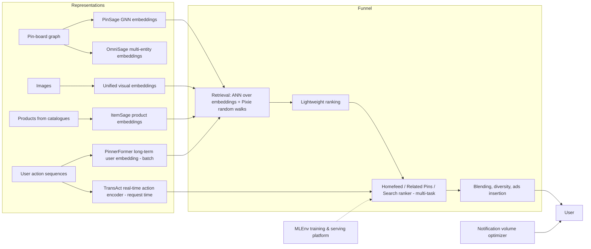

# Pinterest (PinSage, PinnerFormer, Lens & visual search, ads, notifications, ML platform)

> **Why this matters at staff level.** Pinterest is a visual discovery engine whose ML story is unusually well documented: graph neural networks at web scale (PinSage), sequence models for long-term user representations (PinnerFormer, TransAct), a decade of visual search papers (2015 → 2019 → Shop the Look), and platform work (MLEnv). Interviewers for ranking, visual, ads and platform roles expect you to know these papers and to reason about a bipartite pin-board graph, image-first retrieval and multi-objective ranking.

!!! warning "Sources in this chapter"
    Claims are tied to public Pinterest papers and engineering posts, cited by exact title, venue and year in [Sources](#sources). URLs are omitted where they could not be verified in the build environment (STYLE.md §4). Anything not in a public source is marked **inference**.

## 1. The business in one paragraph

Pinterest monetises inspiration: users ("Pinners") save images ("Pins") to boards, and the product surfaces related and personalised Pins in Home feed, Related Pins, Search and Lens (camera search). Revenue is advertising, increasingly shopping ads that must match products to visual intent, so Pinterest's core ML assets are (1) representations of Pins, products and users learned from the pin-board graph and from images, (2) a multi-stage recommendation funnel driven by those embeddings, (3) visual search and product understanding for Lens and Shop the Look, (4) ads ranking and (5) notification optimisation, all built on an ML platform the company has described publicly.

## 2. The ML problems that define the company

| Problem | Why it is hard | Public evidence |
|---|---|---|
| Item representations from a graph | Billions of nodes; the pin-board bipartite graph is the strongest signal; GCNs do not scale naïvely | "Graph Convolutional Neural Networks for Web-Scale Recommender Systems" (PinSage, KDD 2018); "Pixie" (WWW 2018); "OmniSage" (2025) |
| User representations | Long histories, many interests, must predict *long-term* engagement not just next action | "PinnerSage" (KDD 2020); "PinnerFormer" (KDD 2022); "TransAct" (KDD 2023) and TransAct V2 (2025) |
| Visual search | Query is an image; billions of candidates; fine-grained fashion and home décor | "Visual Search at Pinterest" (KDD 2015); "Visual Discovery at Pinterest" (WWW 2017); "Unifying visual embeddings for visual search at Pinterest" (KDD 2019); "Shop The Look" (KDD 2020) |
| Product understanding | Products from merchant catalogues with noisy metadata; match to visual content | "ItemSage" (KDD 2022) |
| Homefeed ranking | Real-time actions must move rankings within seconds; multi-objective | "How Pinterest Leverages Realtime User Actions in Recommendation to Boost Homefeed Engagement Volume" (2023) |
| Notifications | Volume control as a per-user optimisation with unsubscribes as cost | "Notification Volume Control and Optimization System at Pinterest" (KDD 2018) |
| Related Pins evolution | System of many candidate sources evolved over years | "Related Pins at Pinterest: The Evolution of a Real-World Recommender System" (WWW 2017) |
| ML platform | Many frameworks and training environments to standardise | "MLEnv: Standardizing ML at Pinterest Under One ML Engine" (2023) |
| Inclusive ranking | Skin-tone and body-type diversity in results | Pinterest posts on skin tone ranges and body type ranges (2018–2023) |

## 3. The stack as publicly described

*What is public:* PinSage as the GNN embedding trained with random-walk-based neighbourhoods and a MapReduce inference pipeline (KDD 2018); Pixie as a real-time random-walk retrieval system on the graph (WWW 2018); unified visual embeddings serving several visual products (KDD 2019); ItemSage product embeddings trained multi-task for search and recommendation (KDD 2022); PinnerFormer as a daily-batch user embedding trained for long-term engagement (KDD 2022); TransAct as the real-time action encoder in the Homefeed ranker (KDD 2023); the notification optimiser (KDD 2018); MLEnv as the unified ML engine (2023). *Inference:* the exact set of retrieval sources per surface today and the funnel sizes are not published.

## 4. Deep dives

### 4.1 PinSage: GNN embeddings at web scale

**The problem.** Pinterest's best signal is the graph: which Pins were saved to which boards. Graph convolutional networks aggregate neighbourhood information, but full-graph training on billions of nodes and edges is infeasible.

**The approach.** PinSage defines neighbourhoods by *importance sampling*: short random walks from a node produce a fixed-size set of the most-visited neighbours with visit-count weights, replacing $k$-hop expansion. Convolutions aggregate neighbour embeddings (weighted by those counts) with the node's own features (visual and text embeddings) through learned transforms. Training uses a max-margin ranking loss on (query, positive) pairs from engagement, with hard negatives curriculum-scheduled (progressively harder negatives sampled by PageRank rank). Inference is a MapReduce pipeline that computes each layer's aggregations once per node, avoiding repeated computation. Producer-consumer GPU training pipelines keep the GPU busy while CPUs sample.

**Math link.** Layer update $h_v^{(k)} = \sigma\!\left(W \cdot [\,h_v^{(k-1)} \,\|\, \text{AGG}(\{h_u^{(k-1)} : u \in \mathcal{N}(v)\})\,]\right)$, normalised to unit length; see [attention mathematics](../part05-sequence-transformers/03-attention-mathematics.md) for the aggregation view and [visual search design](../part17-ml-system-design/06-visual-search-image-retrieval.md).

**The trade-off.** Sampled neighbourhoods and hard-negative curricula make training tractable and effective; the cost is an offline pipeline (embeddings are not updated on the fly) and sensitivity to sampling hyperparameters. The paper reports large gains over content-only and prior embedding baselines in offline hit-rate and MRR and in A/B tests.

!!! tip "How to say it in the interview"
 "To embed Pins I would use the graph, because on Pinterest the pin-board graph is the strongest signal, and I would follow the PinSage design from KDD 2018: neighbourhoods defined by random-walk importance sampling rather than full k-hop expansion, aggregation of neighbour embeddings weighted by visit counts, and a max-margin ranking loss with a curriculum of hard negatives. Each of those choices has a stated reason in the paper, sampling bounds memory, weighting favours the neighbours that matter, and hard negatives were needed to separate near-duplicates. I would reject a content-only embedding as the primary representation; the paper shows the graph adds substantially over image and text features alone. The trade-off is that embeddings are computed offline in a MapReduce pass, so fresh Pins need a content-based fallback until the next run. Evaluation: hit-rate and MRR on held-out engagement pairs, then an A/B on the surface. If the interviewer asks about newer work, I would mention OmniSage's multi-entity extension as the direction Pinterest published in 2025."

### 4.2 PinnerFormer and TransAct: long-term and real-time user models

**The problem.** A user embedding computed from the last few actions predicts the next action well but forgets long-term interests; a batch embedding is cheap to serve but stale; the ranker also needs to react to what the user did seconds ago.

**The approach.** PinnerFormer (KDD 2022) is a transformer over a user's action sequence trained with a *dense all-action* loss: rather than predicting the next action, it predicts positive engagements over the next several days from every position in the sequence, so a once-a-day batch embedding remains useful all day. TransAct (KDD 2023) encodes the user's *most recent* actions with a transformer at request time inside the Homefeed ranker, combined with the batch embedding; the paper describes hybrid batch/real-time design, ablations, and a random time-window mask to reduce the model's tendency to over-focus on recency. TransAct V2 (2025) extends sequence length and adds negative-action handling; the 2023 engineering post reports large Homefeed engagement gains from real-time actions.

**Math link.** The dense all-action objective is a contrastive loss between the sequence representation at position $t$ and the embeddings of positives in $[t, t+\Delta]$; see [CLIP & contrastive learning](../part08-multimodal/03-clip-contrastive.md) and [feed ranking](../part17-ml-system-design/01-recommendation-feed-ranking.md).

**The trade-off.** Batch embeddings are cheap and cover long histories; request-time encoders are expensive but reactive. Pinterest chose both: PinnerFormer for long-term, TransAct for real-time, and reports that the combination beats either alone.

!!! tip "How to say it in the interview"
 "I would model the user with two components, following what Pinterest published: a daily batch embedding trained for long-term engagement, as in the PinnerFormer paper from KDD 2022, and a request-time transformer over the last few dozen actions inside the ranker, as in TransAct from KDD 2023. The PinnerFormer decision I would copy is the dense all-action loss (predicting engagements over the next days from every position instead of the next action) because that is what makes a once-a-day embedding hold up across the day. The TransAct decision I would copy is the random time-window mask, since the paper found a real-time encoder otherwise overfits to the last action and reduces diversity. I would reject a real-time-only encoder over the full history for latency reasons. The trade-off is two pipelines to maintain; the 2023 Homefeed post reports the real-time addition was worth it. Evaluation: offline recall for future engagement, then Homefeed engagement and diversity in an A/B."

### 4.3 Visual search: a decade of Pinterest Lens

**The problem.** The query is a photo; the catalogue is billions of images; users want the *object* (a lamp in a room), not the whole scene; fashion and décor are fine-grained.

**The approach (as published).** The 2015 KDD paper built visual search from off-the-shelf deep features, object detection to crop query regions, and a distributed nearest-neighbour index, and reported that engagement rose when visually similar Pins were shown. The 2017 WWW paper described Lens and Shop the Look: real-time object detection on the query image, per-object retrieval, blending visual and text/graph signals. The 2019 KDD paper unified several task-specific visual embeddings into one multi-task embedding serving Lens, Shop the Look and Related Pins, reducing serving cost and improving quality through shared training. Shop the Look (KDD 2020) describes the end-to-end system: object detection on scene images, product embeddings, and retrieval into a shopping catalogue with a human-in-the-loop quality process.

**Math link.** [Detection](../part04-vision/04-detection.md), [visual search design](../part17-ml-system-design/06-visual-search-image-retrieval.md), [CNN architectures](../part04-vision/03-cnn-architectures.md).

**The trade-off.** One unified embedding is cheaper and more consistent than several, at the cost of multi-task training complexity and possible negative transfer; Pinterest reports the unified model matched or beat specialised ones.

!!! tip "How to say it in the interview"
    "For Lens I would build the pipeline Pinterest documented across its 2015, 2017 and 2019 papers: detect objects in the query image, embed each crop, retrieve with ANN, and blend with graph and text signals. The decision I would defend is a single multi-task visual embedding for all visual products, which Pinterest's KDD 2019 unification paper shows cut serving cost and improved quality over task-specific models; the alternative, one embedding per product, is simpler to iterate on but fragments the index. The trade-off is negative transfer between tasks, which I would monitor with per-task offline metrics. For shopping I would follow the KDD 2020 Shop the Look design and keep humans in the loop to verify product matches, because catalogue metadata is noisy. Evaluation: recall@k on labelled query-product pairs by category, then engagement and conversion online."

### 4.4 ItemSage and shopping

**The problem.** Products arrive from merchant feeds with inconsistent text and images; Pinterest must embed them so that image queries, text queries and Pin-based recommendations all retrieve the right products.

**The approach.** ItemSage (KDD 2022) learns product embeddings with a transformer over the product's images (via PinSage image features) and text, trained *multi-task* on engagement from search (text queries) and from Pin-based surfaces (image queries) so one embedding serves both; the paper reports improvements in retrieval and conversion metrics. OmniSage (2025) generalises to multiple entity types with graph, content and sequence signals.

!!! tip "How to say it in the interview"
 "For product embeddings I would train one model on both query modalities (text queries from search and Pin/image queries from recommendations) as Pinterest's ItemSage paper at KDD 2022 does, because a separate embedding per surface doubles infrastructure and misses the cross-modal signal. I would reject relying on merchant text alone; it is inconsistent, and ItemSage's use of image features handles that. The trade-off is balancing tasks during training, so I would weight losses to match traffic. Evaluation: retrieval recall per query type and downstream conversion."

### 4.5 Notifications: volume control as optimisation

**The problem.** Notifications drive visits but too many cause unsubscribes; the right volume differs per user.

**The approach.** The KDD 2018 paper models per-user weekly volume as a constrained optimisation: predict, for each user and volume level, the probability of engagement and of unsubscribing, then allocate volume to maximise total engagement subject to a global unsubscribe budget, solved via a Lagrangian across users. The paper reports gains in engagement with fewer notifications.

**Math link.** Maximise $\sum_u \sum_k x_{uk}\, g_u(k)$ s.t. $\sum_u \sum_k x_{uk}\, c_u(k) \le B$, $\sum_k x_{uk} = 1$; the Lagrangian relaxation gives a per-user threshold on $g_u(k) - \lambda c_u(k)$. See [notifications, uplift & experimentation](../part17-ml-system-design/11-notifications-uplift-experimentation.md).

!!! tip "How to say it in the interview"
    "I would treat notification volume as a per-user constrained optimisation, the framing in Pinterest's KDD 2018 notification paper: predict engagement and unsubscribe probability as a function of volume for each user, then allocate volume under a global unsubscribe budget with a Lagrangian threshold. I would reject a global send cap or a per-notification click model, because the cost of a notification is the unsubscribe risk, which is user-level and cumulative. The trade-off is that the volume-response curves need exploration data, so I would randomise volume on a small slice. Evaluation: visits and unsubscribes in an A/B, plus a long-term holdout for retention."

### 4.6 MLEnv: standardising the platform

**What is public.** The 2023 MLEnv post describes consolidating many training and serving stacks into a single ML engine (PyTorch-based, with standard components for data loading, distributed training and serving) and reports faster iteration and adoption across teams; it emphasises the operational cost of heterogeneity.

!!! tip "How to say it in the interview"
    "If asked to run Pinterest's ML platform I would standardise on one engine with shared data loaders, trainers and serving templates, as Pinterest's 2023 MLEnv post describes, because the post's central lesson is that heterogeneity across teams was the tax on velocity. I would reject a federated 'every team picks its stack' model beyond an initial exploration phase. The trade-off is migration cost and some loss of local optimisation, which I would offset with an escape hatch for custom kernels. Evaluation: time from idea to A/B and the number of frameworks in production."

## 5. Likely interview questions

!!! interview "1. Design Pinterest Homefeed."
    **Sketch.** Multi-source retrieval (PinSage ANN, Pixie walks, follow graph, search-history), light ranker, multi-task heavy ranker with PinnerFormer + TransAct user inputs, blending with diversity and ads. Cross-link: [feed ranking](../part17-ml-system-design/01-recommendation-feed-ranking.md).

    !!! tip "How to say it in the interview"
        "I would build Homefeed with the components Pinterest has published: PinSage embeddings and Pixie random walks for retrieval, a multi-task ranker that takes a PinnerFormer batch user embedding and a TransAct real-time action encoder, and a blending layer for diversity and ads. The decision is the hybrid user model, because the TransAct paper shows real-time actions add large gains on top of the daily embedding while the daily embedding preserves long-term interests. I would reject a next-action-only user model. The trade-off is latency from the request-time encoder, bounded by capping the action window. Evaluation: engagement and saves online with diversity as a guardrail."

!!! interview "2. Why random-walk sampling in PinSage instead of k-hop neighbourhoods?"
    **Sketch.** Bounded memory, importance weighting, avoids hub explosion; math of visit counts as importance.

    !!! tip "How to say it in the interview"
        "The PinSage paper's argument is practical: k-hop expansion on a graph with hub boards explodes, whereas short random walks give a fixed-size neighbourhood and, as a bonus, visit counts that weight the neighbours that matter most. I would make the same choice for any graph with heavy-tailed degree. The trade-off is that sampling adds variance, which the paper mitigates by using enough walks. I would validate by measuring embedding quality against walk length and neighbourhood size."

!!! interview "3. Implement importance-weighted neighbour aggregation (coding)."
    **Sketch.** Given neighbour embeddings $H \in \R^{n\times d}$ and weights $w \in \R^{n}$, compute $\text{AGG} = \frac{\sum_i w_i\, \text{ReLU}(H_i W_1)}{\sum_i w_i}$, concat with own embedding, linear, normalise. Cross-link: [MLPs & activations](../part03-neural-nets/01-mlp-and-activations.md).

    !!! tip "How to say it in the interview"
        "I would transform each neighbour embedding with a linear layer and ReLU, take the weighted mean using the random-walk visit counts as weights, concatenate with the node's own representation, apply a second linear layer and L2-normalise, which is the PinSage convolution. I would test it by checking that with uniform weights it reduces to a mean aggregator and that gradients flow to both branches."

!!! interview "4. Build Lens: photo in, similar Pins and products out."
    **Sketch.** Detection, unified embedding, ANN, blending with text/graph, human QA for products, latency budget. Cross-link: [visual search design](../part17-ml-system-design/06-visual-search-image-retrieval.md).

    !!! tip "How to say it in the interview"
        "I would run object detection on the photo, embed each detected object with a unified multi-task visual embedding, retrieve with ANN from a sharded index, and blend with graph and text signals, which is the architecture across Pinterest's 2017 and 2019 papers. For products I would add the Shop the Look pipeline's human-in-the-loop verification. I would reject whole-image retrieval alone; users want the object. Evaluation: object-level recall, then engagement."

!!! interview "5. A new Pin has no engagement. How does it get recommended?"
    **Sketch.** Content embedding fallback (visual/text), PinSage features at inference from content, exploration slots, quick graph attachment via the board it was saved to.

    !!! tip "How to say it in the interview"
 "A fresh Pin has a board, so it is already in the graph; I would give it a content-based embedding immediately and let the PinSage pipeline pick up the graph signal at the next run, with a small exploration allocation to collect engagement. I would reject holding it out until it has engagement. The trade-off is index churn from fresh embeddings, so I would keep a small fresh index merged periodically, my inference beyond the papers. Evaluation: time-to-first-engagement for new Pins."

!!! interview "6. Your real-time action encoder increased engagement but reduced diversity. Fix it."
    **Sketch.** TransAct's random time-window masking; diversity re-ranking; weight of real-time vs batch features.

    !!! tip "How to say it in the interview"
        "TransAct's authors saw exactly this and added a random time-window mask during training so the model does not lock onto the most recent action, and I would do the same, plus a diversity term in blending. I would reject dropping the real-time encoder, since the engagement gain is large. Evaluation: diversity of impressed categories per session alongside engagement."

!!! interview "7. Design ads ranking for shopping ads on Pinterest."
    **Sketch.** Retrieval with ItemSage embeddings, pCTR/pCVR multi-task ranker, auction and calibration, creative understanding via visual embeddings; specifics beyond published embeddings are **inference**. Cross-link: [ads CTR](../part17-ml-system-design/03-ads-ctr-prediction.md).

    !!! tip "How to say it in the interview"
        "I would retrieve products with ItemSage-style embeddings so that image and text intent both work, then rank with a multi-task click and conversion model whose calibrated outputs feed the auction. The design principle from Pinterest's published work is that shopping is visual, so creative embeddings belong in the ranker. Beyond the embedding papers, the ads ranker details are my inference. Evaluation: calibrated pCTR by slice, revenue and advertiser conversion in an A/B."

!!! interview "8. How would you standardise ML across dozens of teams?"
    **Sketch.** MLEnv-style single engine; migration plan; escape hatches. Cross-link: [ML platform](../part17-ml-system-design/12-ml-platform-feature-store-monitoring.md).

    !!! tip "How to say it in the interview"
        "I would follow the MLEnv approach: one engine, shared components, and a migration in waves starting with the highest-traffic models. I would reject mandating it overnight. Evaluation: iteration speed and incident rate."

!!! interview "9. Make results inclusive across skin tones."
    **Sketch.** Skin-tone detection on images, diversification in ranking, user-selectable filters, measure representation; Pinterest posts on skin tone ranges. Cross-link: [content moderation & trust](../part17-ml-system-design/07-content-moderation.md).

    !!! tip "How to say it in the interview"
 "I would build a skin-tone classifier on detected faces and skin regions, expose ranges as a user-selectable filter as Pinterest did, and add representation-aware diversification to ranking. I would reject silent re-ranking alone, users want control. Evaluation: representation across ranges in top results and user satisfaction."

!!! interview "10. Pick the objective for Related Pins."
    **Sketch.** Multi-objective (save, close-up, click), long-term engagement, evolution described in WWW 2017 paper.

    !!! tip "How to say it in the interview"
        "Pinterest's WWW 2017 Related Pins paper describes evolving from a simple system to many candidate sources and a learned ranker; I would optimise a blend of saves and close-ups rather than clicks, because saves are the intent signal for the product. I would reject click-only. Evaluation: saves per impression and long-term retention."

## 6. What to bring from your background

* **Visual search and detection** are Pinterest's core: emphasise object detection on user photos, fine-grained retrieval, unified embeddings and index engineering; Lens and Shop the Look are your problems.
* **Graph and sequence modelling**: be ready to derive PinSage aggregation and the PinnerFormer objective.
* **Product understanding**: OCR and document experience transfers to catalogue ingestion (merchant feeds, text-in-image), which ItemSage relies on.

## Sources

* Ying et al., "Graph Convolutional Neural Networks for Web-Scale Recommender Systems", KDD 2018 (arXiv 1806.01973).
* Eksombatchai et al., "Pixie: A System for Recommending 3+ Billion Items to 200+ Million Users in Real-Time", WWW 2018.
* Pal et al., "PinnerSage: Multi-Modal User Embedding Framework for Recommendations at Pinterest", KDD 2020.
* Pancha et al., "PinnerFormer: Sequence Modeling for User Representation at Pinterest", KDD 2022 (arXiv 2205.04507).
* Xia et al., "TransAct: Transformer-based Realtime User Action Model for Recommendation at Pinterest", KDD 2023; "TransAct V2", 2025.
* Pinterest Engineering, "How Pinterest Leverages Realtime User Actions in Recommendation to Boost Homefeed Engagement Volume", 2023.
* Jing et al., "Visual Search at Pinterest", KDD 2015; Zhai et al., "Visual Discovery at Pinterest", WWW 2017; Zhai et al., "Learning a Unified Embedding for Visual Search at Pinterest", KDD 2019; Shiau et al., "Shop The Look: Building a Large Scale Visual Shopping System at Pinterest", KDD 2020.
* Baltescu et al., "ItemSage: Learning Product Embeddings for Shopping Recommendations at Pinterest", KDD 2022; Pinterest, "OmniSage: Large Scale, Multi-Entity Heterogeneous Graph Representation Learning", 2025.
* Zhao et al., "Notification Volume Control and Optimization System at Pinterest", KDD 2018.
* Liu et al., "Related Pins at Pinterest: The Evolution of a Real-World Recommender System", WWW 2017.
* Pinterest Engineering, "MLEnv: Standardizing ML at Pinterest Under One ML Engine", 2023.
* Pinterest Newsroom and Engineering posts on skin tone ranges (2018 onward) and body type ranges (2023).
