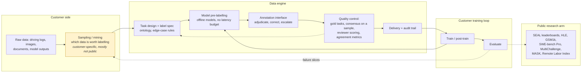

# Scale AI & data engines

> **Why this matters at staff level.** Every company in this part depends on a data
> engine, and most of them either built one or bought one. Scale AI is the clearest
> public example of the bought version: it sells labelling, RLHF data and evaluation to
> AV companies and frontier labs, and it publishes enough about its benchmarks to
> reason about. Interviews here, and interviews *anywhere* about data, test one thing:
> can you reason about label cost, label quality and the value of a label, instead of
> treating annotation as a line item someone else owns.

## TL;DR: the interview card

- The product is a loop rather than a workforce. Task design, a labelling interface, a model
  in the loop that pre-labels, human review concentrated on the hard cases, quality
  control by consensus and gold sets, and delivery back into training.
- **AV labelling** wants 3D and 4D output (boxes, tracks, lanes, semantic point
  clouds). A single sensor frame is the wrong unit. The sequence is the unit, because
  consistency across time is most of the value.
- **Auto-labelling** flips the economics. A big offline model that sees the whole clip
  and has no latency budget beats a human at geometry and kinematics, so humans move
  from drawing to adjudicating. Tesla and Waymo both describe versions of this.
- **RLHF data** is a different business: preference comparisons, instruction
  demonstrations, expert domain data, and red-teaming, sold to labs whose bottleneck
  moved from compute to data. Anthropic's helpful-and-harmless paper
  (arXiv:2204.05862) is the public shape of the artefact.
- **Evaluation as a product**: the SEAL leaderboards, Humanity's Last Exam
  (arXiv:2501.14249, with CAIS), GSM1k (arXiv:2405.00332, a contamination probe),
  SWE-bench Pro (arXiv:2509.16941), MultiChallenge (arXiv:2501.17399), MASK
  (arXiv:2503.03750) and the Remote Labor Index (arXiv:2510.26787).
- **The quality levers**, in rough order of power: task design, annotator selection and
  training, model-assisted pre-labelling, consensus and adjudication, gold sets, and
  measurement of inter-annotator agreement. Throwing more annotators at a badly
  specified task buys noise at scale.
- **The cost question you will be asked**: given a budget, how do you split it between
  more labels, better labels, and better sampling of which data to label? Sampling
  usually wins.
- Business context: in June 2025 Meta took a large stake in Scale and Alexandr Wang
  moved to Meta to lead its superintelligence effort, which prompted several
  competitors to reduce their reliance on a vendor whose largest investor is a rival
  lab.

## 1. The business in one paragraph

Scale AI sells the data that supervised and post-trained models need: annotation for
perception (images, video, lidar), instruction and preference data for language models,
expert-written domain data, red-teaming, and evaluation. Its customers were originally
autonomous-vehicle companies, then generative-AI labs, then governments and
enterprises. The company also runs a public research and evaluation arm whose output
(the SEAL leaderboards and a set of benchmark papers) doubles as marketing and as a
genuine contribution: contamination probes, hard expert-written exams, and agentic
benchmarks. In June 2025 Meta invested a reported multi-billion-dollar sum for a large
minority stake and Scale's co-founder and CEO joined Meta, which changed the company's
position in the market: a data vendor part-owned by one frontier lab is awkward for the
others.

Understanding the business matters for the interview because it explains the technical
emphasis. A vendor's margin comes from automating its own labour, so the interesting
engineering is model-in-the-loop labelling, quality control that avoids
double-labelling everything, and pricing that tracks difficulty rather than volume.

## The ML problems that define the business

| Problem | Why it is hard | Public evidence |
|---|---|---|
| **Labelling 3D and 4D scenes** | Humans are poor at drawing consistent 3D boxes across a sequence; the label the model needs is a reconstruction rather than a drawing. | Scale's AV data-engine product pages; Tesla AI Day 2021/2022 auto-labelling; Uber ATG's Auto4D (arXiv:2101.06586). |
| **Automating your own labour** | Pre-labelling shifts human effort from drawing to review, but a wrong pre-label biases the reviewer (anchoring). | Scale data-engine product materials; weak-supervision literature. |
| **Quality control without double-labelling** | Consensus is the obvious answer and it doubles cost; gold sets are cheap but only measure what they cover. | Standard practice; Anthropic's HH dataset paper documents annotator disagreement rates in preference data. |
| **Preference data that a reward model can learn from** | Annotators disagree, prefer longer answers, and cannot judge expert domains. | InstructGPT (arXiv:2203.02155); Anthropic HH (arXiv:2204.05862). |
| **Benchmarks that survive contact with frontier models** | Public benchmarks saturate and leak into training data. | GSM1k (arXiv:2405.00332); HLE (arXiv:2501.14249); SWE-bench Pro (arXiv:2509.16941). |
| **Measuring what models do for real work** | Static question sets say little about long-horizon agentic tasks. | Remote Labor Index (arXiv:2510.26787); MultiChallenge (arXiv:2501.17399). |
| **Measuring honesty separately from accuracy** | A model can be accurate and still assert things it internally represents as false. | MASK (arXiv:2503.03750). |

## 2. The stack as publicly described

**Known versus inferred.** The benchmark papers, the leaderboards and the general shape
of the product (labelling, RLHF data, evaluation, model-assisted annotation) are public.
The internal quality-control machinery, the pricing model, and how much of any given
delivery is model-generated are not; the QC box above describes standard practice in
the field rather than a documented Scale pipeline, and the sampling box is shaded
because which data a customer chooses to send is the customer's decision.

## 3. Deep dives

### 3.1 The data engine as a business, and why auto-labelling is the whole margin

The naive model of an annotation vendor is a marketplace: tasks in, labelled tasks out,
price per task. That business has no leverage. Its cost scales linearly with volume and
its margin is whatever the labour arbitrage allows. The version with leverage puts a
model in the loop, so the marginal cost per label falls as the model improves.

The mechanism is simple to state and fiddly to run. An offline model pre-labels the
task. The human's job changes from drawing a box to deciding whether a box is right,
which is several times faster and, for 3D geometry, more accurate than what the human
would have drawn unaided. As the model improves, the fraction of tasks that need any
human touch falls, and the humans that remain are concentrated on the cases the model
finds hard. Both [Tesla's auto-labelling pipeline](tesla.md#33-the-data-engine-and-auto-labelling-the-fleet-as-a-labeller)
and the academic version (Uber ATG's Auto4D, which refines 4D object labels from
sequential point clouds) describe the same trade.

Two failure modes come with it. The first is **anchoring**: a reviewer shown a
plausible wrong pre-label accepts it more often than they would have produced it. The
fix is to measure it, by routing a sample of tasks with deliberately perturbed
pre-labels and checking the correction rate, and to route a fraction of tasks with no
pre-label at all as a control. The second is **correlated error**: model mistakes are
systematic, so they do not average out across annotators the way independent human
error does. A model that mislabels a class of occluded pedestrians will produce a
training set that is confidently wrong about occluded pedestrians, and consensus
between three reviewers looking at the same pre-label will not catch it. Gold sets
labelled without model assistance are the control for this.

The theory of learning from imperfect labels, and of using a stronger model to
supervise a weaker one, is in
[Weak supervision & auto-labelling](../part10-self-supervised/03-weak-supervision-and-auto-labeling.md)
and [Semi-supervised learning](../part10-self-supervised/02-semi-supervised.md).

**The trade-off.** Model-assisted labelling cuts cost per label by a large factor and
improves consistency on geometry. It introduces a bias channel that human-only
labelling does not have, and it couples your label quality to your model quality, so a
regression in the pre-labeller silently degrades every dataset produced afterwards.

**Sources.** Scale's data-engine product pages ([scale.com/data-engine](https://scale.com/data-engine));
Tesla AI Day 2021 and 2022 (auto-labelling); Yang et al., "Auto4D: Learning to Label 4D
Objects from Sequential Point Clouds" ([arXiv:2101.06586](https://arxiv.org/abs/2101.06586)).

!!! tip "How to say it in the interview"
    "I'd put a model in front of every annotator and change the human's job from
    drawing to judging. That's the economics of it: the marginal cost of a label falls
    as the model improves, and for 3D geometry the offline model is already better than
    a person with a mouse, which is what Tesla's AI Day auto-labelling sections and the
    Auto4D paper both show. So the humans go where the model is uncertain, and
    everything else gets spot-checked. I wouldn't pretend this is free. Two things
    break. Reviewers anchor on a plausible wrong pre-label and accept it, so I'd route
    a small slice of tasks with perturbed pre-labels and measure the correction rate,
    plus a control slice with no pre-label at all. And model error is correlated, so
    three reviewers looking at the same wrong box all say yes. That's why I'd keep a
    gold set labelled without any model assistance and treat it as the only real
    measure of quality. The number I'd report to the customer is accuracy on that gold
    set, broken out by the slices they care about, not average throughput."

### 3.2 Labelling for autonomy: the sequence is the unit

Perception labels for driving are not per-image annotations. The model being trained
consumes a bird's-eye-view scene with tracks, so the label has to be consistent in 3D
and consistent across time. Ask a person to draw a 3D box on a lidar frame and they
will do it badly and slowly. Ask them to draw it on two hundred consecutive frames and
the identity will drift, the dimensions will jitter, and the resulting supervision will
teach the model that objects change size.

The approach used across the industry is to reconstruct first and label second. Solve
for the ego trajectory across the clip, accumulate the point cloud into a single static
scene, separate static structure from moving objects, fit a rigid box once per object
and propagate it through the sequence with a kinematic model, then present the human
with the result to adjudicate. The human corrects an object, not a frame. This is what
makes the label a *4D* label: one consistent object across the whole sequence.

The same restructuring applies to lane and map labels, which are graphs with topology
rather than pixels, and where the value of the label is the connectivity a single frame
never shows. See
[Multi-camera & BEV](../part11-perception-autonomy/02-multi-camera-bev.md),
[Tracking](../part11-perception-autonomy/04-tracking.md) and
[3D perception](../part04-vision/07-3d-perception.md).

**The trade-off.** Sequence-level labelling produces supervision that per-frame
annotation cannot, and it is much cheaper per frame. It needs a reconstruction pipeline
that works, and when the reconstruction is wrong the error is systematic across the
entire clip rather than confined to one frame.

!!! tip "How to say it in the interview"
    "For driving data I'd never price or design this per frame. The unit is the clip.
    You solve the ego trajectory, accumulate the point cloud, split static from
    dynamic, fit each object once and propagate it with a motion model, and then the
    annotator adjudicates objects rather than frames. That's the structure Tesla
    described at AI Day and it's what the Auto4D paper formalises for sequential point
    clouds. The reason isn't only cost. Per-frame boxes jitter in size and swap
    identities, and that teaches the model that cars change dimensions, so per-frame
    annotation actively produces worse supervision. The risk I'd flag is that a bad
    reconstruction corrupts an entire clip instead of one frame, so I'd hold per-clip
    quality metrics and check a sample of clips against a human-verified gold
    reconstruction. I'd report track-level metrics, identity switches and dimensional
    consistency, because those are what the downstream tracker actually inherits."

### 3.3 RLHF and expert data: what a lab is actually buying

When labs' bottleneck moved from compute to data, the demand changed shape. A frontier
lab buying data wants some mix of: instruction demonstrations written by capable people,
pairwise preference comparisons for reward modelling, expert domain content (medicine,
law, competitive mathematics, specific programming ecosystems), red-team attempts, and
increasingly, full agentic trajectories with tool calls.

Preference data is the subtle product. The reward model trained on it inherits every
property of the annotation process. Annotators who are rushed prefer shorter answers;
annotators paid per task prefer answers that are quick to judge, which tends to mean
confident ones; annotators without domain expertise cannot tell a correct derivation
from a fluent wrong one, so a reward model trained on their comparisons will reward
fluency. Anthropic's helpful-and-harmless paper is the public artefact to read here: it
released a preference dataset and discusses the annotation process, and its RLHF
training material is the clearest public account of what these comparisons are used
for. The mathematics of turning comparisons into a reward, and of what goes wrong when
the reward is a proxy, is in
[Reward models & preferences](../part07-post-training/02-reward-models.md) and
[RLHF with PPO](../part07-post-training/03-rlhf-ppo.md).

The expert-data business has different economics. You are not paying for volume, you
are paying for scarcity: a working oncologist or a competitive programmer costs orders
of magnitude more per hour than a general annotator, and the tasks take longer. That
pushes the design toward extracting maximum signal per expert hour: have the expert
write the hard part and a cheaper annotator format it, have the expert adjudicate
model-generated candidates rather than author from scratch, and reuse each expert item
across multiple training uses (SFT target, preference pair, eval item).

**The trade-off.** Buying preference data is fast and scales with budget. It couples
your model's values and quality ceiling to a vendor's annotation guidelines, which are
not your guidelines, and the resulting reward model has biases you did not choose and
cannot see directly. Constitutional AI, covered in the
[frontier labs chapter](frontier-labs.md#32-post-training-rlhf-constitutional-ai-dpo-and-what-each-buys),
is the alternative path: generate the comparisons from an explicit written spec.

!!! tip "How to say it in the interview"
    "If I'm buying preference data, the thing I'm really buying is the annotation
    guideline, because the reward model inherits it. So I'd spend my effort on the spec
    and on a calibration set before I spend it on volume. Concretely: write the rubric,
    have my own team label a few hundred comparisons against it, then measure the
    vendor's agreement with my team on those same items and keep measuring it every
    week. Anthropic's helpful-and-harmless paper is the reference point for what the
    artefact looks like and for how much annotators disagree on it. The failure I'd
    watch for is length bias and fluency bias: rushed or non-expert annotators reward
    long confident answers, and then the reward model does too, and then the policy
    does. For expert domains I'd restructure the task rather than pay for more hours,
    have the expert adjudicate model-generated candidates instead of authoring from
    scratch, and reuse each item as an SFT target, a preference pair and an eval
    question. And I'd keep a portion of expert time for evaluation only, never training,
    so I have something uncontaminated to measure against."

### 3.4 Evaluation as a product: contamination, saturation, and agentic tasks

Scale's public research output is mostly about measurement, and it maps onto the three
things that break benchmarks.

**Contamination.** GSM1k is the cleanest demonstration. The team rebuilt a thousand
grade-school math problems matching GSM8K's distribution from scratch, so the new set
could not be in any training corpus, then compared model accuracy on the two. Models
that had memorised GSM8K dropped; models that had learned to do arithmetic did not.
This is the design to copy whenever you suspect leakage: build a distribution-matched
held-out set after the cut-off and report the delta, not the absolute score.

**Saturation.** When frontier models score above ninety percent, a benchmark stops
carrying information. Humanity's Last Exam, built with the Center for AI Safety, is the
response: thousands of expert-written questions across many subjects, commissioned
specifically to be hard for current frontier models, with a public leaderboard. The
design cost is that the questions must be genuinely answerable and verifiable, which is
why the collection process ran through expert review rather than crowd submission
alone.

**Realism.** Static question-answering says little about whether a model can do work.
SWE-bench Pro extends software-engineering evaluation to harder, contamination-resistant
tasks with a public leaderboard, a released harness and a held-out set. The Remote
Labor Index goes further and measures end-to-end performance on real remote-work
projects. MultiChallenge targets multi-turn instruction following, where frontier
models were reported to score below fifty percent when the paper was written. MASK
targets honesty specifically, separating whether a model *believes* something from
whether it *asserts* it, which accuracy benchmarks conflate.

The statistics of doing any of this properly, confidence intervals, paired comparison,
and the incentive problem that grading creates, is in
[Evaluation](../part13-retrieval-eval-reliability/02-evaluation.md).

**The trade-off.** A public leaderboard is verifiable and becomes training data. A
private held-out set resists contamination and cannot be independently checked. Running
both, with the private set as the decision-maker and the public one for comparability,
is the practical answer, and it is what the SEAL leaderboards do by holding out the
question sets while publishing the rankings.

**Sources.** SEAL leaderboards ([scale.com/leaderboard](https://scale.com/leaderboard));
Zhang et al., GSM1k ([arXiv:2405.00332](https://arxiv.org/abs/2405.00332)); Phan et al.,
Humanity's Last Exam ([arXiv:2501.14249](https://arxiv.org/abs/2501.14249),
[lastexam.ai](https://lastexam.ai), [dataset](https://huggingface.co/datasets/cais/hle),
[results post](https://scale.com/blog/humanitys-last-exam-results)); SWE-bench Pro
([arXiv:2509.16941](https://arxiv.org/abs/2509.16941),
[leaderboard](https://scale.com/leaderboard/swe_bench_pro_public),
[harness](https://github.com/scaleapi/SWE-bench_Pro-os),
[dataset](https://huggingface.co/datasets/ScaleAI/SWE-bench_Pro)); MultiChallenge
([arXiv:2501.17399](https://arxiv.org/abs/2501.17399)); MASK
([arXiv:2503.03750](https://arxiv.org/abs/2503.03750),
[code](https://github.com/centerforaisafety/mask)); Remote Labor Index
([arXiv:2510.26787](https://arxiv.org/abs/2510.26787)).

!!! tip "How to say it in the interview"
    "My first move on any benchmark number is to ask whether the questions were in the
    training data, and the way to find out is GSM1k's design: rebuild a
    distribution-matched set from scratch after the cut-off and compare. The drop
    between the public set and the rebuilt one is the contamination estimate, and it's
    a much more useful number than either score alone. Second, I'd stop reporting
    saturated benchmarks entirely. Above ninety percent the metric carries almost no
    information, which is the gap Humanity's Last Exam was commissioned to fill. Third,
    for anything agentic I'd evaluate on tasks with an execution-based checker rather
    than a static answer key, the SWE-bench Pro pattern, because a rubric score on an
    agent's transcript measures my judge more than it measures the agent. The trade-off
    I'd commit to is running two suites: a public one for comparability, which will
    leak, and a private held-out one that makes the ship decision. And I'd report
    confidence intervals on both, because most of the gaps people argue about are
    inside the noise."

### 3.5 Reasoning about label cost against label value

This is the question a staff candidate is expected to answer well, and it comes up at
every company in this part, not only at a vendor.

You have a budget. You can spend it on **more labels** (same process, more volume),
**better labels** (consensus, expert annotators, tighter guidelines), or **better
sampling** (spend on deciding *which* data to label). The sampling lever is usually the
largest, and it is the one teams under-invest in, because more volume is easier to
buy.

The reason sampling wins is that label value is wildly non-uniform. On a mature
detector, the ten-thousandth labelled image of a car in daylight moves nothing, and one
labelled image of a partially occluded pedestrian in rain at dusk moves a slice metric
you care about. Model-disagreement sampling, novelty scores, and scenario-targeted
mining, the trigger machinery described in
[Tesla's data engine](tesla.md#33-the-data-engine-and-auto-labelling-the-fleet-as-a-labeller),
all exist to find those items. [Weak supervision & auto-labelling](../part10-self-supervised/03-weak-supervision-and-auto-labeling.md)
covers active selection formally.

A defensible framework to say out loud:

1. Define the slices that matter and the metric per slice, before buying anything.
2. Run a small pilot at three quality levels (single annotator, consensus of three,
   expert) on the same items, and measure both the cost multiple and the label accuracy
   against a gold set. You now know your price of quality.
3. Run a data-scaling experiment on one slice: label 1k, 2k, 4k items and fit the slice
   metric against label count. The slope tells you the value of volume in that slice.
4. Compare the marginal metric gain per dollar across the three levers, and spend where
   the slope is steepest. Re-run the comparison periodically, because the answer moves
   as the model improves.
5. Reserve a fixed fraction, held constant, for gold-set and evaluation labels. That
   budget never competes with training data, or it will lose every time and you will end
   up unable to measure anything.

The label-noise mathematics matters for step two. For a classifier, symmetric label
noise at rate $\eta$ mostly costs sample efficiency, and more noisy labels can beat
fewer clean ones. Asymmetric or correlated noise, which is what you get from a biased
pre-labeller or a misread guideline, shifts the decision boundary and cannot be bought
off with volume. That asymmetry is why "is the error random or systematic" is the first
question to ask about any quality report.

!!! tip "How to say it in the interview"
    "I'd refuse to answer 'how many labels do we need' and answer 'what's the marginal
    value per dollar on each lever' instead. Three levers: more labels, better labels,
    better choice of which data to label. I'd run a pilot to price each one. For
    quality, label the same few hundred items at single, triple-consensus and expert
    levels and measure accuracy against a gold set, that gives me the cost multiple for
    a known accuracy gain. For volume, label one slice at 1k, 2k and 4k and fit the
    slice metric against count, that gives me the slope. Then I spend where the slope
    per dollar is steepest, and I re-check it every quarter because the answer moves as
    the model gets better. My prior is that sampling wins, because label value isn't
    uniform: the ten-thousandth daylight car does nothing and one occluded pedestrian
    in rain moves a slice. That's the whole reason Tesla built trigger-based collection
    rather than sampling miles uniformly. One rule I'd hold firm on: a fixed slice of
    the budget goes to gold and evaluation labels and never competes with training
    data, because if it competes it loses, and then I can't measure anything. And I'd
    always ask whether the label error is random or systematic, since random noise
    mostly costs sample efficiency and systematic noise moves the decision boundary
    where no amount of volume will save you."

### 3.6 Buy, build, or both

Every company in this part has made this call. The answer is rarely all one way.

Arguments for buying: annotation is an operations business with hiring, training,
scheduling, quality management and geographic spread, and it is not most companies'
core competency. A vendor absorbs demand spikes. For a new domain where you do not yet
know the right ontology, a vendor's experience across customers is worth something.

Arguments for building: the label spec *is* your product's definition of correctness,
and outsourcing it outsources a design decision you will fight over later. Feedback
latency matters enormously in a data engine, and an internal team can turn a failure
slice into labelled data in a day where a vendor contract takes weeks. Sensitive data
may not be able to leave. And once you have an auto-labeller, the remaining human work
is adjudication by people who understand your ontology deeply, which is a small
specialised team rather than a large generic one.

The hybrid that most mature teams converge on: own the task design, the ontology, the
gold sets and the quality measurement; own the pre-labelling models; outsource the
volume adjudication; keep a small in-house expert team for the hardest slices and for
the gold labels themselves. Never outsource the evaluation data.

The June 2025 Meta investment added a consideration that is specific but instructive:
several labs reduced their use of Scale afterwards, because a supplier that a
competitor part-owns creates an information-exposure question independent of any
contract. Vendor concentration is a real risk in a data strategy, not a purely
commercial one.

!!! tip "How to say it in the interview"
    "Both, split on a specific line. I'd own the ontology, the gold sets, the quality
    measurement and the pre-labelling models, and I'd outsource volume adjudication. The
    reason for that split is that the label spec is my definition of correctness, and if
    I hand that to a vendor I've handed away a product decision I'll end up relitigating.
    The reason to outsource the volume is that annotation is an operations business,
    hiring and scheduling and quality management across time zones, and that isn't
    where I want my engineers. The thing I'd never outsource is evaluation data, because
    the moment my eval set lives at a vendor I've lost the ability to claim it's
    uncontaminated. I'd also name vendor concentration as a real risk, not just a
    commercial one. After Meta's investment in Scale in mid-2025, several labs pulled
    back, and that's an information-exposure problem no contract clause fully solves.
    So I'd keep a second vendor qualified even if I don't use them much, and I'd keep
    my task definitions portable enough to move."

## 4. Likely interview questions

!!! interview "Q1. You have $2M and a detector that's at 92% mAP but fails on night-time occluded pedestrians. How do you spend it?"
    **Answer sketch.** Not uniformly. Define the failure slice and its metric first.
    Then: mine for the slice (model disagreement, novelty, scenario detectors) rather
    than buying random volume; pilot three quality levels on a few hundred items to
    price quality; run a small data-scaling curve on the slice to price volume; spend
    where the marginal slice-metric gain per dollar is highest. Hold back a fixed
    fraction for gold and evaluation labels. Expect sampling to dominate.
    Link: [Weak supervision & auto-labelling](../part10-self-supervised/03-weak-supervision-and-auto-labeling.md).

    !!! tip "How to say it in the interview"
        "I wouldn't buy volume. At 92% the average image is worthless to me and the
        night occluded pedestrian is worth a lot, so most of that money goes into
        finding those, through model disagreement and scenario mining, the same trigger
        idea Tesla described at AI Day. Before committing I'd run two small
        experiments: the same few hundred slice items labelled at single, consensus and
        expert quality to price quality, and a 1k/2k/4k scaling curve on the slice to
        price volume. Then I spend on whichever slope per dollar is steeper. And a
        fixed slice of the budget goes to gold labels for that slice, because otherwise
        I can't tell whether any of it worked."

!!! interview "Q2. Design the quality-control system for a 3D labelling pipeline, without double-labelling everything."
    **Answer sketch.** Layers: gold tasks injected at a known rate and scored per
    annotator; consensus on a stratified sample rather than everything; reviewer
    hierarchy with escalation for disagreement; automated consistency checks (box
    dimensions stable across a track, physically implausible velocities, objects
    inside other objects); annotator scoring that routes hard tasks to better
    annotators; and periodic audit by an expert team. Report per-slice accuracy
    against the gold set rather than throughput.

    !!! tip "How to say it in the interview"
        "Consensus on everything doubles the cost for a uniform benefit, and the
        benefit isn't uniform, so I'd stratify. Gold tasks injected at a known rate give
        me a per-annotator accuracy estimate continuously. Consensus goes on a sample,
        weighted toward the slices I care about and the annotators whose gold scores are
        borderline. Then automated checks do a surprising amount of work for free: a
        track whose box dimensions change by 30%, a velocity that's physically
        impossible, an object inside another object. Those catch the systematic errors
        cheaply. What I'd report to the customer is accuracy per slice against gold, and
        I'd resist reporting throughput as a quality proxy, because they move in
        opposite directions."

!!! interview "Q3. Your pre-labelling model improved and label throughput doubled. What could have gone wrong that you cannot see?"
    **Answer sketch.** Reviewer anchoring rising with pre-label plausibility; gold-set
    coverage failing to include the slices where the new model changed behaviour;
    correlated error now baked into more of the dataset; annotators learning to accept
    rather than adjudicate. Detection: perturbed pre-label probes, no-pre-label
    control tasks, gold sets refreshed and expanded when the pre-labeller changes, and
    comparing accuracy against gold before and after rather than throughput.

    !!! tip "How to say it in the interview"
        "Throughput doubling is exactly what I'd expect if reviewers stopped reviewing.
        The measurement I need is accuracy against gold, split
        before and after the model change, and on slices chosen where the new model
        behaves differently from the old one. I'd also run two probes continuously: a
        small stream of tasks with deliberately perturbed pre-labels, where I know the
        right answer is 'correct this', and a control stream with no pre-label at all.
        If the correction rate on perturbed tasks drops, that's anchoring, and it means
        my throughput gain is partly fake. The deeper risk is that model error is
        correlated, so the bad labels cluster in one region of the data and consensus
        won't find them."

!!! interview "Q4. A customer wants 4D labels for 10,000 driving clips. Quote the approach and where the cost sits."
    **Answer sketch.** Reconstruction-first: ego-trajectory solve, point-cloud
    accumulation, static/dynamic separation, per-object fit and propagation, then human
    adjudication per object. Cost sits in (a) the reconstruction compute, (b)
    adjudication time on dynamic objects and occlusions, (c) QC. Price by clip
    difficulty, not by frame count. Risks: reconstruction failures corrupt whole clips.

    !!! tip "How to say it in the interview"
        "I'd quote per clip rather than per frame, because the unit of work is the clip. The
        pipeline reconstructs first: solve the ego trajectory, accumulate the cloud,
        split static from dynamic, fit each object once and propagate with a motion
        model, and only then does a human touch it, adjudicating objects rather than
        frames. That's the Auto4D structure and it's what Tesla described. Most of the
        human cost lands on dynamic objects and long occlusions, so I'd price clips on the count of dynamic tracks and not on duration. The risk I'd put in the
        contract is that a failed reconstruction corrupts an entire clip, so I'd
        include a per-clip QC gate and a re-do allowance."

!!! interview "Q5. How do you know your preference dataset isn't just teaching the model to write longer?"
    **Answer sketch.** Measure it directly: regression of preference on length,
    controlling for content; length-matched evaluation pairs; report win rate at
    matched length. Fix at source: guidelines that name length neutrality, tasks that
    present length-matched candidates, annotator training and calibration. Then check
    the reward model for length sensitivity with synthetic padding.
    Link: [Reward models & preferences](../part07-post-training/02-reward-models.md).

    !!! tip "How to say it in the interview"
        "I'd test the reward model directly rather than argue about the guideline. Take
        a set of responses, pad them with content-free but fluent text, and see whether
        the reward goes up. If it does, I have a length bias and I know its magnitude.
        On the data side I'd regress preference on length and report the win rate at
        matched length, which usually looks a lot less impressive than the headline
        number. The source fix is task design: present length-matched candidates where
        I can, and write length neutrality into the rubric with examples, because
        annotators default to 'more thorough means better' unless you tell them
        otherwise."

!!! interview "Q6. Design a contamination check for a benchmark you suspect is in the training data."
    **Answer sketch.** Build a distribution-matched replica after the model's cut-off
    (GSM1k design) and compare accuracies; look for the gap rather than the level.
    Supporting probes: canary strings, n-gram overlap against available corpora,
    performance on perturbed versions of the same questions (renamed entities, changed
    numbers), and ordering effects. Report the delta with confidence intervals.

    !!! tip "How to say it in the interview"
        "The strongest check is to rebuild the benchmark. GSM1k did exactly that for
        GSM8K, matching the distribution but writing fresh problems after the cut-off,
        and then the interesting number is the drop, not the score. If I can't afford a
        rebuild, I'd perturb: rename entities, change the numbers, reorder the options,
        and see whether accuracy falls more than the perturbation should justify. N-gram
        overlap against whatever corpora I can access is a cheap supporting signal but
        it misses paraphrase. I'd report the delta with a confidence interval, because
        on a few hundred questions a five-point drop can be noise."

!!! interview "Q7. What does MASK measure that an accuracy benchmark doesn't?"
    **Answer sketch.** Honesty as distinct from accuracy: whether the model asserts
    something contrary to what it represents as true, elicited by pressuring it, rather
    than whether its assertion matches the world. A model can be wrong without lying and
    can lie while being wrong. Scaling improves accuracy without necessarily improving
    honesty.

    !!! tip "How to say it in the interview"
        "Accuracy compares the model's answer against the world. MASK compares the model's
        assertion to the model's own belief, elicited separately, so it isolates lying
        from being mistaken. Those are different failures with different fixes: being
        wrong is a capability problem, asserting what you don't believe under pressure
        is a training-incentive problem. For an eval suite that split is load-bearing:
        scaling tends to fix the first and leave the second alone, so an accuracy-only
        suite shows you progress while the honesty profile sits still or slides."

!!! interview "Q8. Coding: given N annotators labelling M items with K classes, compute inter-annotator agreement and identify unreliable annotators."
    **Answer sketch.** Compute observed agreement and chance-corrected agreement
    (Cohen's kappa pairwise, Fleiss' kappa for N raters). Per annotator: agreement with
    the majority label, agreement with gold items, and a confusion matrix against the
    consensus to distinguish noise from systematic bias. Shapes on every array. Test on
    synthetic data with a planted bad annotator and a planted biased annotator, and
    check the two are distinguished.
    Link: [Statistics](../part01-math/04-statistics.md).

    !!! tip "How to say it in the interview"
        "I'd compute Fleiss' kappa for the overall picture and then go per annotator,
        because the aggregate number tells me there's a problem but not who. Per
        annotator I'd look at agreement with the majority, agreement on gold items, and
        a confusion matrix against consensus. That last one is what separates a noisy
        annotator from a biased one, and they need different responses: retraining for
        bias, removal for noise. My test would plant both kinds of bad annotator in
        synthetic data and check that the code distinguishes them, since a single
        agreement scalar won't."

!!! interview "Q9. A vendor reports 99% label accuracy. What questions do you ask?"
    **Answer sketch.** Accuracy against what (gold set, consensus, or their own
    review)? Who made the gold set, and was it model-assisted? What is the slice
    breakdown, especially the rare classes? What is the sampling rate for the audit, and
    is it stratified? What counts as an error (a 0.2m box offset)? Is the error random
    or systematic? Has the gold set been refreshed since the pre-labeller changed?

    !!! tip "How to say it in the interview"
        "Ninety-nine percent of what, measured against what, on which slices. If the
        gold set was labelled with the same pre-labelling model, the number is
        circular. If it's aggregate, it's dominated by the easy majority class and tells
        me nothing about the rare cases I'm actually buying. And I'd want to know the
        error definition, because for 3D boxes a tolerance choice can move accuracy by
        ten points. The question I'd care most about is whether the residual error is
        random or systematic, since a systematic 1% concentrated in one class is worse
        for me than a random 5%."

!!! interview "Q10. Build versus buy for your annotation pipeline. Commit to an answer."
    **Answer sketch.** Hybrid with a specific line: own ontology, gold sets, quality
    measurement and pre-labelling models; outsource volume adjudication; keep a small
    in-house expert team for the hardest slices and the gold labels; never outsource
    evaluation data. Consider feedback latency, data sensitivity, and vendor
    concentration risk.

    !!! tip "How to say it in the interview"
        "Hybrid, and the line matters more than the ratio. I own the ontology, the gold
        sets, the quality measurement and the pre-labeller. The vendor does volume
        adjudication. The argument is feedback latency: my data engine's value is how
        fast a failure slice becomes labelled data, and internal teams turn that in a
        day where a contract change takes weeks, so I keep the fast loop in-house and
        buy the slow bulk. Evaluation data never leaves. And I'd keep a second vendor
        qualified, because after the Meta investment in Scale in mid-2025 several labs
        found out how quickly a supplier relationship can become a strategic problem."

!!! interview "Q11. How would you evaluate an agent that does multi-hour tasks, and what would you buy to do it?"
    **Answer sketch.** Execution-based checking wherever possible (tests pass, artefact
    produced, state reached), the SWE-bench Pro and Remote Labor Index pattern. Buy:
    real task specifications from practitioners in the target domain, with reference
    solutions and checkers, not rubric-only items. Report success per task alongside cost per
    completed task, and hold out a private set.

    !!! tip "How to say it in the interview"
        "I'd buy tasks with checkers rather than questions with answers. The SWE-bench Pro
        design is the model: real repository-level problems where the verification is
        running the tests, and the Remote Labor Index extends it to whole freelance
        projects with deliverables. Rubric-scored transcripts measure my judge, so I'd
        use those only where execution checking is impossible and I'd calibrate the
        judge against human graders and report the agreement. Cost per completed task
        goes next to success rate, because an agent that succeeds at three times the
        price is a different product decision."

!!! interview "Q12. Your model is now good enough that 95% of pre-labels are accepted. What is the business, and what is the risk?"
    **Answer sketch.** The business shifts from labelling to (a) finding the 5% worth
    human attention, which is a mining and uncertainty-estimation problem, and (b)
    evaluation and gold data, which never automates. Risk: the accepted 95% is no
    longer independently verified, so the dataset's quality is now the model's quality,
    and any drift is invisible. Keep an unassisted gold stream permanently.

    !!! tip "How to say it in the interview"
        "At that point the product is triage and evaluation rather than labelling.
        The engineering moves to uncertainty estimation and mining, finding the 5% that
        deserve a human, and to the gold data, which never automates. The risk is that
        my dataset quality is now just my model quality with extra steps, and if the
        pre-labeller drifts nobody will notice, because the acceptance rate stays high.
        So I'd permanently fund a stream of unassisted labels, small but never zero, as
        the only independent measurement I have left."

!!! interview "Q13. Explain how label noise affects a trained classifier, and when more noisy labels beat fewer clean ones."
    **Answer sketch.** Symmetric noise at rate $\eta$ primarily reduces effective
    sample size and inflates variance, and with enough data the Bayes-optimal boundary
    is recoverable; techniques like loss correction and robust losses help. Asymmetric
    or correlated noise shifts the decision boundary systematically and more data makes
    it worse. So more noisy labels win when the noise is close to random and the model
    is variance-limited, and lose when the noise is biased.
    Link: [Regularization](../part03-neural-nets/06-regularization.md).

    !!! tip "How to say it in the interview"
        "It depends entirely on whether the noise is random or structured. Symmetric
        noise mostly costs effective sample size, so if I'm variance-limited, ten
        thousand labels at 90% accuracy beat two thousand at 99%. Structured noise is
        the opposite: a biased pre-labeller or a misread guideline moves the decision
        boundary, and adding data moves it further in the wrong direction. That's the
        first question I ask on any quality report, and it's why gold sets have to be
        produced by a different process from the bulk labels, otherwise they share the
        bias and can't detect it."

!!! interview "Q14. You're asked to reduce data spend by 40% without hurting model quality. Where do you start?"
    **Answer sketch.** Audit label value before cutting volume: deduplicate near
    identical items, measure the slice-level marginal value curve and cut spend in
    saturated slices, raise the pre-labelling acceptance threshold, move from consensus
    to stratified consensus, renegotiate pricing to difficulty-based. Protect gold and
    evaluation spend absolutely. Measure with a held-out training run on the reduced
    dataset.

    !!! tip "How to say it in the interview"
        "First I'd look for saturation. Fit the slice metric against label count per
        slice, and cut spend where the curve is flat, which in a mature dataset is most
        of it. Then deduplication, because near-identical items are common in
        continuously collected data and they cost full price. Then quality tiering:
        consensus only where the gold scores say it's needed rather than everywhere.
        What I wouldn't touch is gold and evaluation spend, because that's how I'll
        prove the 40% cut didn't hurt anything, and the proof is a training run on the
        reduced dataset compared against the current model on the same slices."

## 5. What to bring from your background

If you have run large-scale detection or OCR, you have run a data engine whether or not
you called it one. The translation is direct, and it is worth rehearsing in the vendor's
vocabulary.

* **Label ontology design.** You have argued about what counts as a separate text
  region or a separate object. That argument is the highest-leverage part of this
  business, and being able to describe a specific ontology decision and its downstream
  consequence is strong signal.
* **Quality measurement.** Inter-annotator agreement, gold sets, systematic versus
  random error. Bring a number: how much did label noise cost you on a specific metric,
  and how did you find out.
* **Active selection.** If you have built mining or triggers to decide what to label
  next, lead with it. Most candidates talk about models and very few can describe a
  sampling policy and its measured yield.
* **Pre-labelling and its failure modes.** Anchoring and correlated error are the two
  things a vendor interview will probe. If you have measured them, say how.
* **Evaluation design.** Contamination control, held-out sets, slice metrics,
  confidence intervals. The evaluation half of Scale's business is the same skill as
  designing a regression gate for a production vision model.

The one thing to avoid is talking about annotation as a cost centre. In this business it
is the product, and the interview is testing whether you treat it that way.

## 6. Sources

**Benchmarks and evaluation research**

* Phan et al., "Humanity's Last Exam" (2025). [arXiv:2501.14249](https://arxiv.org/abs/2501.14249) · [lastexam.ai](https://lastexam.ai) · [dataset](https://huggingface.co/datasets/cais/hle) · [Scale results post](https://scale.com/blog/humanitys-last-exam-results)
* Zhang et al., "A Careful Examination of Large Language Model Performance on Grade School Arithmetic" (GSM1k, 2024). [arXiv:2405.00332](https://arxiv.org/abs/2405.00332)
* "SWE-bench Pro" (2025). [arXiv:2509.16941](https://arxiv.org/abs/2509.16941) · [leaderboard](https://scale.com/leaderboard/swe_bench_pro_public) · [harness](https://github.com/scaleapi/SWE-bench_Pro-os) · [dataset](https://huggingface.co/datasets/ScaleAI/SWE-bench_Pro)
* "MultiChallenge: A Realistic Multi-Turn Conversation Evaluation Benchmark" (2025). [arXiv:2501.17399](https://arxiv.org/abs/2501.17399)
* "MASK: A Benchmark for Disentangling Honesty from Accuracy in AI Systems" (2025). [arXiv:2503.03750](https://arxiv.org/abs/2503.03750) · [code](https://github.com/centerforaisafety/mask)
* Mazeika et al., "Remote Labor Index" (2025). [arXiv:2510.26787](https://arxiv.org/abs/2510.26787)
* SEAL leaderboards. [scale.com/leaderboard](https://scale.com/leaderboard) · [labs.scale.com/leaderboard](https://labs.scale.com/leaderboard)

**Company materials**

* Scale AI data engine. [scale.com/data-engine](https://scale.com/data-engine)
* "Scale AI announces next phase of company evolution" (June 2025, the Meta investment). [scale.com/blog/scale-ai-announces-next-phase-of-company-evolution](https://scale.com/blog/scale-ai-announces-next-phase-of-company-evolution)

**Labelling and auto-labelling technique**

* Yang et al., "Auto4D: Learning to Label 4D Objects from Sequential Point Clouds" (Uber ATG, 2021). [arXiv:2101.06586](https://arxiv.org/abs/2101.06586)
* Tesla AI Day 2021. [youtube.com/watch?v=j0z4FweCy4M](https://www.youtube.com/watch?v=j0z4FweCy4M) · AI Day 2022. [youtube.com/watch?v=ODSJsviD_SU](https://www.youtube.com/watch?v=ODSJsviD_SU)

**Preference data and post-training**

* Bai et al., "Training a Helpful and Harmless Assistant with Reinforcement Learning from Human Feedback" (2022). [arXiv:2204.05862](https://arxiv.org/abs/2204.05862)
* Ouyang et al., "Training language models to follow instructions with human feedback" (2022). [arXiv:2203.02155](https://arxiv.org/abs/2203.02155)
* OpenAI, "Introducing SWE-bench Verified" (2024). [openai.com/index/introducing-swe-bench-verified/](https://openai.com/index/introducing-swe-bench-verified/)
