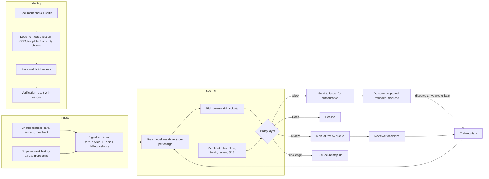
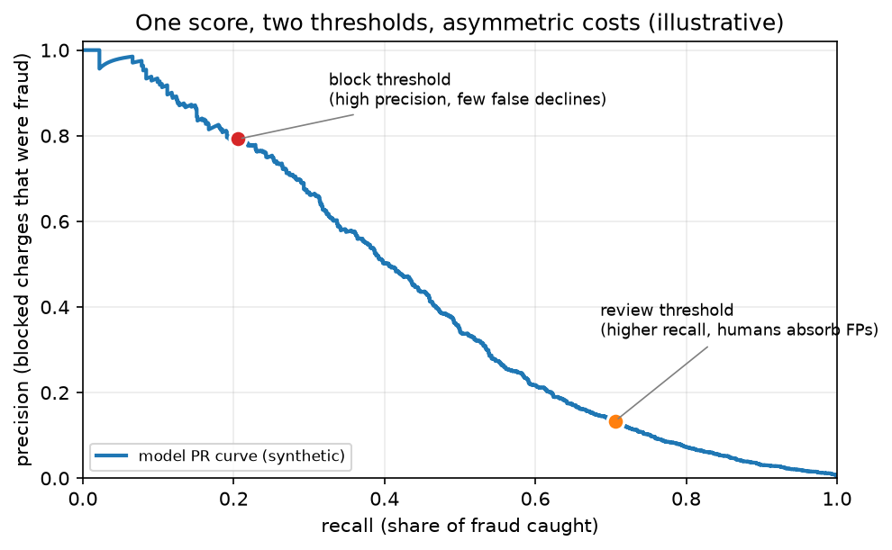

# Stripe & fintech fraud (Radar, identity verification, credit risk, and the constraints regulation puts on your model)

> **Why this matters at staff level.** Fraud and credit ML is the one area of applied machine learning where the loss function is money, the labels arrive late and partly wrong, the data-generating process fights back, and a regulator can demand that you explain any individual decision. Interviews at Stripe and its peers reward candidates who reason about operating points and expected cost rather than AUC, who know why a blocked legitimate payment is often more expensive than a missed fraudulent one, and who can name the constraints (adverse action notices, model risk governance) that decide which models you are allowed to ship.

!!! warning "Sources in this chapter"
    Claims are tied to public Stripe documentation and engineering writing, to published regulatory documents, and to public statements by the other companies named, cited by title and year in [Sources](#sources). URLs are omitted where they could not be verified in the build environment (STYLE.md §4); search the exact title. Public technical detail is uneven across these companies: Stripe has written a lot about Radar, the others much less, so anything not in a public source is marked **inference**.

## 1. The business in one paragraph

Stripe processes payments for millions of businesses, which means it sits on a stream of card transactions large enough to learn global fraud patterns that no single merchant could see, and it sells that advantage back as Radar, a fraud product that scores every charge in real time. The same position produces adjacent ML products: Identity for document and selfie verification, Sigma and reporting, optimisations that lift authorisation rates on legitimate payments, and support and onboarding tooling built on large language models. The wider fintech field splits into two ML problems that look similar and are governed very differently. Fraud detection asks whether the person transacting is who they claim to be and whether the transaction is legitimate, and it is largely unregulated in how you model it. Credit underwriting asks whether someone will repay, and in the United States it falls under the Equal Credit Opportunity Act and the Fair Credit Reporting Act, which require that a declined applicant receive specific principal reasons for the decision. That single requirement shapes model choice at PayPal, Affirm, Block and every lender more than any accuracy consideration.

## 2. The ML problems that define the company

| Problem | Why it is hard | Public evidence |
|---|---|---|
| Card fraud scoring | Class imbalance of roughly one in a thousand, adversaries adapt within days, labels (disputes) arrive weeks later, and the score has to return inside the payment request | Stripe Radar documentation (risk scores, rules, risk insights); Stripe's engineering writing on how Radar is built |
| Choosing the operating point | Blocking a good customer costs a sale and goodwill; missing fraud costs the disputed amount plus fees; the right threshold differs per merchant | Stripe Radar documentation on risk thresholds, allow and block rules, and the review queue |
| Fraud rings and linked accounts | Individual transactions look clean; the pattern is only visible across accounts, devices, cards and emails | Stripe engineering writing on similarity and clustering for linked fraudulent accounts; industry graph-based fraud work |
| Cold start for a new merchant | A business processing its first payment has no history of its own | Stripe Radar documentation on network-wide signals from the Stripe network |
| Identity and document verification | Phone photos of documents in poor conditions, template variety across countries, presentation attacks, and a false rejection blocks a legitimate user | Stripe Identity documentation (document checks, selfie matching, supported document types) |
| Authorisation rate optimisation | A payment can be declined by the issuer for recoverable reasons; retrying well is a prediction problem | Stripe documentation on adaptive acceptance and network tokens |
| Foundation models on payments data | Transaction sequences are a different modality from text; the question is whether pretraining transfers | Stripe's 2025 announcement of a payments foundation model trained on transaction data |
| Credit underwriting | Must predict default, avoid disparate impact, and produce reasons for every decline | Equal Credit Opportunity Act / Regulation B; CFPB Circular 2022-03 on adverse action and complex algorithms; SR 11-7 model risk management guidance |

## 3. The stack as publicly described

*What is public:* Radar scores every charge in real time and returns a risk score plus human-readable risk insights; merchants layer rules on top of the score to allow, block, send to manual review, or request 3D Secure; Radar draws on signals from across the Stripe network so a new merchant benefits from patterns learned elsewhere; disputes and reviewer decisions feed back as labels; Stripe Identity performs document checks and selfie matching. *Inference:* the model family, feature set, retraining cadence and the internals of the review-queue prioritisation are not published in the detail shown above, and the diagram's decomposition into signal extraction, scoring and a policy layer is the standard architecture, and is not a documented Stripe design.

{ width="640" }

*Figure: one score, two thresholds. A block threshold is chosen high on the precision axis because a false decline hits a legitimate customer, while a lower review threshold buys recall that human reviewers absorb. The curve is a synthetic simulation at a 0.5% fraud rate, not Stripe data; what it illustrates is the framing Stripe's Radar documentation uses, where the merchant chooses where to sit on the trade-off instead of receiving a single fixed decision.*

## 4. Deep dives

### 4.1 Radar: scoring every charge, and why the threshold is the product

**The problem.** A fraud model has to answer inside the payment request, so latency is bounded by what a checkout page can tolerate. Roughly one charge in a thousand is fraudulent, which means a model that predicts "legitimate" always is 99.9% accurate and worthless. The labels are disputes, which surface weeks after the transaction and undercount fraud, because plenty of fraudulent charges are never disputed. And the population shifts continuously as attackers probe for whatever the current model misses.

**The approach.** Stripe's public account of Radar describes a model that scores each charge in real time on signals available at that moment (the card, the device and browser, the IP and its history, the email, the billing details, the amount, and velocity features such as how many cards this device has tried recently), combined with network-level history: the same card, device or email seen across the many businesses Stripe processes for. The output is a risk score plus risk insights explaining which signals drove it. What Stripe exposes to the merchant is not a decision but the score plus a policy layer: merchants choose a block threshold, write allow and block rules, send a band of charges to a manual review queue, and request 3D Secure authentication on a band where the extra friction is worth it. Reviewer decisions come back as labels alongside the eventual disputes.

**The math that matters in the interview.** The decision is not the model, it is the threshold, and the threshold follows from expected cost. For a charge of amount $a$, let $p$ be the modelled probability of fraud, $c_{\text{fn}}(a)$ the cost of allowing a fraudulent charge (the amount, plus the dispute fee, plus the operational cost, and eventually the dispute-rate consequences if the merchant crosses card-network thresholds), and $c_{\text{fp}}(a)$ the cost of blocking a legitimate one (the lost margin on this sale, plus the probability-weighted cost of losing the customer). Block when

$$
p \cdot c_{\text{fn}}(a) > (1-p) \cdot c_{\text{fp}}(a),
$$

which rearranges to the threshold

$$
\boxed{\;p^{*} = \frac{c_{\text{fp}}(a)}{c_{\text{fp}}(a) + c_{\text{fn}}(a)}\;}
$$

Both costs scale with the amount, but not identically, which is why the optimal threshold is not a constant across a merchant's traffic, and why a subscription business and a high-ticket electronics retailer belong at different points on the curve. See [fraud & anomaly detection](../part17-ml-system-design/04-fraud-anomaly-detection.md) for the full treatment and [evaluation](../part13-retrieval-eval-reliability/02-evaluation.md) for precision-recall reasoning under heavy imbalance.

**The trade-off Stripe chose.** Radar gives the merchant the score and the controls instead of a single opaque verdict. That costs Stripe simplicity, since merchants can and do configure themselves into bad operating points, and it requires the risk insights to be good enough that a non-specialist can act on them. The alternative, one globally optimal decision per charge, is impossible, because the cost of a false decline is a property of the merchant's business and not of the transaction.

!!! tip "How to say it in the interview"
    "I'd start by refusing to treat this as an accuracy problem. At roughly one in a thousand fraud, accuracy is meaningless, and what I actually have to choose is an operating point. I'd frame it as expected cost: block when the probability of fraud times the cost of allowing it exceeds the probability it's good times the cost of declining a real customer, which gives a threshold that depends on the merchant's economics, not just on the model. That's why Stripe's Radar exposes a score plus rules and a manual review band rather than one fixed verdict, and I'd copy that structure: one model, several thresholds. Concretely I'd run a high-precision block threshold, a middle band that gets challenged with 3D Secure or sent to human review, and everything else allowed. I'd reject a single hard cutoff, because it forces every merchant onto the same trade-off and a subscription business and a high-ticket retailer are not in the same place. The cost of my design is operational complexity and reviewer headcount, so I'd size the review band by what the queue can actually handle. For evaluation I'd track precision and recall at each threshold, dispute rate, and the false-decline rate estimated from step-up outcomes, since the customers I wrongly blocked never show up in my labels otherwise."

### 4.2 The label problem: disputes are late, incomplete and biased by your own decisions

**The problem.** Three things are wrong with fraud labels at once. They are late, since a dispute can arrive weeks or months after the charge, so the most recent data (the data describing the current attack) has the least reliable labels. They are incomplete, because not every fraudulent charge is disputed. And they are censored by your own policy: a charge you blocked has no outcome, so the model never learns whether it was right, and the training distribution drifts toward the traffic the current model already allows.

**How to handle it.** Delayed labels mean the training set has a maturation window, and a model trained on last week's data is training on a mixture of confirmed-good and not-yet-disputed charges. The usual treatments are to wait for maturity for the primary model and accept staleness, to model the delay explicitly so a recent unlabelled charge contributes with the probability that a dispute is still coming, and to use reviewer decisions and step-up outcomes as faster proxy labels. Censoring is the harder issue: the standard answer is to allow a small randomised fraction of charges that the policy would have blocked, so you retain an unbiased estimate of what you are rejecting, and to use step-up authentication in place of a hard block where possible, since a challenged transaction that succeeds tells you the customer was real. See [evaluation](../part13-retrieval-eval-reliability/02-evaluation.md) and [uncertainty & reliability](../part13-retrieval-eval-reliability/03-uncertainty-reliability.md).

**The trade-off.** Every mechanism that recovers unbiased labels costs money in admitted fraud. That is the trade being made, and a staff candidate should name the price instead of pretending the problem away.

!!! tip "How to say it in the interview"
    "The thing I'd want to establish early is that my labels are censored by my own policy. Every charge I block has no outcome, so my training data drifts toward the traffic I already allow and my recall estimate is fiction. Disputes also arrive weeks late and undercount fraud, since plenty of fraudulent charges are never disputed. So my plan has three parts. I'd define a label maturation window and be explicit that the freshest data is only partly labelled, and I'd use reviewer decisions and 3D Secure outcomes as faster proxy labels in the meantime. I'd prefer a step-up challenge over a hard block wherever it's available, because a challenge that the customer passes is an informative label, where a block is silence. And I'd allow a small randomised fraction of would-be-blocked charges through to keep an unbiased estimate of what I'm rejecting. I'd reject running with no such holdout, even though it costs real money, because without it I can't tell a model that's improving from one that's just narrowing. The trade-off is exactly that admitted-fraud cost, which I'd size as a budget and monitor. Evaluation would be precision and recall on the randomised slice, not on policy-filtered traffic."

### 4.3 Fraud rings: when the signal is between the accounts

**The problem.** Card testing and organised fraud do not look anomalous one transaction at a time. An attacker with a list of stolen cards makes many small charges that individually resemble a normal customer buying something cheap. The signature is the relationship: the same device fingerprint across dozens of accounts, the same email pattern, the same shipping address behind different names, bursts of activity in a short window.

**The approach.** Stripe has written about finding linked fraudulent accounts by similarity and clustering instead of by per-transaction scoring: build a representation of an account or transaction from its attributes, then find groups whose members are far more similar to each other than to the general population, and treat the cluster as the unit of investigation. The generalisation is a graph over shared entities, where nodes are accounts, cards, devices, emails and addresses, and edges are shared usage; fraud rings show up as unusually dense subgraphs. Features derived from that graph (component size, number of distinct cards sharing a device, time-compression of activity) go back into the per-transaction model, so the transaction score gets to see the ring.

**Math link.** Velocity and burst features are the cheap approximation; connected components and community detection are the expensive one. See [KNN & K-means](../part02-classical/04-knn-kmeans.md) for the clustering, and [fraud & anomaly detection](../part17-ml-system-design/04-fraud-anomaly-detection.md) for how graph features enter a real-time model.

**The trade-off.** Graph features are computed over a window and are expensive to keep fresh at payment latency, so in practice they are precomputed and looked up instead of computed in the request. That introduces staleness precisely where the attack is fastest, and card testing can run its course in minutes. The usual resolution is a two-speed design: cheap velocity counters updated in real time, and richer graph features refreshed on a slower cycle.

!!! tip "How to say it in the interview"
    "Card testing is invisible to a per-transaction model, because each charge on its own looks like someone buying a coffee. The signal lives between transactions: one device fingerprint across forty cards in ten minutes. So I'd add two layers. In the request path, cheap velocity counters keyed on device, IP, card BIN and email, updated in real time, since those catch the burst while it's happening. Behind it, a graph over shared entities where I look for dense subgraphs and cluster accounts by similarity, which is the approach Stripe has described publicly for finding linked fraudulent accounts. Cluster-level features then feed back into the transaction model. I'd reject relying only on the graph, because refreshing it at payment latency isn't realistic and card testing can be over in minutes. The trade-off is staleness in the richer features, which is why the real-time counters carry the burst detection. For evaluation I'd measure time-to-detection on known card-testing incidents, and not aggregate AUC, because the aggregate number barely moves when you catch a ring, and catching the ring is the whole point."

### 4.4 Identity verification: an OCR problem where a false rejection is the expensive error

**The problem.** Verifying that a user is who they claim to be, from a phone photo of a government document plus a selfie, in a few seconds, across hundreds of document types and dozens of countries. The failure modes are asymmetric in an unusual way. A false accept lets a fraudster onboard. A false reject blocks a legitimate person from getting paid or from using the service, and unlike a declined card there is often no easy second path, so it converts directly into abandoned onboarding and support load.

**What is public.** Stripe Identity documents a verification flow with document checks, selfie matching against the document portrait, and supported document types by country, returning a verification result the business can act on. The model architecture is not published, so the pipeline below is **inference** from standard practice and from what the product's behaviour implies.

**Inferred pipeline.** Capture-time quality gating on the device (glare, blur, crop, is a document even in frame) so the user is asked to retake before a bad image is ever scored; document classification by country and type; rectification of the document from the photo's perspective; OCR and field extraction (name, date of birth, document number, expiry) with per-field confidence; consistency checks (does the machine-readable zone match the printed fields, is the checksum valid, has it expired); template and security-feature checks against a reference for that document type; portrait extraction and face matching against a liveness-checked selfie; and a routing decision that sends uncertain cases to human review rather than rejecting them.

**Math link.** [OCR & document understanding](../part17-ml-system-design/09-ocr-document-understanding.md) for the extraction stack, [detection](../part04-vision/04-detection.md) for document and field localisation, and [uncertainty & reliability](../part13-retrieval-eval-reliability/03-uncertainty-reliability.md) for the calibrated confidence that makes routing work.

**The trade-off.** Every check you add raises the false-reject rate on legitimate users with worn documents, unusual names, or bad lighting. The way out is not a better single threshold but a design where uncertainty routes to a retake prompt or a human, and where the machine-readable zone provides a redundant read of the same fields, so a marginal OCR result can be repaired instead of rejected.

!!! tip "How to say it in the interview"
    "I'd design this around the asymmetry, which runs the opposite way from what people expect. A false accept lets one fraudster in. A false reject stops a legitimate user from onboarding, and they usually just leave, so it shows up as lost customers and support tickets rather than as a number in my evaluation set. Stripe Identity publicly does document checks plus selfie matching, and I'll flag that the internals are my inference. My pipeline would gate image quality on the device first, so the user is asked to retake before anything is scored, which removes a large share of failures for free. Then classify the document type, rectify it, run OCR with per-field confidence, and cross-check the printed fields against the machine-readable zone, because that redundancy lets me repair a marginal read instead of rejecting the person. Then face match against a liveness-checked selfie, with liveness as its own model trained on presentation attacks, not as a threshold on the matcher. Anything uncertain goes to a retake prompt or a human reviewer, never straight to a decline. I'd reject a fully automated accept-or-reject decision on day one. The cost is review capacity, which I'd manage with the routing thresholds. Evaluation: false-accept and false-reject rates broken out per country and document type, because a model that looks fine in aggregate can be failing one country badly, plus time-to-verify and the retake rate."

### 4.5 Credit risk, where the regulator is part of the architecture

**The problem.** Underwriting a loan, a card or a buy-now-pay-later plan means predicting default. The modelling is not the hard part. The hard part is that in the United States a lender who declines an applicant must send an adverse action notice giving the specific principal reasons for the decision, under the Equal Credit Opportunity Act and Regulation B, and the Consumer Financial Protection Bureau stated in Circular 2022-03 that using a complex algorithm does not excuse a creditor from that obligation. Banks and their partners also operate under model risk management expectations (the Federal Reserve and OCC guidance known as SR 11-7) that require documentation, independent validation and ongoing monitoring of any model used in a material decision. Fair lending law adds disparate impact exposure, so a model that is accurate but produces worse outcomes for a protected class is a legal problem regardless of intent.

**What this does to model choice.** Reason codes have to be real, per applicant, and stable. That pushes lenders toward models where per-feature attribution is defensible: scorecards and constrained gradient-boosted models with monotonic constraints on features where the direction is known (more missed payments should never improve your score), with Shapley-style attributions mapped to a fixed reason-code vocabulary. Deep sequence models over transaction history are attractive for accuracy and much harder to defend, which is why they appear first in fraud, where these rules do not apply, and only later in credit. Affirm, Block and PayPal all publicly describe machine-learned underwriting or risk scoring, and all operate under the same constraints; the internals are not public, so treat any architecture claim as **inference**.

**Math link.** Monotonic constraints in [trees & ensembles](../part02-classical/03-trees-and-ensembles.md); attribution methods in [interpretability](../part15-interpretability-safety/01-interpretability.md); calibration in [uncertainty & reliability](../part13-retrieval-eval-reliability/03-uncertainty-reliability.md).

**The trade-off.** You are trading accuracy for defensibility, deliberately. A candidate who proposes an unconstrained deep model for underwriting without mentioning adverse action notices has failed the question, and a candidate who refuses all complexity has failed it differently, because constrained boosted models with proper attribution are both accurate and shippable.

!!! tip "How to say it in the interview"
    "For underwriting I'd start from the constraint rather than the model. Under the Equal Credit Opportunity Act and Regulation B, a declined applicant has to receive the specific principal reasons for the decision, and the CFPB's 2022 circular says plainly that using a complex algorithm doesn't relieve you of that duty. So whatever I build has to produce per-applicant reason codes I can defend. That points me at a gradient-boosted model with monotonic constraints on the features where the direction is known, because a model that can improve your score when your delinquencies go up is indefensible even if it fits better, and attributions mapped to a fixed reason-code vocabulary. I'd reject an unconstrained deep sequence model over transaction history for the decision itself, even though I'd expect it to be more accurate, and I'd consider using it for fraud instead, where these requirements don't apply. I'd also run fair lending testing for disparate impact across protected classes before launch and on a schedule after, and document the model for independent validation, which is what SR 11-7 model risk guidance expects. The trade-off is measurable accuracy given up for defensibility, and I'd quantify it so the business knows the price. Evaluation: default rate by score band, calibration, stability of reason codes over time, and disparate impact testing."

### 4.6 Foundation models on payments data

**What is public.** Stripe announced in 2025 that it had trained a foundation model on payments data, describing self-supervised pretraining on a very large number of transactions to produce general-purpose transaction embeddings, and reported improvement on detecting card-testing attacks as an early application. The framing is the one that has worked in language and vision: pretrain a general representation on a large unlabelled corpus, then use it for many downstream tasks rather than building features separately for each.

**Why it is plausible and what to probe.** Transactions have sequence structure per card, per merchant and per device, and most of that structure is unlabelled, so self-supervision has something to learn from. The interview-relevant questions are what the pretraining objective should be (next-transaction prediction, masked-attribute reconstruction, contrastive pairing of transactions from the same entity), how to handle the fact that transaction fields are mostly high-cardinality categoricals rather than tokens, and whether the embedding can be served inside the payment latency budget or has to be precomputed per entity and cached. See [self-supervised learning](../part10-self-supervised/01-self-supervised-learning.md), [tokenization](../part05-sequence-transformers/06-tokenization.md) for the categorical-encoding question, and [inference systems](../part14-systems/03-inference-systems.md) for the serving split.

!!! tip "How to say it in the interview"
    "Stripe announced a payments foundation model in 2025, pretrained self-supervised on a very large transaction corpus, and reported better detection of card-testing attacks from it. The reason that's a sensible bet is that transaction streams have a lot of structure per card, per device and per merchant, and almost none of it is labelled, so self-supervision has more to work with than the dispute labels ever give you. If I were building it I'd pretrain with masked-attribute reconstruction plus a contrastive objective that pulls together transactions from the same entity, and I'd treat the high-cardinality categorical fields carefully, because this isn't text and a naive tokenizer wastes the structure. On serving, I'd precompute and cache entity-level embeddings and keep only a small head in the request path, since a large encoder inside the payment call isn't going to fit the latency budget. That serving split is my inference, not something Stripe published. I'd reject replacing the existing supervised model straight away, and instead feed the embeddings in as features so I can measure the marginal lift. Evaluation: lift over the incumbent on held-out fraud, and specifically time-to-detection on card-testing incidents, which is what Stripe reported improving."

## 5. Likely interview questions

!!! interview "1. Design a real-time card fraud detection system."
    **Sketch.** Signals available at request time (card, device, IP, email, billing, velocity, network history), a model returning a calibrated probability inside the latency budget, a policy layer with block, review and step-up bands whose thresholds come from expected cost, delayed dispute labels plus reviewer labels, a randomised holdout to keep labels unbiased, monitoring by segment. Cross-link: [fraud & anomaly detection](../part17-ml-system-design/04-fraud-anomaly-detection.md).

    !!! tip "How to say it in the interview"
        "I'd separate the model from the decision. The model returns a calibrated probability of fraud inside the payment latency budget, using signals available at that instant plus precomputed entity features. The decision is a policy layer with three bands: block above a high-precision threshold, challenge or review in a middle band, allow below. The thresholds come from expected cost, which depends on the merchant's economics, and that's why Stripe exposes a score plus rules and a review queue instead of one verdict. I'd reject baking the decision into the model output, because then every threshold change is a retrain. On labels I'd be explicit that disputes are late and censored, so I'd keep a small randomised allow-through slice to measure what I'm blocking. Evaluation: precision and recall at each band on the randomised slice, dispute rate, and false-decline rate, all segmented by merchant type."

!!! interview "2. Your model has 0.99 AUC. Is it good?"
    **Sketch.** AUC is nearly uninformative at a 0.1% base rate; ask for precision and recall at the actual operating point, the PR curve, the cost-weighted metric, and performance on the recent slice rather than the full history.

    !!! tip "How to say it in the interview"
        "I can't tell from that number. At roughly one in a thousand fraud, AUC is dominated by how easily the model separates obvious good traffic, and it barely moves when I fix the hard cases that cost money. I'd ask for precision and recall at the threshold we actually run at, the full precision-recall curve, and the cost-weighted loss using real dispute and false-decline costs. I'd also want it sliced by recency, because a model can look excellent on a year of data and be blind to the attack that started last week. And I'd want to know whether the evaluation set is policy-filtered traffic, because if it is, the recall number is measuring only the fraud we were already letting through."

!!! interview "3. Pick the block threshold for a merchant selling $2,000 laptops, then for one selling a $9 monthly subscription."
    **Sketch.** Apply $p^* = c_{fp} / (c_{fp} + c_{fn})$; high-ticket physical goods have large fraud losses and recoverable false declines, so block more aggressively; low-ticket subscriptions have small per-charge losses but a false decline can churn a long-lived customer, so block conservatively and lean on step-up.

    !!! tip "How to say it in the interview"
        "The threshold is the ratio of false-positive cost to total cost, so I'd compute it per merchant instead of setting one globally. For the laptop seller, a fraudulent charge means losing a two-thousand-dollar item plus the dispute fee, while a false decline costs the margin on one sale and a customer who will probably try again, so the threshold sits low and I block aggressively. For the subscription, a fraudulent charge costs nine dollars, but a false decline can kill a customer worth years of revenue, so the threshold sits high and I'd send the marginal band to 3D Secure rather than blocking. I'd reject a single platform-wide cutoff, because those two businesses are genuinely at different points on the same curve. I'd validate by comparing realised dispute cost against estimated false-decline cost per merchant after the change."

!!! interview "4. Implement the expected-cost decision rule and explain the shape of the loss (coding-ish)."
    **Sketch.** `block = p * c_fn(amount) > (1 - p) * c_fp(amount)`; note both costs depend on amount; note that calibration of `p` is what makes the rule valid, so the model needs a calibration layer.

    !!! tip "How to say it in the interview"
        "The rule is three lines: block when the probability times the cost of allowing fraud exceeds one minus the probability times the cost of a wrongful decline, with both costs as functions of the amount. The part that's easy to miss is that the rule is only valid if the probability is calibrated. A ranking model with great ordering and terrible calibration gives me correct relative risk and a meaningless threshold, so I'd fit an isotonic or Platt calibration layer on recent data and monitor calibration drift as a first-class metric. I'd test it by checking that with symmetric costs the rule reduces to a threshold at one half."

!!! interview "5. Someone is running card testing against a merchant right now. How do you detect and stop it?"
    **Sketch.** Real-time velocity counters keyed on device, IP, BIN and email; burst detection; automatic rate limiting and step-up; cluster the attack for a post-hoc block; measure time-to-detection.

    !!! tip "How to say it in the interview"
        "Card testing is a burst phenomenon, so I'd catch it with real-time counters rather than with the per-charge model, which sees each attempt as an ordinary small purchase. Keys on device fingerprint, IP, card BIN and email, with short windows, and a rule that trips on an unusual number of distinct cards from one entity. The immediate response is rate limiting and a step-up challenge, not a silent block, because that stops the attack while staying recoverable for a real customer caught by accident. Then I'd cluster the attack offline to find the rest of the ring, which is the similarity-and-clustering approach Stripe has written about for linked fraudulent accounts, and feed those cluster features back into the model. Evaluation is time-to-detection on known incidents and the number of attempts that got through before the rate limit engaged."

!!! interview "6. A new merchant processes its first payment. What does your model know?"
    **Sketch.** Network-level signals: has this card, device, email or IP been seen across other businesses on the platform, and how did those charges turn out. Merchant-specific calibration comes later; start from the network prior and merchant-category priors.

    !!! tip "How to say it in the interview"
        "This is where a platform has a structural advantage over a single merchant, and Stripe's Radar documentation makes the point explicitly: the card, device and email have usually been seen elsewhere on the network even if this business has never seen them. So the cold-start model runs on network features plus merchant-category priors, and merchant-specific behaviour gets blended in as volume accumulates. I'd reject waiting for the merchant's own history, because a new business is exactly when fraudsters test. The trade-off is that a merchant whose legitimate traffic is unusual for its category will see more false positives early, so I'd widen the review band instead of the block band for new accounts."

!!! interview "7. Design document verification for onboarding in 40 countries."
    **Sketch.** Device-side quality gating, document type classification, rectification, OCR with per-field confidence, MRZ cross-check and checksums, template and security features, face match with liveness, human review routing; metrics per country and document type. Cross-link: [OCR design](../part17-ml-system-design/09-ocr-document-understanding.md).

    !!! tip "How to say it in the interview"
        "The single highest-leverage component is the capture experience: gate quality on the device and ask for a retake, because most failures come from glare, blur and cropping, and the recogniser is rarely the thing that failed. After that, classify the document type, rectify it, OCR the fields with per-field confidence, and cross-check against the machine-readable zone where one exists, since that redundancy repairs marginal reads instead of rejecting people. Face match against a liveness-checked selfie, with liveness as a separate model trained on presentation attacks. Route uncertainty to human review. I'd reject a single global threshold, because document quality and template variety differ enormously by country, and a model that's fine in aggregate can be failing one market completely. Evaluation: false-accept and false-reject rates per country and document type, retake rate, and time-to-verify."

!!! interview "8. How do you evaluate a fraud model when the labels come from the model's own decisions?"
    **Sketch.** Randomised allow-through holdout for unbiased recall; step-up outcomes as labels; reject-inference techniques; measure on the holdout, not on filtered traffic.

    !!! tip "How to say it in the interview"
        "On policy-filtered traffic my recall estimate is measuring only the fraud that the current policy already lets through, which flatters every new model. The clean fix is a small randomised slice where I allow charges the policy would have blocked, and measure there. It costs real money, so I'd size it as an explicit budget and keep it as small as the confidence interval allows. Where a step-up challenge is available I'd prefer it to a block, because passing a challenge is a label and a block is silence. I'd also use reject-inference methods as a secondary estimate, while being clear they rest on assumptions the randomised slice does not. I'd reject evaluating only on filtered traffic even though it's free."

!!! interview "9. Build an underwriting model for a buy-now-pay-later product."
    **Sketch.** Predict default; constrained GBM with monotonic constraints; reason codes for adverse action under ECOA/Reg B; fair lending testing; model documentation and validation per SR 11-7; calibration by score band. Cross-link: [interpretability](../part15-interpretability-safety/01-interpretability.md).

    !!! tip "How to say it in the interview"
        "Before architecture I'd name the requirement: a declined applicant must get specific principal reasons, under ECOA and Regulation B, and the CFPB's 2022 circular says using a complex model doesn't excuse that. So I'd build a gradient-boosted model with monotonic constraints where the direction is known, and map attributions to a fixed reason-code vocabulary that I can validate for stability. I'd reject an unconstrained deep model for the credit decision, and I'd be explicit that I expect to give up some accuracy for that. I'd run disparate impact testing across protected classes before launch and on a cadence after, and document the model for independent validation as SR 11-7 expects. Evaluation: default rate by score band, calibration, reason-code stability, and fair lending metrics alongside the accuracy metrics."

!!! interview "10. Your fraud rate suddenly doubles overnight. Walk through the response."
    **Sketch.** Confirm it is real (label pipeline, reporting lag); segment to localise (merchant, geography, BIN, device type); decide whether it is a new attack or model degradation; apply a fast rule as a stopgap; retrain or re-weight; post-incident, fold the pattern into features.

    !!! tip "How to say it in the interview"
        "First I'd confirm the signal is real, because a doubling overnight is often a reporting artefact, a label pipeline change, or disputes from a prior period landing at once. If it's real, I'd segment aggressively to localise it: one merchant, one country, one card BIN range, one device type. That usually identifies the attack. The immediate action is a targeted rule, because a rule ships in minutes and a retrain takes days, and I'd accept the precision cost of a blunt rule for a short window. Then I'd get labelled examples from the review queue, retrain with them up-weighted, and once the model covers it, retire the rule so the rule set doesn't accumulate forever. I'd reject leaving the stopgap rule in place permanently, which is how these systems become unmaintainable. Evaluation during the incident is time-to-mitigation and the false-positive cost of the temporary rule."

!!! interview "11. Should you use a graph neural network for fraud?"
    **Sketch.** Often the graph features matter more than the GNN; start with hand-built graph aggregates (component size, entity fan-out); consider a GNN when relational structure is deep and you can serve precomputed embeddings; latency and freshness are the binding constraints.

    !!! tip "How to say it in the interview"
        "Usually the win is the graph, not the neural network on top of it. I'd start with hand-built relational features (how many distinct cards share this device, the size of the connected component this email sits in, how compressed in time the activity is) because those are cheap, interpretable and get most of the lift. I'd consider a GNN when the useful signal is several hops out and the aggregates stop capturing it. The binding constraints are latency and freshness: I can't run message passing inside the payment request, so embeddings get precomputed per entity and refreshed on a cycle, which means they're stale exactly when an attack is fastest. That's why I'd keep real-time counters regardless. Evaluation: marginal lift over the hand-built graph features, measured at the operating point, not on AUC."

!!! interview "12. What ML would you build for authorisation rates rather than fraud?"
    **Sketch.** Predict whether a declined payment will succeed on retry, and when; choose retry timing and network tokens; distinguish soft declines from hard ones; measure incremental authorisation without increasing fraud or issuer friction.

    !!! tip "How to say it in the interview"
        "Fraud gets the attention, but a legitimate payment declined by the issuer is the same lost revenue, and Stripe publicly offers adaptive acceptance and network tokens for exactly that. I'd model the probability that a declined charge succeeds on retry, conditioned on the decline code, the issuer, the amount and the timing, then choose whether and when to retry. Soft declines like insufficient funds are worth retrying on a schedule, hard declines are not, and retrying indiscriminately annoys issuers and can hurt the merchant's standing. I'd reject a fixed retry schedule for everyone. Evaluation: incremental authorised volume, with issuer decline rate and fraud rate as guardrails, since a retry policy that lifts authorisations by admitting more fraud hasn't helped."

!!! interview "13. Where would you use an LLM in a payments company, and where would you refuse?"
    **Sketch.** Use for support automation with retrieval and escalation, for summarising evidence in dispute responses, for reviewer assistance and rule drafting; refuse for the automated risk decision itself, on latency, calibration, explainability and adversarial-input grounds. Cross-link: [LLM assistant with RAG](../part17-ml-system-design/08-llm-product-rag-assistant.md).

    !!! tip "How to say it in the interview"
        "I'd use one where the output is read by a person and the cost of being wrong is bounded: support answers grounded in retrieved documentation with escalation, summarising the evidence a merchant needs for a dispute response, and helping a reviewer by surfacing why a transaction looks odd. I'd refuse to put one in the automated block decision. It's too slow for the payment path, its scores aren't calibrated in the way a threshold requires, I can't give a regulator or a merchant a clean account of why it declined a charge, and the inputs are attacker-controlled text, so prompt injection is a live risk here, not a theoretical one. For the reviewer-assistance case the evaluation is review throughput and reviewer agreement, and for support it's resolution rate with a human-audited accuracy sample."

## 6. What to bring from your background

* **Document OCR is the most direct bridge here.** Stripe Identity, and every competitor doing know-your-customer onboarding, runs the pipeline you have built: document detection and rectification from a phone photo, multi-template and multi-country classification, field extraction with per-field confidence, machine-readable zone parsing and checksum validation, and portrait extraction for face matching. Bring specifics: how you handled glare and motion blur, how you cut the false-reject rate with capture-time quality gating, how you calibrated confidence so that routing to human review was defensible, and how you measured accuracy per document type instead of in aggregate. The metric they care about is the share of users verified automatically at a fixed false-accept rate.
* **Detection under adversarial pressure.** If you have worked on any system where the inputs adapted to your model, say so early. Fraud teams recognise the difference between a candidate who has fought an adversary and one who has only tuned a classifier on a static dataset.
* **Calibration and operating points.** Fraud is the domain where calibrated probabilities matter more than ranking quality. If you have shipped a detector where a threshold had to be defended to someone outside the team, that story lands.
* **Imbalanced, delayed and censored labels.** Perception work has its own version of this (a detector's misses are invisible unless you go and look for them), and the reasoning transfers directly to the dispute-label problem. Talk about how you built evaluation sets that were not filtered by the system you were evaluating.
* **Systems fluency.** The score must return inside a payment request, so the serving split between precomputed entity features and request-time computation is a real design conversation, and it is one your ML-systems background equips you for.

## Sources

**Stripe**

* Stripe, Radar documentation: the [Radar overview](https://docs.stripe.com/radar), [risk evaluations](https://docs.stripe.com/radar/risk-evaluation) (score 0–99, elevated at 65, high at 75), [risk insights](https://docs.stripe.com/radar/reviews/risk-insights), [fraud prevention rules](https://docs.stripe.com/radar/rules) and the [review queue](https://docs.stripe.com/radar/reviews).
* Drapeau, "How we built it: Stripe Radar", Stripe engineering blog, 2023. [stripe.com](https://stripe.com/blog/how-we-built-it-stripe-radar) · [stripe.dev](https://stripe.dev/blog/how-we-built-it-stripe-radar) · Stripe, "A primer on machine learning for fraud detection" ([stripe.com](https://stripe.com/radar/guide))
* Tausz, "Similarity clustering to catch fraud rings", Stripe engineering blog. [stripe.com](https://stripe.com/blog/similarity-clustering)
* Stripe, Identity documentation: [Identity overview](https://docs.stripe.com/identity), [verification checks](https://docs.stripe.com/identity/verification-checks) (document, selfie, ID number, address, phone) and [verifying identity documents](https://docs.stripe.com/identity/verify-identity-documents).
* Stripe, authorisation-rate optimisation: [Authorization Boost](https://stripe.com/authorization-boost) (Adaptive Acceptance, network tokens, card account updater), [optimization documentation](https://docs.stripe.com/payments/analytics/optimization) and the guide on [reducing network declines](https://stripe.com/guides/optimizing-authorization-rates).
* Stripe, Sessions 2025 announcement of a transformer-based payments foundation model trained self-supervised on tens of billions of transactions, with card-testing detection as the headline application. [stripe.com newsroom](https://stripe.com/newsroom/news/sessions-2025)

**Regulation and model governance (United States)**

* Equal Credit Opportunity Act, Regulation B, [12 CFR 1002.9 (Notifications)](https://www.ecfr.gov/current/title-12/chapter-X/part-1002/subpart-A/section-1002.9), the adverse action notice and statement of specific reasons.
* Consumer Financial Protection Bureau, Circular 2022-03, "Adverse action notification requirements in connection with credit decisions based on complex algorithms", 2022. [consumerfinance.gov](https://www.consumerfinance.gov/compliance/circulars/circular-2022-03-adverse-action-notification-requirements-in-connection-with-credit-decisions-based-on-complex-algorithms/) · [Federal Register](https://www.federalregister.gov/documents/2022/06/14/2022-12729/consumer-financial-protection-circular-2022-03-adverse-action-notification-requirements-in)
* Board of Governors of the Federal Reserve System and Office of the Comptroller of the Currency, Supervisory Guidance on Model Risk Management (SR 11-7 / OCC 2011-12), 2011. [federalreserve.gov](https://www.federalreserve.gov/supervisionreg/srletters/sr1107.htm) · [PDF](https://www.federalreserve.gov/boarddocs/srletters/2011/sr1107.pdf). The Federal Reserve issued revised guidance, SR 26-2, in April 2026 ([federalreserve.gov PDF](https://www.federalreserve.gov/supervisionreg/srletters/SR2602.pdf)); the principles cited here (documentation, independent validation, ongoing monitoring) carry over.
* Fair Credit Reporting Act, adverse action provisions, [15 U.S.C. 1681m](https://uscode.house.gov/view.xhtml?req=granuleid%3AUSC-1999-title15-section1681m&num=0&edition=1999); full statute at [ftc.gov](https://www.ftc.gov/system/files/documents/statutes/fair-credit-reporting-act/545a_fair-credit-reporting-act-0918.pdf).

**Other fintech companies** (public descriptions; model internals are not published)

* PayPal Technology Blog, "Deploying Large-scale Fraud Detection Machine Learning Models at PayPal" ([medium.com/paypal-tech](https://medium.com/paypal-tech/machine-learning-model-ci-cd-and-shadow-platform-8c4f44998c78)) and "How PayPal Uses Real-time Graph Database and Graph Analysis to Fight Fraud" ([medium.com/paypal-tech](https://medium.com/paypal-tech/how-paypal-uses-real-time-graph-database-and-graph-analysis-to-fight-fraud-96a2b918619a)).
* Affirm, public descriptions of machine-learned underwriting for buy-now-pay-later credit decisions, operating under ECOA adverse action requirements.
* Block (Square and Cash App), public descriptions of risk and fraud modelling.
* Coinbase engineering blog, "Detecting Fraudulent Transactions: Coinbase Scalable Blockchain Address Risk Scoring System" ([coinbase.com](https://www.coinbase.com/blog/detecting-fraudulent-transactions-coinbase-scalable-blockchain-address-risk)) and "Reducing Fraud Loss With an Automated Dynamic Policy" ([coinbase.com](https://www.coinbase.com/blog/reducing-fraud-loss-with-an-automated-dynamic-policy)).

**Background reading on the problem shape**

* Dal Pozzolo et al., "Credit Card Fraud Detection: A Realistic Modeling and a Novel Learning Strategy", IEEE Transactions on Neural Networks and Learning Systems, 2018 (delayed labels and verification latency). [IEEE Xplore](https://ieeexplore.ieee.org/document/8038008/)
* Dal Pozzolo et al., "Calibrating Probability with Undersampling for Unbalanced Classification", IEEE Symposium Series on Computational Intelligence, 2015. [dblp](https://dblp.org/rec/conf/ssci/PozzoloCJB15.html)
