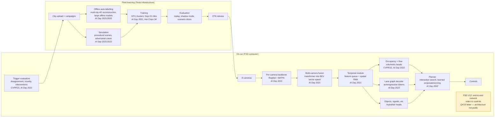

# Tesla (Autopilot / FSD / Optimus)

> **Why this matters at staff level.** Tesla is the best-documented vision-only autonomy
> programme in the world: two AI Days, two CVPR workshop keynotes, a Hot Chips talk and
> shareholder letters lay out the stack from cameras to chips. Interviewers there ask
> about *their* problems, eight cameras into one 3D model, a fleet-scale data engine,
> occupancy instead of boxes, end-to-end driving, training on video at exaflop scale, 
> and strong signal is knowing which of those choices were forced by the constraints
> (no lidar, no HD map, a fixed in-car compute budget, millions of cars) and what each
> choice gave up.

## TL;DR: the interview card

- **The bet**: cameras only, no HD maps, learned everything, fleet as the data source. Every design choice below follows from those constraints and from a fixed on-car compute budget (the FSD computer).
- **Perception lineage (public)**: per-camera CNN features → transformer fusion into a bird's-eye "vector space" (AI Day 2021) → volumetric **occupancy + flow** replacing per-object 3D boxes (CVPR'22 WAD, AI Day 2022) → **end-to-end** network from video to control in FSD V12 (Q4 2023 shareholder letter).
- **The data engine**: fleet triggers (the AI Day 2021 slides show a catalogue of 221 triggers) → clip upload → **offline auto-labelling** by multi-trip 4D reconstruction and large offline models → targeted retraining → shadow mode → OTA. Iteration speed of this loop is the moat, not any one model.
- Occupancy means predicting $o \in [0,1]$ and flow $f \in \R^3$ per voxel from cameras. it handles arbitrary shapes and overhangs that box detectors cannot represent, at the cost of memory scaling with the voxel grid.
- Lanes are decoded as language. AI Day 2022 emits the lane graph autoregressively as tokens, because lanes are a graph with topology, not a segmentation mask.
- **Dojo**: a custom training chip (D1) and tile, presented at AI Day 2021 and Hot Chips 34, motivated by video-heavy training; press reports in August 2025 say the team was wound down, the durable lesson is the trade-off analysis, not the product.
- **Optimus**: the humanoid reuses the FSD computer and vision stack (AI Day 2022); the ML story is imitation from teleoperation plus the same data-engine reflexes.
- The evaluation vocabulary you need: interventions per mile, shadow-mode disagreement, scenario-sliced regression, and the caveats of Tesla's own Vehicle Safety Report (exposure bias: Autopilot miles are mostly highway miles).

## 1. The business in one paragraph

Tesla sells electric vehicles and energy products; the AI organisation exists to make
those vehicles drive themselves (Autopilot, and the paid "Full Self-Driving
(Supervised)" software), to run a robotaxi service on the same hardware, and, since
AI Day 2022, to build a general-purpose humanoid robot (Optimus) on the same perception
and compute stack. The business constraint that shapes every ML decision is *scale
with cheap sensors*: millions of customer cars carry eight cameras and an in-house
inference computer, no lidar and no HD maps, so the driving policy must be learned
from fleet data and must run within a fixed on-car compute budget. Tesla's public AI
page ([tesla.com/AI](https://www.tesla.com/AI)) frames the programme exactly this way:
vision, planning, a data engine, training infrastructure, and the humanoid.

## The ML problems that define the company

| Problem | Why it is hard | Public evidence |
|---|---|---|
| **3D scene understanding from eight cameras, no lidar** | Depth must be inferred; per-camera detections cannot be stitched into a consistent 3D world; occlusions and overhanging structures break box representations. | AI Day 2021 multi-camera "vector space" fusion; CVPR'22 WAD occupancy keynote; AI Day 2022 occupancy + flow network. |
| **Mapping without HD maps** | Lane topology must be inferred live, including connectivity through intersections that no image pixel shows. | AI Day 2022 "language of lanes" autoregressive lane-graph decoder. |
| **Long-tail data at fleet scale** | The rare cases that matter are a vanishing fraction of miles; uploading everything is impossible; labelling by hand does not scale. | CVPR'21 WAD keynote (triggers, data engine); AI Day 2021 auto-labelling and simulation sections. |
| **Planning among interacting agents** | Human-like driving requires reasoning about how other agents react to you; hand-written cost functions do not generalise. | AI Day 2022 interaction-search planner with learned proposal/scoring; FSD V12 described as end-to-end in the Q4 2023 shareholder letter. |
| **Training on video at scale** | Video is bandwidth- and I/O-bound, not just FLOP-bound; the data loader and the interconnect become the bottleneck. | AI Day 2021 Dojo section; Hot Chips 34 Dojo microarchitecture and system talks; Dojo technology (CFloat8) whitepaper. |
| **Fixed on-car compute** | Every new head competes for the same inference budget; multi-task sharing and quantization are mandatory. | AI Day 2021 HydraNet (shared backbone, many heads); Autonomy Day 2019 FSD computer. |
| **Humanoid manipulation** | Perception transfers; control data does not exist and must be collected by teleoperation. | AI Day 2022 Optimus section (reused FSD computer and vision); Optimus Gen 2 video (Dec 2023). |

## 2. The stack as publicly described

**Known versus inferred.** The boxes with talk citations are described in public
talks or documents. The V12 box is shaded: Tesla's Q4 2023 shareholder update
describes V12 as end-to-end, but the architecture, the losses, and how much of the
2022 modular stack survives as auxiliary supervision are not public. Everything
about "campaigns", the prioritisation of uploads, and the exact evaluation gates is an
inference from the shape of the talks, not a stated fact.

## 3. Deep dives

### 3.1 Vision-only multi-camera BEV: eight images, one world

**The problem.** A detector run per camera gives you eight sets of 2D boxes in eight
image planes. Stitching them into one 3D world needs depth (which cameras do not
measure), consistent handling of objects that straddle camera boundaries, and
tolerance to per-car calibration differences. Tesla's public answer at AI Day 2021 was
to stop predicting in image space at all.

**The approach (as presented).** Each camera image goes through a shared RegNet
backbone with a BiFPN neck; a transformer then *queries* a bird's-eye-view raster:
each BEV cell carries a positional encoding, attends over the multi-scale features of
all cameras, and produces a feature in the "vector space" that downstream heads consume.
Calibration is handled by rectifying every car's cameras into a common virtual camera
before the network, so one set of weights serves the fleet. A temporal module (a queue
of past BEV features indexed both by time and by distance travelled, plus a spatial
RNN over the BEV grid) supplies memory for occluded and temporarily invisible objects.
The mathematics is the cross-attention view-transform derived in
[Multi-camera & BEV](../part11-perception-autonomy/02-multi-camera-bev.md): the query
$q_{ij} \in \R^{d}$ for cell $(i,j)$ attends over keys built from image features and
their camera geometry, so the network learns the projection instead of being given
explicit depth. The alternative family (Lift-Splat-Shoot, arXiv:2008.05711) makes depth
explicit as a per-pixel categorical distribution and "splats" features into BEV; the
attention route Tesla described avoids committing to a depth bin and lets the model
use context, at the cost of being harder to interpret.

**The trade-off they chose.** Learned fusion in a common BEV frame (one network, one
frame, calibration-invariant) over per-camera detection plus hand-written 3D
association. What it gives up: interpretability of intermediate depth, and a training
signal that now requires 3D labels for the whole scene, which is precisely why the
auto-labelling pipeline in §3.3 exists.

**Sources.** Tesla AI Day 2021 (perception section); Karpathy, CVPR'21 WAD keynote
(why radar was removed and how vision replaced it).

!!! tip "How to say it in the interview"
    "I'd fuse the eight cameras into a single bird's-eye-view feature grid with a
    cross-attention view transform, and predict everything downstream in that frame.
    Tesla's AI Day 2021 perception talk shows why: per-camera detections can't be
    stitched consistently across camera seams, and a BEV raster gives the planner one
    coordinate system. I'd rectify each car's cameras into a virtual camera first,
    as that talk describes, so one model serves a fleet with calibration variation.
    I'd rule out per-camera monocular 3D detection with a
    hand-written association step; it's easier to debug but it breaks exactly on the
    seams and occlusions that matter. The cost is that BEV fusion needs 3D
    supervision for the whole scene, so I'd budget for an offline auto-labelling
    pipeline from day one. I'd evaluate in BEV with range-binned AP and with a
    per-camera-seam slice, because that's where the previous approach failed, and I'd
    track the temporal module separately with an occlusion-recall slice."

### 3.2 Occupancy networks: from boxes to volumes

**The problem.** Box detectors need a class vocabulary and cannot represent a
tree branch over the road, a trailer's overhang, or debris. A planner that only
avoids boxes drives into everything it has no class for.

**The approach.** Ashok Elluswamy's CVPR'22 WAD keynote and the AI Day 2022 perception
section describe a network that maps the eight camera streams to a volumetric grid
around the car and predicts, per voxel, occupancy probability, semantics, and
**occupancy flow** (a 3D velocity), plus a drivable-surface estimate; the volume is
built by attention from 3D positional queries over image features, aligned across
time with ego-motion, and decoded with deconvolutions. The loss is per-voxel
classification of occupancy plus regression of flow, exactly the formulation in
[Occupancy & temporal perception](../part11-perception-autonomy/05-occupancy-temporal.md).
Take a voxel $v$ with occupancy label $y_v \in \{0,1\}$ and prediction $p_v$:

$$
\mathcal{L}_{\text{occ}} = -\sum_v \big[y_v \log p_v + (1-y_v)\log(1-p_v)\big],\qquad
\mathcal{L}_{\text{flow}} = \sum_{v: y_v=1} \big\| \hat f_v - f_v \big\|_1 .
$$

The AI Day 2022 talk also describes densifying supervision with neural-radiance-style
reconstruction in the offline labeller, which is where the volumetric ground truth
comes from; you should be able to explain why a NeRF-like offline model can produce
dense geometry that no online network could (it sees the whole clip, forwards and
backwards, and can spend seconds per frame).

**The trade-off.** Class-agnostic geometry the planner can trust for anything, at the
cost of memory that scales with the grid ($X \times Y \times Z$ voxels times channels),
lower resolution far away, and a representation that does not carry instance identity
(you still need tracking for interacting agents). The alternative, a larger box
vocabulary, was rejected because the long tail of shapes is unbounded.

**Sources.** Elluswamy, CVPR'22 WAD keynote; Tesla AI Day 2022. Academic references for
the same idea: Occ3D (Tian et al., 2023) and the occupancy benchmarks in Part XI.

!!! tip "How to say it in the interview"
    "For a planner that must avoid arbitrary obstacles, I'd make the primary
    perception output a volumetric occupancy grid with flow, not a set of boxes.
    Tesla's CVPR'22 WAD keynote puts it well: boxes need a class, and the objects
    that hurt you are the ones with no class. I'd keep a box and
    tracking head for interacting agents, because occupancy carries no identity and
    prediction needs identity. Expanding the detector's class list is the other
    option, and it chases an unbounded tail. Memory and resolution are what occupancy
    costs me. Voxel grids grow cubically, so I'd use a coarser far-field resolution and
    quantize the head aggressively, which is consistent with the in-car budget the AI
    Day 2022 talk emphasises. For supervision I'd build dense geometry offline
    from multi-trip reconstruction rather than hand-label voxels. I'd evaluate
    with voxel IoU stratified by distance and by object class where a class exists,
    and with a downstream metric: planner collisions in replay on the unknown-object
    slice."

### 3.3 The data engine and auto-labelling: the fleet as a labeller

**The problem.** With millions of cars, the useful signal is a tiny slice of
miles, and the interesting slice changes every time the model improves. Uploading
everything is impossible; labelling by hand does not scale to 3D scenes; and the
label you need for a BEV model is a consistent 4D reconstruction, not a 2D box.

**The approach.** Two public pieces. *Triggers* (CVPR'21 WAD keynote, AI Day 2021): a
catalogue of on-car conditions (the 2021 slides show 221 of them) that decide which
clips are worth uploading: disagreement between heads or between the model and the
driver, interventions, novelty, specific scenario detectors. *Auto-labelling*
(AI Day 2021/2022): clips from many trips through the same location are reconstructed
offline (ego-trajectory optimisation, multi-camera structure, large models that run
without a latency budget) into a single 4D scene, from which road surface, lane
geometry, static objects and moving objects with kinematics are derived and then
projected back to label every camera frame. Humans review and correct the
auto-labels rather than drawing them. The AI Day 2022 walk-through of a data-engine
iteration (source clips with a trigger, fix labels, retrain, verify in shadow mode)
is the loop you should be able to draw, and the one shown in the
[flywheel figure](index.md#two-figures-that-recur-across-the-autonomy-pages).
The general theory (pseudo-labels from a stronger offline teacher, label-noise
handling, active selection) lives in
[Weak supervision & auto-labelling](../part10-self-supervised/03-weak-supervision-and-auto-labeling.md).

{ width="640" }

The two dashed arrows are the part that decides iteration speed: evaluation results
feed back into both the trigger library and the training set, so a failure found in
shadow mode becomes a collection campaign rather than a bug report.

**The trade-off.** A large, slow offline model plus reconstruction gives labels no
annotator could draw (dense geometry, kinematics across occlusion) and a marginal cost
per clip that falls with automation; the price is systematic errors that propagate
silently (a bias in the reconstruction becomes a bias in every label), which is why
the human review is concentrated on the disagreement slice. The rejected alternative,
vendor-labelled 2D boxes at scale, cannot supervise a BEV/occupancy model at all.

**Sources.** Karpathy, CVPR'21 WAD keynote; Tesla AI Day 2021 (data engine, auto-labelling,
simulation); Tesla AI Day 2022 (auto-labelling for lanes, data engine example).

!!! tip "How to say it in the interview"
    "I'd treat the fleet as a sampler and the offline labeller as the teacher.
    On the car I'd run a small library of triggers, model disagreement,
    driver intervention, head-versus-head inconsistency, and novelty, and upload
    only the clips that fire; Tesla's CVPR'21 WAD keynote and AI Day 2021 describe
    exactly this trigger catalogue, and it's the only way to keep upload bandwidth
    proportional to information rather than to miles. Offline, I'd reconstruct
    multi-trip clips into a single 4D scene and derive labels for every frame from it,
    as AI Day 2021 and 2022 show for lanes and moving objects, and I'd spend
    human time reviewing auto-labels on the disagreement slice instead of drawing
    boxes. The alternative I'd pass on is sampling miles uniformly and paying a
    vendor for 2D boxes: uniform sampling never sees the tail, and 2D boxes can't
    supervise a BEV model. The risk I'd name is correlated label error from the
    reconstruction, so I'd hold out a small human-labelled gold set per scenario
    and gate every labeller change on it. I'd measure the engine by
    time-from-trigger-to-deployed-fix on a named scenario, not by label volume."

### 3.4 Lanes as language, planning as search, and the move to end-to-end

**The problem.** Without HD maps the car must infer lane *topology* live, including
connectivity through an intersection that no pixel shows. Then it must choose a
trajectory among agents that react to it.

**The approach.** AI Day 2022 presents the lane network as an autoregressive decoder:
the lane graph is emitted as a sequence of tokens (points, geometric primitives,
connectivity), attending to the BEV features and to coarse map hints, in the same way
a language model emits words. This is the [set-prediction / DETR](../part08-multimodal/02-detr.md)
idea applied to a graph: decoding tokens sequentially lets the model express
topology that a segmentation mask cannot. The same event describes the planner as
*interaction search*: neural networks propose candidate trajectories and score them,
including estimates of how other agents respond, while the search handles the
combinatorics; the scoring uses signals such as collision checks against the
occupancy volume, comfort, and a learned estimate of intervention likelihood.
Then the Q4 2023 shareholder update describes FSD V12 as end-to-end: a network from
video to control, which the public materials frame as replacing the hand-written
planning code. What is *not* public: the architecture, whether the 2022 heads remain
as auxiliary losses, or how the training set of human driving is curated.

**The trade-off.** Learned topology and learned planning remove hand-written
interfaces that were the source of brittleness, at the cost of interpretability and
of an evaluation problem: an end-to-end policy can only be judged by driving outcomes,
so the evaluation stack (replay, closed-loop simulation, shadow mode, scenario
slices) becomes the product. The rejected alternative is the modular stack with a
rule-based planner; its strength (auditable decisions) is exactly what the safety
argument in the [Waymo chapter](waymo.md) leans on, which is why the two companies
diverged. The mathematics of imitation and its failure modes (compounding error,
causal confusion) are in [Imitation learning](../part12-rl/05-imitation-learning.md)
and [Prediction & planning](../part11-perception-autonomy/06-prediction-planning.md).

**Sources.** Tesla AI Day 2022 (lanes, planning); Tesla Q4 2023 Update letter (V12
framed as end-to-end).

!!! tip "How to say it in the interview"
    "If the product can't rely on HD maps, I'd decode the lane graph as a token
    sequence, the way Tesla's AI Day 2022 lanes talk does, because topology through an
    intersection is a graph-structured output that a mask can't express. For planning
    I'd start with a learned proposal-and-scoring planner inside an explicit
    search, again as AI Day 2022 describes, before moving to end-to-end control; the
    search gives me an auditable decision and a place to put hard constraints while
    the learned parts absorb the human-likeness. I'd say plainly that Tesla's
    Q4 2023 letter describes V12 as end-to-end, but that the architecture isn't
    public, so I wouldn't claim to know how the modular heads are used. The call I'd
    commit to is this. The modular planner buys interpretability and a place to
    enforce hard constraints. Hand-written interfaces cap how human-like the driving
    can get. Which of those dominates depends on how close the product is to removing
    the driver.
    I'd evaluate any planner change with closed-loop replay on scenario slices and
    shadow-mode disagreement against the shipped policy, and I'd treat
    intervention rate as the north-star metric while tracking its exposure mix."

### 3.5 Dojo and training infrastructure: why build a chip, and when not to

**The problem.** Training on fleet video is bound by I/O, memory bandwidth and
interconnect as much as by FLOPs; the data loader, video decoding and all-reduce
dominate at scale.

**The approach.** AI Day 2021 introduced the D1 chip and a "training tile" of 25 D1
dies with a wafer-scale-style interconnect and its own power/cooling, quoting 362
TFLOPS (BF16/CFP8) per chip and 9 PFLOPS per tile; the Hot Chips 34 talks describe the
microarchitecture (a mesh of general-purpose cores with large local SRAM and vector /
matrix units, rather than a classical systolic array), the Dojo Interface Processor
that bridges host memory, and the Tesla Transport Protocol used across the fabric;
the Dojo technology whitepaper defines the configurable CFloat8/CFloat16 formats.
The roofline reasoning that motivates such a design (which operations are bandwidth-
bound, how much SRAM near compute buys you) is derived in
[Hardware, memory & roofline](../part14-systems/04-hardware-memory-roofline.md); the
parallelism vocabulary (data, tensor, pipeline; why interconnect topology matters) is
in [Distributed training](../part14-systems/01-distributed-training.md).

**The trade-off, and the epilogue.** A custom chip trades the mature software stack,
supply and kernel ecosystem of GPUs for a fabric and memory hierarchy tailored to one
workload. Press reports in August 2025 said Tesla disbanded the Dojo team and would
concentrate on its in-car inference chips and on bought GPU capacity; Tesla has not
published a technical retrospective, so treat the outcome as reported and the
analysis as the durable lesson: *build silicon only when your workload's bottleneck
is one that commodity hardware will not fix on your timeline, and you can staff the
compiler.*

**Sources.** Tesla AI Day 2021 (Dojo section); Hot Chips 34, "The Microarchitecture of
Tesla's Exa-Scale Computer" and "Super-Compute System Scaling for ML Training"; Tesla,
"Tesla Dojo Technology" whitepaper (CFloat8).

!!! tip "How to say it in the interview"
    "Before proposing custom silicon I'd write down the roofline for the actual
    workload: video decode, augmentation, and multi-camera batching are I/O- and
    bandwidth-bound, and at fleet scale the interconnect and data loader dominate.
    Tesla's AI Day 2021 Dojo section and the Hot Chips 34 talks describe a design that
    attacks exactly that, large SRAM near compute, a mesh fabric and a custom transport
    protocol, and their CFloat8 whitepaper shows they were willing to change numerics
    for throughput. My default decision, though, would be GPUs with a well-engineered
    video pipeline, because the software ecosystem and kernels are where most of the
    speedup lives, and I'd reserve custom hardware for a bottleneck that vendors
    won't fix in time. I'd note that press reports in 2025 describe Dojo being
    wound down. There's no public post-mortem, so I'd stop at the trade-off. I'd measure the infrastructure by model-FLOP utilisation and by
    samples per second end-to-end from storage, not by peak TFLOPS."

### 3.6 Optimus: the same stack, a different body

**The problem.** A humanoid needs perception that generalises across household and
factory scenes and a control policy for which no fleet data exists.

**The approach (public).** AI Day 2022 presented the first Optimus prototype and stated
that it runs the FSD computer and reuses the vision stack (occupancy-style scene
understanding, the same training infrastructure); the Gen 2 video (December 2023)
showed improved actuators and hands; the "We, Robot" event (October 2024) showed
robots interacting with guests, and reporting at the time indicated teleoperation
was involved in parts of the demonstration. The public ML narrative is imitation
from human demonstration and teleoperation, i.e. the behaviour-cloning setting in
[Imitation learning](../part12-rl/05-imitation-learning.md), with the data-engine
reflexes of §3.3 applied to a fleet of robots rather than cars. Anything more
specific about Optimus's policy architecture is not public; the industry reference
points for the *class* of model are NVIDIA's GR00T N1 (see the [NVIDIA chapter](nvidia.md))
and DeepMind's Gemini Robotics.

**The trade-off.** Sharing the car's vision stack buys mature perception and tooling;
the cost is that manipulation needs contact-rich, high-rate control data that cars
never produced, so the bottleneck moves to demonstration collection and to
sim-to-real.

!!! tip "How to say it in the interview"
    "For a humanoid programme I'd reuse the vehicle perception stack and
    training infrastructure, as Tesla said it did at AI Day 2022, and put the new
    investment into demonstration data: teleoperation rigs, a data engine that
    triggers on policy failures, and simulation for the contact-rich skills. I'd
    start with behaviour cloning on demonstrations because it's the fastest way to a
    policy that does anything, and I'd be explicit about its failure mode,
    compounding error away from the demonstration distribution, which is why I'd
    add on-policy data collection with human correction. The alternative I'd
    reject at the start is reinforcement learning from scratch on hardware; the
    sample cost is prohibitive without a good prior. I'd evaluate with task
    success rate under distribution shift (new objects, new lighting) and intervention
    rate per hour, and I'd state that Tesla has not published the policy
    architecture, so my design would draw on the public GR00T N1 and Gemini Robotics
    reports for the model class."

## 4. Likely interview questions

!!! interview "Q1. Design the perception system for a camera-only car: eight cameras, no lidar, no HD map, a fixed inference budget."
    **Answer sketch.** Requirements first: outputs the planner needs (occupancy + flow,
    lane graph, agents with tracks, traffic controls), latency budget per frame, and
    calibration variance across the fleet. Architecture: rectify cameras to a virtual
    camera; shared per-camera backbone; cross-attention view transform to a BEV grid;
    temporal memory; multi-task heads sharing the backbone (HydraNet-style) so new
    outputs do not multiply inference cost. Supervision: offline 4D auto-labels;
    human review on the disagreement slice. Evaluation: range-binned BEV metrics,
    seam and occlusion slices, and downstream planner metrics in replay. Trade-off
    named: interpretability of explicit depth (LSS) versus flexibility of attention.
    Cross-links: [Multi-camera & BEV](../part11-perception-autonomy/02-multi-camera-bev.md),
    [AV perception design](../part17-ml-system-design/05-perception-system-av.md).

    !!! tip "How to say it in the interview"
        "I'd decide on a single BEV feature grid built by cross-attention from all
        eight cameras, with multi-task heads on top, because Tesla's AI Day 2021
        perception talk shows that per-camera detection fails at seams and that a
        shared backbone with many heads is how you fit a growing output list into a
        fixed in-car budget. I'd reject explicit per-pixel depth as the primary
        route; Lift-Splat-Shoot-style depth is more interpretable, but it commits to
        a depth bin early and the attention route lets context resolve ambiguity.
        The price is supervision: BEV outputs need 3D labels, so I'd pair the
        model with an offline auto-labelling pipeline. I'd gate releases on
        range-stratified BEV AP, an occlusion-recall slice for the temporal module,
        and closed-loop replay of planner behaviour, and I'd track calibration
        drift as a first-class monitoring signal."

!!! interview "Q2. Why did Tesla move from 3D boxes to occupancy, and what does the planner lose?"
    **Answer sketch.** Boxes require a class vocabulary and a shape prior; occupancy
    is class-agnostic geometry with flow. The planner gains a collision-checkable
    volume for anything; it loses instance identity and cheap long-range reasoning,
    so a tracking head stays for interacting agents. Costs: cubic memory, coarse
    far-field resolution, supervision from reconstruction. Staff follow-up: how would
    you compress the volume (sparse voxels, octrees, implicit decoders queried only
    along the planned trajectory)?

    !!! tip "How to say it in the interview"
        "I'd explain the move as a representational fix: the CVPR'22 WAD keynote
        argues that the objects that hurt you have no class, so the primary output
        became a volumetric occupancy and flow grid. I'd keep boxes and tracks for
        agents whose intent matters, because occupancy has no identity. The cost I
        would name is memory: the grid grows cubically, so I'd go sparse or use an
        implicit decoder queried only where the planner needs it. I'd evaluate with
        voxel IoU by distance and with the planner's collision rate on an
        unknown-object slice."

!!! interview "Q3. Design the fleet trigger and upload system: what fires, what is uploaded, and how you keep it from drowning you."
    **Answer sketch.** Triggers: model–driver disagreement, interventions, head
    inconsistency, novelty scores, scenario detectors, targeted campaigns. Budget:
    per-car upload caps, priority queues, on-car de-duplication (embedding
    similarity), server-side de-duplication, and a feedback signal from the labeller
    ("this clip changed a label") to re-weight triggers. Privacy and bandwidth
    constraints named. Evaluation: fraction of uploaded clips that produced a label
    change or a training gain, and time-to-fix per scenario.

    !!! tip "How to say it in the interview"
        "I'd build a trigger library on the car and treat uploads as a budgeted
        priority queue; Tesla's CVPR'21 WAD keynote and AI Day 2021 describe a
        catalogue of triggers and campaigns, and I'd add embedding-based
        de-duplication on both ends so a common scenario can't dominate. The
        alternative, uniform sampling of miles, never reaches the tail. The trade-off
        is bias: trigger-selected data isn't the driving distribution, so I'd
        keep a small uniformly sampled stream for calibration and evaluation. I'd
        measure the system by the yield of uploaded clips, the share that changed a
        label or moved a metric, and by time from trigger to deployed fix."

!!! interview "Q4. You have millions of clips and a BEV model to supervise. Design the auto-labelling pipeline and its quality control."
    **Answer sketch.** Offline multi-trip reconstruction: ego-trajectory optimisation,
    multi-camera geometry, large offline models with no latency budget, NeRF-style
    densification for surfaces; derive lanes, static and moving objects, kinematics;
    project to every frame. QC: gold sets per scenario, agreement between independent
    labellers (model versus reconstruction versus human), consistency checks across
    trips, and human review targeted at disagreement. Failure mode: correlated errors.
    Link: [Weak supervision & auto-labelling](../part10-self-supervised/03-weak-supervision-and-auto-labeling.md).

    !!! tip "How to say it in the interview"
        "I'd reconstruct the scene once from every trip through it and project
        labels back to each frame, because AI Day 2021 and 2022 show that a 4D offline
        reconstruction gives geometry and kinematics no annotator can draw. I'd
        reject per-frame human 3D annotation as the primary source; it's too slow and
        inconsistent across frames. The trade-off is correlated error, so I'd hold
        gold sets per scenario, run consistency checks across trips, and route human
        time to disagreement. My acceptance metric is downstream: does the retrained
        model improve on the held-out gold slice without regressing others."

!!! interview "Q5. FSD V12 is described as end-to-end. How would you evaluate and safely ship a new end-to-end policy?"
    **Answer sketch.** Three layers: open-loop replay (cheap, biased), closed-loop
    simulation with reactive agents (needed for compounding error), and shadow mode on
    the fleet (real distribution, no control authority, counterfactual caveats).
    Metrics: intervention rate by scenario slice, disagreement with the shipped policy,
    comfort, hard-constraint violations. Staged rollout by geography and driver cohort.
    Name the counterfactual problem in shadow mode: you do not see what the new policy
    *would have* caused.
    Links: [Imitation learning](../part12-rl/05-imitation-learning.md), [Evaluation](../part13-retrieval-eval-reliability/02-evaluation.md).

    !!! tip "How to say it in the interview"
        "I'd ship an end-to-end policy only through a three-layer evaluation
        stack: replay for cheap regression, closed-loop simulation for compounding
        error, and shadow mode on the fleet for the real distribution, which is the
        loop Tesla's AI Day talks describe. I'd reject relying on open-loop
        imitation loss; it doesn't predict closed-loop behaviour. The trade-off with
        end-to-end is the loss of auditable intermediate decisions, so I'd keep
        hard-constraint checkers outside the policy. I'd gate on intervention rate
        per scenario slice, not fleet-wide, because a fleet-wide average hides
        regressions in rare slices, and I'd track the exposure mix."

!!! interview "Q6. Explain shadow mode. What can it tell you and what can it not?"
    **Answer sketch.** A candidate model runs on the car without control authority;
    its outputs are compared with the shipped model and with the driver. It gives real
    distribution, cheap scale, and disagreement clips for the data engine. It cannot
    give closed-loop outcomes (the world does not react to the candidate), so it
    over-estimates safety in interactive scenarios and under-samples what the
    candidate would have encountered. Combine with closed-loop simulation.

    !!! tip "How to say it in the interview"
        "Shadow mode is how I'd get real-world disagreement at scale without
        risk, as Tesla's AI Day 2021 data-engine section describes, but I'd be
        explicit that it's open-loop: the world never reacts to the candidate, so it
        can't measure compounding behaviour. I'd use it to mine disagreement
        clips and to bound regression, and I'd pair it with closed-loop
        simulation for interactive scenarios. Simulation costs money and realism; I
        would evaluate the pairing by whether simulation disagreement predicts
        shadow-mode disagreement on the same slices."

!!! interview "Q7. How do you get metric depth from cameras alone, and how would you validate it in the fleet?"
    **Answer sketch.** Multi-view geometry across cameras with overlap plus temporal
    parallax from ego-motion give scale; self-supervised photometric losses give dense
    depth without labels; the BEV transform can absorb depth implicitly. Validation:
    offline reconstruction as ground truth, radar-era data where available, range
    slices. Link: [Geometry & cameras](../part04-vision/06-geometry.md),
    [3D perception](../part04-vision/07-3d-perception.md).

    !!! tip "How to say it in the interview"
        "I'd get scale from ego-motion and the overlapping cameras, and I'd
        let the BEV transform learn depth implicitly rather than regress it per pixel,
        following the direction of Tesla's AI Day 2021 fusion design and Karpathy's
        CVPR'21 argument that vision could replace radar for range. I'd reject a
        monocular depth head as the sole source because scale is ambiguous. I'd
        validate against offline reconstruction, sliced by range and by weather, and
        I'd keep a radar-comparison slice from cars that still had radar as a
        sanity check on far-range bias."

!!! interview "Q8. Latency: the car runs one FSD computer. How do you fit occupancy, lanes, agents and planning?"
    **Answer sketch.** Shared backbone and neck; heads batched; INT8 quantization
    with per-channel scales and calibration on fleet data; resolution tiering
    (near-field fine, far-field coarse); run heavy heads at lower rates; profile with
    a roofline to find bandwidth-bound layers. Link: [Quantization](../part06-llm-training/05-quantization.md),
    [Hardware, memory & roofline](../part14-systems/04-hardware-memory-roofline.md).

    !!! tip "How to say it in the interview"
        "I'd share one backbone across every task, the HydraNet pattern from
        AI Day 2021, and spend the budget on heads, because backbone FLOPs dominate.
        Then I'd quantize to INT8 with fleet-data calibration, tier resolution by
        range, and run slow-changing heads like lanes at a lower rate. I'd reject
        separate per-task networks; they multiply cost. I'd profile with a
        roofline to find memory-bound layers, and I'd gate on p99 latency at
        thermal limits, not on mean latency."

!!! interview "Q9. Would you build a training chip? Argue from Dojo."
    **Answer sketch.** Roofline the workload; identify whether the bottleneck is
    compute, memory bandwidth, interconnect, or the data pipeline; estimate the
    software cost (compiler, kernels); compare with buying GPUs on the same timeline.
    Dojo's public design (large local SRAM, mesh fabric, custom transport, CFloat8)
    targets video-training bottlenecks. Reported outcome in 2025. Decision rule:
    build only when the bottleneck is one vendors will not fix in time and you can
    staff the compiler.

    !!! tip "How to say it in the interview"
        "My default would be no: buy GPUs and engineer the video pipeline, because
        most of the speedup at this scale is in kernels, data loading and
        parallelism strategy. I'd justify that against Dojo's own public design:
        the Hot Chips 34 talks show it attacking real bottlenecks, SRAM near compute,
        a mesh fabric, and a custom transport protocol, and the CFloat8 whitepaper
        shows how far they went on numerics, but press reports in 2025 describe the
        programme being wound down and there's no public post-mortem. The trade-off
        is ecosystem versus fit. I'd measure by end-to-end samples per second and
        model-FLOP utilisation, and I'd revisit only if a vendor roadmap could not
        meet a bottleneck I could quantify."

!!! interview "Q10. Coding: implement a camera-to-BEV feature projection and explain the shapes."
    **Answer sketch.** Given per-camera features $F \in \R^{N_{cam} \times C \times H \times W}$,
    intrinsics $K$, extrinsics $[R|t]$, and a BEV grid of $X \times Y$ cells at fixed
    heights, project each cell's 3D points into each camera, sample features (bilinear),
    mask out-of-frustum points, and reduce across cameras (mean, or attention weights).
    Shape comments on every line; test with a synthetic scene where the answer is
    known. Reference implementation: the view-transform code in
    [Multi-camera & BEV](../part11-perception-autonomy/02-multi-camera-bev.md).

    !!! tip "How to say it in the interview"
        "I'd write the geometric version first, sampling image features at the
        projection of each BEV cell's 3D anchors, because it's testable against a
        synthetic scene, and then explain how Tesla's AI Day 2021 design replaces the
        fixed projection with learned attention. I'd reject writing the attention
        version first; it's harder to unit test. I'm trading flexibility against
        verifiability, and I'd test both with a scene where a single object should
        land in a known cell from two cameras."

!!! interview "Q11. The long tail: how do you know your coverage is improving, not just your average metrics?"
    **Answer sketch.** Define scenario taxonomy; track per-slice metrics and slice
    sizes; use novelty triggers to grow the taxonomy; use simulation to synthesise
    rare cases (AI Day 2021/2022 simulation sections); report worst-slice rather than
    mean. Guard against slice hacking with a frozen uniformly sampled evaluation
    stream. Link: [Evaluation](../part13-retrieval-eval-reliability/02-evaluation.md).

    !!! tip "How to say it in the interview"
        "I'd define a scenario taxonomy and make the release metric the worst
        slice, not the mean, and I'd let novelty triggers propose new slices, which
        is the data-engine loop from Tesla's AI Day 2021. For slices too rare to
        collect I'd synthesise them, as the AI Day simulation sections describe,
        while keeping a frozen uniformly sampled stream so I can't fool myself. I
        would reject a single fleet-wide safety number as the gate because it hides
        regressions in rare slices."

!!! interview "Q12. Why decode the lane graph as a token sequence rather than a segmentation mask?"
    **Answer sketch.** Lanes are a graph with topology and connectivity through
    occluded regions; masks give geometry without connectivity and need brittle
    post-processing. Autoregressive decoding expresses topology natively and can
    condition on coarse map hints. Costs: sequential latency and exposure bias;
    evaluate with graph-level metrics (connectivity precision/recall), not pixel IoU.
    Link: [DETR & set prediction](../part08-multimodal/02-detr.md).

    !!! tip "How to say it in the interview"
        "I'd decode lanes as a token sequence, as Tesla's AI Day 2022 lanes talk
        does, because the planner needs connectivity and a mask can't express it. I
        would reject mask plus post-processing; it breaks at intersections. The
        trade-off is sequential latency and exposure bias, so I'd cap sequence
        length by range and evaluate with connectivity precision and recall against
        auto-labelled graphs, not pixel IoU."

!!! interview "Q13. Tesla publishes a Vehicle Safety Report comparing Autopilot miles to non-Autopilot miles. Critique it as an evaluation."
    **Answer sketch.** Exposure bias (Autopilot is used disproportionately on
    highways, the safest miles); selection bias in who engages it; different crash
    definitions from national statistics; no rider-only comparison. A better design:
    scenario-matched or road-type-matched comparison with confidence intervals, as in
    the Waymo human-benchmark studies. Link: [Statistics](../part01-math/04-statistics.md).

    !!! tip "How to say it in the interview"
        "I'd say the report is a ratio of crashes per mile with and without
        Autopilot, and that the comparison is confounded by where Autopilot is used;
        highway miles are the safest miles. I'd propose matching on road type and
        conditions and reporting confidence intervals, which is the design Waymo's
        peer-reviewed benchmark comparisons use. The price is that a matched
        analysis needs exposure data Tesla doesn't publish."

!!! interview "Q14. Optimus: design the data pipeline for a manipulation policy in a factory."
    **Answer sketch.** Teleoperation rigs for demonstrations; automatic segmentation
    of demonstrations into skills; behaviour cloning with a diffusion or transformer
    policy; on-policy corrections (DAgger-style); simulation for contact-rich
    pretraining; a trigger library on the robot for failures; evaluation by task
    success under shift. Link: [Imitation learning](../part12-rl/05-imitation-learning.md).

    !!! tip "How to say it in the interview"
        "I'd start with teleoperated demonstrations and behaviour cloning,
        because Tesla said at AI Day 2022 that Optimus reuses the FSD perception and
        infrastructure, so the missing piece is control data, and I'd add
        on-policy corrections to fight compounding error. I'd reject RL from
        scratch on hardware. I'd evaluate by success rate on held-out objects and
        by interventions per hour, and I'd cite GR00T N1 and Gemini Robotics as
        the public reference points for the policy class, since Tesla's isn't
        published."

## 5. What to bring from your background

* **Large-scale detection and OCR** map directly onto the *data engine*: you have run
  labelling pipelines, measured label noise, and built active-learning loops. Frame
  that experience in Tesla's vocabulary (triggers, auto-labels, gold sets, worst-slice
  metrics) and be ready to quantify yield: what fraction of collected data changed a
  metric.
* **Multi-view geometry and calibration** experience is the direct prerequisite for
  the BEV and occupancy discussions; be able to derive the view transform and say
  where calibration error shows up in BEV metrics.
* **Inference optimisation** (quantization, multi-task sharing, latency at thermal
  limits) is a first-class topic because of the fixed in-car budget; bring a concrete
  story about fitting a model into a budget without losing a slice.
* **ML-systems experience** (data loaders, distributed training, evaluation
  infrastructure) matters more than novel architectures; Tesla's public materials
  spend as much time on infrastructure as on models.
* **Evaluation design** for safety-critical systems: scenario slicing, shadow mode
  caveats, matched comparisons. If you have shipped an OCR or detection model under a
  strict regression gate, that is the story to tell.

## 6. Sources

**Talks and events**

* Tesla AI Day 2021. [youtube.com/watch?v=j0z4FweCy4M](https://www.youtube.com/watch?v=j0z4FweCy4M)
* Tesla AI Day 2022. [youtube.com/watch?v=ODSJsviD_SU](https://www.youtube.com/watch?v=ODSJsviD_SU)
* Tesla Autonomy Day 2019. [youtube.com/watch?v=Ucp0TTmvqOE](https://www.youtube.com/watch?v=Ucp0TTmvqOE)
* Andrej Karpathy, CVPR 2021 Workshop on Autonomous Driving keynote. [youtube.com/watch?v=g6bOwQdCJrc](https://www.youtube.com/watch?v=g6bOwQdCJrc)
* Ashok Elluswamy, CVPR 2022 Workshop on Autonomous Driving keynote (occupancy networks). [youtube.com/watch?v=jPCV4GKX9Dw](https://www.youtube.com/watch?v=jPCV4GKX9Dw)
* Tesla Optimus Gen 2 video (December 2023). [youtube.com/watch?v=cpraXaw7dyc](https://www.youtube.com/watch?v=cpraXaw7dyc)
* "We, Robot" event (October 2024): Tesla livestream; cited by name (URL not verified).

**Hardware and infrastructure**

* Hot Chips 34 (2022), "The Microarchitecture of Tesla's Exa-Scale Computer". [PDF](https://hc34.hotchips.org/assets/program/conference/day2/Machine%20Learning/HotChips_tesla_dojo_uarch.pdf)
* Hot Chips 34 (2022), "Super-Compute System Scaling for ML Training" (Dojo system). [PDF](https://hc34.hotchips.org/assets/program/conference/day2/Machine%20Learning/Hotchip%20Dojo%20System%20v25.pdf)
* Tesla, "Tesla Dojo Technology" (CFloat8/CFloat16 formats). [PDF](https://digitalassets.tesla.com/tesla-contents/image/upload/tesla-dojo-technology.pdf)

**Company documents**

* Tesla AI & Robotics page. [tesla.com/AI](https://www.tesla.com/AI)
* Tesla Q4 2023 Update (shareholder letter; FSD V12 described as end-to-end). [PDF](https://digitalassets.tesla.com/tesla-contents/image/upload/IR/TSLA-Q4-2023-Update.pdf)
* Tesla Vehicle Safety Report. [tesla.com/VehicleSafetyReport](https://www.tesla.com/VehicleSafetyReport)
* Press reports on the Dojo team (August 2025): cited by description; no single primary source.

**Technique references used in this chapter**

* Philion & Fidler, "Lift, Splat, Shoot" (ECCV 2020). [arXiv:2008.05711](https://arxiv.org/abs/2008.05711)
* Li et al., "BEVFormer" (ECCV 2022); Tian et al., "Occ3D" (NeurIPS 2023); Hu et al., "Planning-oriented Autonomous Driving (UniAD)" (CVPR 2023). cited by title; see [Part XI](../part11-perception-autonomy/index.md) for the derivations.
