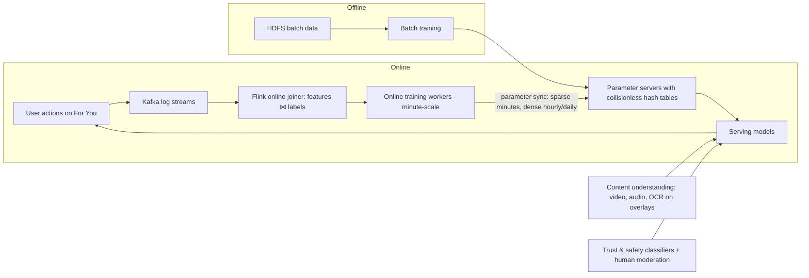
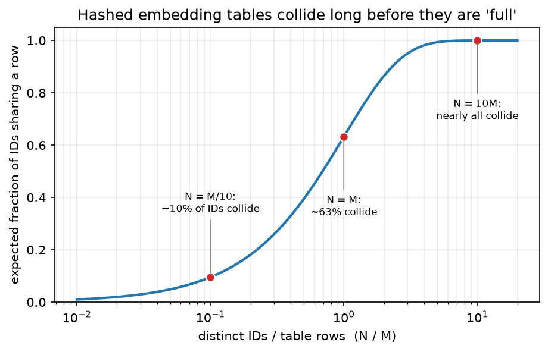

# TikTok / ByteDance (Monolith, content understanding, moderation, e-commerce, ads, Seed/Doubao)

> **Why this matters at staff level.** ByteDance is the clearest public example of a company whose product *is* its recommender: TikTok's For You feed learns from a user within minutes, and the company published the system that makes that possible (Monolith). Interviews probe real-time training and serving, embedding-table design, content understanding for short video, moderation at upload rate, and increasingly the Seed/Doubao foundation-model stack and its training infrastructure (MegaScale). Strong signal is reasoning about *freshness as the product* and its costs.

!!! warning "Sources in this chapter"
    Claims are tied to public ByteDance/TikTok papers, newsroom posts and talks, cited by exact title, venue and year in [Sources](#sources). URLs are omitted where they could not be verified in the build environment (STYLE.md §4). Anything not in a public source is marked **inference**.

## 1. The business in one paragraph

ByteDance operates Douyin and TikTok (short video), Toutiao (news), CapCut (editing), TikTok Shop and Douyin e-commerce (live and video commerce), and monetises primarily through ads and, increasingly, commerce. The defining system is the interest-based recommender that learns per-user preferences from implicit feedback on short videos in near-real time, which the company described publicly at the product level (TikTok newsroom, 2020) and at the systems level in the Monolith paper (2022). Around it sit content-understanding models (video, audio, text, OCR on overlays), trust-and-safety systems reporting through the Community Guidelines Enforcement Report, ads and commerce ranking, and — since 2023 — the Seed research group and Doubao model family, served through the Volcano Engine cloud and trained on the MegaScale infrastructure.

## 2. The ML problems that define the company

| Problem | Why it is hard | Public evidence |
|---|---|---|
| Real-time recommendation | Interests shift within a session; new videos have no history; tables of billions of IDs must be updated online without hurting serving | "Monolith: Real Time Recommendation System With Collisionless Embedding Table" (2022); TikTok newsroom "How TikTok recommends videos #ForYou" (2020) |
| Large-scale retrieval | Learn a retrievable structure rather than rely on ANN over dot products | "Deep Retrieval: Learning A Retrievable Structure for Large-Scale Recommendations" (2020) |
| Content understanding | Millions of uploads per day; music, speech, text overlays, effects; multilingual | ByteTrack (ECCV 2022); Depth Anything (CVPR 2024, with HKU); Seed vision-language reports (2025); product features such as auto-captions |
| Trust and safety | Adversarial content at upload rate; regional policy differences; livestream moderation | TikTok Community Guidelines Enforcement Reports; TikTok Transparency Center |
| E-commerce and live commerce | Ranking products inside video and livestream; conversion labels; seller quality | TikTok Shop and Douyin e-commerce product documentation (design details **inference**) |
| Ads | Auction-facing calibration; creative understanding; delayed conversions | TikTok for Business product docs (model details **inference**) |
| Foundation models & training infra | Training LLMs on >10k GPUs; multimodal models; serving cost | "MegaScale: Scaling Large Language Model Training to More Than 10,000 GPUs" (NSDI 2024); "Seed1.5-VL Technical Report" (2025); Doubao models on Volcano Engine; BytePS (SOSP 2019 / OSDI 2020) |

## 3. The stack as publicly described

*What is public (Monolith, 2022):* a Kafka-based log stream, a Flink online joiner that matches features with delayed labels, online training that streams updates into a parameter server, cuckoo-hash embedding tables that avoid collisions and support expiry of stale IDs, and a parameter synchronisation scheme that pushes sparse updates to serving at minute granularity while dense parameters sync less often; the paper also documents a negative-sampling correction for the online joiner. The TikTok newsroom post lists the signal categories (interactions, video information such as captions/sounds/hashtags, device and account settings). *Inference:* the specific model families used in ranking today, the number of funnel stages and the content-understanding models that feed features are not published in detail.

{ width="640" }

*Figure: expected fraction of IDs sharing a row in a fixed-size hashed embedding table as a function of load ($N/M$). At $N = M$, roughly 63% of IDs collide; the Monolith paper's decision to replace fixed hashed tables with a collisionless cuckoo hashmap plus ID expiry is motivated by exactly this curve.*

## 4. Deep dives

### 4.1 Monolith: collisionless embeddings and online training

**The problem.** Sparse ID features (users, videos, authors, sounds) are the core of the model. Hashing them into fixed tables creates collisions that mix unrelated IDs; the ID space is also non-stationary — millions of new videos per day and old ones fading — so a static table wastes memory on dead IDs. And a model trained nightly is stale for a product whose value is reacting within a session.

**The approach.** Monolith replaces fixed-size tables with a cuckoo hashmap keyed by ID, so each ID gets its own row; it filters IDs by frequency before admission (rare IDs never get a row) and expires rows unused for a period. Training is a hybrid: batch training on historical data, then online training that consumes the Kafka stream through a Flink joiner (which pairs a feature snapshot with a label that may arrive minutes later and applies a negative-sampling correction) and pushes sparse parameter updates to serving frequently while dense parameters, which change slowly, sync at a lower frequency. The paper argues that fault tolerance can be relaxed (periodic snapshots rather than per-update durability) because the online loop quickly re-learns after recovery.

**Math link.** Collision rate derivation: with $M$ rows and $N$ IDs, an ID collides with probability $1-(1-1/M)^{N-1} \approx 1 - e^{-N/M}$. Negative-sampling correction for the logit: if negatives are sampled at rate $r$, $\text{logit}_{\text{true}} = \text{logit}_{\text{sampled}} - \log \tfrac{1}{r}$; see [ads CTR](../part17-ml-system-design/03-ads-ctr-prediction.md) and [feed ranking](../part17-ml-system-design/01-recommendation-feed-ranking.md).

**The trade-off they chose.** Per-ID rows cost memory and a hashmap lookup, but preserve quality; expiry recovers memory. Minute-scale sync of sparse parameters trades network bandwidth for freshness; the paper reports online training improved the online metrics over batch-only and quantifies the cost of longer sync intervals in its experiments.

**Outcome.** The paper reports gains in offline AUC from collisionless tables and improved online metrics from online training; quote its tables rather than numbers from memory.

!!! tip "How to say it in the interview"
    "For a TikTok-style feed my first design decision is the embedding table, and I would follow ByteDance's Monolith paper: a collisionless hashmap keyed by ID with frequency-based admission and time-based expiry, instead of a fixed hashed table. The reason is arithmetic — at equal numbers of IDs and rows about two-thirds of IDs collide — and Monolith reports measurable AUC loss from collisions. Second, I would train online: a stream joiner that pairs features with labels that arrive minutes later, with a negative-sampling correction on the logits, and a parameter server that syncs sparse rows to serving every few minutes while dense weights sync less often, which is exactly the split the paper describes and justifies by the observation that sparse rows change fast and dense weights slowly. I would reject nightly retraining for this product because freshness is the product. The trade-off I accept is weaker durability — snapshots instead of per-update persistence — because the online loop re-learns quickly after a restore. Evaluation is online engagement versus sync interval, which the paper itself sweeps."

### 4.2 Deep Retrieval: learning a retrievable structure

**The problem.** Two-tower retrieval restricts the scoring function to a dot product so that ANN can serve it. ByteDance asked whether the *index structure* could be learned jointly with the model so richer interactions become retrievable.

**The approach.** Deep Retrieval (2020) represents each item as one or more paths through a $D$-layer, $K$-node-per-layer structure; a model predicts a path given the user with beam search, and items are assigned to paths by an EM-style procedure maximising the likelihood of user-item pairs, with a penalty preventing paths from absorbing too many items. Retrieval returns items on the highest-probability paths, then a re-ranker scores them.

**Math link.** Path likelihood factorises as $p(c \mid x) = \prod_{d=1}^{D} p(c_d \mid x, c_{<d})$; the EM step alternates between fitting the model and reassigning items to paths. See [probabilistic models & EM](../part02-classical/05-probabilistic-models-em.md) and [retrieval](../part13-retrieval-eval-reliability/01-retrieval-and-rag.md).

**The trade-off.** A learned structure allows non-dot-product scoring and multi-interest items, at the cost of a more complex training loop and a beam search at serving; the paper reports accuracy comparable to or better than tree-based and two-tower baselines on public datasets and describes production deployment.

!!! tip "How to say it in the interview"
    "If two-tower retrieval is the bottleneck, I would consider ByteDance's Deep Retrieval design, which learns a discrete path structure jointly with the model so that scoring is not restricted to a dot product; the paper's EM-style assignment of items to paths and beam search over the structure is what makes it servable. I would keep a two-tower model alongside it, because Deep Retrieval's complexity only pays if the richer interaction actually improves recall on my data. The alternative I would reject is a tree-based deep model with a fixed hierarchy, since the learned multi-path structure handles items that belong to several interests. The trade-off is training complexity and serving beam width. Evaluation is recall@k against a brute-force scorer and end-to-end online lift."

### 4.3 Content understanding for short video

**The problem.** Every upload must be understood in seconds for ranking, search, ads safety and moderation: visual content, music and speech, on-screen text (a large share of TikTok meaning lives in overlays and captions), effects and duets.

**What is public.** TikTok's newsroom post says video information such as captions, sounds and hashtags are signals; auto-captioning is a shipped feature (2021). ByteDance research has published strong perception building blocks: ByteTrack (ECCV 2022) for multi-object tracking by associating low-confidence boxes; Depth Anything (CVPR 2024, with HKU) for monocular depth from large-scale pseudo-labelled data; Seed1.5-VL (2025) as a vision-language model, plus Seedream (image) and Seedance (video) generation models. How these feed the recommender is **inference**: a standard design is per-video embeddings from video/audio/text encoders plus OCR text on overlays, ingested as item-side features and used for cold-start retrieval.

**Math link.** [Video models](../part08-multimodal/06-video-models.md), [CLIP & contrastive learning](../part08-multimodal/03-clip-contrastive.md), [tracking](../part11-perception-autonomy/04-tracking.md), [OCR design](../part17-ml-system-design/09-ocr-document-understanding.md).

!!! tip "How to say it in the interview"
    "For cold-start on a fresh upload I would compute content features at ingest — a video encoder, an audio and music encoder, ASR for speech, and OCR on overlay text — and expose them to retrieval as item-side embeddings, which is my inference about how the 'video information' signals TikTok lists publicly are used. The decision is to keep OCR explicit, because on-screen text carries the joke or the product name and a video encoder will not read it reliably. I would reject waiting for interaction data before recommending; Monolith's whole point is speed, and content features are what carry a video through its first hour. The trade-off is ingest compute per upload, so I would tier the encoders and run the expensive VLM only on videos that gain early traction. Evaluation: retrieval recall for videos under an hour old and time-to-first-thousand-views by content class."

### 4.4 Trust and safety at upload rate

**What is public.** TikTok's Community Guidelines Enforcement Reports describe automated detection removing a large share of violating videos before any views and human moderation for the rest, with per-policy removal statistics and appeal outcomes; live-stream moderation is a specific challenge the transparency reports discuss. Model details are not published.

**How to reason.** The design is a cascade: hash matching for known material, multimodal classifiers per policy area, confidence-based routing to human review, and prevalence measurement by sampling. See [content moderation](../part17-ml-system-design/07-content-moderation.md).

!!! tip "How to say it in the interview"
    "I would build moderation as a cascade in front of the recommender: hash matching for known violating material, per-policy multimodal classifiers over video, audio, OCR text and captions, and confidence-based routing to human review, with automated removal only above a high-precision threshold. TikTok's enforcement reports say a large share of removals happen before any views, so the system must run at ingest, not after distribution. I would reject a single generic classifier because the cost of a false removal differs by policy. The trade-off is ingest latency versus recall, which I would manage by scoring before the video enters the candidate pool rather than blocking upload. Evaluation is prevalence by sampling, proactive removal rate and appeal overturn rate, the three metrics the transparency reports themselves emphasise."

### 4.5 MegaScale and the Seed/Doubao stack

**What is public.** MegaScale (NSDI 2024) describes training LLMs on more than 10,000 GPUs with co-designed algorithm and system changes — parallel transformer blocks, sliding-window attention, LAMB optimiser, communication overlap, custom kernels, and a diagnostic stack for stragglers — and reports model FLOPs utilisation improvements over Megatron-LM at that scale. BytePS (SOSP 2019 / OSDI 2020) is the earlier communication-scheduling work. The Seed group publishes model reports (Seed1.5-VL for vision-language, Seed-Thinking for reasoning) and Doubao is the consumer/enterprise model family served on Volcano Engine.

**Why it matters.** Interviews for Seed and infra roles ask about MFU at scale, failure recovery, and multimodal pretraining data; see [distributed training](../part14-systems/01-distributed-training.md) and [multimodal foundation models](../part08-multimodal/05-multimodal-foundation.md).

!!! tip "How to say it in the interview"
    "For training at ten-thousand-GPU scale I would follow the MegaScale playbook ByteDance published at NSDI 2024: co-design the model for efficiency — parallel attention and MLP blocks, sliding-window attention where it is safe — overlap communication with compute across data, tensor and pipeline parallelism, and invest early in diagnostics for stragglers and faults, because the paper reports that at that scale failures and slow nodes dominate lost time. I would reject treating the problem as pure framework tuning; the algorithm changes are part of the gain. The trade-off is that model modifications must be validated not to hurt quality, which MegaScale checks with loss curves against the baseline. Evaluation is MFU and effective training throughput after accounting for restarts."

## 5. Likely interview questions

!!! interview "1. Design the For You feed so that a new user gets good recommendations within one session."
    **Sketch.** Content-feature retrieval for cold users, exploration slate, online training of sparse parameters at minute scale (Monolith), immediate feedback features (watch completion, skips), diversity constraints. Cross-link: [feed ranking](../part17-ml-system-design/01-recommendation-feed-ranking.md).

    !!! tip "How to say it in the interview"
        "The design decision is to make the model learn *during* the session, which ByteDance's Monolith paper shows is feasible by streaming sparse-parameter updates to serving at minute granularity. I would start a new user with an exploration slate over popular, diverse, content-clustered videos, log completion and skip signals as fast labels, and let online training update the user's rows immediately. I would reject a nightly-batch model with a rules-based cold-start layer; it cannot react within the session. The trade-off is serving-side sync bandwidth and some noise from fast labels, so I would weight completions above likes. Evaluation: session-one retention and time-to-first-completion, with a batch-only control arm."

!!! interview "2. Why not just hash IDs into a fixed table? Show the math."
    **Sketch.** Collision probability $1 - e^{-N/M}$; collisions mix gradients from unrelated IDs; Monolith's admission filter and expiry keep memory bounded.

    !!! tip "How to say it in the interview"
        "With $N$ IDs and $M$ rows, the chance an ID shares its row is about $1 - e^{-N/M}$, so at $N = M$ two-thirds of IDs collide and their gradients mix; ByteDance's Monolith paper measured the resulting AUC loss and replaced the fixed table with a collisionless hashmap. To keep memory bounded they admit only IDs seen more than a threshold and expire rows unused for a period; I would do the same. The alternative — oversizing the hashed table — cuts collisions only linearly in memory. Evaluation: AUC against a collisionless reference and memory per active ID."

!!! interview "3. Your online joiner sees a click 20 minutes after the impression. How do you train without waiting?"
    **Sketch.** Emit negative immediately, correct later (importance correction or label correction); Monolith's negative-sampling correction; fake-negative handling as in delayed-feedback literature.

    !!! tip "How to say it in the interview"
        "I would keep an in-memory window of recent impressions in the joiner so late labels can be matched, and beyond the window treat the example as negative with a correction — Monolith describes a Flink joiner with exactly this structure plus a negative-sampling correction on the logit. I would reject waiting for the full attribution window; that throws away the freshness the system exists for. The trade-off is label noise from late positives, so I would measure calibration by time-since-impression and adjust the correction. Evaluation: calibration drift and online engagement versus a delayed-label baseline."

!!! interview "4. Design retrieval for a corpus of billions of short videos where a video can serve several interests."
    **Sketch.** Multi-source: two-tower with ANN, Deep Retrieval-style learned structure allowing multi-path items, content-based retrieval for fresh items. Cross-link: [retrieval](../part13-retrieval-eval-reliability/01-retrieval-and-rag.md).

    !!! tip "How to say it in the interview"
        "I would run several retrieval sources and merge them: a two-tower model with ANN for the bulk, a learned-structure retriever in the style of ByteDance's Deep Retrieval paper because it assigns items to multiple paths and so handles multi-interest videos, and a content-embedding source for videos too new to have interactions. I would reject a single two-tower source: dot-product geometry struggles with an item that is simultaneously 'cooking' and 'comedy'. The trade-off is merge complexity and duplicated candidates, so I would dedupe and attribute every final impression to its source. Evaluation: per-source recall and marginal contribution to final ranked lists."

!!! interview "5. Implement the parameter-sync policy: which parameters go to serving every minute?"
    **Sketch (coding).** Track touched sparse rows since last sync; push only those; dense weights on a slower schedule; Monolith's rationale (sparse rows sparse in change; dense weights change slowly).

    !!! tip "How to say it in the interview"
        "I would maintain a set of embedding rows touched since the last sync and push only those at the minute cadence, and push dense weights on a slower schedule, which is the exact split Monolith describes and justifies: only a small fraction of the sparse rows change in any minute, while dense weights move slowly and syncing them often wastes bandwidth. I would reject full-model snapshots at minute granularity. The trade-off is a brief inconsistency between sparse and dense parameters at serving, which the paper reports is tolerable. Evaluation: bytes per sync and online metric versus sync interval."

!!! interview "6. Read the text overlays on ten million uploads a day."
    **Sketch.** Keyframe selection, text detection, multilingual recognition, temporal deduplication of repeated overlays; feed text to ranking, search and moderation. Cross-link: [OCR design](../part17-ml-system-design/09-ocr-document-understanding.md).

    !!! tip "How to say it in the interview"
        "I would sample keyframes by scene change, run a detector and a multilingual recogniser on them, and deduplicate text that persists across frames so cost scales with distinct overlays, not frames. I would reject running OCR on every frame. The trade-off is missing brief overlays, which I would measure against a fully sampled audit set. The outputs feed retrieval, search and moderation; TikTok lists captions as a recommendation signal, so overlay text is a natural extension of that, though its exact use is my inference. Evaluation: word error rate by script and downstream retrieval lift for videos whose only text is on-screen."

!!! interview "7. Design live-stream moderation with a five-second budget."
    **Sketch.** Sliding-window audio/visual classifiers, escalation to humans, automated interventions (mute/warn) graded by confidence, prevalence measurement. Cross-link: [content moderation](../part17-ml-system-design/07-content-moderation.md).

    !!! tip "How to say it in the interview"
        "I would run sliding-window classifiers on audio and sampled frames with a latency budget under the stream delay, escalate uncertain segments to human moderators, and apply graded automated actions — warnings, muting, then ending the stream — by confidence and policy severity. TikTok's transparency reports call out live content as a distinct enforcement area, which supports treating it separately from uploaded video. I would reject post-hoc review only, since harm in live is immediate. The trade-off is false interventions against creators, so I would keep hard actions behind human confirmation. Evaluation is time-to-action on violating segments and creator appeal outcomes."

!!! interview "8. Rank products in TikTok Shop videos and live streams."
    **Sketch.** Multi-task model predicting click, add-to-cart, purchase with delayed conversion handling; seller quality and price features; commerce-specific guardrails; **inference** as ByteDance has not published the commerce ranker.

    !!! tip "How to say it in the interview"
        "I would build a multi-task ranker predicting click, add-to-cart and purchase, with a value formula weighting purchase and expected order value, and treat conversions as delayed labels with the same joiner design Monolith uses for the feed. I would reject reusing the feed's engagement model unchanged: watch time is not intent to buy. The trade-off is sparse purchase labels, so I would use the cheaper actions as auxiliary tasks. This design is my inference; ByteDance has not published its commerce ranker. Evaluation: gross merchandise value per impression in an A/B with return-rate guardrails."

!!! interview "9. Why does ByteDance run training and serving on different fault-tolerance guarantees?"
    **Sketch.** Monolith argues online training tolerates loss of recent updates because it re-learns quickly; snapshots suffice; serving needs availability.

    !!! tip "How to say it in the interview"
        "Monolith argues that a recommendation model trained online recovers quickly from losing a few minutes of updates, so periodic snapshots are enough for training and per-update durability would cost throughput for little benefit; serving, by contrast, must always be available. I would adopt that asymmetry. The alternative, full durability on the training parameter server, buys robustness the workload does not need. Evaluation is metric recovery time after a forced restore."

!!! interview "10. How would you evaluate a change to the For You ranker?"
    **Sketch.** Offline AUC per task, then A/B with retention and diversity guardrails; account for network effects among creators; long-term holdouts. Cross-link: [notifications, uplift & experimentation](../part17-ml-system-design/11-notifications-uplift-experimentation.md).

    !!! tip "How to say it in the interview"
        "I would gate on offline AUC per task, then run an A/B with time spent and next-day retention as primary metrics and diversity and creator-exposure guardrails, and I would keep a long-term holdout because a freshness-driven system can over-exploit short-term interest. I would reject shipping on AUC alone. The trade-off is experiment duration versus velocity; interleaving on ranking-only changes speeds this up. TikTok has publicly stated diversity is a design goal of the feed, so I would treat it as a guardrail, not an afterthought."

!!! interview "11. Train a multimodal model on video-text pairs at ByteDance scale."
    **Sketch.** Data curation and de-duplication, contrastive plus captioning objectives, MegaScale-style parallelism, evaluation on retrieval and VQA. Cross-link: [multimodal foundation models](../part08-multimodal/05-multimodal-foundation.md).

    !!! tip "How to say it in the interview"
        "I would curate and deduplicate video-text pairs, train a contrastive video-text encoder for retrieval and a generative vision-language model for understanding, and run it on a MegaScale-style stack with the communication overlap and straggler diagnostics ByteDance described at NSDI 2024. I would reject a single objective; contrastive alone does not give grounded generation and captioning alone gives poor retrieval. The trade-off is compute, which is why the encoder is shared. Evaluation: zero-shot retrieval recall and VQA benchmarks, plus downstream cold-start retrieval lift in the feed."

!!! interview "12. Detect and track objects across a short video for an effect (e.g., a sticker that follows a person)."
    **Sketch.** Detector + ByteTrack-style association using low-confidence boxes; on-device constraints; evaluation on MOTA/IDF1. Cross-link: [tracking](../part11-perception-autonomy/04-tracking.md), [detection](../part04-vision/04-detection.md).

    !!! tip "How to say it in the interview"
        "I would use a lightweight detector with a ByteTrack-style association step that keeps low-confidence boxes for matching instead of discarding them, because ByteDance's ECCV 2022 paper shows those boxes are usually occluded true objects and using them reduces identity switches. On device I would quantise the detector and run tracking at reduced frame rate with interpolation. I would reject a heavy re-identification model for a sticker effect; latency matters more than identity across long occlusions. Evaluation: IDF1 and MOTA on egocentric-style clips, plus frame time on target phones."

## 6. What to bring from your background

* **Detection, tracking and OCR** map onto content understanding (overlay text, objects for effects and search, ByteTrack-style tracking in CapCut/TikTok effects) and onto moderation; emphasise throughput per upload, multilingual OCR, and evaluation by prevalence.
* **ML systems at scale**: Monolith is an online-learning systems paper; talk about streaming joins, delayed labels, parameter servers, sync cadence and fault tolerance in those terms.
* **Foundation-model infra**: if you have run distributed training, MegaScale's MFU and straggler-diagnosis story is the shared vocabulary for Seed.

## Sources

**Recommendation**

* Liu et al., "Monolith: Real Time Recommendation System With Collisionless Embedding Table", 2022 (arXiv 2209.07663).
* Gao et al., "Deep Retrieval: Learning A Retrievable Structure for Large-Scale Recommendations", 2020 (arXiv 2007.07203).
* TikTok Newsroom, "How TikTok recommends videos #ForYou", June 2020.

**Perception and content**

* Zhang et al., "ByteTrack: Multi-Object Tracking by Associating Every Detection Box", ECCV 2022.
* Yang et al., "Depth Anything: Unleashing the Power of Large-Scale Unlabeled Data", CVPR 2024 (HKU and TikTok).
* ByteDance Seed, "Seed1.5-VL Technical Report", 2025; Seedream and Seedance model reports, 2025.

**Trust and safety**

* TikTok Transparency Center, Community Guidelines Enforcement Reports (quarterly).

**Infrastructure and foundation models**

* Jiang et al., "MegaScale: Scaling Large Language Model Training to More Than 10,000 GPUs", NSDI 2024 (arXiv 2402.15627).
* Peng et al., "A Generic Communication Scheduler for Distributed DNN Training Acceleration", SOSP 2019; Jiang et al., "A Unified Architecture for Accelerating Distributed DNN Training in Heterogeneous GPU/CPU Clusters", OSDI 2020 (BytePS).
* ByteDance Seed, "Seed-Thinking-v1.5" technical report, 2025; Volcano Engine Doubao model documentation.
