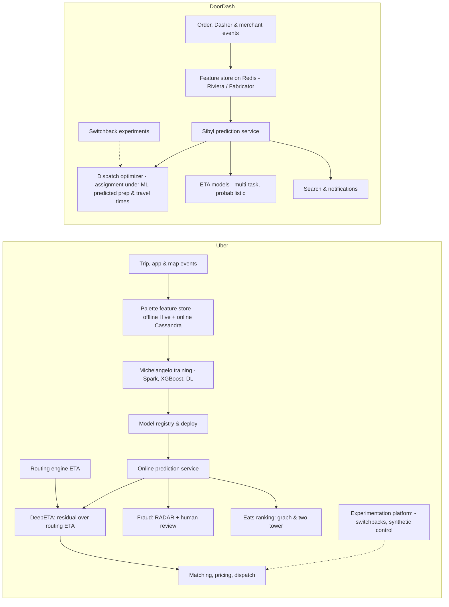

# Uber & DoorDash (Michelangelo, DeepETA, marketplace & pricing, fraud, Eats/search recsys, document verification; dispatch, ETA, switchbacks)

> **Why this matters at staff level.** Uber and DoorDash are two-sided (or three-sided) marketplaces where ML decisions move physical supply: ETAs feed dispatch and pricing, dispatch feeds courier earnings and customer wait, and every experiment leaks across the marketplace. Interviews test whether you can reason about forecasting under a routing engine, marketplace experiments that break i.i.d. assumptions, fraud with adversaries and human review, and platform work that lets hundreds of models ship. Strong signal is grounding designs in their published systems: Michelangelo, DeepETA, Uber's switchback and experimentation posts; DoorDash's dispatch, switchback, Sibyl and feature-store posts.

!!! warning "Sources in this chapter"
    Claims are tied to public Uber and DoorDash engineering posts and papers, cited by exact title, venue and year in [Sources](#sources). URLs are omitted where they could not be verified in the build environment (STYLE.md §4). Anything not in a public source is marked **inference**.

## 1. The business in one paragraph

Uber matches riders with drivers and eaters with couriers and restaurants; DoorDash matches consumers, merchants and Dashers. Both earn a take rate on transactions, so unit economics hinge on ML: predicting ETAs and prep times (which set expectations, prices and dispatch), setting prices and incentives that balance supply and demand, dispatching efficiently (an optimisation problem fed by ML predictions), ranking restaurants and dishes, catching fraud on both sides (payments, promotions, fake accounts, GPS spoofing), and verifying identity documents for onboarding. Uber built one of the first broadly described ML platforms (Michelangelo, 2017) and later documented DeepETA; DoorDash has published on dispatch, switchback experiments, its Sibyl prediction service, feature store and ETA models.

## 2. The ML problems that define the company

| Problem | Why it is hard | Public evidence |
|---|---|---|
| ETA prediction | Routing engines give physical estimates; residual error depends on traffic, pick-up behaviour, restaurant prep; latency budget is tight; billions of predictions per day | "DeepETA: How Uber Predicts Arrival Times Using Deep Learning" (Uber, 2022); DoorDash posts on ETA prediction and long-tail events (2023–2024) |
| Dispatch | Assignment under uncertainty, batching, future supply; ML predictions feed an optimiser | "Next-Generation Optimization for Dasher Dispatch at DoorDash" (2020); "Using ML and Optimization to Solve DoorDash's Dispatch Problem" (2021) |
| Marketplace experiments | Treatment leaks through shared supply; standard A/B is biased | "Experimentation in a Ridesharing Marketplace" (Uber, 2018); "Switchback Tests and Randomized Experimentation Under Network Effects at DoorDash" (2018); "Analyzing Switchback Experiments by Cluster Robust Standard Error" (DoorDash, 2019) |
| Forecasting | Demand by hex and time; extreme events | "Forecasting at Uber: An Introduction" (2018); "Engineering Extreme Event Forecasting at Uber with Recurrent Neural Networks" (2017) |
| Fraud and safety | Adversaries adapt; payments, promo abuse, account takeovers; humans in the loop | "Project RADAR: Intelligent Early Fraud Detection System with Humans in the Loop" (Uber, 2022); DoorDash fraud posts |
| Identity and document verification | Driver onboarding requires licences, insurance; selfie verification; OCR on noisy phone photos | Uber "Real-Time ID Check" (product, 2016 onward); Uber's document verification is product-level public, model details **inference** |
| Eats / search / recommendations | Cold-start restaurants, geo-constrained candidates, dish-level intent | "Food Discovery with Uber Eats: Using Graph Learning to Power Recommendations" (2019); "Innovative Recommendation Applications Using Two Tower Embeddings at Uber" (2023); "Things Not Strings: Understanding Search Intent with Better Recall" (DoorDash, 2022) |
| ML platform | Feature store with online/offline parity, model registry, low-latency serving | "Meet Michelangelo" (2017); "Scaling Machine Learning at Uber with Michelangelo" (2018); "From Predictive to Generative: How Michelangelo Accelerates Uber's AI Journey" (2024); "Meet Sibyl" (DoorDash, 2020); "Building a Gigascale ML Feature Store with Redis…" (DoorDash, 2020); Fabricator and Riviera posts (2021–2022) |

## 3. The stack as publicly described

*What is public:* Michelangelo's components, a feature store (Palette) with offline and online stores, Spark-based training, model management and a low-latency prediction service (2017–2018 posts); DeepETA as a transformer-style residual model on top of a routing engine ETA (2022); Uber's use of switchbacks and synthetic controls in marketplace experiments (2018); DoorDash's dispatch optimisation fed by ML estimates (2020–2021), Sibyl as the prediction service (2020), Redis-based feature store (2020), Riviera and Fabricator for feature engineering (2021–2022), and switchback experimentation with cluster-robust inference (2018–2019). *Inference:* current model families per surface and the exact integration between prediction and optimisation are not fully published.

## 4. Deep dives

### 4.1 DeepETA: learning the residual of a routing engine

**The problem.** Routing engines compute travel time from map segments, but real arrival times deviate: traffic, pick-up dwell, route deviations, driver behaviour. Uber needed a global model, low latency, and calibrated outputs for many consumers (rider ETA, matching, pricing, Eats).

**The approach (per the 2022 post).** DeepETA predicts the *residual* between the routing-engine ETA and the actual duration, not the ETA itself, which keeps the physical prior and lets the model focus on systematic bias. Inputs are embedded: continuous features are *quantised into buckets* and embedded, geospatial features are embedded via multiple resolutions of hexagonal (H3-style) grids with feature hashing, and a self-attention encoder captures interactions across the trip's features (origin, destination, time, request type). To hit a strict latency budget the encoder uses a *linear* attention variant, and a small bias-adjustment decoder produces per-segment (e.g., per-request-type, per-city) corrections; the post describes calibration and an asymmetric loss so that early and late errors can be weighted differently by consumer. Training is on a large trip corpus and the post discusses that the model replaced an XGBoost residual model.

**Math link.** Residual learning: $\hat T = T_{\text{route}} + f_\theta(x)$; with an asymmetric loss $\ell(r) = |\tau - \mathbb{1}[r<0]|\cdot|r|$ you get the quantile regression at level $\tau$, see [forecasting & ETA design](../part17-ml-system-design/10-forecasting-eta.md) and [efficient attention](../part06-llm-training/04-efficient-attention-kv-cache.md) for linear attention.

**The trade-off.** Predicting the residual constrains the model but makes it robust and easy to fall back from; linear attention loses some expressivity for latency; discretising continuous inputs trades resolution for learnable embeddings that the post reports outperformed raw inputs.

!!! tip "How to say it in the interview"
    "For ETA I'd predict the residual on top of the routing engine, which is the central design in Uber's 2022 DeepETA post (the router encodes the physics and the model learns systematic bias) rather than predicting durations from scratch. I'd follow the post's other decisions: bucketise continuous features and embed them, embed locations at several hexagonal-grid resolutions, and use a self-attention encoder over the trip's features; and because the latency budget is a few milliseconds at very high QPS, I'd use a linear-attention variant as they did. I'd reject a large gradient-boosted model as the long-term answer, which is what the post says DeepETA replaced, because the embedding-based encoder captured interactions better at scale. The trade-off is the loss of a directly interpretable tree model, so I'd keep per-segment bias terms in a small decoder to explain and correct errors by city and request type. Evaluation: mean absolute error and calibration by segment, and consumer-specific asymmetric metrics, because a late ETA costs more than an early one for a rider and the reverse for dispatch."

### 4.2 Michelangelo: the platform that named the feature store

**What is public.** The 2017 post introduces Michelangelo as an end-to-end platform: manage data, train, evaluate, deploy, predict and monitor, with a *feature store* (Palette) that keeps offline (Hive) and online (Cassandra) features consistent through shared definitions, a DSL for feature transformations, Spark and XGBoost training, and a prediction service with model versioning. The 2018 post covers scaling: model management, experimentation, deep learning support and distributed training with Horovod (Uber's open-source data-parallel library, 2018). The 2024 post describes the platform's evolution to support generative AI (LLM gateways, fine-tuning, evaluation) alongside predictive ML.

**Why it matters.** "Design an ML platform" at Uber is answered in Michelangelo's vocabulary, see [ML platform design](../part17-ml-system-design/12-ml-platform-feature-store-monitoring.md).

!!! tip "How to say it in the interview"
    "If asked to design an ML platform I'd describe the shape Uber published for Michelangelo in 2017 and 2018: a feature store with a single definition backing both an offline store for training and an online store for serving, so train/serve skew is eliminated by construction; a DSL for transformations applied identically in both paths; managed training with Spark and XGBoost and, later, deep learning with Horovod; a model registry; and a low-latency prediction service with monitoring. My key decision is the shared feature definition, because the platform's value is preventing skew rather than any single model. I'd reject a training-only platform that leaves serving to each team. The trade-off is that a central platform is a bottleneck for exotic workloads, so I'd add escape hatches, which the 2018 post describes as a lesson. Evaluation is time-to-production for a new model and skew incidents per quarter."

### 4.3 Marketplace experimentation: switchbacks and synthetic controls

**The problem.** In a marketplace, treating half the riders changes the supply available to the other half; standard A/B estimates are biased by interference.

**The approach.** Uber's 2018 post on experimentation in a ridesharing marketplace describes switchback experiments (randomise treatment over time windows and geographic units rather than users), synthetic control methods when randomisation is not possible, and the trade-offs of each. DoorDash's 2018 post describes switchbacks over region-time units for dispatch and pricing changes, and its 2019 post argues that analysis must use cluster-robust standard errors because observations within a switchback unit are correlated; later posts discuss variance reduction and the choice of window length. Cross-link: [experimentation](../part17-ml-system-design/11-notifications-uplift-experimentation.md).

**Math link.** With $G$ region-time clusters, the treatment-effect estimator's variance uses the cluster-robust sandwich; naïve i.i.d. standard errors understate uncertainty when within-cluster correlation is positive. See [statistics](../part01-math/04-statistics.md).

!!! tip "How to say it in the interview"
    "For a pricing or dispatch change I wouldn't run a user-level A/B, because treated and control users share the same drivers and the effect leaks; both Uber's 2018 marketplace experimentation post and DoorDash's 2018 switchback post make this argument. I'd randomise over region-time windows (a switchback) and analyse with cluster-robust standard errors, as DoorDash's 2019 post shows is necessary because orders in the same window are correlated. The trade-off is fewer effective samples and carry-over between windows, so I'd choose window length to exceed a typical delivery and drop boundary periods. I'd reject synthetic control as the default; Uber's post positions it for cases where randomisation is impossible. Evaluation: the estimator's coverage on A/A tests before trusting it on A/B."

### 4.4 Fraud with humans in the loop

**What is public.** Uber's 2022 RADAR post describes an early fraud-detection system that detects emerging fraud *patterns* (not just individual events) using anomaly detection over aggregated signals, proposes rules, and routes them to human analysts who approve, edit or reject; the goal is to respond to new attacks within hours rather than waiting for supervised labels. DoorDash's engineering blog has described fraud and abuse work on promotions, referral fraud and account integrity at a product level.

**Design principle.** Supervised models catch known fraud; a pattern-detection layer with analyst review catches novel fraud; both need a case-management loop so that analyst decisions become labels. See [fraud & anomaly detection](../part17-ml-system-design/04-fraud-anomaly-detection.md).

!!! tip "How to say it in the interview"
    "I'd build fraud defence in two layers: supervised models on known fraud, and a pattern-detection layer that flags anomalous aggregates and proposes rules for analysts, which is the design of Uber's 2022 Project RADAR post. The reason is time-to-response, a new attack has no labels for weeks, but its aggregate signature shows up in hours. I'd reject a purely supervised system for that reason and a purely rules-based one because rules decay. The trade-off is analyst load, so proposals are ranked by estimated loss and analysts approve rather than author rules. Evaluation: time from first fraudulent event to mitigation, and precision of approved rules measured on later chargebacks."

### 4.5 Eats and DoorDash search: geo-constrained recommendation

**What is public.** Uber's 2019 post on Eats describes graph learning (a GraphSAGE-style model over the user-restaurant-dish graph) to power recommendations, with location constraints handled at retrieval; the 2023 post describes two-tower embeddings used across several recommendation applications. DoorDash's 2022 search post describes moving from string matching to entity-level understanding ("things, not strings"): a knowledge graph of dishes and cuisines, query understanding, and recall improvements; later posts describe personalised notifications with graph models.

!!! tip "How to say it in the interview"
    "For Eats or DoorDash discovery I'd first restrict candidates by deliverable radius and open hours, then retrieve with graph-based or two-tower embeddings (Uber's 2019 post used a GraphSAGE-style model over users, restaurants and dishes and its 2023 post describes two-tower retrieval) and rank with a multi-task model on click, add-to-cart and order. For search I'd follow DoorDash's 2022 'things not strings' post and map queries to entities in a dish and cuisine graph rather than matching strings, because 'ramen' should recall restaurants that never wrote the word. I'd reject reusing a global recsys unchanged; geography is the dominant constraint. Evaluation: order rate per session and null-result rate for search."

### 4.6 Document verification and OCR for onboarding (product-level public, models inferred)

**What is public.** Uber's Real-Time ID Check (2016 onward) periodically asks drivers to take a selfie that is compared with the account photo; onboarding requires uploading a driver's licence, vehicle registration and insurance, which are verified before activation. DoorDash also verifies Dasher identity and documents. Neither company has published the model architecture; the design below is **inference** from standard practice and the book's [OCR & document understanding](../part17-ml-system-design/09-ocr-document-understanding.md) chapter.

**Inferred design.** Document classification → OCR with field extraction (licence number, name, expiry) → template and security-feature checks → face match between document photo and selfie with liveness → consistency checks against account data → human review on low confidence. The operating metrics are false-accept rate (fraudulent documents passing), false-reject rate (legitimate drivers blocked, an onboarding-funnel cost), and time to activation.

!!! tip "How to say it in the interview"
    "For driver onboarding I'd build a document pipeline (classify the document type, OCR and extract fields, check expiry and template integrity, match the portrait against a liveness-checked selfie, and route low-confidence cases to humans) and I'd say plainly that Uber has published the product (Real-Time ID Check and document requirements) but not the models, so the architecture is my inference. The decision I'd defend is calibrated confidence with human review, because a false reject blocks a legitimate driver's income and a false accept is a safety incident; both costs are high and asymmetric by region. I'd reject a fully automated pipeline on day one. The trade-off is review cost, which I'd reduce by active learning on the reviewed cases. Evaluation: false-accept and false-reject rates per document type and country, plus time to activation."

## 5. Likely interview questions

!!! interview "1. Design Uber's ETA system end to end."
    **Sketch.** Routing engine → residual model (DeepETA-style) → per-consumer calibration; features (time, location hexes, request type); serving at high QPS with low latency; monitoring by city. Cross-link: [forecasting & ETA](../part17-ml-system-design/10-forecasting-eta.md).

    !!! tip "How to say it in the interview"
        "I'd keep the routing engine as the base and learn the residual with an embedding-based self-attention model, as Uber's DeepETA post describes, with linear attention to meet latency, bucketised continuous features and multi-resolution hex embeddings for locations. I'd reject an end-to-end model without the router: it would have to relearn the map. The trade-off is serving cost, so the encoder is small and features are precomputed where possible. Evaluation: MAE and calibration by city and request type, with asymmetric costs per consumer."

!!! interview "2. Your ETA model is accurate on average but 15% of deliveries are very late. What now?"
    **Sketch.** Model the distribution (quantile or probabilistic outputs), long-tail features (restaurant prep variance, weather), separate models or heads for tail events; DoorDash's posts on long-tail ETA and probabilistic forecasts.

    !!! tip "How to say it in the interview"
        "Average accuracy hides the tail, so I'd predict a distribution (quantile heads or a probabilistic output) and use the upper quantile for the customer-facing promise, which DoorDash's posts on long-tail events and probabilistic ETAs describe. I'd add tail-driving features like restaurant prep variance and weather. I'd reject just adding a buffer; it punishes every order to fix a few. Evaluation: on-time rate at the promised quantile and pinball loss."

!!! interview "3. Design DoorDash dispatch."
    **Sketch.** Predict prep time and travel time, batch orders, solve an assignment problem (Hungarian/MIP) periodically, account for future supply; simulation and switchbacks for evaluation.

    !!! tip "How to say it in the interview"
        "I'd separate prediction from optimisation, as DoorDash's dispatch posts describe: ML predicts prep and travel times, and a periodic optimiser assigns orders to Dashers with batching and a look-ahead for future supply. I'd reject greedy nearest-Dasher assignment; it ignores batching and the next order. The trade-off is optimiser latency, so the horizon is bounded. Evaluation: simulation first, then switchback experiments on delivery time and Dasher efficiency."

!!! interview "4. Run an experiment for a new surge pricing algorithm."
    **Sketch.** Switchback over city-time units, cluster-robust SEs, A/A validation, guardrails on driver earnings and rider cancellations. Cross-link: [experimentation](../part17-ml-system-design/11-notifications-uplift-experimentation.md).

    !!! tip "How to say it in the interview"
        "I'd run a switchback across region-time units because pricing shifts supply between riders, as Uber's 2018 marketplace experimentation post explains, and analyse with cluster-robust standard errors following DoorDash's 2019 post. I'd validate the design with A/A tests first. I'd reject a user-level A/B. Evaluation: completed trips, driver earnings and cancellation rate with confidence intervals from the cluster-robust estimator."

!!! interview "5. Implement the quantile (pinball) loss and explain why an ETA product wants it (coding)."
    **Sketch.** $\ell_\tau(y, \hat y) = \max(\tau (y-\hat y), (\tau-1)(y-\hat y))$; asymmetric costs; DeepETA's asymmetric loss framing.

    !!! tip "How to say it in the interview"
        "The pinball loss at level tau charges tau times the error when we under-predict and one-minus-tau when we over-predict, so minimising it yields the tau-quantile. DeepETA's post describes weighting early and late errors differently per consumer, which is the same idea. I'd implement it as a maximum of two linear terms and test it by fitting a constant on skewed data and checking the fitted value matches the empirical quantile."

!!! interview "6. Detect GPS spoofing and fake trips."
    **Sketch.** Sequence anomaly detection on location traces, device integrity signals, graph features across accounts and devices, human review; RADAR-style pattern detection. Cross-link: [fraud & anomaly detection](../part17-ml-system-design/04-fraud-anomaly-detection.md).

    !!! tip "How to say it in the interview"
        "I'd combine trace-level anomaly detection (speed and accelerometer consistency, implausible jumps) with device and account graph features, and feed aggregate anomalies into a pattern-detection layer with analysts, following Uber's RADAR design. I'd reject a single per-trip classifier; fraud rings are visible only in aggregate. Evaluation: confirmed fraud caught before payout and false-flag rate on legitimate drivers."

!!! interview "7. Build the feature store for both training and real-time serving."
    **Sketch.** Shared definitions, offline batch store, online low-latency store (Redis at DoorDash, Cassandra at Uber), streaming features (Riviera), point-in-time joins; monitoring. Cross-link: [ML platform](../part17-ml-system-design/12-ml-platform-feature-store-monitoring.md).

    !!! tip "How to say it in the interview"
        "I'd follow the Palette design from Michelangelo and DoorDash's Redis-based store: one feature definition, an offline store for point-in-time training joins and an online store for serving, with streaming features computed by a declarative framework like DoorDash's Riviera. I'd reject ad hoc feature code in models. The trade-off is memory cost in the online store, which DoorDash reduced with compact serialisation and hashing as its 2020 post describes. Evaluation: skew rate, feature freshness and p99 lookup latency."

!!! interview "8. Forecast demand per hex for the next hour across a city."
    **Sketch.** Hierarchical time-series, global models across hexes, exogenous events, extreme-event handling; Uber's forecasting posts. Cross-link: [forecasting & ETA](../part17-ml-system-design/10-forecasting-eta.md).

    !!! tip "How to say it in the interview"
        "I'd train a global sequence model across hexes with hex and time embeddings and exogenous features for weather and events, in the spirit of Uber's 2017 extreme-event forecasting post, and reconcile hex forecasts to city totals. I'd reject one model per hex; the data per hex is too sparse. Evaluation: weighted quantile loss and backtests over holidays."

!!! interview "9. Verify a driver's licence photo taken with a phone at night."
    **Sketch.** Image quality gating, document detection and rectification, OCR with field parsing, security features, retake prompts; human review. Cross-link: [OCR design](../part17-ml-system-design/09-ocr-document-understanding.md).

    !!! tip "How to say it in the interview"
        "I'd gate on image quality and prompt a retake early, then detect and rectify the document, OCR the fields, and check them against the account, with human review for low confidence, noting that Uber's verification products are public but the models are my inference. I'd reject rejecting the driver outright on a bad photo; retake prompts fix most failures. Evaluation: OCR field accuracy on low-light images, retake rate, and time to activation."

!!! interview "10. Rank dishes, not restaurants, in Eats."
    **Sketch.** Dish-level entities, multi-task model, graph features, dish availability and prep time; Uber Eats graph learning post.

    !!! tip "How to say it in the interview"
        "I'd model dishes as entities in the user-restaurant-dish graph, following Uber's 2019 Eats graph learning post, and rank with a multi-task model that includes prep time and availability, since a great dish that takes an hour is a bad recommendation at lunch. I'd reject restaurant-only ranking. Evaluation: order conversion and post-order rating."

!!! interview "11. Add an LLM to customer support (DoorDash Dasher support)."
    **Sketch.** RAG over policies, guardrails, escalation, evaluation with human labels; DoorDash's post on LLM-based Dasher support. Cross-link: [LLM assistant with RAG](../part17-ml-system-design/08-llm-product-rag-assistant.md).

    !!! tip "How to say it in the interview"
        "I'd ground the assistant in retrieved policy and order context, add a guardrail model that checks answers before they are sent, and escalate to humans on low confidence, which is the pattern DoorDash described in its post on LLM-based Dasher support automation. I'd reject a free-form chatbot. Evaluation: resolution rate and a human-rated accuracy audit."

!!! interview "12. How does Michelangelo need to change for generative AI?"
    **Sketch.** Model gateway, prompt and fine-tuning management, evaluation, cost controls; Uber's 2024 post.

    !!! tip "How to say it in the interview"
        "Uber's 2024 post describes extending Michelangelo with a gateway to hosted and open models, fine-tuning workflows and evaluation tooling, and I'd add cost and safety controls at the gateway. I'd reject a separate GenAI platform; the feature store and registry still apply. Evaluation: adoption and cost per request."

## 6. What to bring from your background

* **Document verification and OCR** are directly relevant to driver and Dasher onboarding, merchant menu ingestion (menus are documents), and receipt/proof-of-delivery checks; emphasise field-level accuracy, low-quality-image robustness and calibrated human routing.
* **Detection and perception** map to proof-of-delivery photos, menu photos, safety features and (at Uber) autonomy partnerships; be ready to talk about pipelines that run millions of photos per day.
* **ML systems**: feature stores, low-latency serving and monitoring are the core of both companies' platform posts; bring concrete skew and latency stories.

## Sources

**Uber**

* Uber Engineering, "Meet Michelangelo: Uber's Machine Learning Platform", 2017; "Scaling Machine Learning at Uber with Michelangelo", 2018; "From Predictive to Generative: How Michelangelo Accelerates Uber's AI Journey", 2024.
* Uber Engineering, "DeepETA: How Uber Predicts Arrival Times Using Deep Learning", February 2022.
* Uber Engineering, "Experimentation in a Ridesharing Marketplace", 2018, and its 2018 post describing the internals of the experimentation platform.
* Uber Engineering, "Forecasting at Uber: An Introduction", 2018; "Engineering Extreme Event Forecasting at Uber with Recurrent Neural Networks", 2017.
* Uber Engineering, "Project RADAR: Intelligent Early Fraud Detection System with Humans in the Loop", 2022.
* Uber Engineering, "Food Discovery with Uber Eats: Using Graph Learning to Power Recommendations", 2019; "Innovative Recommendation Applications Using Two Tower Embeddings at Uber", 2023.
* Sergeev & Del Balso, "Horovod: fast and easy distributed deep learning in TensorFlow", 2018 (arXiv 1802.05799).
* Uber Newsroom, Real-Time ID Check (2016 onward) and driver document requirements.

**DoorDash**

* DoorDash Engineering, "Next-Generation Optimization for Dasher Dispatch at DoorDash", 2020; "Using ML and Optimization to Solve DoorDash's Dispatch Problem", 2021.
* DoorDash Engineering, "Switchback Tests and Randomized Experimentation Under Network Effects at DoorDash", 2018; "Analyzing Switchback Experiments by Cluster Robust Standard Error to Prevent False Positive Results", 2019.
* DoorDash Engineering, "Meet Sibyl: DoorDash's New Prediction Service", 2020; "Building a Gigascale ML Feature Store with Redis, Binary Serialization, String Hashing, and Compression", 2020; "Building Riviera: A Declarative Real-Time Feature Engineering Framework", 2021; "Introducing Fabricator: A Declarative Feature Engineering Framework", 2022.
* DoorDash Engineering, "Things Not Strings: Understanding Search Intent with Better Recall", 2022.
* DoorDash Engineering, posts on ETA prediction for long-tail events (2023) and on multi-task, probabilistic ETA models (2024); "Path to high-quality LLM-based Dasher support automation", 2024.
