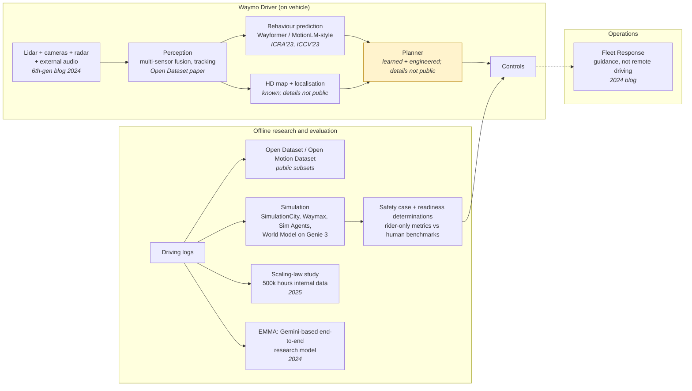

# Waymo

> **Why this matters at staff level.** Waymo runs the largest rider-only (no human in
> the driver's seat) robotaxi service that publishes its data, and it publishes more
> peer-reviewed ML than any other AV company: the Open Dataset, Wayformer, MotionLM,
> Waymax, EMMA, a scaling-law study, and a stream of safety papers with human
> benchmarks. Interviews there are graded on whether you can reason like their papers
> do: joint multi-agent futures, closed-loop evaluation, statistically honest safety
> claims, and the discipline of a safety case. Strong signal is naming the trade-off a
> Waymo paper made and what it measured.

## TL;DR: the interview card

- **The bet**: redundant sensing (lidar + cameras + radar + audio), a safety case,
  geo-fenced rider-only operation, and a relentless evaluation stack. Learned
  components everywhere, but behind evidence.
- **Perception**: multi-sensor fusion; the 6th-generation Driver carries 13 cameras,
  4 lidar, 6 radar and external audio receivers (Aug 2024 blog). The Open Dataset
  (arXiv:1912.04838) is their public shape of the perception problem.
- **Prediction lineage**: Wayformer (arXiv:2207.05844) encodes agents, road graph and
  traffic signals with attention and latent queries. MotionLM (arXiv:2309.16534) then
  discretises motion into tokens and decodes *joint* multi-agent futures
  autoregressively, with a plain next-token loss.
- **Simulation**: SimulationCity (2021), the open Waymax simulator (arXiv:2310.08710, JAX,
  built on the Open Motion Dataset), the Sim Agents challenge (arXiv:2305.12032), and a
  generative **Waymo World Model** built on Genie 3 (Feb 2026 blog).
- **End-to-end research**: **EMMA** (arXiv:2410.23262), a Gemini-based multimodal model
  that reads camera images and text and writes trajectories, objects and road graph as
  text; explicitly a research model with stated limitations (no lidar, few frames).
- **Scaling laws** (arXiv:2506.08228, June 2025 blog): motion forecasting and planning
  quality follows power laws in data, parameters and compute on internal driving data.
- **Safety**: the Safety Impact hub compares rider-only crash rates with human
  benchmarks; the peer-reviewed 56.7-million-mile comparison (Traffic Injury
  Prevention, 2025); the 2020 safety-methodologies paper; the Safety Case approach.
- **Ops**: Fleet Response gives *guidance*, not remote driving (May 2024 blog).

## 1. The business in one paragraph

Waymo, Alphabet's autonomous-driving subsidiary, operates a commercial rider-only
ride-hailing service in several U.S. metropolitan areas and licenses nothing to
consumers: the product is the trip. That changes the economics of every ML decision
relative to Tesla. Sensors can be expensive (a purpose-integrated lidar/camera/radar
suite), operations can be geo-fenced and mapped, and every mile driven is a mile the
company is liable for, so the evaluation and safety-case machinery is as much the
product as the driver. Waymo publishes unusually openly, through the Waymo Open
Dataset and its challenges, a research page, a safety hub with human benchmarks, and
papers at ICCV/NeurIPS/ICRA, so the interview material is largely primary.

## The ML problems that define the company

| Problem | Why it is hard | Public evidence |
|---|---|---|
| **Redundant multi-sensor perception at range** | Fusing lidar, camera and radar with different rates, resolutions and failure modes; long-range detection at highway speed; weather. | 6th-generation Driver blog (sensor counts and redundancy rationale); Waymo Open Dataset (arXiv:1912.04838). |
| **Joint prediction of interacting agents** | Marginal per-agent forecasts are inconsistent with each other; the planner needs joint futures with calibrated multimodality. | Wayformer (arXiv:2207.05844); MotionLM (arXiv:2309.16534); Open Motion Dataset (arXiv:2104.10133). |
| **Closed-loop evaluation before real miles** | Log replay is open-loop; reactive simulation needs realistic agents; rare events must be synthesised. | SimulationCity (2021); Waymax (arXiv:2310.08710); Sim Agents challenge (arXiv:2305.12032); Waymo World Model (2026). |
| **Statistically honest safety claims** | Serious crashes are rare; human benchmarks must be matched on geography and reporting thresholds. | Safety Impact hub; Traffic Injury Prevention paper (2025); Swiss Re collaboration (2023 blog); safety methodologies paper (2020). |
| **Whether end-to-end multimodal models belong in the loop** | Foundation models bring world knowledge but lack lidar, temporal depth and latency guarantees. | EMMA (arXiv:2410.23262); scaling-laws report (arXiv:2506.08228). |
| **Operating a rider-only fleet** | No driver to intervene; remote humans must help without becoming a latency-critical control loop. | Fleet Response blog (2024). |

## 2. The stack as publicly described

**Known versus inferred.** Sensor composition, the prediction papers, the simulators,
EMMA and the safety publications are primary. The on-vehicle planner is shaded: Waymo
has not published its production planner architecture; the scaling-law report says
learned planning is studied at scale, and the Fleet Response post says humans give
guidance rather than control, but how learned and engineered components share the
production planner is an inference.

## 3. Deep dives

### 3.1 Lidar-centric fusion and sensor redundancy

**The problem.** A rider-only vehicle cannot fall back on a human when a sensor is
blinded. Perception must degrade gracefully across modalities that fail differently
(cameras in glare and darkness, lidar in dense fog and spray, radar with poor angular
resolution), and it must detect at ranges that give the planner time at highway speed.

**The approach.** Waymo's public description of the 6th-generation Driver lists 13
cameras, 4 lidar, 6 radar and external audio receivers and frames the suite around
overlapping fields of view and redundancy across modalities. The Open Dataset paper
defines the perception problem the way the company thinks about it: synchronised
multi-lidar and multi-camera data with 3D and 2D labels, tracking IDs, and a
challenge suite that rewards range and rare classes. The fusion mathematics is the
subject of [Sensor fusion](../part11-perception-autonomy/03-sensor-fusion.md):
early fusion (project image features onto points or voxels), late fusion (per-sensor
detectors then association), and learned mid-level fusion (a shared BEV where lidar
gives geometry and cameras give semantics). Tracking across sensors and time is in
[Tracking](../part11-perception-autonomy/04-tracking.md).

**The trade-off.** Redundant sensing buys detection at range and graceful degradation,
at the cost of hardware expense, calibration and time-synchronisation burden, and a
labelling pipeline that must reconcile modalities. The rejected alternative, camera-only,
is the Tesla bet; Waymo's public rationale for redundancy is safety-case driven: a
claim of acceptable safety without a driver needs independent evidence paths.

**Sources.** "Meet the 6th-generation Waymo Driver" (Waymo blog, Aug 2024); Sun et al.,
"Scalability in Perception for Autonomous Driving: Waymo Open Dataset" (CVPR 2020,
arXiv:1912.04838).

!!! tip "How to say it in the interview"
    "For a rider-only vehicle I'd design perception around redundant modalities
    with independent failure modes, because there's no human fallback; Waymo's
    6th-generation Driver post lays out the same rationale with overlapping cameras,
    lidar, radar and audio. I'd fuse at the feature level into a shared
    bird's-eye-view grid, with lidar supplying geometry and cameras semantics, but I
    would keep a lidar-only detection path alive as an independent evidence source
    for the safety case. I'd rule out camera-only; it's the
    right bet for a consumer fleet with a driver, not for a driverless one. The
    trade-off is cost and calibration burden, so I'd invest in automatic
    calibration monitoring and time-sync checks as production alarms. I'd
    evaluate with the Open Dataset's conventions: 3D AP by range and class, tracking
    MOTA with identity switches, and a degraded-sensor slice where each modality is
    ablated at test time."

### 3.2 Prediction: from Wayformer to MotionLM (motion as language)

**The problem.** The planner needs the joint distribution over what *several* agents
will do next, including how they react to each other, with calibrated multimodality
(the pedestrian may or may not cross). Predicting each agent independently gives
futures that contradict each other.

**The approach, step one: Wayformer.** Nayakanti et al. build a scene encoder over
heterogeneous inputs (agent histories, road graph, traffic signals, interactions) with
attention, compare early, late and hierarchical fusion, and use *latent query
attention* to keep cost independent of the number of input elements; the decoder emits
$K$ trajectory modes as a Gaussian mixture. The loss is the mixture negative
log-likelihood, exactly as derived in
[Prediction & planning](../part11-perception-autonomy/06-prediction-planning.md):

$$
\mathcal{L} = -\log \sum_{k=1}^{K} \pi_k \prod_{t=1}^{T} \mathcal{N}\big(y_t \mid \mu_{k,t}, \Sigma_{k,t}\big),
$$

usually trained with a hard assignment to the closest mode for stability.

**Step two: MotionLM.** Seff et al. discretise each agent's motion into a small
vocabulary of motion tokens and cast multi-agent forecasting as language modelling:
a decoder-only transformer generates tokens for all agents jointly, interleaved in
time, trained with the standard next-token cross-entropy. This removes anchors and
latent-variable optimisation, yields *joint* futures in one decoding pass, and gives
temporally causal conditional rollouts (what does agent B do if agent A does X?).
Sampled rollouts are clustered to produce the $K$ modes the benchmarks score. The
paper reports state-of-the-art results on the Open Motion Dataset interactive
challenge. The tokenisation and decoding are the same machinery as
[Tokenization](../part05-sequence-transformers/06-tokenization.md) and
[Transformer architectures](../part05-sequence-transformers/04-transformer-architectures.md),
applied to continuous motion.

**The trade-off.** Tokenised joint decoding trades resolution (a discrete vocabulary)
and inference cost (autoregressive sampling of many rollouts) for consistency between
agents and a training objective that scales like language models do. The rejected
alternative, marginal per-agent mixtures plus post-hoc interaction heuristics, is
cheaper but produces inconsistent joint futures, which MotionLM's abstract names as the
motivation.

**Sources.** Nayakanti et al., "Wayformer" (ICRA 2023, arXiv:2207.05844); Seff et al.,
"MotionLM: Multi-Agent Motion Forecasting as Language Modeling" (ICCV 2023,
arXiv:2309.16534); Ettinger et al., "Large Scale Interactive Motion Forecasting for
Autonomous Driving: The Waymo Open Motion Dataset" (ICCV 2021, arXiv:2104.10133).

!!! tip "How to say it in the interview"
    "I'd model prediction as joint, autoregressive generation over discrete
    motion tokens for all agents, the design in Waymo's MotionLM paper (ICCV 2023),
    because the planner needs futures that are consistent between agents and because
    a plain next-token loss scales without anchors or latent-variable tricks. I'd
    keep a Wayformer-style scene encoder underneath, with latent queries so cost does
    not grow with the number of map and agent elements, which is what that paper
    (ICRA 2023) shows. The alternative I'd reject as the primary model is
    per-agent Gaussian mixtures with interaction heuristics on top; MotionLM's own
    motivation is that those give inconsistent joint futures. The cost is
    inference cost, since I'd need many sampled rollouts, so I'd cache the
    encoder and batch rollouts, and I'd distil to a cheaper marginal head for
    latency-critical paths. I'd evaluate with the Open Motion Dataset interactive
    metrics, minADE, miss rate and the joint mAP, and with a calibration check on mode
    probabilities, because a planner that trusts an over-confident mode is worse
    than one with a wider distribution."

### 3.3 Simulation and closed-loop evaluation: SimulationCity, Waymax, Sim Agents, the World Model

**The problem.** Log replay is open-loop: the recorded agents do not react to a new
planner, so it cannot measure compounding error. Real miles are slow, expensive and
cannot be re-run. Rare events must be generated, not waited for.

**The approach.** SimulationCity (2021 blog) describes synthesising entire trips,
including sensor-level realism, from real-world data. Waymax (NeurIPS 2023 datasets
track) is a public, hardware-accelerated JAX simulator built on the Open Motion
Dataset in which the ego and other agents can be replayed or controlled by learned
policies, with metrics such as collisions and off-road, so that imitation and
reinforcement learning can be run closed-loop. The Sim Agents challenge (2023) defines
how to score the *realism* of learned traffic agents, by comparing distributions of
kinematic and interaction statistics rather than trajectory error. In February 2026
Waymo described a generative Waymo World Model built on Google DeepMind's Genie 3 for
simulation, with the stated purpose of generating realistic, controllable scenarios
including rare ones. Block-NeRF (CVPR 2022, arXiv:2202.05263), a Waymo research paper
on city-scale neural rendering, is the earlier public hint of neural sensor
simulation. The conceptual material is in
[World models](../part11-perception-autonomy/07-world-models.md) and, for RL in a
simulator, [Deep RL](../part12-rl/03-deep-rl-dqn.md) and
[Policy gradients & PPO](../part12-rl/04-policy-gradients-ppo.md).

**The trade-off.** Closed-loop simulation buys reactivity and rare-event coverage at
the cost of a sim-to-real gap in two places: agent behaviour (are the sim agents
human-like?) and sensors (does the rendered scene fool perception the way the real
one would?). Waymo's public answer is to measure both: realism metrics for agents
(Sim Agents), and neural rendering from real logs for sensors. The rejected
alternative is relying on log replay plus real miles, which cannot scale to rare
interactive events.

**Sources.** "Simulation City: introducing Waymo's most advanced simulation system yet"
(Waymo blog, 2021); Gulino et al., "Waymax: An Accelerated, Data-Driven Simulator for
Large-Scale Autonomous Driving Research" (NeurIPS 2023, arXiv:2310.08710; code on
GitHub); Montali et al., "The Waymo Open Sim Agents Challenge" (arXiv:2305.12032);
"The Waymo World Model: A New Frontier for Autonomous Driving Simulation" (Waymo blog,
Feb 2026); Tancik et al., "Block-NeRF" (CVPR 2022, arXiv:2202.05263).

!!! tip "How to say it in the interview"
    "I'd build evaluation in three tiers and make closed-loop simulation the
    middle one: log replay for cheap regression, a reactive simulator for compounding
    behaviour, and real rider-only miles as the final evidence. Waymo's Waymax paper
    (NeurIPS 2023) is the pattern I'd follow for the simulator, a data-driven
    environment built from logged scenarios where other agents can be replayed or
    controlled by learned policies, and the Sim Agents challenge is how I'd score
    those agents, by distributional realism rather than trajectory error. The
    alternative I'd reject is replay-only evaluation; it can't see that a new
    planner changes what other agents do. What this costs is the sim-to-real gap, and I
    would attack it on both sides: realism metrics for agents and neural rendering
    from real logs for sensors, the direction of SimulationCity and the 2026 World
    Model post. I'd validate the simulator itself by checking that its ranking
    of candidate planners agrees with shadow-mode and real-mile outcomes on the same
    scenario slices."

### 3.4 EMMA and scaling laws: does the foundation-model recipe apply to driving?

**The problem.** Modular stacks are interpretable but every interface is a
hand-designed bottleneck; foundation models carry world knowledge and scale with
data, but do they help driving, and what do they cost?

**The approach.** EMMA (Hwang et al., 2024) fine-tunes Gemini to map camera images and
text (ego history, routing command) to text outputs: future waypoints, 3D object
boxes, road-graph elements, and a chain-of-thought driving rationale; representing
everything as text lets one model be co-trained across tasks, and the paper reports
that co-training improves the individual tasks and that the model is competitive on
public planning and detection benchmarks. The paper is equally explicit about
limitations: no lidar or radar, a small number of image frames, high compute, and a
statement that it is research, not the production driver. The scaling-law report
(Baniodeh et al., 2025; blog "New Insights for Scaling Laws in Autonomous Driving")
trains motion-forecasting and planning models on about 500,000 hours of internal
driving data and reports power-law improvements in loss with data, parameters and
compute, with the improvement carrying to closed-loop planning metrics. The general
scaling machinery (compute-optimal allocation, power-law fits) is derived in
[Scaling laws](../part06-llm-training/02-scaling-laws.md); the VLM architecture is in
[VLM architecture](../part08-multimodal/04-vlm-architecture.md).

**The trade-off.** A single multimodal model buys transfer, co-training gains, and
the ability to reason in language about rare scenes; it gives up sensor completeness,
latency guarantees and auditable intermediate outputs. Waymo's public stance is to
publish it as research and to state the gaps, which is itself the answer to "would
you deploy it?".

**Sources.** Hwang et al., "EMMA: End-to-End Multimodal Model for Autonomous Driving"
(arXiv:2410.23262; blog "Introducing EMMA", Oct 2024; research page); Baniodeh et al.,
"Scaling Laws of Motion Forecasting and Planning, A Technical Report" (arXiv:2506.08228;
blog, June 2025).

!!! tip "How to say it in the interview"
    "I'd use a multimodal foundation model where it earns its place, as an
    offline teacher and a long-tail reasoner, and I'd not put it in the
    latency-critical loop without the missing modalities. Waymo's EMMA paper (2024)
    is my evidence for both halves: co-training trajectories, objects and road graph
    as text improves each task, and the same paper states that it lacks lidar and
    radar, uses few frames and is compute-heavy, so it's research rather than the
    production driver. I'd justify investing in scale with Waymo's 2025 scaling-law
    report, which shows power-law gains in forecasting and planning on half a million
    hours of driving that carry into closed-loop metrics. The alternative I'd
    reject is a modular stack frozen at today's interfaces; the scaling result says
    learned components keep improving. The price is auditability, so I'd
    distil the large model into a smaller onboard model and keep independent safety
    checks. I'd evaluate on closed-loop planning metrics in Waymax-style
    simulation, on a rare-scenario slice where language reasoning should help, and on
    latency at the onboard budget."

### 3.5 The safety framework and rider-only metrics

**The problem.** "Safer than a human" is a statistical claim about rare events with
mismatched denominators: human crash statistics are under-reported, differ by
geography and road type, and use different injury thresholds.

**The approach.** Waymo's public safety methodology paper (2020) describes layered
methods, hardware, behavioural, and operational, and how readiness determinations are
made; the Safety Case approach document frames the argument as claims backed by
evidence. The Safety Impact hub publishes rider-only miles and crash rates against
human benchmarks matched to the same geographies and adjusted for under-reporting,
across outcomes such as any-injury-reported and serious-injury-or-worse; the
peer-reviewed comparison by crash type at 56.7 million rider-only miles (Kusano,
Scanlon et al., Traffic Injury Prevention, 2025) is the reference paper. The
collaboration with the reinsurer Swiss Re (2023 blog) compares liability claims, an
independent data source. In late 2025 Waymo also published on third-party audits and
on a framework for building safety into an AI-driven stack ("Demonstrably Safe AI for
Autonomous Driving"). The statistics you need, rate estimation for rare events,
confidence intervals for ratios, and the exposure-matching logic, are in
[Statistics](../part01-math/04-statistics.md) and
[Uncertainty & reliability](../part13-retrieval-eval-reliability/03-uncertainty-reliability.md).

**The trade-off.** A safety case constrains how fast you can ship (every change needs
evidence), which is the price of a driverless claim. The rejected alternative, a
single aggregate crash-rate comparison without matching, is what the Tesla Vehicle
Safety Report does; the Waymo papers exist because that comparison is confounded.

**Sources.** Waymo Safety page; Safety Impact hub; "Waymo's Safety Methodologies and
Safety Readiness Determinations" (2020); "Waymo Safety Case Approach" (white paper);
Kusano et al., Traffic Injury Prevention (2025); "Waymo's autonomous vehicles are
significantly safer than human-driven ones, says new research led by Swiss Re"
(Waymo blog, 2023); Safety Data Hub launch (2024); independent audits (2025).

!!! tip "How to say it in the interview"
    "I'd make the safety claim as a matched-rate comparison with confidence
    intervals, by crash type and injury severity, against human benchmarks from the
    same geographies and adjusted for under-reporting, which is the design of Waymo's
    peer-reviewed comparison at 56.7 million rider-only miles (Traffic Injury
    Prevention, 2025) and of its Safety Impact hub. I'd reject a single
    fleet-wide crashes-per-mile ratio, because exposure differs by road type and the
    denominators aren't comparable. I'd add an independent data source, as
    Waymo did with Swiss Re's liability claims, because self-reported crash data
    invites doubt. The trade-off is release speed: a safety case demands evidence
    for every change, so I'd tie the evidence to scenario slices in simulation
    and to rider-only outcomes. I'd report power explicitly: for serious injuries
    at the rates involved, the confidence interval at tens of millions of miles is
    wide, and I'd say so rather than over-claim."

### 3.6 Operating a rider-only fleet: Fleet Response

**The problem.** With no driver, the vehicle sometimes reaches a situation it cannot
resolve alone (an ambiguous closure, a confusing scene). A remote human must help
without becoming a low-latency control loop that the safety case would then have to
cover.

**The approach.** Waymo's Fleet Response post (May 2024) describes remote humans who
provide guidance, such as confirming an interpretation or suggesting a path, while
the vehicle remains responsible for driving and for safety; it explicitly contrasts
this with remote driving. The ML consequence is that the *request* itself is a
classifier problem (when to ask, at what confidence) and a data-engine signal (every
request marks a scene the model found hard). See [Uncertainty & reliability](../part13-retrieval-eval-reliability/03-uncertainty-reliability.md)
for calibration and abstention.

!!! tip "How to say it in the interview"
    "I'd design remote assistance as guidance rather than control, exactly the
    distinction Waymo's Fleet Response post draws, because a remote-driving loop
    would put network latency inside the safety case. The trigger for asking would
    be a calibrated uncertainty signal from the planner with a hard time budget,
    and every request would be logged as a hard-scene example for training. The
    alternative I'd reject is teleoperation. I'd measure requests per
    thousand miles, time-to-resolution, and the share of requests that later became
    autonomous decisions after retraining."

## 4. Likely interview questions

!!! interview "Q1. Design perception for a rider-only robotaxi with lidar, cameras and radar. Where do you fuse, and how do you prove redundancy?"
    **Answer sketch.** Requirements: range, classes, weather, failure independence.
    Mid-level fusion in a shared BEV (lidar geometry, camera semantics, radar velocity);
    a lidar-only fallback detector as an independent evidence path; tracking with
    per-modality health signals; calibration and time-sync monitoring; evaluation by
    range/class/weather and by single-modality ablation. Links:
    [Sensor fusion](../part11-perception-autonomy/03-sensor-fusion.md), [AV perception design](../part17-ml-system-design/05-perception-system-av.md).

    !!! tip "How to say it in the interview"
        "I'd fuse at the feature level into a shared BEV and keep an
        independent lidar-only path, because the 6th-generation Driver post frames
        the suite around redundancy and a safety case needs independent evidence. I
        would reject late fusion of per-sensor boxes as the primary route; it
        discards complementary evidence before the decision. The cost is
        calibration burden, which I'd monitor in production. I'd evaluate
        with Open Dataset-style 3D AP by range and class and an ablation slice per
        modality, so I can quantify what each sensor buys."

!!! interview "Q2. Marginal versus joint prediction: when does the difference matter and how would you build the joint model?"
    **Answer sketch.** It matters whenever agents interact (merges, unprotected
    turns, pedestrians and yielding cars). Joint model: shared scene encoder,
    tokenised motion, autoregressive interleaved decoding (MotionLM), sampled
    rollouts clustered into modes; cost mitigations. Evaluate with interactive
    metrics and calibration. Link: [Prediction & planning](../part11-perception-autonomy/06-prediction-planning.md).

    !!! tip "How to say it in the interview"
        "I'd go joint for interacting agents and marginal for the rest, and I
        would build the joint model as MotionLM does: motion tokens, one autoregressive
        decoder over all agents, a plain next-token loss. The rejected alternative is
        marginal mixtures with interaction heuristics, which the MotionLM paper
        identifies as producing inconsistent futures. Joint decoding costs rollouts;
        I'd batch and cache. I'd evaluate on the Open Motion Dataset
        interactive split with joint metrics and a calibration check."

!!! interview "Q3. Explain how you would tokenise continuous motion and what you lose."
    **Answer sketch.** Quantise per-step deltas (or accelerations) into a small
    vocabulary per axis at a fixed rate; losses: resolution and smoothness (mitigate
    with finer vocab or a continuous refinement head); gains: cross-entropy training,
    sampling, conditional rollouts. Compare with Gaussian-mixture heads.

    !!! tip "How to say it in the interview"
        "I'd quantise per-step motion deltas into a small vocabulary at a fixed
        rate, as MotionLM does, because it turns forecasting into next-token
        prediction with sampling and conditioning for free. I'd name the loss:
        resolution and smoothness, which I'd recover with a finer vocabulary or a
        continuous refinement head. The alternative is a Gaussian-mixture decoder,
        which is smoother but needs anchors or latent-variable tricks for
        multimodality. I'd evaluate minADE at the vocabulary's resolution limit
        to make sure quantisation isn't the bottleneck."

!!! interview "Q4. Design the closed-loop evaluation system for a planner change."
    **Answer sketch.** Scenario bank mined from logs and synthesised; reactive sim
    agents scored for realism; metrics (collision, off-road, progress, comfort,
    constraint violations); statistical comparison against the incumbent with
    paired scenarios; escalation to shadow mode and rider-only miles; a correlation
    check that sim rankings predict real outcomes. Link: [Evaluation](../part13-retrieval-eval-reliability/02-evaluation.md).

    !!! tip "How to say it in the interview"
        "I'd run every planner change through paired closed-loop scenarios in a
        Waymax-style simulator with sim agents validated by Sim Agents-style realism
        metrics, then shadow mode, then rider-only miles. I'd reject replay as the
        gate. The price is the sim-to-real gap; I'd measure it by whether the
        simulator's ranking of candidates matches real outcomes on shared scenario
        slices, and I'd treat a disagreement as a simulator bug to fix before
        trusting the next result."

!!! interview "Q5. How do you measure whether learned sim agents are realistic enough?"
    **Answer sketch.** Distributional metrics over kinematics (speed, acceleration,
    heading change), interactions (time-to-collision, distance to nearest agent), and
    map compliance, compared with logged agents; not trajectory error, because many
    futures are valid. Adversarial checks: does the planner exploit sim-agent
    weaknesses? Link: [World models](../part11-perception-autonomy/07-world-models.md).

    !!! tip "How to say it in the interview"
        "I'd score sim agents by distributional realism, kinematics,
        interaction statistics and map compliance against logged behaviour, which is
        the framing of the Waymo Open Sim Agents Challenge, rather than by trajectory
        error, since many futures are valid. I'd add an exploitation check: if a
        planner's sim score improves while its shadow-mode disagreement worsens, the
        agents are exploitable."

!!! interview "Q6. Would you deploy an EMMA-style model on the vehicle? Defend your answer."
    **Answer sketch.** Not as the primary driver today: the paper states no lidar,
    few frames, high compute. Use it as an offline teacher, a long-tail reasoner, a
    labeller, and a source of distilled onboard models; revisit as latency and
    sensor coverage improve. Link: [VLM architecture](../part08-multimodal/04-vlm-architecture.md).

    !!! tip "How to say it in the interview"
        "Not in the latency-critical loop, and I'd use Waymo's own EMMA paper as
        the reason: it lacks lidar and radar, uses few frames and is compute-heavy,
        and the authors present it as research. I'd deploy it offline as a
        teacher and labeller and distil onboard. The trade-off is the loss of
        language-level reasoning at runtime, which I'd partially recover by
        distilling rationales into the onboard model's auxiliary targets. I'd
        evaluate on the rare-scenario slice where the paper's co-training gains
        showed up."

!!! interview "Q7. Waymo published scaling laws for prediction and planning. How would you use them to plan a training budget?"
    **Answer sketch.** Fit power laws on small runs; allocate compute-optimally
    between parameters and data; check that the open-loop improvement transfers to
    closed-loop; watch for the irreducible-loss floor from genuine uncertainty. Link:
    [Scaling laws](../part06-llm-training/02-scaling-laws.md).

    !!! tip "How to say it in the interview"
        "I'd run a sweep of small models to fit power laws, then allocate
        compute between parameters and data along the fitted frontier, and I'd
        only trust the plan if closed-loop metrics track the open-loop loss, which is
        the check Waymo's 2025 report makes. The alternative, scaling one model until
        the budget runs out, wastes compute on the wrong axis. I'd report the
        irreducible-loss estimate, because part of driving is genuinely uncertain and
        no model closes it."

!!! interview "Q8. You have 60 million rider-only miles. How many serious-injury crashes do you need to claim a 50% reduction with confidence?"
    **Answer sketch.** Model counts as Poisson; a ratio of rates with a confidence
    interval; power depends on the *expected human count* at that exposure; show the
    calculation and the sensitivity to under-reporting corrections; conclude that
    claims about rarer outcomes need far more miles. Link: [Statistics](../part01-math/04-statistics.md).

    !!! tip "How to say it in the interview"
        "I'd model crashes as Poisson counts, form the rate ratio against a
        matched human benchmark, and compute the interval; the width is set by the
        expected human count at that exposure, not by the AV count. That is why
        Waymo's peer-reviewed comparison reports by crash type and severity with
        intervals. I'd be explicit that for the rarest outcomes the interval
        remains wide at tens of millions of miles, and I'd not claim more than
        the data supports."

!!! interview "Q9. Design the data engine for a fleet with no driver interventions."
    **Answer sketch.** Without disengagements, signals come from Fleet Response
    requests, planner uncertainty, hard-brake and near-miss detectors, sim-agent
    disagreement, and perception self-consistency; mine logs offline with large
    models; synthesise rare cases; keep human review on the disagreement slice.
    Link: [Weak supervision & auto-labelling](../part10-self-supervised/03-weak-supervision-and-auto-labeling.md).

    !!! tip "How to say it in the interview"
        "With no driver, I'd treat Fleet Response requests, calibrated planner
        uncertainty and near-miss detectors as the trigger signals, since Waymo's
        Fleet Response post shows those requests mark exactly the scenes the driver
        found hard. I'd mine logs offline with large models and synthesise rare
        cases in simulation. The alternative, waiting for real crashes, is
        unacceptable and statistically hopeless. I'd measure the engine by the
        drop in requests per mile on the scenarios it targeted."

!!! interview "Q10. Waymo relies on HD maps. How do you detect that the map is wrong, and what does the driver do?"
    **Answer sketch.** Online map inference from perception (lane and boundary
    heads) compared with the prior map; a change-detection classifier with
    conservative behaviour on disagreement; fleet-level aggregation to update the
    map; evaluation with injected changes. Mark that Waymo's mapping internals are
    not public. Link: [Multi-camera & BEV](../part11-perception-autonomy/02-multi-camera-bev.md).

    !!! tip "How to say it in the interview"
        "I'd run online map inference from perception and compare it with the
        prior, treating disagreement as a change-detection problem with conservative
        fallback behaviour, and aggregate confirmed changes across the fleet. I'd
        say that Waymo's mapping internals aren't public, so this is my design, not
        theirs. The cost is false alarms causing over-cautious driving, so I'd
        tune the detector on injected changes and measure both miss rate and
        comfort impact."

!!! interview "Q11. Coding: implement multi-object tracking association with a Kalman filter and the Hungarian algorithm."
    **Answer sketch.** Constant-velocity Kalman state per track $[x,y,v_x,v_y]$;
    predict; cost matrix from Mahalanobis or IoU distance; Hungarian assignment
    with gating; birth/death logic; shapes on every tensor; test on a synthetic
    scene with crossings. Reference: [Tracking](../part11-perception-autonomy/04-tracking.md).

    !!! tip "How to say it in the interview"
        "I'd write the predict step, a gated cost matrix, and Hungarian
        assignment, then the track lifecycle, and I'd test on two crossing
        objects, which is where identity switches happen. The rejected shortcut is
        greedy nearest-neighbour matching; it fails at crossings. I'd evaluate
        with MOTA and identity switches, the Open Dataset tracking conventions."

!!! interview "Q12. Weather: lidar in heavy rain and cameras at night. How does the stack degrade and how do you validate it?"
    **Answer sketch.** Per-modality confidence; fusion weights conditioned on
    health; operational design domain limits enforced by a classifier; validation by
    weather-sliced metrics and by collected adverse-weather datasets; the 6th-gen
    blog states the new sensor suite targets more weather.

    !!! tip "How to say it in the interview"
        "I'd make degradation explicit: per-modality health estimates feed the
        fusion and an operational-domain classifier that can pause service, because a
        rider-only vehicle must know when it's outside its envelope. Waymo's
        6th-generation post states the suite was designed for more weather, so I
        would validate on weather-sliced metrics and modality ablations. The
        trade-off is availability versus risk, and I'd report both."

!!! interview "Q13. What would you take from Waymo's publications into a perception team elsewhere?"
    **Answer sketch.** The evaluation culture: public datasets with range-binned
    metrics, closed-loop simulators with realism scoring, statistically matched
    safety claims, and publishing limitations alongside results (EMMA). Also the
    prediction lineage as evidence that language-model machinery transfers to
    continuous domains.

    !!! tip "How to say it in the interview"
        "The evaluation discipline: Waymo's papers ship with the metric that would
        expose their weakness, EMMA lists its limitations, the safety papers report
        intervals, and Waymax makes closed-loop testing a public artefact. I'd
        bring that culture before any architecture."

## 5. What to bring from your background

* **Detection and tracking at scale** map directly onto the perception and Open
  Dataset conventions; be fluent in range-binned AP, MOTA and identity switches, and
  in how label noise and class imbalance show up in those numbers.
* **Sensor-fusion and calibration** experience (even camera-only multi-view) is the
  bridge to lidar-centric fusion; be ready to derive where each modality's error
  enters BEV.
* **Statistical rigour**: Waymo's safety work is the most statistically careful in
  the industry; bring experience designing matched comparisons, confidence intervals
  for rare-event rates, and A/B tests with correct units.
* **ML-systems experience** in evaluation infrastructure (scenario banks, regression
  gates, simulators) is valued as highly as modelling; Waymo publishes simulators, so
  they hire for people who build them.
* **OCR / document-understanding** experience translates to the *sequence-decoding*
  view of driving (lanes, tokens, EMMA's text outputs): you know how to train and
  evaluate autoregressive structured outputs.

## 6. Sources

**Papers**

* Sun et al., "Scalability in Perception for Autonomous Driving: Waymo Open Dataset" (CVPR 2020). [arXiv:1912.04838](https://arxiv.org/abs/1912.04838); dataset at [waymo.com/open](https://waymo.com/open/)
* Ettinger et al., "Large Scale Interactive Motion Forecasting for Autonomous Driving: The Waymo Open Motion Dataset" (ICCV 2021). [arXiv:2104.10133](https://arxiv.org/abs/2104.10133)
* Nayakanti et al., "Wayformer: Motion Forecasting via Simple & Efficient Attention Networks" (ICRA 2023). [arXiv:2207.05844](https://arxiv.org/abs/2207.05844)
* Seff et al., "MotionLM: Multi-Agent Motion Forecasting as Language Modeling" (ICCV 2023). [arXiv:2309.16534](https://arxiv.org/abs/2309.16534)
* Gulino et al., "Waymax: An Accelerated, Data-Driven Simulator for Large-Scale Autonomous Driving Research" (NeurIPS 2023). [arXiv:2310.08710](https://arxiv.org/abs/2310.08710), [github.com/waymo-research/waymax](https://github.com/waymo-research/waymax)
* Montali et al., "The Waymo Open Sim Agents Challenge" (2023). [arXiv:2305.12032](https://arxiv.org/abs/2305.12032)
* Hwang et al., "EMMA: End-to-End Multimodal Model for Autonomous Driving" (2024). [arXiv:2410.23262](https://arxiv.org/abs/2410.23262), [research page](https://waymo.com/research/emma/)
* Baniodeh et al., "Scaling Laws of Motion Forecasting and Planning. A Technical Report" (2025). [arXiv:2506.08228](https://arxiv.org/abs/2506.08228)
* "WOD-E2E: Waymo Open Dataset for End-to-End Driving in Challenging Long-tail Scenarios" (2025). [arXiv:2510.26125](https://arxiv.org/abs/2510.26125)
* Tancik et al., "Block-NeRF: Scalable Large Scene Neural View Synthesis" (CVPR 2022). [arXiv:2202.05263](https://arxiv.org/abs/2202.05263)
* Kusano, Scanlon et al., "Comparison of Waymo Rider-Only Crash Rates by Crash Type to Human Benchmarks at 56.7 Million Miles", *Traffic Injury Prevention* (2025). [doi:10.1080/15389588.2025.2499887](https://www.tandfonline.com/doi/full/10.1080/15389588.2025.2499887)

**Blog posts and company documents**

* "Meet the 6th-generation Waymo Driver" (Aug 2024). [waymo.com/blog/2024/08/meet-the-6th-generation-waymo-driver/](https://waymo.com/blog/2024/08/meet-the-6th-generation-waymo-driver/)
* "Introducing EMMA" (Oct 2024). [waymo.com/blog/2024/10/introducing-emma/](https://waymo.com/blog/2024/10/introducing-emma/)
* "New Insights for Scaling Laws in Autonomous Driving" (June 2025). [waymo.com/blog/2025/06/scaling-laws-in-autonomous-driving/](https://waymo.com/blog/2025/06/scaling-laws-in-autonomous-driving/)
* "Simulation City" (2021). [waymo.com/blog/2021/07/simulation-city/](https://waymo.com/blog/2021/07/simulation-city/)
* "Waymo advances AI research with our multifunctional Waymax simulator" (Oct 2023). [waymo.com/blog/2023/10/…waymax-simulator](https://waymo.com/blog/2023/10/waymo-advances-ai-research-with-our-multifunctional-waymax-simulator)
* "The Waymo World Model: A New Frontier for Autonomous Driving Simulation" (Feb 2026). [waymo.com/blog/2026/02/…](https://waymo.com/blog/2026/02/the-waymo-world-model-a-new-frontier-for-autonomous-driving-simulation/); Google DeepMind, "Genie 3: A new frontier for world models" (Aug 2025). [deepmind.google/blog/genie-3-a-new-frontier-for-world-models/](https://deepmind.google/blog/genie-3-a-new-frontier-for-world-models/)
* "Fleet Response" (May 2024). [waymo.com/blog/2024/05/fleet-response/](https://waymo.com/blog/2024/05/fleet-response/)
* Waymo Safety. [waymo.com/safety/](https://waymo.com/safety/); Safety Impact hub. [waymo.com/safety/impact/](https://waymo.com/safety/impact/); Safety Data Hub launch (Sept 2024). [waymo.com/blog/2024/09/safety-data-hub/](https://waymo.com/blog/2024/09/safety-data-hub/)
* "Waymo's Safety Methodologies and Safety Readiness Determinations" (2020). [waymo.com/research/waymos-safety-methodologies-and-safety-readiness/](https://waymo.com/research/waymos-safety-methodologies-and-safety-readiness/)
* "Waymo Safety Case Approach" (white paper). [PDF](https://assets.ctfassets.net/e6t5diu0txbw/66jOjPtNIjzawaK0ZjpU3q/7f081b392cf29a3355c97d0d758fe6cf/Waymo_Safety_Case_Approach.pdf)
* "Waymo's autonomous vehicles are significantly safer than human-driven ones, says new research led by Swiss Re" (Sept 2023). [waymo.com/blog/2023/09/…](https://waymo.com/blog/2023/09/waymos-autonomous-vehicles-are-significantly-safer-than-human-driven-ones/)
* "Demonstrably Safe AI for Autonomous Driving" (Dec 2025). [waymo.com/blog/2025/12/demonstrably-safe-ai-for-autonomous-driving/](https://waymo.com/blog/2025/12/demonstrably-safe-ai-for-autonomous-driving/)
* Independent audits (Nov 2025). [waymo.com/blog/2025/11/independent-audits/](https://waymo.com/blog/2025/11/independent-audits/)
