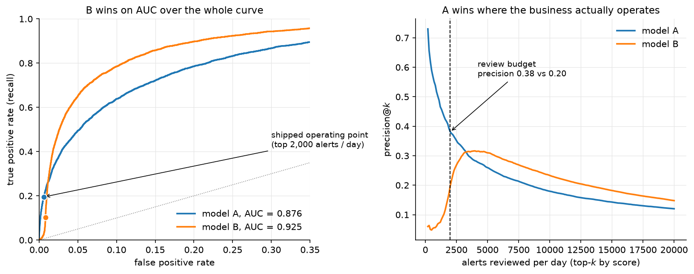
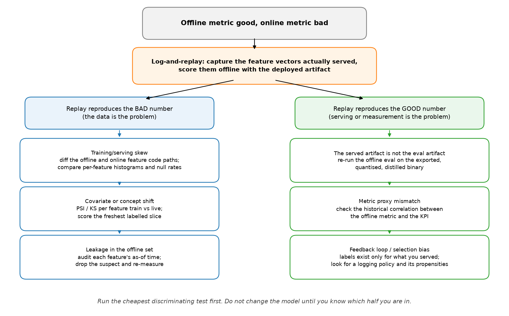

# Evaluation and debugging

> **Why this matters at staff level.** This is where the level distinction is made.
> Anyone can recite a definition of precision; what interviewers are buying is someone
> who can be handed a broken production system and narrow the cause in ten minutes
> without thrashing. Treat every debugging question here as a decision tree you run
> live: name the hypothesis classes, pick the cheapest test that splits them, and say
> out loud that you will not touch the model until you know which branch you are in.

## The questions

| # | Question | Taught properly in |
|---|---|---|
| 1 | [How to split a dataset, and what CV estimates](#q1) | [Evaluation](../part13-retrieval-eval-reliability/02-evaluation.md) |
| 2 | [When k-fold CV is optimistically biased](#q2) | [Evaluation](../part13-retrieval-eval-reliability/02-evaluation.md) |
| 3 | [AUC improves, the business KPI degrades](#q3) | [Evaluation](../part13-retrieval-eval-reliability/02-evaluation.md) |
| 4 | [Calibration: what it is, how to test it, how to fix it](#q4) | [Uncertainty and reliability](../part13-retrieval-eval-reliability/03-uncertainty-reliability.md) |
| 5 | [Symmetric vs asymmetric label noise](#q5) | [Evaluation](../part13-retrieval-eval-reliability/02-evaluation.md) |
| 6 | [Missing data](#q6) | [Probabilistic models and EM](../part02-classical/05-probabilistic-models-em.md) |
| 7 | [Class imbalance](#q7) | [Evaluation](../part13-retrieval-eval-reliability/02-evaluation.md) |
| 8 | [Detecting data leakage](#q8) | [The system-design framework](../part17-ml-system-design/00-framework.md) |
| 9 | [Debug: good offline, bad online](#q9) | [The system-design framework](../part17-ml-system-design/00-framework.md) |
| 10 | [Debug: loss falls, accuracy flat](#q10) | [Evaluation](../part13-retrieval-eval-reliability/02-evaluation.md) |
| 11 | [Debug: NaNs and Infs in training](#q11) | [Training systems](../part14-systems/02-training-systems.md) |
| 12 | [Distribution shift in a deployed system](#q12) | [Uncertainty and reliability](../part13-retrieval-eval-reliability/03-uncertainty-reliability.md) |
| 13 | [Feature and model selection](#q13) | [Evaluation](../part13-retrieval-eval-reliability/02-evaluation.md) |
| 14 | [Reproducibility](#q14) | [Training systems](../part14-systems/02-training-systems.md) |

---

### 1. How to split a dataset, and what CV estimates {#q1}

??? question "Q: How should you split a dataset, and how does cross-validation connect to bias and variance?"
    **The answer.** The split exists to produce an unbiased estimate of generalisation
    error on data the model never touched. Train fits parameters, validation tunes
    hyperparameters and selects models, test is touched **once** at the end. The
    cardinal sin is letting test influence any decision: every peek-and-adjust
    converts test into validation and makes the final number optimistic by an amount
    you cannot measure.

    **K-fold cross-validation** averages performance over $K$ partitions so every
    point serves as validation once. The bias and variance of interest here belong to
    the **estimator**, not to the model:

    * **Small $K$** (2 or 3): each model trains on little data, so it is weaker than
      the model you will actually ship, and CV **overestimates error**. The folds
      overlap less, so the estimate has lower variance.
    * **Large $K$, up to leave-one-out**: each model trains on nearly all the data, so
      the estimate is nearly unbiased, but the $n$ models are fit on near-identical
      data, their errors are highly correlated, and the variance of the estimate is
      high. It is also $n$ times the compute.
    * **$K = 5$ or $10$** is the usual operating point on that trade-off curve.

    !!! interview "Staff move"
        Separate two variances that interviewers routinely conflate: the bias and
        variance **of the model** against the bias and variance **of the CV estimate
        of its error**. "Cross-validation is estimating a number. That number has its
        own bias and variance, which is a statement about how much I should trust it,
        and it is a different question from whether the model itself is
        high-variance." Then add the practical consequence: a 0.2-point difference
        between two CV means is not a result until you have bootstrapped the
        difference and looked at its interval.

    **Goes deeper:** [evaluation](../part13-retrieval-eval-reliability/02-evaluation.md).

### 2. When k-fold CV is optimistically biased {#q2}

??? question "Q: Describe a scenario where k-fold CV is optimistically biased even when the implementation is correct."
    **The answer.** Four distinct causes, and the first is the one that bites hardest.

    1. **Dependent samples split randomly.** Time series, grouped rows,
       near-duplicates. Consecutive video frames, several records per user, augmented
       copies of one image: if correlated rows straddle the boundary, the model has
       effectively seen the test data. CV looks excellent and production fails. *Fix:*
       grouped or blocked CV, splitting on the unit of independence (clip, user,
       patient, session), or forward-chaining for time series.
    2. **Preprocessing fit on the full dataset before CV.** A scaler, an imputer, a
       feature selector, or worst of all a supervised target encoding fit on all the
       data leaks test statistics into every fold. *Fix:* refit the entire pipeline
       inside each fold.
    3. **Selecting hyperparameters on the CV you then report.** If you pick the best
       configuration by CV score and report that score, you have reported the maximum
       of a noisy quantity, which is biased upward by the selection itself. *Fix:*
       nested CV, an inner loop to tune and an outer loop to estimate.
    4. **Class imbalance with non-stratified folds**, which inflates variance and can
       bias the estimate depending on the metric. *Fix:* stratified K-fold.

    !!! interview "Staff move"
        Give the general principle plus one war story. "Cross-validation is honest
        only when the train-test boundary respects the same independence structure as
        the train-deployment boundary. In perception, random frame splits give
        beautiful offline numbers and the model dies on a new scene, so the first
        question I ask about any dataset is: what is the unit of independence here? I
        split on that, and I check for near-duplicates across the split with an
        embedding nearest-neighbour pass before I trust any number."

    **Goes deeper:** [evaluation](../part13-retrieval-eval-reliability/02-evaluation.md).

### 3. AUC improves, the business KPI degrades {#q3}

??? question "Q: What is AUC, and describe a scenario where AUC improves but the business KPI gets worse."
    **The answer.** ROC-AUC is the probability that the model ranks a random positive
    above a random negative: a threshold-independent, rank-based measure of
    discrimination, invariant to class balance and to where you set the threshold.
    Exactly those invariances are how it rises while the business loses.

    1. **AUC is a global ranking; the business lives at one operating point.** AUC can
       improve by fixing the ordering in a region you never operate in, such as
       correctly sorting very-low-probability negatives, while degrading near your
       actual threshold. A model with higher AUC can have worse precision at the
       recall you ship at.
    2. **Imbalance plus the wrong metric.** At a 0.1% positive rate, true negatives
       dominate the false positive rate, so ROC-AUC looks high and moves little.
       PR-AUC is the honest summary under heavy imbalance, because its baseline is the
       positive rate and it responds when false positives flood the queue.
    3. **Asymmetric costs.** If a false negative costs 100 times a false positive, a
       ranking metric that treats errors symmetrically cannot see a reshuffle toward
       the expensive kind.
    4. **Ranking is not calibration.** Anything downstream that uses probabilities
       (expected-value bidding, thresholded actions, capacity planning) depends on
       calibration, which AUC is blind to.
    5. **The metric is not the goal.** Higher AUC on click prediction can lower revenue
       if it shifts traffic toward high-click low-value items, or erodes the long-tail
       diversity that drives retention.

    { width="720" }

    The figure is case 1 and case 2 at once, on synthetic data with a 2% positive
    rate. Model B orders the population better everywhere (AUC 0.876 to 0.925) because
    a new feature separates the bulk of the distribution. That same feature fires on a
    benign slice, which lands in the top of the score list, and the analyst queue only
    ever sees the top 2,000 alerts a day: precision there falls from 0.38 to 0.20 and
    recall at that queue depth falls from 0.20 to 0.10. Every number in that paragraph
    comes from `figures/part19_auc_kpi.py`, so you can change the queue depth and
    watch the verdict flip.

    !!! note "Correction to a common phrasing"
        The rank identity is exact only with no ties. With ties,
        $\mathrm{AUC} = P(s^+ > s^-) + \tfrac12 P(s^+ = s^-)$. It matters whenever
        your scores are discrete, which includes tree ensembles with few leaves,
        heavily quantised models, and any rule-based score you are benchmarking
        against.

    !!! interview "Staff move"
        Refuse to let an aggregate metric be the verdict. "Before I compare two models
        I want an offline metric that is a faithful proxy for the online objective. I
        evaluate at the operating point that ships (precision@k, recall at fixed
        FPR), use PR-AUC under imbalance, fold in a cost matrix to get expected cost,
        and check calibration separately, because those are four different questions.
        The arbiter is an online A/B test on the real KPI. Offline AUC is a screening
        tool, and the classic trap is optimising a convenient aggregate that is
        correlated with the business goal without being aligned to it."

    **Goes deeper:** [evaluation](../part13-retrieval-eval-reliability/02-evaluation.md),
    and [fraud and anomaly detection](../part17-ml-system-design/04-fraud-anomaly-detection.md)
    for a system where the queue depth sets the metric.

### 4. Calibration: what it is, how to test it, how to fix it {#q4}

??? question "Q: What is probability calibration? How do you test it and fix it?"
    **The answer.** A model is calibrated when its predicted probabilities match
    empirical frequencies: among all the predictions of 0.7, about 70% are positive.
    Calibration and discrimination are orthogonal, and a model can rank perfectly
    while being wildly overconfident.

    **Testing.** A **reliability diagram** bins predictions and plots mean predicted
    probability against observed frequency, with the diagonal as perfect. **Expected
    calibration error** averages the gap across bins, weighted by bin population, and
    is sensitive to the binning scheme, so report it beside the diagram and never
    alone. **Proper scoring rules** (Brier, log loss) decompose into calibration and
    refinement terms, which is why they move for the right reasons.

    **Fixing, post-hoc, on a held-out calibration set.**

    * **Platt scaling**: fit a logistic regression on the scores. Cheap, assumes a
      sigmoidal distortion, fine on small data.
    * **Isotonic regression**: fit a monotone step function. Non-parametric and more
      flexible, needs more data, overfits on small sets.
    * **Temperature scaling**: divide the logits by one learned scalar $T$. The
      default for modern networks: one parameter, leaves the argmax and therefore the
      accuracy untouched, and only softens or sharpens the distribution.

    !!! interview "Staff move"
        Say why modern networks are miscalibrated and what that implies for
        maintenance. Networks trained with cross-entropy to near-zero training loss
        are systematically overconfident, and depth, width, weight decay and
        normalization all move calibration ([Guo et al.,
        2017](https://arxiv.org/abs/1706.04599)). "Temperature scaling is my default
        because it is one parameter and preserves ranking. The part teams miss is that
        calibration is distribution-specific: a temperature fit in July does not hold
        in November under shift, so calibration is monitored and refit on a schedule,
        not set once. If I need calibration during training I reach for label
        smoothing, and I flag that focal loss improves imbalance handling while
        changing calibration behaviour in its own way."

    **Goes deeper:** [uncertainty and reliability](../part13-retrieval-eval-reliability/03-uncertainty-reliability.md).

### 5. Symmetric vs asymmetric label noise {#q5}

??? question "Q: How does symmetric versus asymmetric label noise affect learning, and what are the mitigations?"
    **The answer.** **Symmetric noise** flips a label to any other class with equal
    probability, independent of the true class. **Asymmetric (class-conditional)
    noise** follows structure: truck confused with bus, a rare defect labelled as the
    common one. Real noise is almost always asymmetric, and the distinction changes
    both the damage and the remedy.

    * **Symmetric noise attenuates.** It behaves like accidental label smoothing:
      slower learning, worse confidence, but the Bayes-optimal classifier is often
      unchanged at moderate noise rates because the errors are unbiased. Networks
      resist it early, since they fit clean structure first and memorise noise later.
    * **Asymmetric noise biases.** It shifts $P(Y \mid X)$ consistently toward the
      systematic confusion, and it disproportionately corrupts minority classes, which
      is the common real pattern. It destroys recall on exactly the classes you built
      the system for, and average metrics hide it.

    **Mitigations**: bounded **robust losses** (MAE, generalized cross-entropy,
    symmetric cross-entropy) so one confidently wrong label cannot dominate the
    gradient the way unbounded log loss allows; **small-loss selection** exploiting the
    memorisation effect, as in co-teaching, where two networks select low-loss examples
    for each other; **label smoothing** for mild symmetric noise;
    **noise-transition-matrix modelling**, estimating $T$ and applying forward or
    backward loss correction, which targets asymmetric noise directly; and
    **confident learning** to find and prune or relabel likely errors ([Northcutt et
    al., 2019](https://arxiv.org/abs/1911.00068)).

    !!! interview "Staff move"
        Characterise before you mitigate, then push the problem upstream. "First I
        estimate the noise transition matrix from a small clean audit set, because the
        mitigation depends entirely on which kind of noise I have. Then I run confident
        learning to surface the worst offenders for re-annotation and add a robust
        loss as insurance. I would also push back on the framing: in a data engine,
        label noise is not a fixed property to model around. It is a signal telling me
        where my annotation guidelines or my class taxonomy are ambiguous, and that is
        fixable upstream at a fraction of the cost."

    **Goes deeper:** [evaluation](../part13-retrieval-eval-reliability/02-evaluation.md)
    and, for the labelling loop, [chapter 5](05-serving-data-engines.md#q5).

### 6. Missing data {#q6}

??? question "Q: How do you handle missing data?"
    **The answer.** Diagnose the **mechanism** first, because it decides what is valid.

    * **MCAR**, missing completely at random: missingness is independent of
      everything. Dropping rows is unbiased and only costs you data.
    * **MAR**, missing at random: missingness depends on observed features.
      Conditional imputation is valid.
    * **MNAR**, missing not at random: missingness depends on the unobserved value
      itself (income missing because it is high). Imputation is biased and you may
      have to model the missingness process explicitly.

    **Methods.** Simple imputation (mean, median, mode) is fast and distorts variance
    and correlations. Model-based imputation (KNN, MICE) captures relationships at
    higher cost. Adding a binary **was-missing indicator** is frequently the strongest
    move available, because the fact of being missing is itself predictive, which is
    precisely the MNAR signal. Gradient-boosted tree implementations handle
    missingness natively by learning a default direction at each split.

    !!! interview "Staff move"
        Name the serving-time asymmetry, which no offline metric catches. "Imputation
        statistics are fit on train only, inside the CV loop, same as any other
        transform. The failure I actually watch for is a feature that is never missing
        in the training warehouse and frequently missing at serving time, because
        upstream a service times out and the feature store returns a default. The
        model then sees an input distribution it never trained on, and the only way to
        find it is to monitor per-feature null rates in production against training."

    **Goes deeper:** [probabilistic models and EM](../part02-classical/05-probabilistic-models-em.md),
    where missing data is the motivating case for EM.

### 7. Class imbalance {#q7}

??? question "Q: How do you handle class imbalance?"
    **The answer.** Layered, cheapest first.

    1. **Change the metric and the threshold before you touch the data.** Often the
       problem is that accuracy is the wrong lens. Use PR-AUC, F-beta, or recall at
       fixed precision, and tune the decision threshold on validation. Many models
       rank fine and need an operating point, not surgery.
    2. **Cost-sensitive loss.** Weight the minority class by inverse frequency or by a
       real cost matrix. No resampling artifacts, no data thrown away. **Focal loss**
       is the vision default, down-weighting easy negatives by $(1 - p_t)^\gamma$ so
       the gradient concentrates on hard and rare examples; it was designed for the
       extreme foreground-background imbalance of dense detection ([Lin et al.,
       2017](https://arxiv.org/abs/1708.02002)).
    3. **Resampling.** Oversample the minority (SMOTE and variants synthesise
       interpolated points, which can be unrealistic in high dimensions) or undersample
       the majority (fast, discards data).
    4. **Reframe.** At extreme rates, treat it as anomaly detection. For long-tailed
       recognition, decouple representation learning from the classifier: train
       features on the natural distribution and rebalance only the classifier head.

    !!! interview "Staff move"
        Attack the reflex and name the leakage variant. "The most common mistake is
        reaching for SMOTE first. I start by asking whether the imbalance is actually
        hurting the metric I care about at the operating point I ship at, and often
        the answer is threshold tuning plus a proper metric. For deep vision,
        class-balanced or focal losses beat resampling, because resampling a 1000:1
        dataset either discards most of your data or duplicates a handful of examples
        thousands of times. And resampling happens inside the fold: SMOTE before the
        split synthesises test points out of training neighbours, which is textbook
        leakage that produces a beautiful number and a dead model."

    **Goes deeper:** [evaluation](../part13-retrieval-eval-reliability/02-evaluation.md)
    and [object detection](../part04-vision/04-detection.md) for focal loss in context.

### 8. Detecting data leakage {#q8}

??? question "Q: How do you detect data leakage?"
    **The answer.** Leakage is information available at training time that will not be
    available at prediction time, or that is a proxy for the label. It produces
    excellent offline numbers that evaporate in production. Detection mixes smell
    tests with process.

    * **Suspiciously strong performance.** AUC of 0.999 on a hard problem is guilty
      until proven innocent. The correct first reaction is "what leaked", never
      "great".
    * **Feature importance audit.** One feature dominating, or a near-perfect single
      predictor, is usually a post-outcome field, an ID correlated with the label, or
      a timestamp that encodes the answer.
    * **Temporal sanity.** Every feature has an as-of time. Any feature computed with
      information from at or after prediction time leaks.
    * **Train-test contamination.** Duplicates and near-duplicates across the split,
      preprocessing fit on everything, grouped samples split randomly.
    * **Engineered-feature leakage.** Target encoding that includes the row's own
      label, aggregates computed over the full period, future rollups.
    * **Ablation.** Drop the suspect feature and re-measure. A fall from "too good" to
      "plausible" is your confirmation.

    !!! interview "Staff move"
        Prefer process to detection, and give the one-sentence test you apply to every
        feature. "I enforce train-only fitting for every transform through pipeline
        objects, I split before I touch the data, I split on the unit of independence,
        and I treat any feature whose value depends on timing as a suspect. The mental
        model is: at the instant I make this prediction in production, do I have this
        feature, computed only from the past? If I cannot answer yes with certainty,
        it is a leak risk. Leakage is expensive precisely because it is invisible
        offline; you find it when the model ships and misses its eval by a mile."

    **Goes deeper:** [the system-design framework](../part17-ml-system-design/00-framework.md)
    and [evaluation](../part13-retrieval-eval-reliability/02-evaluation.md).

### 9. Debug: good offline, bad online {#q9}

??? question "Q: The model performs well offline and badly online. How do you debug it?"
    **The answer.** Partition the hypothesis space, then run the one experiment that
    splits it in half before touching the model.

    { width="760" }

    **Log-and-replay first.** Capture the exact feature vectors served in production,
    score them offline with the **deployed** artifact, and compare against the
    production outcome. If the replay reproduces the bad online number, the model is
    fine and the data is the problem. If the replay reproduces the good offline
    number, the problem is in serving or in measurement. One experiment, half the tree
    gone.

    The five hypotheses, with the test that confirms each:

    1. **Training/serving skew**, the most common cause. Features computed by
       different code paths offline and online, different feature versions, a unit or
       time-zone mismatch, a feature stale or null in production. *Test:* per-feature
       histograms and null rates, production against training, plus the replay above.
    2. **Distribution shift.** New users, new content, seasonality, a new camera.
       *Test:* PSI or KS per feature, train against live, and performance on the
       freshest labelled slice.
    3. **Leakage.** The offline number was inflated by a feature that is not truly
       available online. *Test:* the as-of-time audit from question 8.
    4. **Proxy mismatch and feedback delay.** You optimised AUC on logged labels and
       the business measures revenue with delayed, biased feedback, since outcomes are
       observed only for items you chose to serve. *Test:* check whether this offline
       metric has historically moved with the KPI at all, and look at the logging
       policy and its propensities.
    5. **Latency-induced degradation.** To hit the budget you quantised, distilled, or
       truncated features, so the served model is not the evaluated model. *Test:*
       re-run the offline eval against the exported binary, not the research
       checkpoint.

    !!! interview "Staff move"
        State the discipline, then the organisational fix. "My first move is
        log-and-replay, because that single experiment cleaves the space and I refuse
        to start changing the model before I know which half I am in. The durable fix
        is a feature store with one definition shared by training and serving, which
        removes skew structurally instead of catching it case by case. I also want the
        deployed artifact, and not the checkpoint, to be the thing the eval harness
        loads, because that closes hypothesis 5 permanently."

    **Goes deeper:** [the system-design framework](../part17-ml-system-design/00-framework.md)
    and [uncertainty and reliability](../part13-retrieval-eval-reliability/03-uncertainty-reliability.md).

### 10. Debug: loss falls, accuracy flat {#q10}

??? question "Q: Training loss decreases but accuracy stays flat. What is happening?"
    **The answer.** Four enumerable causes.

    * **Imbalance with a degenerate majority prediction.** Loss falls as the model
      grows more confident on the majority class while never crossing the threshold
      for the minority, so overall accuracy does not move. *Check per-class metrics
      and the confusion matrix.*
    * **Confidence sharpening without rank change.** Cross-entropy keeps rewarding
      higher confidence on already-correct examples, so the loss falls while the
      argmax is unchanged. The model is sharpening, not reclassifying.
    * **Threshold mismatch.** Accuracy uses 0.5 while your problem needs something
      else. Ranking is improving and a rank metric would show it.
    * **Accuracy is the wrong or a buggy metric.** Measured on a subset, computed
      incorrectly, or too coarse to track a continuous loss.

    !!! interview "Staff move"
        Switch instruments before you switch hypotheses. "I stop trusting accuracy as
        the lens and look at AUC or PR-AUC plus per-class metrics. Falling loss with
        flat accuracy almost always means the model is improving in a way accuracy
        cannot see, which is imbalance or sharpening. If the rank metric is also flat,
        then the loss decrease is confidence inflation on the majority class and I
        have a real imbalance problem to fix with weighting and threshold tuning."

    **Goes deeper:** [evaluation](../part13-retrieval-eval-reliability/02-evaluation.md).

### 11. Debug: NaNs and Infs in training {#q11}

??? question "Q: Training is unstable and you are getting NaNs. Walk me through it."
    **The answer.** Walk the suspects in order of likelihood.

    * **Learning rate too high**: loss explodes, overflows, becomes NaN. Lower it
      first and turn on gradient clipping.
    * **Numerical instability in the loss**: $\log 0$ from a probability that hit
      exactly zero or one, an un-stabilised `exp`, a divide by zero in a
      normalization. Use the log-sum-exp trick, `log_softmax`, an epsilon in
      denominators, and the framework's fused logits-based cross-entropy instead of
      taking the log of a softmax by hand.
    * **Exploding gradients** in deep or recurrent stacks: clip the global gradient
      norm.
    * **Bad input data**: NaNs already present, unnormalised inputs, one corrupt
      sample. Assert on inputs and on the loss every step and isolate the batch that
      triggers it.
    * **fp16 overflow**: the dynamic range is too small. Use loss scaling, or bf16,
      which has fp32's exponent range.
    * **A zero-variance batch in BatchNorm**, or a 0/0 from an empty mask.

    !!! interview "Staff move"
        Describe a workflow, not a list. "I make the failure reproducible by seeding
        and saving the offending batch, then use anomaly detection or forward hooks
        with NaN checks to find the **first** op that produces a NaN. Debugging the
        symptom, which is NaN weights ten layers later, wastes hours. Most of the time
        it is the learning rate or an unstabilised log or exp. I also keep a numerical
        hygiene checklist that prevents the whole class: logits-based losses,
        epsilons in denominators, clipping on by default, and bf16 over fp16 wherever
        the hardware allows, because the range headroom removes a category of bug."

    **Goes deeper:** [backpropagation](../part03-neural-nets/02-backpropagation.md)
    and [training systems](../part14-systems/02-training-systems.md).

### 12. Distribution shift in a deployed system {#q12}

??? question "Q: How do you handle distribution shift in a deployed system?"
    **The answer.** Two halves: detect and respond.

    **Detect.** Monitor input distributions (population stability index, KS tests,
    embedding-space drift detectors), monitor the prediction distribution for output
    drift, and monitor performance on freshly labelled data, which is the only ground
    truth and which costs you a labelling pipeline and a delay. Unsupervised input
    alarms are leading indicators; a measured performance drop is the lagging truth.

    **Respond**, according to the shift type and whether you have target labels:

    * **Scheduled retraining** on fresh data, with the cadence set by how fast the
      drift moves. Handles gradual drift and is the right first answer.
    * **Online or continual learning** for fast drift, with guardrails against
      catastrophic forgetting and a rollback path.
    * **Importance reweighting** for covariate shift when you can estimate the density
      ratio.
    * **Domain adaptation** when you have unlabelled target data.
    * **Prior correction** when only $P(Y)$ moved, which has a closed form.

    !!! interview "Staff move"
        Give the architectural answer. "Build the data engine, not just the model. A
        production perception system is a loop: monitor, triage, targeted labelling of
        the drifted slice, retrain, validate, ship. Shift is the steady state and not
        an exception, so I instrument drift detection from day one instead of
        discovering shift through a metric regression two quarters later. That also
        changes what I ask for at planning time: labelling budget per quarter, not a
        one-time dataset."

    **Goes deeper:** [uncertainty and reliability](../part13-retrieval-eval-reliability/03-uncertainty-reliability.md)
    and [chapter 5](05-serving-data-engines.md#q5).

### 13. Feature and model selection {#q13}

??? question "Q: How do you do feature selection and model selection?"
    **The answer.** **Feature selection** comes in three families. *Filter* methods
    (univariate statistics, mutual information) are cheap and blind to interactions.
    *Wrapper* methods (recursive feature elimination, forward and backward selection)
    account for interactions, cost a model fit per step, and leak badly if run outside
    the CV loop. *Embedded* methods (L1, tree importances) select during training and
    scale best. Prefer embedded, and run any of them inside the fold.

    **Model selection** needs nested CV for an honest comparison, and needs the
    variance of the estimate taken seriously. A 0.2-point AUC difference inside the
    noise band is not a difference: bootstrap the metric, and preferably the paired
    difference, before declaring a winner.

    !!! interview "Staff move"
        Put a number on what the team is about to decide. "Most of the improvements I
        have seen claimed are inside seed and sampling variance. I report the paired
        bootstrap interval of the difference between two models on the same examples,
        not two overlapping intervals, and I report across seeds. It is an unpopular
        habit because it kills roughly half of the wins, and it is the reason the
        surviving wins hold up online."

    **Goes deeper:** [evaluation](../part13-retrieval-eval-reliability/02-evaluation.md).

### 14. Reproducibility {#q14}

??? question "Q: What does it take to make a training run reproducible?"
    **The answer.** Seed everything that consumes randomness (shuffling, init,
    augmentation, dropout), pin library and CUDA versions, log the exact data snapshot
    and its version, log the full config, and accept that bitwise reproducibility on
    GPU is hard because parallel reductions are non-deterministic. Aim for
    **statistical** reproducibility: results within noise across seeds, reported as a
    mean and spread over several seeds instead of the best one.

    !!! interview "Staff move"
        Move it from a line of code to a systems property. "Reproducibility is not a
        `seed=42` line. What actually bites teams is data versioning: the code is in
        git and the dataset silently changed, so a rerun of last month's config does
        not reproduce last month's model and nobody can tell whether the regression is
        code or data. I treat the data snapshot and the full config as first-class
        versioned artifacts tied to every model, and I never report a single-seed
        number for a close comparison."

    **Goes deeper:** [training systems](../part14-systems/02-training-systems.md).

## References

* Guo, Pleiss, Sun, Weinberger. "On Calibration of Modern Neural Networks", ICML 2017.
  [arXiv:1706.04599](https://arxiv.org/abs/1706.04599)
* Lin, Goyal, Girshick, He, Dollár. "Focal Loss for Dense Object Detection", ICCV 2017.
  [arXiv:1708.02002](https://arxiv.org/abs/1708.02002)
* Northcutt, Jiang, Chuang. "Confident Learning: Estimating Uncertainty in Dataset
  Labels", JAIR 2021. [arXiv:1911.00068](https://arxiv.org/abs/1911.00068)
* Han, Yao, Yu, Niu, Xu, Hu, Tsang, Sugiyama. "Co-teaching: Robust Training of Deep
  Neural Networks with Extremely Noisy Labels", NeurIPS 2018.
