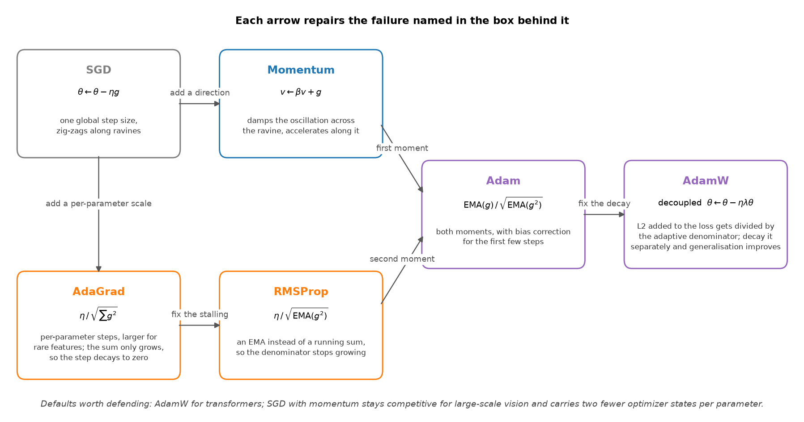

# Deep learning and Transformers

> **Why this matters at staff level.** This chapter is the core of the ML depth round
> for any modern role, and it is the one place where interviewers will ask you to
> derive rather than describe. Two motifs run through almost every answer: **variance
> preservation through depth** (init, normalization, residual paths, the
> $1/\sqrt{d_k}$ scale) and **saturating non-linearities killing gradients** (MSE with
> a sigmoid, tanh in deep stacks, softmax on large logits). If you can name the motif
> the question belongs to, you can usually rebuild the answer from first principles at
> the whiteboard.

## The questions

| # | Question | Taught properly in |
|---|---|---|
| 1 | [Why non-linearity, and how activations differ](#q1) | [MLPs and activations](../part03-neural-nets/01-mlp-and-activations.md) |
| 2 | [Weight initialization and the symmetry problem](#q2) | [Initialization](../part03-neural-nets/04-initialization.md) |
| 3 | [Backprop, explained the way you want to hear it](#q3) | [Backpropagation](../part03-neural-nets/02-backpropagation.md) |
| 4 | [The optimizer development path](#q4) | [Optimization](../part01-math/06-optimization.md) |
| 5 | [LR scheduling, batch size, weight decay](#q5) | [Optimization](../part01-math/06-optimization.md) |
| 6 | [Why dropout helps, and when it fails](#q6) | [Regularization](../part03-neural-nets/06-regularization.md) |
| 7 | [BatchNorm vs LayerNorm vs RMSNorm](#q7) | [Normalization](../part03-neural-nets/05-normalization.md) |
| 8 | [Attention vs convolution vs recurrence](#q8) | [Attention mathematics](../part05-sequence-transformers/03-attention-mathematics.md) |
| 9 | [Why scale attention scores by $1/\sqrt{d_k}$](#q9) | [Attention mathematics](../part05-sequence-transformers/03-attention-mathematics.md) |
| 10 | [Softmax temperature and entropy](#q10) | [Information theory](../part01-math/05-information-theory.md) |
| 11 | [Why multi-head attention, and what head collapse is](#q11) | [Attention mathematics](../part05-sequence-transformers/03-attention-mathematics.md) |
| 12 | [Causal masking and optimization dynamics](#q12) | [Pretraining data and objective](../part06-llm-training/01-pretraining-data-objective.md) |
| 13 | [Positional encodings, and what breaks at 4x the training length](#q13) | [Positional encodings](../part05-sequence-transformers/05-positional-encodings.md) |
| 14 | [SwiGLU vs a standard FFN](#q14) | [Large-model architecture](../part06-llm-training/03-large-model-architecture.md) |
| 15 | [Pre-norm vs post-norm](#q15) | [Normalization](../part03-neural-nets/05-normalization.md) |
| 16 | [Encoder vs decoder vs encoder-decoder, with complexity](#q16) | [Transformer architectures](../part05-sequence-transformers/04-transformer-architectures.md) |
| 17 | [Tokenization, decoding, weight tying](#q17) | [Tokenization](../part05-sequence-transformers/06-tokenization.md) |
| 18 | [Transformer scaling and inference](#q18) | [Scaling laws](../part06-llm-training/02-scaling-laws.md) |

---

## Deep learning foundations

### 1. Why non-linearity, and how activations differ {#q1}

??? question "Q: Why do we need non-linearity, and how do activation functions differ?"
    **The answer.** Without a non-linearity between linear layers the network
    collapses: $(x W_1) W_2 = x (W_1 W_2)$ is a single linear map, so depth buys no
    expressivity. The activation is the precondition for universal approximation.

    The zoo, organised by the problem each one solves:

    * **Sigmoid and tanh** saturate at both ends, so the gradient goes to zero and
      deep stacks stop learning. Tanh is zero-centred, which makes it better behaved
      than sigmoid, and both are retired from hidden layers.
    * **ReLU**, $\max(0, x)$, is the workhorse: non-saturating on the positive side
      (gradient exactly 1), sparse, and one comparison to compute. Its failure is the
      **dying ReLU**, a unit whose pre-activation is always negative, which receives
      zero gradient forever.
    * **Leaky ReLU, PReLU, ELU** give the negative region a slope so a dead unit can
      recover.
    * **GELU and SiLU (Swish)** are smooth and non-monotonic, and GELU is the default
      in Transformers. GELU weights an input by its probability under a Gaussian,
      $x\,\Phi(x)$, which softens ReLU's corner.
    * **Gated variants (SwiGLU)** replace the pointwise non-linearity with a
      multiplicative gate. See [question 14](#q14).

    !!! interview "Staff move"
        Name the throughline and then decline to overclaim. "The whole sequence is the
        vanishing-gradient story: sigmoids saturate and kill gradients in deep stacks,
        ReLU fixed that by being non-saturating on the positive side, and the smooth
        variants file down ReLU's corner for slightly better optimization in
        Transformers. My defaults are GELU or SiLU in Transformers and ReLU in CNNs,
        and I would say plainly that the activation is not where the large wins live.
        Initialization, normalization and the residual topology matter more for
        whether a deep network trains at all."

    **Goes deeper:** [MLPs and activations](../part03-neural-nets/01-mlp-and-activations.md).

### 2. Weight initialization and the symmetry problem {#q2}

??? question "Q: Explain weight initialization: the symmetry problem, the right distribution, and bias init."
    **The answer.** Three parts.

    **Symmetry breaking.** Initialise every weight in a layer to the same constant and
    every unit computes the identical function, receives the identical gradient, and
    updates identically forever. The layer has the capacity of one unit. Random init
    is what breaks the tie. Zero init is fine for biases, because the random weights
    have already broken the symmetry.

    **Zero-mean.** A symmetric distribution keeps the expected pre-activation centred,
    which avoids a systematic drift toward the saturating region as signals propagate
    through depth.

    **The variance, which is the actual content of Xavier and He.** The goal is to keep
    the variance of activations (forward) and gradients (backward) constant across
    layers. A unit summing $n_\text{in}$ independent inputs has output variance
    proportional to $n_\text{in}\sigma^2$, so hold it at 1 by setting
    $\sigma^2 \propto 1/n_\text{in}$.

    * **Xavier/Glorot**, $\mathrm{Var}(W) = 1/n_\text{avg}$ over fan-in and fan-out,
      derived in a linear or tanh regime.
    * **He/Kaiming**, $\mathrm{Var}(W) = 2/n_\text{in}$. The factor of 2 compensates
      for ReLU zeroing half of its inputs and therefore halving the variance ([He et
      al., 2015](https://arxiv.org/abs/1502.01852)). Use it with ReLU and GELU.

    **Bias init** is usually zero. Exceptions worth naming: a small positive bias to
    keep ReLUs active early, an LSTM forget-gate bias near 1 so the gate starts in
    "remember", and the final-layer bias set to the log prior of the class
    distribution under imbalance, which starts the model at the correct base rate and
    removes a chunk of early instability for free.

    !!! interview "Staff move"
        Unify it. "Init, normalization and residual connections are three tools
        serving one goal: keeping signal and gradient magnitudes stable through depth.
        Modern architectures lean on normalization and residuals so heavily that they
        forgive bad init, but on a from-scratch network without them, He against
        Xavier is the difference between training and a dead or exploding network. The
        log-prior bias trick is the cheap one nobody uses, and it fixes a lot of
        imbalanced-classification instability at zero cost."

    **Goes deeper:** [initialization](../part03-neural-nets/04-initialization.md).

### 3. Backprop, explained the way you want to hear it {#q3}

??? question "Q: Explain backpropagation and the chain rule the way you would want a strong candidate to explain it."
    **The answer.** Backprop is the chain rule with **dynamic programming** so that
    shared subexpressions are computed once. A network is a composition of functions
    ending in a scalar loss. Applying the chain rule naively from the loss to each
    parameter recomputes the same intermediate derivatives an exponential number of
    times.

    Instead, each node computes its **upstream gradient** $\partial L / \partial(\text{node
    output})$ once and caches it. Each layer receives the gradient of the loss with
    respect to its output, multiplies by its **local Jacobian** to produce the gradient
    with respect to its inputs (passed further back) and with respect to its parameters
    (used for the update). The forward pass caches activations; the backward pass walks
    the graph in reverse topological order multiplying local Jacobians. Cost is linear
    in the size of the graph, which is the reason deep networks are trainable at all.

    !!! interview "Staff move"
        Two additions beyond the mechanics. First, say why activations are cached: the
        backward pass needs the forward activations to evaluate local Jacobians, which
        is exactly why activation memory scales with depth and batch, and why gradient
        checkpointing (recompute instead of store) is the standard memory-for-compute
        trade in large-model training. Second, say where it breaks: vanishing and
        exploding gradients are the chain rule multiplying many Jacobians whose
        singular values sit below or above 1, which is why we need normalization,
        careful init, and residual connections, whose identity path contributes a term
        that does not attenuate. "Backprop being a product of Jacobians is the root
        cause of half of deep learning's pathologies" is the sentence to land.

    **Goes deeper:** [backpropagation](../part03-neural-nets/02-backpropagation.md) and
    [the autograd engine](../part03-neural-nets/03-autograd-engine.md).

### 4. The optimizer development path {#q4}

??? question "Q: Walk me from SGD to AdamW and say what each step fixed."
    **The answer.** The lineage is a story of progressively smarter use of gradient
    history, and each step repairs a named failure of the one before it.

    { width="760" }

    * **SGD**, $\theta \leftarrow \theta - \eta g$. Well understood, and the noise in
      its gradient estimate acts as implicit regularisation. It is slow in
      ill-conditioned landscapes, zig-zagging across ravines, and it applies one
      global step size to every parameter.
    * **Momentum**, $v \leftarrow \beta v + g$, then $\theta \leftarrow \theta - \eta
      v$. Damps oscillation across the ravine and accumulates speed along consistent
      directions. Nesterov evaluates the gradient after the lookahead step.
    * **AdaGrad** divides the step by $\sqrt{\sum g^2}$ per parameter, giving rare
      features larger steps. The accumulator only grows, so the effective step decays
      to zero and learning stalls.
    * **RMSProp** replaces the running sum with an exponential moving average, so the
      denominator stops growing and the method works in the non-convex setting.
    * **Adam** is RMSProp plus momentum: EMAs of both the gradient and the squared
      gradient, with bias correction for the early steps when the EMAs are still
      warming up from zero.
    * **AdamW** fixes weight decay. In Adam, an L2 term added to the loss gets divided
      by the adaptive per-parameter denominator, so parameters with large gradients
      receive less regularisation than you asked for. AdamW applies $\theta \leftarrow
      \theta - \eta\lambda\theta$ as a separate step, restoring uniform decay and
      improving generalisation ([Loshchilov and Hutter,
      2017](https://arxiv.org/abs/1711.05101)).

    !!! interview "Staff move"
        The decoupled decay is the detail that separates people who read the optimizer
        from people who have debugged a training run, because it is a one-line change
        with a measurable effect. Then commit to defaults and name the axis: "AdamW
        for Transformers and most deep networks. SGD with momentum is still
        competitive for large-scale vision, where its gradient noise finds flatter
        minima and it carries two fewer optimizer states per parameter, which is real
        memory at scale. The trade is convergence speed against generalisation, and it
        is why a lot of state-of-the-art vision training still uses SGD with a good
        schedule."

    **Goes deeper:** [optimization](../part01-math/06-optimization.md).

### 5. LR scheduling, batch size, weight decay {#q5}

??? question "Q: Talk me through learning-rate scheduling, batch size, and weight decay."
    **The answer.** Three coupled knobs.

    **Scheduling.** Large early for fast progress, small late to settle. **Warmup**
    ramps the learning rate over the first few hundred or thousand steps and prevents
    early divergence when the adaptive moment estimates are still noisy and gradients
    are large. Then decay: **cosine** to near zero is the current favourite, with step
    and linear decay as the alternatives. Warmup plus cosine is the standard
    Transformer recipe.

    **Batch size.** A large batch gives more parallelism, a lower-variance gradient
    estimate, and faster wall-clock per epoch, at the cost of fewer updates per epoch
    and a documented tendency toward sharper minima that generalise worse ([Keskar et
    al., 2016](https://arxiv.org/abs/1609.04836)). It needs learning-rate scaling
    (linear or square-root) plus warmup, or it diverges in the first few hundred
    steps. A small batch gives noisier gradients that act as implicit regularisation
    and more updates per epoch, and underutilises the hardware. Past a critical batch
    size the returns per sample flatten.

    **Weight decay** penalises weight magnitude to control capacity, decoupled from
    the gradient step in AdamW. Its role changes in the presence of normalization: for
    a layer followed by BN or LN, scaling the weights does not change the function, so
    decay does not shrink the function. What it does is keep the weight norm bounded,
    which controls the **effective learning rate** in those layers.

    !!! interview "Staff move"
        Present the batch-size, learning-rate and warmup triangle as one object. "You
        cannot multiply the batch by ten without scaling the learning rate and warming
        up, or you diverge in the first few hundred steps." Then land the subtle
        point: "in a normalized network, weight decay is no longer directly
        regularising the function, it is modulating the effective learning rate by
        controlling weight norm, which is why decay and learning rate have to be tuned
        jointly and why a decay value copied from an unnormalized architecture behaves
        unexpectedly."

    **Goes deeper:** [optimization](../part01-math/06-optimization.md) and
    [distributed training](../part14-systems/01-distributed-training.md) for the
    large-batch regime.

### 6. Why dropout helps, and when it fails {#q6}

??? question "Q: Why does dropout help, and when can it fail, with BatchNorm or in small models?"
    **The answer.** **Why it helps.** Randomly zeroing activations during training
    prevents **co-adaptation**, since no unit can rely on a specific other unit being
    present, so features become independently useful. It also approximates training an
    ensemble of exponentially many weight-sharing subnetworks whose predictions are
    averaged at test time.

    **When it fails.**

    * **Stacked with BatchNorm.** Dropout changes the variance of the activations
      between training and inference, while BN applies statistics accumulated over
      training. The mismatch, analysed as **variance shift** by [Li et al.,
      2018](https://arxiv.org/abs/1801.05134), makes inference behave differently from
      training in a way the running statistics get wrong. The practical resolutions
      are to use BN as the regulariser and drop dropout, to place dropout only after
      all BN layers, or to keep them in different parts of the network. Modern CNNs
      largely replaced dropout with BN plus augmentation.
    * **In small models.** Dropout regularises by reducing effective capacity. An
      underparameterised model is already capacity-limited and more likely to
      underfit, so dropping units pushes it further the wrong way. The benefit scales
      with overparameterisation.

    !!! note "Correction to a common description"
        Textbook descriptions say the activations are scaled at test time. Every
        modern framework implements **inverted dropout**: the surviving activations
        are divided by the keep probability during training, and inference is an
        untouched forward pass. The ensemble argument is unchanged; the arithmetic
        happens at the other end. Say it this way and you will not be corrected.

    !!! interview "Staff move"
        Generalise the BN interaction into a rule. "Dropout is a variance-reduction
        tool, so it helps when you have excess capacity and hurts when you do not. The
        BN interaction is one instance of a general lesson: any regulariser that
        changes activation statistics interacts badly with a method that normalizes
        those statistics. For vision I lean on BN plus augmentation and skip dropout;
        in Transformers it survives at modest rates. I never add dropout reflexively.
        I check the train-validation gap first to see whether the model is
        variance-limited at all."

    **Goes deeper:** [regularization](../part03-neural-nets/06-regularization.md).

### 7. BatchNorm vs LayerNorm vs RMSNorm {#q7}

??? question "Q: Compare BatchNorm, LayerNorm and RMSNorm. What changes between training and inference, and why is BN tricky in RL or with non-IID data?"
    **The answer.** Normalization re-centres and re-scales activations to stabilise
    their distribution across training, which smooths the optimization landscape and
    makes gradients more predictable, allowing higher learning rates and reducing
    sensitivity to init. The original "internal covariate shift" explanation has been
    undermined: the smoothing account is the one supported by the evidence
    ([Santurkar et al., 2018](https://arxiv.org/abs/1805.11604)).

    The three differ in **which axis they normalize over**.

    * **BatchNorm** normalizes each channel across the **batch** (and the spatial dims
      in a conv), so an activation is normalized using statistics from other examples.
      Excellent for CNNs. It needs a reasonably large batch and it couples the
      examples in a batch to each other.
    * **LayerNorm** normalizes across the **feature** dimension within a single
      example, independent of the batch. It works at batch size 1, with variable-length
      sequences, and in streaming and autoregressive settings, which is why it is the
      Transformer standard.
    * **RMSNorm** drops the mean-centring and divides by the root mean square only, with
      no re-centring and no bias. Cheaper, and empirically the centring is unnecessary
      in Transformers ([Zhang and Sennrich, 2019](https://arxiv.org/abs/1910.07467)),
      which is why it is the modern LLM default.

    **Train against inference.** BatchNorm differs: training uses the current batch's
    statistics and accumulates running averages, inference uses the fixed running
    statistics. That discrepancy is a frequent bug source, and forgetting `model.eval()`
    is its most common form. LayerNorm and RMSNorm are identical in both modes, because
    the statistics are per-example and there is no bookkeeping to get wrong.

    **Why BN breaks in RL and non-IID settings.** BN assumes the batch statistics
    estimate the population statistics, which assumes a representative, roughly IID
    batch. In RL the data is highly correlated (consecutive transitions from one
    policy), non-stationary (the policy and therefore the data distribution change as
    you learn), and often batched small. The batch statistics are then biased and
    moving, the normalization becomes a moving target, and the running statistics lag
    a distribution that has already changed. The same failure appears with very small
    batches and in contrastive learning, where information leaks between examples
    through the batch statistics.

    !!! interview "Staff move"
        Compress it to one distinction with everything hanging off it. "BN normalizes
        across examples on the batch axis, LN and RMSNorm normalize within an example
        on the feature axis. That single difference explains why Transformers use LN
        (no batch coupling, variable length, batch-1 inference), why RL breaks BN
        (non-IID and non-stationary batches make the batch statistics a bad and moving
        estimate), and why BN has a train-inference gap while LN does not. RMSNorm is
        the efficiency-minded follow-up that found the mean-centring was dead weight.
        For anything sequential, online, or non-IID I do not consider BN at all,
        because its assumption is violated by construction."

    **Goes deeper:** [normalization](../part03-neural-nets/05-normalization.md).

---

## The Transformer

### 8. Attention vs convolution vs recurrence {#q8}

??? question "Q: What does each of attention, convolution and recurrence assume, and what does attention buy you?"
    **The answer.** Three ways to mix information across positions, with different
    inductive biases and cost profiles.

    * **Recurrence** carries a hidden state and processes sequentially. Bias: temporal
      locality and order. Costs: inherently sequential, so training does not
      parallelise across time, and information must survive many steps to reach a
      distant position, so gradients vanish and the effective context is limited
      despite gating. Path length between positions $i$ and $j$ is $O(\lvert i-j
      \rvert)$.
    * **Convolution** applies a local window with shared weights. Bias: locality and
      translation equivariance, which are strong and correct priors for images.
      Parallel, but one layer sees only its receptive field, so long-range
      dependencies need depth, and the interaction pattern is fixed by the kernel.
    * **Self-attention** lets every position attend to every other with
      content-dependent weights. Path length between any two positions is $O(1)$, with
      no bottleneck and no distance penalty, and it parallelises across positions. The
      price is $O(n^2)$ compute and memory in sequence length and a **weak inductive
      bias**: it has to learn locality and order rather than assuming them, which is
      why Transformers are data-hungry and need positional information injected.

    !!! interview "Staff move"
        State the trade explicitly and give the empirical consequence. "The Transformer
        swaps hand-built inductive biases for a weak general one plus the capacity to
        learn the right structure from data. That only pays at scale, and then it pays
        enormously, because nothing is bottlenecked. It is also exactly why Vision
        Transformers underperform CNNs on small datasets and overtake them with enough
        data or pretraining: the locality prior is a free lunch when data is scarce
        and a ceiling when data is abundant. And the $O(n^2)$ term is the reason the
        entire efficient-attention literature exists."

    **Goes deeper:** [attention mathematics](../part05-sequence-transformers/03-attention-mathematics.md),
    [RNNs, LSTMs and GRUs](../part05-sequence-transformers/01-rnn-lstm-gru.md),
    [convolutions](../part04-vision/02-convolutions.md).

### 9. Why scale attention scores by $1/\sqrt{d_k}$ {#q9}

??? question "Q: Why do we divide the attention logits by the square root of d_k?"
    **The answer.** Derive it. The logits are dot products $q \cdot k = \sum_{i=1}^{d_k}
    q_i k_i$ with $q, k \in \R^{d_k}$. Assume the components are independent,
    zero-mean and unit-variance. Each term $q_i k_i$ has mean 0 and variance 1, and
    summing $d_k$ independent such terms gives

    $$
    \mathrm{Var}(q \cdot k) = d_k, \qquad \mathrm{std}(q \cdot k) = \sqrt{d_k}
    $$

    So the logits grow in magnitude with $\sqrt{d_k}$. Large logits push the softmax
    into a saturated regime where one entry approaches 1, the rest approach 0, and the
    Jacobian of the softmax approaches zero, so gradients vanish and learning stops.
    Dividing by $\sqrt{d_k}$ holds the logit variance at 1 and keeps the softmax in a
    well-conditioned regime.

    $$
    \boxed{\;\mathrm{Attention}(Q,K,V) = \softmax\!\Big(\frac{QK^\top}{\sqrt{d_k}}\Big)V\;}
    $$

    !!! interview "Staff move"
        Connect it to the motif and to temperature. "This is the same
        vanishing-gradient-through-a-saturating-non-linearity story as MSE with a
        sigmoid and as tanh in a deep stack, which is worth saying because it shows
        you are carrying one mechanism rather than three facts. And $1/\sqrt{d_k}$ is
        a fixed temperature: attention sharpness is temperature-controlled, which is
        the bridge to the next question and to why some models learn a per-head
        temperature."

    **Goes deeper:** [attention mathematics](../part05-sequence-transformers/03-attention-mathematics.md).

### 10. Softmax temperature and entropy {#q10}

??? question "Q: What does softmax temperature do, and where does it show up?"
    **The answer.** Temperature rescales the logits before the softmax,
    $\softmax(z / T)$, and it controls the entropy of the output distribution.

    * $T \to 0$: the distribution sharpens toward one-hot, entropy toward 0.
      Deterministic and low-diversity.
    * $T \to \infty$: the distribution flattens toward uniform, entropy toward its
      maximum $\log K$.
    * $T = 1$: the trained distribution.

    In **attention**, a lower effective temperature means sharper, lower-entropy
    attention maps concentrated on few positions; higher means diffuse attention. In
    **decoding**, temperature is the primary diversity knob, usually combined with
    top-k or top-p truncation.

    !!! interview "Staff move"
        Connect the three uses of one operation. "Temperature is the entropy dial of
        any softmax, and it shows up in three places worth linking: the $1/\sqrt{d_k}$
        attention scale is a fixed temperature that prevents saturation; knowledge
        distillation raises the teacher's temperature so the student learns from the
        relative probabilities of the wrong classes, which is where the teacher's dark
        knowledge lives; and decoding temperature is the inference-time quality and
        diversity dial that needs no retraining. Being able to connect them is the
        signal, because it shows you see the operation and not three recipes."

    **Goes deeper:** [information theory](../part01-math/05-information-theory.md).

### 11. Why multi-head attention, and what head collapse is {#q11}

??? question "Q: Why multi-head attention? What is head collapse?"
    **The answer.** A single head computes one weighted average, which is one notion
    of relevance. Multi-head splits the representation into $h$ subspaces of width
    $d/h$, runs attention independently in each with its own $Q$, $K$, $V$
    projections, and concatenates. The model can attend to several kinds of
    relationship at once (a syntactic dependency, a coreference link, local adjacency)
    and, because each head is narrower, the total compute is close to single-head with
    full width. It is an ensemble of attention patterns in complementary subspaces, at
    nearly no cost.

    **Head collapse and redundancy.** In practice many heads learn near-duplicate or
    degenerate functions: attending to the previous token, or dumping probability on a
    sink position such as the first token. Large fractions of heads can be pruned after
    training with little loss ([Michel et al.,
    2019](https://arxiv.org/abs/1905.10650)), and many layers survive reduction to a
    single head. Nothing in the objective rewards head diversity, so it is emergent and
    unforced.

    !!! interview "Staff move"
        Turn the redundancy finding into two consequences. "Heads being redundant is
        both a compression opportunity, since you can prune them, and a hint that
        explains the next decade of attention variants: if heads are redundant enough
        to prune, they are redundant enough to share keys and values, which is exactly
        what multi-query and grouped-query attention exploit. The attention-sink
        phenomenon, where heads park probability mass on the first token, is the other
        one worth naming, because it has real consequences for streaming inference and
        for quantization, which is what StreamingLLM is about ([Xiao et al.,
        2023](https://arxiv.org/abs/2309.17453))."

    **Goes deeper:** [attention mathematics](../part05-sequence-transformers/03-attention-mathematics.md)
    and [chapter 4, question 1](04-llms-multimodal.md#q1).

### 12. Causal masking and optimization dynamics {#q12}

??? question "Q: What is causal masking, and how does it change optimization dynamics compared with bidirectional attention?"
    **The answer.** Causal masking sets the attention logits to $-\infty$ for all
    future positions before the softmax, so position $i$ attends only to positions
    $\le i$. That enforces the autoregressive factorisation $P(x) = \prod_i P(x_i \mid
    x_{<i})$ and stops the model reading the token it is predicting. It also enables
    teacher forcing with parallel training: one forward pass produces the loss for
    predicting **every** next token in the sequence, so a length-$n$ sequence yields
    $n$ training signals per pass.

    How it changes the dynamics:

    * **Information asymmetry across positions.** Token 1 sees only itself, token
      $n$ sees everything. The difficulty of the prediction task and the gradient
      statistics vary systematically with position, which does not happen under
      bidirectional attention.
    * **Denser supervision.** Causal LM gets a target at every position from one pass.
      A BERT-style masked LM computes the loss on the masked fraction of tokens only,
      so it gets a sparser signal per sequence, while building better bidirectional
      representations for understanding tasks.
    * **A uniform objective.** The task is always "predict the next token", which is
      what makes causal LMs such effective unsupervised learners: every token in the
      corpus is free supervision.

    !!! interview "Staff move"
        Say what the mask actually buys. "Causal masking turns a Transformer into a
        self-supervised learning machine, because next-token prediction over a masked
        forward pass extracts $n$ gradient signals per sequence at the cost of one,
        and that sample efficiency is a large part of why generative pretraining
        scales. Bidirectional attention gives richer per-token representations and
        gives up the clean generative factorisation and the dense free supervision.
        The choice of mask is the choice between a generator and an encoder, and it
        has downstream consequences: the positional asymmetry is part of why position
        1 behaves specially, which is the attention-sink story, and it is part of why
        long-context training is delicate."

    **Goes deeper:** [pretraining data and objective](../part06-llm-training/01-pretraining-data-objective.md)
    and [transformer architectures](../part05-sequence-transformers/04-transformer-architectures.md).

### 13. Positional encodings, and what breaks at 4x the training length {#q13}

??? question "Q: Why do we need positional encoding, what is the difference between absolute and relative, why do rotary schemes extrapolate, and what breaks when you train at L and infer at 4L?"
    **The answer.** Four parts, and the fourth is the one that separates candidates.

    **Why needed.** Self-attention is permutation-equivariant. It is a weighted average
    with content-based weights and carries no notion of order, so "the dog bit the man"
    and "the man bit the dog" are indistinguishable to bare attention. Position must be
    injected.

    **Absolute against relative.** Absolute schemes assign each position an embedding
    added to the token embedding, either sinusoidal or learned. Learned absolute
    embeddings have no value for a position beyond the training length, and absolute
    codes do not directly express the relative distance that attention usually cares
    about. Relative schemes inject the offset $i - j$ into the attention computation,
    which generalises better across lengths and matches the translation invariance of
    language.

    **Why RoPE extrapolates more gracefully.** RoPE rotates $q$ and $k$ by an angle
    proportional to their absolute position. Because a rotation preserves inner
    products up to the relative angle, the score between a query at $m$ and a key at
    $n$ depends only on $m - n$ ([Su et al.,
    2021](https://arxiv.org/abs/2104.09864)). It encodes absolute position through the
    rotation and produces a purely relative score, it adds no parameters, and it is
    defined at any position because it is a continuous rotation rather than a lookup
    table.

    **What breaks at 4L.**

    * **Positions never seen in training.** Learned absolute embeddings have no
      entry and fail immediately. RoPE degrades more gracefully and still struggles,
      because the model never trained on the rotation phases and relative distances
      that occur at 4L, so those attention scores are out of distribution.
    * **Attention dilution.** Softmax over four times as many keys spreads probability
      thinner, changing the entropy and sharpness of maps the model was never adapted
      to produce.
    * **Content, not just position.** Even with perfect positional generalisation, the
      long-range dependencies at distances beyond $L$ were never in the training data,
      so the model has not learned to use them.

    Mitigations to name: **position interpolation**, which rescales the 4L positions
    into the trained range (Chen, Wong, Chen, Tian, "Extending Context Window of Large
    Language Models via Positional Interpolation", 2023), **NTK-aware and YaRN
    frequency scaling** ([Peng et al.,
    2023](https://arxiv.org/abs/2309.00071)), and **ALiBi**, which adds a
    distance-proportional linear bias to the scores and is defined at any distance by
    construction ([Press et al., 2021](https://arxiv.org/abs/2108.12409)).

    !!! interview "Staff move"
        Land the distinction between defined and working. "Attention is order-blind, so
        we inject position. Absolute schemes hard-code a table that runs out; relative
        schemes encode the offset attention actually uses; RoPE is the synthesis,
        applying absolute rotations whose dot product depends only on relative
        distance. But defined at 4L is not working at 4L. The failure is part
        positional out-of-distribution, part attention-entropy dilution, and part
        content dependencies that were never in the data, which is why long context is
        solved by interpolation or YaRN plus actually training on long sequences. I
        would never assume a model trained at 4K works at 16K because it uses RoPE,
        and I would ask to see the needle-in-a-haystack curve before believing a
        context-length claim."

    **Goes deeper:** [positional encodings](../part05-sequence-transformers/05-positional-encodings.md).

### 14. SwiGLU vs a standard FFN {#q14}

??? question "Q: SwiGLU or a standard FFN? Cover intuition, complexity, performance, and the failure mode."
    **The answer.** The Transformer FFN is applied position-wise: $\mathrm{FFN}(x) =
    \mathrm{act}(x W_1 + b_1) W_2 + b_2$, typically expanding to $4 d_{\text{model}}$
    and back.

    **GLU-family blocks** add a gate: two linear projections, one passed through an
    activation and multiplied elementwise into the other,
    $\mathrm{SwiGLU}(x) = \mathrm{Swish}(x W_1) \odot (x W_3)$, then projected by
    $W_2$. Three weight matrices instead of two.

    * **Intuition.** The gate lets the network control information flow per dimension
      as a function of the input. A multiplicative, content-dependent filter is more
      expressive than a fixed pointwise non-linearity.
    * **Complexity.** To hold parameters and FLOPs constant against the 2-matrix FFN,
      the hidden width is reduced, commonly to $\tfrac{2}{3}$ of the equivalent, so
      $\tfrac{8}{3} d$ instead of $4 d$. The gain is quality per FLOP, and it is not
      free capacity.
    * **Performance.** GLU variants consistently improve Transformer quality at
      matched compute, which is why the LLaMA and PaLM families use them. The original
      paper's own summary of the theory is worth quoting: "We offer no explanation as
      to why these architectures seem to work; we attribute their success, as all
      else, to divine benevolence" ([Shazeer,
      2020](https://arxiv.org/abs/2002.05202)).
    * **Gate collapse against dead neurons.** A dead ReLU is a unit pinned in its zero
      region with zero gradient, which is the additive failure. Gate collapse is the
      multiplicative analogue: the gate saturates closed, the path is shut, and that
      dimension stops contributing and stops receiving gradient. Swish's smoothness,
      with a non-zero gradient in the negative region, mitigates the hard-zero death
      that afflicts ReLU.

    !!! interview "Staff move"
        Name the axis and then be honest about the evidence. "The throughline from
        activations to SwiGLU is additive against multiplicative interaction. A plain
        FFN applies a fixed pointwise non-linearity; a GLU adds an input-dependent
        multiplicative gate, which is strictly more expressive and wins empirically at
        matched FLOPs once you size the hidden layer down to two thirds. The
        theoretical justification is thin and I would say so, because a candidate who
        invents a post-hoc story for an empirical result is telling you how they read
        papers. The failure mode generalises too: dead ReLUs become gate collapse,
        which is why the smooth Swish gate is preferred over a hard one."

    **Goes deeper:** [large-model architecture](../part06-llm-training/03-large-model-architecture.md).

### 15. Pre-norm vs post-norm {#q15}

??? question "Q: Pre-norm or post-norm? What is the difference and which would you pick?"
    **The answer.** Where the normalization sits relative to the residual add.

    * **Post-norm** (the 2017 Transformer): $x \leftarrow \mathrm{LN}(x +
      \mathrm{Sublayer}(x))$. The norm is on the main path.
    * **Pre-norm** (the modern default): $x \leftarrow x +
      \mathrm{Sublayer}(\mathrm{LN}(x))$. The norm is inside the branch, so the
      residual path is a clean identity.

    The clean identity path is the difference that matters. Gradients reach early
    layers through a route that no normalization rescales, which makes deep stacks
    stable. Post-norm can reach slightly better final quality when it trains
    successfully, since the norm on the main path regularises, and it is fragile:
    deep post-norm Transformers need careful warmup and can diverge, because the
    gradient signal is repeatedly rescaled on the way back ([Xiong et al.,
    2020](https://arxiv.org/abs/2002.04745)).

    !!! note "Correction to a common claim"
        The claim that pre-norm removes the need for warmup overstates the result. Xiong
        et al. show that pre-norm controls the gradient scale at initialization, which
        makes warmup unnecessary in their experiments. Production recipes for large
        pre-norm models still use warmup, because it also buys stability against a bad
        data shard, a spike in gradient norm, and the noisy Adam moment estimates of
        the first few hundred steps. Say "pre-norm removes the dependence on warmup
        for stability at init", and not "pre-norm means you do not need warmup".

    !!! interview "Staff move"
        Frame it as stability against peak quality and then commit. "Stability won at
        scale, because you cannot afford a divergence on a multi-week run, and
        pre-norm's clean residual highway is what makes 100-layer Transformers
        trainable. It connects back to the residual-connection insight from backprop:
        an unattenuated identity path is what keeps the gradient alive. The frontier
        nuance is the hybrids, sandwich norms and DeepNorm-style schemes, that try to
        recover post-norm's quality while keeping pre-norm's stability. For a new
        large model I would take pre-norm with RMSNorm without hesitating, because
        stability dominates the calculus at that scale."

    **Goes deeper:** [normalization](../part03-neural-nets/05-normalization.md) and
    [transformer architectures](../part05-sequence-transformers/04-transformer-architectures.md).

### 16. Encoder vs decoder vs encoder-decoder, with complexity {#q16}

??? question "Q: Compare encoder-only, decoder-only and encoder-decoder Transformers, and give the time complexity of each."
    **The answer.** The three families are defined by their masking and the task they
    were built for.

    * **Encoder-only** (BERT): bidirectional self-attention, every token sees every
      other. Built for understanding (classification, retrieval, token labelling),
      pretrained with masked language modelling, awkward as a generator.
    * **Decoder-only** (GPT, LLaMA): causal self-attention, autoregressive, pretrained
      with next-token prediction. What almost every modern LLM is, because the
      objective scales and a decoder handles understanding tasks in-context or through
      its final hidden state.
    * **Encoder-decoder** (T5, the original Transformer): a bidirectional encoder over
      the input, a decoder that attends to its own past causally and to the encoder
      output through **cross-attention**. Built for transduction, where the input and
      output are distinct sequences.

    **Complexity**, with sequence length $n$ and model width $d$:

    * Self-attention is $O(n^2 d)$ for the $n \times n$ score matrix; the position-wise
      FFN is $O(n d^2)$. For typical $d > n$ the FFN dominates the FLOP count, while
      the $n^2$ term is what explodes as context grows.
    * **Encoder-decoder** adds cross-attention. With input length $n$ and output length
      $m$: encoder self-attention $O(n^2 d)$, decoder self-attention $O(m^2 d)$,
      cross-attention $O(n m d)$, total $O((n^2 + m^2 + nm)d)$ for the attention parts.
    * **Decoder inference** is asymmetric. With a KV cache, generating token $t$
      attends over $t$ cached positions at $O(t d)$, so generating $n$ tokens costs
      $O(n^2 d)$ in total. Without the cache you recompute the prefix every step and
      pay $O(n^3 d)$.

    !!! interview "Staff move"
        "The masking is the architecture: bidirectional gives you an encoder for
        understanding, causal gives you a decoder for generation, both plus
        cross-attention gives you transduction. The field collapsed onto decoder-only
        for LLMs because next-token pretraining is the most scalable self-supervision
        available and decoders absorb understanding tasks well enough, so the
        distinction matters less than it did, though encoder-decoder still wins where
        there is a distinct input worth encoding bidirectionally, such as translation.
        On complexity, the answer they want is $O(n^2 d)$ attention with $n^2$ as the
        scaling pain, and the bonus is naming the KV cache turning naive $O(n^3)$
        generation into $O(n^2)$ unprompted, which tells them you have served one of
        these."

    **Goes deeper:** [transformer architectures](../part05-sequence-transformers/04-transformer-architectures.md).

### 17. Tokenization, decoding, weight tying {#q17}

??? question "Q: How does tokenization affect model performance? Compare decoding strategies. What is weight tying?"
    **The answer.** Three related pieces of the input and output plumbing.

    **Tokenization.** Subword schemes (BPE, WordPiece, SentencePiece Unigram) sit
    between character level (tiny vocabulary, very long sequences, no out-of-vocabulary
    problem) and word level (huge vocabulary, an OOV problem). Common words become
    single tokens, rare words split into pieces, and nothing is truly OOV. The choice
    sets the effective sequence length and therefore the $O(n^2)$ cost, and it hurts
    unevenly: poor tokenization disproportionately damages non-English languages, code,
    and arithmetic, since inconsistent digit grouping makes numerical reasoning harder
    and many-tokens-per-word inflates cost and degrades quality for low-resource
    languages. Vocabulary size trades embedding-table size against sequence length.

    **Decoding.** Greedy takes the argmax each step: fast, deterministic, myopic, and
    repetitive. Beam search keeps the top $b$ partial sequences and suits closed-ended
    tasks such as translation, while producing bland, repetitive text in open-ended
    generation. Sampling draws from the distribution, with **temperature** for
    diversity, **top-k** restricting to the $k$ most likely tokens, and **top-p
    (nucleus)** restricting to the smallest set whose cumulative probability reaches
    $p$, which adapts its cutoff to how peaked the distribution is. Nucleus sampling
    is the open-ended default, with repetition penalties and minimum lengths as
    practical knobs.

    **Weight tying.** Share the input embedding matrix with the output projection: both
    are $V \times d_{\text{model}}$ maps between token space and embedding space, one
    transposed. Tying cuts parameters substantially, since the embedding table is a
    large fraction of a small model's parameters, acts as a regulariser, and has the
    motivation that input and output token representations should live in a consistent
    space.

    !!! interview "Staff move"
        Elevate tokenization to a systems decision. "Tokenization is the most
        underrated performance lever, because it is upstream of everything: it fixes
        the effective sequence length and therefore the serving cost, and it is the
        hidden cause of a lot of 'the model is bad at maths' and 'the model is bad in
        this language' complaints. It is also nearly impossible to change after
        pretraining, which makes it a high-stakes early decision rather than a
        preprocessing detail. On decoding, the framing is closed-ended against
        open-ended: beam for the first, nucleus for the second, and temperature and
        top-p are an inference-time quality dial that costs no retraining. Weight
        tying I would use by default and only break with a specific reason."

    **Goes deeper:** [tokenization](../part05-sequence-transformers/06-tokenization.md).

### 18. Transformer scaling and inference {#q18}

??? question "Q: What do you know about scaling Transformers and about what dominates inference cost?"
    **The answer.** Two halves.

    **Scaling.** Loss falls as a predictable power law in compute, parameters and data
    ([Kaplan et al., 2020](https://arxiv.org/abs/2001.08361)). Chinchilla then
    corrected the field's allocation: for a fixed compute budget, model size and
    training tokens should be scaled in equal proportion, and many large models of
    that era were parameter-heavy and data-starved ([Hoffmann et al.,
    2022](https://arxiv.org/abs/2203.15556)). Scaling in practice also needs the
    stability stack (pre-norm, warmup and cosine, careful init, bf16, gradient
    clipping) and the parallelism stack (FSDP or ZeRO, tensor and pipeline
    parallelism).

    **Inference.** Autoregressive generation is **memory-bandwidth-bound**, not
    compute-bound: each token requires reading the whole model's weights from memory
    and you produce one token at a time, so arithmetic intensity is terrible. The
    optimization stack follows from that single fact.

    * **Quantization** moves fewer bits per weight, which is why it helps decode so
      much more than its FLOP reduction would suggest.
    * **The KV cache** avoids recomputing attention over the prefix, and its memory
      grows with sequence times batch until it becomes the binding constraint, which
      is what paged attention, grouped-query attention and KV-cache quantization all
      attack.
    * **FlashAttention** is IO-aware exact attention: tile the computation to keep it
      in fast SRAM and never materialise the $n \times n$ matrix in slow memory
      ([Dao et al., 2022](https://arxiv.org/abs/2205.14135)).
    * **Speculative decoding** has a small draft model propose tokens that the large
      model verifies in parallel, cutting latency while preserving the output
      distribution ([Leviathan et al.,
      2022](https://arxiv.org/abs/2211.17192)).

    !!! note "Correction to the 20 tokens per parameter rule"
        The Chinchilla ratio (about 20 training tokens per parameter) is
        **training**-compute-optimal and ignores inference cost entirely. If you will
        serve a model to many users, the total cost is dominated by inference, so the
        rational choice is a smaller model trained far past the Chinchilla point: more
        training compute buys a permanently cheaper model to serve. Open model
        families have moved this way, training small models on token counts many times
        the compute-optimal ratio. Quote 20:1 as the compute-optimal answer and then
        say why production deliberately overtrains, because that second sentence is
        the staff-level one.

    !!! interview "Staff move"
        Two claims signal depth. "First, Chinchilla: intuition says scale parameters,
        and the compute-optimal move is balancing parameters and data, with the
        inference-cost correction on top. Second, generation is
        memory-bandwidth-bound and not FLOP-bound. Once you hold that, the whole
        inference stack makes sense at once: quantization, GQA, paged KV cache and
        FlashAttention are all about moving less data through memory, and optimising
        FLOPs while you are bandwidth-bound is the classic wasted quarter. The first
        thing I do on a new serving problem is measure where the arithmetic intensity
        actually sits."

    **Goes deeper:** [scaling laws](../part06-llm-training/02-scaling-laws.md),
    [efficient attention and the KV cache](../part06-llm-training/04-efficient-attention-kv-cache.md),
    [inference systems](../part14-systems/03-inference-systems.md).

## References

* Vaswani et al. "Attention Is All You Need", NeurIPS 2017.
  [arXiv:1706.03762](https://arxiv.org/abs/1706.03762)
* He, Zhang, Ren, Sun. ICCV 2015: the PReLU and He-initialization paper.
  [arXiv:1502.01852](https://arxiv.org/abs/1502.01852)
* Loshchilov, Hutter. "Decoupled Weight Decay Regularization", ICLR 2019.
  [arXiv:1711.05101](https://arxiv.org/abs/1711.05101)
* Keskar et al. "On Large-Batch Training for Deep Learning: Generalization Gap and
  Sharp Minima", ICLR 2017. [arXiv:1609.04836](https://arxiv.org/abs/1609.04836)
* Li, Chen, Hu, Yang. "Understanding the Disharmony between Dropout and Batch
  Normalization by Variance Shift", CVPR 2019.
  [arXiv:1801.05134](https://arxiv.org/abs/1801.05134)
* Santurkar, Tsipras, Ilyas, Madry. "How Does Batch Normalization Help Optimization?",
  NeurIPS 2018. [arXiv:1805.11604](https://arxiv.org/abs/1805.11604)
* Zhang, Sennrich. "Root Mean Square Layer Normalization", NeurIPS 2019.
  [arXiv:1910.07467](https://arxiv.org/abs/1910.07467)
* Xiong et al. "On Layer Normalization in the Transformer Architecture", ICML 2020.
  [arXiv:2002.04745](https://arxiv.org/abs/2002.04745)
* Michel, Levy, Neubig. "Are Sixteen Heads Really Better than One?", NeurIPS 2019.
  [arXiv:1905.10650](https://arxiv.org/abs/1905.10650)
* Xiao, Tian, Chen, Han, Lewis. "Efficient Streaming Language Models with Attention
  Sinks", ICLR 2024. [arXiv:2309.17453](https://arxiv.org/abs/2309.17453)
* Su et al. "RoFormer: Enhanced Transformer with Rotary Position Embedding", 2021.
  [arXiv:2104.09864](https://arxiv.org/abs/2104.09864)
* Press, Smith, Lewis. "Train Short, Test Long: Attention with Linear Biases Enables
  Input Length Extrapolation", ICLR 2022.
  [arXiv:2108.12409](https://arxiv.org/abs/2108.12409)
* Peng, Quesnelle, Fan, Shippole. "YaRN: Efficient Context Window Extension of Large
  Language Models", 2023. [arXiv:2309.00071](https://arxiv.org/abs/2309.00071)
* Shazeer. "GLU Variants Improve Transformer", 2020.
  [arXiv:2002.05202](https://arxiv.org/abs/2002.05202)
* Kaplan et al. "Scaling Laws for Neural Language Models", 2020.
  [arXiv:2001.08361](https://arxiv.org/abs/2001.08361)
* Hoffmann et al. "Training Compute-Optimal Large Language Models", NeurIPS 2022.
  [arXiv:2203.15556](https://arxiv.org/abs/2203.15556)
* Dao, Fu, Ermon, Rudra, Ré. "FlashAttention: Fast and Memory-Efficient Exact Attention
  with IO-Awareness", NeurIPS 2022. [arXiv:2205.14135](https://arxiv.org/abs/2205.14135)
* Leviathan, Kalman, Matias. "Fast Inference from Transformers via Speculative
  Decoding", ICML 2023. [arXiv:2211.17192](https://arxiv.org/abs/2211.17192)
