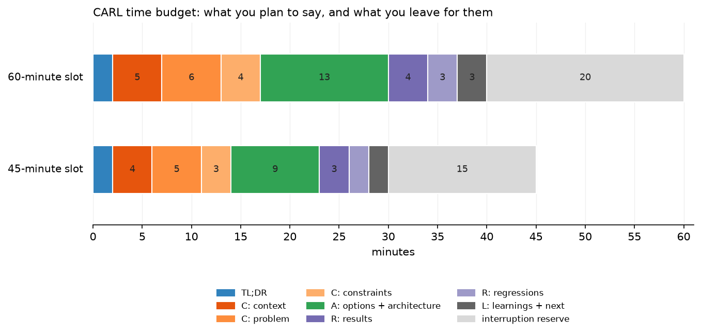

# The CARL framework

> **Why this matters at staff level.** The deep-dive round is scored on whether you can
> defend decisions, and a structure is what keeps you defending decisions instead of
> recounting a calendar. CARL (Context, Actions, Results, Learnings) is the structure your
> own StreetSmart deck already uses. This chapter turns it into a delivery method: the
> minute budget, the slide count, the diagram build order, and what an interviewer is
> writing down while you talk.

## TL;DR: the interview card

* CARL: **C**ontext (the system, the scale, the constraint), **A**ctions (the options, the
  decision rule, the architecture), **R**esults (per-slice evidence plus what regressed),
  **L**earnings (the transferable rule and what you would do differently).
* STAR is built for one incident. CARL is built for a multi-quarter project where the
  argument lives in the alternatives you rejected.
* Budget 30 speaking minutes in a 45-minute slot, 40 in a 60-minute slot. The rest belongs
  to them. A deck that fills the slot never reaches Learnings.
* Actions gets 30% of your speaking time. Context plus problem plus constraints together
  get about 40%, and half of that is the constraint argument.
* 10 to 14 slides. One claim per slide. The headline is a sentence with a verb in it.
* Build the architecture diagram in four moves: existing pipeline, the box you replaced,
  the inside of that box, the annotations (frozen, cached, trained). Never paste it
  finished.
* Take challenges immediately; park curiosities visibly and return to them by name.
* Announce transitions with the time: "that is context, four minutes on constraints, then
  the bulk on the architecture".
* The five deep-dive killers: timeline narration, results with no counterfactual, no owned
  failure, "nothing" as the answer to what you would do differently, and credit you never
  make explicit.

## 1. Why CARL and not STAR

STAR (Situation, Task, Action, Result) was designed for behavioral incidents, and Amazon
still recommends it for exactly that ([Amazon: the interview
loop](https://amazon.jobs/content/en/how-we-hire/interview-loop)). Applied to a six-month
ML project it breaks in three places.

The **Task** slot is empty. On StreetSmart the task was "fix North American sign
classification", which is one sentence, and spending a slide on it wastes the minute where
the interviewer decides whether the project was hard. What belongs there is the constraint
set: the backfill window, the European non-regression bound, the latency and cost budgets.
STAR has no slot for constraints, so candidates using it drop them, and a project without
constraints sounds like a project that could have been done by anyone.

The **Action** slot is singular. STAR asks what you did. An ML project's Actions section
has to carry an argument: here were four paths, here is the rule that ordered them, here is
the one I chose and the evidence that the choice was right. The singular framing pushes
candidates into "I built a fusion model", which is a description of an outcome and tells
the interviewer nothing about judgment.

**Result is terminal.** STAR ends on the number. The staff signal lives one step past the
number, in what the project taught you that you now apply elsewhere, and in what the
project cost you that you did not anticipate. CARL's fourth section exists for that, and it
is the section most candidates cut for time, which is the wrong cut.

| | STAR | CARL |
|---|---|---|
| Designed for | one behavioral incident, 3 to 5 minutes | one engineering project, 30 to 40 minutes |
| Constraints | no slot | inside Context, and they drive Actions |
| Alternatives | no slot | the spine of Actions |
| Failure | optional | Results carries what regressed |
| Generalisation | no slot | Learnings |
| Best used for | [chapter 04](04-behavioral-leadership.md) questions | the presented deep dive |

Use both. CARL for the deep dive; STAR inside it whenever the interviewer asks a
behavioral question mid-round ("how did the partner team react to that?").

### What each section is for

**Context** answers "was this hard, and was it real?" Scale, stakeholders, the prior system,
the baseline it achieved, and the constraint set. The test of a good Context section: after
it, the interviewer could state your problem back to you in one sentence, including why it
is difficult.

**Actions** answers "did you make good decisions?" Options, the rule that ordered them, the
chosen architecture explained to the level of what is frozen and what is trained, and the
ablation that justifies the part of the design someone would challenge.

**Results** answers "do you know what actually happened?" Per-slice numbers, the
counterfactual, the significance argument, and the regressions. A Results section with only
good news reads as a Results section you did not look at closely.

**Learnings** answers "will you make the rest of my team better?" Transferable rules, stated
so that they apply to a system the interviewer owns, plus what you would do differently and
what you would do with another quarter.

## 2. The time budget

{ width="720" }

The grey tail is the point of the chart. In a 45-minute slot, plan 30 minutes of material
and leave 15 for interruption; in a 60-minute slot, plan 40 and leave 20. Interviewers who
ask nothing are rare, and a deck timed to fill the slot means you reach the regressions at
minute 44 and skip them, which removes the two most valuable sections of your story.

| Section | 45 min | 60 min | What you must land |
|---|---|---|---|
| TL;DR | 2 | 2 | problem, decision, headline number, one learning |
| Context: the system | 4 | 5 | scale, stakeholders, prior model, baseline |
| Context: the problem | 5 | 6 | the shift, the failure clusters, why the model could not fix itself |
| Context: constraints | 3 | 4 | the KPI hierarchy and the decision rule |
| Actions | 9 | 13 | four options, why three died, the architecture, the ablation |
| Results | 3 | 4 | per-slice table read by row, the counterfactual |
| Results: regressions | 2 | 3 | two regressions, diagnosis, mitigation, residual |
| Learnings and next | 2 | 3 | transferable rules, what you would do differently |
| Reserve | 15 | 20 | theirs |

Two rules that keep the budget honest. Rehearse with a visible timer and write the target
minute on each slide's notes ("constraints, by 14:00"). And decide in advance what you drop
when you are five minutes behind: for StreetSmart, the guide-sign cluster and the detailed
per-token audit story go first, the decision rule and the regressions never go.

## 3. The deck

Ten to fourteen slides for a 45-minute slot. Fourteen is already too many if any of them
has two claims on it.

| # | Slide | The one claim |
|---|---|---|
| 1 | Title | what, where, when, your role in six words |
| 2 | TL;DR | the whole story in four bullets |
| 3 | The system | what it does and at what scale |
| 4 | Stakeholders and prior model | who consumes the output and what the baseline was |
| 5 | The problem | the distribution shift, with two side-by-side sign examples |
| 6 | Failure clusters | the four clusters and the recall numbers that define them |
| 7 | Constraints and KPI hierarchy | primary, secondary, tertiary, plus the binding constraints |
| 8 | The decision rule | one sentence, large type, nothing else on the slide |
| 9 | Options | four rows, one disqualifying sentence each |
| 10 | Architecture | the diagram, built in four steps |
| 11 | Ablation | latency against recall, shipped point marked |
| 12 | Results | the per-cluster table |
| 13 | Regressions | two rows: observed, hypothesis, mitigation, residual |
| 14 | Learnings and impact | five rules, four impact numbers |

Then an appendix of backup slides, which is where a staff candidate separates from a senior
one: the label pipeline, the A/B design and its power calculation, the seed-variance method
for the non-regression bound, the cost model, the failure-case gallery, the rollout plan.
You do not present them. You flip to one when someone asks, and the flip itself tells the
room you expected the question.

**Slide craft that survives a hostile clock.**

Write headlines as assertions. "Frozen backbones make the backfill head-only" beats
"Architecture". The interviewer who looks at the slide for two seconds while writing a note
should still receive the claim.

One claim per slide means one number per slide gets the emphasis. The per-cluster table is
the exception, and it is the exception because you will read it by row out loud.

No slide of bullet points that you then read aloud. If the words are on the slide and in
your mouth at the same time, the interviewer stops listening and reads ahead.

Put the units and the denominator on every number. "1.4B crops/day" and "P95 280 ms" are
claims; "1.4B" alone invites "of what?" and you lose thirty seconds.

Keep your slide count low enough that you never say "I will skip this one". Skipping slides
in front of an interviewer signals that you built the deck for a different audience.

## 4. Drawing the architecture incrementally

The strongest five minutes in a deep dive is usually the architecture explanation, and the
most common way to waste it is to put the finished diagram on screen and then narrate its
parts. The finished diagram answers "what did you build" while the interviewer is still
asking "why does this exist". Build it in four moves instead, either as slide builds or,
at a whiteboard, by drawing.

**Move 1: what already existed.** Draw the production pipeline end to end, no new parts.
Ingest, detect, classify, transcribe, pose, tracks, output. Say the scale as you draw.
Now the interviewer has the system in their head, and everything after this is a diff.

**Move 2: the box you touched.** Circle exactly one box. "The fusion classifier replaces
only the Stage-2 classifier. Detection, OCR, pose and tracking are untouched, and I will
come back to why that was a hard constraint rather than a convenience." A staff-level
interviewer relaxes here, because scope discipline is the thing they are most often
disappointed by.

**Move 3: inside the box.** Two parallel branches, then the join. Draw the vision branch,
then the text branch, then the cross-attention head, then the classification head. Give the
shapes as you draw them; an interviewer who hears "the text branch is a sequence of token
embeddings, so the head attends over tokens rather than over a pooled vector" now
understands your ablation result before you show it.

**Move 4: the annotations.** Snowflakes on the frozen blocks, a note on what is cached, a
note on what is trained, the marginal latency on the edge that carries it. The annotations
are the argument: frozen means cached means head-only backfill means the 6-week window
holds.

Each move takes 45 to 75 seconds, and each is a coherent stopping point. When the
interviewer interrupts after move 2 (they often do, because move 2 is where the scope
question lives), the diagram on screen is still exactly right for the conversation you are
now having.

At a whiteboard, use one colour for what existed and a second colour for what you added,
and leave the bottom third of the board empty for the parked-question list.

## 5. Running the room

**Interruptions come in three kinds, and you triage them in about two seconds.**

A *clarifier* ("is that per day or per second?") gets one sentence and you continue. Do not
reward a clarifier with a digression.

A *challenge* ("why would cross-attention beat a gate here?") gets answered now, in full.
The challenge is the round. Candidates who defer a challenge to a later slide read as
evasive, and the interviewer has already written the note by the time you get there.

A *curiosity* ("how did you handle Japanese signs?") gets parked, out loud and visibly:
"That is a good one and I have an answer, it fits better after results. Parking it." Then
write it where they can see it. The visible list is what makes parking credible rather than
dodging.

Return to parked questions by name, unprompted: "Back to your question about other
countries." If you reach the end with an unanswered parked item, answer it in the last
minute or in your follow-up note. An unreturned park costs more than the answer would have.

**Transitions.** Say the section you are leaving, the section you are entering, and the
time you plan to spend. "That is the constraint set. Nine minutes on the options and the
architecture, then results." Three sentences of this per deep dive makes the difference
between a candidate who presented and a candidate who ran the room.

**When you are behind.** Say so and re-plan aloud: "We are at 28 minutes and I have
results, regressions and learnings left. I am going to give you results in two minutes and
spend the time on the regressions, because those are the more interesting slides." You have
just demonstrated prioritisation under a deadline, which is a competency on the rubric.

**When you do not know.** "I do not have that number in my head. What I remember is the
shape: the tail classes were a few thousand examples in total, and the fix was reweighting
rather than resampling. I can send you the exact figure." Precision about the boundary of
your memory reads as trustworthy. Guessing a number and being caught costs the round.

## 6. What they probe for, section by section

| Section | What the interviewer is testing | The probe you should expect | What a weak answer sounds like |
|---|---|---|---|
| TL;DR | can you compress | "in one sentence, what did you do?" | a two-minute preamble |
| Context | is this real and was it yours | "what was your role versus your manager's?" | "we" with no boundary |
| Problem | diagnosis or guesswork | "how did you rule out a labelling problem?" | "the model just was not good enough" |
| Constraints | are the constraints real | "what would have happened if you had broken the backfill window?" | a constraint list nothing depends on |
| Options | did you consider their option | "why not fine-tune? why not a VLM?" | options you clearly invented afterwards |
| Architecture | depth of understanding | "what exactly attends to what, and what are the shapes?" | naming a component without its mechanism |
| Ablation | do you know why it worked | "is the lift from cross-attention or from more parameters?" | "cross-attention is more expressive" |
| Results | evidence discipline | "how many seeds, and what is the variance?" | one aggregate number |
| Regressions | ownership | "what did you break?" | "nothing regressed" |
| Learnings | leverage | "what would you tell a team starting this today?" | a restatement of the results |

## 7. Failure modes, and the repair for each

**Timeline narration.** "In October we scoped it, in November we ran the first ablation."
The interviewer cannot grade a calendar. Repair: make every slide headline a decision or a
claim, and forbid yourself the words "then we".

**Results without the counterfactual.** Recall went up 24 points against what? A frozen
baseline measured on the same slice, in the same window, with the same label set. Without
the comparison, a number is a press release. Repair: for every number, rehearse the
sentence "the comparison is X, measured on Y, over Z examples".

**No owned failure.** A project with no regression either did not ship or was not examined.
Repair: lead with your regressions as a section, with diagnosis and bound. The reader's
StreetSmart deck already does this, which is why it is a strong deck.

**"What would you do differently?" answered with "nothing".** This answer sinks deep dives at staff
level, because it says either you did not
reflect or you are managing the interviewer. Repair: prepare two answers, one about a
technical choice and one about a process or people choice, each with what it would have
cost to do it the better way.

**Ambiguous credit.** "We decided to freeze the backbones." Who is we? Repair: prepare the
credit map (who proposed, who built, what you owned) and use "I" for your decisions and
named roles for others: "the OCR team owned the confidence head; I specified the interface
and the eval it had to pass."

**Constraints as decoration.** Listing the latency budget and then never referring to it.
Repair: every constraint you state must kill at least one option later, or cut it.

**Aggregates only.** "Overall accuracy rose 9 points" hides both the lift and the
regression. Repair: read the table by row.

**Defensiveness.** A challenge answered with a justification rather than with evidence.
Repair: rehearse the phrase "that is the right question, here is the evidence I have and
here is what it does not cover".

## 8. Rubric: score your own rehearsal

Record the rehearsal, watch it once, and score each row 1 to 4. A staff-level run has no row
below 3 and at least three rows at 4. Re-score after each mock; track only the rows that
moved.

| Row | 1: weak | 2: mixed | 3: senior | 4: staff |
|---|---|---|---|---|
| **Compression** | takes 5 minutes to reach the point | TL;DR present but vague | 90-second TL;DR with the number in it | TL;DR that makes the interviewer ask the question you wanted |
| **Context economy** | 12 minutes of background | covers the system, drifts | scale, stakeholders, baseline in 4 minutes | same, and every fact reappears later as a constraint |
| **Problem diagnosis** | asserts the model was weak | describes symptoms | names the mechanism behind the failure | shows the audit that produced the clusters, with counts |
| **Constraint precision** | vague ("we had deadlines") | names constraints | quantifies them | uses them to disqualify options before accuracy is discussed |
| **Option coverage** | one path | two, one straw man | the real alternatives with reasons | includes the option the interviewer would have chosen, fairly argued |
| **Architecture depth** | names components | explains data flow | explains mechanism and shapes | explains the inductive bias and what would break it |
| **Evidence** | one aggregate number | offline numbers | per-slice numbers with a baseline | plus variance, seeds, sample size, and the A/B design |
| **Owned failure** | none | a failure caused by others | a failure you caused, described | caused, diagnosed, bounded, mitigated, monitored |
| **Learnings transfer** | restates results | generic lessons | rules that apply to other systems | rules stated as advice the interviewer could act on tomorrow |
| **Credit clarity** | "we" throughout | mixed | "I" on decisions, names on others | explicit about what you did not do |
| **Interruption handling** | loses the thread | answers, restarts the slide | answers and resumes cleanly | triages, parks visibly, returns by name |
| **Time control** | overruns, skips slides | finishes, no reserve | finishes with reserve | announces transitions and re-plans aloud when behind |

## 9. Rehearsal protocol

Five passes, in this order, spread over a week.

1. **Silent pass.** Read your own deck and write, per slide, the one sentence you intend to
   land. If a slide has no sentence, it has no reason to exist.
2. **Timed solo pass.** Out loud, standing, timer visible, no stopping to fix anything.
   Record it. Note the minute at each section boundary against the budget table.
3. **Hostile pass.** Give a colleague the probe list from
   [chapter 02](02-streetsmart-deep-dive.md) and ask them to interrupt three times: once in
   Context, once mid-architecture, once on the results table. Score the interruption row.
4. **Non-expert pass.** Present to an engineer who does not work in vision. Anything they
   cannot follow is a place where you skipped a mechanism, and interviewers outside your
   domain sit on most panels.
5. **Compression pass.** Deliver the same project in 90 seconds, then in 5 minutes, with no
   slides. This is the version that shows up in the behavioral round.

!!! interview "Interview question"
    **"You have 45 minutes. How will you use them?"** Some interviewers open with this. It
    is a free question and most candidates waste it with "I will walk through my project".

    **Strong answer.** "Two minutes of summary so you know where we are going, about
    eight minutes on the system and why the problem was hard, three on the constraints
    because they disqualified most of the design space, then the bulk, nine or ten minutes,
    on the options and the architecture. Results and the two regressions after that, and I
    will keep about fifteen minutes for your questions. If you would rather go deeper on
    one part, tell me now and I will cut the context in half."

    **Staff-level follow-up.** "What would you cut if I use more than fifteen minutes?"
    Answer with the specific slides and the reason: the tail clusters and the audit
    tooling, because the decision rule and the regressions carry the story.

## Exercises

**★ 1. Headline rewrite.** Take your current deck and rewrite every slide title as a
sentence with a verb. Count how many titles were nouns.

??? success "Solution"
    A typical first deck has 10 of 13 titles as nouns ("Architecture", "Results",
    "Ablation"). The rewrite forces a claim per slide: "Cross-attention buys 5.9 points of
    recall for 1.8 ms", "Freezing both backbones makes the backfill head-only". After the
    rewrite, read the titles alone top to bottom. They should form the TL;DR. If they do
    not, your deck has a structural gap, usually a missing constraint slide.

**★ 2. The 90-second cut.** Write your TL;DR, time it, then cut it to 90 seconds without
losing the number or the decision.

??? success "Solution"
    The four things that survive: the problem in one clause, the constraint that shaped the
    solution, the decision, the headline number. Everything else (team size, timeline,
    tooling) is answerable on request. A useful test: read the cut version to someone and
    ask them what question they want to ask next. If it is "how did you do that?", the cut
    is right. If it is "what were you doing?", you cut the wrong clause.

**★★ 3. Build-order drill.** Draw your architecture diagram four times on paper, each time
adding only one move (pipeline, replaced box, internals, annotations). Time each move.

??? success "Solution"
    Target 45 to 75 seconds per move, with the whole build under four minutes including
    narration. If move 3 takes two minutes, your architecture has too many boxes for a live
    draw; collapse the ones you never get asked about into a single labelled block and keep
    the detail in a backup slide.

**★★ 4. Interruption drill.** Have a colleague interrupt you mid-sentence three times with
a challenge. Resume without restarting the slide.

??? success "Solution"
    The mechanic that makes this work: before answering, note the word you stopped on
    ("...cached embeddings"). Answer fully. Then resume with "So, cached embeddings, which
    is what makes the backfill head-only." Two seconds of bridging beats rewinding to the
    top of the slide, which costs 30 seconds and signals that you were reciting.

**★★★ 5. Counterfactual audit.** For every number in your deck, write the comparison,
the slice, the sample size and the measurement window. Delete any number where you cannot.

??? success "Solution"
    Most decks lose two to four numbers on this pass, and they are usually the ones that
    would have been challenged. What replaces them is either a shape ("the tail classes had
    on the order of a few thousand examples") or a sourced number you retrieve before the
    interview. Deleting a number you cannot defend is cheap; being caught unable to defend
    one is not.

## References

* Amazon Jobs, [The interview loop](https://amazon.jobs/content/en/how-we-hire/interview-loop)
  and [Leadership Principles](https://amazon.jobs/content/en/our-workplace/leadership-principles):
  the clearest public statement of STAR-structured behavioral grading.
* About Amazon, [Your complete guide to the Amazon interview process](https://www.aboutamazon.com/news/workplace/amazon-interview-guide).
* Hello Interview, [The system design interview: what is expected at each level](https://www.hellointerview.com/blog/the-system-design-interview-what-is-expected-at-each-level),
  for the senior-to-staff gradient the rubric above scores against.
* [What staff-level signal looks like](../preface/interview-signal.md), this book, for the
  four-round view and the general answer structure.
