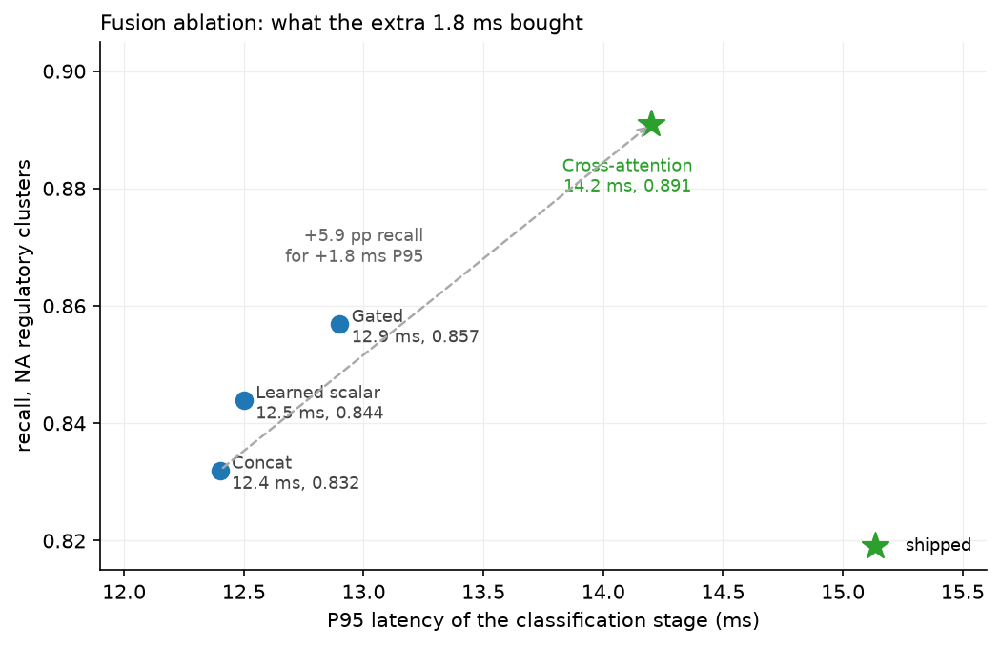
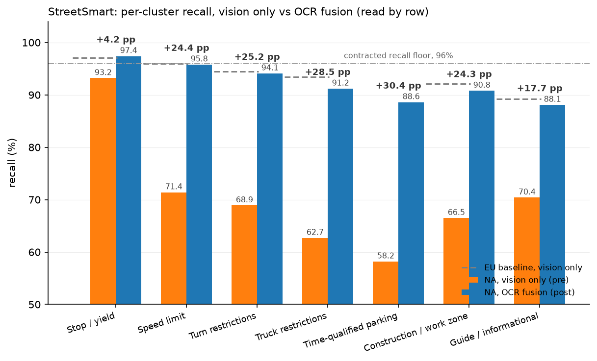
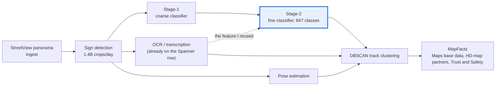
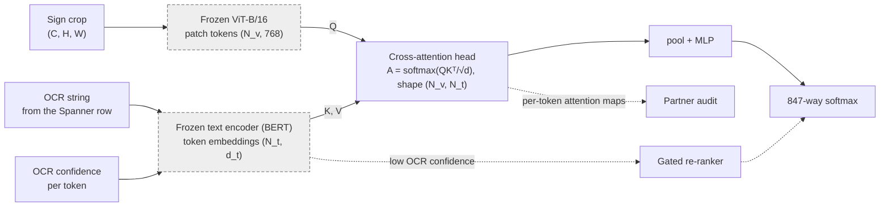

# Worked deep dive: StreetSmart multimodal sign classification

> **Why this matters at staff level.** This is your deck, expanded into the chapter you
> would write if you had to teach someone else to deliver it. Everything here comes from
> the project you led at Google Maps between Q4 2024 and Q2 2025. Preparation is mostly a
> sorting job: for each fact, decide which claim it supports and which question it answers.
> Every section here is organised that way.

## TL;DR: the interview card

* The system: detect, classify, transcribe, pose, at 1.4B crops/day, P95 under 280 ms
  online, feeding Maps base data, automotive HD-map partners with contracted recall floors,
  and Trust and Safety.
* The problem: a convention shift. Vienna Convention signs encode the regulation in the
  pictogram; MUTCD signs carry it in the legend. A vision-only classifier at 96.4% EU
  regulatory recall fell to 71.4% on NA speed limits, 68.9% on turn restrictions, 62.7% on
  truck restrictions.
* The diagnosis: a missing modality, not a weak encoder. Two truck signs differing only by
  "13'-6"" versus "14'-0"" are the same image.
* The constraint that decided the design: any path touching the vision backbone or breaking
  the 6-week backfill window over 6 PB was disqualified before accuracy was considered.
* The decision: reuse the Google OCR output already sitting on the same Spanner row. Frozen
  ViT, frozen BERT, small cross-attention head, 847-way classifier.
* The ablation: cross-attention 0.891 recall at 14.2 ms P95, gated 0.857 at 12.9, learned
  scalar 0.844, concat 0.832. Five to six points of recall for 1.8 ms.
* The results, by row: +24.4 pp recall on speed limits, +25.2 on turn restrictions, +28.5 on
  truck restrictions, +30.4 on time-qualified parking. EU held within seed variance.
* The regressions you caused: pictogram-strong classes under noisy OCR (-1.1 pp, mitigated
  to -0.2), and speed-limit precision under digit confusions (-0.6 pp).
* The learning that transfers: modality reliability has to be modelled. OCR confidence is an
  input feature, not a downstream filter.

## The 90-second TL;DR, verbatim

Rehearse this until it comes out at conversational speed without rushing. Time it. If it
runs past 100 seconds, cut the stakeholder list, never the numbers.

!!! example "Say exactly this"
    "I led the sign classification work on StreetSmart at Google Maps, from Q4 2024 through
    Q2 2025. StreetSmart detects, classifies, transcribes and poses every street sign
    visible in StreetView panoramas, about 1.4 billion crops a day. The output feeds Maps
    base data, automotive HD-map partners who hold us to contracted recall floors, and
    internal Trust and Safety.

    The classifier was a frozen ViT-B/16 with per-class heads. In Europe it was healthy:
    96.4% recall, 94.1% precision on regulatory signs, above the customer floor. The same
    model in North America was well below it: 71.4% recall on speed limits, 68.9% on turn
    restrictions, 62.7% on truck restrictions.

    The reason is a convention difference. European signs encode the regulation in the
    pictogram, so shape and colour and icon are enough. American signs are text-first: a
    13-foot-6 clearance restriction and a 14-foot clearance restriction are the same white
    rectangle with the same truck silhouette and a different legend. No amount of vision
    capacity fixes that, because the discriminating signal is not in the pixels the encoder
    is trained to use.

    We already ran OCR on every sign crop for transcription, and its output sat on the same
    Spanner row as the crop. I proposed reading it back into the classifier: frozen ViT in
    one branch, frozen BERT over the OCR string in the other, joined by a small
    cross-attention head into an 847-way classifier. Both backbones frozen, which meant zero
    European regression by construction and a head-only backfill.

    Every text-discriminated North American cluster gained between 17 and 30 points of
    recall, the pictogram-strong classes moved slightly, and Europe held within seed
    variance. Marginal latency was 1.8 milliseconds of P95, and the backfill over 6
    petabytes finished in 4.2 weeks inside a 6-week window. It also introduced two
    regressions that I can walk you through, both caused by trusting OCR more than it
    deserved."

The last sentence is deliberate. It offers the interviewer the most interesting part of the
story and makes the offer before they have to dig for it.

## Context: the system

Say this in four minutes and treat every fact as something you will use again later.

**What it does.** StreetSmart runs detect, classify, transcribe, pose over StreetView
panoramas, and emits sign facts into MapFacts. The pipeline is ingest, then detection, then
a two-stage classification cascade with parallel branches for transcription and pose, then
DBSCAN clustering of per-crop detections into physical sign tracks, then MapFacts.

**The scale.** 1.4 billion crops per day in batch. P95 at or under 280 ms on the online
path. Both numbers do work later: the first makes any per-crop cost increase expensive, and
the second is the budget the fusion head has to fit inside.

**Who consumes it.** Maps base data for consumer routing. Automotive HD-map partners
building L2+ ADAS, who hold contracted recall floors, which is why a per-class recall floor
and not an aggregate accuracy number is the primary KPI. StreetView capture operations.
Internal Trust and Safety, who audit.

**The prior model.** A frozen ViT-B/16 with per-class heads, with a country-code embedding
used for regional routing. No textual signal from the sign reached the classifier at all,
even though the pipeline was already reading the text on every sign for transcription.

**The European baseline.** Vision-only, country-code routed: about 96.4% recall and 94.1%
precision on regulatory classes, which already met the customer floor. Naming this baseline
early is what makes the next section land, because it establishes that the model was not
broken in general. It was broken in one region, which is a different kind of problem and
implies a different kind of fix.

!!! tip "Delivery note"
    The interviewer is deciding, during Context, whether this project was hard. The facts
    that do that work are the contracted recall floors (someone is paying for a number) and
    the 1.4B crops per day (a cost per inference that is a business line item). Lead with
    those two, not with the org chart.

## The problem: a convention shift, not a weak model

European signage follows the Vienna Convention on Road Signs and Signals, which uses
symbols so that a driver who cannot read the local language can still read the sign. North
American signage follows the MUTCD, which is more text-oriented. This is a documented
difference between the two systems, not a quirk of your data
([Vienna Convention](https://en.wikipedia.org/wiki/Vienna_Convention_on_Road_Signs_and_Signals);
[MUTCD](https://en.wikipedia.org/wiki/Manual_on_Uniform_Traffic_Control_Devices);
[comparison of MUTCD-influenced signs](https://en.wikipedia.org/wiki/Comparison_of_MUTCD-influenced_traffic_signs)).
Under Vienna, shape is class, colour is constraint, icon is meaning, and a pixel encoder
recovers all three. Under MUTCD, many regulatory signs share a generic white rectangle and
differ only in the legend printed on them.

The error audit produced four clusters. Present them as a table and narrate two of them; the
table carries the rest.

| Cluster | What the pixels show | What the text says | Why vision alone fails |
|---|---|---|---|
| Trucking restrictions | identical white rectangle, identical truck silhouette, identical chevron arrow | 13'-6" vs 14'-0", TONS vs LBS, HAZMAT NO/YES | the classes are pixel-identical at the encoder's input; the encoder collapses them into one mode |
| Time-qualified parking | white rectangle with a multi-line text panel | NO PARKING / 8 AM - 6 PM / MON-FRI / EXCEPT SUNDAY | two signs differing only by the literal word NO carry opposite legal force; no EU analog exists, so the pretrained features never saw the distinction |
| Turn restriction vs permission | red circle and slash (R3-1) against a white rectangle with a green legend (R3-5L) | NO LEFT TURN vs LEFT TURN ONLY vs NO TURN ON RED vs LEFT TURN YIELD ON GREEN | EU has this as a low-rate confuser; MUTCD multiplies the base rate about fourfold and adds permutations |
| Construction and work zones | coarse orange diamond | WORKERS AHEAD, FLAGGER AHEAD, ROAD WORK NEXT 2 MILES, SHOULDER WORK | the model collapsed the entire orange-diamond cluster into one node |

The sentence that carries the section: for these classes the discriminating evidence is text
rendered on the sign, and the classifier had no path by which text could reach it. That is a
statement about the input, so no change to capacity, data volume or loss function fixes it.

### The general lesson: a missing modality versus a weak model

This distinction is worth carrying into any interview, because the same confusion appears in
ranking, fraud and document systems. A model is *weak* when the information needed to
separate two classes is present in its input and the model fails to extract it. A modality is
*missing* when that information is absent from the input, in which case the Bayes error on
those classes is bounded away from zero and every fix that adds capacity is wasted money.

Three diagnostics separate the two, and you should be ready to describe all three because
the interviewer will ask how you knew.

**The human-with-the-same-input test.** Show a human the exact input the model receives, at
the model's input resolution, with no context. If a careful human cannot separate the
confused pair, the model cannot either. On the trucking cluster a human sees two white
rectangles with a truck and an arrow, and the digits at 224-pixel input are often
illegible after downsampling, which is the finding that justified the whole project.

**The scaling test.** Train a larger encoder, or train on many times more labelled examples
of the confused slice, and look at the slope. Error that does not move with capacity or data
on a specific slice, while moving normally elsewhere, indicates that the slice is limited by
its input.

**The oracle test.** Give the model the missing signal as a ground-truth feature (here, the
transcribed legend from a human or from an offline high-accuracy OCR pass) and measure the
ceiling. If accuracy jumps to near the label noise floor, you have located the missing
modality and you have measured the prize before you build anything. This is the cheapest
experiment in the project and the one that makes the proposal fundable.

!!! warning "The mistake this prevents"
    The default reaction to a regional accuracy collapse is "collect more regional data and
    fine-tune". On this project that reaction would have spent six weeks of backfill and put
    EU customers at risk in exchange for a ceiling set by the input, because more labelled
    examples of two pixel-identical classes teach the model the class prior and nothing else.

## Constraints: the KPI hierarchy and the decision rule

State the KPIs as a hierarchy, in order, and say the word "hierarchy". Multi-objective
projects where the candidate cannot order the objectives are the ones that drift.

| Rank | KPI | The bar |
|---|---|---|
| Primary | per-class recall on NA regulatory clusters | customer floor at or above 96% recall with at least 92% precision, per class |
| Secondary | EU regression bound | must hold within seed variance on EU regulatory classes, non-negotiable |
| Tertiary | per-class precision, P95 latency, per-inference cost | unchanged budgets |

Then the binding constraints, each with the consequence of breaking it.

**The backfill window.** A single batch revision over about 6 PB of historical North
American imagery, in 6 weeks. Any design whose backfill exceeds the window does not ship
this cycle, because the revision is scheduled once and the downstream consumers plan around
it.

**EU non-regression.** European customers are already served at the contracted floor.
Anything that touches the vision encoder changes their predictions, and a regression there
costs a contract to buy a metric in another region.

**The online SLA.** P95 latency budget unchanged at 280 ms, so the fusion head has to fit
inside the slack of the existing classification stage.

**Cost.** Per-inference budget unchanged at 1.4B crops per day, which rules out anything
whose marginal cost per crop is more than a rounding error.

### The decision rule

> Any path that touches the vision backbone or breaks the 6-week backfill window is
> disqualified before accuracy is considered.

Put this on its own slide, in large type, with nothing else on it. In a deep dive this is
the sentence most likely to be quoted back to you, and it is the strongest single piece of
staff signal in the deck. Four reasons, and you should be able to give at least two of them
when asked why you framed it that way.

**It makes the search lexicographic instead of scalarised.** With four objectives and no
ordering, every option looks defensible and the team argues about weights for a month. With
a rule, the feasible set shrinks first and accuracy is compared only inside it. That is the
difference between a design review that converges and one that recurs.

**It is stated before the results, so it cannot be fitted to them.** A constraint invented
after an experiment is a rationalisation. A constraint published in the design doc, with the
cost of violating it written down, is a commitment device, and the interviewer can tell the
difference by asking when you wrote it.

**It protects an existing customer contract ahead of a new metric.** The EU floor is revenue
someone already booked. Trading certain revenue for an uncertain gain needs a much higher
bar than trading effort, and saying so out loud is a business-judgment signal that most
candidates never produce.

**It delegates.** Anyone on the team can apply the rule without you in the room. When a
teammate proposes an idea that touches the backbone, the rule answers them at 11 pm on a
Tuesday. Rules that survive your absence are what "staff" means on the ownership row of the
rubric in [the CARL chapter](01-carl-framework.md).

!!! interview "The challenge you will get"
    **"Isn't that rule just an excuse to avoid the hard work of retraining?"**

    "It would be if the retrain had a ceiling worth the risk. It does not. The evidence that
    decided it was the oracle test: when we handed the classifier the transcribed legend,
    the confusable clusters separated, and when we scaled vision-only capacity and data on
    the same slice, they did not. So the retrain buys a bounded gain on a signal that is not
    in the pixels, and it costs an EU regression risk plus a backfill that does not fit the
    window. If the oracle test had come back the other way, and the text had not separated
    the clusters, I would have argued for the retrain and for a longer window."

## Actions: the proposal

The proposal in one sentence: treat the existing Google OCR output as a free text feature and
fuse it into the classifier through a small cross-attention head, with both backbones frozen.

What made it cheap: detection to OCR already runs on every sign crop, downstream of
classification, and is used for transcription. Its output sits on the same Spanner row as the
crop. Reading it into the classifier is a feature-engineering change against a column that is
already populated, so the marginal compute is near zero and the feature is already paid for.

State the non-goals explicitly, because a scoped project is a credible project:

* No retraining of the vision backbone (backfill cost, EU regression risk).
* No generalist VLM at inference (latency and cost out of band by more than two orders of
  magnitude).
* No change to detection or pose estimation, which already meet SLA.

### The four options

| Option | What it is | Verdict |
|---|---|---|
| A. Heuristic post-filter | keep the vision-only model, apply rules over the OCR text to disambiguate the top-k | rejected: does not scale across 847 classes, and the rule stack is not auditable |
| B. Vision-backbone fine-tune | fine-tune the ViT on US-labelled crops, stay vision-only | rejected: EU regression risk, backfill exceeds the 6-week window, and the signal is not in the pixels |
| C. Multimodal fusion | frozen ViT and frozen BERT into a cross-attention head, then an 847-way head | chosen: zero EU regression by construction, head-only backfill, auditable |
| D. Fine-tuned VLM | drop the bespoke head, call a fine-tuned Gemini per crop | rejected: more than 200x over SLA, more than 50x over cost, black box, worse on the hard signs. Held as an out-of-distribution fallback for roughly the 1% tail |

Present the options as a table and speak only the disqualifying clause for each rejected row.
Candidates lose four minutes here describing options they did not take. The interviewer needs
one sentence per row and the confidence that the sentence is true.

Two details make this table read as real rather than reconstructed. Option D stayed alive as
a fallback for the tail instead of being dismissed, which shows you evaluated it on its
merits. And option A is rejected partly on auditability, which is a requirement that comes
from the partner audit rather than from the metric.

### The architecture

Frozen ViT in one branch, frozen BERT over the OCR string in the other, joined by a
cross-attention head, into an 847-way classifier. Capacity goes into the fusion head.
Freezing both backbones has three consequences you should name in this order:

1. Vision embeddings are cached, so the 6 PB backfill re-runs the head only.
2. EU predictions cannot move for reasons unrelated to the new branch, because the EU path
   through the vision encoder is bit-identical to what shipped before.
3. Training is cheap and the iteration loop is short, since only the head has gradients.

The fusion mechanism, written the way you would write it at a whiteboard. Let the frozen ViT
produce patch tokens $X_v \in \R^{N_v \times d_v}$ and the frozen text encoder produce token
embeddings $X_t \in \R^{N_t \times d_t}$. Project both into a shared width $d$ and let the
vision side ask the questions:

$$
Q = X_v W_Q \in \R^{N_v \times d}, \qquad
K = X_t W_K \in \R^{N_t \times d}, \qquad
V = X_t W_V \in \R^{N_t \times d}
$$

$$
\boxed{\;A = \softmax\!\left(\frac{QK^{\top}}{\sqrt{d}}\right) \in \R^{N_v \times N_t},
\qquad Z = A V \in \R^{N_v \times d}\;}
$$

$Z$ is pooled and passed to the 847-way head. The attention matrix $A$ is the artifact the
partner audit consumes: for each image region, which transcribed tokens the classifier
attended to when it produced its decision. Compare that with the alternatives, where the text
contributes a single pooled vector and there is nothing per-token to show an auditor.

!!! note "Mark this one from memory"
    The direction of the queries is a design choice with consequences: queries from vision
    attending over text tokens gives you one attention row per image region, which is what a
    per-token audit map wants. Queries from text attending over patches gives you the
    reverse. **[Confirm from memory which direction you implemented, and be ready to say why;
    if it was text-queries-vision, the audit story is about which image regions supported a
    given legend token.]**

### The fusion ablation

{ width="680" }

| Variant | P95 (ms) | Recall | Mechanism |
|---|---|---|---|
| Concat | 12.4 | 0.832 | pooled vision vector concatenated with pooled text vector, MLP on top |
| Learned scalar | 12.5 | 0.844 | one scalar mixes the two pooled vectors |
| Gated | 12.9 | 0.857 | per-channel gate $g = \sigma(W[\bar{x}_v; \bar{x}_t])$, then $g \odot \bar{x}_v + (1-g) \odot \bar{x}_t$ |
| Cross-attention (shipped) | 14.2 | 0.891 | per-token alignment, $A \in \R^{N_v \times N_t}$ |

Five to six points of recall over concat for 1.8 ms of P95. Three arguments carried the
decision, and you should give all three because any one alone is attackable:

**Mechanism.** The first three variants pool the text before fusing, which destroys token
identity. The discriminating evidence on a truck sign is a specific token ("13'-6"") in a
specific relation to a specific region of the image. A gate can decide how much text to
listen to; it cannot decide which token to listen to.

**The tail.** Lift on tail MUTCD classes with fewer than 50 examples was meaningfully larger
for cross-attention than for gated fusion. Per-token alignment is a reusable mechanism shared
across all classes, so a tail class inherits it; a per-class gate has to be learned from the
tail class's own handful of examples.

**Auditability.** Per-token attention maps were a requirement for the partner audit, which
means the audit requirement and the accuracy argument pointed the same way. Say this second,
never first: leading with the audit requirement makes it sound like the accuracy result was
not needed.

Gated fusion stayed in the architecture, as the low-OCR-confidence re-ranker rather than the
primary path. Keeping a rejected variant for the case it handles well is a detail worth
volunteering, because it demonstrates that the ablation informed the design instead of just
picking a winner.

## Results: read by row

{ width="760" }

| Cluster | EU (P/R) | NA pre (P/R) | NA post (P/R) | ΔRecall |
|---|---|---|---|---|
| Stop / yield (pictogram-strong) | 94.2 / 97.1 | 91.4 / 93.2 | 93.8 / 97.4 | +4.2 |
| Speed limit (numeric) | 93.6 / 96.0 | 78.2 / 71.4 | 91.7 / 95.8 | +24.4 |
| Turn restrictions (NLT/LTO/NTOR) | 92.8 / 94.5 | 74.6 / 68.9 | 90.3 / 94.1 | +25.2 |
| Truck restrictions (weight/height/hazmat) | 91.0 / 93.4 | 69.1 / 62.7 | 88.9 / 91.2 | +28.5 |
| Time-qualified parking (no EU analog) | n/a | 64.8 / 58.2 | 85.1 / 88.6 | +30.4 |
| Construction / work zone | 90.4 / 92.1 | 71.3 / 66.5 | 87.6 / 90.8 | +24.3 |
| Guide / informational (text-heavy, secondary) | 88.7 / 89.2 | 72.0 / 70.4 | 86.4 / 88.1 | +17.7 |

Read three rows out loud and let the table carry the rest. Which three:

**Stop and yield, +4.2.** The control row. Pictogram-strong classes were already close to the
EU number, and they moved a little. If this row had moved as much as the others, the result
would be suspicious, because it would suggest the gain came from retraining the head rather
than from the new modality.

**Speed limit, 71.4 to 95.8.** The headline. Numeric discrimination is exactly what a text
branch is for, and post-fusion the NA number sits within a point of the EU number for the
same cluster, which is the comparison that shows the regional gap closed rather than a new
regional model being tuned.

**Time-qualified parking, 58.2 to 88.6.** The hardest row and the most informative one. There
is no EU analog, so the pretrained vision features had never been asked to make this
distinction, and the entire signal is multi-line text. It is also the row where the remaining
gap is largest, which is the honest place to point when asked what is still broken.

The one sentence to say before the table: "read this by row, because the aggregate hides
both the lift and the risk." Then say what held: EU regulatory classes held within seed
variance.

## Where the new modality hurt

Lead with this section rather than waiting to be asked. Two regressions, both real, both
bounded, both diagnosed.

**Regression 1: pictogram-strong NA classes under noisy OCR.** Observed about -1.1 pp recall
on classes such as generic STOP when OCR returned "ST0P" or "5T0P" at confidence below 0.3.
The hypothesis: cross-attention over-weights the text token even when its prior should be
low, because the model was never given the information that would let it learn a reliability
gate. The mitigation: pass OCR confidence as a token input to the text encoder, and use the
gated-fusion variant as a low-confidence re-ranker. Residual after mitigation, -0.2 pp, which
is inside seed variance.

**Regression 2: speed-limit precision under OCR digit confusions.** Observed about -0.6 pp
precision where OCR confused 25 with 55 or 35 with 85, in low-light or motion-blurred
captures. The hypothesis: TrOCR-style digit confusions are systematic in our capture
distribution, so the text branch reports high apparent confidence on the wrong digit and
cross-attention hands it the decision. The mitigation: calibrate the text branch at a higher
temperature than the vision branch at inference. The follow-up work: a digit-specific OCR
confidence head trained on the StreetView capture distribution.

The unifying diagnosis, and the sentence to end this section on: modality reliability has to
be modelled, not assumed. Both regressions came from treating OCR output as though it were
always trustworthy. When you fuse a learned upstream signal, its confidence is part of the
signal, and a fusion mechanism that cannot see the confidence will learn the average
reliability of the training distribution and apply it to every example.

That generalises directly. In a ranking system, an upstream embedding served from a stale
cache is the same failure. In a fraud system, a third-party score that silently changes its
calibration is the same failure. Say the generalisation out loud; it is what turns a
regression story into a Learnings section.

!!! tip "Why leading with your regressions works"
    An interviewer hearing a clean success story spends the round hunting for the thing you
    left out. An interviewer who has been handed two regressions, with diagnoses and bounds,
    spends the round examining your reasoning instead. You also get to frame the failures on
    your terms, which includes bounding them: "-1.1 pp on one cluster, mitigated to -0.2,
    against +24 to +30 pp on five clusters."

## Learnings and business impact

The five rules, stated so that they apply to a system the interviewer owns:

1. **Modality reuse beats model replacement.** Before proposing a new model, ask what is
   already computed and sitting on the row. Signals that are already paid for have no
   marginal cost and no new dependency.
2. **Per-class, per-region evaluation is the bar.** Aggregate metrics hide lifts and
   regressions equally well.
3. **Frozen backbones are a feature.** Zero regression in an untouched region by
   construction, cached embeddings, and a cheap backfill.
4. **Modality reliability is part of the signal.** Upstream confidence belongs in the model
   as an input, not in a filter downstream of it.
5. **Defensibility is separate from accuracy.** For an audited system, interpretability can
   decide the design.

The impact numbers, delivered in this order:

* Cleared the 96% customer recall floor on every NA regulatory cluster. (Probe 11 below is
  the reconciliation you owe between this claim and the per-cluster table rows that read
  under 96%. Settle it before you present either slide.)
* +1.8 ms marginal P95, with the OCR feature already paid for.
* Zero EU regulatory regression beyond seed variance.
* 4.2 weeks of backfill over 6 PB, inside the 6-week window.
* About 13.2 million fewer NA misclassifications per year, on about 850 million annual crops.

## Questions they will ask, and how to answer

Twenty-five probes. Rehearse them cold, out loud, in one pass, then repair whatever you
fumbled. Where an answer contains a bracketed blank, the fact is yours to supply; leaving the
blank unfilled and discovering it live is how a strong project loses a round.

### 1. "Why not fine-tune the vision backbone?"

*Testing:* whether your constraint was real or convenient.

"Three reasons, in the order I applied them. First, the backfill: fine-tuning changes the
embeddings, so the 6 PB revision becomes a full re-encode rather than a head-only re-run, and
that does not fit in 6 weeks. Second, EU risk: our EU customers are at the contracted floor
today, and any change to the encoder moves their predictions in ways I would then have to
re-validate across every EU class. Third, and the one that actually decided it: the signal is
not in the pixels. Two truck restrictions differ by the string 13'-6" versus 14'-0", and at
our input resolution those glyphs are frequently not resolvable. Fine-tuning would have
bought a bounded gain at an unbounded validation cost. The first two are constraints; the
third is the argument."

### 2. "Why not just use a VLM? Gemini reads text."

*Testing:* whether you can cost an obvious modern answer rather than dismiss it.

"We evaluated it as option D. Per crop, a fine-tuned VLM was more than 200 times over our
online SLA and more than 50 times over our per-inference cost budget, at 1.4 billion crops a
day. It was also worse on the hard signs in our evaluation, which surprised people, and it is
a black box, so it fails the partner-audit requirement that we be able to show which evidence
produced a classification. We kept it alive as an out-of-distribution fallback for about the
1% tail, where the cost is affordable because the volume is small. If our volume were a
million crops a day instead of 1.4 billion, the calculation would come out the other way and
I would have shipped the VLM."

### 3. "How do you know the lift came from cross-attention and not from the extra parameters?"

*Testing:* experimental hygiene. This is the sharpest technical probe on the project.

"The right control is parameter-matched and latency-matched: widen the gated variant's MLP
until its parameter count matches the cross-attention head, retrain both with the same
schedule and seeds, and compare. **[State which controls you ran. If you ran the
parameter-matched gate, give the numbers. If you did not, say so and give the design.]** Two
further controls are cheap and I would want both: shuffle the OCR strings across examples
within a batch, which destroys the alignment while keeping the parameters and the text
statistics, and drop the text branch at inference. If the lift survives shuffling, it is
parameters. The indirect evidence that it is alignment is the tail result: the gap between
cross-attention and gated grows on classes with fewer than 50 examples, which is the opposite
of what a pure capacity explanation predicts, since more parameters help the tail least."

### 4. "What would you have done if OCR were not already computed?"

*Testing:* whether your design was driven by the constraint or by the technique.

"Then the project is a different project and probably does not clear the cost bar in that
form. OCR on 1.4 billion crops a day is a real bill, so I would have started by scoping the
text branch to the crops where it pays: route only the classes where vision-only confidence
is low and the predicted class is in a text-discriminated cluster. That is a cascade, and it
turns a fixed cost into a cost proportional to the ambiguous fraction. I would also have
looked at a much smaller text recogniser, since we do not need transcription quality, only
enough to separate 847 classes, and a cheap recogniser plus a fuzzy match against the legend
vocabulary might be enough. The general version of the answer: when the feature is not free,
you buy it only for the examples whose decision it changes."

### 5. "Your OCR ran downstream of classification. How does the classifier consume it without a cycle?"

*Testing:* whether you understand your own pipeline DAG.

"OCR is keyed on the detection crop, not on the class, so the true dependency is detect, then
OCR, then classify. In the batch path that is a scheduling change on the same Spanner row:
the crop and the transcription are both columns, and the classifier reads a row that is
already populated. **[Fill in what you did on the online path: did the stage order change,
and what did that do to the 280 ms budget? If OCR was already ahead of Stage-2 online, say
so.]** The reason it was cheap in either case is that no new service dependency appeared;
the data was already being produced and stored."

### 6. "How did you pick the 847 classes?"

*Testing:* whether the label space was designed or inherited.

"It is the existing StreetSmart taxonomy for the regions we serve, driven by what MapFacts
consumers and the HD-map partners need to distinguish, which is why it is finer than a public
benchmark taxonomy. **[Fill in: what drove the count, how MUTCD variants map onto classes,
and whether you added or merged classes during this project.]** The design question the
interviewer usually cares about is how you handle classes that differ only by a numeric
value: the choice is a class per value versus a class plus a regressed or transcribed
attribute. We kept the transcription as a separate output, so the classifier decides the
sign type and the transcription carries the value."

### 7. "How did you guard the EU non-regression statistically?"

*Testing:* whether "within seed variance" is a measurement or a phrase.

"The bound is per-class recall on EU regulatory classes, and the comparison is against the
shipped vision-only model on a frozen EU evaluation set. Because both backbones are frozen,
the vision path for EU crops is unchanged by construction, so the only route to an EU
regression is the fusion head itself. To measure it I re-trained the head across seeds and
took the per-class spread as the noise floor, then required the post-fusion per-class recall
to sit inside it. **[Fill in: how many seeds, what the per-class spread was, and what test
you used. If it was a paired comparison on the same crops, say so, because paired tests are
what make small per-class differences measurable at these sample sizes.]** The part I would
defend hardest: the bound is per class, not on the EU aggregate, because an aggregate hides a
regression concentrated in one contracted class."

### 8. "What was your A/B design, and what was it powered to detect?"

*Testing:* online evaluation literacy.

"**[Fill in the design: unit of randomisation, traffic split, duration, and the minimum
detectable effect you powered for.]** The part of the design that is forced by this system:
the randomisation unit cannot be the crop, because crops are clustered into physical sign
tracks by DBSCAN and the decision that reaches MapFacts is per track, so crop-level
randomisation leaks across arms and understates variance. The natural unit is the geographic
region or the capture segment, which costs power and requires a cluster-robust variance
estimate. The guardrail metrics I would hold: EU per-class recall, P95 latency, cost per
crop, and track-level precision, since precision failures are what reach a driver."

### 9. "How did you handle tail classes with fewer than 50 examples?"

*Testing:* long-tail practice.

"**[Fill in what you did: loss weighting, resampling, threshold-per-class, or none of these.]**
What I can say about the result is that the tail is where cross-attention beat gated fusion by
the widest margin, and the mechanism explains why: the alignment operation is shared across
all classes, so a tail class inherits a mechanism trained on the head, and the class-specific
part that has to be learned from 50 examples is small. For evaluation I would insist on the
same thing I insisted on there: per-class numbers with the sample size printed next to them,
because a recall of 0.9 on 30 examples and a recall of 0.9 on 30,000 are different claims."

### 10. "What happens when OCR and vision disagree?"

*Testing:* the exact question your regressions are about.

"Before the mitigation, the text branch usually won, which is what produced regression 1: on
a generic STOP where OCR returned ST0P at confidence below 0.3, the head still attended to
the text token. The model had no way to learn otherwise, because confidence was never given
to it. After the mitigation there are two mechanisms. OCR confidence is a token input to the
text encoder, so the head can learn to discount an unreliable string, and the gated variant
acts as a re-ranker when confidence is low, which gives a modality-level fallback that
behaves like the old vision-only model. The way I would state the principle: disagreement is
only resolvable if the model can see how much to trust each side, so reliability has to be an
input feature."

### 11. "Your table shows truck restrictions at 91.2% recall, and you said you cleared a 96% floor. Which is it?"

*Testing:* whether you know your own numbers well enough to reconcile them.

"**[Reconcile this from the source of truth before you present. The two facts as stated in
the deck are the cluster-level table, where truck restrictions post-fusion read 88.9%
precision and 91.2% recall, and the impact claim that the 96% floor was cleared on every NA
regulatory cluster. Establish which is which: whether the contracted floor applies to a
specific contracted subset of classes rather than to the cluster aggregate, whether the floor
is measured at track level after DBSCAN clustering rather than per crop, or whether the floor
figure applies at a different operating point on the precision-recall curve.]** Have that
sentence ready. If you cannot resolve it before the interview, present the per-cluster table
and say plainly which clusters cleared the contracted floor and which did not, because the
table is the defensible artifact and an interviewer who catches an unexplained inconsistency
will discount every other number you gave."

### 12. "You said 1.4 billion crops a day, and 13.2 million fewer errors on 850 million annual crops. Reconcile those."

*Testing:* the same skill, on a number you will be tempted to gloss.

"**[Reconcile before presenting: the 850 million figure is an annual count over a specific
population, presumably NA regulatory sign crops that survive detection and deduplicate into
sign facts, rather than all crops at all. Write down the definition of that population.]**
The generally safe framing when asked: 1.4 billion crops per day is pipeline throughput
including duplicates of the same physical sign across panoramas; the error-reduction number
is computed over deduplicated NA regulatory sign facts per year. Those are different
denominators, and saying which is which unprompted is worth more than either number."

### 13. "Why a BERT text encoder over the OCR string? Why not fuzzy matching or a regex over the legend vocabulary?"

*Testing:* whether you chose the heavier tool for a reason.

"A rule stack over the legend vocabulary is option A, and we rejected it on two grounds:
maintenance across 847 classes, and auditability, because a stack of string rules that has
grown for two years is harder to explain to a partner auditor than an attention map. There is
also a technical reason: OCR output is noisy in structured ways, and a learned encoder
tolerates that noise (TONS versus T0NS, line breaks in a multi-line parking panel, ordering
differences) where an exact-match rule needs a new case for each. The counter-argument I take
seriously: a hybrid, where a high-confidence exact match against a short legend vocabulary
short-circuits the model, would be cheaper at inference and easier to audit for the head
classes. I did not build it; if I had another quarter it is on the list."

### 14. "Give me the shapes. How big is the fusion head?"

*Testing:* whether you have the arithmetic.

"The vision branch produces ViT-B/16 patch tokens, so with a 224-pixel input that is 196
patch tokens plus a class token at width 768. The text branch produces one embedding per
wordpiece over the OCR string, and sign legends are short, so the text sequence is tens of
tokens, not hundreds. Cross-attention costs $N_v \times N_t \times d$ per head, which with a
couple of hundred vision tokens and tens of text tokens is small next to the frozen
backbones, and that is why the marginal P95 is 1.8 ms. **[Fill in the head's actual
dimensions: projection width, number of heads, number of layers, and the parameter count.]**"

### 15. "Where did the labels come from?"

*Testing:* the data engine behind the model.

"**[Fill in: the labelling pipeline, roughly how many NA crops were labelled for this work,
who labelled them, and how the label taxonomy was kept consistent with the existing 847-way
taxonomy.]** Two design points I would defend regardless: the evaluation set has to be
per-class and per-region with sample sizes recorded, and the error audit that produced the
four failure clusters was built from confusion pairs, which is what turned a vague 'North
America is bad' into four named clusters with their own recall numbers. That audit was the
cheapest and highest-leverage week of the project."

### 16. "How do you know the model actually uses the text, and does not just exploit a correlation?"

*Testing:* attribution discipline.

"Three checks. Drop the text branch at inference and measure per-class recall: the
text-discriminated clusters should collapse toward the vision-only numbers and the
pictogram-strong ones should barely move, which is what the +4.2 on stop and yield against
+24 to +30 on the text clusters shows. Shuffle OCR strings across examples: if accuracy holds,
the model is not reading. And inspect the attention maps on cases where two classes differ by
one token, which is the artifact we had to produce for the partner audit anyway. The third
check is qualitative, so I would not lead with it."

### 17. "Why does per-token alignment help the tail specifically?"

*Testing:* whether the inductive-bias argument is yours or borrowed.

"Because the operation is shared and the evidence is local. A gate has to learn, per class,
how much to weight a pooled text vector, and a class with 40 examples cannot estimate that
well. Cross-attention learns one alignment function over all classes, and for a tail class
the discriminating evidence is a token that appears in its legend and not in its confusers,
so the tail class needs the shared mechanism plus a small amount of class-specific evidence.
That is also a prediction, which is why the ablation checked it: if the story were right, the
cross-attention minus gated gap should widen as class frequency falls, and it did."

### 18. "How did per-inference cost stay flat when you added a second encoder?"

*Testing:* cost reasoning.

"The text encoder runs over a short string that was already produced and stored, so the
marginal work at classification time is the text encoder forward pass on a few tens of
tokens plus the cross-attention, which is what the 1.8 ms of P95 measures. The expensive part
of a text branch, the recogniser itself, was already in the pipeline and already paid for by
transcription. The honest caveat: if the OCR column had not existed, the branch would have
carried the recogniser cost and the flat-cost claim would be false, which is why option C was
only cheap in this specific pipeline."

### 19. "You now depend on an upstream learned model. What happens when the OCR team ships a new version?"

*Testing:* system-level thinking about coupling.

"That is a real coupling and it is the thing I would monitor hardest. A new OCR model changes
the distribution of the text branch's input, including its confidence calibration, which is
exactly the surface both of my regressions came through. **[Fill in what you actually put in
place: version pinning on the OCR column, a contract test, or a re-validation gate before an
OCR rollout.]** What I would insist on: the classifier pins an OCR model version in the
feature definition, any OCR rollout has to pass the sign-classification evaluation set before
it reaches the column, and the text branch's calibration is re-checked per version, since the
temperature we set for the text branch was fitted against one recogniser's error
distribution."

### 20. "How is this monitored in production?"

*Testing:* whether you shipped a model or a system.

"**[Fill in the monitoring you actually had: which dashboards, which alerts, at what
granularity, and who was on call.]** The design I would argue for in any system of this
shape: per-class and per-region recall and precision on a continuously refreshed labelled
slice, with alerting on any class above a volume threshold rather than on the aggregate;
distribution monitors on the text branch's inputs (OCR confidence histogram, empty-string
rate, token length) because a silent upstream change shows up there first; and disagreement
rate between the vision-only head and the fused head, which is a free unsupervised canary
that moves before the labelled metrics do."

### 21. "What broke after launch?"

*Testing:* ownership. Lead with this rather than waiting for it.

"Two things, both mine, both from the same root cause. Pictogram-strong classes lost about
1.1 points of recall when OCR was noisy, because the head attended to a garbage token it had
no way to distrust; we passed OCR confidence into the text encoder and put the gated variant
in as a low-confidence re-ranker, and the residual is 0.2 points, inside seed variance. And
speed-limit precision lost about 0.6 points where OCR confuses 25 with 55 or 35 with 85 in
low light or motion blur; the text branch reported high confidence on the wrong digit, so we
raised the text branch's temperature relative to vision at inference, and the proper fix,
which I did not get to, is a digit-specific confidence head trained on our capture
distribution. Both are instances of one mistake: I treated the upstream signal as reliable
because it was accurate on average."

### 22. "What would you do differently?"

*Testing:* reflection. Prepare one technical answer and one process answer.

"Technically, I would have put OCR confidence into the model from the first version rather
than adding it after a regression. We had the confidence value on the row; I left it out
because the first architecture was already the thing people were nervous about, and I wanted
fewer moving parts. That trade cost us a regression on a pictogram-strong class, which is the
one place we could least afford it. On process: **[fill in the process thing you would change,
with a cost attached. Candidates: bringing the OCR team into the design earlier so the
confidence-head work could start in parallel; or getting the partner audit requirement into
the eval rubric before the ablation rather than after.]**"

### 23. "You have another quarter. What do you build?"

*Testing:* whether you can prioritise your own follow-ups.

"Three things, in this order. The digit-specific OCR confidence head trained on the
StreetView capture distribution, because the residual speed-limit precision loss is the last
known regression and speed limits are the highest-volume regulatory class. Then an explicit
reliability gate learned end to end instead of the temperature heuristic, so the model
decides per example how much to trust each branch. Then the tail path: route the roughly 1%
out-of-distribution tail to the fine-tuned VLM we held as a fallback, since at 1% of volume
its cost is affordable and it handles the signs our taxonomy does not cover."

### 24. "How would this transfer to a new country?"

*Testing:* generalisation, and whether you know where your design is brittle.

"The architecture transfers, the taxonomy does not. What carries over: frozen backbones plus
a fusion head is exactly the right shape for a country where the discriminating signal is
text, and the backfill and non-regression properties hold by construction for every region
already served. What has to be redone: the class taxonomy, a labelled evaluation set per
class, and the text encoder's language coverage, since a BERT-family encoder tuned for
English legends is not going to handle a new script without at least a tokeniser and
vocabulary change. The first thing I would do in a new country is the error audit and the
oracle test, before proposing anything: show that transcription separates the confused
clusters there too. In a country whose signs are pictogram-first, this whole design buys
nothing, and that is the answer I would want to reach quickly rather than slowly."

### 25. "What if the EU numbers had regressed?"

*Testing:* whether the non-negotiable was actually non-negotiable.

"Then the launch stops, because the EU bound was the secondary KPI and it was written as
non-negotiable in the design doc before any results existed. Mechanically it should not have
been able to happen: the EU path runs through a frozen encoder and a head whose text branch
sees EU crops the same way, so the only route is the head itself. If I saw an EU regression I
would treat it as evidence that something was not as frozen as I believed, and the first
thing I would check is whether the head's training mixture shifted the class prior on EU
classes. The fallback was always available: route by country code, which the pipeline already
does, and serve the fused head only where it is validated."

!!! tip "One more they sometimes ask"
    **"Who else worked on this, and what did you personally do?"** Have the credit map ready:
    "I owned the framing, the error-pattern audit, the proposal, the ablation design, the
    evaluation rubric, the A/B framing and the rollout plan. **[Fill in: who built the
    training pipeline, who owned the OCR column, who ran the backfill, and how large the
    team was.]**" Specific credit to named roles makes your own claims more credible, not
    less.

## How to draw it

Two diagrams, each built incrementally as described in [the CARL
chapter](01-carl-framework.md). Rehearse both on paper until you can draw them without
thinking about the order.

### Diagram 1: the pipeline, and the one box you replaced

Draw the top row first, left to right, saying the scale as you go. Then the parallel
branches. Then, and only then, circle Stage-2 and say "this is the only box I changed".

The narration, in four moves:

1. "Panoramas in, detection produces 1.4 billion crops a day." (draw A, B)
2. "Then a two-stage classification cascade, with transcription and pose running as parallel
   branches off the same crop." (draw C, D, E, F)
3. "Detections cluster into physical signs with DBSCAN, and the facts land in MapFacts, which
   is what Maps, our automotive partners and Trust and Safety consume." (draw G, H)
4. "The change was this box only." (circle D) "And the feature it consumes was already being
   produced over here." (draw the dotted edge from E)

Move 4 is where the interviewer usually interrupts with the scope question, and that is the
interruption you want, because the answer is the decision rule.

### Diagram 2: the frozen-backbone cross-attention head

Draw the two branches in parallel, left to right, then the join, then add the frozen
annotations last. The annotations are the argument, so they are worth their own beat.

The narration, in four moves:

1. "Crop into a frozen ViT, patch tokens out." (draw I, V)
2. "In parallel, the OCR string from the same row into a frozen text encoder, token
   embeddings out, with per-token OCR confidence as an input." (draw T, K, B; the confidence
   input is the fix for regression 1, so flag that you will come back to it)
3. "The head is cross-attention: vision queries, text keys and values, so the attention matrix
   is vision tokens by text tokens. Pool, MLP, 847-way softmax." (draw X, P, Y)
4. "Both backbones frozen." (add the dashed styling) "Which means cached vision embeddings,
   head-only backfill, and no path by which an EU prediction can move. And this matrix" (point
   at A) "is what the partner audit consumes, and what the gated re-ranker falls back from
   when OCR confidence is low." (draw R and AU)

If you only get two minutes for this diagram, draw moves 1, 2 and 3 and say the annotations
instead of drawing them. The annotations spoken are worth more than the boxes drawn.

## Where the underlying technique is taught

When an interviewer pushes past your project into the general technique, these are the
chapters that carry the general version of each argument.

| The probe | Chapter |
|---|---|
| cross-attention mechanics, shapes, complexity | [Attention mathematics](../part05-sequence-transformers/03-attention-mathematics.md) |
| fusing a vision encoder with a language model, projectors, frozen backbones | [VLM architecture](../part08-multimodal/04-vlm-architecture.md) |
| what a frozen ViT's patch tokens are and how they are trained | [Vision Transformers](../part08-multimodal/01-vision-transformers.md) |
| contrastive alignment as the other way to join two modalities | [CLIP and contrastive learning](../part08-multimodal/03-clip-contrastive.md) |
| per-class metrics, macro averaging, slices, sample-size effects | [Evaluation](../part13-retrieval-eval-reliability/02-evaluation.md) |
| calibration, temperature scaling, why a mis-calibrated branch dominates a fusion | [Uncertainty and reliability](../part13-retrieval-eval-reliability/03-uncertainty-reliability.md) |
| covariate shift, label shift, and which corrections apply | [Safety and failure modes](../part15-interpretability-safety/02-safety-failure-modes.md) |
| detector design, cascades, what Stage-1 and Stage-2 are for | [Object detection](../part04-vision/04-detection.md) |
| the full system-design version of a perception pipeline at this scale | [Perception system design](../part17-ml-system-design/05-perception-system-av.md) |
| how the same reuse argument appears in a ranking or fraud system | [The system design framework](../part17-ml-system-design/00-framework.md) |

## Blanks to fill before you present this

Work through these with the design doc and the dashboards open. Each one is a question an
interviewer asks and a place where an unprepared answer costs more than the fact is worth.

- [ ] Which direction the cross-attention queries ran (vision over text, or text over vision).
- [ ] The fusion head's dimensions, layer count and parameter count.
- [ ] Whether you ran a parameter-matched gated control, and its numbers.
- [ ] How many seeds you trained for the EU non-regression bound, the per-class spread, and
      the test you used.
- [ ] The A/B design: randomisation unit, split, duration, and the effect size it was powered
      for, plus what the online result was.
- [ ] Tail-class handling: loss weighting, resampling, per-class thresholds, or none.
- [ ] The reconciliation between the 96% contracted floor and the per-cluster table rows that
      read below it.
- [ ] The population behind "about 850 million annual crops" against "1.4 billion crops/day".
- [ ] The labelling pipeline: who labelled, how many NA crops, how the taxonomy was kept
      consistent.
- [ ] The online-path stage ordering for OCR relative to Stage-2, and its latency effect.
- [ ] OCR version pinning, contract tests, or re-validation gates on OCR rollouts.
- [ ] The production monitoring that existed: dashboards, alert granularity, on-call owner.
- [ ] The credit map: who built the training pipeline, who owned the OCR column, who ran the
      backfill, team size.
- [ ] The process thing you would do differently, with its cost.

## Exercises

**★ 1. The three-length drill.** Deliver this project in 90 seconds, then 5 minutes, then 30.
Record all three. Check that the 5-minute version contains a decision and a number, and that
the 90-second version contains the offer of the regressions.

??? success "Solution"
    The common failure is that the 5-minute version is the 30-minute version with the middle
    removed, so it keeps the context and loses the argument. The correct 5-minute shape is:
    one sentence of system, one of problem, the decision rule, the decision, two numbers, one
    regression. Context is the first thing to cut, because an interviewer who wants more
    context will ask for it.

**★★ 2. Probe triage.** Take the 25 probes above and sort them into: answered from memory,
answered with a blank to fill, cannot answer. Spend your preparation time only on the second
and third groups.

??? success "Solution"
    Most candidates find four to eight probes in the third group, and they cluster in
    evaluation (seeds, power, sample sizes) and in systems (versioning, monitoring). Both
    clusters are where staff-level interviewers spend their time, which is why the triage is
    worth doing before any more rehearsal of the parts you already know.

**★★★ 3. Redesign under a changed constraint.** Suppose the OCR column did not exist and the
online SLA were 80 ms rather than 280 ms. Redesign, and write the new options table with the
disqualifying clause for each rejected row.

??? success "Solution"
    A defensible answer: a cascade. Vision-only head first; route to the text branch only
    when the vision head's top-1 is inside a text-discriminated cluster or its margin is
    below a threshold. Cost becomes proportional to the ambiguous fraction, and the latency
    budget is met on the common path with a documented tail. The rejected rows are the same
    four as before, plus "text branch on every crop", disqualified on cost. What the exercise
    teaches: the architecture you shipped was correct for a pipeline where the feature was
    already paid for, and naming the condition under which your own design stops being right
    is one of the strongest things you can say in a deep dive.

## References

* [Vienna Convention on Road Signs and Signals](https://en.wikipedia.org/wiki/Vienna_Convention_on_Road_Signs_and_Signals)
  and [Manual on Uniform Traffic Control Devices](https://en.wikipedia.org/wiki/Manual_on_Uniform_Traffic_Control_Devices),
  for the convention difference behind the shift; see also
  [Comparison of MUTCD-influenced traffic signs](https://en.wikipedia.org/wiki/Comparison_of_MUTCD-influenced_traffic_signs).
* Li et al., *TrOCR: Transformer-based Optical Character Recognition with Pre-trained Models*,
  [arXiv:2109.10282](https://arxiv.org/abs/2109.10282), for the recogniser family whose digit
  confusions drove regression 2.
* [The CARL framework](01-carl-framework.md), this book, for the delivery mechanics this
  chapter assumes.
