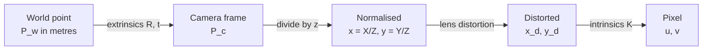

# Frames and camera geometry

> **Why this matters at staff level.** Every offboard number you ship to a vehicle is
> expressed in some frame, at some scale, with some calibration assumed. A staff engineer
> is expected to catch the frame error in someone else's design before it becomes a field
> incident, and to say out loud which of the transforms in the chain is the weak one. In
> the interview this is the warm-up that everything else stands on: if you fumble
> intrinsics and extrinsics, the interviewer will not get to bundle adjustment.

## TL;DR: the interview card

- A pixel is a **ray**, not a point. Projection throws away depth; everything in this part
  is about getting it back.
- **Extrinsics** are a pose: $P_c = R P_w + t$, with $R \in SO(3)$ and $t \in \mathbb{R}^3$.
  The camera centre in world coordinates is $C = -R^\top t$.
- **Intrinsics** are the sensor: $K = \begin{bmatrix} f_x & s & c_x \\ 0 & f_y & c_y \\ 0 & 0 & 1\end{bmatrix}$,
  mapping normalised coordinates $(X_c/Z_c, Y_c/Z_c)$ to pixels.
- Full model: $\tilde p = K [R \mid t] \tilde P_w$, then $u = f_x X_c/Z_c + c_x$,
  $v = f_y Y_c/Z_c + c_y$.
- **Homogeneous coordinates** exist so translation and projection become matrix products,
  and so points at infinity have finite representations.
- $SE(3)$ composes as $T_{AC} = T_{AB} T_{BC}$ and inverts as
  $T^{-1} = \begin{bmatrix} R^\top & -R^\top t \\ 0 & 1 \end{bmatrix}$. Practise reading the
  subscripts, because that is where frame bugs live.
- **Distortion acts in normalised coordinates**, between extrinsics and $K$. Undistorting
  is iterative because the Brown model is not analytically invertible.
- **Ground sample distance** for a nadir camera at height $h$: $\text{GSD} = h / f_x$ metres
  per pixel. At 90 m with a 2000 px focal length, one pixel is 4.5 cm. Every downstream
  threshold in metres becomes a threshold in pixels through this number.
- Rotation representations: matrices (9 numbers, 6 constraints) for algebra, quaternions
  (4, 1 constraint) for storage and interpolation, axis-angle (3, minimal) for optimisation
  increments. Use all three, for those three jobs.

## 1. Intuition first

Put one camera at the origin looking down the $+z$ axis, and place a point 4 m along $z$
and 1 m to the right. With a focal length of 800 pixels, that point lands at
$800 \times (1/4) = 200$ pixels right of the principal point. Move the point to
$(2, 0, 8)$: same ratio, same pixel. Move it to $(0.5, 0, 2)$: same pixel again.

Those three world points are collinear with the camera centre, and the camera cannot
tell them apart. That is the whole of projective geometry in one example. A pixel
identifies a ray through the camera centre, and the camera measures direction while
discarding distance.



Four stages, four places to be wrong. Read the diagram right to left and you have
unprojection, which needs a depth to be supplied from somewhere else.

### The frames an aerial stack actually carries

A survey drone over a customer's property has at least five, and a confident answer names
them without hesitating.

| Frame | Origin and axes | Where it comes from |
|---|---|---|
| ECEF | Earth centred, earth fixed | GNSS, the frame lat/lon/alt converts into |
| ENU (or NED) | A local tangent plane at a reference point, east-north-up | Chosen per site so numbers stay small and metres stay metres |
| Body / IMU | Vehicle centre, x forward | The INS solution, at IMU rate |
| Camera | Optical centre, $+z$ along the optical axis, $+y$ down | Fixed to the body by a mount, measured by extrinsic calibration |
| Image | Top-left pixel, $u$ right, $v$ down | The sensor readout convention |

The transform from body to camera is a physical property of the airframe. The transform
from ENU to body is a measurement that arrives at 100 to 400 Hz with its own covariance.
Confusing "the calibration is wrong" with "the pose estimate is wrong" costs weeks, and
the way you separate them is that calibration error is *consistent* across the flight
while pose error drifts.

!!! tip "The subscript discipline that prevents most frame bugs"
    Write every transform as $T_{\text{to}\leftarrow\text{from}}$ and let the inner
    subscripts cancel: $T_{w \leftarrow c} = T_{w \leftarrow b} \, T_{b \leftarrow c}$. If
    the adjacent subscripts in your expression do not match, the expression is wrong, and
    you can see it without thinking about geometry at all.

## 2. The math

### Homogeneous coordinates

Append a 1: the point $(X, Y, Z)$ becomes $(X, Y, Z, 1)$, and any non-zero multiple
$\lambda(X, Y, Z, 1)$ denotes the same point. Two payoffs. Translation becomes linear, so a
rigid motion is one $4 \times 4$ matrix product instead of a matrix product plus a vector
add. And points with a final coordinate of zero represent directions, the points at
infinity, which is how a vanishing point gets a finite pixel coordinate.

$$\tilde P = \begin{bmatrix} X \\ Y \\ Z \\ 1\end{bmatrix}, \qquad
T = \begin{bmatrix} R & t \\ 0^\top & 1 \end{bmatrix} \in SE(3), \qquad
\tilde P_c = T \tilde P_w.$$

### The rigid transform and its inverse

$SE(3)$ is the group of rigid motions: rotation then translation. Composition is matrix
multiplication. The inverse is worth memorising because the derivation takes ten seconds
and people still get the sign wrong under pressure. From $P_c = R P_w + t$, solve for
$P_w$:

$$P_w = R^\top (P_c - t) = R^\top P_c - R^\top t \quad \Longrightarrow \quad
\boxed{\;T^{-1} = \begin{bmatrix} R^\top & -R^\top t \\ 0^\top & 1\end{bmatrix}.\;}$$

Setting $P_c = 0$ gives the camera centre in world coordinates, $C = -R^\top t$. That is
the formula you use every time you plot camera positions and every time you check that a
reconstruction put the aircraft where the GPS says it was.

### Projection

Drop into the camera frame, divide by depth, apply the sensor model:

$$x = \frac{X_c}{Z_c}, \quad y = \frac{Y_c}{Z_c}, \qquad
\begin{bmatrix} u \\ v \\ 1 \end{bmatrix} = K \begin{bmatrix} x \\ y \\ 1 \end{bmatrix},
\qquad
K = \begin{bmatrix} f_x & s & c_x \\ 0 & f_y & c_y \\ 0 & 0 & 1 \end{bmatrix}.$$

Written out, $u = f_x x + s y + c_x$ and $v = f_y y + c_y$.

Each parameter means something physical. $f_x$ and $f_y$ are the focal length measured in
horizontal and vertical pixel widths; they differ when pixels are not square, which on
modern sensors is rare enough that $f_x \approx f_y$ is a reasonable prior and a useful
sanity check on a calibration. $(c_x, c_y)$ is the principal point, where the optical axis
pierces the sensor, near but not exactly at the image centre. The skew $s$ models
non-perpendicular sensor axes and is zero on every sensor you will meet; if a calibration
returns a large skew, the calibration is overfitting, not discovering a strange sensor.

Combining, $P = K[R \mid t]$ is the $3 \times 4$ projection matrix and $\tilde p \sim P \tilde P_w$,
where $\sim$ means "equal up to scale".

### Distortion

Real lenses bend rays. The Brown-Conrady model acts on normalised coordinates, before $K$:

$$r^2 = x^2 + y^2, \qquad
\begin{aligned}
x_d &= x(1 + k_1 r^2 + k_2 r^4 + k_3 r^6) + 2p_1 xy + p_2(r^2 + 2x^2), \\
y_d &= y(1 + k_1 r^2 + k_2 r^4 + k_3 r^6) + p_1(r^2 + 2y^2) + 2p_2 xy.
\end{aligned}$$

The $k$ terms are radial (barrel or pincushion), the $p$ terms tangential (sensor not
parallel to the lens). Two consequences worth stating in an interview. Distortion is
applied between extrinsics and intrinsics, so "undistort the image then use $K$" and
"project with $K$ then distort the pixel" are different operations and mixing them
produces errors that grow toward the image corners. And the forward model is a polynomial
with no closed-form inverse, so undistortion is solved by fixed-point iteration: start
from the distorted point, repeatedly apply the correction, converge in a handful of steps.

### Ground sample distance

For a nadir camera at altitude $h$ above the ground, a pixel subtends

$$\boxed{\;\text{GSD} = \frac{h}{f_x} \ \text{metres per pixel}.\;}$$

This is the number that connects the whole system. A 1 m delivery target at 4.5 cm GSD is
22 pixels across. A 10 mm power line at that GSD occupies a quarter of a pixel, which is
why thin-structure detection at survey altitude is a resolution problem before it is a
model-architecture problem, and why the answer usually involves flying lower, using a
longer lens, or exploiting the fact that a wire is long even when it is thin.

## 3. Implementation

The camera model in `src/mlbook/geometry/camera.py`, with the shapes on every line.

```python
def projection_matrix(K: np.ndarray, R: np.ndarray, t: np.ndarray) -> np.ndarray:
    """``P = K [R | t]`` (3, 4)."""
    return K @ np.concatenate([R, t[:, None]], axis=1)  # (3, 4)


def project(P_w, K, R, t, dist=None):
    """World points to pixels. P_w (N, 3) -> pixels (N, 2), depth (N,)."""
    P_c = P_w @ R.T + t                      # (N, 3) camera frame, rows are points
    depth = P_c[:, 2]                        # (N,) z, the discarded dimension
    xn = P_c[:, :2] / depth[:, None]         # (N, 2) normalised, the ray direction
    if dist is not None:
        xn = distort(xn, dist)               # (N, 2) lens model, before K
    pixels = to_homogeneous(xn) @ K.T        # (N, 3)
    return pixels[:, :2], depth              # (N, 2), (N,)
```

Row-major points and a right-multiplied transpose (`P_w @ R.T`) rather than the textbook
$R P$ is the NumPy-native convention this book uses throughout: one example per row, which
is what every batched deep learning op expects.

Unprojection needs depth supplied from outside, which is the entire reason the rest of
this part exists:

```python
def unproject(pixels, depth, K, R, t, dist=None):
    """Pixels plus depth back to world points. (N, 2), (N,) -> (N, 3)."""
    xn = to_homogeneous(pixels) @ np.linalg.inv(K).T   # (N, 3) undo the sensor model
    if dist is not None:
        xn = to_homogeneous(undistort(xn[:, :2], dist))  # (N, 3) iterative inverse
    P_c = xn[:, :2] / xn[:, 2:3] * depth[:, None]      # (N, 2) scale the ray by depth
    P_c = np.concatenate([P_c, depth[:, None]], axis=1)  # (N, 3)
    return (P_c - t) @ R                                # (N, 3) = R^T (P_c - t)
```

`(P_c - t) @ R` is $R^\top(P_c - t)$ written row-major. Checking that identity in your head
is a small but real test of whether the conventions have settled.

### How you would test it

Three properties, each of which catches a different class of bug.

```python
def test_project_unproject_round_trip():
    K, R, t = intrinsics(800, 800, 320, 240), *look_at(eye, target)
    pixels, depth = project(X, K, R, t)          # (N, 2), (N,)
    assert np.allclose(unproject(pixels, depth, K, R, t), X)   # inverse pair

def test_camera_centre_projects_nowhere_and_sits_where_expected():
    C = -R.T @ t                                  # (3,) camera centre in world
    assert np.allclose(project(C[None], K, R, t)[1], 0.0)      # zero depth

def test_distortion_round_trip_converges():
    assert np.allclose(undistort(distort(xn, d), d), xn, atol=1e-9)
```

The round trip is the workhorse. A sign error in the extrinsics, a transposed rotation, or
a swapped $f_x$ and $c_x$ all fail it immediately.

## Retype by hand

| Symbol | File | Target time | Why |
|---|---|---|---|
| `intrinsics`, `skew_symmetric` | `src/mlbook/geometry/camera.py` | 3 minutes | Free marks; be able to write $K$ without pausing. |
| `projection_matrix`, `project` | `src/mlbook/geometry/camera.py` | 8 minutes | The single most likely whiteboard request in this interview. |
| `unproject` | `src/mlbook/geometry/camera.py` | 8 minutes | Forces you to get $R^\top(P_c - t)$ right under mild pressure. |
| `look_at` | `src/mlbook/geometry/camera.py` | 10 minutes | Building a rotation from three orthogonal directions, which is the same skill as building a BEV or body frame. |
| `distort` / `undistort` | `src/mlbook/geometry/camera.py` | 12 minutes | Mostly to internalise that the inverse is iterative. |

Check yourself with `MLBOOK_IMPL=practice python -m pytest tests/test_geometry_camera.py -q`.

## 4. Systems view: cost, failure modes, trade-offs

Projection costs nothing. The failures are all about what feeds it.

| Failure | Symptom in the reconstruction | Where it comes from | What to do |
|---|---|---|---|
| Wrong extrinsic sign or transpose | Everything mirrored or behind the camera | Convention mismatch between two libraries | Round-trip test in CI, one canonical convention documented once |
| Calibration drift | Slowly growing reprojection error, consistent across a flight | Thermal cycling, vibration, a bumped mount | Self-calibration inside bundle adjustment, with priors and per-flight monitoring |
| Rolling shutter | Skewed buildings, a reconstruction that will not converge | Sensor reads row by row while the aircraft moves | Model row time in the projection, or use global-shutter sensors for survey |
| Time sync error | Pose applied to the wrong image, error proportional to speed | Camera and INS on different clocks | Hardware trigger and timestamping; measure offset, do not assume zero |
| Principal point far from centre | Systematic radial bias, worse at the edges | Overfitted calibration on too few views | Regularise toward the image centre; sanity-check against the datasheet |

The lesson to carry: at 20 m/s, a 10 ms timing error is 20 cm of position error, which is a
fifth of a 1 m delivery target. Timing is a geometry problem wearing a systems costume.

## 5. In production

!!! production "Zipline, Platform 2, the droid that steers itself down a tether"
    Public reporting describes the P2 aircraft hovering at around 300 feet and lowering a
    delivery droid on a retractable tether. The droid carries a downward-facing camera and
    additional sensors, and uses a shrouded propeller to steer itself onto the target while
    compensating for crosswind, with a stated delivery area of about one metre in diameter.
    Two design consequences follow for an offboard system. The precision requirement is
    metric and small (a one-metre circle), so a reconstruction good to "a few pixels" is
    only meaningful once you convert to metres through GSD. And the relevant free space is
    a vertical corridor from roughly 100 m down to the ground, so an offboard prior that
    only describes the ground surface has answered the easier half of the question.
    Sources: [New Atlas on Platform 2](https://newatlas.com/drones/droid-zipline-platform-2-drone-delivery/),
    [CNBC, March 2023](https://www.cnbc.com/2023/03/15/zipline-unveils-p2-delivery-drones-that-dock-and-recharge-autonomously.html).

!!! production "COLMAP, the conventions the field settled on"
    Schönberger and Frahm's incremental pipeline is the reference implementation most
    aerial and photogrammetry stacks either use or imitate, and its camera models
    (`SIMPLE_RADIAL`, `OPENCV`, `OPENCV_FISHEYE`) are effectively the shared vocabulary for
    intrinsics. When an interviewer says "assume OpenCV convention", this is the lineage
    they mean: $+z$ forward, $+y$ down, world-to-camera extrinsics, distortion in
    normalised coordinates.
    Source: [Structure-from-Motion Revisited, CVPR 2016](https://openaccess.thecvf.com/content_cvpr_2016/html/Schonberger_Structure-From-Motion_Revisited_CVPR_2016_paper.html).

## 6. Interview questions and strong answers

!!! interview "What is the difference between intrinsic and extrinsic parameters?"
    Extrinsics are the camera's pose relative to some other frame, six degrees of freedom,
    $R$ and $t$, and they change every time the camera moves. Intrinsics describe the
    sensor and lens: focal lengths in pixels, principal point, skew, distortion
    coefficients, and they change only with the hardware, or slowly with temperature and
    mechanical stress.

    **Staff-level follow-up.** The practical distinction is how you estimate them. Extrinsics
    are re-estimated per frame by the pose pipeline; intrinsics are estimated once per
    camera by calibration and then *monitored*. On a fleet, I would treat a change in
    estimated intrinsics as a maintenance signal, because a camera whose focal estimate
    moved has usually been knocked, and every reconstruction from that airframe since is
    suspect.

!!! interview "Why homogeneous coordinates? What do you lose?"
    Two things gained. Translation becomes a linear map, so the whole rigid-plus-projective
    chain is one matrix product and compositions are associative. And directions get finite
    coordinates, with $w = 0$ representing a point at infinity, which is what lets a
    vanishing point be an ordinary value in the algebra.

    What you lose is uniqueness of representation: $\tilde p$ and $\lambda \tilde p$ are the
    same point, so equality has to be written up to scale. That is exactly why the epipolar
    constraint is a scalar equation and why the eight-point algorithm solves a homogeneous
    system whose answer is only defined up to scale.

!!! interview "You are given a segmentation mask in image space and asked for the area of that region in square metres. Walk me through it."
    I would resist doing it in image space. Pixel area maps to ground area through a factor
    that depends on the local surface geometry, so the correct route is to unproject.

    If I have a digital surface model, I unproject each mask pixel to a 3-D point using the
    depth from the model, triangulate the resulting point set, and sum the triangle areas.
    That handles slope correctly, and a sloped driveway has more true surface area than its
    footprint.

    If all I have is a flat-ground assumption and a nadir camera at height $h$, the area is
    $N \cdot (h/f_x)(h/f_y)$ for $N$ pixels, and I would say clearly that this underestimates
    on slopes by a factor of $\cos\theta$ and is wrong at the image edges where the camera is
    not nadir to that patch.

    **Staff-level follow-up.** For a delivery decision I would not report area at all. I
    would report the largest inscribed circle in metres, because a drone needs a disk and an
    L-shaped region with large area may contain no disk at all.

!!! interview "The reprojection error on one camera is 0.4 px on most of the image and 6 px in the corners. What is wrong?"
    Radial structure in the residuals points at the distortion model. Either the model is
    under-parameterised for this lens (a wide-angle lens fitted with one radial coefficient),
    or the calibration data did not cover the image corners, so the polynomial is
    extrapolating.

    I would plot the residual field before touching anything. If the residuals point radially
    outward with magnitude growing as $r^3$ or higher, it is a missing $k_2$ or $k_3$. If the
    pattern is not radial, look at tangential terms or at a misestimated principal point.
    The fix in either case is a recalibration whose targets actually reach the corners.

!!! interview "How do you sanity-check a camera calibration you did not produce?"
    Four checks, cheap to expensive. Compare $f_x$ against the datasheet: focal length in
    millimetres divided by pixel pitch should land within a few percent. Check $f_x/f_y$ is
    near 1 and skew is near 0. Check the principal point is within a few percent of the image
    centre; a large offset means overfitting. Then the real test: reproject a known 3-D
    structure, or run a short bundle adjustment with intrinsics free and see whether it moves
    them. If a hundred metres of flight refines the focal length by 2%, the calibration was
    stale.

## 7. Exercises

**★ 1.** Given $R$ and $t$ with $P_c = R P_w + t$, derive the camera centre in world
coordinates and verify it projects to zero depth.

??? success "Solution"
    The camera centre is the world point mapping to the camera-frame origin. Set
    $R C + t = 0$, so $C = -R^{-1} t = -R^\top t$ using orthonormality. Projecting it gives
    $P_c = R(-R^\top t) + t = -t + t = 0$, so $Z_c = 0$ and the perspective division is
    undefined, which is the correct statement that the centre has no image.

**★ 2.** A nadir camera with $f_x = f_y = 2400$ px flies at 90 m. What is the GSD? How many
pixels wide is a 1 m delivery target? At what altitude does a 15 cm obstacle become one pixel?

??? success "Solution"
    $\text{GSD} = 90 / 2400 = 0.0375$ m, so 3.75 cm per pixel. A 1 m target is
    $1 / 0.0375 \approx 27$ pixels across. A 15 cm obstacle is one pixel when
    $h / 2400 = 0.15$, so $h = 360$ m. Below that it is more than a pixel, which is a
    lower bound on detectability and nothing more: a one-pixel object is not a detectable
    object at any useful precision or recall.

**★★ 3.** You are handed $T_{b \leftarrow c}$ (camera to body) and a stream of
$T_{w \leftarrow b}$ (body to world). Write the projection of a world point into the image
and identify which single transform, if stale by 0.5 degrees, causes the largest ground
error at 90 m altitude.

??? success "Solution"
    $\tilde p \sim K \, [I \mid 0] \, T_{b \leftarrow c}^{-1} T_{w \leftarrow b}^{-1} \tilde P_w$.
    A 0.5 degree error in either rotation produces a ground displacement of
    $h \tan(0.5°) \approx 90 \times 0.0087 = 0.79$ m at nadir. The difference is in
    character: the body-to-camera extrinsic is a fixed bias, so it shifts every
    reconstruction from that airframe the same way and is detectable by comparing against
    a surveyed control point. The body-to-world error varies per frame and shows up as
    inconsistency between overlapping images.

**★★ 4 (coding).** Implement `look_at(eye, target, up)` returning $(R, t)$ for the
$+z$-forward, $+y$-down convention, and test that the resulting camera projects `target` to
the principal point.

??? success "Solution"
    Build the camera axes in world coordinates and stack them as *rows*, because the rows
    of $R$ are the camera axes expressed in the world frame.

    ```python
    forward = (target - eye); forward /= np.linalg.norm(forward)   # (3,) camera +z
    right = np.cross(forward, up); right /= np.linalg.norm(right)  # (3,) camera +x
    down = np.cross(forward, right)                                # (3,) camera +y
    R = np.stack([right, down, forward], axis=0)                   # (3, 3)
    t = -R @ eye                                                   # (3,)
    ```

    The test: `project(target[None], K, R, t)[0]` equals $(c_x, c_y)$, because `target` lies
    on the optical axis so its normalised coordinates are $(0, 0)$. The degenerate case is
    `up` parallel to `forward`, where the cross product vanishes; a real implementation
    detects that and picks a fallback axis.

**★★★ 5.** Your aerial platform uses a rolling-shutter sensor with 20 ms readout, flying at
15 m/s. Write the modified projection for a point imaged on row $r$ of an $H$-row image, and
estimate the worst-case ground error from ignoring it.

??? success "Solution"
    Row $r$ is exposed at $\tau(r) = (r/H) \cdot 20$ ms after the frame start, so the pose to
    use is the pose at that time, not at frame start:

    $$\tilde p \sim K \left[ R(t_0 + \tau(r)) \mid t(t_0 + \tau(r)) \right] \tilde P_w.$$

    The projection becomes implicit, because $r$ depends on the pose and the pose depends on
    $r$; in practice you iterate two or three times from the global-shutter solution. Ignoring
    it, the bottom row is imaged 20 ms after the top, during which the aircraft moved
    $15 \times 0.02 = 0.30$ m. A 30 cm shear across the image at a 1 m delivery tolerance is a
    third of the budget spent on a modelling choice, which is a strong argument for
    global-shutter sensors on the survey aircraft.

## References

* Hartley and Zisserman, *Multiple View Geometry in Computer Vision*, 2nd edition,
  Cambridge University Press, 2004. Chapters 2, 6 and 7 cover projective geometry, the
  camera model and calibration.
* Schönberger and Frahm, "Structure-from-Motion Revisited", CVPR 2016.
  [CVF open access](https://openaccess.thecvf.com/content_cvpr_2016/html/Schonberger_Structure-From-Motion_Revisited_CVPR_2016_paper.html).
* Zhang, "A Flexible New Technique for Camera Calibration", IEEE TPAMI 22(11), 2000. The
  planar-target calibration method behind most toolboxes.
* [Part IV, geometry](../part04-vision/06-geometry.md), for the same material at textbook
  pace with more worked algebra.
