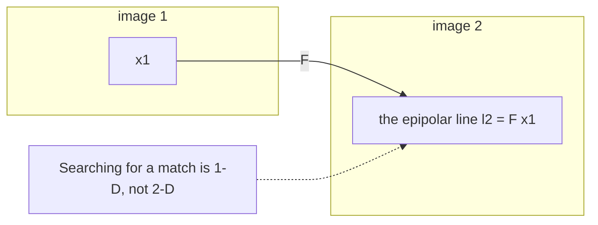

# Two-view geometry and triangulation

> **Why this matters at staff level.** This is the chapter an interviewer uses to find out
> whether you actually know geometry or have only read about it. The epipolar constraint,
> the difference between $E$ and $F$, and the conditions under which triangulated depth is
> garbage are all derivable in a couple of minutes at a whiteboard, and a staff candidate is
> expected to derive them rather than recite them. The payoff question, "when is depth from
> two views untrustworthy", is the one that separates textbook knowledge from field
> experience.

## TL;DR: the interview card

- **Epipolar constraint**: a point in image 1 constrains its match in image 2 to a line.
  $x_2^\top F x_1 = 0$ in pixels, $\hat{x}_2^\top E \hat{x}_1 = 0$ in normalised coordinates.
- $E = [t]_\times R$ and $F = K_2^{-\top} E K_1^{-1}$. $E$ needs calibration; $F$ does not.
- Degrees of freedom: $E$ has 5 (3 rotation, 3 translation, minus 1 for scale);
  $F$ has 7 (9 entries, minus 1 for scale, minus 1 for $\det F = 0$). Both have rank 2.
- $E$'s singular values are $(\sigma, \sigma, 0)$. Enforcing that is a step people forget.
- **Eight-point algorithm**: stack $x_2^\top F x_1 = 0$ into $Af = 0$, take the smallest right
  singular vector, then truncate to rank 2. **Hartley normalisation is what makes it work**;
  without it the conditioning is catastrophic.
- **RANSAC** iterations: $k = \log(1-p)/\log(1-w^s)$. At $w=0.5$, $p=0.99$: 72 draws for a
  homography ($s=4$), 1177 for the eight-point ($s=8$).
- **Triangulation** is linear (DLT): from $p \sim PX$, the cross product gives two rows per
  view; solve $AX = 0$ by SVD.
- **Depth uncertainty** is the number to have memorised:
  $\sigma_Z \approx \dfrac{Z^2}{f B}\sigma_d$. Error grows with the *square* of depth and
  falls linearly with baseline.
- **PnP** recovers pose from known 3-D to 2-D matches; the DLT version needs 6 points,
  P3P needs 3 plus a disambiguation, and both want RANSAC around them.
- Two views give structure **up to scale**. Always.

## 1. Intuition first

Take a point $X$ in the world, a camera centre $C_1$ and a camera centre $C_2$. Those three
points define a plane, the epipolar plane. The image of $X$ in camera 1 lies in that plane
by construction, and so does its image in camera 2.

Now suppose you only know the pixel $x_1$ and the relative pose. You do not know $X$,
because the pixel is a ray and $X$ could be anywhere along it. But every candidate position
along that ray lies in the same epipolar plane, so every candidate projection in image 2
lies on the same line: the intersection of that plane with image 2.



That reduction from a two-dimensional search to a one-dimensional search is the practical
payoff. Stereo matching, guided feature matching and geometric verification of putative
correspondences all live on it.

Two special points fall out. The **epipole** $e_1$ is where camera 2's centre projects into
image 1; every epipolar line in image 1 passes through it. For a nadir aerial pair flying a
straight strip, the epipoles sit far outside the image and the epipolar lines are nearly
parallel, which is a convenient geometry and also a warning sign, because parallel lines and
a short baseline mean weak depth.

### A number to carry

Zipline's survey imagery is captured from a moving aircraft, so consecutive frames form a
narrow-baseline pair. Suppose 90 m altitude, a 10 m baseline between frames, $f = 2400$ px
and feature localisation good to 0.3 px. Then

$$\sigma_Z \approx \frac{Z^2}{fB}\sigma_d = \frac{90^2}{2400 \times 10} \times 0.3 = 0.10\ \text{m}.$$

Ten centimetres of depth noise from one pair. Now halve the baseline to 5 m and it becomes
20 cm; a 25 cm relief threshold for a landing site is then inside the noise, and the system
cannot tell a flat lawn from a flower bed. That single calculation is the most useful thing
in this chapter.

## 2. The math

### Deriving the epipolar constraint

Work in camera 1's frame. A world point has camera-1 coordinates $X_1$ and camera-2
coordinates $X_2 = R X_1 + t$.

The three vectors $X_2$, $t$ and $R X_1$ are coplanar: $t$ runs from camera 2's centre to
camera 1's centre, $RX_1$ is the point's direction as rotated into camera 2, and $X_2$ is the
point itself. Coplanarity of three vectors means the scalar triple product vanishes:

$$X_2 \cdot \big(t \times (R X_1)\big) = 0.$$

Write the cross product as a matrix, $t \times y = [t]_\times y$ with
$[t]_\times = \begin{bmatrix} 0 & -t_3 & t_2 \\ t_3 & 0 & -t_1 \\ -t_2 & t_1 & 0\end{bmatrix}$:

$$X_2^\top [t]_\times R \, X_1 = 0 \quad \Longrightarrow \quad \boxed{\;X_2^\top E X_1 = 0, \quad E = [t]_\times R.\;}$$

Because the constraint is homogeneous, replacing $X_i$ by any scalar multiple leaves it
true, so it holds for the normalised image coordinates $\hat x_i = X_i / Z_i$ as well. That
is why an equation about 3-D points is testable using only pixels.

Substituting $\hat x = K^{-1} p$ gives the uncalibrated version:

$$p_2^\top \underbrace{K_2^{-\top} E K_1^{-1}}_{F} p_1 = 0.$$

The epipolar line in image 2 is $l_2 = F p_1$, and $p_2^\top l_2 = 0$ says the match lies on it.

### Properties, and why each one matters

$[t]_\times$ has rank 2 (its null space is $t$), and $R$ is full rank, so $E$ and $F$ have
rank 2 and $\det F = 0$. The epipoles are the null vectors: $F e_1 = 0$ and $F^\top e_2 = 0$.

$E$ carries 5 degrees of freedom: three for rotation, three for translation, minus one
because scale is unobservable. $F$ carries 7: nine entries minus one for overall scale minus
one for the rank constraint. That count tells you the minimal solvers: 5 points for the
calibrated case, 7 or 8 for the uncalibrated one.

$E$ has singular values $(\sigma, \sigma, 0)$, because $[t]_\times$ contributes $(\|t\|, \|t\|, 0)$
and $R$ is orthogonal. When you compute $E = K^\top F K$ from a noisy $F$, the result does
not have that structure, so you project it back:

```python
U, _, Vt = np.linalg.svd(E)
E = U @ np.diag([1.0, 1.0, 0.0]) @ Vt   # (3, 3) nearest essential matrix
```

Skipping this gives a pose that is subtly wrong everywhere, which is a hard bug to find
because nothing crashes.

### The eight-point algorithm

Each correspondence gives one linear equation in the nine entries of $F$. Expanding
$p_2^\top F p_1 = 0$ with $p = (u, v, 1)$:

$$\big[u_2 u_1,\; u_2 v_1,\; u_2,\; v_2 u_1,\; v_2 v_1,\; v_2,\; u_1,\; v_1,\; 1\big] \, \mathrm{vec}(F) = 0.$$

Stack $N \ge 8$ of those into $A \in \mathbb{R}^{N \times 9}$, and take the right singular
vector of the smallest singular value as $\mathrm{vec}(F)$. Then enforce rank 2 by zeroing
the smallest singular value of the reshaped matrix.

**Hartley normalisation** is what makes this numerically sane. Raw pixel coordinates are
around $10^3$ while the homogeneous coordinate is 1, so the columns of $A$ differ in scale by
six orders of magnitude and the SVD is dominated by round-off. The fix is a similarity
transform per image that centres the points at the origin and scales the mean distance to
$\sqrt{2}$, solve there, and map back: $F = T_2^\top \hat F T_1$. Without it, the eight-point
algorithm is a famous example of a correct derivation producing useless numbers.

### Scoring a correspondence: Sampson distance

$x_2^\top F x_1$ is an algebraic residual with no geometric meaning, so thresholding it
directly makes your inlier set depend on image resolution. The geometric quantity you want
is the reprojection error, which requires triangulating. Sampson distance is the first-order
approximation to it, and costs one evaluation:

$$d_{\text{Sampson}}^2 = \frac{(x_2^\top F x_1)^2}{(Fx_1)_1^2 + (Fx_1)_2^2 + (F^\top x_2)_1^2 + (F^\top x_2)_2^2}.$$

The denominator is the gradient norm, so this is "algebraic error divided by how fast the
error changes", which is the standard Newton-style correction and lands in pixels.

### Triangulation by DLT

Given $p \sim P X$, the cross product $p \times (PX) = 0$ holds exactly (parallel vectors),
and gives two independent linear equations per view:

$$u\,P^{(3)} - P^{(1)} = 0, \qquad v\,P^{(3)} - P^{(2)} = 0,$$

where $P^{(i)}$ is row $i$. Two views give a $4 \times 4$ system $AX = 0$; $V$ views give
$2V \times 4$. Solve by SVD and dehomogenise.

The DLT minimises an algebraic error, so the statistically correct thing is to follow it
with a Gauss-Newton refinement on true reprojection error. For a well-conditioned pair the
difference is small; for a narrow baseline it is not.

### Triangulation uncertainty, derived

Take the rectified stereo case for clarity: baseline $B$, focal $f$, disparity $d$, depth
$Z = fB/d$. Differentiating,

$$\frac{\partial Z}{\partial d} = -\frac{fB}{d^2} = -\frac{Z^2}{fB}
\quad \Longrightarrow \quad \boxed{\;\sigma_Z \approx \frac{Z^2}{fB}\,\sigma_d.\;}$$

Read off the three levers. Depth error grows **quadratically** with range, so a sensor
calibrated at 10 m is four times worse at 20 m. It falls **linearly** with baseline, so
flying a wider strip separation buys accuracy directly. And it is linear in feature
localisation error, which is where sub-pixel refinement earns its cost.

The geometric picture behind the algebra: triangulation intersects two rays, and the
uncertainty region is the intersection of two cones. As the rays become parallel, that
intersection stretches out along the viewing direction without bound. A small baseline means
a shallow intersection angle means an elongated error ellipsoid pointing away from the
cameras.

### PnP

Triangulation is "poses known, find the point". PnP is the dual: "points known, find the
pose". Given $n \ge 3$ correspondences between 3-D world points and 2-D pixels plus
intrinsics, recover $R$ and $t$.

The DLT version works in normalised coordinates, treats the 12 entries of $[R \mid t]$ as
unknowns, gets two rows per correspondence, solves $Am = 0$ with $n \ge 6$, then projects
the estimated $R$ onto $SO(3)$ by SVD and rescales $t$ to match. P3P uses the minimal three
points and produces up to four solutions disambiguated by a fourth point, which makes it the
better RANSAC kernel because the iteration count depends exponentially on sample size.

In an incremental reconstruction, PnP is what registers each new image against the structure
built so far.

## 3. Implementation

Robust fundamental-matrix estimation, which is geometric verification in three lines of
glue over `src/mlbook/geometry/ransac.py`:

```python
def ransac_fundamental(pts1, pts2, threshold=1.0, **kw):
    """Robust F from putative matches, scored by Sampson distance. Minimal sample 8."""
    return ransac(
        n_data=len(pts1),
        sample_size=8,
        fit_fn=lambda idx: eight_point(pts1[idx], pts2[idx]),     # minimal solve
        residual_fn=lambda F: sampson_distance(F, pts1, pts2),    # (N,) pixels
        threshold=threshold,
        **kw,
    )
```

The loop itself carries one detail worth defending in an interview, adaptive stopping:

```python
inliers = residual_fn(model) < threshold          # (N,) bool
score = float(inliers.sum())
if score > best_score:
    best_model, best_inliers, best_score = model, inliers, score
    # the better the current consensus, the fewer draws remain necessary
    budget = min(max_iters, required_iterations(score / n_data, sample_size, confidence))
```

The iteration count is recomputed from the best inlier ratio seen so far, so a clean pair
terminates in a handful of draws while a contaminated one keeps going. In the tests, a clean
aerial pair finishes in under 20 iterations where the static budget was 2000.

And the count itself:

```python
def required_iterations(inlier_ratio, sample_size, confidence=0.99, max_iters=100_000):
    """k >= log(1 - p) / log(1 - w^s)."""
    w = float(np.clip(inlier_ratio, 1e-6, 1.0 - 1e-12))
    denom = np.log1p(-(w**sample_size))       # log(1 - w^s), accurate for small w^s
    return int(min(max_iters, np.ceil(np.log(1.0 - confidence) / denom)))
```

### How you would test it

```python
def test_required_iterations_matches_the_closed_form():
    assert required_iterations(0.5, 4, 0.99) == 72      # homography
    assert required_iterations(0.5, 8, 0.99) == 1177    # eight-point pays for its sample

def test_ransac_fundamental_recovers_the_epipolar_geometry():
    corrupted, bad = contaminate(p2, frac=0.25)         # 25% gross mismatches
    res = ransac_fundamental(p1, corrupted, threshold=1.0)
    assert res.inliers[bad].mean() < 0.05               # outliers rejected
    assert sampson_distance(res.model, p1[res.inliers], corrupted[res.inliers]).max() < 1.0
```

Generating synthetic correspondences from a known pose, contaminating a known fraction, and
checking that exactly those indices are rejected is the right shape for a robust-estimation
test: it asserts on the *identity* of the outliers, not only on an aggregate error.

## Retype by hand

| Symbol | File | Target time | Why |
|---|---|---|---|
| `normalise_points` and `eight_point` | `src/mlbook/geometry/epipolar.py` | 15 minutes | The classic whiteboard ask. Practise until the rank-2 truncation is automatic. |
| `sampson_distance` | `src/mlbook/geometry/epipolar.py` | 6 minutes | Short, and knowing why it beats the algebraic residual is the real question. |
| `required_iterations` | `src/mlbook/geometry/ransac.py` | 3 minutes | Free marks, and you should be able to derive it. |
| `ransac` (the generic loop) | `src/mlbook/geometry/ransac.py` | 15 minutes | Sample, fit, score, keep, refit. Include adaptive stopping. |
| `triangulate_dlt` | `src/mlbook/geometry/triangulation.py` | 10 minutes | Building $A$ from the cross product is the part to get fluent. |
| `pnp_dlt` | `src/mlbook/geometry/triangulation.py` | 18 minutes | Longer; the $SO(3)$ projection and sign disambiguation are the interesting half. |

Check with `MLBOOK_IMPL=practice python -m pytest tests/test_geometry_epipolar.py tests/test_geometry_ransac.py -q`.

## 4. Systems view: when to distrust a triangulated point

The question "what makes triangulation unreliable" deserves a structured answer, because
listing causes is easy and organising them is the signal.

| Cause | Mechanism | Detectable by | Mitigation |
|---|---|---|---|
| Short baseline | Rays nearly parallel, error ellipsoid elongates along depth | Small triangulation angle between rays | Reject points below an angle threshold (2 to 3 degrees is a common floor); widen the strip |
| Large depth | $\sigma_Z \propto Z^2$ | Known from the geometry itself | Fly lower, longer lens, more views |
| Pose error | Rays are aimed wrong, so the intersection is wrong | High reprojection error consistent across a region | Bundle adjustment; better INS; ground control |
| Calibration error | Systematic ray bias, worst at the edges | Radial residual pattern | Recalibrate, or free intrinsics in BA |
| Poor feature localisation | Directly scales $\sigma_Z$ | Blurry or low-texture patches | Sub-pixel refinement; reject low-contrast features |
| Repeated texture | Confident wrong matches, and RANSAC agrees because they are geometrically consistent | Multiple mutually inconsistent hypotheses | Ratio test, cross-check, wider context, more views |
| Moving content | The point was not in the same place at both times | Inconsistent across three or more views | Temporal consistency, semantic masking of vegetation and vehicles |
| Textureless region | Nothing to match at all | Sparse or absent features | Learned matching, or accept the hole and mark it unknown |
| Specular or transparent surfaces | Water and glass violate the fixed-3-D-point assumption | Physically implausible depths | Semantic masking, multi-view consistency |
| Occlusion | The point is not visible in both views | Cheirality or consistency failure | Multi-view triangulation with visibility reasoning |

Three of those are aerial-specific and worth naming unprompted: vegetation moves in wind
between passes, water reflects a different scene from every viewpoint, and a repeating roof
pattern or a row of identical fence posts produces geometrically consistent wrong matches
that RANSAC cannot reject.

### The degeneracies

Two configurations break the estimation rather than merely degrade it.

**Pure rotation.** If $t = 0$ then $E = [0]_\times R = 0$ and there is no epipolar geometry
at all; the two images are related by a homography. This is not exotic: a drone rotating
while hovering produces exactly it, and triangulation on such a pair yields points at
arbitrary depth with small reprojection error. The standard defence is to fit both $F$ and
$H$ and compare their inlier counts, which is what COLMAP does before accepting an
initialisation pair.

**Planar scene.** If every point lies on a plane, $F$ is not uniquely determined, because a
homography explains the matches and many $F$ matrices are consistent with it. A flat field
or a large flat roof is exactly this case. Same defence.

!!! warning "The narrow-baseline trap in aerial survey"
    A survey flight produces hundreds of nearly identical frames a few metres apart. Every
    consecutive pair has excellent match counts and terrible depth conditioning. Selecting
    pairs by match count alone, which is the obvious thing, systematically selects the worst
    geometry. Select by triangulation angle, or by match count subject to a minimum angle.

## 5. In production

!!! production "COLMAP, geometric verification as a gate rather than a cleanup"
    COLMAP's pipeline verifies every putative image pair by estimating $F$, $E$ and $H$ under
    RANSAC and deciding which model explains the matches, using the outcome both to filter
    correspondences and to decide whether the pair is usable for initialisation. The design
    idea worth carrying: run the degenerate model alongside the general one and compare, so
    a planar or rotation-only pair is identified rather than silently producing a bad pose.
    Source: [Structure-from-Motion Revisited, CVPR 2016](https://openaccess.thecvf.com/content_cvpr_2016/html/Schonberger_Structure-From-Motion_Revisited_CVPR_2016_paper.html).

!!! production "Hartley's normalisation, a correctness fix that looks like a numerics fix"
    The eight-point algorithm was published in 1981 and widely regarded as too noise-sensitive
    to use until Hartley showed in 1997 that conditioning, rather than the algorithm, was the
    problem, and that a per-image similarity normalisation made it competitive. The lesson
    generalises past geometry: before replacing a method that "does not work", check whether
    it is being handed a badly scaled linear system.
    Source: Hartley, "In Defense of the Eight-Point Algorithm", IEEE TPAMI 19(6), 1997.

## 6. Interview questions and strong answers

!!! interview "Explain the epipolar constraint to someone who knows linear algebra but not vision."
    Two camera centres and a world point define a plane. The point's image in each camera
    lies in that plane, so the two image rays and the baseline are coplanar. Coplanarity of
    three vectors means their scalar triple product is zero, and writing the cross product
    as the matrix $[t]_\times$ turns that into $x_2^\top [t]_\times R \, x_1 = 0$. Define
    $E = [t]_\times R$ and you have the constraint.

    The practical content is that it is a *necessary* condition on a match, so it filters
    correspondences without knowing where the point is, and it reduces matching from a 2-D
    search to a 1-D search along a line.

!!! interview "What is the difference between E and F, and when would you use each?"
    $F$ operates on pixels and requires no calibration; $E$ operates on normalised
    coordinates and requires $K$. They are related by $F = K_2^{-\top} E K_1^{-1}$.

    Use $E$ whenever you have calibration, which for a company's own fleet you always do.
    It has 5 degrees of freedom instead of 7, so the minimal solver needs 5 points instead
    of 8, which cuts RANSAC iterations by more than an order of magnitude at a fixed inlier
    ratio. It also decomposes directly into $(R, t)$.

    Use $F$ when intrinsics are unknown or untrusted: crowd-sourced imagery, a camera whose
    calibration you suspect has drifted, or as a diagnostic (estimate $F$, convert to $E$
    with the assumed $K$, and check whether the singular values come out equal; if they do
    not, the calibration is wrong).

!!! interview "You decompose E and get four candidate poses. How do you choose?"
    Cheirality. Triangulate the correspondences under each candidate and count the points
    with positive depth in *both* cameras. The four candidates are the true solution, the
    same rotation with the baseline reversed, and a twist of one camera by 180 degrees about
    the baseline with each sign. Only the true one puts the scene in front of both cameras;
    the others put points behind one or both.

    In practice I use a vote over many points instead of a single point, because noise near
    the baseline can flip an individual sign, and I verify the winner has a large margin. A
    narrow margin means the pair is close to degenerate and should not be used to
    initialise.

!!! interview "How do you estimate depth, and what makes it unreliable?"
    Triangulate: intersect the rays from two or more calibrated views, by DLT for a linear
    solution and then Gauss-Newton on reprojection error.

    Unreliable when the intersection is shallow or the rays are aimed wrong. Quantitatively
    $\sigma_Z \approx Z^2 \sigma_d / (fB)$, so error grows with the square of depth and falls
    linearly with baseline. Beyond that: pose and calibration error, poor feature
    localisation, repeated texture producing confident wrong matches, moving content such as
    vegetation, specular surfaces like water, and occlusion.

    **Staff-level follow-up.** For an aerial product I would enforce a minimum triangulation
    angle rather than a minimum match count when selecting pairs, because match count and
    geometric quality are anti-correlated in a survey flight: the most similar frames make
    the easiest matches and the worst geometry.

!!! interview "Your matcher returns 40% outliers. How many RANSAC iterations do you need, and what would you change?"
    With $w = 0.6$ and the eight-point algorithm, $w^8 = 0.0168$, so
    $k = \log(0.01)/\log(0.9832) \approx 272$ draws for 99% confidence. For a homography at
    $s = 4$, $w^4 = 0.13$, so about 33.

    What I would change: reduce the sample size. Moving to the 5-point algorithm with known
    intrinsics gives $w^5 = 0.078$ and about 57 draws, a five-fold saving. Then improve the
    inlier ratio upstream with a ratio test and mutual-nearest-neighbour checks, since $k$
    is exponential in $s$ but only polynomial-ish in the inlier ratio over this range.
    Finally, use adaptive stopping so the good cases exit early, and PROSAC-style ordering
    by match score so promising samples are drawn first.

!!! interview "Two views of a flat field. What goes wrong?"
    The scene is planar, so a homography explains every correspondence and $F$ is not
    uniquely determined: there is a family of fundamental matrices consistent with the data,
    and RANSAC will happily return one of them with a high inlier count. Triangulating with
    it gives a plausible-looking reconstruction that is wrong.

    Detection is straightforward: fit $H$ as well, and compare inlier counts and residuals.
    If $H$ explains the matches as well as $F$ does, treat the pair as degenerate. Recovery
    means either decomposing the homography (which gives pose up to a two-fold ambiguity,
    resolved with a third view) or picking a different pair with out-of-plane structure,
    which on a real property means a roof, a tree or a fence.

## 7. Exercises

**★ 1.** Show that $F e_1 = 0$ where $e_1$ is the epipole in image 1, and explain what that
means geometrically.

??? success "Solution"
    $e_1$ is the projection of camera 2's centre into image 1. Every epipolar line in image 1
    passes through it, because every epipolar plane contains the baseline and therefore
    contains $C_2$. Algebraically, $E = [t]_\times R$ and $[t]_\times t = t \times t = 0$, so
    $E$ has $R^{-1}t$ in its right null space, which maps to $e_1$ under $K_1$. Since a
    rank-2 matrix has a one-dimensional null space, the epipole is *the* null vector, which
    is how you compute it: the smallest right singular vector of $F$.

**★ 2.** A stereo rig has $f = 1200$ px, $B = 0.3$ m, and disparity accurate to 0.25 px.
Tabulate $\sigma_Z$ at 5, 10, 20 and 50 m. At what range does the depth error exceed 10% of
the range?

??? success "Solution"
    $\sigma_Z = Z^2 \sigma_d /(fB) = Z^2 \times 0.25 / 360 = Z^2 / 1440$.

    | $Z$ (m) | 5 | 10 | 20 | 50 |
    |---|---|---|---|---|
    | $\sigma_Z$ (m) | 0.017 | 0.069 | 0.28 | 1.74 |

    Relative error is $Z/1440$, which reaches 10% at $Z = 144$ m. The shape of that table is
    the point: doubling range quadruples absolute error and doubles relative error.

**★★ 3.** Derive the number of RANSAC iterations for 99.9% confidence with a 5-point solver
at 30% inliers, and comment on whether that budget is practical.

??? success "Solution"
    $w^s = 0.3^5 = 0.00243$, so
    $k = \log(0.001)/\log(1 - 0.00243) = -6.908 / -0.002433 \approx 2839$ draws.

    Practical for a 5-point solver, which costs microseconds, so roughly 3000 iterations is
    milliseconds. The same 30% inlier ratio with the eight-point algorithm needs
    $0.3^8 = 6.6\times10^{-5}$, so about 105,000 draws, which is not practical. That gap is
    the argument for calibrated minimal solvers, made in numbers instead of adjectives.

**★★ 4 (coding).** Implement `triangulate_multiview(Ps, pixels)` for $V \ge 2$ views and
explain why you should weight the rows.

??? success "Solution"
    ```python
    rows = []
    for P, (u, v) in zip(Ps, pixels):
        rows.append(u * P[2] - P[0])     # (4,) from the cross product
        rows.append(v * P[2] - P[1])     # (4,)
    A = np.stack(rows, axis=0)           # (2V, 4)
    _, _, Vt = np.linalg.svd(A)
    X_h = Vt[-1]                         # (4,) smallest singular vector
    return X_h[:3] / X_h[3]              # (3,)
    ```

    Unweighted, each view contributes equally, which is wrong when views differ in
    resolution, distance or feature quality. The algebraic residual for a view is implicitly
    scaled by that view's depth $Z$, so distant views are over-weighted relative to their
    geometric information. The standard fix is iterative reweighting by $1/(P^{(3)}X)$, which
    converges to minimising true reprojection error; that is exactly what the "iterative
    linear triangulation" in Hartley and Zisserman does.

**★★★ 5.** You have 20 overlapping aerial images with approximate poses from GNSS and IMU.
Design the pair-selection strategy for reconstruction, and justify it against the obvious
alternative of matching all pairs.

??? success "Solution"
    All-pairs is $\binom{20}{2} = 190$ matching jobs, which is affordable at 20 images and
    quadratic thereafter, so the strategy has to be the one that survives to 20,000.

    Use the approximate poses, which is the advantage aerial has over unordered photo
    collections. Build a candidate graph where an edge exists if the view frusta overlap by
    more than some fraction of the image, estimated by projecting the frusta onto a nominal
    ground plane at the GNSS altitude. Then filter edges by triangulation angle: drop pairs
    whose baseline-to-depth ratio is below roughly 1:30 (about 2 degrees), because they
    cannot contribute depth, and drop pairs above about 30 degrees, because appearance
    changes too much for reliable matching.

    Keep the sequential neighbours regardless, for track continuity, and add cross-strip
    edges deliberately, because those carry the wide baselines that actually constrain depth
    and tie the strips together. Verify each surviving pair with RANSAC on $F$ and $H$ and
    discard pairs where $H$ wins.

    The outcome is a sparse, well-conditioned view graph where the expensive matching budget
    is spent on the pairs that carry geometric information, which matters most at the scale
    where all-pairs is impossible.

## References

* Hartley and Zisserman, *Multiple View Geometry in Computer Vision*, 2nd edition, 2004.
  Chapters 9 through 12 cover epipolar geometry, $F$, $E$ and triangulation.
* Hartley, "In Defense of the Eight-Point Algorithm", IEEE TPAMI 19(6), 1997.
* Nistér, "An Efficient Solution to the Five-Point Relative Pose Problem", IEEE TPAMI 26(6),
  2004. The calibrated minimal solver.
* Fischler and Bolles, "Random Sample Consensus", Communications of the ACM 24(6), 1981.
* Schönberger and Frahm, "Structure-from-Motion Revisited", CVPR 2016.
  [CVF open access](https://openaccess.thecvf.com/content_cvpr_2016/html/Schonberger_Structure-From-Motion_Revisited_CVPR_2016_paper.html).
