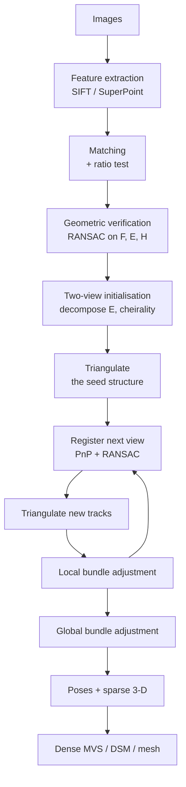

# Structure from motion and bundle adjustment

> **Why this matters at staff level.** Being able to draw the SfM pipeline from memory is
> table stakes. The staff signal is in the optimisation: knowing that bundle adjustment is a
> sparse non-linear least squares problem, that the sparsity has a specific shape you exploit
> with the Schur complement, that the solution has a seven-dimensional gauge freedom you must
> fix, and that a single unrejected outlier can drag every pose. For an offboard aerial
> system this is also where metric scale and georeferencing enter, which is the difference
> between a pretty reconstruction and a number a drone can act on.

## TL;DR: the interview card

- The pipeline: **features, matching, geometric verification, relative pose, triangulation,
  incremental registration by PnP, bundle adjustment**.
- BA objective:
  $\min_{\{R_i, t_i\},\{X_j\}} \sum_{(i,j)} \rho\big(\|\pi(K_i(R_i X_j + t_i)) - p_{ij}\|\big)$.
- Rotations are optimised **on the manifold**: the increment is a 3-vector applied as
  $R \leftarrow \exp([\delta\omega]_\times)R$. No quaternion renormalisation, no gimbal lock.
- With the left perturbation, the Jacobians are exact and short:
  $\partial Y/\partial \delta\omega = -[Y]_\times$, $\partial Y / \partial \delta t = I$,
  $\partial Y/\partial X = R$, all composed with
  $\partial(u,v)/\partial Y = \begin{bmatrix} f_x & s \\ 0 & f_y\end{bmatrix}\frac{1}{Z}\begin{bmatrix}1&0&-x\\0&1&-y\end{bmatrix}$.
- The Hessian is **arrowhead**: dense camera block $B$, block-diagonal point block $C$,
  sparse coupling $E$. The **Schur complement** eliminates points in $O(P)$ and leaves a
  system the size of the cameras: $(B - EC^{-1}E^\top)\delta_c = g_c - EC^{-1}g_p$.
- **Gauge freedom is 7 dof**: 3 rotation, 3 translation, 1 scale. Fix it by freezing one
  camera plus a scale, by ground control points, or by damping (LM absorbs it).
- Complexity: naive $O((6C+3P)^3)$. With Schur, $O(C^3 + CP)$ roughly, and $C \ll P$ always.
- **Robust kernel required.** Huber caps the gradient of a gross mismatch at $\delta$ instead
  of letting it grow linearly with the error.
- Two views give scale-free structure. Metric scale comes from **GNSS baselines, a laser
  altimeter, ground control points, or a known object**, never from the images.
- Incremental SfM drifts and is $O(n)$ bundle adjustments; global SfM is faster and more
  fragile. Aerial survey usually has good pose priors, which changes the calculus.

## 1. Intuition first

Bundle adjustment has an unhelpful name and a simple idea. You have guesses for where every
camera was and where every 3-D point is. Project each point into each camera that saw it, and
measure how far the projection lands from the pixel where the feature was actually detected.
That distance is the reprojection error. Now nudge all the cameras and all the points at once
to make the total squared error as small as possible.

The "bundle" is the bundle of light rays converging on each camera centre, and adjusting them
is the nineteenth-century photogrammetry phrase that stuck.

Two things make it more than a curve fit. First, it is the maximum-likelihood estimate under
the assumption that feature detection noise is isotropic Gaussian in the image plane, which
is roughly true for a well-behaved corner detector. Everything upstream (eight-point, DLT
triangulation, PnP) minimises algebraic errors chosen for their linearity; BA minimises the
error you actually care about. Second, it is the only stage that considers all constraints
simultaneously, so it is where the accumulated drift of incremental registration gets
redistributed.



The loop between registration and local BA is the part people forget when drawing this. You
do not register all views and then optimise once; you optimise as you go, because the pose
estimate for view $n+1$ depends on structure that view $n$'s bundle just corrected.

## 2. The math

### The objective

Let $\mathcal{O}$ be the set of observations, $(i,j) \in \mathcal{O}$ meaning camera $i$ saw
point $j$ at pixel $p_{ij}$. Then

$$\boxed{\;\min_{\{R_i, t_i\},\, \{X_j\}} \;\sum_{(i,j)\in\mathcal{O}} \rho\Big(\big\|\pi\big(K_i(R_i X_j + t_i)\big) - p_{ij}\big\|\Big)\;}$$

with $\pi$ the perspective division and $\rho$ a robust kernel. Unknowns: $6C$ for the
cameras (plus intrinsics if self-calibrating) and $3P$ for the points. A modest aerial job
has $C = 500$ and $P = 200{,}000$, so the point block dominates by three orders of magnitude.
That imbalance is what the Schur complement exploits.

### Parametrising the rotation

A rotation has 3 degrees of freedom but 9 numbers with 6 constraints. Optimising the 9
entries directly leaves $SO(3)$ immediately. The standard answer is to keep $R$ as a matrix
and parametrise the *update* minimally:

$$R \leftarrow \exp([\delta\omega]_\times) R, \qquad
\exp([\omega]_\times) = I + \frac{\sin\theta}{\theta}[\omega]_\times + \frac{1-\cos\theta}{\theta^2}[\omega]_\times^2,\ \ \theta = \|\omega\|.$$

That is the Rodrigues formula, and it is the exponential map from the Lie algebra
$\mathfrak{so}(3)$ to the group. The increment is three numbers, unconstrained, and the
result is exactly a rotation.

### The Jacobians

Use the left $SE(3)$ perturbation: $Y' = \exp([\delta\omega]_\times) Y + \delta t$ where
$Y = R X + t$ is the camera-frame point. To first order,
$Y' \approx Y + \delta\omega \times Y + \delta t$, and since
$\delta\omega \times Y = -[Y]_\times \delta\omega$:

$$\frac{\partial Y}{\partial \delta\omega} = -[Y]_\times, \qquad
\frac{\partial Y}{\partial \delta t} = I_3, \qquad
\frac{\partial Y}{\partial X} = R.$$

The projection contributes, with $x = X_c/Z_c$ and $y = Y_c/Z_c$,

$$J_\pi = \frac{\partial(u,v)}{\partial Y} =
\begin{bmatrix} f_x & s \\ 0 & f_y \end{bmatrix}
\frac{1}{Z}\begin{bmatrix} 1 & 0 & -x \\ 0 & 1 & -y \end{bmatrix} \in \mathbb{R}^{2\times 3}.$$

Chain them: $J_{\text{cam}} = J_\pi\,[\,-[Y]_\times \mid I\,] \in \mathbb{R}^{2 \times 6}$ and
$J_{\text{pt}} = J_\pi R \in \mathbb{R}^{2\times 3}$. Two small matrices per observation, and
every other entry of the full Jacobian is structurally zero.

!!! tip "Why this is worth deriving rather than autodiffing"
    Autodiff gives you the same numbers. Deriving it tells you the *structure*: each residual
    touches exactly one camera and exactly one point, which is the fact that makes the Schur
    complement possible. An interviewer asking for the Jacobian is usually asking whether you
    understand the sparsity.

### Sparsity and the Schur complement

Stack the residuals and form the Gauss-Newton normal equations $H\delta = g$ with
$H = J^\top W J$. Order the unknowns cameras-first:

$$H = \begin{bmatrix} B & E \\ E^\top & C \end{bmatrix}, \qquad
g = \begin{bmatrix} g_c \\ g_p\end{bmatrix}.$$

$B$ is $6C \times 6C$ and block diagonal by camera (a residual touches one camera). $C$ is
$3P \times 3P$ and block diagonal by point. $E$ is the coupling, non-zero only where camera
$i$ observed point $j$. This is the arrowhead pattern.

Since $C$ is block diagonal with $3\times3$ blocks, inverting it is $P$ small inversions.
Eliminating the point block by block-Gaussian elimination gives the **reduced camera system**:

$$\boxed{\;(B - EC^{-1}E^\top)\,\delta_c = g_c - EC^{-1}g_p, \qquad
\delta_p = C^{-1}(g_p - E^\top \delta_c).\;}$$

$S = B - EC^{-1}E^\top$ is the Schur complement, of size $6C \times 6C$. For $C = 500$ that is
$3000 \times 3000$, which is a direct solve; the alternative was $606{,}000$ unknowns. This
single algebraic move is what made large bundle adjustment tractable, and it is a standard
interview question in its own right.

### Gauge freedom

Given a reconstruction, apply any similarity transform (rotate, translate, rescale everything
including the cameras) and every reprojection is identical. The cost function has a
seven-dimensional flat direction, so $H$ is rank deficient by 7 and a plain Gauss-Newton step
is undefined.

Three standard fixes, and you should know when each is right.

**Fix a camera.** Freeze camera 0's pose entirely. Removes 6 of the 7. Simple, and the
convention in most implementations.

**Damping.** Levenberg-Marquardt adds $\lambda I$ to the diagonal, which makes $H + \lambda I$
invertible regardless. It does not *remove* the gauge freedom, it just stops the solver
tripping over it, and the reconstruction can slowly drift along the flat direction.

**Ground control.** Fix some points to surveyed coordinates. This is the one that matters for
an aerial product, because it removes the gauge *and* delivers metric, georeferenced
structure in one step. Freezing three or more non-collinear surveyed points fixes all seven
degrees of freedom and anchors the reconstruction to the real world.

In the implementation here, `fixed_cameras=(0,)` handles the first, LM damping the second,
and `fixed_points=(0,1,2)` the third.

### Robust kernels

Squared error is unbounded, so one mismatched feature at 200 px error contributes 40,000 to a
cost where good observations contribute 0.25 each. It wins, and every camera bends to
accommodate it.

The Huber kernel is quadratic inside a band and linear outside:

$$\rho(e) = \begin{cases} \tfrac12 e^2 & e \le \delta \\ \delta(e - \tfrac12\delta) & e > \delta\end{cases}
\qquad \Longrightarrow \qquad
w(e) = \begin{cases} 1 & e \le \delta \\ \delta/e & e > \delta.\end{cases}$$

Those weights turn the robust problem into iteratively reweighted least squares, so each
iteration costs the same as a non-robust one. Set $\delta$ near your expected noise, 1 to 3
pixels for a good detector. Cauchy and Tukey cut harder (Tukey gives zero weight past a
threshold, which fully rejects but is non-convex and can get stuck). Huber is the default
because it is convex and forgiving of a bad initialisation.

### Covariance

$H^{-1}$ (on the gauge-fixed subspace) approximates the covariance of the estimate, scaled by
the residual variance. It is how you report uncertainty on a camera pose or a 3-D point,
which is exactly what a downstream safety decision needs. Two caveats to state if asked: it
is the Gauss-Newton approximation, which assumes the linearisation is good near the optimum,
and it is gauge-dependent, so the covariance is only meaningful relative to whatever you
fixed.

## 3. Implementation

The Jacobian assembly, straight from the derivation above:

```python
def observation_jacobians(prob, Y):
    """Analytic Jacobians. Y (M, 3) camera-frame points -> (M, 2, 6), (M, 2, 3)."""
    K_m = prob.Ks[prob.cam_idx]              # (M, 3, 3)
    Z = Y[:, 2:3]                            # (M, 1) depth
    xy = Y[:, :2] / Z                        # (M, 2) normalised coordinates
    d_norm = np.zeros((len(Y), 2, 3))        # (M, 2, 3) d(x, y)/dY
    d_norm[:, 0, 0] = d_norm[:, 1, 1] = 1.0 / Z[:, 0]
    d_norm[:, 0, 2] = -xy[:, 0] / Z[:, 0]
    d_norm[:, 1, 2] = -xy[:, 1] / Z[:, 0]
    J_proj = K_m[:, :2, :2] @ d_norm         # (M, 2, 3) d(u, v)/dY

    dY_domega = -np.stack([skew_symmetric(y) for y in Y])  # (M, 3, 3) = -[Y]_x
    J_cam = np.concatenate([J_proj @ dY_domega, J_proj], axis=2)  # (M, 2, 6)
    J_pt = J_proj @ prob.Rs[prob.cam_idx]    # (M, 2, 3)
    return J_cam, J_pt
```

The Schur step, with the block structure kept visible instead of flattened into one sparse
matrix:

```python
def _schur_step(B, Cb, E, g_c, g_p, lam, free_cams):
    """One damped Gauss-Newton step, eliminating the points analytically."""
    F, P = len(free_cams), len(Cb)
    Bd = B[free_cams] + lam * np.eye(6)            # (F, 6, 6) damped camera blocks
    C_inv = np.linalg.inv(Cb + lam * np.eye(3))    # (P, 3, 3) block-diagonal inverse
    Ef = E[free_cams].transpose(0, 2, 1, 3)        # (F, 6, P, 3) coupling, camera-major

    # Y[f,a,p,:] = sum_b E[f,a,p,b] C_inv[p,b,:]   -> the E C^-1 product, blockwise
    Y = np.einsum("fapb,pbc->fapc", Ef, C_inv)     # (F, 6, P, 3)
    # S[f,a,g,b] = -sum_{p,c} Y[f,a,p,c] E[g,b,p,c], then B_d on the block diagonal
    S = -np.einsum("fapc,gbpc->fagb", Y, Ef)       # (F, 6, F, 6)
    S[np.arange(F), :, np.arange(F), :] += Bd
    b = g_c[free_cams] - np.einsum("fapc,pc->fa", Y, g_p)   # (F, 6)
    dc = np.linalg.solve(S.reshape(6 * F, 6 * F), b.reshape(-1)).reshape(F, 6)
    dp = np.einsum("pbc,pc->pb", C_inv, g_p - np.einsum("fapb,fa->pb", Ef, dc))
    return dc, dp
```

Applying the increment respects the manifold:

```python
for k, cam in enumerate(free_cams):
    dR = so3_exp(dc[k, :3])                  # (3, 3) exponential map
    Rs_try[cam] = dR @ Rs[cam]
    ts_try[cam] = dR @ ts[cam] + dc[k, 3:]
```

Note that $t$ is rotated by $dR$ as well. That is the left $SE(3)$ perturbation being applied
consistently with how the Jacobian was derived; rotating $R$ but not $t$ is a common bug that
produces a solver which converges slowly and blames the data.

### How you would test it

The test that matters most is finite differences against the analytic Jacobian, because
everything else can be wrong in a way that still converges to something.

```python
def test_analytic_jacobians_match_finite_differences():
    r0, Y = reprojection_residuals(prob)
    J_cam, J_pt = observation_jacobians(prob, Y)
    for axis in range(6):                        # perturb camera 1 along each dof
        d = np.zeros(6); d[axis] = 1e-6
        dR = so3_exp(d[:3])
        Rs[1], ts[1] = dR @ prob.Rs[1], dR @ prob.ts[1] + d[3:]   # the SAME update rule
        fd = (residual_with(Rs, ts, prob.Xs) - r0) / 1e-6          # (M, 2)
        assert np.allclose(fd[prob.cam_idx == 1], J_cam[prob.cam_idx == 1, :, axis], atol=1e-3)
```

The subtlety: the finite-difference perturbation has to use the same parametrisation as the
Jacobian. Perturbing $R$ some other way and comparing gives a mismatch that looks like a bug
in the Jacobian and is not.

Then the behavioural tests: cost decreases monotonically (LM only accepts descent steps), a
frozen camera does not move, frozen ground control points do not move and pull the
reconstruction to metric scale, and a Huber kernel beats plain least squares in the presence
of one gross mismatch.

```python
def test_huber_kernel_caps_the_influence_of_a_gross_mismatch():
    prob.pixels[7] += np.array([180.0, -140.0])       # one catastrophic mismatch
    robust = bundle_adjust(start, huber_delta=2.0)
    plain = bundle_adjust(start, huber_delta=1e9)     # effectively no robustification
    assert structure_error(robust) < structure_error(plain)
```

## Retype by hand

| Symbol | File | Target time | Why |
|---|---|---|---|
| `so3_exp` | `src/mlbook/geometry/bundle_adjustment.py` | 5 minutes | Rodrigues with the small-angle branch. Asked directly, often. |
| `reprojection_residuals` | `src/mlbook/geometry/bundle_adjustment.py` | 6 minutes | Gathering by index is the pattern for any sparse problem. |
| `observation_jacobians` | `src/mlbook/geometry/bundle_adjustment.py` | 20 minutes | The core derivation. Do it on paper first, then type it. |
| `huber_weights` and `huber_cost` | `src/mlbook/geometry/bundle_adjustment.py` | 5 minutes | Short, and the IRLS framing is the interesting part. |
| `_schur_step` | `src/mlbook/geometry/bundle_adjustment.py` | 25 minutes | The hardest one here. Worth it: this is the staff-level answer. |
| `decompose_essential` and `recover_pose` | `src/mlbook/geometry/sfm.py` | 15 minutes | Four candidates and the cheirality vote. |
| `incremental_sfm` skeleton | `src/mlbook/geometry/sfm.py` | 20 minutes | Do not memorise the details; be able to write the control flow. |

Check with `python -m pytest tests/test_geometry_bundle_adjustment.py tests/test_geometry_sfm.py -q`.

## 4. Systems view: cost, failure modes, trade-offs

### Cost

| Approach | Solve cost per iteration | When it is the right call |
|---|---|---|
| Dense normal equations | $O((6C + 3P)^3)$ | Never, past a toy problem |
| Schur + dense reduced solve | $O(C^3 + C^2 P)$ | Up to a few hundred cameras |
| Schur + sparse Cholesky on $S$ | Depends on fill-in of the camera graph | Thousands of cameras with local connectivity, which is the aerial-strip case |
| Schur + preconditioned conjugate gradient | $O(\text{nnz})$ per CG iteration | Tens of thousands of cameras; internet-scale reconstruction |

The aerial case has helpful structure: a survey flight's camera graph is close to a band
matrix, because image $i$ overlaps images near $i$ in the strip and the corresponding
positions in adjacent strips. Sparse Cholesky on $S$ exploits that directly.

### Failure modes on aerial imagery

| Failure | Why aerial makes it worse | Mitigation |
|---|---|---|
| Textureless terrain | Fresh snow, a mown lawn, a flat asphalt roof, water | Learned matching; accept holes and mark them unknown rather than interpolating |
| Repetitive structure | Roof tiles, fence posts, crop rows, parking bays | Wider-context descriptors; multi-view consistency; pose priors to gate matches |
| Moving vegetation | Wind moves leaves between passes, so the "same" point is not | Semantic masking; robust kernels; prefer trunks and hard structure for tracks |
| Changing illumination | Sun angle moves across a long flight; shadows rotate | Illumination-invariant descriptors; schedule flights; model exposure per image |
| Insufficient baseline | Consecutive frames are metres apart at 90 m altitude | Select pairs by triangulation angle; rely on cross-strip edges |
| Rolling shutter | Forward motion shears the image | Model row timing in the projection, or use global shutter |
| Bad GNSS or IMU | Multipath near buildings; magnetic interference | Use priors with covariance, not as hard constraints; let BA correct them |
| Scale drift | Accumulated error along a long strip | Loop closures across strips; GNSS position priors; ground control |
| Water | Reflects a different scene from every viewpoint | Semantic mask, and treat as unknown rather than as measured geometry |

### Incremental versus global

Incremental SfM registers one view at a time with local BA after each, which is robust
because every new view is checked against an already-consistent model, and slow because it
runs $O(n)$ bundle adjustments. It also drifts, since errors accumulate along the
registration order until a loop closure redistributes them.

Global SfM estimates all rotations first (rotation averaging over the view graph), then all
translations, then triangulates and runs one bundle adjustment. It is much faster and much
more sensitive to outlier edges in the view graph, because a wrong relative pose contaminates
the averaging.

For aerial survey with a good INS, the calculus shifts. You already have approximate absolute
poses, so the expensive part of global SfM (getting a consistent initial rotation set) is
handed to you. A sensible production design initialises from the INS, verifies pairs
geometrically, triangulates, and runs a single large bundle adjustment with pose priors,
skipping incremental registration entirely. Say that out loud if asked to design the system,
because it is the answer that uses the information the platform actually has.

## 5. In production

!!! production "COLMAP, the reference incremental pipeline"
    Schönberger and Frahm's contribution was a set of engineering decisions around a known
    algorithm: a next-best-view selection that prefers well-conditioned registrations, a
    triangulation method robust to outlier-contaminated tracks, iterative bundle adjustment
    with re-triangulation so that points rejected early get another chance once poses improve,
    and geometric verification that explicitly tests for degenerate (planar, rotation-only)
    configurations. It remains the default baseline that learned reconstruction methods
    report against.
    Source: [Structure-from-Motion Revisited, CVPR 2016](https://openaccess.thecvf.com/content_cvpr_2016/html/Schonberger_Structure-From-Motion_Revisited_CVPR_2016_paper.html).

!!! production "Triggs and colleagues, the synthesis that named the practice"
    The 1999 survey "Bundle Adjustment: A Modern Synthesis" is where the field's shared
    vocabulary comes from: the arrowhead structure, the Schur complement, gauge freedom,
    robust cost functions and the network-design questions. It is the reference to name if an
    interviewer asks where you learned this.
    Source: Triggs, McLauchlan, Hartley and Fitzgibbon, "Bundle Adjustment: A Modern
    Synthesis", in *Vision Algorithms: Theory and Practice*, LNCS 1883, Springer, 2000.

## 6. Interview questions and strong answers

!!! interview "Draw the SfM pipeline and tell me where it breaks."
    Features, matching with a ratio test, geometric verification by RANSAC on $F$ or $E$ with
    a homography check for degeneracy, two-view initialisation on a pair with a wide enough
    baseline, triangulate, then loop: register the next view by PnP under RANSAC, triangulate
    newly visible tracks, run local bundle adjustment. Finish with a global bundle
    adjustment, then dense multi-view stereo if you need a surface.

    Breakage is concentrated in two places. Matching breaks on textureless and repetitive
    content, which is most of a suburban roofscape. And initialisation breaks on degenerate
    pairs: pure rotation or a planar scene, both of which a survey flight produces constantly.
    Everything after that inherits the error.

!!! interview "Write the bundle adjustment objective and explain why the Hessian is sparse."
    $\min \sum_{(i,j)} \rho(\|\pi(K_i(R_i X_j + t_i)) - p_{ij}\|)$ over poses and points.

    Each residual depends on exactly one camera's six parameters and one point's three. So
    the Jacobian row for that residual has non-zeros in only nine columns, and
    $H = J^\top J$ has a non-zero camera-point block only where that camera saw that point.
    The camera-camera block is block diagonal and the point-point block is block diagonal,
    which gives the arrowhead pattern.

    The exploit: the point block $C$ is block diagonal with $3\times3$ blocks, so $C^{-1}$ is
    $P$ tiny inversions. Eliminating it by Schur complement leaves a $6C \times 6C$ system.
    With 500 cameras and 200,000 points, that is a 3000-dimensional solve instead of a
    606,000-dimensional one.

!!! interview "Your bundle adjustment converges to a low cost but the reconstruction is visibly wrong. Debug it."
    Low cost with wrong geometry means the model explains the observations it was given, so I
    would suspect the observations or the gauge before the optimiser.

    First, is it wrong in a *similarity* sense, meaning correct shape at the wrong scale,
    position or orientation? That is the gauge freedom rather than an error, and the fix
    is ground control or a scale constraint. The solver is behaving correctly.

    If the shape itself is wrong, I would look for a consistent subset of bad correspondences.
    Repeated structure produces matches that are geometrically self-consistent and wrong, and
    RANSAC cannot reject them because they agree with each other. The tell is that the bad
    region has low residuals but disagrees with GNSS or with a neighbouring strip. I would
    check reprojection error per image and per region, not just the aggregate.

    Third possibility: a broken initialisation that landed in a local minimum, commonly from a
    degenerate seed pair. Check the triangulation angle of the initial pair and the cheirality
    margin.

    Fourth: if intrinsics were free, they may have absorbed a pose error. Focal length and
    forward translation are famously correlated for a nadir camera, so a fixed focal with a
    prior is often the more identifiable model.

!!! interview "How do you make the reconstruction metric and georeferenced?"
    Images alone give structure up to a similarity, so scale has to come from outside. Four
    sources, which I would combine rather than choose between.

    GNSS camera positions as soft priors on $t_i$ with their reported covariance, which fixes
    scale and absolute position and is free on any commercial airframe. A laser altimeter or
    range finder, which gives a direct metric distance at a known pixel. Ground control
    points, surveyed markers with known coordinates, included as fixed points in the bundle,
    which is the gold standard and the thing you validate against. And known object
    dimensions as a weak fallback.

    I would use GNSS priors for the bulk of it and hold out a set of control points as *check*
    points rather than including them, so that the residual at those points is an honest
    estimate of georeferencing accuracy. Using all your control points in the fit and then
    reporting the fit residual as accuracy is the classic way to report a number that is too
    good.

!!! interview "One feature is mismatched by 200 pixels. What happens, and what do you do?"
    Under squared error it contributes 40,000 to the cost where a good observation contributes
    about 0.25, so it dominates. The solver satisfies it by moving the cameras that saw it and
    the point itself, spreading a large error across many good observations. The symptom is a
    reconstruction that is slightly wrong everywhere and visibly broken nowhere, which is
    the hardest kind to find.

    Fixes, in order of where they belong. Reject it upstream: RANSAC on the pair should have
    caught a 200 px error at a 1 to 3 px threshold. Use a Huber kernel in the bundle, which
    caps its weight at $\delta/e = 2/200 = 0.01$. Then do an explicit outlier removal pass
    after the first convergence: drop observations above some multiple of the robust standard
    deviation and re-optimise, which COLMAP does as a matter of course.

    **Staff-level follow-up.** I would also instrument it. A rising rate of rejected
    observations on a particular airframe or a particular lighting condition is a data-quality
    signal, and losing it inside a robust loss means losing the alert.

## 7. Exercises

**★ 1.** A problem has 300 cameras and 150,000 points. Compare the dimension of the naive
normal equations with the reduced camera system.

??? success "Solution"
    Naive: $6 \times 300 + 3 \times 150{,}000 = 451{,}800$ unknowns, so a dense solve is
    $O(451800^3) \approx 9 \times 10^{16}$ operations, which is not happening. Reduced:
    $6 \times 300 = 1800$, so $O(1800^3) \approx 6 \times 10^9$, a fraction of a second, plus
    the $O(P)$ cost of inverting the point blocks and forming $S$. A factor of about $10^7$ in
    the dominant term.

**★ 2.** Show that applying a similarity transform to all cameras and points leaves every
reprojection unchanged, and count the degrees of freedom.

??? success "Solution"
    Let the transform be $X \mapsto sQX + b$ with $Q \in SO(3)$. Update the cameras as
    $R_i \mapsto R_i Q^\top$ and $t_i \mapsto s\,t_i - R_i Q^\top b$. Then

    $$R_i' X' + t_i' = R_iQ^\top(sQX + b) + s t_i - R_iQ^\top b = s(R_i X + t_i).$$

    The camera-frame point is scaled by $s$, and $\pi$ divides by $Z$, so the scale cancels
    and the pixel is identical. Degrees of freedom: 3 for $Q$, 3 for $b$, 1 for $s$, total 7.

**★★ 3.** Derive the Huber IRLS weight and show that a residual of 100 px with $\delta = 2$
contributes the same gradient as a residual of exactly 2 px.

??? success "Solution"
    For $e > \delta$, $\rho(e) = \delta(e - \delta/2)$, so $\rho'(e) = \delta$, constant.
    Writing $\rho(e) = \tfrac12 w(e) e^2$ and matching derivatives gives $w(e) = \delta/e$.

    At $e = 100$, $\delta = 2$: $w = 0.02$, and the gradient magnitude is
    $\rho'(e) = \delta = 2$. At $e = 2$ (the band edge), $w = 1$ and $\rho'(e) = e = 2$. Equal,
    which is exactly the design: past the band, extra error buys no extra influence. Compare
    squared error, where the gradient at $e = 100$ is 100, fifty times larger.

**★★ 4 (coding).** Implement `so3_exp` including the small-angle branch, and explain the
branch numerically.

??? success "Solution"
    ```python
    def so3_exp(w):
        theta = float(np.linalg.norm(w))
        W = skew_symmetric(w)                      # (3, 3)
        if theta < 1e-8:
            return np.eye(3) + W + 0.5 * (W @ W)   # second-order series
        return (np.eye(3) + (np.sin(theta) / theta) * W
                + ((1.0 - np.cos(theta)) / theta**2) * (W @ W))
    ```

    The branch exists because $(1 - \cos\theta)/\theta^2 \to 1/2$ is a $0/0$ limit. At
    $\theta = 10^{-8}$, $\cos\theta$ rounds to exactly 1.0 in double precision, so the
    numerator is 0 and the term vanishes instead of tending to $1/2$. The Taylor expansion
    $\sin\theta/\theta \approx 1$ and $(1-\cos\theta)/\theta^2 \approx 1/2$ is exact to
    machine precision in that regime. Since converged BA steps are small, this branch is the
    common case at the end of the optimisation, not an edge case.

**★★★ 5.** Design bundle adjustment for a survey of 50,000 images over a large metropolitan
area, where a single global solve does not fit in memory.

??? success "Solution"
    Three techniques, used together.

    *Partition.* Split the camera graph into overlapping submaps along the flight structure,
    a few hundred images each, sized so each fits comfortably. Bundle each independently, in
    parallel. Then solve a much smaller alignment problem over submaps, treating each submap
    as a rigid (or similarity) body constrained by the cameras and points they share. This is
    the standard hierarchical or submapping approach and it parallelises almost perfectly.

    *Solve iteratively rather than directly.* Even within a submap, replace the dense Cholesky
    on $S$ with preconditioned conjugate gradient, which needs only matrix-vector products and
    never forms $S$ explicitly. A block-Jacobi or visibility-based preconditioner is the usual
    choice, and this is what makes internet-scale reconstruction possible.

    *Reduce the problem.* Not every track needs to be a free variable. Points observed in only
    two views with a small triangulation angle contribute almost nothing to the camera
    estimate and can be dropped from the bundle and re-triangulated afterwards. Subsampling
    tracks to a few hundred well-distributed observations per image typically changes the pose
    estimates negligibly and shrinks the problem by an order of magnitude.

    On top of all three, use the GNSS and INS priors. At this scale the absolute pose priors
    are what keep the submap alignment problem well conditioned and prevent drift across the
    city, so I would include them as soft constraints with proper covariance throughout rather
    than only at the end.

## References

* Triggs, McLauchlan, Hartley and Fitzgibbon, "Bundle Adjustment: A Modern Synthesis",
  *Vision Algorithms: Theory and Practice*, LNCS 1883, Springer, 2000.
* Schönberger and Frahm, "Structure-from-Motion Revisited", CVPR 2016.
  [CVF open access](https://openaccess.thecvf.com/content_cvpr_2016/html/Schonberger_Structure-From-Motion_Revisited_CVPR_2016_paper.html).
* Agarwal, Snavely, Simon, Seitz and Szeliski, "Building Rome in a Day", ICCV 2009. The
  internet-scale reconstruction that motivated iterative solvers.
* Hartley and Zisserman, *Multiple View Geometry*, appendix 6, for the sparse Levenberg-
  Marquardt derivation in full.
* [Part IV, 3-D perception](../part04-vision/07-3d-perception.md), for MVS and the step from
  sparse points to a surface.
