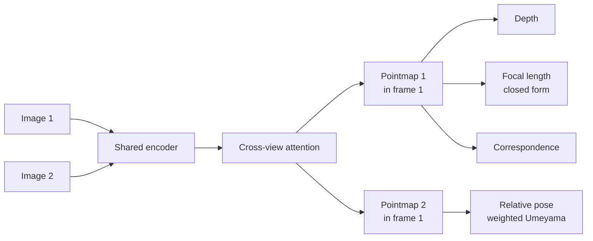

# Learned 3-D: feed-forward pointmaps and Gaussian splats

> **Why this matters at staff level.** The role description pairs classical geometry with
> feed-forward multi-view models and splats, which means the interviewer expects you to hold
> both and to have an opinion about where the boundary sits. The weak answer is "deep learning
> is better now". The strong answer names what each method is estimating, what assumption each
> one can violate silently, and how you would validate a learned reconstruction before a
> vehicle acts on it.

## TL;DR: the interview card

- A **pointmap** is a dense $(3, H, W)$ grid giving each pixel's 3-D location, expressed in a
  *chosen reference camera's frame*. Predicting both views' pointmaps in one frame means the
  network has implicitly solved correspondence, relative pose and depth at once.
- From a pointmap you read back geometry with algebra, no second network: **depth** is the
  $z$ channel, **relative pose** is a weighted Umeyama fit (one SVD), **focal length** has a
  closed form assuming a centred principal point.
- Training uses a **scale-normalised** loss, because a monocular pair cannot observe absolute
  scale. Punishing a model for an ambiguity it cannot resolve teaches it nothing.
- The **confidence channel** with a $-\alpha\log c$ penalty lets the model say "I do not know
  here". The optimum is $c^\star = \alpha / e$, so confidence is an inverse error prediction.
  For a safety pipeline this channel is half the value of the model.
- A **3-D Gaussian splat** is $(\mu, \Sigma, c, \alpha)$. $\Sigma$ is stored as a rotation and
  per-axis scales, $\Sigma = RSS^\top R^\top$, which keeps it positive semi-definite under
  gradient descent for free.
- **EWA projection**: $\Sigma_{2D} = J W \Sigma W^\top J^\top$ with $J$ the Jacobian of the
  projection at the centre. Perspective division is non-linear, so this is a linearisation
  and it degrades away from the principal point.
- Compositing is the same **over** operator as NeRF:
  $C = \sum_i c_i\alpha_i\prod_{j<i}(1-\alpha_j)$. Splatting differs in where the samples come
  from, not how they are combined.
- **Photometric loss is local.** A splat that does not overlap its target has numerically zero
  gradient, which is why real 3DGS depends on splitting, cloning and pruning
  instead of relying on the position gradient alone.
- The line to remember: **rendering quality is not geometric correctness**. A floating blob
  that renders correctly from every training view is a perfect photometric solution and not a
  surface.

## 1. Intuition first

Classical reconstruction is a chain of hand-designed steps, each of which can fail
independently: detect, describe, match, verify, solve, triangulate, optimise. Each step
compresses the image into something smaller (a keypoint, a descriptor, a correspondence) and
throws away everything it did not select.

The feed-forward alternative asks the network to output the answer directly. Give it two
images; ask it to say, for every pixel, where that pixel is in 3-D. Do this in a single
shared coordinate frame, the first camera's.

Now consider what that output has already decided. If pixel $(u_1, v_1)$ in image 1 and pixel
$(u_2, v_2)$ in image 2 map to the same 3-D location, they are a correspondence. The
transformation between camera 2's pointmap in its own frame and the same pixels expressed in
camera 1's frame is the relative pose. The $z$ channel is depth. One regression target, and
the classical outputs are all readable from it with linear algebra.



What it buys, in one sentence: robustness where handcrafted matching fails, because the
network can use semantic and monocular cues (this is a roof, roofs are planar, that shadow
implies a raised edge) where a corner detector finds nothing.

What it costs, in one sentence: the same priors that rescue a textureless roof will
confidently invent geometry that is not there, and the failure is silent.

## 2. The math

### The pointmap loss

Two ingredients. First, scale normalisation. A two-view prediction cannot determine absolute
scale, so divide both prediction and target by their own mean distance from the origin:

$$z = \frac{1}{|V|}\sum_{i \in V}\|X_i\|, \qquad \hat X = X / z.$$

Now a prediction that is correct in shape and wrong in metres incurs no loss, which is the
honest statement of what the input supports.

Second, the confidence weighting:

$$\boxed{\;\mathcal{L} = \frac{1}{|V|}\sum_{i \in V}\Big(c_i\,\|\hat X_i - \hat X^{\text{gt}}_i\| - \alpha\log c_i\Big).\;}$$

Differentiate the per-pixel term with respect to $c_i$ and set to zero:

$$e_i - \frac{\alpha}{c_i} = 0 \quad \Longrightarrow \quad c_i^\star = \frac{\alpha}{e_i}.$$

So the optimal confidence is inversely proportional to the error the model expects to make,
and the log term is what stops the trivial solution $c \to 0$. Without the confidence channel,
sky, water and wind-blown vegetation dominate the gradient because their geometry is
genuinely unpredictable. With it, the model learns to down-weight them and, as a side effect,
hands you a per-pixel trust map.

The test that pins this down: fix a known error and optimise confidence alone, then check it
converges to $\alpha/e$.

### Reading pose back out

Camera 2's pointmap in its own frame is $\{P_i\}$; the same pixels in camera 1's frame are
$\{Q_i\}$. The relative pose is the similarity minimising
$\sum_i w_i \|sRP_i + t - Q_i\|^2$, which is the weighted Umeyama problem with a closed-form
solution:

$$H = \sum_i w_i (Q_i - \bar Q)(P_i - \bar P)^\top, \quad
H = U D V^\top, \quad
R = U\,\mathrm{diag}(1, 1, \det(UV^\top))\,V^\top,$$

$$s = \frac{\mathrm{tr}\big(D\,\mathrm{diag}(1,1,\det(UV^\top))\big)}{\sum_i w_i\|P_i - \bar P\|^2},
\qquad t = \bar Q - sR\bar P.$$

The $\det$ term is the reflection guard. Without it, a mirrored "fit" can have lower error and
is physically meaningless, and the failure shows up as a reconstruction that is inside out.
Use the confidence channel as $w_i$: pixels the network distrusts should not steer the pose.

### Reading focal length back out

Every pixel should satisfy $u - c_x = f\,x/z$ and $v - c_y = f\,y/z$. One unknown, $2HW$
equations, weighted least squares:

$$f^\star = \frac{\sum_i c_i\big[(u_i - c_x)\tfrac{x_i}{z_i} + (v_i - c_y)\tfrac{y_i}{z_i}\big]}
{\sum_i c_i\big[(\tfrac{x_i}{z_i})^2 + (\tfrac{y_i}{z_i})^2\big]}.$$

A property worth noticing, because it is the kind of thing an interviewer probes: this
estimate depends only on ratios $x/z$ and $y/z$, so scaling the whole pointmap leaves it
unchanged. The focal estimate constrains *ray directions* and says nothing about scale. Same
invariance as the loss, for the same reason.

### Gaussian splatting

A splat scene is a set of 3-D Gaussians, each with a centre $\mu$, a covariance $\Sigma$, a
colour $c$ (view-dependent via spherical harmonics in the full method) and an opacity
$\alpha$.

**Parametrising $\Sigma$.** Storing six free numbers risks a matrix that is not positive
semi-definite after a gradient step. Storing a quaternion and three scales and building
$\Sigma = RSS^\top R^\top$ means *any* parameter values give a valid covariance, so the
optimiser can never leave the feasible set. That is the trick, and it generalises to any
constrained parameter in a learned system.

**Projecting $\Sigma$.** A Gaussian pushed through a non-linear map is not Gaussian, so take
the Jacobian of the projection at the centre:

$$J = \begin{bmatrix} f_x/z & 0 & -f_x x/z^2 \\ 0 & f_y/z & -f_y y/z^2\end{bmatrix},
\qquad \Sigma_{2D} = J W \Sigma W^\top J^\top + \epsilon I,$$

where $W$ is the world-to-camera rotation. The $\epsilon I$ dilation is a low-pass filter: a
Gaussian thinner than a pixel aliases into flicker as the camera moves, so every rasteriser
adds one. Be ready to say that the linearisation degrades far from the principal point and for
splats that are elongated in depth, which is a real source of artefacts.

**Compositing.** Sort by depth, then apply the over operator:

$$C = \sum_i c_i\alpha_i\prod_{j<i}(1-\alpha_j), \qquad T_{\text{final}} = \prod_i(1-\alpha_i).$$

Identical to NeRF's quadrature. The difference between the two methods is the sampling
strategy: NeRF queries an MLP at points along a ray, splatting rasterises explicit primitives.
That is why splatting is fast (rasterisation with tile binning) and NeRF is slow (hundreds of
network evaluations per ray).

### Where the depth map from a splat scene comes from

Alpha-weight the depths the same way you alpha-weight the colours:
$D = \sum_i z_i \alpha_i \prod_{j<i}(1-\alpha_j) / (1 - T_{\text{final}})$. This is the
expected depth under the transmittance distribution, and it is the quantity to be suspicious
of. Semi-transparent splats, which the optimiser loves because they blend nicely, produce an
expected depth that sits between two surfaces and corresponds to nothing physical. A view
through a tree canopy is the canonical case.

## 3. Implementation

The confidence loss, and the normalisation it depends on:

```python
def confidence_weighted_loss(pred, target, conf, alpha=0.2, valid=None):
    """L = mean over valid pixels of  c * ||X_hat - X_hat_gt||  -  alpha * log c."""
    pred_n, _ = normalise_scale(pred, valid)            # (B, 3, H, W)
    target_n, _ = normalise_scale(target, valid)        # (B, 3, H, W)
    err = (pred_n - target_n).norm(dim=1, keepdim=True)  # (B, 1, H, W)
    per_pixel = conf * err - alpha * torch.log(conf)     # (B, 1, H, W)
    if valid is None:
        return per_pixel.mean()
    w = valid.to(pred.dtype)                             # (B, 1, H, W)
    return (per_pixel * w).sum() / w.sum().clamp(min=1.0)
```

Confidence is produced as `1.0 + F.softplus(x)`, which floors it at 1 and keeps it positive,
so $\log c \ge 0$ and the penalty cannot run away.

The EWA projection, which is the equation above typed out:

```python
def project_covariance(mu_cam, cov, K, R, dilation=0.3):
    """Sigma_2D = J W Sigma W^T J^T + eps I. (B, 3), (B, 3, 3) -> (B, 2, 2)."""
    fx, fy = K[0, 0], K[1, 1]
    x, y, z = mu_cam[:, 0], mu_cam[:, 1], mu_cam[:, 2].clamp(min=1e-6)   # (N,) each
    J = torch.zeros(len(mu_cam), 2, 3, dtype=mu_cam.dtype)
    J[:, 0, 0], J[:, 1, 1] = fx / z, fy / z
    J[:, 0, 2], J[:, 1, 2] = -fx * x / z**2, -fy * y / z**2   # (N, 2, 3)
    W = J @ R                                                  # (N, 2, 3)
    return W @ cov @ W.transpose(1, 2) + dilation * torch.eye(2)  # (N, 2, 2)
```

Front-to-back compositing, written as a loop so the transmittance recursion is visible:

```python
def alpha_composite(colors, alphas):
    """C = sum_i c_i a_i prod_{j<i} (1 - a_j), and the leftover transmittance."""
    transmittance = torch.ones_like(alphas[0])      # (...,) starts fully open
    image = torch.zeros_like(colors[0])             # (C, ...)
    for i in range(len(alphas)):
        weight = alphas[i] * transmittance          # (...,) contribution of sample i
        image = image + colors[i] * weight[None]
        transmittance = transmittance * (1.0 - alphas[i])
    return image, transmittance
```

### How you would test it

Two tests earn their place because each encodes a fact you should be able to state.

```python
def test_ewa_projection_shrinks_with_depth_like_one_over_z_squared():
    # on axis, J = diag(f/z, f/z), so Sigma_2D = (f sigma / z)^2 I
    assert torch.isclose(det(cov2d_at_5m) / det(cov2d_at_10m), torch.tensor(16.0))

def test_photometric_fit_stalls_when_the_splat_misses_its_target_entirely():
    """The local-support failure that densification exists to fix."""
    losses, mu = fit_mu(start=far_away, target_mu=target)   # 25 px apart, sigma ~5 px
    assert losses[-1] > 0.3 * losses[0]        # barely moved: the gradient is ~0
```

The second one is the more useful test to have written, because it converts "splatting needs
adaptive density control" from a remembered fact into a demonstrated one. Writing the test
that *fails to converge* is how you prove you understand the failure mode.

## Retype by hand

| Symbol | File | Target time | Why |
|---|---|---|---|
| `normalise_scale` | `src/mlbook/perception/pointmap.py` | 5 minutes | Short, and the reasoning behind it is the whole framing. |
| `confidence_weighted_loss` | `src/mlbook/perception/pointmap.py` | 8 minutes | Be able to derive $c^\star = \alpha/e$ on the spot. |
| `estimate_focal` | `src/mlbook/perception/pointmap.py` | 10 minutes | A tidy weighted-least-squares derivation with a memorable invariance. |
| `weighted_umeyama` | `src/mlbook/perception/pointmap.py` | 15 minutes | Reflection guard included. Also appears as `kabsch_umeyama` in `geometry/icp.py`. |
| `covariance_from_scale_rotation` | `src/mlbook/geometry/splatting.py` | 6 minutes | The PSD-by-construction trick. |
| `project_covariance` | `src/mlbook/geometry/splatting.py` | 10 minutes | The EWA Jacobian, which is the same $J_\pi$ from bundle adjustment. |
| `alpha_composite` | `src/mlbook/geometry/splatting.py` | 6 minutes | Five lines, and it is the NeRF rendering equation too. |

Check with `python -m pytest tests/test_perception_pointmap.py tests/test_geometry_splatting.py -q`.

## 4. Systems view: when to use which

| | Classical SfM / MVS | Feed-forward pointmaps | Gaussian splats |
|---|---|---|---|
| **Estimates** | Poses and metric-up-to-scale structure | Dense per-pixel 3-D, pose, focal | A radiance field, geometry implicitly |
| **Needs** | Texture, overlap, baseline | A trained model, in-distribution input | Posed images (usually from SfM) |
| **Fails on** | Textureless, repetitive, moving, specular | Out-of-distribution scenes; hallucinates plausibly | Sparse views; semi-transparency; anything it was not trained to see |
| **Failure is** | Loud (no match, high residual, sparse output) | Quiet (confident, plausible, wrong) | Quiet from novel views, loud from training views |
| **Cost** | Iterative, minutes to hours | One forward pass, sub-second | Minutes of per-scene optimisation |
| **Uncertainty** | Reprojection residuals, $H^{-1}$ covariance, triangulation angle | A learned confidence channel, trained end to end | Opacity and transmittance, which are not calibrated uncertainty |
| **Metric scale** | From GNSS, altimeter, control points | Not observed; must be supplied | Inherited from the SfM that posed it |

**Decision rule.** Use classical geometry wherever you can validate it, because its failures
announce themselves and its uncertainty comes from the measurement model instead of from training. Use feed-forward prediction where classical matching produces nothing (textureless
roofs, fast turnaround, sparse or wide-baseline views) and treat its output as a *hypothesis*.
Use splats for appearance, novel-view synthesis, simulation and human review, and do not take
metric geometry off a splat without independent validation.

### The hybrid answer

The version of this answer that reads as staff level refuses the dichotomy and names the
architecture instead:

> I would not treat them as alternatives. I would use the learned model to produce
> correspondences and a dense initialisation where classical matching is weak, and then keep
> the explicit geometric machinery on top: enforce the epipolar constraint, run bundle
> adjustment on the resulting correspondences, and use reprojection error as an independent
> check that the learned geometry is consistent with the images. The learned part earns
> coverage; the geometric part earns trust, because it produces a residual I can threshold.

Then name the concrete validation: reprojection error of the learned pointmap against the
images, agreement between the learned depth and the triangulated depth where both exist,
agreement between the learned pose and the GNSS baseline, and multi-view consistency of the
predicted 3-D point across more views than the model saw.

### Where a learned reconstruction hallucinates

Be specific, because "distribution shift" is a phrase and these are the actual cases.

* **Textureless surfaces.** The model fills from a prior. A flat roof gets the roof the
  training set had, including a plausible pitch that is not this roof's pitch.
* **Thin structures.** Power lines, guy wires, thin branches. A wire is a sub-pixel object
  that the prior has little reason to preserve, so it gets smoothed into the background. This
  is the single most dangerous failure for a tethered delivery.
* **Reflective and transparent surfaces.** Water, glass, wet roads. The model predicts the
  geometry of the reflection.
* **Repetitive structure.** The model resolves ambiguity by picking the most common training
  configuration.
* **Scale.** Systematically, because it is not observable. A model trained mostly on indoor
  scenes will produce plausible indoor-scale geometry for a backyard.
* **Novel viewpoints and altitudes.** A model trained on ground-level and handheld imagery
  applied to 90 m nadir aerial is out of distribution in a way no benchmark number will warn
  you about.

## 5. In production

!!! production "Naver Labs Europe, DUSt3R, dropping the pipeline"
    DUSt3R casts pairwise reconstruction as regression of pointmaps and operates without prior
    information about camera calibration or viewpoint poses, relaxing the hard constraints of
    the usual projective camera model and unifying the monocular and binocular cases. The
    reported outputs include the 3-D model of the scene plus depth, and it can recover pixel
    matches and relative and absolute camera parameters from the same prediction. The
    architecture is standard transformer encoders and decoders, which is the point: the
    novelty lies in the output parametrisation.
    Source: [DUSt3R, arXiv 2312.14132](https://arxiv.org/abs/2312.14132) (CVPR 2024).

!!! production "Meta and Oxford, VGGT, scaling the idea to many views"
    VGGT is a feed-forward network that directly infers camera parameters, point maps, depth
    maps and 3-D point tracks from one, a few, or hundreds of views, reconstructing in under a
    second and reported to outperform alternatives that require post-processing with
    optimisation-based visual geometry. It received the CVPR 2025 best paper award. The
    trajectory to notice for an interview: two views (DUSt3R) to many views in one pass, with
    the geometry heads predicted jointly instead of derived one from another.
    Source: [VGGT, CVPR 2025](https://openaccess.thecvf.com/content/CVPR2025/html/Wang_VGGT_Visual_Geometry_Grounded_Transformer_CVPR_2025_paper.html),
    [code](https://github.com/facebookresearch/vggt).

!!! production "INRIA and MPI, 3D Gaussian Splatting, real time by changing the representation"
    Kerbl and colleagues represent the scene with 3-D Gaussians initialised from the sparse
    points that camera calibration already produces, interleave optimisation with density
    control of the Gaussians including anisotropic covariance optimisation, and use a
    visibility-aware rasteriser that supports anisotropic splatting. The reported result is
    state-of-the-art visual quality with real-time rendering at 1080p. The lesson that
    transfers: they kept the volume rendering equation and changed the primitive, which turned
    an MLP-query problem into a rasterisation problem.
    Source: [3D Gaussian Splatting project page](https://repo-sam.inria.fr/fungraph/3d-gaussian-splatting/),
    ACM Transactions on Graphics 42(4), July 2023.

## 6. Interview questions and strong answers

!!! interview "Why use a feed-forward model instead of traditional SfM?"
    They estimate different things and fail differently, so I would compare them on those axes
    instead of on benchmark numbers.

    SfM gives interpretable geometry with strong geometric consistency, needs no training
    data, and produces uncertainty derived from the measurement model: reprojection residuals,
    triangulation angles, a covariance from the Hessian. It is iterative and expensive, it
    depends entirely on correspondence, and it is brittle in textureless and repetitive
    regions, which describes a lot of a suburban property.

    A feed-forward model amortises the computation into one forward pass, can exploit semantic
    and monocular priors where handcrafted matching finds nothing, and degrades gracefully
    where SfM returns nothing at all. The costs are distribution shift, hallucination that is
    plausible and therefore hard to detect, no observed metric scale, and uncertainty that is
    learned from data instead of derived from the measurement model.

    **Staff-level follow-up.** I would not treat them as mutually exclusive. I would use the
    learned model for correspondence and dense initialisation, retain the explicit geometric
    constraints, and validate with reprojection error. The learned part buys coverage; the
    geometric part buys a residual I can threshold and alert on.

!!! interview "Explain Gaussian splatting. Why not just use a point cloud?"
    A splat scene is a set of anisotropic 3-D Gaussians, each with a position, a covariance
    stored as a rotation and three scales, a view-dependent colour and an opacity. Rendering
    projects each one into image space through the Jacobian of the projection, then composites
    front to back with the standard over operator.

    Against a point cloud: a point has no extent, so rendering it requires choosing a splat
    size anyway, and there is no principled way to blend between points, which is why point
    clouds look sparse and holey from novel viewpoints. Gaussians give a continuous,
    differentiable density and appearance field, so the representation can be optimised
    end-to-end against images and can represent soft boundaries such as foliage. A point cloud
    also cannot express view-dependent appearance, so specular surfaces look wrong from every
    angle but one.

    The cost is that a splat scene has no explicit surface. You cannot query "is there
    geometry at this point" without a convention, and the optimiser is free to use
    semi-transparent blobs that reduce photometric loss and do not correspond to matter.

!!! interview "Why not NeRF?"
    Both use the same volume rendering equation; they differ in the sampling strategy. NeRF
    queries an MLP at many points along each ray, so rendering cost scales with samples per
    ray times rays, and training and inference are both slow. Splatting rasterises explicit
    primitives with tile binning and depth sorting, so it maps onto a GPU rasteriser and
    reaches real time.

    Splatting is also explicit, which matters operationally. You can inspect, cull, crop and
    edit the primitives, stream them, and reason about where they are. A NeRF is a set of
    weights with the geometry implicit, which is harder to debug and harder to partially
    update. For an offboard system serving per-property assets, that difference in
    operability is worth more than the quality gap.

    In fairness to NeRF, an MLP can be more compact for smooth scenes and generalises
    differently, and the field has converged on hybrids, so I would frame it as a
    representation choice driven by latency, editability and scene type.

!!! interview "Would you use Gaussian splats directly for a safety decision?"
    No. The reason is specific, and worth separating from general caution.

    A splat scene is optimised against a photometric loss. That loss is fully satisfied by any
    configuration that renders correctly from the training views, and floating semi-transparent
    blobs do exactly that. The expected depth from alpha compositing can sit between two
    surfaces and correspond to nothing physical, which is exactly the case near a tree canopy
    or a wire. So high render quality is evidence about appearance and weak evidence about
    metric geometry.

    What I would do instead: use splats for what they are good at, which is appearance,
    novel-view synthesis for human review, and simulation. Derive the safety geometry from a
    source with an error model I can validate: multi-view stereo with reprojection residuals,
    a surface model checked against control points, and a triangulation-angle threshold. Then,
    if I want to use the splat reconstruction, validate it against that independent geometry
    and propagate the disagreement into the decision as uncertainty. A site where the splat
    geometry and the photogrammetric geometry disagree by more than a threshold is a site the
    system should decline, rather than one it should guess about.

!!! interview "You predict a pointmap for a backyard. How do you make it metric?"
    The network's output is scale-free by construction, and the loss was scale-normalised, so
    there is no scale hiding in the weights to recover. Scale has to be imported.

    Options, in rough order of how much I would trust them. GNSS baselines between the capture
    positions: fit the similarity that aligns the predicted camera centres to the measured
    ones, which gives scale directly and is free on a commercial airframe. A laser altimeter
    or range finder reading at a known pixel, which is a single direct metric measurement. A
    surveyed ground control point in the scene. And, weakest, a known object dimension such as
    a standard door or a vehicle, which is a fallback with several percent error.

    Then I would validate rather than assume. Hold out some GNSS baselines, apply the recovered
    scale, and check the residual. If scale recovered from the first half of the flight
    disagrees with the second half by more than a few percent, something is wrong with the
    prediction and the site should not be scored.

!!! interview "How would you detect that a learned reconstruction is hallucinating?"
    Four independent checks, because a single one can be fooled.

    Photometric consistency: reproject the predicted geometry into the images it came from and
    into images it did not see. A hallucinated surface often reprojects acceptably into the
    training views and badly into a held-out view.

    Cross-method agreement: run classical MVS where texture allows and compare. Disagreement
    concentrated in textureless regions is the signature of prior-filling.

    Self-consistency: predict the pointmap from different pairs covering the same ground and
    compare in a common frame. A confident model that is confidently different across pairs is
    hallucinating.

    The confidence channel, used properly: it is trained to predict error, so it is a good
    first filter and a poor last one. It is calibrated on the training distribution, which is
    precisely the distribution you are worried about having left.

    On top of those, monitor aggregate statistics per region and per capture condition. A
    sudden change in the fraction of low-confidence pixels after a model update or a weather
    change is the alert that catches the failure before a customer does.

## 7. Exercises

**★ 1.** Show that the confidence loss has optimum $c^\star = \alpha/e$ and explain what
happens without the log term.

??? success "Solution"
    $\partial/\partial c\,(ce - \alpha\log c) = e - \alpha/c = 0$, so $c^\star = \alpha/e$. The
    second derivative is $\alpha/c^2 > 0$, so it is a minimum. Without the log term the
    objective is $ce$, decreasing in $c$ for any $e > 0$, so the optimum is $c = 0$ everywhere
    and the model learns to declare total ignorance, making the loss identically zero and the
    gradient on the geometry vanish.

**★ 2.** An isotropic 3-D Gaussian with $\sigma = 0.1$ m sits on the optical axis at 5 m, with
$f = 200$ px. What is its 2-D covariance? At 10 m?

??? success "Solution"
    On axis, $x = y = 0$, so $J = \mathrm{diag}(f/z, f/z)$ and
    $\Sigma_{2D} = (f\sigma/z)^2 I$. At 5 m: $(200 \times 0.1 / 5)^2 = 16$ px$^2$, so a standard
    deviation of 4 px. At 10 m: $(200\times0.1/10)^2 = 4$ px$^2$, 2 px. Doubling depth halves
    the image-space standard deviation and quarters the area, which is the
    $1/z^2$ scaling the test checks.

**★★ 3.** Derive the closed-form focal estimate and show it is invariant to scaling the
pointmap.

??? success "Solution"
    Minimise $\sum_i c_i[(u_i - c_x - f x_i/z_i)^2 + (v_i - c_y - f y_i/z_i)^2]$ over $f$.
    Differentiating and setting to zero gives the quotient in section 2. Scaling the pointmap
    by $\lambda$ sends $x \to \lambda x$ and $z \to \lambda z$, so $x/z$ is unchanged, and both
    numerator and denominator are unchanged. Geometrically, scaling moves every point along
    its own ray, and a ray through the camera centre is exactly what a pixel measures.

**★★ 4 (coding).** Implement `weighted_umeyama` with the reflection guard and write the test
that catches a missing guard.

??? success "Solution"
    The implementation is in `src/mlbook/perception/pointmap.py`. The test that catches a
    missing guard uses data that *only* a reflection can fit:

    ```python
    src = rng.normal(size=(30, 3))
    dst = src * np.array([1.0, 1.0, -1.0])     # a mirror; no rotation fits it
    R_hat, _, _ = kabsch_umeyama(src, dst)
    assert np.isclose(np.linalg.det(R_hat), 1.0)   # stayed in SO(3), so the fit is poor
    ```

    Without the guard, $R = UV^\top$ has determinant $-1$ and fits the mirrored data exactly,
    so the residual is zero and every other test passes. Asserting on the determinant rather
    than on the residual is what makes this test useful.

**★★★ 5.** You have a feed-forward model producing pointmaps for 10 million properties and a
classical MVS pipeline that is 50 times more expensive. Design the system that uses both.

??? success "Solution"
    Treat the learned model as the default path and the classical pipeline as a verifier and a
    fallback, with routing decided by measurable signals instead of a fixed split.

    *Always run the learned model.* One forward pass per property, producing pointmaps, depth,
    confidence and pose. This is the coverage layer and it must be cheap enough to run on
    everything.

    *Compute a trust score per property* from signals available without the expensive path:
    the fraction of low-confidence pixels, disagreement between overlapping pairs, residual
    after aligning predicted camera centres to GNSS, and the fraction of the site's candidate
    landing area that sits in low-confidence regions. Calibrate this score against the
    classical pipeline on a sample, so it predicts disagreement rather than merely correlating
    with it.

    *Route by consequence, not only by trust.* A property whose candidate site has generous
    clearance and unambiguous geometry does not need verification even at moderate trust,
    because the decision is insensitive to the residual error. A property where the decision
    is marginal (clearance close to the threshold, hazards near the site, a descent corridor
    with nearby vertical structure) gets the expensive path regardless of trust. This is
    value-of-information routing, and it is the argument that makes the design defensible:
    spend compute where it can change the decision.

    *Close the loop.* Every property that goes down the expensive path produces a labelled
    comparison, which is training data for both the trust model and the pointmap model. Sample
    a small random fraction through the expensive path regardless of routing, so the
    comparison set is not biased toward cases the trust model already flags, which is the
    standard trap in any selective-verification design.

    *Budget.* If the trust model routes 5% of properties to the classical path plus a 1%
    random audit, the cost is $0.94 \times 1 + 0.06 \times 50 \approx 3.9$ units per property
    against 50 for running MVS on everything, a factor of 13, while keeping an unbiased
    estimate of the learned model's error rate.

## References

* Wang, Leroy, Cabon, Chidlovskii and Revaud, "DUSt3R: Geometric 3D Vision Made Easy",
  CVPR 2024. [arXiv:2312.14132](https://arxiv.org/abs/2312.14132).
* Wang, Chen, Karaev, Vedaldi, Rupprecht and Novotny, "VGGT: Visual Geometry Grounded
  Transformer", CVPR 2025.
  [CVF open access](https://openaccess.thecvf.com/content/CVPR2025/html/Wang_VGGT_Visual_Geometry_Grounded_Transformer_CVPR_2025_paper.html).
* Kerbl, Kopanas, Leimkühler and Drettakis, "3D Gaussian Splatting for Real-Time Radiance
  Field Rendering", ACM Transactions on Graphics 42(4), 2023.
  [Project page](https://repo-sam.inria.fr/fungraph/3d-gaussian-splatting/).
* Mildenhall, Srinivasan, Tancik, Barron, Ramamoorthi and Ng, "NeRF: Representing Scenes as
  Neural Radiance Fields for View Synthesis", ECCV 2020.
* Zwicker, Pfister, van Baar and Gross, "EWA Splatting", IEEE TVCG 8(3), 2002. The elliptical
  weighted average projection that 3DGS uses.
* [Part IV, 3-D perception](../part04-vision/07-3d-perception.md) and
  [Part XI, occupancy](../part11-perception-autonomy/05-occupancy-temporal.md) for adjacent
  representations.
