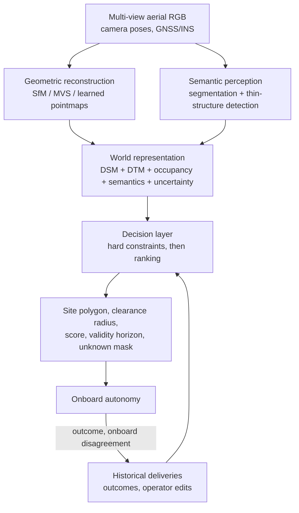

# Designing the deliverability system

> **Why this matters at staff level.** This is the question the role is built around, and it
> is the one where a strong candidate separates from a good one in the first ninety seconds.
> The good candidate starts training a segmentation model. The strong candidate starts with
> what the vehicle consumes, separates perception outputs from the decision policy, makes the
> safety constraints explicit and auditable, and stages the whole thing as a roadmap with
> promotion criteria. The geometry chapters were the entrance exam; this is the interview.

## TL;DR: the interview card

- **Start from the product output**, never from the model. The deliverable is a prior the
  vehicle consumes: a safe region, a clearance radius, a score, and an explicit *unknown*.
- **Separate perception from policy.** The segmentation model answers "what is this pixel".
  A separate decision layer answers "can we deliver", over geometry, semantics and history.
  Do not ask the network to predict deliverability end to end in version one.
- **Hard constraints are a conjunction**, each independently checkable and individually
  loggable: $\text{safe}(x) = [\text{slope} < \tau_s] \wedge [\text{clearance} > \tau_c] \wedge [P(\text{hazard}) < \tau_o] \wedge \ldots$
- **The target is a disk, so measure a radius.** Area is the wrong statistic. The largest
  inscribed circle is exact from a distance transform.
- **The free space is a vertical corridor.** A tethered droid descends from altitude, so
  the constraint is a vertical cylinder of clear space, and wires are the dominant hazard in
  it.
- **Threshold the upper confidence bound**, $p + n\sigma$, in place of the mean. Uncertainty should
  cost coverage, never safety.
- The decision threshold is an **economics** question:
  deliver iff $P(\text{unsafe}) < C_{\text{decline}} / C_{\text{incident}}$.
- **Declining is a first-class output.** A system with three actions (deliver here, deliver
  at an alternate site, decline and escalate) is safer and more useful than one with two.
- **Priors go stale.** A trampoline appears in June. Ship a validity horizon and a
  confidence-decay model with every prior.
- Stage it: rules and classical geometry, then supervised perception, then multi-view learned
  geometry, then richer priors, then a continuous feedback loop. Each stage needs a
  **promotion criterion** written before the work starts.

## 1. Intuition first

### Do not answer yet

The prompt will be something like: *we have aerial survey imagery of a customer's property;
before a drone attempts a delivery, determine whether a location is safe and suitable. Design
the perception system.*

Four questions, sixty seconds, and they are not stalling. Each one changes the design.

!!! example "The clarifying exchange"
    **You.** Before I design this, four things. First, what does the vehicle actually consume?
    Am I producing a binary gate, a ranked set of candidate sites, or a dense prior the
    onboard stack fuses with its own live perception?

    **Interviewer.** Assume a prior the onboard system uses. It also has its own downward
    camera on descent.

    **You.** Good, that changes the failure model. The onboard system is the last line of
    defence, so my job is to be *correctly conservative* and to be explicit about where I do
    not know, so the vehicle knows when to rely on itself. Second question: what does the
    delivery physically require? A landing footprint, a hover with a winch, something else?

    **Interviewer.** A droid descends on a tether from a few hundred feet and steers itself to
    roughly a one metre target.

    **You.** Then the constraint is a vertical corridor, not a ground patch, and thin
    structures in that corridor are my dominant hazard. Third: how fresh is the imagery, and do
    I get repeat passes?

    **Interviewer.** Survey imagery, possibly months old. Repeat coverage occasionally.

    **You.** So staleness is a first-class problem and the prior needs a validity horizon.
    Last one: what are the relative costs of declining a deliverable site and of attempting an
    undeliverable one?

    **Interviewer.** Wildly asymmetric. An incident is catastrophic; a decline is a customer
    inconvenience.

    **You.** Then the operating point is essentially fixed by that ratio, and my design should
    make it a tunable number with an owner, not a threshold buried in a model.

Those four answers have already determined: a dense prior with an explicit unknown class, a
3-D corridor constraint, a staleness model, and a decision layer with an externally owned
threshold. Now you can design.

### The shape of the system



Three layers, and the boundaries between them are the design.

**Geometry** answers where surfaces are: ground surface, slope, object height above ground,
clearance, buildings, trees, wires and poles, plus a reconstruction confidence per cell.

**Semantics** answers what things are: grass, driveway, patio, roof, road, water, vehicle,
person, pool, trampoline, fence, solar panel, wire.

**The decision layer** combines them with history and constraints into the product output.
Keeping it separate is what makes the system auditable, lets you change a threshold without
retraining anything, and lets a safety reviewer read the policy as code.

## 2. The math

### Perception outputs versus decision policy

Model the deliverability of a candidate site $x$ as

$$P(\text{deliverable} \mid G, S, H)$$

where $G$ is geometry, $S$ semantics, $H$ historical and contextual information. Then, and
separately, impose the hard constraints:

$$\boxed{\;\text{safe}(x) = \big[\text{slope}(x) < \tau_s\big] \wedge \big[\text{clearance}(x) > \tau_c\big] \wedge \big[P(\text{hazard}, x) < \tau_o\big] \wedge \big[\text{corridor clear}\big].\;}$$

The reason to keep those two objects apart is that they have different owners and different
change processes. The probability is a model output, retrained monthly, validated
statistically. The conjunction is a policy, reviewed by whoever owns safety, changed
deliberately, and traceable in a log: when the system declines, it must be able to say *which
clause failed*. A single learned scalar cannot do that.

### The corridor, not the patch

The tethered-descent detail changes the geometry of the question. The droid comes down from
altitude, so the requirement is a clear vertical cylinder:

$$\text{corridor}(x, r) = \{(p, z) : \|p - x\| \le r,\; 0 \le z \le h_{\text{release}}\},$$

and the constraint is that this cylinder contains no occupied voxel. A digital surface model
answers the ground question and misses an overhanging branch, a power line crossing the yard
at 8 m, or a gutter. So the representation has to be volumetric in the region above candidate
sites, even if a 2.5-D surface model is enough elsewhere.

This is also where the resolution budget gets spent. A 10 mm conductor at 4 cm ground sample
distance is a quarter of a pixel, so it will not be found by a per-pixel segmentation head
operating on a single frame. Three things that do work, stated together because the
combination is the answer: exploit the fact that a wire is long, so a line-structured
detector integrating evidence along a curve beats per-pixel classification; exploit multi-view
consistency, since a wire appears in many frames along a predictable epipolar path; and
exploit context, because wires attach to poles and poles are large, so detect the poles and
hypothesise the catenary between them.

### Uncertainty, and which way to be wrong

Given a predictive mean and standard deviation per cell, threshold the pessimistic estimate:

$$\text{acceptable}(x) = \big[p(x) + n\sigma(x) \le \tau\big].$$

A model that says "5% hazard, plus or minus 20%" and one that says "5% hazard, plus or minus
1%" should not produce the same decision. Using the upper confidence bound means uncertainty
costs **coverage** rather than **safety**, which is the direction this product wants to be
wrong in.

### The threshold is an economics question

Two actions, two costs. Let $q = P(\text{unsafe} \mid x)$.

$$\mathbb{E}[\text{cost of delivering}] = q\,C_{\text{incident}}, \qquad
\mathbb{E}[\text{cost of declining}] = C_{\text{decline}}.$$

Deliver when the first is smaller:

$$\boxed{\;q < \frac{C_{\text{decline}}}{C_{\text{incident}}}.\;}$$

If an incident costs four orders of magnitude more than a decline, the threshold is $10^{-4}$,
and the entire evaluation problem becomes estimating a probability in that regime. Say this
number out loud in the interview, because it immediately reframes the evaluation discussion:
you cannot validate a $10^{-4}$ failure rate with a thousand-sample test set, which is why the
evaluation chapter is about slices, proxies and staged exposure rather than aggregate metrics.

A third action fixes the worst of this. "Decline" is expensive because it fails the customer.
"Deliver at an alternate site on the same property" often costs almost nothing and preserves
the delivery, so the real policy is: pick the best site whose upper-confidence risk is under
threshold; if none exists, escalate for human review or a different delivery mode. Designing
three actions instead of two is a small change that moves the coverage-safety frontier.

### Calibration is what makes the threshold meaningful

$q$ has to be a probability, not a score. If the model outputs 0.05 for a set of sites,
roughly 5% of them must be unsafe. Without calibration, the economic threshold is arbitrary.
Temperature scaling on a held-out set, isotonic regression, or a conformal wrapper giving
distribution-free coverage guarantees are all reasonable, and the conformal option has the
advantage that the guarantee survives moderate distribution shift with a documented
assumption. See [Part XIII on uncertainty and reliability](../part13-retrieval-eval-reliability/index.md).

## 3. Implementation

The safety mask, as a conjunction that returns its own components:

```python
def safety_mask(slope, relief, hag, hazard_prob, cfg):
    """Hard constraints, plus the per-constraint masks for debugging."""
    parts = {
        "slope": slope <= cfg.max_slope_deg,                   # (H, W) bool
        "relief": relief <= cfg.max_relief_m,                  # (H, W)
        "height": hag <= cfg.max_height_above_ground_m,        # (H, W)
        "semantic": hazard_prob <= cfg.max_hazard_prob,        # (H, W)
    }
    safe = parts["slope"] & parts["relief"] & parts["height"] & parts["semantic"]
    if cfg.hazard_dilation_m > 0:
        # push the boundary back from every hazard: a buffer around wires and trunks
        margin_px = cfg.hazard_dilation_m / cfg.gsd
        safe = safe & (distance_transform_edt(parts["semantic"]) >= margin_px)
    return safe, parts
```

Returning `parts` is a design decision, not a convenience. When the system rejects a yard, the
first question is always *which constraint rejected it*, and a single boolean cannot answer
that. This is the difference between a system you can operate and one you can only rerun.

Clearance as a radius, which is where the distance transform earns its place:

```python
def largest_inscribed_disk(mask):
    """Radius (pixels) and centre of the largest disk fitting inside ``mask``."""
    if not mask.any():
        return 0.0, (0, 0)
    dist = distance_transform_edt(mask)          # (H, W) distance to nearest blocked pixel
    row, col = np.unravel_index(int(np.argmax(dist)), mask.shape)
    return float(dist[row, col]), (int(row), int(col))
```

The distance transform *is* the answer: its maximum is the inradius and its argmax is the
deepest interior point. Two lines, exact, $O(HW)$.

And the ranking score, which is deliberately transparent:

```python
def site_score(site, cfg):
    """A weighted product of normalised margins over sites that already passed every constraint."""
    clearance = min(site.clearance_m / (2.0 * cfg.min_clearance_m), 1.0)
    flatness = max(0.0, 1.0 - site.mean_slope_deg / cfg.max_slope_deg)
    smoothness = max(0.0, 1.0 - site.max_relief_m / cfg.max_relief_m)
    semantic = max(0.0, 1.0 - site.mean_hazard_prob / cfg.max_hazard_prob)
    return float(clearance * (0.25 + 0.75 * flatness) * (0.25 + 0.75 * smoothness)
                 * (0.25 + 0.75 * semantic))
```

A product rather than a weighted sum, because one near-zero margin should not be averaged away
by three comfortable ones. This is Phase 0's ranking; it gets replaced by a learned model once
there are outcome labels from real deliveries, and the transparent version stays as the
fallback and the sanity check.

### How you would test it

The test worth writing first is the one that encodes the design's central claim, that area is
the wrong statistic:

```python
def test_clearance_beats_area_on_an_l_shaped_region():
    """A long thin strip has plenty of area and nowhere to land."""
    strip = ...   # two 8 px arms forming an L
    square = ...  # a 20 x 20 px block
    assert strip.sum() > square.sum()        # the strip has MORE area
    r_strip, _ = largest_inscribed_disk(strip)
    r_square, _ = largest_inscribed_disk(square)
    assert r_strip < r_square                # and LESS usable clearance
```

Then the end-to-end test on a synthetic property with a known answer, which is how you get a
regression suite for a system whose real labels are scarce:

```python
def test_find_landing_sites_picks_the_lawn_and_rejects_the_rest():
    dsm, dtm, hazard = synthetic_yard()      # lawn, 20-degree driveway, tree, fence, path
    sites, safe, parts = find_landing_sites(dsm, dtm, hazard, cfg, min_area_m2=1.0)
    row, col = sites[0].centre_px
    assert hazard[row, col] < 0.05           # not under the tree
    assert col < 52                          # not on the driveway
    assert not parts["slope"][:, 60:].any()  # the ramp failed the slope clause specifically
```

Asserting on `parts["slope"]` rather than only on the final mask is what makes the test
diagnostic: if it fails, you know which constraint moved.

Each of the four constraints also gets a test that it rejects *on its own*, with the other
three satisfied. That is the cheap way to catch the classic bug where a constraint is computed
and then never used.

## Retype by hand

| Symbol | File | Target time | Why |
|---|---|---|---|
| `connected_components` | `src/mlbook/perception/landing_zone.py` | 12 minutes | The single most likely coding question in this loop. Iterative, 4 and 8 connectivity. |
| `distance_transform_edt` and `_edt_1d` | `src/mlbook/perception/landing_zone.py` | 25 minutes | The Felzenszwalb lower-envelope sweep. Hard, and a genuine differentiator. |
| `largest_inscribed_disk` | `src/mlbook/perception/landing_zone.py` | 3 minutes | Trivial once the EDT exists, which is the point to make. |
| `slope_degrees`, `local_relief` | `src/mlbook/perception/landing_zone.py` | 10 minutes | Separable sliding max is a nice complexity answer. |
| `safety_mask` | `src/mlbook/perception/landing_zone.py` | 8 minutes | The conjunction plus the buffer. |
| `region_properties` | `src/mlbook/perception/landing_zone.py` | 10 minutes | One-pass `bincount` accumulation instead of a loop over labels. |
| `find_landing_sites` | `src/mlbook/perception/landing_zone.py` | 15 minutes | The orchestration. Practise saying it aloud while typing. |

Check with `python -m pytest tests/test_perception_landing_zone.py -q`.

## 4. Systems view: the staged roadmap

The staff-level distinction in this posting is explicitly about roadmaps, so answer in stages,
and give each stage a promotion criterion decided before the work starts.

### Phase 0: rules and classical geometry

Photogrammetry to a digital surface model, a bare-earth model by morphological filtering, and
hand-written constraints on slope, relief, height above ground and clearance. No learning at
all beyond whatever the reconstruction uses.

*Why first.* It is the baseline every later phase is measured against, it produces the
labelling and review tooling you need for everything else, and it exposes the real
distribution of yards, which is invariably weirder than anyone's intuition.

*Promotion criterion.* On a hand-labelled set of a few hundred properties, measure the
fraction of sites an expert reviewer accepts and the fraction of expert-accepted sites the
system finds. Promote when the rules are stable enough that the remaining errors are
*semantic* (it cannot tell a pond from a lawn) rather than geometric, which is the signal that
the next phase should be a semantic model.

### Phase 1: supervised semantic perception

A segmentation model over the aerial imagery: surface classes plus hazard classes. Fuse its
output into the same constraint structure, replacing the "unknown" semantic term.

*Promotion criterion.* Per-class recall on the hazard classes at the operating point, measured
on held-out properties rather than held-out tiles, because tiles from the same property leak.
Specifically: recall on the rare hazard classes above some agreed floor, and no regression in
the rate at which reviewers overturn the system's decisions.

### Phase 2: multi-view learned geometry

Feed-forward pointmaps or learned MVS, to get geometry where classical matching fails, with
the confidence channel feeding the uncertainty term. Keep the classical pipeline as the
verifier on a routed subset, as in the routing design from
[chapter 4](04-learned-3d-and-splats.md).

*Promotion criterion.* Agreement with the classical pipeline within a metric tolerance on the
properties where classical succeeds, plus a measured improvement in coverage on the properties
where it fails, plus no increase in disagreement with onboard perception at descent time.

### Phase 3: richer priors and foundation models

Larger pretrained backbones, open-vocabulary hazard detection for the long tail (a
trampoline, a marquee, a new pool, a car cover), cross-property priors, and learned
preferences from historical deliveries.

*Promotion criterion.* Improvement on the long-tail slices specifically, since aggregate
metrics will not move. This is the phase where the evaluation infrastructure has to already
exist, which is why it is Phase 3 and not Phase 1.

### Phase 4: continuous feedback

Hard-example mining from onboard disagreement, from operator overrides, from aborted
deliveries, and from any case where the vehicle's live perception contradicted the prior. That
last signal is the valuable one and it is free: every delivery is a supervised test of the
prior.

*Promotion criterion.* The loop itself is the deliverable, so measure the cycle time from
"failure observed in the field" to "fix validated in the evaluation set", and the fraction of
new training data that comes from mined hard examples rather than from random sampling.

### The interfaces that make this survivable

Three contracts to name unprompted.

**The prior schema is versioned.** Every artefact the vehicle consumes carries a model
version, a generation timestamp, a validity horizon, and per-cell confidence. When you change
the meaning of a field, you bump the version and the vehicle knows how to refuse an
incompatible one.

**Replay is a first-class capability.** Recorded inputs (imagery, poses, metadata) can be run
through an arbitrary version of the offboard stack, deterministically. Without this, debugging
a field incident means guessing. With it, you bisect.

**Unknown is a value, not a gap.** Every output raster has an explicit unknown mask, and
downstream treats unknown as unsafe by default while logging it separately from known-unsafe.
Conflating "we looked and it is dangerous" with "we could not see" destroys the only signal
that tells you where to invest.

## 5. In production

!!! production "Zipline, Platform 2, what the physical system asks of the prior"
    Public reporting describes the P2 aircraft hovering at roughly 300 feet and lowering a
    delivery droid on a retractable tether, with the droid using a downward-facing camera and
    other onboard sensors plus a shrouded propeller to steer onto a target area of about one
    metre in diameter, compensating for crosswind. Three design consequences for an offboard
    prior. The precision target is metric and tight, so reconstruction accuracy has to be
    argued in metres through ground sample distance. The hazard volume is a tall vertical
    corridor rather than a ground patch. And the droid has its own perception on the way down,
    so the offboard system is a prior with an error bar rather than the final authority, which
    is what makes an explicit unknown class useful instead of merely honest.
    Sources: [New Atlas on Platform 2](https://newatlas.com/drones/droid-zipline-platform-2-drone-delivery/),
    [CNBC, March 2023](https://www.cnbc.com/2023/03/15/zipline-unveils-p2-delivery-drones-that-dock-and-recharge-autonomously.html).

!!! production "Waymo, the safety case as an artefact"
    Waymo's public safety materials frame deployment around a structured safety case with
    stated methodologies and human benchmarks, rather than around a single model metric. The
    transferable idea for a delivery system is that the argument, not the accuracy number, is
    the deliverable: an explicit statement of what could go wrong, what evidence rules each
    one out, and what residual risk remains. Designing your constraint layer so that each
    clause maps to a hazard in that argument is what makes the system reviewable.
    See [the Waymo deep dive](../part18-company-deep-dives/waymo.md) for the primary sources.

## 6. Interview questions and strong answers

!!! interview "Design a system that determines whether a backyard location is safe for autonomous delivery."
    I would start with what the vehicle consumes, because that decides everything else. Assume
    it is a prior the onboard stack fuses with its own perception: a set of candidate sites,
    each with a touchdown point, a clearance radius in metres, a calibrated risk estimate, a
    validity horizon, and an explicit unknown mask.

    The pipeline has three layers. Geometry from multi-view reconstruction: a surface model, a
    bare-earth model, slope, local relief, height above ground, and a volumetric occupancy
    representation above candidate sites, each with per-cell reconstruction confidence.
    Semantics from a segmentation model over the same imagery: surface classes and hazard
    classes, with thin structures handled by a dedicated detector because they are sub-pixel
    at survey resolution. Then a decision layer.

    The decision layer is where I would spend the design time. It is a conjunction of hard
    constraints, each independently checkable and logged: slope under a threshold, a clear
    disk of the required radius, hazard probability under a budget with a spatial buffer, and
    a clear vertical corridor from release altitude. Sites that pass are then *ranked* by a
    score. I would not have the segmentation network answer "can I deliver" directly, because
    the constraints need to be auditable, changeable without retraining, and able to say which
    clause failed when the system declines.

    Two details I would raise unprompted. Clearance is a radius, not an area, because the
    target is a disk and an L-shaped strip can have large area and no usable circle; the
    largest inscribed circle comes exactly from a distance transform. And I would threshold
    the upper confidence bound of hazard probability rather than the mean, so that model
    uncertainty costs coverage rather than safety.

    **Staff-level follow-up.** I would stage it: rules and classical geometry as the baseline,
    then supervised semantics, then learned multi-view geometry, then richer priors, then the
    feedback loop, with a promotion criterion written for each stage before the work starts.

!!! interview "Where do you set the threshold?"
    It is an economic decision, so I would write it as one and give it an owner outside the
    model. Deliver when $P(\text{unsafe}) < C_{\text{decline}}/C_{\text{incident}}$. If an
    incident costs four orders of magnitude more than a decline, the threshold is around
    $10^{-4}$.

    Two consequences I would raise. First, that number is only meaningful if the model is
    calibrated, so calibration is a requirement rather than a nice-to-have, and I would
    validate it with reliability diagrams per slice, not just in aggregate. Second, validating
    a $10^{-4}$ event rate directly needs far more labelled outcomes than we will have, so the
    evaluation strategy has to be proxies plus staged exposure: evaluate on adversarially
    selected slices, track leading indicators like onboard-offboard disagreement, and ramp
    exposure gradually with pre-declared stopping rules.

    I would also add a third action. Declining a property is expensive; declining a *site* and
    offering another on the same property is nearly free. Making "alternate site" an explicit
    output moves the whole coverage-safety frontier without touching any model.

!!! interview "The imagery is six months old. How do you handle staleness?"
    Treat the prior as a perishable artefact with an explicit validity horizon, and make that
    horizon a function of what the site is rather than a constant.

    Different things change at different rates. Building footprints and terrain change
    slowly. Vegetation changes seasonally and is the dominant driver of clearance change, so a
    site whose clearance margin depends on a tree canopy should expire faster than one in an
    open lawn. Movable hazards (vehicles, trampolines, furniture, a new pool) change on a
    timescale the prior cannot track at all.

    So: decay confidence over time at a rate conditioned on the site's composition, widen the
    required margin as confidence decays rather than flipping to unsafe, and mark the
    categories the prior fundamentally cannot see as the onboard system's responsibility. I
    would also mine the fleet: every delivery where onboard perception disagreed with the prior
    is a change-detection signal, and aggregating those by neighbourhood tells you where to
    re-fly, which turns resurvey from a calendar into a targeted operation.

!!! interview "How do you find power lines?"
    I would say up front that per-pixel segmentation on a single frame is the wrong tool, and
    justify it with resolution. At 90 m with a 2400 px focal length the ground sample distance
    is under 4 cm, and a typical conductor is a centimetre or two, so a wire is a fraction of a
    pixel wide. No per-pixel head recovers that reliably.

    Three things that do work, and I would use all three. Exploit the geometry of the object:
    a wire is thin but very long, so a line or curve detector that integrates evidence along a
    catenary has orders of magnitude more signal than any single pixel. Exploit multi-view: the
    wire appears in many overlapping frames and its projection follows a predictable epipolar
    path, so consistency across frames separates it from noise and from linear texture on the
    ground. And exploit context: wires terminate at poles and attach to buildings, and poles
    are large and easy to detect, so detect the endpoints and hypothesise the span between
    them, then verify.

    Then the system-level answer: I would not rely on detection alone for safety. I would add a
    structural prior that the corridor near any detected or inferred pole is unsafe by default,
    use utility infrastructure data where it exists, and treat regions where I cannot resolve
    the question as unknown rather than as clear.

!!! interview "Your model is 97% accurate but occasionally misses wires and tree branches. What do you do?"
    I would start by rejecting the metric. 97% pixel accuracy on aerial imagery is close to
    what you get by predicting "ground" everywhere, because hazard classes are a tiny fraction
    of pixels. The aggregate number is not measuring the thing that can hurt someone.

    So first, re-instrument. Evaluate per class, at the object and event level rather than per
    pixel: what fraction of wire *spans* were detected, not what fraction of wire pixels.
    Build safety-weighted slices, and evaluate recall at the operating point that the decision
    layer actually uses.

    Then attack the cause rather than the symptom. Three contributions, and I would measure
    which dominates before choosing. Resolution, which is a sensing and flight-planning problem
    rather than a model problem. Class imbalance and loss weighting, where focal loss or
    explicit hazard oversampling helps. And representation, where a thin-structure-aware
    architecture and multi-view aggregation beat a bigger single-frame model.

    Then mitigate at the system level, because no detector reaches the recall this decision
    needs. Increase the hazard buffer, require larger clearance margins near any detected
    vertical structure, treat unresolved regions as unknown, and lean on the onboard camera for
    the last few metres of descent.

    **Staff-level follow-up.** I would also change what gets labelled. Missed wires are exactly
    the examples worth spending annotation budget on, so I would mine candidates by
    disagreement (between models, between passes, between offboard and onboard) and route those
    to labelling, instead of labelling uniformly sampled tiles where 97% of the content is
    already solved.

## 7. Exercises

**★ 1.** An incident costs 50,000 units and a declined delivery costs 3. What is the
probability threshold? How many deliveries must you observe to estimate that failure rate to
within a factor of two?

??? success "Solution"
    Threshold $q^\star = 3/50{,}000 = 6\times10^{-5}$.

    To estimate a rate $p$ with relative standard error $\epsilon$ you need roughly
    $n \approx 1/(p\epsilon^2)$ observations. For a factor of two, take $\epsilon \approx 0.5$,
    giving $n \approx 1/(6\times10^{-5} \times 0.25) \approx 67{,}000$ deliveries, and that
    assumes the rate is stationary across the whole period. Which is the argument for the
    evaluation chapter: you validate this class of claim through proxies, slices and staged
    exposure, and you treat any direct estimate as a long-run audit rather than a release gate.

**★★ 2.** A site has a clear disk of radius 1.6 m. Reconstruction uncertainty on the hazard
boundary is 0.25 m one sigma. What is the effective clearance at two sigma, and what does that
imply for the threshold?

??? success "Solution"
    The boundary could be 0.5 m closer at two sigma, so the effective clearance is
    $1.6 - 0.5 = 1.1$ m. Against a 1 m target plus any control error, that is thin. The
    implication is that the clearance constraint should be applied to the *lower* confidence
    bound of the radius, exactly as the hazard constraint is applied to the upper bound of
    probability, and that reconstruction uncertainty should be a per-site number rather than a
    global assumption, since a well-textured yard and a featureless lawn have very different
    sigmas.

**★★ 3.** Design the prior schema the vehicle consumes. What fields, and why each one?

??? success "Solution"
    Per property: a schema version, a generation timestamp, the model and pipeline versions
    that produced it, the source imagery identifiers, and a coordinate reference frame with
    the datum stated explicitly.

    Per site: touchdown point in the site frame and in geodetic coordinates, clearance radius
    with a lower confidence bound, the corridor height that was verified, a calibrated risk
    estimate, the ranking score, the constraint margins individually (so the vehicle and the
    debugger can see *how* it passed), and a validity horizon with a decay rate.

    Per raster: the surface and bare-earth models, semantics, per-cell reconstruction
    confidence, and an explicit unknown mask.

    The two fields people leave out and regret: the individual constraint margins, without
    which you cannot debug a decision after the fact, and the unknown mask, without which you
    cannot distinguish "we looked and it is dangerous" from "we could not see", which are
    different problems with different fixes.

**★★★ 4.** The onboard system reports that it disagreed with the offboard prior on 2% of
descents last week, up from 0.5%. Walk through the investigation.

??? success "Solution"
    First, establish what changed, because a fourfold move is more likely a change than a
    drift. Check in order: an offboard model or pipeline deployment, an onboard deployment, a
    change in the imagery source or capture parameters, a change in the geographic mix of
    deliveries, and a seasonal or weather change. The deployment timeline against the
    disagreement timeline usually answers this in minutes, which is an argument for keeping
    both in the same dashboard.

    Second, characterise the disagreements rather than counting them. Slice by property, by
    region, by prior age, by site composition, by time of day, and by the specific constraint
    that disagreed. A uniform rise across all slices points at a global change; a concentrated
    rise points at a distribution or a data-source change. Check the direction too: onboard
    seeing a hazard the prior missed is a safety issue, and the prior being conservative where
    onboard sees clear space is a coverage issue, and they have opposite responses.

    Third, replay. Take a sample of the disagreeing descents, run the recorded inputs through
    the previous and current offboard versions, and diff the outputs. That isolates whether the
    offboard stack changed its mind or the world changed. This is the step that only exists if
    deterministic replay was designed in.

    Fourth, act with the asymmetry in mind. If the new behaviour is less safe, roll back first
    and investigate second. If it is more conservative, that is not an emergency, but it is a
    coverage regression that should be quantified and owned. Either way, the disagreeing cases
    go into the evaluation set, which is how this incident makes the next one less likely.

## References

* Zipline Platform 2 coverage:
  [New Atlas](https://newatlas.com/drones/droid-zipline-platform-2-drone-delivery/),
  [CNBC, March 2023](https://www.cnbc.com/2023/03/15/zipline-unveils-p2-delivery-drones-that-dock-and-recharge-autonomously.html).
* Felzenszwalb and Huttenlocher, "Distance Transforms of Sampled Functions", *Theory of
  Computing* 8, 2012. The linear-time exact transform used for the clearance radius.
* [Part XVII, perception system design](../part17-ml-system-design/05-perception-system-av.md),
  for the generic framework this chapter specialises.
* [Part XIII, uncertainty and reliability](../part13-retrieval-eval-reliability/index.md), for
  calibration and conformal prediction.
* [Chapter 6 of this part](06-evaluation-and-scaling.md), for how to evaluate and how to scale
  what this chapter designs.
