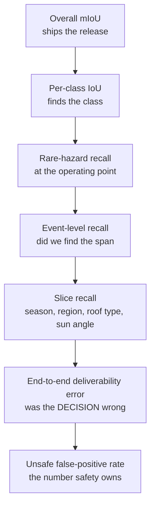

# Evaluation for safety-critical perception, and scaling to millions

> **Why this matters at staff level.** The posting calls out evaluation and validation
> infrastructure explicitly, which makes it a topic in its own right, and not the last
> two minutes of a modelling answer. Two questions in this loop are almost guaranteed: why a
> high-accuracy model still misses the thing that matters, and what changes architecturally
> when the system goes from thousands of properties to millions. Both have concrete,
> quantitative answers, and giving the numbers is most of the signal.

## TL;DR: the interview card

- **Aggregate metrics hide the hazard.** A wire at 0.05% of pixels can be missed entirely
  while pixel accuracy reads 99.95%. Report per-class, and report at the **object or event**
  level, not the pixel level.
- The metric hierarchy to recite: overall mIoU, per-class IoU, rare-hazard recall,
  distance- and resolution-conditioned recall, environment slices, end-to-end deliverability
  error, unsafe false-positive rate.
- **Evaluate at the decision, not at the model.** The number that matters is how often the
  *decision* is wrong, which is a different quantity from segmentation quality.
- **Split by property, not by tile.** Tiles from one property leak between train and test and
  inflate everything.
- **Rule of three**: zero failures in $n$ trials gives a 95% upper bound of $3/n$ on the rate.
  To claim $10^{-4}$ you need about 30,000 clean trials. Plan the evaluation strategy around
  that arithmetic.
- **Calibration is a requirement**, because the decision threshold is an economic ratio and a
  ratio applied to an uncalibrated score is meaningless. Measure with reliability diagrams and
  ECE, per slice.
- **Offline wins that do not transfer** usually mean one of: distribution mismatch between the
  eval set and production, a metric that averages away the failure, leakage, a preprocessing
  difference, or a downstream layer that trusts the new model's confidence differently.
- **Scaling 10<sup>4</sup> to 10<sup>7</sup> is a cost-per-property problem.** Classical SfM at
  roughly 30 core-minutes per property is about 570 core-years for 10 million; a feed-forward
  pass at 0.5 GPU-seconds is about 1,400 GPU-hours. Four orders of magnitude, which is the
  whole architectural argument.
- At scale the unit of work stops being a property and becomes a **tile**, processing becomes
  **incremental** and change-driven, and labelling becomes **sampling plus mining**.

## 1. Intuition first

Take a 2000 by 2000 pixel aerial tile of a suburban property. A single span of overhead
cable crosses it: 2000 pixels long and, at 4 cm ground sample distance, under one pixel wide.
Call it 2,000 wire pixels out of 4,000,000, so 0.05%.

Now suppose your segmentation model misses it completely.

**Pixel accuracy** is $1 - 0.0005 = 99.95\%$. Unchanged to three decimal places.

**Mean IoU** over ten classes: the wire class goes from, say, 0.45 to 0.00, so mIoU falls by
$0.45/10 = 0.045$. Real, but easily masked by a 0.05 improvement on the "vegetation" class in
the same release. A model that got better at grass and stopped seeing wires ships as an
improvement.

**Event-level recall on wire spans**: 0 out of 1. That is the metric that noticed.

The lesson generalises past wires. Any metric that averages over pixels weights a hazard by
its area, and hazards are dangerous in inverse proportion to their area. A person is more
important than a lawn and occupies a thousand times fewer pixels.



Read it top to bottom as increasing relevance and decreasing sample size. The top is easy to
measure and nearly useless; the bottom is what you actually care about and is statistically
starved. Every design decision in evaluation infrastructure is about moving information up
that stack: proxies, slices, mined examples and simulated events, so the rare quantity at the
bottom can be estimated from the plentiful quantities above it.

## 2. The math

### IoU, and what it cannot see

$$\text{IoU} = \frac{|P \cap G|}{|P \cup G|}.$$

For a thin structure, IoU measures localisation more than it measures detection. A one-pixel-wide
wire predicted one pixel to the left has IoU 0, despite the model having found it perfectly.
That is the wrong sensitivity for a safety question, where knowing a wire is *somewhere in
this corridor* is almost the entire value.

So for thin structures, use a tolerance-based match: a predicted curve matches a ground-truth
span if it lies within $d$ pixels along some fraction of its length. That gives precision and
recall at the span level, which is the unit the decision layer consumes.

### Event-level metrics

Define a hazard *event* (a wire span, a tree overhanging the corridor, a pool) and match
predictions to ground-truth events with an explicit matching rule. Then

$$\text{recall}_{\text{event}} = \frac{\text{matched events}}{\text{ground-truth events}},
\qquad
\text{precision}_{\text{event}} = \frac{\text{matched events}}{\text{predicted events}}.$$

Report recall at the operating point the decision layer actually uses, since a
precision-recall curve reports a family of systems and only one of them ships.

### The rule of three

You run $n$ deliveries and see zero incidents. What can you claim?

If the per-trial failure probability is $p$, the chance of zero failures in $n$ trials is
$(1-p)^n \approx e^{-pn}$. Setting that equal to 0.05 gives

$$\boxed{\;p_{95\%} \approx \frac{3}{n}.\;}$$

Thirty thousand clean deliveries support a 95% upper bound of $10^{-4}$. Three hundred
support $10^{-2}$. This single formula reframes the entire evaluation conversation, because it
says that direct validation of a safety-critical rate is a fleet-scale, months-long
measurement and cannot be a release gate. Releases gate on proxies; the direct rate is a
long-run audit.

### Calibration

The decision rule from [chapter 5](05-deliverability-system-design.md) is
$q < C_{\text{decline}}/C_{\text{incident}}$, which requires $q$ to be a probability. Measure
with expected calibration error over $M$ bins:

$$\text{ECE} = \sum_{m=1}^{M}\frac{|B_m|}{N}\,\big|\,\text{acc}(B_m) - \text{conf}(B_m)\,\big|.$$

Two warnings for this setting. ECE in aggregate can be excellent while calibration in the
low-probability regime, which is the only regime the threshold uses, is terrible; use bins
that are fine where the threshold sits. And calibration is per slice: a model calibrated on
average can be badly overconfident on the winter-imagery slice. See
[Part XIII](../part13-retrieval-eval-reliability/index.md) for temperature scaling, isotonic
regression and conformal alternatives.

### Slice design

Slices are hypotheses about failure. Write them before looking at results, so they are a test
rather than a search.

| Axis | Slices worth cutting | Why |
|---|---|---|
| Hazard type | Wire, thin branch, pole, water, person, vehicle, trampoline, glass roof | Each fails for a different reason |
| Imagery | Sun angle, season, cloud, shadow fraction, snow | The dominant distribution shift in aerial |
| Geometry | Ground sample distance, altitude, view obliquity, overlap | Resolution-limited failures live here |
| Property | Dense urban, suburban, rural, wooded, sloped | Composition changes the base rate |
| Prior age | Under a month, one to six months, over six months | Isolates staleness from model quality |
| Reconstruction | Confidence decile, triangulation angle, texture density | Separates perception failure from geometry failure |
| Decision | Margin to threshold | Near-threshold sites are where errors convert into wrong decisions |

That last row is the one people miss. A model error only matters where it changes a decision,
so slicing by margin-to-threshold measures the errors that count.

## 3. Implementation

The book's evaluation modules cover the standard metrics; what this chapter adds is the
framing. Per-class metrics from `src/mlbook/evaluation/classification_metrics.py` and the
detection metrics in `src/mlbook/evaluation/detection_map.py` are the building blocks, and the
decision-level layer sits on top of `src/mlbook/perception/landing_zone.py`.

The piece worth writing out is the decision-level evaluation, because it is the one that is
specific to this product:

```python
def decision_error_rates(sites_pred, sites_true, threshold):
    """Compare DECISIONS, not masks.

    sites_pred / sites_true: per-property lists of accepted sites with risk estimates.
    Returns the two rates that matter, which are not symmetric in cost.
    """
    unsafe_accepted = 0      # accepted a site that ground truth says is unsafe
    safe_declined = 0        # declined a property where a safe site existed
    for pred, truth in zip(sites_pred, sites_true):
        accepted = [s for s in pred if s.risk < threshold]
        if accepted and not any(overlaps(a, t) for a in accepted for t in truth):
            unsafe_accepted += 1
        if not accepted and truth:
            safe_declined += 1
    n = len(sites_true)
    return unsafe_accepted / n, safe_declined / n    # the safety rate, the coverage rate
```

Two rates, reported separately, never combined into one score. They have different costs by
four orders of magnitude, so any weighted average of them is a way of hiding the number that
matters.

And the risk-adjusted threshold from the landing-zone module, which is where calibration
becomes operational:

```python
def risk_adjusted_mask(hazard_prob, hazard_std, budget, n_sigma=2.0):
    """Threshold the upper confidence bound, so uncertainty costs coverage and not safety."""
    return (hazard_prob + n_sigma * hazard_std) <= budget       # (H, W) bool
```

### How you would test it

```python
def test_risk_adjusted_mask_spends_uncertainty_on_coverage_not_safety():
    prob = np.array([[0.02, 0.02, 0.20]])
    std = np.array([[0.005, 0.10, 0.005]])
    keep = risk_adjusted_mask(prob, std, budget=0.05, n_sigma=2.0)
    # confident-and-clean passes; equally clean but uncertain does not
    assert keep.tolist() == [[True, False, False]]
```

The middle column is the whole test. Two pixels with identical predicted hazard, different
uncertainty, different decisions. If that column ever flips to `True`, someone has removed the
uncertainty term and every test that checks aggregate accuracy will still pass.

## Retype by hand

| Symbol | File | Target time | Why |
|---|---|---|---|
| `confusion_matrix`, `precision_recall_f1` | `src/mlbook/evaluation/classification_metrics.py` | 10 minutes | Asked directly in coding rounds. |
| `expected_calibration_error` | `src/mlbook/reliability/calibration.py` | 8 minutes | The binning is the part people fumble. |
| `average_precision` | `src/mlbook/evaluation/detection_map.py` | 15 minutes | Sorting by score, accumulating TP and FP, interpolating. |
| `risk_adjusted_mask` | `src/mlbook/perception/landing_zone.py` | 2 minutes | Trivial to write, and the reasoning is the answer. |
| `decision_error_rates` | (from this chapter) | 10 minutes | Practise writing an evaluation nobody handed you. |

## 4. Systems view: from 10,000 properties to 10 million

### First, the arithmetic

Assume 200 images per property at 12 megapixels, and put numbers on it before proposing an
architecture. Made-up but plausible unit costs, stated as assumptions:

| Quantity | 10<sup>4</sup> properties | 10<sup>7</sup> properties |
|---|---|---|
| Images | 2 million | 2 billion |
| Raw imagery at 4 MB each | 8 TB | 8 PB |
| Classical SfM at 30 core-minutes each | 5,000 core-hours | 5 million core-hours (570 core-years) |
| Feed-forward pass at 0.5 GPU-seconds each | 1.4 GPU-hours | 1,400 GPU-hours (58 GPU-days) |
| Segmentation at 200 images, 20 ms each | 11 GPU-hours | 11,000 GPU-hours |

At 10<sup>4</sup>, every option is affordable and you should pick the most accurate. At
10<sup>7</sup>, the classical path costs four orders of magnitude more than the learned one,
and 8 PB of raw imagery costs more to store than to process once. Those two facts drive
everything that follows.

### What changes architecturally

**The unit of work changes from a property to a tile.** Neighbouring properties share imagery,
so processing per property duplicates work at the boundaries. Partition the world with a
geospatial index (S2, H3 or quadkeys), process tiles, and compose property answers from tile
results. This also makes the work idempotent and independently retryable, which matters when
one in 10,000 jobs fails and you are running 10 million of them.

**Processing becomes incremental and change-driven.** Reprocessing everything on every model
update is untenable, so the pipeline needs change detection: only tiles with new imagery, or
tiles whose priors have expired, or tiles flagged by fleet disagreement. A full reprocess
becomes a rare, deliberate, budgeted operation.

**Routing replaces a single path.** The learned reconstruction runs on everything; the
classical pipeline runs on a routed subset selected by a trust model plus a random audit
sample, as described in [chapter 4](04-learned-3d-and-splats.md). A 5% route plus 1% audit
brings the effective cost to roughly four units per property against 50 for running the
expensive path everywhere.

**Storage tiers, and raw imagery is the cold tier.** 8 PB of source images live in cheap
object storage with lifecycle rules; the derived rasters, which are far smaller, live hot.
Design so that the derived products are sufficient for most reprocessing, and pulling raw
imagery is the exception. Deterministic replay needs the raw inputs, so budget for the
retrieval cost rather than the storage cost.

**Labelling becomes sampling plus mining.** You cannot hand-label 10 million properties.
Label a stratified random sample for unbiased metrics, and mine hard examples by disagreement
(between models, between passes, between offboard and onboard) for training. Keep the two sets
strictly separate: the mined set is biased by construction and is training data, while the
random sample is the only thing that gives an honest error rate.

**Monitoring becomes regional and continuous.** Aggregate metrics over 10 million properties
are insensitive to a failure affecting one region or one imagery vendor. Monitor per region,
per vendor, per model version, per season, and alert on *changes* in the rate of
offboard-onboard disagreement rather than on absolute levels, because the absolute level is
dominated by the geographic mix.

**Serving the priors becomes a real system.** Ten million properties with per-property
versioned assets is a distributed data problem: a geospatial-indexed store, delivery to
vehicles or ground stations with bandwidth constraints, staged rollout of new prior versions,
and a rollback path. Say this out loud, because a candidate who designs the pipeline and
forgets the distribution of its output has designed half the system.

### The cost model as a design tool

At scale the useful framing is a cost per property, decomposed: compute for reconstruction,
compute for semantics, storage amortised over the validity horizon, labelling amortised over
the model's lifetime, and the expected cost of errors. Making that decomposition explicit lets
you argue about architecture quantitatively. Halving the validity horizon doubles the
amortised reconstruction cost, which is an argument for better staleness modelling that a
latency-focused answer never reaches.

## 5. In production

!!! production "Waymo, evaluation as the deliverable"
    Waymo publishes safety analyses with explicitly stated methodologies, human benchmarks
    matched on geography and reporting thresholds, and peer-reviewed comparisons over tens of
    millions of miles. The structural lesson for an offboard delivery system is that the rare
    event rate is established over a fleet and a long period, while releases gate on
    intermediate evidence, so the evaluation stack has two tiers with different statistical
    standards. See [the Waymo deep dive](../part18-company-deep-dives/waymo.md) for sources.

!!! production "Tesla and the auto-labelling pattern"
    The pattern to name, common across large autonomy programmes, is that offboard compute
    produces labels for onboard models: run an expensive, non-causal, multi-pass pipeline over
    recorded data and use its output as supervision. For an aerial delivery system, the
    offboard stack is already that pipeline, which means it has a second product beyond the
    prior: training data for whatever runs on the droid. Mentioning that dual role is a good
    way to show you see the org-level picture.
    See [the Tesla deep dive](../part18-company-deep-dives/tesla.md) and
    [Part X on auto-labelling](../part10-self-supervised/index.md).

## 6. Interview questions and strong answers

!!! interview "Your segmentation model has 97% accuracy but occasionally misses wires and tree branches. What do you do?"
    The first thing I would do is stop reporting that number, because it is not measuring the
    thing that can hurt someone. At survey resolution a wire is a fraction of a percent of
    pixels, so a model that never predicts the class scores about 99.9% pixel accuracy. The
    metric and the risk are close to uncorrelated.

    Re-instrument first. Per-class IoU and recall, then event-level recall (what fraction of
    wire *spans* did we find, with a distance-tolerant matching rule, since a wire predicted
    one pixel off has IoU zero and is operationally a success). Then slices: sun angle,
    season, background type, ground sample distance. Then the decision-level metric: how often
    did missing this change the site we chose.

    Then diagnose before fixing. Three candidate causes with different responses. Resolution,
    which is a sensing and flight-planning problem and no model fixes it. Class imbalance,
    where focal loss, hazard oversampling and a higher loss weight help. Representation, where
    the right answer is a thin-structure-aware approach that integrates evidence along a curve
    and across views rather than a per-pixel head on a single frame.

    Then mitigate at the system level, because detection recall will never be high enough on
    its own for a $10^{-4}$ decision. Larger buffers around any detected vertical structure,
    structural priors from detected poles and from utility data, treating unresolved corridor
    regions as unknown rather than clear, and relying on the onboard camera for the final
    descent.

    **Staff-level follow-up.** I would redirect the labelling budget. Uniformly sampled tiles
    are 97% solved content; the value is in mined disagreement cases. I would set up a mining
    loop and measure the fraction of new labels that come from it, because that ratio is a
    leading indicator of whether the data engine is working.

!!! interview "Your new learned 3-D reconstruction beats SfM offline but causes more failures in production. How do you debug it?"
    I would treat this as a mismatch between what I measured and what production does, and work
    through the candidates in order of how often they are the answer.

    **Distribution.** The offline set is probably not a random sample of production. If it was
    assembled from properties where the classical pipeline succeeded, it systematically
    excludes exactly the cases the learned model was adopted for. I would check the offline
    set's composition against production on the slice axes and rebuild it by stratified random
    sampling if it does not match.

    **The metric.** Reconstruction error averaged over pixels rewards getting the lawn right
    and is nearly blind to a missing wire or a smoothed branch. I would recompute using
    decision-level and thin-structure metrics and see whether the "win" survives. Very often it
    does not, and then the debugging is finished.

    **Leakage.** Tiles from one property in both train and test, or properties from the same
    neighbourhood and the same capture flight. Split by property and ideally by geography.

    **Integration.** The production path may differ from the evaluation path: different
    resizing or normalisation, different colour handling, a different assumed calibration, or
    images arriving in a different order. I would run the exact production inputs through the
    offline harness and diff the outputs, which is the step that deterministic replay exists
    to make possible.

    **Downstream coupling.** This is the one people miss. The decision layer consumes
    confidence, and the new model's confidence is on a different scale even if it is better
    ranked. If the layer was tuned against the old model's calibration, a better model with
    different calibration produces worse decisions. I would check calibration per slice before
    concluding anything about the geometry.

    **Failure character.** Classical SfM fails loudly, producing a hole, and the decision layer
    treats a hole as unknown and declines. The learned model fails quietly, producing a
    confident, smooth, wrong surface, and the decision layer accepts it. Same error rate, worse
    outcomes, because one failure mode is self-announcing and the other is not. If that is the
    cause, the fix is not a better model; it is an independent consistency check that converts
    quiet failures into loud ones.

    Once I know which, the process is the same: reproduce in shadow mode on production traffic,
    confirm the hypothesis on held-out data, fix, and add the failure to the evaluation set so
    it cannot recur silently.

!!! interview "You need to scale perception from 10,000 properties to 10 million. What changes architecturally?"
    I would start with the arithmetic, because the architecture follows from it. At 200 images
    per property, 10 million properties is 2 billion images and around 8 petabytes of raw
    imagery. Classical reconstruction at roughly 30 core-minutes per property is about 570
    core-years; a feed-forward pass at half a GPU-second is about 1,400 GPU-hours. That gap is
    four orders of magnitude and it decides the design.

    Five changes.

    The unit of work becomes a tile instead of a property, with a geospatial index, because
    neighbouring properties share imagery and per-property processing duplicates work. Tiles
    are idempotent and independently retryable, which matters when you run 10 million jobs and
    a small fraction fail.

    Processing becomes incremental. Only new imagery, expired priors and tiles flagged by fleet
    disagreement get reprocessed. A full reprocess becomes a budgeted, rare operation instead
    of the default.

    The expensive path becomes routed. Learned reconstruction on everything, classical
    verification on a subset chosen by a calibrated trust model plus a random audit sample, so
    the audit stays unbiased.

    Labelling becomes sampling plus mining: a stratified random sample for honest metrics, and
    mined disagreement for training, kept strictly separate.

    Monitoring becomes regional and change-based, because an aggregate over 10 million
    properties cannot see a regional regression.

    **Staff-level follow-up.** I would also design the output side, which people skip.
    Ten million versioned per-property priors need a geospatial store, staged rollout,
    bandwidth-aware delivery, and a rollback path. And I would make cost per property an
    explicit, decomposed, tracked metric, because at this scale it is the constraint that
    turns architecture debates into arithmetic.

!!! interview "How would you validate that the system meets a 10^-4 unsafe-delivery rate?"
    Directly, I would not, and saying so is the correct answer. By the rule of three, zero
    incidents in $n$ trials gives a 95% upper bound of $3/n$, so establishing $10^{-4}$ needs
    about 30,000 incident-free deliveries. That is a fleet-scale, months-long measurement, so
    it is an audit rather than a release gate.

    What I would do instead is build a chain of evidence. Decompose the failure into causes
    (missed hazard, wrong geometry, stale prior, calibration error) and bound each one with a
    metric that has enough samples to measure. Evaluate on adversarially constructed slices
    where the base rate is far higher than in the wild, which buys statistical power at the
    cost of representativeness, and be explicit about that trade. Use near-miss and proxy
    events, which are far more frequent than incidents: onboard-offboard disagreement, aborted
    descents, operator overrides. Then stage exposure with pre-declared ramp criteria and
    stopping rules, so the fleet measurement accumulates while exposure is limited.

    And I would track the aggregate rate continuously as an audit, with the understanding that
    it confirms the argument rather than producing it.

## 7. Exercises

**★ 1.** A hazard class covers 0.05% of pixels. Compute pixel accuracy and the change in mIoU
over 12 classes if the model misses it entirely, given it previously had IoU 0.52.

??? success "Solution"
    Pixel accuracy loses at most 0.05%, so it reads 99.95% instead of 100% on that axis, which
    is invisible at any reasonable reporting precision. mIoU falls by $0.52/12 = 0.043$. A
    release that simultaneously improved two other classes by 0.03 each would show mIoU
    roughly flat while having lost the hazard class entirely, which is exactly how this failure
    ships.

**★ 2.** You observe 12,000 deliveries with no incidents. What can you claim at 95%
confidence? How many more do you need for $10^{-4}$?

??? success "Solution"
    $p_{95\%} \approx 3/12{,}000 = 2.5\times10^{-4}$. For $10^{-4}$ you need
    $n \ge 3/10^{-4} = 30{,}000$, so 18,000 more incident-free deliveries, assuming the system
    and the environment are unchanged throughout, which over that many deliveries is itself an
    assumption worth stating.

**★★ 3.** Design the slice set for a wire-detection model and say what each slice would tell
you if it were the one that failed.

??? success "Solution"
    Ground sample distance decile: failure concentrated in the coarse deciles means a
    resolution limit, which is a flight-planning fix. Sun angle and shadow fraction: failure
    in low-sun conditions means the wire's contrast against the background is the limit, which
    argues for capture scheduling or an illumination-robust representation. Background class:
    failure over vegetation means the detector is confusing the wire with linear texture in
    the canopy, which argues for multi-view consistency. Wire orientation relative to flight
    direction: failure along the flight direction suggests motion blur or a sampling artefact.
    Season: failure in leaf-on conditions means occlusion, which is a coverage problem rather
    than a detection problem and should be reported as unknown. Prior age: failure on old
    priors means the wire is new, which is a staleness problem no detector fixes.

**★★★ 4.** Your offline evaluation set was built by sampling properties where the classical
pipeline produced a complete reconstruction. Explain precisely what this biases, and design a
replacement.

??? success "Solution"
    The selection criterion is correlated with exactly the properties the learned model was
    adopted to handle. Classical reconstruction completes on well-textured, well-overlapped,
    geometrically benign properties, so the eval set over-represents easy cases, and any
    comparison between the two methods is conditioned on the classical method succeeding. The
    learned model's advantage, which is coverage where the classical method fails, is
    definitionally invisible, and its disadvantage, hallucination in hard regions, is also
    invisible. The set can only measure the axis where the two are most similar.

    A replacement: define the population as all properties eligible for delivery, stratify by
    the slice axes that matter (region, season, property composition, imagery ground sample
    distance, reconstruction difficulty proxied by texture density and overlap), and sample
    randomly within strata with known weights so estimates can be reweighted to the
    population. Label the sample properly, including the hard cases where no automated method
    agrees, which is where the annotation cost concentrates and where the answer matters.

    Keep this set frozen and separate from the mined hard-example set used for training.
    Refresh it on a schedule with a documented procedure, and never let a model's failures
    decide what goes into it, because that is how an evaluation set slowly becomes a training
    set.

## References

* Hanley and Lippman-Hand, "If nothing goes wrong, is everything all right?", JAMA 249(13),
  1983. The origin of the rule of three.
* Guo, Pleiss, Sun and Weinberger, "On Calibration of Modern Neural Networks", ICML 2017.
* Rahimi and colleagues and the broader slice-based evaluation literature; in this book, see
  [Part XIII on evaluation and reliability](../part13-retrieval-eval-reliability/index.md).
* [Part XVII, ML platform, feature store and monitoring](../part17-ml-system-design/12-ml-platform-feature-store-monitoring.md),
  for the infrastructure patterns behind the scaling section.
* [Part X, auto-labelling in production](../part10-self-supervised/index.md), for the offboard
  pipeline's second product.
