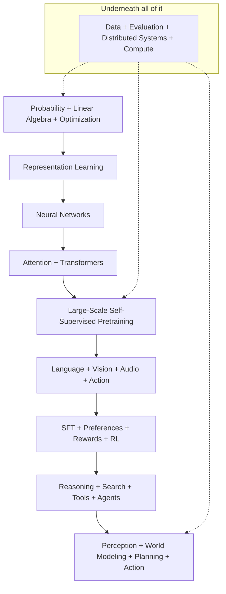

# How to use this book

This book has one reader: you, a senior or staff ML engineer who wants to walk into
an interview at an autonomy company, a consumer-ranking company, a fintech, or a
frontier lab and be able to move freely between an equation, the code that
implements it, the architecture it lives in, the distributed system that trains it,
the evaluation that decides whether it shipped, and the production case study that
shows who bet on it. That is a lot of ground. This preface tells you how the book is
built so you can spend your hours where they pay off.

## 1. The three standards

Every technical chapter is held to the same three bars. When a topic fails one of
them, the chapter says so rather than hiding it.

| Standard | The bar you should be able to meet after the chapter | What it looks like in an interview |
|---|---|---|
| **Math** | Derive the important equations at a whiteboard without gaps, state the assumptions, and say what the result *means*. | "Show me why the gradient of softmax cross-entropy is $p - y$." "Why $1/\sqrt{d_k}$?" |
| **Code** | Implement the core algorithm without a library call, with every tensor shape written down, and know how you would test it. | "Write multi-head attention with a causal mask. Now add a KV cache." |
| **Systems** | Explain when it works, when it fails, what it costs in FLOPs, memory and latency, and how a real company trained, deployed and evaluated it. | "Your detector misses small objects. Why, and what do you change first?" |

The standards are deliberately uneven across topics; §4 below tells you exactly how
deep to go on each.

## 2. The skeleton you will see in every chapter

Every technical chapter follows the same eight-part structure, in the same order,
so you always know where to look. Read it once here and you can navigate any chapter
by section number.

| Section | What it is for | How to use it |
|---|---|---|
| **Why this matters at staff level** | 2–4 sentences on where this shows up in interviews and what strong signal looks like. | Decide in ten seconds whether the chapter is on your critical path. |
| **TL;DR — the interview card** | 5–10 bullets: the equations, the shapes, the one-line trade-offs, the production users. | Re-read the morning of the interview. Nothing else. |
| **1. Intuition first** | A tiny concrete example (a $2\times 3$ matrix, a 4-token sequence) and a figure, before any general formula. | If you cannot explain the topic with this example, you do not own it yet. |
| **2. The math** | Derivations without gaps. Results you must reproduce at a whiteboard are boxed. | Cover the page and re-derive each boxed result. This is the study plan's "derivation" list. |
| **3. Implementation** | Code from `src/mlbook/...` shown inline with a shape comment on every tensor line, then explained paragraph by paragraph, then "how you'd test it". | Close the book and write it from memory. Run the test in `tests/`. |
| **4. Systems view** | FLOPs, memory, latency, data requirements, failure modes, and a *when to use what* table with a decision rule. | This is where ML depth rounds and ML system design rounds are won. |
| **5. In production** | 2–5 real case studies with primary sources: company, what they built, why they chose it, what they rejected. | Borrow these as evidence in system design and behavioral rounds; cite them by name. |
| **6. Interview questions and strong answers** | 5–10 questions with model answers that show reasoning and trade-offs, each with a staff-level follow-up. | Answer aloud before reading the model answer. Time yourself. |
| **7. Exercises** | ★ / ★★ / ★★★ exercises with collapsible solutions; at least one is runnable. | Do the ★★ ones. Do the ★★★ ones for Level A topics (§4). |

Chapters also end with a **References** list of papers (with arXiv IDs), blog posts
and talks. Every external link in this book was verified before it was included;
where a source could not be verified you will see a title and venue instead of a URL.

Two admonitions carry the interview-specific content and are worth recognising on
sight:

!!! interview "Interview question"
    Purple boxes hold a question, a model answer, and a staff-level follow-up.

!!! production "Company — what they built"
    Green boxes hold a production case study with a link to the primary source.

## 3. Reading modes

You will not read this book linearly, and you should not. Pick the mode that matches
your calendar.

* **Cover to cover (6–9 months).** Follow the [study plan](study-plan.md). It sequences
  the chapters so every derivation and implementation unlocks the next one and ends
  with a small multimodal reasoning model and its full post-training pipeline.
* **The night before.** Read only the *TL;DR — the interview card* of the chapters in
  the loop you are facing. The [week-before checklist](study-plan.md#the-week-before-checklist)
  tells you which ones.
* **Coding rounds.** [Part XVI, the coding canon](../part16-coding-canon/index.md):
  the 60 implementations, the [NumPy ↔ PyTorch cheat sheet](../part16-coding-canon/01-numpy-torch-cheatsheet.md),
  the [shape drills](../part16-coding-canon/02-shape-drills.md), and the
  [timed drills](../part16-coding-canon/03-timed-drills.md). Then the tests in `tests/`.
* **ML depth rounds.** Section 2 (the math) and section 4 (the systems view) of the
  chapters on your critical path, plus section 6 for the follow-ups.
* **System design rounds.** [Part XVII](../part17-ml-system-design/index.md), starting
  with [the framework](../part17-ml-system-design/00-framework.md), then the
  [company deep dive](../part18-company-deep-dives/index.md) for the company you
  are interviewing with.
* **Behavioral rounds.** [What staff-level signal looks like](interview-signal.md),
  especially the section on talking about production experience as evidence.

## 4. Asymmetric depth: the four target levels

You do not have the time, and the interviewer does not have the interest, for you to
derive everything from memory. Depth is asymmetric on purpose. Every topic in the
book is assigned one of four levels, and the level tells you what "done" means.

| Level | What "done" means | Time signature |
|---|---|---|
| **A — derive and implement from memory** | You can reproduce the derivation at a whiteboard with no notes and write a correct, tested implementation from a blank file in under an hour. You can teach it. | Re-derive and re-implement until it is boring. These are the topics interviewers *expect* you to own. |
| **B — derive and implement with minor reference** | You can carry the derivation with an occasional glance at a formula, and implement it with the paper or the book open for the details you would look up on the job anyway. | Do it once fully, then keep the interview card. |
| **C — understand mathematically, modify existing implementations** | You can read the derivation and explain why each step holds, follow a reference implementation, and change it (add a loss term, swap a head, change the sampler) without breaking it. | Read the chapter, run the code, do one ★★ exercise. |
| **D — architectural literacy** | You can name the idea, say what problem it solves, where it sits relative to the Level A/B method that replaced or absorbed it, and when someone might still reach for it. | Read the interview card and section 1. Do not implement. |

The assignments below are the contract for the whole book. If a chapter asks more of
you than its level, do less; if it asks less, do more.

**Level A (derive + implement from memory).** Linear and logistic regression, PCA,
neural networks and backpropagation, CNNs, optimization (SGD, momentum, Adam),
attention, the Transformer, GPT, ViT, CLIP, LoRA, tokenization, RL fundamentals
(MDPs, Bellman, value iteration, Q-learning), policy gradient, PPO, reward modeling, DPO.

**Level B (derive and implement with minor reference).** Object detection, DETR, VLM
architecture, diffusion, mixture of experts, GQA and the KV cache, GRPO, BEV
perception, tracking, retrieval, distributed training.

**Level C (understand mathematically, modify existing implementations).** World
models, advanced diffusion and flow matching, advanced RL, multi-sensor autonomy,
giant-scale distributed training, inference kernels.

**Level D (architectural literacy).** GAN variants, kernel methods, exotic sequence
models, obscure preference-optimization algorithms, specialized generative
architectures.

### Every part of the book, mapped to a level

| Part | Level | Notes |
|---|---|---|
| [I. Math](../part01-math/index.md) | **A** | Everything in Level A rests on this substrate; the derivations here are the ones you will be asked to reproduce. |
| [II. Classical ML](../part02-classical/index.md) | **A / B / D** | A: [linear regression](../part02-classical/01-linear-regression.md), [logistic and softmax regression](../part02-classical/02-logistic-softmax-regression.md), [PCA](../part02-classical/06-dimensionality-reduction.md). B: [trees and ensembles](../part02-classical/03-trees-and-ensembles.md), [KNN and K-means](../part02-classical/04-knn-kmeans.md), [EM](../part02-classical/05-probabilistic-models-em.md). D: [kernel methods and SVMs](../part02-classical/07-kernel-methods-svm.md). |
| [III. Neural nets](../part03-neural-nets/index.md) | **A** | MLPs, backprop, the autograd engine, initialization, normalization, regularization. All from memory. |
| [IV. Vision](../part04-vision/index.md) | **A / B / C** | A: [convolutions](../part04-vision/02-convolutions.md) and [CNN architectures](../part04-vision/03-cnn-architectures.md). B: [detection](../part04-vision/04-detection.md), [segmentation](../part04-vision/05-segmentation.md). C: [geometry](../part04-vision/06-geometry.md), [3D perception](../part04-vision/07-3d-perception.md). |
| [V. Sequences & Transformers](../part05-sequence-transformers/index.md) | **A / B / D** | A: [attention mathematics](../part05-sequence-transformers/03-attention-mathematics.md), [Transformer architectures](../part05-sequence-transformers/04-transformer-architectures.md), [positional encodings](../part05-sequence-transformers/05-positional-encodings.md), [tokenization](../part05-sequence-transformers/06-tokenization.md). B: [RNN/LSTM/GRU](../part05-sequence-transformers/01-rnn-lstm-gru.md), [seq2seq](../part05-sequence-transformers/02-seq2seq-attention.md). D: exotic sequence models. |
| [VI. LLM training](../part06-llm-training/index.md) | **A / B / C / D** | A: [fine-tuning and LoRA](../part06-llm-training/06-fine-tuning-lora.md), the pretraining objective. B: [scaling laws](../part06-llm-training/02-scaling-laws.md), [MoE and GQA](../part06-llm-training/03-large-model-architecture.md), [efficient attention and the KV cache](../part06-llm-training/04-efficient-attention-kv-cache.md), [quantization](../part06-llm-training/05-quantization.md), [mid-training](../part06-llm-training/07-mid-training.md). C: inference kernels. D: state-space models. |
| [VII. Post-training](../part07-post-training/index.md) | **A / B / D** | A: [SFT](../part07-post-training/01-sft.md), [reward models](../part07-post-training/02-reward-models.md), [RLHF with PPO](../part07-post-training/03-rlhf-ppo.md), [DPO](../part07-post-training/04-dpo-and-friends.md). B: [GRPO and RLVR](../part07-post-training/05-reasoning-rl-grpo.md), [test-time compute](../part07-post-training/06-test-time-compute.md). D: the long tail of DPO relatives. |
| [VIII. Multimodal](../part08-multimodal/index.md) | **A / B / C** | A: [ViT](../part08-multimodal/01-vision-transformers.md), [CLIP](../part08-multimodal/03-clip-contrastive.md). B: [DETR](../part08-multimodal/02-detr.md), [VLM architecture](../part08-multimodal/04-vlm-architecture.md), [multimodal foundation models](../part08-multimodal/05-multimodal-foundation.md). C: [video models](../part08-multimodal/06-video-models.md). |
| [IX. Generative](../part09-generative/index.md) | **B / C / D** | B: [VAEs](../part09-generative/01-autoencoders-vae.md), [diffusion](../part09-generative/03-diffusion.md). C: [flow matching](../part09-generative/04-flow-matching.md) and advanced samplers. D: [GAN variants](../part09-generative/02-gans.md). |
| [X. Self-/semi-/weak supervision](../part10-self-supervised/index.md) | **B / C** | B: contrastive and masked objectives (they share math with CLIP). C: [auto-labeling pipelines](../part10-self-supervised/03-weak-supervision-and-auto-labeling.md) as systems. |
| [XI. Perception & autonomy](../part11-perception-autonomy/index.md) | **B / C** | B: [multi-camera and BEV](../part11-perception-autonomy/02-multi-camera-bev.md), [tracking](../part11-perception-autonomy/04-tracking.md). C: [sensor fusion](../part11-perception-autonomy/03-sensor-fusion.md), [occupancy](../part11-perception-autonomy/05-occupancy-temporal.md), [prediction and planning](../part11-perception-autonomy/06-prediction-planning.md), [world models](../part11-perception-autonomy/07-world-models.md). |
| [XII. Reinforcement learning](../part12-rl/index.md) | **A / B / C** | A: [MDPs and Bellman](../part12-rl/01-mdp-bellman.md), [classical RL](../part12-rl/02-classical-rl.md), [policy gradients, GAE and PPO](../part12-rl/04-policy-gradients-ppo.md). B: [DQN](../part12-rl/03-deep-rl-dqn.md), [imitation learning](../part12-rl/05-imitation-learning.md), [agents and tool use](../part12-rl/06-agents-tool-use.md). C: advanced RL (off-policy actor-critic, model-based RL). |
| [XIII. Retrieval, eval & reliability](../part13-retrieval-eval-reliability/index.md) | **A / B** | A: [evaluation](../part13-retrieval-eval-reliability/02-evaluation.md) (no interview forgives weak evaluation). B: [retrieval and RAG](../part13-retrieval-eval-reliability/01-retrieval-and-rag.md), [uncertainty](../part13-retrieval-eval-reliability/03-uncertainty-reliability.md). |
| [XIV. Systems](../part14-systems/index.md) | **B / C** | B: [distributed training](../part14-systems/01-distributed-training.md) (DDP, ZeRO, pipeline bubbles), [hardware and roofline](../part14-systems/04-hardware-memory-roofline.md). C: giant-scale [training systems](../part14-systems/02-training-systems.md) and [inference kernels](../part14-systems/03-inference-systems.md). |
| [XV. Interpretability & safety](../part15-interpretability-safety/index.md) | **C / D** | C: [failure modes](../part15-interpretability-safety/02-safety-failure-modes.md) as they affect evaluation. D: [interpretability](../part15-interpretability-safety/01-interpretability.md) methods. |
| [XVI. Coding canon](../part16-coding-canon/index.md) | **A** | By definition: 60 implementations from memory. |
| [XVII. ML system design](../part17-ml-system-design/index.md) | **A for the framework, B for each design** | You must own [the framework](../part17-ml-system-design/00-framework.md) cold; each design you should be able to reconstruct with its chapter's interview card. |
| [XVIII. Company deep dives](../part18-company-deep-dives/index.md) | **B** | Know the business problem, the published architecture, and the trade-off they chose, for the companies on your list. |

## 5. The conceptual stack

The book is organised as parts, but the *ideas* are organised as a stack. Each layer
consumes the one below it, and everything sits on data, evaluation, distributed
systems and compute. When an interviewer moves you up or down this stack mid-answer
("fine, now how would you train that at scale?"), this is the map you are moving on.



Read the diagram bottom-up. Probability, linear algebra and optimization
([Part I](../part01-math/index.md)) give you representation learning
([Part II](../part02-classical/index.md), [Part X](../part10-self-supervised/index.md))
and neural networks ([Part III](../part03-neural-nets/index.md)). Attention and the
Transformer ([Part V](../part05-sequence-transformers/index.md)) turn those into a
single architecture that scales, and large-scale self-supervised pretraining
([Part VI](../part06-llm-training/index.md)) is what you do with an architecture that
scales. Language, vision, audio and action ([Parts IV](../part04-vision/index.md),
[VIII](../part08-multimodal/index.md), [IX](../part09-generative/index.md)) are the
modalities you pretrain on. SFT, preferences, rewards and RL
([Part VII](../part07-post-training/index.md), [Part XII](../part12-rl/index.md)) turn
a pretrained model into a useful one. Reasoning, search, tools and agents
([test-time compute](../part07-post-training/06-test-time-compute.md),
[agents and tool use](../part12-rl/06-agents-tool-use.md)) are what a post-trained
model does with more compute at inference. Perception, world modeling, planning and
action ([Part XI](../part11-perception-autonomy/index.md)) close the loop with the
physical world. Data, evaluation, distributed systems and compute
([Parts XIII](../part13-retrieval-eval-reliability/index.md),
[XIV](../part14-systems/index.md)) are not a layer; they are the ground.

## 6. The five pillars for this reader

The book's centre of mass is the engineer who has shipped perception or
document-understanding systems and now needs to be equally fluent in the
foundation-model stack. That reader needs five pillars, and the interviews will probe
the seams between them.

1. **Perception.** Convolutions, detection, segmentation, geometry, multi-camera BEV,
   tracking, sensor fusion. [Part IV](../part04-vision/index.md) and
   [Part XI](../part11-perception-autonomy/index.md). Your production experience most
   likely lives here; the book's job is to connect it upward to Transformers and
   foundation models so it reads as current rather than legacy.
2. **Multimodal.** ViT, CLIP, DETR, VLM architecture, video, and the auto-labeling
   pipelines that feed them. [Part VIII](../part08-multimodal/index.md) and
   [Part X](../part10-self-supervised/index.md). This is where perception meets
   language, and where the interview question "how would you build a VLM for
   documents?" gets answered.
3. **LLM architecture and training.** Attention, the Transformer, tokenization,
   pretraining data and objectives, scaling laws, MoE, GQA, the KV cache,
   quantization, LoRA. [Part V](../part05-sequence-transformers/index.md) and
   [Part VI](../part06-llm-training/index.md). Level A almost throughout.
4. **Post-training and RL.** MDPs to PPO, then SFT, reward models, RLHF, DPO, GRPO,
   test-time compute. [Part XII](../part12-rl/index.md) and
   [Part VII](../part07-post-training/index.md). The study plan deliberately teaches
   RL *before* post-training so that PPO-for-language is a special case you already
   understand, not a new algorithm.
5. **ML systems.** Distributed training, training and inference systems, hardware and
   roofline, retrieval, evaluation, reliability. [Part XIII](../part13-retrieval-eval-reliability/index.md)
   and [Part XIV](../part14-systems/index.md). Staff-level answers in every other
   pillar end with a systems sentence: what it costs, where it breaks, how you would
   measure it.

[Part XVII](../part17-ml-system-design/index.md) and
[Part XVIII](../part18-company-deep-dives/index.md) are where the pillars are
exercised together, in the format interviews actually use.

## 7. The code package and the tests

All implementations live in one installable package, `mlbook`, under `src/`, and
every implementation has a test under `tests/`. Nothing in a chapter is copied from a
notebook that has drifted from the code: chapters embed the tested source directly.

```text
src/mlbook/
  <area>/            one directory per area, e.g. classical/, nn/, vision/,
    <topic>.py       transformer/, llm/, posttraining/, rl/, retrieval/, systems/
    __init__.py      exports the module's public names in __all__
tests/
  conftest.py        seeds NumPy and PyTorch for every test
  test_<topic>.py    a known answer, a finite-difference gradient, or a torch.nn.functional reference
```

The code conventions are the interview conventions, on purpose:

* Explicit over clever. Three separate `nn.Linear` layers for $Q$, $K$, $V$; no fused
  projections; no `einsum` without a term-by-term comment.
* A shape comment on every line that creates or reshapes a tensor, in a fixed
  vocabulary: `B` batch, `T` sequence length, `d_model`, `H` heads, `d_head`, `V` vocab,
  `N` examples, `C,H,W` image dims, `K` classes, `E` experts, `L` layers.
* Row-major data throughout: $X \in \R^{N \times d}$, one example per row, so a linear
  layer is $XW + b$, matching NumPy and PyTorch.
* NumPy for the foundations (Parts I–III, classical ML, optimizers); PyTorch where
  autograd, batching or GPUs matter (Part IV onward). Where both are instructive,
  chapters show both under `NumPy` / `PyTorch` content tabs.
* Every test runs on CPU in under ten seconds.

To install and test:

```bash
git clone https://github.com/veesarma/ml-interview-book
cd ml-interview-book
pip install -r requirements.txt && pip install -e .
pytest -q                          # all implementations against their references
pytest -q tests/test_attention.py  # one topic while you are practising it
```

The intended loop is: read section 3 of a chapter, close it, write the
implementation from memory in a scratch file, then run the chapter's test against
*your* file by importing it in place of the package's. If it passes, that item is done
for the day. [Part XVI](../part16-coding-canon/index.md) has timed versions of this loop.

## 8. The practice sandbox: what to retype by hand

Reading an implementation is not the same as being able to write it in a 45-minute
round. The repository ships a sandbox for exactly that:

* `practice/` holds a **signature-only stub** of every module in `src/mlbook/`:
  the same functions and classes, the same docstrings with shapes, and every body
  replaced by `raise NotImplementedError`.
* Each chapter's **"Retype by hand"** section names the symbols you should be able
  to reproduce from memory, the time target, and the pytest command that checks them.
  Part XVI ([the coding canon](../part16-coding-canon/index.md)) orders all 60 of them.
* The tests are the **same tests** that guard the reference implementation, so
  passing them means your version is behaviourally equivalent.

```bash
make stubs                              # generate / refresh every stub
make drill ITEM=transformer/multihead   # shows the file to edit and the tests to pass
#   ... write practice/transformer/multihead.py from memory ...
make check ITEM=transformer/multihead   # MLBOOK_IMPL=practice pytest tests -k multihead
make reset ITEM=transformer/multihead   # start over from a clean stub
```

`MLBOOK_IMPL=practice` makes every `mlbook.<area>.<module>` import resolve to
`practice/<area>/<module>.py` when that file exists, and to the reference otherwise,
so you can practise one module at a time. Opening the repository in GitHub
Codespaces (`.devcontainer/`) gives you the same sandbox in a browser with nothing
to install.

## 9. Running the site locally

The book is a [Material for MkDocs](https://squidfunk.github.io/mkdocs-material/) site.
With the requirements installed:

```bash
mkdocs serve          # live-reloading preview at http://127.0.0.1:8000
mkdocs build --strict # what CI runs: any broken link or missing page fails the build
```

Math renders through MathJax; mermaid diagrams render natively; code blocks have copy
buttons. The continuous-integration workflow runs `pytest` first and only then builds
and deploys the site, so a chapter whose code does not pass its test never ships.

## 10. How figures and animations are produced

Every static figure is generated by a script, never drawn by hand, so that you can
regenerate it with different numbers when you want to check your understanding.

* **Static figures.** A matplotlib script in `figures/<part>_<name>.py` writes
  `docs/assets/figures/<part>_<name>.png` at 150 dpi, tight bounding box, white
  background, default colourblind-safe `tab10` palette. Run
  `python figures/<part>_<name>.py` from the repository root. The
  [study plan's timeline](study-plan.md) is produced by `figures/preface_timeline.py`
  and is a good first one to modify.
* **Manim scenes.** Animations and their stills live in `manim/scenes/<part>_<name>.py`
  and use [Manim Community](https://docs.manim.community/en/stable/index.html). Render a
  still with `manim -qm -s --format=png manim/scenes/<file>.py <SceneName>`, or a GIF
  with `manim -ql --format=gif ...`. Scenes use `Text` rather than LaTeX objects so they
  render in an environment without a TeX installation.
* **Mermaid.** Pipelines and data flow are drawn inline as mermaid blocks in the
  Markdown, like the conceptual stack above; edit the source and the site re-renders.

Every figure has a caption sentence in the prose saying what to look at. If a figure
does not tell you something the prose did not, it should not be there.

## 11. A note on sources

The book prefers primary sources: the company's engineering blog, the arXiv abstract
page, the official documentation, a recorded talk. When a design choice is attributed
to a company, there is a source; when the text infers something the source only
implies, it says "the public talk implies". Numbers (latencies, accuracies, costs) are
cited or omitted, never invented. If you catch a chapter breaking these rules, that is
a bug; open an issue on the repository.

Two outside resources shaped the voice of this book and are worth reading alongside it:
Andrej Karpathy's [A Recipe for Training Neural Networks](http://karpathy.github.io/2019/04/25/recipe/)
for the *build it, look at the data, then scale it* discipline, and OpenAI's
[Spinning Up in Deep RL](https://spinningup.openai.com/en/latest/) for the
*derive it, then code it* discipline in Part XII. Sebastian Raschka's
[LLMs-from-scratch](https://github.com/rasbt/LLMs-from-scratch) and Karpathy's
[nanoGPT](https://github.com/karpathy/nanoGPT) are the reference points for the
from-scratch Transformer code style in Parts V and VI.
