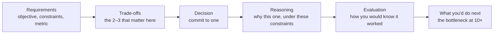

# What staff-level signal looks like

Interviewers at top companies do not grade what you know. They grade what they can
*infer* from what you say about how you would behave on the job: whether you would
make the right call under ambiguity, whether you would notice when a system is
quietly wrong, whether other engineers would learn from you. The word for the
evidence they collect is *signal*. This chapter is about what signal looks like at
the staff level in each of the four rounds you will face, why senior candidates who
know as much fail to produce it, and how to structure an answer so that it does.

Two framing facts before the rounds. First, an ML loop at a large company is
typically four to six 45-minute conversations with different interviewers, each
assigned a different competency; Meta's public guidance describes the full loop for
ML engineers as up to six 45-minute conversations
([Meta Careers: preparing for your full loop interview](https://www.metacareers.com/ML-prep-onsite/)),
and Amazon describes an "interview loop" in which each interviewer assesses a
different aspect of your skills and experience
([Amazon: the interview loop](https://amazon.jobs/content/en/how-we-hire/interview-loop)).
Each interviewer writes up their round independently before a debrief. So a great
system design round does not rescue a weak depth round; each round must produce its
own signal. Second, the *level* is decided in the debrief from the same evidence:
there is usually no separate "staff interview". You are graded against a senior bar
and a staff bar at the same time, and what separates them is the subject of this
chapter. Hello Interview's write-up on what is expected at each level in system
design rounds is the clearest public description of that gradient
([Hello Interview: what is expected at each level](https://www.hellointerview.com/blog/the-system-design-interview-what-is-expected-at-each-level)).

## The senior-to-staff gradient, in one table

| Dimension | Senior answer | Staff answer |
|---|---|---|
| Scope | Solves the problem asked. | Reframes the problem if the framing is wrong, then solves the right one. |
| Trade-offs | Lists them. | Names the two that bear on *this* case, quantifies them, and commits. |
| Evidence | "In my experience…" | "We measured X; it moved Y by Z; here is why the alternative would not have." |
| Systems | Describes the model. | Describes the model, the data pipeline that feeds it, the evaluation that gates it, and what breaks first at 10× scale. |
| Failure | Knows the textbook failure modes. | Knows which failure mode their own system actually hit, how it was detected, and what changed. |
| Communication | Correct, complete, linear. | Leads with the decision, gives the reasoning, invites the interviewer to push on the weakest point. |
| Ownership | Owned a component. | Owned an outcome across components and people; can explain the decisions they made for others. |

The pattern in every row: senior demonstrates *knowledge and competence*; staff
demonstrates *judgment under constraints* and *leverage on other people*.

## The rubric

Use this to grade your mock interviews. It is a synthesis of what public company
guidance and structured guides like Hello Interview's
[ML system design delivery framework](https://www.hellointerview.com/learn/ml-system-design/in-a-hurry/delivery)
say interviewers are looking for, expressed as observable behaviours. Score each
row 1–4; a staff-level round has no row below 3 and at least two rows at 4.

| Competency | 1: Weak | 2: Mixed | 3: Senior | 4: Staff |
|---|---|---|---|---|
| **Problem framing** | Starts solving immediately. | Asks a few clarifying questions, then follows the prompt literally. | Defines the objective, constraints and success metric before designing. | Identifies the assumption in the prompt that changes the answer most, and negotiates it with the interviewer. |
| **Technical depth** | Names techniques without mechanism. | Explains the mechanism; stumbles on "why". | Derives or implements correctly; explains why it works. | Explains why it works, *when it stops working*, and what the second-order effects are. |
| **Trade-off reasoning** | Presents one option. | Lists alternatives without choosing. | Compares alternatives and chooses. | Quantifies the comparison (cost, latency, data, risk), chooses, and states what would change the choice. |
| **Systems and scale** | Ignores serving, data and cost. | Mentions them when prompted. | Designs training, serving and monitoring end to end. | Identifies the bottleneck at the next order of magnitude and designs for it now or explicitly defers it. |
| **Evaluation** | Names a metric. | Names offline and online metrics. | Ties metrics to the objective; discusses leakage, slices and significance. | Designs the evaluation that would catch the failure mode most likely in *this* system, before it ships. |
| **Coding** | Incorrect or incomplete. | Correct with hints; shapes unclear. | Correct, clean, tested; shapes stated. | Correct, tested, extensible; anticipates the follow-up (batching, masking, cache) and names its complexity. |
| **Communication** | Hard to follow. | Follows the prompt; needs steering. | Structured; checks in; adjusts. | Drives the conversation; leads with conclusions; invites challenge on the weakest point. |
| **Ownership and influence** | Describes the team's work. | Describes their component. | Owns an outcome and the decisions behind it. | Shows how they changed what others did (a review, a standard, a rejected proposal) and what it cost them. |

## How to structure any answer

A structure works as scaffolding rather than a script. It lets you think under pressure and lets the
interviewer follow you. The one used throughout this book, and in
[Part XVII](../part17-ml-system-design/00-framework.md), is:

1. **Requirements.** What is being optimised, under what constraints (latency, cost,
   data, hardware, privacy), measured how. Thirty seconds to two minutes. In a depth
   round this collapses to "let me make sure I understand the setting".
2. **Trade-offs.** Not every trade-off: the two or three that decide the answer here.
   Say why the others do not matter in this case.
3. **Decision.** Commit. "I would do X." Interviewers grade a committed decision with
   flawed reasoning above an uncommitted survey with perfect reasoning, because the
   job requires commitment.
4. **Reasoning.** Why X under these constraints, and what would make you choose Y.
5. **Evaluation.** How you would know it worked, offline and online, and the failure
   mode the evaluation is designed to catch.
6. **What you would do next.** The bottleneck at the next scale, or the thing you
   deliberately left out.

Steps 3–6 are where staff signal lives. Senior candidates spend their time on 1–2.

## Round 1: ML coding

**What is actually being graded.** Whether you can turn a mathematical description
into correct, tested code under time pressure, and whether the code you write reveals
that you understand the shapes, the numerical hazards and the follow-up. The problem
is usually one of the [coding canon](../part16-coding-canon/index.md): attention with a
mask, a normalisation layer with backward, NMS, a tokenizer, k-means, an optimizer
step, a PPO or DPO loss. At frontier labs the round is often a pair-programming
session in a shared environment where you are expected to write, run and debug;
Anthropic's public guidance says exactly this and adds that you may look up
documentation, but must be fluent in the language's basic idioms
([Anthropic careers](https://www.anthropic.com/careers)); OpenAI's guide describes
pair-coding interviews and take-home projects as common formats
([OpenAI interview guide](https://openai.com/interview-guide/)). Google's published
tips emphasise talking through your reasoning and asking clarifying questions
([Google Careers: interview tips](https://www.google.com/about/careers/applications/interview-tips)).

**Senior versus staff on the same question.** The question is "implement scaled
dot-product attention with a causal mask".

!!! example "Senior answer"
    Writes a correct function: computes $QK^\top / \sqrt{d_k}$, builds a lower-triangular
    mask, sets masked positions to $-\infty$, softmaxes, multiplies by $V$. Runs it on
    a small input; the output has the right shape. When asked "what if $T = 8192$?",
    says the $T \times T$ matrix gets large.

!!! example "Staff answer"
    Before writing, states the shapes: $Q, K, V \in \R^{B \times H \times T \times d_\text{head}}$,
    scores $\in \R^{B \times H \times T \times T}$. Writes the same function, but
    with a shape comment on each line, subtracts the row max before the exponent and
    says why (overflow in fp16), uses `masked_fill` with a large negative rather than
    `-inf` and says why (a fully masked row produces NaN), and writes a three-line test
    against `torch.nn.functional.scaled_dot_product_attention`. Then, unprompted:
    "The follow-ups you would ask are a KV cache for decoding, where the mask becomes
    a single row and $K, V$ are appended per step, and memory at long context, where
    the $T^2$ scores never need to be materialised if you compute softmax online in
    tiles, that is what FlashAttention does. Which one would you like?"

The staff answer runs longer because every sentence in it carries a decision and
the reason behind that decision. Length from extra items is padding. Length from
reasoning is signal.

**Common failure patterns.**

* Writing without stating shapes, then debugging shape errors for ten minutes.
* Numerical hazards: softmax without max subtraction, log of zero, `-inf` on fully
  masked rows, dividing by a variance without $\epsilon$.
* Reaching for a library call (`F.softmax`, `torch.cdist`, `sklearn`) for the thing
  the question is testing.
* No test. "It runs" is not "it is correct". A three-line comparison against a
  reference or a finite-difference gradient check is the single highest-signal thing
  you can do in this round.
* Clever code: fused $3d$ projections, `einsum` strings without explanation,
  comprehensions that hide the loop being graded.
* Silence. The interviewer cannot grade thinking they cannot hear.

**How to structure the round.** Restate the equation and the shapes (one minute).
Write the simplest correct version with shape comments. Test it. Then name the
follow-ups yourself. The [timed drills](../part16-coding-canon/03-timed-drills.md)
practise exactly this shape.

## Round 2: ML depth and theory

**What is actually being graded.** Whether your understanding has mechanism under
it: can you derive, can you say *why*, and can you reason about what happens when
the assumptions break. The round starts on your résumé or on a standard topic
(attention, detection, optimisation, RL) and drills down until it finds the floor of
your understanding; the level is decided by how deep that floor is and how you
behave when you reach it. Chip Huyen's public book on ML interviews describes this
round as testing the "how, why and when" rather than the "what"
([Introduction to Machine Learning Interviews](https://huyenchip.com/ml-interviews-book/)),
which is the right way to prepare for it.

**Senior versus staff on the same question.** The question is "why does your
detector miss small objects, and what would you do about it?"

!!! example "Senior answer"
    "Small objects have few pixels, so after several stride-2 layers their features
    are too coarse. I would add a feature pyramid so that the detector uses
    higher-resolution feature maps for small objects, increase the input resolution,
    and add more small-object anchors. I could also use focal loss to handle the
    class imbalance."

!!! example "Staff answer"
    "First I would find out *which* mechanism is missing them, because there are at
    least four and they have different fixes. (1) **Receptive field and stride**: an
    object of 12 pixels at stride 16 occupies less than one cell in the feature map,
    so it is never a positive anywhere; the diagnostic is recall by object size versus
    feature-map stride, and the fix is higher-resolution features (an FPN level at
    stride 4 or 8) or higher input resolution, at a quadratic cost in FLOPs. (2)
    **Label assignment**: with IoU-based anchor matching, a small box rarely reaches
    the 0.5 IoU threshold with any anchor, so it gets *no positive sample* during
    training; the diagnostic is the number of positives per ground-truth box as a
    function of size, and the fix is a size-aware assigner (centre sampling, ATSS-style
    adaptive thresholds), which costs nothing at inference. (3) **Loss balance**: small
    objects contribute few positives, so their gradient is drowned by large-object and
    background terms; focal loss helps with background but not with size, so I would
    also check per-size loss weighting. (4) **NMS and post-processing**: crowded small
    objects get suppressed by neighbours; the diagnostic is recall before versus
    after NMS. In the system I owned, the answer turned out to be (2): recall at
    small sizes jumped once we changed assignment, with no change to the backbone,
    and that mattered because our latency budget did not allow (1). If you could only
    do one thing, I would measure (2) first because it is free to fix. Then I would
    ask what the *cost* of a miss is: for an OCR pipeline a missed small field is
    catastrophic and worth the resolution; for a driving stack a small distant object
    is usually detected a few frames later, and temporal aggregation is the cheaper
    fix."

The staff answer does three things the senior answer does not: it turns one
symptom into a differential diagnosis with a *measurement* for each branch; it
attaches a cost to each fix; and it grounds the choice in a system they actually
owned, then reframes around what the miss costs the product.

**A second example, for the LLM side.** The question is "how would you reduce
KV-cache memory?"

!!! example "Senior answer"
    "Use grouped-query attention so that several query heads share one KV head,
    quantise the cache to int8, and use a sliding window so you only keep recent
    tokens. You can also use PagedAttention to avoid fragmentation."

!!! example "Staff answer"
    "Start from the number: per sequence the cache is
    $2 \cdot L \cdot H_{kv} \cdot d_\text{head} \cdot T \cdot \text{bytes}$, so the levers are
    the number of KV heads, the precision, and the sequence length, and the fourth,
    hidden lever is *how many sequences you hold at once*, because the cache is what
    caps batch size and therefore throughput in the memory-bound decode regime.
    Reducing $H_{kv}$ (GQA, or MQA in the limit) is a *training-time* decision: it
    divides the cache by $H/H_{kv}$ with a small quality cost, and it is what most
    production models already do, so if the model is fixed it is not available to me.
    Quantising the cache to int8 halves it from fp16 at a cost I would measure on
    long-context tasks specifically, because that is where cache error accumulates.
    Sliding-window or eviction schemes bound $T$ and are the only lever that changes
    the asymptotics, but they change the model's behaviour, so they need an
    evaluation on tasks that require long-range recall. Paging does not reduce bytes;
    it reduces waste from fragmentation and pre-allocation, and it is what lets you
    run larger batches, so if the goal is throughput rather than fitting one long
    sequence, paging plus continuous batching is what I would do first because it
    has no quality cost. My decision depends on which constraint we are actually
    hitting: if it is one sequence not fitting, quantise then window; if it is
    throughput, paging and batching, then quantise. And I would confirm with a
    roofline number that we are memory-bound before doing any of it, because if we are
    compute-bound at the batch sizes we run, none of this helps."

**Common failure patterns.**

* Listing techniques without the mechanism that makes each one work.
* Answering the general question when the interviewer asked about *your* system.
* Not knowing the number: the cache formula, the parameter count, the FLOPs. Staff
  candidates carry the arithmetic.
* Bluffing at the floor. When you reach the limit of what you know, say so
  precisely: "I have not derived that; here is how I would approach it." Interviewers
  grade the approach.
* Never committing: "it depends" without saying on what.

**How to structure the round.** Answer the surface question in one sentence, then
go one level down by choice, before being pushed: mechanism, then the number, then
the failure mode, then the evidence from something you built. Stop after each layer
and let the interviewer choose the direction.

## Round 3: ML system design

**What is actually being graded.** Whether you can take an ambiguous product problem
and produce a system that a team could build, with the ML formulation, the data,
the model, the serving path, and the evaluation all consistent with each other and
with the business constraint. Hello Interview's guide calls ML system design "the
wild west" of interviews for its inconsistency across companies, and recommends a
delivery framework precisely because structure is what survives an unfamiliar
prompt ([Hello Interview: ML system design in a hurry](https://www.hellointerview.com/learn/ml-system-design/in-a-hurry/introduction)).
Their framework moves from requirements to a high-level design to deep dives, and
weights the ML-specific pieces, problem formulation, data and labels, features,
model, evaluation, serving, over generic distributed-systems detail. Part XVII of
this book uses the same skeleton.

**Senior versus staff on the same question.** The question is "design the
perception system for a delivery robot that operates on sidewalks".

!!! example "Senior answer"
    Proposes a camera plus LiDAR setup, a 2D detector on each camera and a 3D
    detector on the point cloud, late fusion, a Kalman-filter tracker, and a semantic
    segmentation model for drivable area. Describes training on a labelled dataset,
    evaluating with mAP, and deploying on an embedded GPU with TensorRT. Mentions data
    collection and re-labelling for failures.

!!! example "Staff answer"
    Starts with the requirement that changes everything: "What is the failure that
    ends the programme? For a sidewalk robot it is contact with a pedestrian, so the
    system's primary metric is recall on vulnerable road users within the stopping
    distance, at a false-positive rate that does not make the robot freeze every
    block. I will design for that and treat everything else as secondary." Then
    the trade-offs that matter: sensor budget versus compute budget on the robot;
    a single BEV representation versus per-sensor detection with late fusion; how
    much to invest in the auto-labelling pipeline versus human labels. Commits: a
    multi-camera BEV backbone with LiDAR features fused at the BEV level, because a
    unified BEV space makes tracking and planning consume one representation and
    makes the near-field occlusion problem (pedestrian stepping out from behind a
    parked car) tractable with temporal fusion; explains what is lost (per-camera
    detectors are easier to debug and to run on the compute budget, so the
    fallback design is stated). Describes the data engine as the actual product:
    hard-example mining from disengagements and near-misses, auto-labelling with
    an offline model that is larger than the on-robot one, and a labelling
    prioritisation that is driven by per-slice recall. Evaluation: per-slice recall
    on vulnerable road users by range, lighting and occlusion; a scenario-based
    closed-loop test in simulation because open-loop mAP does not predict freezing
    behaviour; a shadow-mode deployment before any behaviour change ships. Then the
    bottleneck at 10×: "at ten cities the long tail is city-specific, curb
    geometry, signage, weather, and the labelling budget, not the model, becomes the
    constraint, so I would build the slice-based triage now rather than later."

**Common failure patterns.**

* Jumping to the model. The model is usually the least differentiated part of the
  design; the data pipeline and the evaluation are where the design succeeds or fails.
* Designing for the average case when the prompt is about the tail (safety,
  fraud, moderation).
* No serving path: training a model is not a system. Latency budget, batching,
  fallbacks, monitoring.
* Metrics that do not connect to the objective: mAP for a safety system, AUC for a
  ranking system whose objective is long-term retention.
* Not committing. A design that keeps two architectures alive "to be safe" is not a design.
* Generic distributed-systems talk (queues, caches, sharding) at the expense of the
  ML-specific decisions the interviewer is there to grade.

**How to structure the round.** The six steps above, with an explicit time budget:
five minutes on requirements, five on the high-level design, twenty-five on two deep
dives *you* choose (usually data plus evaluation, or model plus serving), and five on
what you would do next. Say the time budget aloud; interviewers appreciate a
candidate who runs the room. The [framework chapter](../part17-ml-system-design/00-framework.md)
works through this with a template, and each design chapter in
[Part XVII](../part17-ml-system-design/index.md) is a fully worked instance.

## Round 4: Behavioral and leadership on ML projects

**What is actually being graded.** Whether you have *done* the thing the level
requires, owned an outcome, made decisions with incomplete information, changed
what other people did, been wrong and recovered, and whether you can tell the truth
about it precisely. Amazon's process is the most explicit public example: a large
part of the loop is behavioural questions tied to its published Leadership
Principles, answered in the STAR (situation, task, action, result) structure
([Amazon: Leadership Principles](https://amazon.jobs/content/en/our-workplace/leadership-principles);
[Amazon: the interview loop](https://amazon.jobs/content/en/how-we-hire/interview-loop)).
Other companies are less explicit but grade the same things; Google's published
hiring overview describes assessing candidates on role-related knowledge, general
cognitive ability, leadership, and how they work
([Google Careers: how we hire](https://www.google.com/about/careers/applications/how-we-hire)).

**Senior versus staff on the same question.** The question is "tell me about a
time your model underperformed in production".

!!! example "Senior answer"
    "Our OCR model's field-extraction accuracy dropped after we onboarded a new
    document type. I investigated, found that the new layouts were out of
    distribution, collected and labelled a few thousand examples, fine-tuned, and
    accuracy recovered. We added the document type to our test set."

!!! example "Staff answer"
    "Our OCR field-extraction accuracy dropped after we onboarded a new document
    type, but the interesting failure was that we did not notice for eleven days,
    because our dashboard reported aggregate accuracy and the new type was 4% of
    volume. That was my system and my monitoring design, so the first thing I owned
    was the detection gap, not the model. I made two decisions. Short term, I had us
    fine-tune on a few thousand labelled examples of the new type, which recovered
    accuracy in a week. Long term, I argued for (and got) per-document-type
    accuracy slices with alerting on any slice above a volume threshold, and a rule
    that a new document type cannot onboard without a labelled evaluation slice. That
    second decision slowed onboarding by about a week per type and the product team
    pushed back hard; I made the case with the cost of the eleven-day incident and we
    agreed on a smaller slice size than I originally asked for. Two things I would do
    differently: I would have insisted on slice-level monitoring before we scaled
    past a handful of document types, because I knew the risk and deferred it; and I
    should have brought the product team into the monitoring design rather than
    presenting it as a constraint after the incident."

The staff answer names a decision the candidate owned, a disagreement with a
specific cost, a number that made the case, and a mistake without softening it.

**Common failure patterns.**

* "We" throughout. The interviewer needs to know what *you* decided.
* Stories with no cost. Every real decision cost something; if yours did not,
  it was not a decision.
* Failures that are not failures ("I worked too hard"). Pick a real one.
* No number. What moved, by how much, measured how.
* Rehearsed to the point of not answering the question asked. Have the stories
  ready, but answer the question.

**How to structure the round.** Situation and task in two sentences. The decision
you owned. The alternative you rejected and why. The result, with a number. What you
would do differently. Prepare five stories that between them cover: a technical
decision under uncertainty; a disagreement with someone senior; a failure you caused;
influencing a team you did not manage; a project you killed or descoped.

## Talking about production experience as evidence

Your production experience is your strongest asset in every round, not only the
behavioral one, and it is usually under-used. The trick is to present it as
*evidence for a claim* rather than as a story.

**Perception, OCR and detection systems.** These are the systems most interviewers
have not built themselves, so be concrete about the parts that transfer:

* **The data engine.** How examples were mined (from disagreements between models,
  from low-confidence predictions, from user corrections), how labels were produced
  (human, auto-labelled with a larger offline model, weak rules), how the labelling
  budget was allocated across slices. This maps directly onto how frontier labs and
  autonomy companies describe their own pipelines
  ([weak supervision & auto-labeling](../part10-self-supervised/03-weak-supervision-and-auto-labeling.md),
  [Scale AI & data engines](../part18-company-deep-dives/scale-ai-data-engines.md)).
* **Evaluation by slice.** Recall by object size, document type, lighting, range,
  language, layout. If you can say "our metric was per-slice recall with a volume
  threshold for alerting", you have said something that applies to ranking, fraud
  and LLM evaluation too.
* **The failure you actually hit.** Label assignment, not the backbone. Domain shift
  from a camera firmware update. A resolution change that silently broke small-object
  recall. These are the stories that show your understanding has mechanism under it.
* **Latency and deployment constraints.** Quantisation, pruning, the accuracy you gave
  up for the frame rate, and how you measured that trade.
* **The bridge to the modern stack.** Say explicitly how the system would be built
  today: a ViT or DETR-style head, a VLM for document understanding, CLIP-style
  retrieval for triage. Interviewers at LLM companies want to know your experience
  is portable; show them the mapping ([VLM architecture](../part08-multimodal/04-vlm-architecture.md),
  [OCR & document understanding design](../part17-ml-system-design/09-ocr-document-understanding.md)).

**ML systems and platform work.** The evidence here is numbers and incidents:

* Throughput and cost before and after a change, and what the change was (batching,
  quantisation, a serving-framework migration, a data-loader fix).
* Training reliability: checkpointing, restarts, the divergence you debugged and
  how ([training systems](../part14-systems/02-training-systems.md)).
* Monitoring: what you alerted on, what you missed, and what you changed.
* The platform decision you made *for other teams*, a feature store, an
 evaluation harness, a standard, and the adoption cost you paid to get it used.

**The shape of an evidence sentence.** "We had \<constraint\>; I chose \<decision\>
over \<alternative\> because \<mechanism\>; it moved \<metric\> by \<amount\>; the thing
it cost us was \<cost\>." One sentence of this form, dropped into a depth or design
answer at the right moment, is worth more than a full story in the behavioral round,
because it shows the interviewer that your design judgement was formed by contact
with reality.

## Using AI tools during interviews

Policies now vary and you should read the company's before the loop. Meta's public
guidance says that select roles include an authorised AI assistant inside CoderPad
during technical interviews and recommends practising with AI coding tools
([Meta Careers: full loop preparation](https://www.metacareers.com/ML-prep-onsite/)).
Anthropic's guidance is the opposite for live interviews: no AI assistance unless
they say otherwise, because they want to see how you think in real time
([Anthropic careers](https://www.anthropic.com/careers)). Where tools are allowed, the
grading shifts toward whether you can specify, verify and debug what the tool
produces, which is the same shape-and-test discipline this book teaches.

## Preparing for a specific company

Read the company's own guidance first: it is short and it is what the interviewers
were calibrated on
([Google](https://www.google.com/about/careers/applications/how-we-hire),
[Meta](https://www.metacareers.com/hiring-process/),
[Amazon](https://amazon.jobs/content/en/how-we-hire/interview-loop),
[OpenAI](https://openai.com/interview-guide/),
[Anthropic](https://www.anthropic.com/careers)). Then read the
[company deep dive](../part18-company-deep-dives/index.md) in this book for the
business problem and the published architecture, and choose the two
[Part XVII](../part17-ml-system-design/index.md) designs closest to the role. The
[week-before checklist](study-plan.md#the-week-before-checklist) turns that into a
schedule.

## References

* Hello Interview, *ML System Design in a Hurry*: [introduction](https://www.hellointerview.com/learn/ml-system-design/in-a-hurry/introduction), [delivery framework](https://www.hellointerview.com/learn/ml-system-design/in-a-hurry/delivery), [evaluation](https://www.hellointerview.com/learn/ml-system-design/core-concepts/evaluation); and the blog post [The system design interview: what is expected at each level](https://www.hellointerview.com/blog/the-system-design-interview-what-is-expected-at-each-level).
* Chip Huyen, *Introduction to Machine Learning Interviews* (free, online): [huyenchip.com/ml-interviews-book](https://huyenchip.com/ml-interviews-book/).
* Google Careers: [How we hire](https://www.google.com/about/careers/applications/how-we-hire); [Interviewing at Google: best practices, advice, and tips](https://www.google.com/about/careers/applications/interview-tips).
* Meta Careers: [Preparing for your full loop interview (ML)](https://www.metacareers.com/ML-prep-onsite/); [Hiring process](https://www.metacareers.com/hiring-process/).
* Amazon Jobs: [The interview loop](https://amazon.jobs/content/en/how-we-hire/interview-loop); [Leadership Principles](https://amazon.jobs/content/en/our-workplace/leadership-principles); [Applied Scientist interview prep](https://amazon.jobs/content/en/how-we-hire/applied-scientist-interview-prep).
* OpenAI: [Interview guide](https://openai.com/interview-guide/).
* Anthropic: [Careers](https://www.anthropic.com/careers) (interview process and AI-usage guidance).
