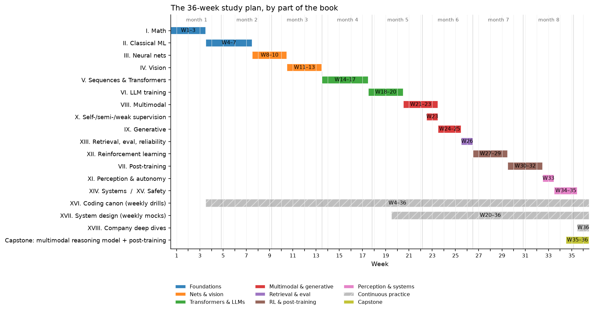

# Study plan (6–9 months)

This is a 36-week sequence through the whole book: roughly 110 whiteboard
derivations and the 60 implementations of the [coding canon](../part16-coding-canon/index.md),
ordered so that each item unlocks the next. It ends with you building a small
multimodal reasoning model and running its full post-training pipeline
(SFT → reward model → DPO → GRPO) on code you wrote yourself.

At about ten focused hours a week the plan takes nine months; at fifteen it takes
six. If your calendar is shorter than that, skip to the
[8-week variant](#the-8-week-i-have-an-interview-soon-variant) and the
[week-before checklist](#the-week-before-checklist).

{ width="720" }

The timeline above shows the shape of the plan: foundations first (blue), then
networks and vision, then Transformers and LLMs, then multimodal and generative
models, then RL *before* post-training, and finally perception, systems and the
capstone. The two hatched bars are the habits that run underneath everything: a
timed coding drill every week from week 4, and a system design mock every week from
week 20.

## How to run a week

Every week has the same four parts. Do them in this order; the order is the point.

1. **Read** the listed chapters. Do not take notes on the first pass; read for the
   argument. Then re-read section 2 (the math) with a pen.
2. **Derive** the listed results at a whiteboard or on paper, from a closed book. Each
   derivation is named precisely so you can check it against the boxed result in the
   chapter. If you get stuck, read the derivation, close the book, and do it again the
   next day. A derivation is "done" when you have reproduced it twice on different days.
3. **Implement** the listed canon items from a blank file, then run the chapter's test
   in `tests/` against your file. An implementation is "done" when the test passes and
   you can explain every shape comment.
4. **Mock.** Do the listed interview activity aloud, timed, ideally to another person.
   Use the rubric in [what staff-level signal looks like](interview-signal.md#the-rubric)
   to grade yourself.

Derivations are numbered **D1–D111** and implementations **#1–#60** (the numbering of
the canon in [Part XVI](../part16-coding-canon/index.md)). Level A/B/C/D tags follow
the [asymmetric depth](how-to-use.md#4-asymmetric-depth-the-four-target-levels) contract:
a Level A item must be done from memory; a Level B item may be done with the chapter open.

## Phase 1: Foundations (weeks 1–7)

Parts [I](../part01-math/index.md) and [II](../part02-classical/index.md). Everything
in Level A rests on these seven weeks, so do not rush them. The first coding items
appear immediately: linear and logistic regression are applied linear algebra.

| Week | Read | Derive at the whiteboard | Implement | Mock interview |
|---|---|---|---|---|
| **1** | [Linear algebra](../part01-math/01-linear-algebra.md), [Calculus & matrix calculus](../part01-math/02-calculus-matrix-calculus.md), [Tensors, shapes & broadcasting](../part01-math/07-tensor-shapes-broadcasting.md) | **D1** $\nabla_W \norm{XW - y}^2 = 2X^\top(XW - y)$ and the normal equations. **D2** Chain rule through $Y = XW$: $\partial L/\partial X = (\partial L/\partial Y) W^\top$, $\partial L/\partial W = X^\top (\partial L/\partial Y)$, with shapes. **D3** SVD of $X$ ↔ eigendecomposition of $X^\top X$; the condition number and why it slows gradient descent. | **#1 Linear regression** (normal equations and gradient descent, NumPy). | Ten broadcasting problems from the [shape drills](../part16-coding-canon/02-shape-drills.md), answered aloud with the output shape and a one-line reason. |
| **2** | [Probability](../part01-math/03-probability.md), [Statistics](../part01-math/04-statistics.md), [Information theory](../part01-math/05-information-theory.md) | **D4** Gaussian likelihood MLE ⇒ least squares; Gaussian prior MAP ⇒ ridge. **D5** Bias–variance decomposition of expected squared error. **D6** $\KL(p\|q) \ge 0$ via Jensen, and cross-entropy $= H(p) + \KL(p\|q)$, so minimising CE minimises KL. | **#2 Logistic regression** (derive $\partial L/\partial z = \sigma(z) - y$ first, then code it). | Explain bias–variance with a numeric example in five minutes; then answer "how does more data change each term?" |
| **3** | [Optimization](../part01-math/06-optimization.md) | **D7** Gradient descent on a quadratic converges iff $\eta < 2/L$; rate in terms of $\kappa = L/\mu$. **D8** Momentum as an EMA of gradients; Adam's update and why the bias correction $\hat m = m/(1 - \beta_1^t)$ is needed. **D9** Logistic loss is convex: Hessian $X^\top \diag(p(1-p)) X \succeq 0$. **D10** Lagrangian and KKT conditions for one equality constraint (you will reuse this for PCA). | **#9 SGD** (with momentum), **#10 Adam**, **#3 Softmax regression**: derive $\partial L/\partial z = p - y$ for softmax cross-entropy, then implement and finite-difference check it. | 30 minutes: implement Adam from a blank file, then explain each hyperparameter and what breaks if it is wrong. |
| **4** | [Linear regression](../part02-classical/01-linear-regression.md), [Logistic & softmax regression](../part02-classical/02-logistic-softmax-regression.md), [NumPy ↔ PyTorch cheat sheet](../part16-coding-canon/01-numpy-torch-cheatsheet.md) | **D11** Ridge closed form $(X^\top X + \lambda I)^{-1} X^\top y$ and its effect on each singular value. **D12** Softmax Jacobian $\diag(p) - pp^\top$, and $p - y$ again by chaining it with the log-loss, on a 3-class numeric example. | **#4 KNN** (vectorised pairwise distances via $\norm{a}^2 - 2a^\top b + \norm{b}^2$). | 45-minute coding round: logistic regression from a blank file with a gradient check. Weekly timed drills start here and never stop. |
| **5** | [Trees & ensembles](../part02-classical/03-trees-and-ensembles.md), [KNN & K-means](../part02-classical/04-knn-kmeans.md) | **D13** K-means: both the assignment step and the update step decrease the objective, so it converges. **D14** Gini and entropy impurity; information gain of a split. **D15** Variance of an average of $B$ estimators with pairwise correlation $\rho$: $\rho\sigma^2 + (1-\rho)\sigma^2/B$ (why random forests decorrelate trees). **D16** Gradient boosting as functional gradient descent; residuals are the negative gradient for squared loss. | **#5 K-means**, **#6 Decision tree** (CART with Gini). | ML depth: "when do gradient-boosted trees beat neural nets on tabular data, and why?": five-minute structured answer. |
| **6** | [Probabilistic models & EM](../part02-classical/05-probabilistic-models-em.md), [Dimensionality reduction](../part02-classical/06-dimensionality-reduction.md) | **D17** PCA: maximise $w^\top \Sigma w$ subject to $\norm{w} = 1$ ⇒ the top eigenvector (use D10). **D18** PCA via the SVD of centred $X$; reconstruction error equals the sum of dropped eigenvalues. **D19** The ELBO from Jensen, $\log p(x) \ge \E_q[\log p(x,z)] - \E_q[\log q(z)]$, and why EM increases the likelihood monotonically. **D20** GMM M-step updates for means, covariances and mixing weights. | **#7 PCA**, **#8 GMM / EM**. | Whiteboard the PCA derivation in ten minutes with no notes; then answer "when would you use an autoencoder instead?" |
| **7** | [Kernel methods & SVMs](../part02-classical/07-kernel-methods-svm.md) (Level D: read sections 1 and TL;DR only), [Evaluation](../part13-retrieval-eval-reliability/02-evaluation.md) | **D21** SVM primal → dual; support vectors; the kernel trick as a change of inner product. **D22** AUC $= P(\text{score of a random positive} > \text{score of a random negative})$. **D23** Precision, recall, F1, and why accuracy misleads under imbalance; expected calibration error. | Consolidation: re-implement **#1–#8** timed, 30 minutes each. | A full 45-minute ML depth round on classical ML, graded with the rubric. |

## Phase 2: Neural networks and vision (weeks 8–13)

Parts [III](../part03-neural-nets/index.md) and [IV](../part04-vision/index.md). You
build an autograd engine before you use PyTorch's, so that `loss.backward()` is never
a black box in an interview.

| Week | Read | Derive at the whiteboard | Implement | Mock interview |
|---|---|---|---|---|
| **8** | [MLPs & activations](../part03-neural-nets/01-mlp-and-activations.md), [Backpropagation](../part03-neural-nets/02-backpropagation.md) | **D24** Backprop through a linear layer: $\delta_{l-1} = (\delta_l W_l^\top) \odot \sigma'(z_{l-1})$ and $\partial L/\partial W_l = h_{l-1}^\top \delta_l$, with shapes. **D25** Derivatives of ReLU, sigmoid ($\sigma(1-\sigma)$) and tanh ($1 - \tanh^2$). **D26** Cost of reverse mode (≈2× a forward pass, independent of the number of parameters) versus forward mode (one pass per input). | **#11 MLP forward / backward in NumPy**, verified by finite differences. | Derive backprop for a two-layer network at a whiteboard in 15 minutes, including a full numeric forward and backward pass on a 2-2-1 network. |
| **9** | [Building an autograd engine](../part03-neural-nets/03-autograd-engine.md), [Initialization](../part03-neural-nets/04-initialization.md) | **D27** Reverse-mode autodiff on a computation graph: topological order and gradient accumulation at fan-out nodes. **D28** Xavier and He initialisation from variance preservation, $\mathrm{Var}(y) = n\,\mathrm{Var}(w)\,\mathrm{Var}(x)$. **D29** Vanishing and exploding gradients as a product of Jacobians; why a residual block gives $\partial (x + F(x))/\partial x = I + \partial F/\partial x$. | **#12 Autograd engine** (scalar first, then tensor; checked against `torch`). | "Explain exactly what happens when I call `loss.backward()`" for a five-operation graph you draw yourself. |
| **10** | [Normalization](../part03-neural-nets/05-normalization.md), [Regularization](../part03-neural-nets/06-regularization.md) | **D30** BatchNorm forward and the full backward pass. **D31** LayerNorm backward. **D32** Dropout's inverted scaling and the expectation it preserves. **D33** The $L_2$ penalty equals weight decay under SGD but not under Adam (why AdamW exists). | **#13 BatchNorm**, **#14 LayerNorm**, **#15 RMSNorm**, each checked against `torch.nn.functional`. | 45-minute coding round: LayerNorm with a hand-written backward, no autograd. |
| **11** | [Image representation](../part04-vision/01-image-representation.md), [Convolutions](../part04-vision/02-convolutions.md), [CNN architectures](../part04-vision/03-cnn-architectures.md) | **D34** Convolution as a matrix multiply (im2col) and its FLOPs, $C_\text{out} C_\text{in} k^2 H W$. **D35** Backward of a convolution: the input gradient is a convolution with the flipped kernel; the kernel gradient is a correlation. **D36** Receptive-field recursion $r_l = r_{l-1} + (k_l - 1)\prod_{i<l} s_i$. **D37** Parameter and FLOP counts of depthwise-separable versus full convolution. | **#16 Convolution** (NumPy, im2col), **#17 Tiny CNN** (PyTorch, trained on a tiny dataset). | Count the parameters and FLOPs of one ResNet stage aloud, then say which layer dominates and why. |
| **12** | [Object detection](../part04-vision/04-detection.md) | **D38** IoU and GIoU; why IoU has zero gradient for non-overlapping boxes. **D39** Focal loss $-(1-p)^\gamma \log p$: its gradient and how $\gamma$ down-weights easy negatives. **D40** Anchor parametrisation $(t_x, t_y, t_w, t_h)$ and why width and height are predicted in log space. **D41** mAP: precision–recall integration and IoU thresholds. | **#18 IoU**, **#19 NMS**, **#20 Anchor matching**, **#21 Focal loss**. | ML depth: "why does your detector miss small objects?": give the staff-level answer from [interview signal](interview-signal.md#round-2-ml-depth-and-theory). |
| **13** | [Segmentation](../part04-vision/05-segmentation.md), [Geometry & cameras](../part04-vision/06-geometry.md), [3D perception](../part04-vision/07-3d-perception.md) | **D42** Pinhole projection in homogeneous coordinates; intrinsics $K$ and extrinsics $[R \mid t]$; back-projecting a pixel to a ray. **D43** Dice loss versus cross-entropy: gradient behaviour under class imbalance. **D44** Transposed convolution as the adjoint of convolution. | Consolidation: timed re-implementation of **#16–#21**; a mini U-Net forward pass with shapes. | First ML system design mock: [autonomous-vehicle perception](../part17-ml-system-design/05-perception-system-av.md), ungraded, to establish a baseline. |

## Phase 3: Sequences, Transformers and LLM training (weeks 14–20)

Parts [V](../part05-sequence-transformers/index.md) and [VI](../part06-llm-training/index.md).
By the end of week 17 you have a tiny GPT that you wrote from memory; weeks 18–20 make
it efficient.

| Week | Read | Derive at the whiteboard | Implement | Mock interview |
|---|---|---|---|---|
| **14** | [RNN, LSTM, GRU](../part05-sequence-transformers/01-rnn-lstm-gru.md), [Seq2seq & early attention](../part05-sequence-transformers/02-seq2seq-attention.md) | **D45** Backprop through time and the product $\prod_t W^\top \diag(\sigma'_t)$ that vanishes or explodes. **D46** The LSTM's additive cell-state path and why it keeps gradients alive. **D47** Bahdanau additive attention and its cost per output token. | **#22 RNN**, **#23 LSTM** (manual BPTT checked against `torch`). | "Why did Transformers replace LSTMs?": a five-minute answer that names parallelism, path length and the KV cache. |
| **15** | [Attention mathematics](../part05-sequence-transformers/03-attention-mathematics.md), [Tokenization](../part05-sequence-transformers/06-tokenization.md) | **D48** $\mathrm{Var}(q \cdot k) = d_k$ for unit-variance entries, hence the $1/\sqrt{d_k}$ scale. **D49** Gradient of softmax attention with respect to the scores and with respect to $V$. **D50** Attention FLOPs $\approx 4T^2 d$ and $O(T^2)$ memory per head; multi-head parameter count $4d^2$. **D51** The BPE merge rule; vocabulary size trades sequence length against embedding parameters. | **#24 BPE tokenizer**, **#25 Scaled dot-product attention**, **#26 Multi-head attention**, **#27 Causal attention**, **#28 Cross-attention**. | 60-minute coding round: multi-head attention with a causal mask, checked against `torch.nn.functional.scaled_dot_product_attention`. |
| **16** | [Transformer architectures](../part05-sequence-transformers/04-transformer-architectures.md), [Positional encodings](../part05-sequence-transformers/05-positional-encodings.md) | **D52** RoPE: rotating $q_m$ and $k_n$ by $m\theta$ and $n\theta$ makes $q_m^\top k_n$ depend only on $m - n$. **D53** Sinusoidal encodings: $\mathrm{PE}(pos + k)$ is a linear function of $\mathrm{PE}(pos)$. **D54** Pre-norm versus post-norm: where the residual stream's gradient flows. **D55** Transformer parameter count $\approx 12 L d^2$ plus embeddings; training FLOPs $\approx 6ND$. | **#29 Transformer encoder block**, **#30 Transformer decoder block**, **#34 RoPE**. | Walk through one decoder layer aloud with every shape, in ten minutes. |
| **17** | [Timed coding drills](../part16-coding-canon/03-timed-drills.md); revisit Part V | **D56** Temperature, top-$k$ and top-$p$ sampling: what each does to the distribution. **D57** Perplexity $= \exp(\text{mean token cross-entropy})$; nats versus bits. **D58** SwiGLU: the gate's gradient and the parameter count at width $\tfrac{8}{3} d$. | **#31 Full tiny GPT**, **#32 Autoregressive generation**, **#36 SwiGLU**. | Timed drill: a GPT block from a blank file in 45 minutes. |
| **18** | [Pretraining data & objective](../part06-llm-training/01-pretraining-data-objective.md), [Scaling laws](../part06-llm-training/02-scaling-laws.md) | **D59** Next-token prediction as MLE of the chain-rule factorisation $\prod_t p(x_t \mid x_{<t})$. **D60** Compute-optimal allocation: minimise $L(N, D) = E + A/N^\alpha + B/D^\beta$ subject to $6ND = C$. **D61** Warmup plus cosine schedule; label smoothing's effect on the gradient. | **#33 KV caching** (measure the generation speedup against #32). | ML depth: "you have a fixed compute budget; how do you choose model size versus data size?" |
| **19** | [Large-model architecture (MoE, GQA, SSMs)](../part06-llm-training/03-large-model-architecture.md), [Efficient attention & KV cache](../part06-llm-training/04-efficient-attention-kv-cache.md) | **D62** KV-cache bytes $= 2 \cdot L \cdot H_{kv} \cdot d_\text{head} \cdot T \cdot \text{bytes}$ per sequence; GQA reduces it by $H / H_{kv}$. **D63** MoE: active versus total parameters; the load-balancing auxiliary loss. **D64** Online softmax with a running max and running sum (the core of FlashAttention). **D65** Why decode is memory-bound: bytes moved per generated token. | **#35 GQA**, **#37 Tiny MoE** (top-$k$ router with load-balance loss). | ML depth: "how would you reduce KV-cache memory?": the staff-level answer from [interview signal](interview-signal.md#round-2-ml-depth-and-theory). |
| **20** | [Quantization](../part06-llm-training/05-quantization.md), [Fine-tuning & LoRA](../part06-llm-training/06-fine-tuning-lora.md), [Mid-training](../part06-llm-training/07-mid-training.md) | **D66** LoRA: $W + \tfrac{\alpha}{r} BA$; parameter count versus full fine-tuning; gradients with respect to $A$ and $B$; merging at inference is free. **D67** Absmax int8 quantisation and its error bound; per-channel versus per-tensor; why activation outliers break naive quantisation. | **#38 LoRA** (wrapping `nn.Linear`; equal to full fine-tuning at $r = d$). | Weekly system design mocks start here: [LLM assistant with RAG](../part17-ml-system-design/08-llm-product-rag-assistant.md). |

## Phase 4: Multimodal and generative (weeks 21–25)

Parts [VIII](../part08-multimodal/index.md), [X](../part10-self-supervised/index.md)
and [IX](../part09-generative/index.md). Your ViT, CLIP and projector from these
weeks are the parts you will assemble into the capstone.

| Week | Read | Derive at the whiteboard | Implement | Mock interview |
|---|---|---|---|---|
| **21** | [Vision Transformers](../part08-multimodal/01-vision-transformers.md), [DETR & set prediction](../part08-multimodal/02-detr.md) | **D68** Patch embedding as a strided convolution; token count $(H/p)(W/p)$; ViT FLOPs scale quadratically in token count. **D69** The Hungarian matching cost and permutation invariance of the set loss. **D70** Why DETR converges slowly (sparse matching gradients) and what deformable attention changes. | **#39 Tiny ViT**, **#40 DETR-style matching / loss** (`scipy.optimize.linear_sum_assignment` only in the comparison test). | "ViT or CNN for 4K document images?": a trade-off answer with a committed decision. |
| **22** | [CLIP & contrastive learning](../part08-multimodal/03-clip-contrastive.md), [VLM architecture](../part08-multimodal/04-vlm-architecture.md) | **D71** The symmetric InfoNCE loss and its gradient; the role of temperature. **D72** Batch size is the number of negatives; zero-shot classification as retrieval over prompt embeddings. **D73** VLM projector token budget: resolution, tokens per image, and LLM context cost. | **#41 CLIP-style contrastive training**, **#42 Mini VLM projector architecture**. | System design: [visual search & image retrieval](../part17-ml-system-design/06-visual-search-image-retrieval.md). |
| **23** | [Multimodal foundation models](../part08-multimodal/05-multimodal-foundation.md), [Video models](../part08-multimodal/06-video-models.md), [Self-supervised learning](../part10-self-supervised/01-self-supervised-learning.md), [Semi-supervised learning](../part10-self-supervised/02-semi-supervised.md), [Weak supervision & auto-labeling](../part10-self-supervised/03-weak-supervision-and-auto-labeling.md) | **D74** The masked-autoencoder objective and the masking ratio. **D75** SimCLR versus BYOL objectives; why BYOL does not collapse (stop-gradient plus predictor, sketch). **D76** Pseudo-labelling as EM; consistency regularisation. | Consolidation: train tiny ViT + CLIP end-to-end on a toy dataset and evaluate zero-shot. | System design: [OCR & document understanding](../part17-ml-system-design/09-ocr-document-understanding.md). |
| **24** | [Autoencoders & VAEs](../part09-generative/01-autoencoders-vae.md), [GANs](../part09-generative/02-gans.md) (Level D) | **D77** The VAE ELBO and the reparameterisation trick. **D78** Closed-form KL between diagonal Gaussians. **D79** GAN: optimal discriminator $D^* = p/(p+q)$ and the minimax value $2\,\mathrm{JS} - 2\log 2$ (understand; do not memorise). | **#43 VAE**. | ML depth: "why are VAE samples blurry, and what fixes it?" |
| **25** | [Diffusion](../part09-generative/03-diffusion.md), [Flow matching](../part09-generative/04-flow-matching.md) (Level C) | **D80** Forward process closed form $q(x_t \mid x_0) = \mathcal N(\sqrt{\bar\alpha_t}\, x_0, (1 - \bar\alpha_t) I)$. **D81** The posterior $q(x_{t-1} \mid x_t, x_0)$ and the $\epsilon$-prediction simplification of the loss. **D82** DDIM deterministic sampling. **D83** Flow matching: the conditional velocity target $x_1 - x_0$ and why the marginal objective has the same gradient. | **#44 DDPM** (train on 2-D toy data; sample). | "Diffusion or autoregression for image generation?": a trade-off answer. |

## Phase 5: Retrieval and evaluation (week 26)

Part [XIII](../part13-retrieval-eval-reliability/index.md). One week, but the
evaluation harness you write here is used for every remaining week.

| Week | Read | Derive at the whiteboard | Implement | Mock interview |
|---|---|---|---|---|
| **26** | [Retrieval & RAG](../part13-retrieval-eval-reliability/01-retrieval-and-rag.md), [Evaluation](../part13-retrieval-eval-reliability/02-evaluation.md), [Uncertainty & reliability](../part13-retrieval-eval-reliability/03-uncertainty-reliability.md) | **D84** Recall@$k$, MRR and nDCG. **D85** Product quantisation: memory and distance error; HNSW search cost intuition. **D86** The conformal prediction coverage guarantee. **D87** A paired bootstrap confidence interval for an offline metric difference. | **#45 ANN / vector retrieval** (flat and IVF), **#46 RAG pipeline**, **#59 Evaluation harness** (v1: metrics, bootstrap CIs, slice tables). | System design: [search ranking](../part17-ml-system-design/02-search-ranking.md). |

## Phase 6: Reinforcement learning, then post-training (weeks 27–32)

Parts [XII](../part12-rl/index.md) and [VII](../part07-post-training/index.md), in
that order. PPO for language is a special case of PPO; DPO is what you get when you
solve the RLHF objective in closed form. Learning RL first makes both obvious.

| Week | Read | Derive at the whiteboard | Implement | Mock interview |
|---|---|---|---|---|
| **27** | [MDPs & Bellman equations](../part12-rl/01-mdp-bellman.md), [Classical RL algorithms](../part12-rl/02-classical-rl.md) | **D88** The Bellman expectation and optimality equations. **D89** The Bellman operator is a $\gamma$-contraction, so value iteration converges. **D90** The policy improvement theorem. **D91** TD(0) and Q-learning updates; convergence conditions (Robbins–Monro step sizes, every pair visited). | **#47 Value iteration**, **#48 Q-learning** (gridworld). | Whiteboard the Bellman optimality equation from the definition of return, in ten minutes. |
| **28** | [Deep RL & DQN](../part12-rl/03-deep-rl-dqn.md), [Policy gradients, GAE & PPO](../part12-rl/04-policy-gradients-ppo.md) (first half) | **D92** The policy gradient theorem via the log-derivative trick. **D93** A state-dependent baseline leaves the expectation unchanged and reduces variance. **D94** Why DQN needs a target network and a replay buffer; the double-DQN overestimation argument. | **#49 DQN** (CartPole-scale), **#50 REINFORCE**, **#51 Actor-critic**. | Derive REINFORCE and explain its variance in 15 minutes. |
| **29** | [Policy gradients, GAE & PPO](../part12-rl/04-policy-gradients-ppo.md) (second half), [Imitation learning](../part12-rl/05-imitation-learning.md), [Agents & tool use](../part12-rl/06-agents-tool-use.md) | **D95** GAE as exponentially weighted TD($\lambda$) advantages. **D96** The importance-sampling ratio and the PPO clipped objective; its gradient inside and outside the clip. **D97** TRPO's KL constraint and how PPO approximates it. **D98** Behaviour cloning as MLE; the compounding-error argument for DAgger. | **#52 GAE**, **#53 PPO**. | 60-minute coding round: the PPO update step from a blank file. |
| **30** | [Supervised fine-tuning](../part07-post-training/01-sft.md), [Reward models & preferences](../part07-post-training/02-reward-models.md) | **D99** The SFT loss with prompt masking; sequence packing. **D100** Bradley–Terry, $P(y_w \succ y_l) = \sigma(r_w - r_l)$; the reward-model loss $-\log\sigma(r_w - r_l)$ and its gradient. **D101** The KL-regularised RLHF objective and the per-token KL penalty. | **#54 Reward model** (pairwise head on your tiny GPT). | ML depth: "how do you know your reward model is being over-optimised?" |
| **31** | [RLHF with PPO](../part07-post-training/03-rlhf-ppo.md), [DPO and its relatives](../part07-post-training/04-dpo-and-friends.md) | **D102** The optimal policy of the KL-regularised objective, $\pi^*(y \mid x) \propto \pi_\text{ref}(y \mid x)\exp(r(x,y)/\beta)$. **D103** DPO: substitute the implied reward into Bradley–Terry to get the DPO loss. **D104** The DPO gradient: the implicit reward and the weighting term. **D105** RLHF-PPO's value head, KL-shaped reward and frozen reference; IPO and KTO as one-line variants (Level D). | **#55 DPO**. | Whiteboard the DPO derivation from the RLHF objective in 15 minutes. |
| **32** | [Reasoning RL, RLVR & GRPO](../part07-post-training/05-reasoning-rl-grpo.md), [Test-time compute](../part07-post-training/06-test-time-compute.md) | **D106** GRPO: the group-normalised advantage, no critic, and the resulting objective. **D107** Length and format biases introduced by normalisation. **D108** Best-of-$N$: the expected maximum of $N$ samples and why the reward model's tail matters; majority voting versus a verifier. | **#56 Simplified GRPO / RLVR** (verifiable arithmetic tasks on your tiny GPT). | System design: [content moderation & trust](../part17-ml-system-design/07-content-moderation.md). |

## Phase 7: Perception, systems and the capstone (weeks 33–36)

Parts [XI](../part11-perception-autonomy/index.md), [XIV](../part14-systems/index.md),
[XV](../part15-interpretability-safety/index.md), [XVII](../part17-ml-system-design/index.md)
and [XVIII](../part18-company-deep-dives/index.md). The capstone assembles what you
built in weeks 15–32 into one small multimodal reasoning model and post-trains it.

| Week | Read | Derive at the whiteboard | Implement | Mock interview |
|---|---|---|---|---|
| **33** | [Perception foundation models](../part11-perception-autonomy/01-perception-foundation-models.md), [Multi-camera & BEV](../part11-perception-autonomy/02-multi-camera-bev.md), [Sensor fusion](../part11-perception-autonomy/03-sensor-fusion.md), [Tracking](../part11-perception-autonomy/04-tracking.md) | **D109** Lift-splat: a categorical depth distribution over bins and BEV pooling. **D110** Kalman filter predict and update equations. **D111** Hungarian association for tracking with IoU or Mahalanobis costs. | Consolidation: a mini Kalman + Hungarian tracker (not in the canon; reuses #18 IoU). | System design: [AV perception](../part17-ml-system-design/05-perception-system-av.md), second attempt, graded with the rubric; compare with week 13. |
| **34** | [Occupancy & temporal perception](../part11-perception-autonomy/05-occupancy-temporal.md), [Prediction & planning](../part11-perception-autonomy/06-prediction-planning.md), [World models](../part11-perception-autonomy/07-world-models.md) (Level C), [Distributed training](../part14-systems/01-distributed-training.md), [Training systems](../part14-systems/02-training-systems.md) | Systems arithmetic, done as derivations: ring all-reduce moves $2\,\tfrac{N-1}{N}$ of the bytes; mixed-precision Adam costs about 16 bytes per parameter and each ZeRO stage removes a term; the pipeline bubble fraction is $(p-1)/(m+p-1)$; a tensor-parallel matmul split and the all-reduce it needs. | **#57 Model-parallel / distributed training example** (DDP with two CPU processes over `gloo`; a tensor-parallel linear layer by hand). | ML depth: "your training run diverged at step 40k: walk me through the investigation." |
| **35** | [Inference systems](../part14-systems/03-inference-systems.md), [Hardware, memory & roofline](../part14-systems/04-hardware-memory-roofline.md), [Interpretability](../part15-interpretability-safety/01-interpretability.md) (Level D), [Safety & failure modes](../part15-interpretability-safety/02-safety-failure-modes.md) | Roofline: arithmetic intensity and the memory-bound decode regime; bytes per generated token and batching throughput; speculative decoding's acceptance probability and expected speedup; where weight-only int8/int4 error goes. | **#58 Quantized inference** (int8 weight-only matmul on your tiny GPT; measure the perplexity delta). **Capstone, part 1:** assemble tiny ViT (#39) + projector (#42) + tiny GPT (#31) into a mini VLM; SFT it on a synthetic image-QA set; run the evaluation harness (#59). | System design: [ML platform, feature store & monitoring](../part17-ml-system-design/12-ml-platform-feature-store-monitoring.md). |
| **36** | [The framework](../part17-ml-system-design/00-framework.md), two designs of your choice from Part XVII, and the [company deep dives](../part18-company-deep-dives/index.md) for the companies on your list | Revision: re-derive from a closed book **D12, D24, D48, D52, D60, D92, D96, D103, D106**. If any fails, it goes on the week-before checklist. | **#60 Tiny end-to-end multimodal agent** = **capstone, part 2:** train a reward model (#54) on the mini VLM's outputs, run DPO (#55), then GRPO with a verifiable reward (#56: counting and arithmetic on synthetic images), evaluate before and after each stage with #59, and wrap the model in a tool-calling loop. | A full loop over four days: coding, ML depth, system design, behavioral. Grade each with the rubric. |

## The 8-week "I have an interview soon" variant

If you have two months, drop everything Level C and D, drop the consolidation weeks,
and keep only the derivations and implementations an interviewer is likely to ask you
to reproduce. Each week below is roughly two of the full plan's weeks with the
reading trimmed to the interview cards and the math sections.

| Week | Read (interview cards + section 2 only) | Derive | Implement | Mock |
|---|---|---|---|---|
| **1** | Part I all chapters; Part II [linear](../part02-classical/01-linear-regression.md), [logistic & softmax](../part02-classical/02-logistic-softmax-regression.md), [PCA](../part02-classical/06-dimensionality-reduction.md) | D1, D2, D4, D5, D6, D8, D12, D17 | #1, #2, #3, #7, #9, #10 | Two 30-minute coding drills |
| **2** | Part III all chapters | D24, D25, D27, D28, D29, D30, D33 | #11, #12, #13, #14, #15 | Backprop at a whiteboard; one 45-minute coding drill |
| **3** | Part IV [convolutions](../part04-vision/02-convolutions.md), [CNN architectures](../part04-vision/03-cnn-architectures.md), [detection](../part04-vision/04-detection.md) | D34, D36, D38, D39, D40, D41 | #16, #17, #18, #19, #21 | "Why does your detector miss small objects?" |
| **4** | Part V [attention mathematics](../part05-sequence-transformers/03-attention-mathematics.md), [Transformer architectures](../part05-sequence-transformers/04-transformer-architectures.md), [positional encodings](../part05-sequence-transformers/05-positional-encodings.md), [tokenization](../part05-sequence-transformers/06-tokenization.md) | D48, D50, D52, D54, D55, D56 | #24, #25, #26, #27, #29, #30, #31, #32, #34 | 60-minute drill: GPT block from a blank file |
| **5** | Part VI [scaling laws](../part06-llm-training/02-scaling-laws.md), [MoE and GQA](../part06-llm-training/03-large-model-architecture.md), [KV cache](../part06-llm-training/04-efficient-attention-kv-cache.md), [LoRA](../part06-llm-training/06-fine-tuning-lora.md); Part VIII [ViT](../part08-multimodal/01-vision-transformers.md), [CLIP](../part08-multimodal/03-clip-contrastive.md), [VLM architecture](../part08-multimodal/04-vlm-architecture.md) | D60, D62, D64, D65, D66, D68, D71, D73 | #33, #35, #38, #39, #41, #42 | "How would you reduce KV-cache memory?"; system design: [LLM assistant with RAG](../part17-ml-system-design/08-llm-product-rag-assistant.md) |
| **6** | Part XII [MDPs & Bellman](../part12-rl/01-mdp-bellman.md), [policy gradients, GAE & PPO](../part12-rl/04-policy-gradients-ppo.md); Part XIII [evaluation](../part13-retrieval-eval-reliability/02-evaluation.md) | D88, D89, D92, D93, D95, D96, D22, D87 | #47, #50, #52, #53, #59 | Derive REINFORCE and PPO at a whiteboard |
| **7** | Part VII [SFT](../part07-post-training/01-sft.md), [reward models](../part07-post-training/02-reward-models.md), [RLHF with PPO](../part07-post-training/03-rlhf-ppo.md), [DPO](../part07-post-training/04-dpo-and-friends.md), [GRPO](../part07-post-training/05-reasoning-rl-grpo.md) | D100, D101, D102, D103, D104, D106 | #54, #55, #56 | Derive DPO at a whiteboard; one ML depth mock on post-training |
| **8** | Part XIV [distributed training](../part14-systems/01-distributed-training.md), [roofline](../part14-systems/04-hardware-memory-roofline.md); Part XVII [framework](../part17-ml-system-design/00-framework.md) plus the two designs closest to the role; the [company deep dive](../part18-company-deep-dives/index.md) | The week-34 and week-35 systems arithmetic | #57 (DDP only), #58 | Two system design mocks and one behavioral mock; then the checklist below |

This variant leaves out diffusion, DETR, BEV perception, tracking, retrieval and MoE.
If the role is in autonomy, swap week 8's Part XIV reading for
[multi-camera & BEV](../part11-perception-autonomy/02-multi-camera-bev.md) and
[tracking](../part11-perception-autonomy/04-tracking.md) and add D109–D111. If the role is
in generative modelling, swap it for [diffusion](../part09-generative/03-diffusion.md),
D80–D82 and #44.

## The week-before checklist

Seven days out, stop learning new material. The goal now is retrieval speed and
composure. Each item is a pass/fail; anything that fails gets 30 minutes the next
morning and nothing else.

**Derivations (closed book, on paper, each under ten minutes)**

- [ ] D12, softmax cross-entropy gradient $p - y$, via the Jacobian
- [ ] D24, backprop through a linear layer, with shapes
- [ ] D28, He initialisation from variance preservation
- [ ] D39, focal loss and its gradient
- [ ] D48, the $1/\sqrt{d_k}$ scale from the variance of a dot product
- [ ] D52, RoPE gives relative position
- [ ] D55, $12Ld^2$ parameters and $6ND$ training FLOPs
- [ ] D62, KV-cache bytes and the GQA reduction
- [ ] D66, LoRA's parameter count and merge
- [ ] D71, the contrastive loss and its gradient
- [ ] D92, the policy gradient theorem
- [ ] D96, the PPO clipped objective
- [ ] D103, DPO from the RLHF objective
- [ ] D106, the GRPO advantage

**Implementations (blank file, test passing, each under the stated time)**

- [ ] #3 softmax regression with gradient check, 20 min
- [ ] #11 MLP forward/backward in NumPy, 30 min
- [ ] #14 LayerNorm with backward, 20 min
- [ ] #16 convolution via im2col, 30 min
- [ ] #19 NMS and #18 IoU, 20 min
- [ ] #26 + #27 multi-head causal attention against the `torch` reference, 30 min
- [ ] #31 tiny GPT forward pass with shapes, 45 min
- [ ] #33 KV cache added to #32, 20 min
- [ ] #38 LoRA wrapper, 15 min
- [ ] #53 PPO update step, 30 min
- [ ] #55 DPO loss, 15 min

**Systems and design**

- [ ] Say the [framework](../part17-ml-system-design/00-framework.md) from memory: requirements → trade-offs → decision → reasoning → evaluation → what next.
- [ ] Re-read the interview cards of the two Part XVII designs closest to the role.
- [ ] Re-read the [company deep dive](../part18-company-deep-dives/index.md) for the company; write down their three published architectural decisions and the trade-off behind each.
- [ ] Re-read the systems arithmetic of weeks 34–35 and do the KV-cache and bytes-per-token numbers for a model size the company is known to run.

**Behavioral**

- [ ] Three production stories written out in the structure from [interview signal](interview-signal.md#round-4-behavioral-and-leadership-on-ml-projects): the problem, the decision you owned, the alternative you rejected, the number that moved, what you would do differently.
- [ ] One story about a failure you caused and what changed afterwards.
- [ ] One story about disagreeing with a senior person and how it resolved.

**The day before**

- [ ] Read only interview cards. No new derivations.
- [ ] Set up the coding environment you will be interviewed in and type one implementation (#26) in it to remove friction.
- [ ] Sleep.
